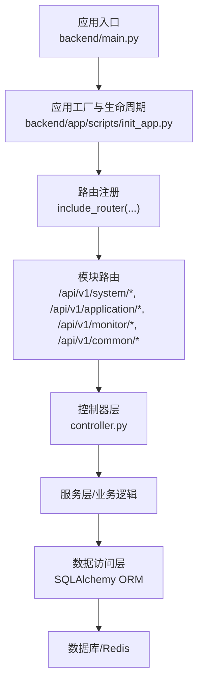
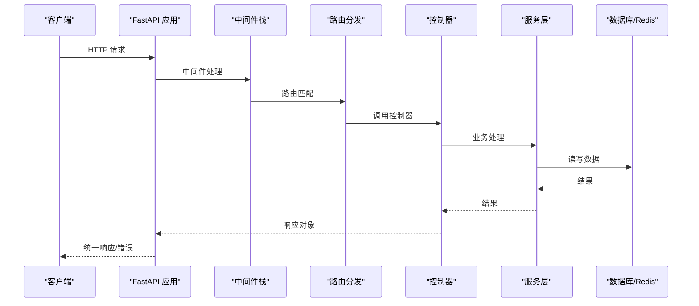
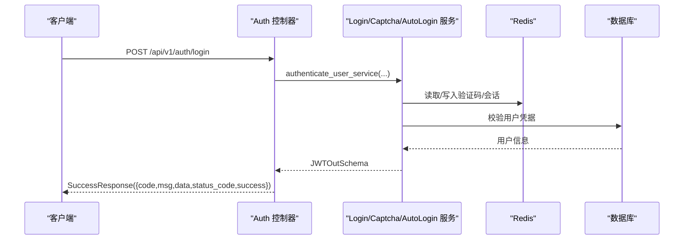
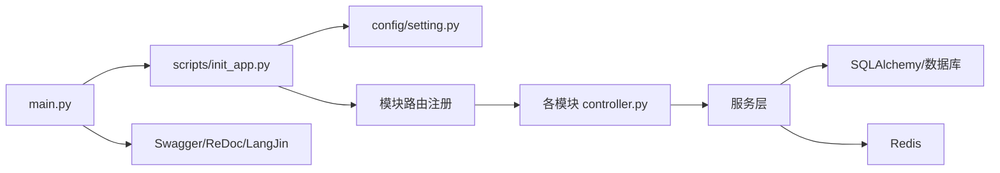

# API 参考手册

<cite>
**本文引用的文件**
- [backend/main.py](file://backend/main.py)
- [backend/app/config/setting.py](file://backend/app/config/setting.py)
- [backend/app/common/response.py](file://backend/app/common/response.py)
- [backend/app/common/request.py](file://backend/app/common/request.py)
- [backend/app/common/constant.py](file://backend/app/common/constant.py)
- [backend/app/common/enums.py](file://backend/app/common/enums.py)
- [backend/app/core/exceptions.py](file://backend/app/core/exceptions.py)
- [backend/app/core/router_class.py](file://backend/app/core/router_class.py)
- [backend/app/scripts/init_app.py](file://backend/app/scripts/init_app.py)
- [backend/app/api/v1/module_system/auth/controller.py](file://backend/app/api/v1/module_system/auth/controller.py)
- [backend/app/api/v1/module_system/user/controller.py](file://backend/app/api/v1/module_system/user/controller.py)
- [backend/app/api/v1/module_system/menu/controller.py](file://backend/app/api/v1/module_system/menu/controller.py)
- [backend/pyproject.toml](file://backend/pyproject.toml)
</cite>

## 目录
1. [简介](#简介)
2. [项目结构](#项目结构)
3. [核心组件](#核心组件)
4. [架构总览](#架构总览)
5. [详细组件分析](#详细组件分析)
6. [依赖分析](#依赖分析)
7. [性能考虑](#性能考虑)
8. [故障排查指南](#故障排查指南)
9. [结论](#结论)
10. [附录](#附录)

## 简介
本手册面向使用 FastapiAdmin 的后端开发者与集成方，提供完整、准确的 API 参考与实践指南。内容覆盖：
- API 路由与版本前缀
- 统一响应与错误模型
- 请求参数与返回结构
- 错误码体系与错误处理
- SDK 使用与客户端集成示例
- 接口版本管理、向后兼容与废弃迁移
- 接口测试与集成示例
- 扩展与自定义开发规范

## 项目结构
后端采用 FastAPI + SQLAlchemy 2.x + 异步数据库驱动的模块化架构，API 路由按模块划分（系统、监控、应用、通用），统一通过 v1 版本前缀暴露。

图表来源
- [backend/main.py:16-51](file://backend/main.py#L16-L51)
- [backend/app/scripts/init_app.py:125-160](file://backend/app/scripts/init_app.py#L125-L160)

章节来源
- [backend/main.py:16-51](file://backend/main.py#L16-L51)
- [backend/app/config/setting.py:47](file://backend/app/config/setting.py#L47)
- [backend/app/scripts/init_app.py:125-160](file://backend/app/scripts/init_app.py#L125-L160)

## 核心组件
- 应用工厂与生命周期：负责日志、中间件、路由、静态资源与文档的初始化与清理。
- 统一响应模型：SuccessResponse/ErrorResponse/StreamResponse/UploadFileResponse。
- 统一错误模型：CustomException 与全局异常处理器。
- 路由装饰器：OperationLogRoute 自动记录操作日志。
- 配置中心：Settings 提供路由前缀、文档、限流、静态资源等配置。
- 分页模型：PageResultSchema 与 PaginationService。

章节来源
- [backend/app/scripts/init_app.py:27-94](file://backend/app/scripts/init_app.py#L27-L94)
- [backend/app/common/response.py:26-176](file://backend/app/common/response.py#L26-L176)
- [backend/app/core/exceptions.py:15-248](file://backend/app/core/exceptions.py#L15-L248)
- [backend/app/core/router_class.py:24-165](file://backend/app/core/router_class.py#L24-L165)
- [backend/app/common/request.py:10-75](file://backend/app/common/request.py#L10-L75)
- [backend/app/config/setting.py:13-355](file://backend/app/config/setting.py#L13-L355)

## 架构总览
后端通过应用工厂创建 FastAPI 实例，注册中间件、异常处理器、路由与静态资源，并在生命周期内初始化 Redis、定时任务、限流器与系统配置/字典。

图表来源
- [backend/app/scripts/init_app.py:95-160](file://backend/app/scripts/init_app.py#L95-L160)
- [backend/app/core/router_class.py:27-165](file://backend/app/core/router_class.py#L27-L165)

## 详细组件分析

### 统一响应与错误模型
- 统一响应模型
  - ResponseSchema：包含 code/msg/data/status_code/success。
  - SuccessResponse：成功响应封装。
  - ErrorResponse：错误响应封装。
  - StreamResponse：流式响应。
  - UploadFileResponse：文件下载响应。
- 统一错误模型
  - CustomException：自定义异常基类。
  - 全局异常处理器：覆盖自定义异常、HTTP 异常、参数/响应验证异常、SQLAlchemy 异常、值异常、字段验证异常与通用异常。
- 错误码体系
  - RET 枚举：涵盖成功、HTTP 标准错误、服务器错误与各类业务错误码（认证授权、会话安全、权限、系统组件、任务调度、开发、服务、用户权限等）。

章节来源
- [backend/app/common/response.py:26-176](file://backend/app/common/response.py#L26-L176)
- [backend/app/core/exceptions.py:15-248](file://backend/app/core/exceptions.py#L15-L248)
- [backend/app/common/constant.py:7-213](file://backend/app/common/constant.py#L7-L213)

### 路由与版本前缀
- 根路径前缀：/api/v1（由配置项 ROOT_PATH 指定）。
- 文档路径：/docs（Swagger）、/redoc（ReDoc）、/ljdoc（LangJin）。
- 路由注册：include_router(system_router, application_router, monitor_router, common_router)，并统一加入速率限制器依赖。

章节来源
- [backend/app/config/setting.py:47](file://backend/app/config/setting.py#L47)
- [backend/app/scripts/init_app.py:125-160](file://backend/app/scripts/init_app.py#L125-L160)

### 认证授权模块（/api/v1/auth）
- 路由前缀：/api/v1/auth
- 主要接口
  - POST /login：登录，返回访问令牌与刷新令牌。
  - POST /token/refresh：刷新令牌。
  - GET /captcha/get：获取验证码。
  - POST /logout：退出登录。
  - GET /auto-login/users：获取免登录用户列表。
  - POST /auto-login/token：根据用户ID生成免登录Token。
- 控制器职责：接收请求参数，调用服务层执行业务逻辑，返回统一响应。
- 依赖注入：Redis、数据库会话、当前用户、OAuth 表单等。

图表来源
- [backend/app/api/v1/module_system/auth/controller.py:41-78](file://backend/app/api/v1/module_system/auth/controller.py#L41-L78)
- [backend/app/common/response.py:36-68](file://backend/app/common/response.py#L36-L68)

章节来源
- [backend/app/api/v1/module_system/auth/controller.py:41-200](file://backend/app/api/v1/module_system/auth/controller.py#L41-L200)

### 用户管理模块（/api/v1/user）
- 路由前缀：/api/v1/user
- 主要接口
  - GET /current/info：查询当前用户信息。
  - POST /current/avatar/upload：上传当前用户头像。
  - PUT /current/info/update：更新当前用户基本信息。
  - PUT /current/password/change：修改当前用户密码。
  - PUT /reset/password：重置密码（管理员）。
  - POST /register：注册用户。
  - POST /forget/password：忘记密码。
- 控制器职责：参数校验、调用 UserService、返回统一响应。
- 依赖注入：数据库会话、当前用户、权限校验。

章节来源
- [backend/app/api/v1/module_system/user/controller.py:33-200](file://backend/app/api/v1/module_system/user/controller.py#L33-L200)

### 菜单管理模块（/api/v1/menu）
- 路由前缀：/api/v1/menu
- 主要接口
  - GET /tree：查询菜单树。
  - GET /detail/{id}：查询菜单详情。
  - POST /create：创建菜单。
  - PUT /update/{id}：修改菜单。
  - DELETE /delete：删除菜单（批量）。
  - PATCH /available/setting：批量修改菜单状态。
- 控制器职责：参数校验、调用 MenuService、返回统一响应。
- 权限注解：AuthPermission（如 module_system:menu:*）。

章节来源
- [backend/app/api/v1/module_system/menu/controller.py:19-166](file://backend/app/api/v1/module_system/menu/controller.py#L19-L166)

### 分页与查询参数
- PageResultSchema：分页结果模型（page_no/page_size/total/has_next/items）。
- PaginationService.paginate：对内存列表进行分页（适用于非数据库场景）。

章节来源
- [backend/app/common/request.py:10-75](file://backend/app/common/request.py#L10-L75)

### 操作日志与审计
- OperationLogRoute：在路由处理前后记录请求/响应、IP、UA、耗时、描述等，支持忽略文档请求与特定函数。
- 日志记录策略：受配置开关与方法白名单控制。

章节来源
- [backend/app/core/router_class.py:24-165](file://backend/app/core/router_class.py#L24-L165)

## 依赖分析
- 应用启动流程
  - main.py 创建应用工厂，调用 init_app 注册中间件、异常、路由、静态资源与文档。
  - 生命周期内初始化数据库、Redis、定时任务、限流器与系统配置/字典。
- 依赖关系图

图表来源
- [backend/main.py:16-51](file://backend/main.py#L16-L51)
- [backend/app/scripts/init_app.py:125-200](file://backend/app/scripts/init_app.py#L125-L200)
- [backend/app/config/setting.py:315-355](file://backend/app/config/setting.py#L315-L355)

章节来源
- [backend/main.py:16-51](file://backend/main.py#L16-L51)
- [backend/app/scripts/init_app.py:125-200](file://backend/app/scripts/init_app.py#L125-L200)

## 性能考虑
- 速率限制：全局路由依赖 RateLimiter（每 10 秒 5 次），WebSocket 单独限流。
- Gzip 压缩：可配置开关与压缩级别。
- 连接池：数据库连接池大小、超时、回收策略可配置。
- 异步数据库：MySQL/PostgreSQL 使用异步驱动，提升并发性能。
- 静态资源：静态文件挂载与缓存友好路径。

章节来源
- [backend/app/scripts/init_app.py:140-160](file://backend/app/scripts/init_app.py#L140-L160)
- [backend/app/config/setting.py:167-170](file://backend/app/config/setting.py#L167-L170)
- [backend/app/config/setting.py:86-96](file://backend/app/config/setting.py#L86-L96)
- [backend/pyproject.toml:7-52](file://backend/pyproject.toml#L7-L52)

## 故障排查指南
- 常见错误码定位
  - RET 枚举中包含业务错误码（如 INVALID_*、SERVERERR、RATE_LIMIT_EXCEEDED 等），结合日志与响应体定位问题。
- 异常处理
  - 全局异常处理器会将异常转换为统一 ErrorResponse，包含 msg/code/status_code/success/data。
  - 参数/响应验证错误、数据库错误、值错误、字段验证错误均有专门处理分支。
- 日志与审计
  - OperationLogRoute 记录请求参数（限制长度）、响应状态、耗时、IP/UA、地理位置等，便于问题复盘。
- 常见问题
  - 401/403：未认证/权限不足，检查 Token 与权限策略。
  - 422：参数验证失败，检查请求体与字段类型。
  - 429：请求过于频繁，调整限流策略或客户端重试策略。
  - 5xx：服务器内部错误，查看日志与堆栈。

章节来源
- [backend/app/common/constant.py:7-213](file://backend/app/common/constant.py#L7-L213)
- [backend/app/core/exceptions.py:57-248](file://backend/app/core/exceptions.py#L57-L248)
- [backend/app/core/router_class.py:56-165](file://backend/app/core/router_class.py#L56-L165)

## 结论
本手册提供了 FastapiAdmin 后端 API 的完整参考与实践指南。通过统一响应/错误模型、完善的异常处理、可配置的中间件与限流策略，以及清晰的模块化路由设计，开发者可以高效集成与扩展系统能力。建议在生产环境中启用严格的权限控制、日志审计与限流策略，并遵循版本前缀与错误码规范进行客户端对接。

## 附录

### API 规范与示例

- 统一响应结构
  - 字段
    - code：业务状态码（整型）
    - msg：消息（字符串）
    - data：响应数据（任意类型或 null）
    - status_code：HTTP 状态码（整型）
    - success：是否成功（布尔）
  - 示例
    - 成功：code=0，success=true
    - 失败：code=4xxx/5xxx，success=false

章节来源
- [backend/app/common/response.py:26-68](file://backend/app/common/response.py#L26-L68)

- 错误码定义（节选）
  - 成功：OK/SUCCESS/CREATED/ACCEPTED/NO_CONTENT
  - HTTP 标准错误：BAD_REQUEST/UNAUTHORIZED/FORBIDDEN/NOT_FOUND/BAD_METHOD/CONFLICT/GONE/PRECONDITION_FAILED/UNSUPPORTED_MEDIA_TYPE/UNPROCESSABLE_ENTITY/TOO_MANY_REQUESTS
  - 服务器错误：INTERNAL_SERVER_ERROR/NOT_IMPLEMENTED/BAD_GATEWAY/SERVICE_UNAVAILABLE/GATEWAY_TIMEOUT/HTTP_VERSION_NOT_SUPPORTED
  - 业务错误：EXCEPTION/DATAEXIST/DATAERR/PARAMERR/IOERR/SERVERERR/UNKOWNERR/TIMEOUT/RATE_LIMIT_EXCEEDED
  - Token/认证授权/会话安全/权限/系统组件/任务调度/开发/服务/用户权限等细分错误码

章节来源
- [backend/app/common/constant.py:7-213](file://backend/app/common/constant.py#L7-L213)

- 请求与响应示例（示意）
  - 成功响应
    - HTTP/1.1 200 OK
    - Content-Type: application/json
    - {
        "code": 0,
        "msg": "成功",
        "data": { ... },
        "status_code": 200,
        "success": true
      }
  - 错误响应
    - HTTP/1.1 400 Bad Request
    - {
        "code": 4003,
        "msg": "数据已存在",
        "data": null,
        "status_code": 400,
        "success": false
      }

章节来源
- [backend/app/common/response.py:70-102](file://backend/app/common/response.py#L70-L102)
- [backend/app/common/constant.py:46-56](file://backend/app/common/constant.py#L46-L56)

### SDK 使用与客户端集成

- 基础集成步骤
  - 选择 SDK 或直接 HTTP 客户端（如 axios/fetch）。
  - 配置基础 URL 为 /api/v1。
  - 登录获取 access_token，后续请求在 Authorization 头中携带 bearer token。
  - 处理统一响应结构，依据 code/msg 判断成功与否。
- 常见流程
  - 登录 → 获取 Token → 调用受保护接口 → 退出登录/刷新 Token
- 注意事项
  - 严格遵守参数类型与必填项（422 验证错误）。
  - 遵循限流策略，避免 429。
  - 对敏感接口启用权限校验。

章节来源
- [backend/app/config/setting.py:67-78](file://backend/app/config/setting.py#L67-L78)
- [backend/app/api/v1/module_system/auth/controller.py:41-78](file://backend/app/api/v1/module_system/auth/controller.py#L41-L78)

### 接口版本管理与兼容性

- 版本前缀
  - /api/v1：当前稳定版本。
- 向后兼容
  - 新增字段采用可选，不破坏已有客户端。
  - 避免删除或重命名现有字段与接口。
- 废弃与迁移
  - 对于即将废弃的接口，保留一段时间并提供替代方案。
  - 客户端需在迁移期内兼容新旧接口，逐步切换至新接口。

章节来源
- [backend/app/config/setting.py:47](file://backend/app/config/setting.py#L47)

### 接口测试与集成示例

- 推荐测试策略
  - 单元测试：针对控制器与服务层进行 Mock 测试。
  - 集成测试：启动应用生命周期，调用真实路由，验证响应结构与业务逻辑。
  - 性能测试：模拟高并发请求，评估限流与数据库连接池表现。
- 示例要点
  - 登录接口：校验 200 与 401/422 场景。
  - 受保护接口：校验 401/403 与权限不足场景。
  - 分页接口：校验 page_no/page_size/total/has_next/items。
  - 文件上传：校验文件类型与大小限制。

章节来源
- [backend/app/api/v1/module_system/user/controller.py:56-76](file://backend/app/api/v1/module_system/user/controller.py#L56-L76)
- [backend/app/common/request.py:22-75](file://backend/app/common/request.py#L22-L75)

### 扩展与自定义开发规范

- 新增模块
  - 在 app/api/v1 下创建模块目录与 controller/service/schema。
  - 在 scripts/init_app.py 中注册模块路由。
- 自定义中间件
  - 在 settings.MIDDLEWARE_LIST 中添加中间件路径。
- 自定义异常
  - 抛出自定义异常或返回 ErrorResponse。
- 自定义文档
  - 通过 reset_api_docs 与自定义静态资源替换默认文档。

章节来源
- [backend/app/scripts/init_app.py:125-200](file://backend/app/scripts/init_app.py#L125-L200)
- [backend/app/config/setting.py:227-241](file://backend/app/config/setting.py#L227-L241)
- [backend/app/core/exceptions.py:57-248](file://backend/app/core/exceptions.py#L57-L248)