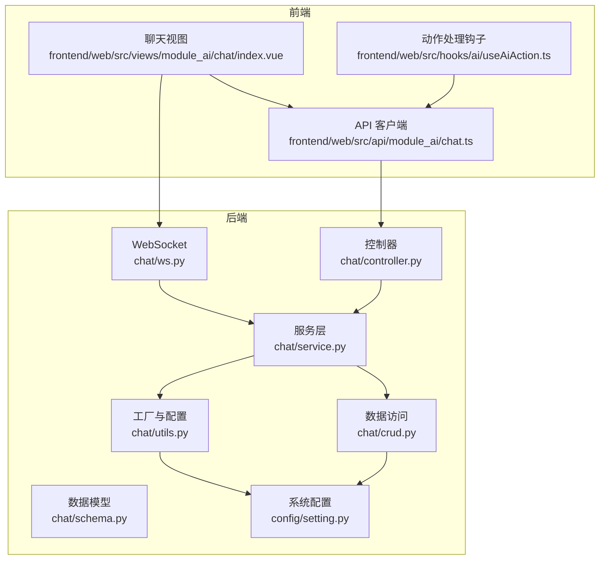
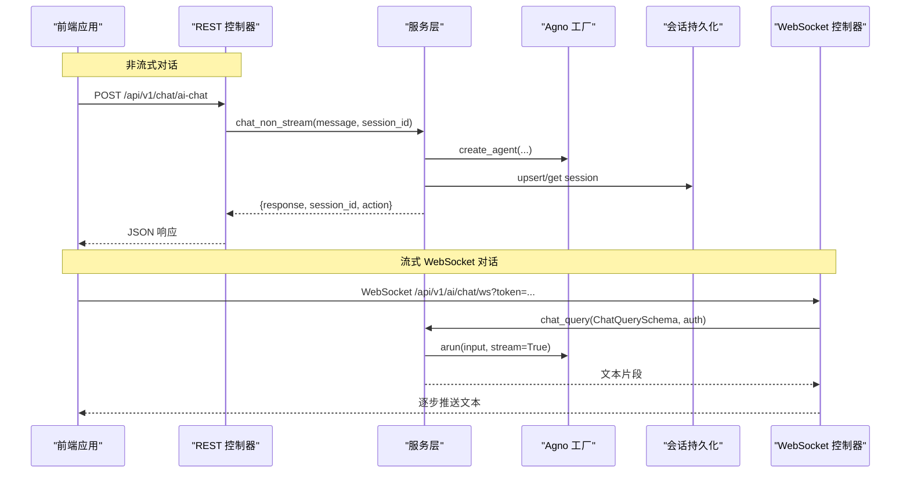
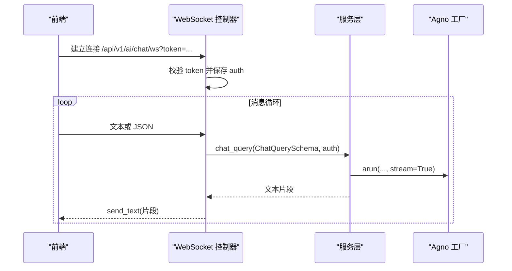
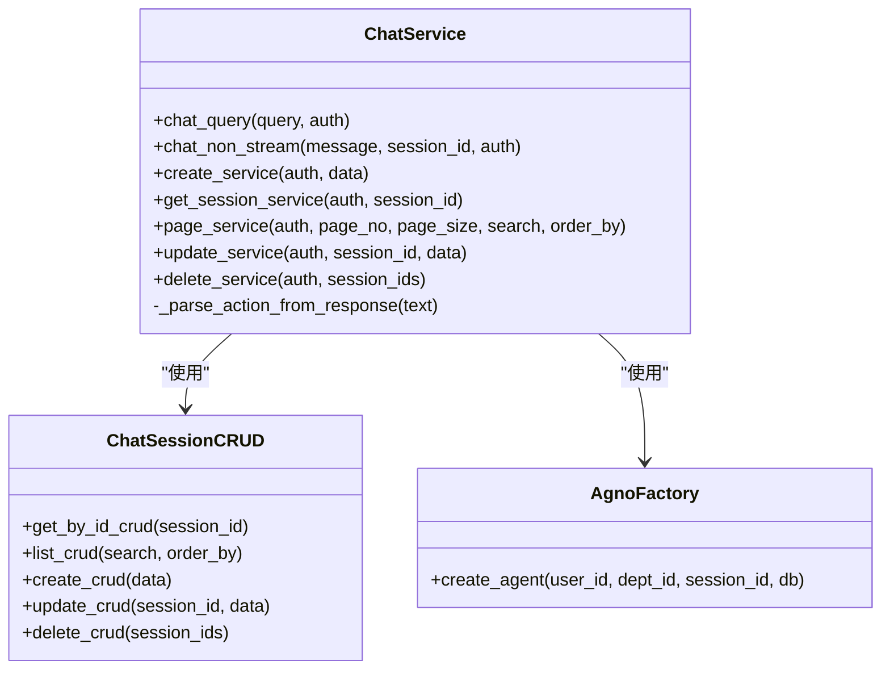
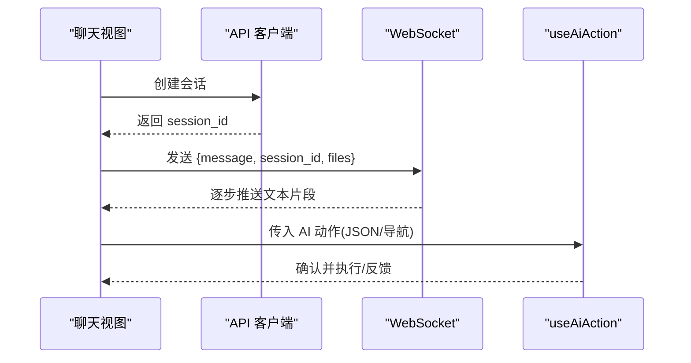
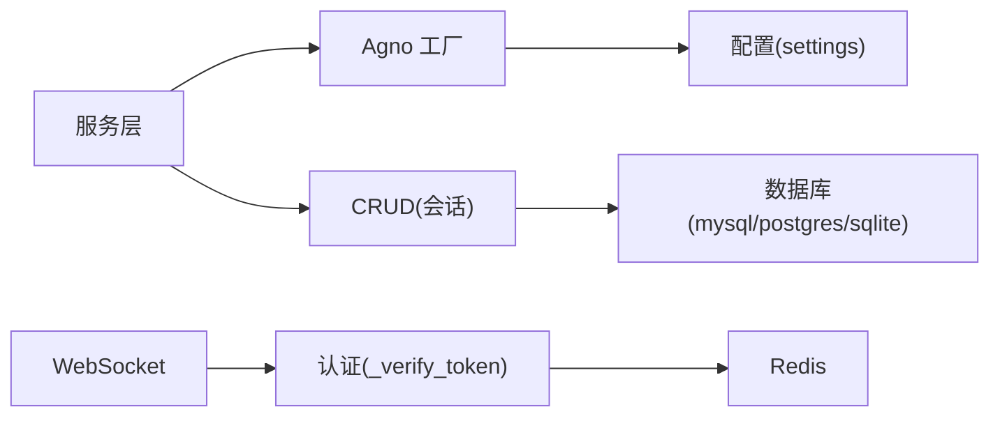

# AI智能体 API

<cite>
**本文引用的文件**
- [backend/app/plugin/module_ai/chat/controller.py](file://backend/app/plugin/module_ai/chat/controller.py)
- [backend/app/plugin/module_ai/chat/service.py](file://backend/app/plugin/module_ai/chat/service.py)
- [backend/app/plugin/module_ai/chat/schema.py](file://backend/app/plugin/module_ai/chat/schema.py)
- [backend/app/plugin/module_ai/chat/ws.py](file://backend/app/plugin/module_ai/chat/ws.py)
- [backend/app/plugin/module_ai/chat/crud.py](file://backend/app/plugin/module_ai/chat/crud.py)
- [backend/app/plugin/module_ai/chat/utils.py](file://backend/app/plugin/module_ai/chat/utils.py)
- [backend/app/config/setting.py](file://backend/app/config/setting.py)
- [frontend/web/src/api/module_ai/chat.ts](file://frontend/web/src/api/module_ai/chat.ts)
- [frontend/web/src/hooks/ai/useAiAction.ts](file://frontend/web/src/hooks/ai/useAiAction.ts)
- [frontend/web/src/views/module_ai/chat/index.vue](file://frontend/web/src/views/module_ai/chat/index.vue)
</cite>

## 目录
1. [简介](#简介)
2. [项目结构](#项目结构)
3. [核心组件](#核心组件)
4. [架构总览](#架构总览)
5. [详细组件分析](#详细组件分析)
6. [依赖分析](#依赖分析)
7. [性能考虑](#性能考虑)
8. [故障排查指南](#故障排查指南)
9. [结论](#结论)
10. [附录](#附录)

## 简介
本文件为 FastapiAdmin 项目中的 AI 智能体模块提供完整的 API 接口文档，覆盖以下方面：
- 聊天对话：REST 接口与 WebSocket 实时通信
- 会话管理：创建、查询、更新、删除与分页
- 历史记录查询：按会话聚合的消息列表
- 智能助手服务：上下文管理、多轮对话、记忆保持
- 配置参数与模型选择：OPENAI 相关配置、温度、历史轮次等
- 性能优化策略：数据库类型、连接池、流式输出
- 安全与隐私：认证、权限、错误处理与日志

## 项目结构
AI 智能体模块位于后端插件目录下，采用“按功能分层”的组织方式：
- 控制器层：定义 REST 和 WebSocket 路由
- 服务层：封装业务逻辑与 AI 能力调用
- 数据访问层：基于 agno 的会话持久化
- 工具层：AI Agent/Team 工厂与配置
- 前端对接：API 客户端、动作处理钩子、聊天界面

**图表来源**
- [backend/app/plugin/module_ai/chat/controller.py:22-196](file://backend/app/plugin/module_ai/chat/controller.py#L22-L196)
- [backend/app/plugin/module_ai/chat/service.py:126-426](file://backend/app/plugin/module_ai/chat/service.py#L126-L426)
- [backend/app/plugin/module_ai/chat/crud.py:16-177](file://backend/app/plugin/module_ai/chat/crud.py#L16-L177)
- [backend/app/plugin/module_ai/chat/utils.py:10-74](file://backend/app/plugin/module_ai/chat/utils.py#L10-L74)
- [backend/app/plugin/module_ai/chat/ws.py:13-110](file://backend/app/plugin/module_ai/chat/ws.py#L13-L110)
- [backend/app/config/setting.py:207-217](file://backend/app/config/setting.py#L207-L217)
- [frontend/web/src/api/module_ai/chat.ts:12-59](file://frontend/web/src/api/module_ai/chat.ts#L12-L59)
- [frontend/web/src/views/module_ai/chat/index.vue:53-297](file://frontend/web/src/views/module_ai/chat/index.vue#L53-L297)
- [frontend/web/src/hooks/ai/useAiAction.ts:15-218](file://frontend/web/src/hooks/ai/useAiAction.ts#L15-L218)

**章节来源**
- [backend/app/plugin/module_ai/chat/controller.py:22-196](file://backend/app/plugin/module_ai/chat/controller.py#L22-L196)
- [backend/app/plugin/module_ai/chat/ws.py:13-110](file://backend/app/plugin/module_ai/chat/ws.py#L13-L110)
- [backend/app/plugin/module_ai/chat/service.py:126-426](file://backend/app/plugin/module_ai/chat/service.py#L126-L426)
- [backend/app/plugin/module_ai/chat/crud.py:16-177](file://backend/app/plugin/module_ai/chat/crud.py#L16-L177)
- [backend/app/plugin/module_ai/chat/utils.py:10-74](file://backend/app/plugin/module_ai/chat/utils.py#L10-L74)
- [backend/app/config/setting.py:207-217](file://backend/app/config/setting.py#L207-L217)
- [frontend/web/src/api/module_ai/chat.ts:12-59](file://frontend/web/src/api/module_ai/chat.ts#L12-L59)
- [frontend/web/src/views/module_ai/chat/index.vue:53-297](file://frontend/web/src/views/module_ai/chat/index.vue#L53-L297)
- [frontend/web/src/hooks/ai/useAiAction.ts:15-218](file://frontend/web/src/hooks/ai/useAiAction.ts#L15-L218)

## 核心组件
- REST 路由与控制器
  - 会话管理：获取详情、列表分页、创建、更新、删除
  - 非流式对话：一次性返回完整响应
- WebSocket 路由与控制器
  - 实时对话：纯文本或 JSON 格式消息
- 服务层
  - 流式与非流式对话处理
  - 会话生命周期管理与格式化
  - 操作建议解析与导航动作
- 数据访问层
  - 基于 agno 的 Team 会话持久化
  - 支持 MySQL、PostgreSQL、SQLite
- 工具层
  - Agent/Team 工厂，统一配置模型、温度、历史轮次等
- 前端对接
  - API 客户端封装
  - WebSocket 连接与消息收发
  - AI 动作处理钩子

**章节来源**
- [backend/app/plugin/module_ai/chat/controller.py:25-196](file://backend/app/plugin/module_ai/chat/controller.py#L25-L196)
- [backend/app/plugin/module_ai/chat/ws.py:20-110](file://backend/app/plugin/module_ai/chat/ws.py#L20-L110)
- [backend/app/plugin/module_ai/chat/service.py:126-426](file://backend/app/plugin/module_ai/chat/service.py#L126-L426)
- [backend/app/plugin/module_ai/chat/crud.py:16-177](file://backend/app/plugin/module_ai/chat/crud.py#L16-L177)
- [backend/app/plugin/module_ai/chat/utils.py:10-74](file://backend/app/plugin/module_ai/chat/utils.py#L10-L74)
- [frontend/web/src/api/module_ai/chat.ts:12-59](file://frontend/web/src/api/module_ai/chat.ts#L12-L59)
- [frontend/web/src/views/module_ai/chat/index.vue:76-223](file://frontend/web/src/views/module_ai/chat/index.vue#L76-L223)
- [frontend/web/src/hooks/ai/useAiAction.ts:15-218](file://frontend/web/src/hooks/ai/useAiAction.ts#L15-L218)

## 架构总览
AI 智能体模块采用“控制器-服务-数据访问-工厂-配置”的分层架构，结合 agno 的 Team/Agent 能力实现多轮对话与记忆保持。

**图表来源**
- [backend/app/plugin/module_ai/chat/controller.py:161-196](file://backend/app/plugin/module_ai/chat/controller.py#L161-L196)
- [backend/app/plugin/module_ai/chat/service.py:129-264](file://backend/app/plugin/module_ai/chat/service.py#L129-L264)
- [backend/app/plugin/module_ai/chat/ws.py:20-97](file://backend/app/plugin/module_ai/chat/ws.py#L20-L97)
- [backend/app/plugin/module_ai/chat/utils.py:19-71](file://backend/app/plugin/module_ai/chat/utils.py#L19-L71)
- [backend/app/plugin/module_ai/chat/crud.py:96-133](file://backend/app/plugin/module_ai/chat/crud.py#L96-L133)

## 详细组件分析

### REST 接口规范
- 会话管理
  - GET /api/v1/chat/detail/{session_id}
    - 权限：module_ai:chat:detail
    - 返回：会话详情（含格式化消息列表、标题、时间等）
  - GET /api/v1/chat/list
    - 权限：module_ai:chat:query
    - 查询参数：分页(page_no/page_size)、标题(title)、创建/更新时间范围(created_at/updated_at)
    - 返回：分页结果(items, total)
  - POST /api/v1/chat/create
    - 权限：module_ai:chat:create
    - 请求体：ChatSessionCreateSchema(title)
    - 返回：创建后的会话
  - PUT /api/v1/chat/update/{session_id}
    - 权限：module_ai:chat:update
    - 请求体：ChatSessionUpdateSchema(title)
    - 返回：空
  - DELETE /api/v1/chat/delete
    - 权限：module_ai:chat:delete
    - 请求体：session_ids(list[str])
    - 返回：空
- 非流式对话
  - POST /api/v1/chat/ai-chat
    - 权限：module_ai:chat:query
    - 请求体：AiChatRequestSchema(message, session_id?)
    - 返回：AiChatResponseSchema(response, session_id, function_calls?, action?)

**章节来源**
- [backend/app/plugin/module_ai/chat/controller.py:25-196](file://backend/app/plugin/module_ai/chat/controller.py#L25-L196)
- [backend/app/plugin/module_ai/chat/schema.py:17-71](file://backend/app/plugin/module_ai/chat/schema.py#L17-L71)

### WebSocket 接口规范
- 路由：GET /api/v1/ai/chat/ws?token={jwt}
- 连接建立：认证通过后接受连接，保存用户信息至 websocket.state.auth
- 消息格式：
  - 纯文本：直接发送消息内容
  - JSON：{"message": "...", "session_id": "...", "files": [...]}
- 流式输出：服务层以异步生成器逐段返回文本片段，前端拼接并滚动到底部
- 错误处理：连接失败、认证失败、消息格式错误、异常均通过 send_text 反馈

**图表来源**
- [backend/app/plugin/module_ai/chat/ws.py:20-97](file://backend/app/plugin/module_ai/chat/ws.py#L20-L97)
- [backend/app/plugin/module_ai/chat/service.py:129-178](file://backend/app/plugin/module_ai/chat/service.py#L129-L178)
- [backend/app/plugin/module_ai/chat/utils.py:19-71](file://backend/app/plugin/module_ai/chat/utils.py#L19-L71)

**章节来源**
- [backend/app/plugin/module_ai/chat/ws.py:20-110](file://backend/app/plugin/module_ai/chat/ws.py#L20-L110)

### 服务层与数据模型
- 服务层职责
  - chat_query：创建/获取会话，构建 Agent/Team，流式返回文本片段
  - chat_non_stream：创建/获取会话，执行一次完整推理，返回 response/session_id/action
  - 会话管理：create/get/page/update/delete，格式化消息列表与时间
  - 操作建议解析：从响应中提取 JSON 或自然语言导航意图，映射到前端路由
- 数据模型
  - ChatQuerySchema：WebSocket 输入模型
  - ChatSessionCreateSchema/UpdateSchema：会话创建/更新
  - AiChatRequestSchema/AiChatResponseSchema：非流式对话请求/响应
  - ChatSessionQueryParam：会话分页查询参数

**图表来源**
- [backend/app/plugin/module_ai/chat/service.py:126-426](file://backend/app/plugin/module_ai/chat/service.py#L126-L426)
- [backend/app/plugin/module_ai/chat/crud.py:16-177](file://backend/app/plugin/module_ai/chat/crud.py#L16-L177)
- [backend/app/plugin/module_ai/chat/utils.py:10-74](file://backend/app/plugin/module_ai/chat/utils.py#L10-L74)

**章节来源**
- [backend/app/plugin/module_ai/chat/service.py:126-426](file://backend/app/plugin/module_ai/chat/service.py#L126-L426)
- [backend/app/plugin/module_ai/chat/schema.py:10-71](file://backend/app/plugin/module_ai/chat/schema.py#L10-L71)
- [backend/app/plugin/module_ai/chat/crud.py:16-177](file://backend/app/plugin/module_ai/chat/crud.py#L16-L177)

### 前端集成与交互
- API 客户端
  - 会话列表、创建、更新、删除、详情查询
  - 非流式对话调用
- WebSocket
  - 连接状态管理：connected/connecting/disconnected
  - 发送消息：JSON 格式，包含 message、session_id、files
  - 流式接收：拼接到最后一条 assistant 消息
- AI 动作处理
  - 解析 AI 返回的操作建议，支持确认、执行、反馈与刷新
  - 支持自动搜索与后端命令执行

**图表来源**
- [frontend/web/src/views/module_ai/chat/index.vue:76-223](file://frontend/web/src/views/module_ai/chat/index.vue#L76-L223)
- [frontend/web/src/api/module_ai/chat.ts:12-59](file://frontend/web/src/api/module_ai/chat.ts#L12-L59)
- [frontend/web/src/hooks/ai/useAiAction.ts:25-105](file://frontend/web/src/hooks/ai/useAiAction.ts#L25-L105)

**章节来源**
- [frontend/web/src/views/module_ai/chat/index.vue:53-297](file://frontend/web/src/views/module_ai/chat/index.vue#L53-L297)
- [frontend/web/src/api/module_ai/chat.ts:12-59](file://frontend/web/src/api/module_ai/chat.ts#L12-L59)
- [frontend/web/src/hooks/ai/useAiAction.ts:15-218](file://frontend/web/src/hooks/ai/useAiAction.ts#L15-L218)

## 依赖分析
- 外部依赖
  - agno：Agent/Team、会话持久化、模型调用
  - FastAPI：路由、WebSocket、依赖注入
  - Pydantic：数据校验与序列化
- 配置依赖
  - OPENAI_BASE_URL/API_KEY/MODEL：模型接入
  - DATABASE_TYPE/DB_URI/DATABASE_NAME：数据库类型与连接
  - REDIS：认证与缓存（WebSocket 中使用）

**图表来源**
- [backend/app/plugin/module_ai/chat/service.py:160-218](file://backend/app/plugin/module_ai/chat/service.py#L160-L218)
- [backend/app/plugin/module_ai/chat/utils.py:53-71](file://backend/app/plugin/module_ai/chat/utils.py#L53-L71)
- [backend/app/config/setting.py:97-114](file://backend/app/config/setting.py#L97-L114)
- [backend/app/plugin/module_ai/chat/ws.py:46-53](file://backend/app/plugin/module_ai/chat/ws.py#L46-L53)

**章节来源**
- [backend/app/plugin/module_ai/chat/utils.py:10-74](file://backend/app/plugin/module_ai/chat/utils.py#L10-L74)
- [backend/app/config/setting.py:97-114](file://backend/app/config/setting.py#L97-L114)
- [backend/app/plugin/module_ai/chat/ws.py:42-53](file://backend/app/plugin/module_ai/chat/ws.py#L42-L53)

## 性能考虑
- 数据库类型与连接
  - 支持 mysql/postgres/sqlite，根据 DATABASE_TYPE 选择对应驱动
  - 连接池参数：POOL_SIZE、MAX_OVERFLOW、POOL_TIMEOUT、POOL_RECYCLE
- 模型与上下文
  - 温度：0.7；历史轮次：3；启用时间与历史上下文注入
  - Markdown 输出与响应解析，减少前端渲染负担
- 流式输出
  - WebSocket 使用异步生成器，边生成边推送，降低首屏延迟
- 前端优化
  - 长消息折叠、滚动到底部、加载中状态，提升交互体验

**章节来源**
- [backend/app/config/setting.py:82-114](file://backend/app/config/setting.py#L82-L114)
- [backend/app/plugin/module_ai/chat/utils.py:13-17](file://backend/app/plugin/module_ai/chat/utils.py#L13-L17)
- [backend/app/plugin/module_ai/chat/service.py:171-173](file://backend/app/plugin/module_ai/chat/service.py#L171-L173)
- [frontend/web/src/views/module_ai/chat/index.vue:140-151](file://frontend/web/src/views/module_ai/chat/index.vue#L140-L151)

## 故障排查指南
- WebSocket 连接失败
  - 检查 token 是否提供与有效
  - 查看后端日志：认证失败、连接关闭、发送错误
- 消息格式错误
  - 确保发送 JSON：{"message","session_id","files"}
  - 前端会在格式错误时提示
- 会话管理异常
  - 确认权限：module_ai:chat:* 对应操作
  - 检查数据库连接与 agno 会话持久化
- 非流式对话报错
  - 查看服务层异常捕获与返回错误文本
  - 确认 OPENAI 配置正确

**章节来源**
- [backend/app/plugin/module_ai/chat/ws.py:42-97](file://backend/app/plugin/module_ai/chat/ws.py#L42-L97)
- [backend/app/plugin/module_ai/chat/controller.py:161-196](file://backend/app/plugin/module_ai/chat/controller.py#L161-L196)
- [backend/app/plugin/module_ai/chat/service.py:175-177](file://backend/app/plugin/module_ai/chat/service.py#L175-L177)

## 结论
AI 智能体模块通过清晰的分层设计与 agno 能力，提供了完整的对话、会话管理与实时通信能力。REST 接口满足常规场景，WebSocket 实现低延迟的流式交互；服务层封装了上下文管理、多轮对话与动作解析；前端提供直观的聊天界面与动作处理钩子。配合完善的配置与性能优化策略，可在不同数据库与模型环境下稳定运行。

## 附录

### API 定义与示例

- 会话详情
  - 方法：GET
  - 路径：/api/v1/chat/detail/{session_id}
  - 权限：module_ai:chat:detail
  - 响应：会话详情（包含格式化消息列表、标题、时间等）
- 会话列表
  - 方法：GET
  - 路径：/api/v1/chat/list
  - 权限：module_ai:chat:query
  - 查询参数：page_no, page_size, title, created_at[], updated_at[]
  - 响应：分页结果
- 创建会话
  - 方法：POST
  - 路径：/api/v1/chat/create
  - 权限：module_ai:chat:create
  - 请求体：{"title": "新对话"}
  - 响应：创建后的会话
- 更新会话
  - 方法：PUT
  - 路径：/api/v1/chat/update/{session_id}
  - 权限：module_ai:chat:update
  - 请求体：{"title": "新标题"}
  - 响应：空
- 删除会话
  - 方法：DELETE
  - 路径：/api/v1/chat/delete
  - 权限：module_ai:chat:delete
  - 请求体：["sid1","sid2"]
  - 响应：空
- 非流式对话
  - 方法：POST
  - 路径：/api/v1/chat/ai-chat
  - 权限：module_ai:chat:query
  - 请求体：{"message": "...", "session_id": "sid?"}
  - 响应：{"response","session_id","function_calls?","action?"}

**章节来源**
- [backend/app/plugin/module_ai/chat/controller.py:25-196](file://backend/app/plugin/module_ai/chat/controller.py#L25-L196)
- [backend/app/plugin/module_ai/chat/schema.py:59-71](file://backend/app/plugin/module_ai/chat/schema.py#L59-L71)

### WebSocket 协议与事件
- 连接
  - 地址：/api/v1/ai/chat/ws?token={jwt}
  - 状态：connected/connecting/disconnected
- 发送消息
  - 纯文本：直接发送
  - JSON：{"message":"...","session_id":"...","files":[{"name","type","size"}]}
- 接收消息
  - 流式文本片段，前端拼接到最后一条 assistant 消息
- 断开与错误
  - 关闭码：1000（用户主动断开）
  - 错误：连接失败、认证失败、格式错误、异常

**章节来源**
- [backend/app/plugin/module_ai/chat/ws.py:20-110](file://backend/app/plugin/module_ai/chat/ws.py#L20-L110)
- [frontend/web/src/views/module_ai/chat/index.vue:76-137](file://frontend/web/src/views/module_ai/chat/index.vue#L76-L137)

### 配置参数与模型选择
- AI 模型配置
  - OPENAI_BASE_URL：模型基础地址
  - OPENAI_API_KEY：API 密钥
  - OPENAI_MODEL：模型 ID
- 运行参数
  - AGENT_TEMPERATURE：0.7
  - NUM_HISTORY_RUNS：3
  - add_datetime_to_context：启用
  - add_history_to_context：启用
  - markdown：启用
  - parse_response：启用
  - read_chat_history：启用
- 数据库配置
  - DATABASE_TYPE：mysql/postgres/sqlite
  - DB_URI：数据库连接串
  - DATABASE_NAME：数据库名（部分类型）

**章节来源**
- [backend/app/config/setting.py:207-217](file://backend/app/config/setting.py#L207-L217)
- [backend/app/plugin/module_ai/chat/utils.py:13-17](file://backend/app/plugin/module_ai/chat/utils.py#L13-L17)
- [backend/app/plugin/module_ai/chat/utils.py:53-71](file://backend/app/plugin/module_ai/chat/utils.py#L53-L71)

### 安全与隐私
- 认证与权限
  - 所有路由均依赖 AuthPermission，需具备相应权限
  - WebSocket 通过 token 校验并保存用户信息
- 日志与审计
  - 操作日志记录（可配置）
  - 错误与异常日志输出
- 数据隔离
  - 会话按 user_id/team_id 隔离
  - CRUD 层限定当前用户可见范围

**章节来源**
- [backend/app/plugin/module_ai/chat/controller.py:31-158](file://backend/app/plugin/module_ai/chat/controller.py#L31-L158)
- [backend/app/plugin/module_ai/chat/ws.py:42-53](file://backend/app/plugin/module_ai/chat/ws.py#L42-L53)
- [backend/app/plugin/module_ai/chat/crud.py:22-27](file://backend/app/plugin/module_ai/chat/crud.py#L22-L27)