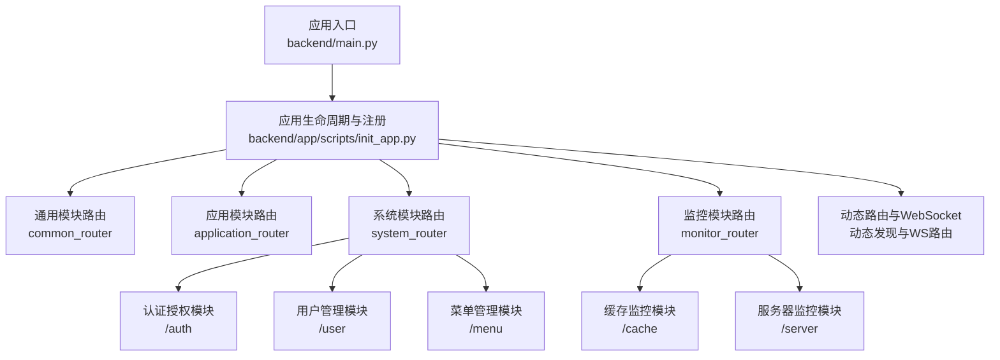
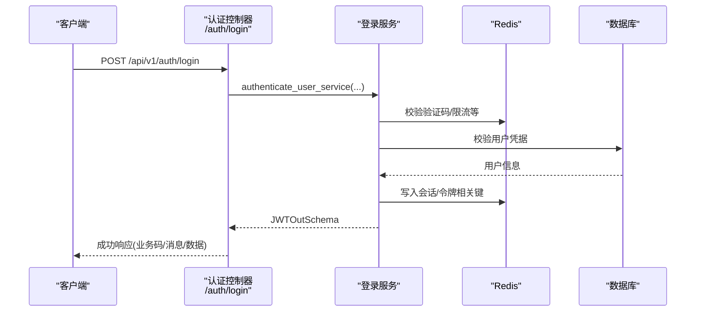
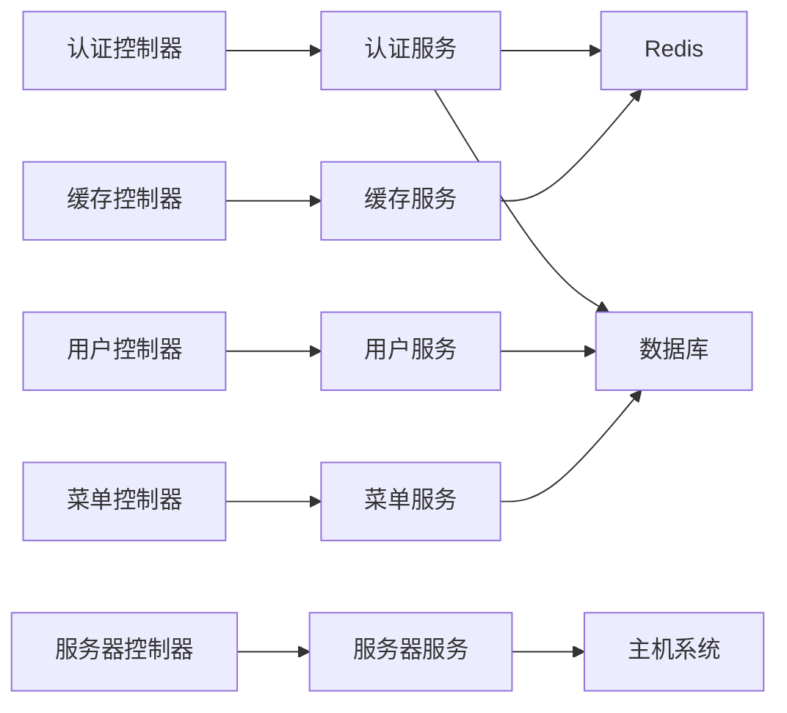

# API 接口文档

<cite>
**本文引用的文件**
- [backend/main.py](file://backend/main.py)
- [backend/app/scripts/init_app.py](file://backend/app/scripts/init_app.py)
- [backend/app/api/v1/module_system/auth/controller.py](file://backend/app/api/v1/module_system/auth/controller.py)
- [backend/app/api/v1/module_system/auth/schema.py](file://backend/app/api/v1/module_system/auth/schema.py)
- [backend/app/api/v1/module_system/user/controller.py](file://backend/app/api/v1/module_system/user/controller.py)
- [backend/app/api/v1/module_system/user/schema.py](file://backend/app/api/v1/module_system/user/schema.py)
- [backend/app/api/v1/module_system/menu/controller.py](file://backend/app/api/v1/module_system/menu/controller.py)
- [backend/app/api/v1/module_system/menu/schema.py](file://backend/app/api/v1/module_system/menu/schema.py)
- [backend/app/api/v1/module_monitor/cache/controller.py](file://backend/app/api/v1/module_monitor/cache/controller.py)
- [backend/app/api/v1/module_monitor/cache/schema.py](file://backend/app/api/v1/module_monitor/cache/schema.py)
- [backend/app/api/v1/module_monitor/server/controller.py](file://backend/app/api/v1/module_monitor/server/controller.py)
- [backend/app/api/v1/module_monitor/server/schema.py](file://backend/app/api/v1/module_monitor/server/schema.py)
- [backend/app/common/response.py](file://backend/app/common/response.py)
</cite>

## 目录
1. [简介](#简介)
2. [项目结构](#项目结构)
3. [核心组件](#核心组件)
4. [架构总览](#架构总览)
5. [详细组件分析](#详细组件分析)
6. [依赖分析](#依赖分析)
7. [性能考虑](#性能考虑)
8. [故障排查指南](#故障排查指南)
9. [结论](#结论)
10. [附录](#附录)

## 简介
本文件为 FastapiAdmin 的完整 API 接口文档，覆盖系统管理、监控管理、任务管理（工作流与定时任务）、开发工具等模块。文档按功能模块组织，逐项说明接口的 HTTP 方法、URL 模式、请求参数、响应格式、错误码、认证与权限控制、安全考虑、版本管理与迁移建议，并提供参数说明、数据类型定义与业务规则约束。

## 项目结构
后端采用 FastAPI 架构，通过统一的路由注册与中间件体系对外暴露 API。应用启动时完成日志、中间件、路由、静态资源与自定义文档页面的初始化。各模块在 v1 版本下按领域拆分控制器、服务、模型与 Schema，遵循清晰的职责边界。

图表来源
- [backend/main.py:16-51](file://backend/main.py#L16-L51)
- [backend/app/scripts/init_app.py:125-158](file://backend/app/scripts/init_app.py#L125-L158)

章节来源
- [backend/main.py:16-51](file://backend/main.py#L16-L51)
- [backend/app/scripts/init_app.py:125-158](file://backend/app/scripts/init_app.py#L125-L158)

## 核心组件
- 统一响应模型与响应封装
  - 成功/错误/流式响应统一封装于响应模型，便于前端统一处理。
  - 响应模型包含业务状态码、HTTP 状态码、消息与数据体。
- 认证与权限
  - 登录采用 JWT 令牌；提供刷新、退出、验证码、免登录与 OAuth 第三方登录。
  - 权限控制基于路径级权限点与数据域校验，部分接口依赖当前用户上下文。
- 速率限制
  - 通用路由组默认启用速率限制器，WebSocket 单独配置。
- 文档与自定义 UI
  - 提供 Swagger UI、ReDoc 与自定义 LangJin UI，支持本地静态资源。

章节来源
- [backend/app/common/response.py:26-102](file://backend/app/common/response.py#L26-L102)
- [backend/app/scripts/init_app.py:140-150](file://backend/app/scripts/init_app.py#L140-L150)
- [backend/app/scripts/init_app.py:182-226](file://backend/app/scripts/init_app.py#L182-L226)

## 架构总览
以下序列图展示典型登录流程，从客户端发起登录请求到服务端返回 JWT 令牌与刷新令牌，并记录操作日志。

图表来源
- [backend/app/api/v1/module_system/auth/controller.py:41-78](file://backend/app/api/v1/module_system/auth/controller.py#L41-L78)
- [backend/app/api/v1/module_system/auth/schema.py:42-51](file://backend/app/api/v1/module_system/auth/schema.py#L42-L51)

章节来源
- [backend/app/api/v1/module_system/auth/controller.py:41-78](file://backend/app/api/v1/module_system/auth/controller.py#L41-L78)
- [backend/app/api/v1/module_system/auth/schema.py:42-51](file://backend/app/api/v1/module_system/auth/schema.py#L42-L51)

## 详细组件分析

### 系统管理

#### 认证授权模块（/auth）
- 登录
  - 方法与路径: POST /api/v1/auth/login
  - 认证方式: 表单认证（用户名/密码），支持验证码与限流
  - 请求参数: 取决于自定义表单解析器
  - 响应: JWTOutSchema（包含访问令牌、刷新令牌、类型与过期时间）
  - 错误码: 业务状态码由统一响应模型承载
  - 使用场景: 用户登录获取令牌
- 刷新令牌
  - 方法与路径: POST /api/v1/auth/token/refresh
  - 认证方式: 依赖当前用户上下文（携带有效访问令牌）
  - 请求参数: RefreshTokenPayloadSchema（刷新令牌）
  - 响应: JWTOutSchema
  - 使用场景: 到期前续签
- 获取验证码
  - 方法与路径: GET /api/v1/auth/captcha/get
  - 认证方式: 无需登录
  - 响应: CaptchaOutSchema（启用状态、验证码键、Base64 图片）
  - 使用场景: 登录页图形验证码
- 退出登录
  - 方法与路径: POST /api/v1/auth/logout
  - 认证方式: 依赖当前用户上下文
  - 请求参数: LogoutPayloadSchema（待注销的 token）
  - 响应: 统一成功/错误响应
  - 使用场景: 主动登出
- 免登录用户列表
  - 方法与路径: GET /api/v1/auth/auto-login/users
  - 认证方式: 无需登录
  - 响应: 免登录用户列表
  - 使用场景: 快速选择免登录用户
- 获取免登录 Token
  - 方法与路径: POST /api/v1/auth/auto-login/token
  - 认证方式: 无需登录
  - 请求参数: 用户ID
  - 响应: AutoLoginTokenSchema（免登录 Token 与用户信息）
  - 使用场景: 生成免登令牌
- 免登录
  - 方法与路径: POST /api/v1/auth/auto-login
  - 认证方式: 无需登录
  - 请求参数: 免登录 Token
  - 响应: JWTOutSchema
  - 使用场景: 使用免登令牌换取正式令牌
- 第三方 OAuth 登录
  - 方法与路径: GET /api/v1/auth/oauth/{provider}/login
  - 查询参数: redirect_uri（授权完成后回跳前端登录页）
  - 响应: 302 重定向至第三方授权页
  - 回调: GET /api/v1/auth/oauth/{provider}/callback
  - 查询参数: code、state
  - 响应: 302 重定向至前端登录页并附带令牌或错误信息
  - 支持渠道: wechat、qq、github、gitee
  - 使用场景: 社交账号一键登录

章节来源
- [backend/app/api/v1/module_system/auth/controller.py:41-349](file://backend/app/api/v1/module_system/auth/controller.py#L41-L349)
- [backend/app/api/v1/module_system/auth/schema.py:9-93](file://backend/app/api/v1/module_system/auth/schema.py#L9-L93)

#### 用户管理模块（/user）
- 查询当前用户信息
  - 方法与路径: GET /api/v1/user/current/info
  - 认证方式: 依赖当前用户上下文
  - 响应: 当前用户信息
  - 使用场景: 个人资料查看
- 上传当前用户头像
  - 方法与路径: POST /api/v1/user/current/avatar/upload
  - 认证方式: 依赖当前用户上下文
  - 请求: multipart/form-data（文件）
  - 响应: 头像访问地址
  - 使用场景: 更换头像
- 更新当前用户基本信息
  - 方法与路径: PUT /api/v1/user/current/info/update
  - 认证方式: 依赖当前用户上下文
  - 请求: CurrentUserUpdateSchema
  - 响应: 更新后的用户信息
  - 使用场景: 修改昵称、手机、邮箱、性别等
- 修改当前用户密码
  - 方法与路径: PUT /api/v1/user/current/password/change
  - 认证方式: 依赖当前用户上下文
  - 请求: UserChangePasswordSchema（旧密码、新密码）
  - 响应: 提示“请重新登录”
  - 使用场景: 修改个人密码
- 重置密码
  - 方法与路径: PUT /api/v1/user/reset/password
  - 认证方式: 依赖当前用户上下文
  - 请求: ResetPasswordSchema（目标用户ID与新密码）
  - 响应: 重置结果
  - 使用场景: 管理员重置他人密码
- 注册用户
  - 方法与路径: POST /api/v1/user/register
  - 认证方式: 无需登录
  - 请求: UserRegisterSchema
  - 响应: 注册结果
  - 使用场景: 公开注册
- 忘记密码
  - 方法与路径: POST /api/v1/user/forget/password
  - 认证方式: 无需登录
  - 请求: UserForgetPasswordSchema
  - 响应: 重置结果
  - 使用场景: 忘记密码找回
- 查询用户列表
  - 方法与路径: GET /api/v1/user/list
  - 认证方式: 依赖权限点 module_system:user:query
  - 查询参数: 分页参数、UserQueryParam（模糊/精确/范围）
  - 响应: 分页结果
  - 使用场景: 管理后台用户列表
- 查询用户详情
  - 方法与路径: GET /api/v1/user/detail/{id}
  - 认证方式: 依赖权限点 module_system:user:detail
  - 路径参数: 用户ID
  - 响应: 用户详情
  - 使用场景: 查看用户档案
- 创建用户
  - 方法与路径: POST /api/v1/user/create
  - 认证方式: 依赖权限点 module_system:user:create
  - 请求: UserCreateSchema
  - 响应: 新建用户信息
  - 使用场景: 管理员新增用户
- 修改用户
  - 方法与路径: PUT /api/v1/user/update/{id}
  - 认证方式: 依赖权限点 module_system:user:update
  - 请求: UserUpdateSchema
  - 响应: 更新后用户信息
  - 使用场景: 管理员编辑用户
- 删除用户
  - 方法与路径: DELETE /api/v1/user/delete
  - 认证方式: 依赖权限点 module_system:user:delete
  - 请求体: ID 列表
  - 响应: 删除结果
  - 使用场景: 批量删除用户
- 批量修改用户状态
  - 方法与路径: PATCH /api/v1/user/available/setting
  - 认证方式: 依赖权限点 module_system:user:patch
  - 请求: BatchSetAvailable（ID 列表与目标状态）
  - 响应: 设置结果
  - 使用场景: 批量启停用户
- 导出用户模板
  - 方法与路径: POST /api/v1/user/import/template
  - 认证方式: 依赖权限点 module_system:user:download
  - 响应: Excel 模板文件流
  - 使用场景: 下载导入模板
- 导出用户
  - 方法与路径: POST /api/v1/user/export
  - 认证方式: 依赖权限点 module_system:user:export
  - 查询参数: 分页与搜索条件
  - 响应: Excel 文件流
  - 使用场景: 导出用户数据
- 导入用户
  - 方法与路径: POST /api/v1/user/import/data
  - 认证方式: 依赖权限点 module_system:user:import
  - 请求: multipart/form-data（Excel 文件）
  - 响应: 导入结果（含新增/更新统计）
  - 使用场景: 批量导入用户

章节来源
- [backend/app/api/v1/module_system/user/controller.py:33-456](file://backend/app/api/v1/module_system/user/controller.py#L33-L456)
- [backend/app/api/v1/module_system/user/schema.py:20-310](file://backend/app/api/v1/module_system/user/schema.py#L20-L310)

#### 菜单管理模块（/menu）
- 查询菜单树
  - 方法与路径: GET /api/v1/menu/tree
  - 认证方式: 依赖权限点 module_system:menu:query
  - 查询参数: MenuQueryParam
  - 响应: 菜单树（按顺序排序）
  - 使用场景: 构建前端菜单树
- 查询菜单详情
  - 方法与路径: GET /api/v1/menu/detail/{id}
  - 认证方式: 依赖权限点 module_system:menu:detail
  - 路径参数: 菜单ID
  - 响应: 菜单详情
  - 使用场景: 查看菜单配置
- 创建菜单
  - 方法与路径: POST /api/v1/menu/create
  - 认证方式: 依赖权限点 module_system:menu:create
  - 请求: MenuCreateSchema
  - 响应: 新建菜单
  - 使用场景: 新增菜单/按钮/外链
- 修改菜单
  - 方法与路径: PUT /api/v1/menu/update/{id}
  - 认证方式: 依赖权限点 module_system:menu:update
  - 请求: MenuUpdateSchema
  - 响应: 更新后菜单
  - 使用场景: 编辑菜单配置
- 删除菜单
  - 方法与路径: DELETE /api/v1/menu/delete
  - 认证方式: 依赖权限点 module_system:menu:delete
  - 请求体: ID 列表
  - 响应: 删除结果
  - 使用场景: 批量删除菜单
- 批量修改菜单状态
  - 方法与路径: PATCH /api/v1/menu/available/setting
  - 认证方式: 依赖权限点 module_system:menu:patch
  - 请求: BatchSetAvailable
  - 响应: 设置结果
  - 使用场景: 批量启停菜单

章节来源
- [backend/app/api/v1/module_system/menu/controller.py:19-166](file://backend/app/api/v1/module_system/menu/controller.py#L19-L166)
- [backend/app/api/v1/module_system/menu/schema.py:11-168](file://backend/app/api/v1/module_system/menu/schema.py#L11-L168)

### 监控管理

#### 缓存监控模块（/cache）
- 获取缓存监控信息
  - 方法与路径: GET /api/v1/cache/info
  - 认证方式: 依赖权限点 module_monitor:cache:query
  - 响应: 缓存监控统计信息（命令统计、Key 总数、服务器信息）
  - 使用场景: 查看 Redis 健康与统计
- 获取缓存名称列表
  - 方法与路径: GET /api/v1/cache/get/names
  - 认证方式: 依赖权限点 module_monitor:cache:query
  - 响应: 缓存名称列表
  - 使用场景: 选择要查看的缓存命名空间
- 获取缓存键名列表
  - 方法与路径: GET /api/v1/cache/get/keys/{cache_name}
  - 认证方式: 依赖权限点 module_monitor:cache:query
  - 路径参数: 缓存名称
  - 响应: 键名列表
  - 使用场景: 定位具体键
- 获取缓存值
  - 方法与路径: GET /api/v1/cache/get/value/{cache_name}/{cache_key}
  - 认证方式: 依赖权限点 module_monitor:cache:query
  - 路径参数: 缓存名称、键
  - 响应: 缓存值
  - 使用场景: 调试与排障
- 清除指定缓存名称的所有缓存
  - 方法与路径: DELETE /api/v1/cache/delete/name/{cache_name}
  - 认证方式: 依赖权限点 module_monitor:cache:delete
  - 路径参数: 缓存名称
  - 响应: 清除结果
  - 使用场景: 清理命名空间缓存
- 清除指定缓存键
  - 方法与路径: DELETE /api/v1/cache/delete/key/{cache_key}
  - 认证方式: 依赖权限点 module_monitor:cache:delete
  - 路径参数: 缓存键
  - 响应: 清除结果
  - 使用场景: 清理单个键
- 清除所有缓存
  - 方法与路径: DELETE /api/v1/cache/delete/all
  - 认证方式: 依赖权限点 module_monitor:cache:delete
  - 响应: 清除结果
  - 使用场景: 全量清空缓存（谨慎）

章节来源
- [backend/app/api/v1/module_monitor/cache/controller.py:19-197](file://backend/app/api/v1/module_monitor/cache/controller.py#L19-L197)
- [backend/app/api/v1/module_monitor/cache/schema.py:6-25](file://backend/app/api/v1/module_monitor/cache/schema.py#L6-L25)

#### 服务器监控模块（/server）
- 查询服务器监控信息
  - 方法与路径: GET /api/v1/server/info
  - 认证方式: 依赖权限点 module_monitor:server:query
  - 响应: CPU、内存、Python 运行时、系统与磁盘信息
  - 使用场景: 查看服务器实时状态

章节来源
- [backend/app/api/v1/module_monitor/server/controller.py:15-33](file://backend/app/api/v1/module_monitor/server/controller.py#L15-L33)
- [backend/app/api/v1/module_monitor/server/schema.py:4-78](file://backend/app/api/v1/module_monitor/server/schema.py#L4-L78)

### 任务管理（工作流与定时任务）
- 定时任务节点与作业
  - 节点类型与作业定义位于模块 task 的 cronjob 子模块，支持分布式调度与节点管理。
- 工作流引擎与定义
  - 工作流定义、引擎与节点类型位于模块 task 的 workflow 子模块，支持可视化流程编排与执行。
- 使用场景
  - 定时任务：周期性执行批处理、清理、备份等。
  - 工作流：复杂业务流程编排，节点间传递数据与状态。

章节来源
- [backend/app/api/v1/module_task/cronjob/node/controller.py](file://backend/app/api/v1/module_task/cronjob/node/controller.py)
- [backend/app/api/v1/module_task/cronjob/job/controller.py](file://backend/app/api/v1/module_task/cronjob/job/controller.py)
- [backend/app/api/v1/module_task/workflow/engine/controller.py](file://backend/app/api/v1/module_task/workflow/engine/controller.py)
- [backend/app/api/v1/module_task/workflow/definition/controller.py](file://backend/app/api/v1/module_task/workflow/definition/controller.py)
- [backend/app/api/v1/module_task/workflow/node_type/controller.py](file://backend/app/api/v1/module_task/workflow/node_type/controller.py)

### 开发工具
- 通用文件上传与下载
  - 文件上传与下载接口位于模块 common 的 file 子模块，支持 Excel 模板与数据导入导出。
- 健康检查
  - 健康检查接口位于模块 common 的 health 子模块，用于探活与状态监测。

章节来源
- [backend/app/api/v1/module_common/file/controller.py](file://backend/app/api/v1/module_common/file/controller.py)
- [backend/app/api/v1/module_common/health/controller.py](file://backend/app/api/v1/module_common/health/controller.py)

## 依赖分析
- 控制器层依赖服务层与 Schema，服务层依赖 CRUD 与模型，形成清晰的分层。
- 权限控制通过依赖注入的 AuthPermission 与 get_current_user 实现，确保接口安全。
- 速率限制器对通用路由组生效，WebSocket 单独配置，避免影响实时通信。

图表来源
- [backend/app/api/v1/module_system/auth/controller.py:38-36](file://backend/app/api/v1/module_system/auth/controller.py#L38-L36)
- [backend/app/api/v1/module_system/user/controller.py:28-28](file://backend/app/api/v1/module_system/user/controller.py#L28-L28)
- [backend/app/api/v1/module_system/menu/controller.py:14-14](file://backend/app/api/v1/module_system/menu/controller.py#L14-L14)
- [backend/app/api/v1/module_monitor/cache/controller.py:14-14](file://backend/app/api/v1/module_monitor/cache/controller.py#L14-L14)
- [backend/app/api/v1/module_monitor/server/controller.py:10-10](file://backend/app/api/v1/module_monitor/server/controller.py#L10-L10)

章节来源
- [backend/app/api/v1/module_system/auth/controller.py:38-36](file://backend/app/api/v1/module_system/auth/controller.py#L38-L36)
- [backend/app/api/v1/module_system/user/controller.py:28-28](file://backend/app/api/v1/module_system/user/controller.py#L28-L28)
- [backend/app/api/v1/module_system/menu/controller.py:14-14](file://backend/app/api/v1/module_system/menu/controller.py#L14-L14)
- [backend/app/api/v1/module_monitor/cache/controller.py:14-14](file://backend/app/api/v1/module_monitor/cache/controller.py#L14-L14)
- [backend/app/api/v1/module_monitor/server/controller.py:10-10](file://backend/app/api/v1/module_monitor/server/controller.py#L10-L10)

## 性能考虑
- 速率限制：通用路由组默认启用速率限制器，防止滥用；WebSocket 单独配置，避免阻塞。
- 缓存监控：提供缓存统计与键值查询，便于定位热点与异常。
- 服务器监控：聚合 CPU、内存、磁盘与 Python 运行时指标，辅助容量规划。
- 文件导入导出：采用流式响应，降低内存占用。

章节来源
- [backend/app/scripts/init_app.py:140-150](file://backend/app/scripts/init_app.py#L140-L150)
- [backend/app/api/v1/module_monitor/cache/controller.py:19-197](file://backend/app/api/v1/module_monitor/cache/controller.py#L19-L197)
- [backend/app/api/v1/module_monitor/server/controller.py:15-33](file://backend/app/api/v1/module_monitor/server/controller.py#L15-L33)
- [backend/app/api/v1/module_system/user/controller.py:376-428](file://backend/app/api/v1/module_system/user/controller.py#L376-L428)

## 故障排查指南
- 统一响应模型
  - 成功/错误响应均遵循统一结构，便于前端统一处理与调试。
- 常见问题定位
  - 登录失败：检查用户名/密码、验证码、账户状态与权限点。
  - 权限不足：确认当前用户是否具备相应权限点（如 module_system:user:query）。
  - 缓存异常：通过缓存监控接口查看统计与键值，必要时清理指定命名空间或键。
  - 服务器异常：查看服务器监控信息，关注 CPU、内存与磁盘使用率。
- 日志与审计
  - 控制器层记录关键操作日志，便于追踪问题。

章节来源
- [backend/app/common/response.py:26-102](file://backend/app/common/response.py#L26-L102)
- [backend/app/api/v1/module_system/auth/controller.py:72-77](file://backend/app/api/v1/module_system/auth/controller.py#L72-L77)
- [backend/app/api/v1/module_monitor/cache/controller.py:136-142](file://backend/app/api/v1/module_monitor/cache/controller.py#L136-L142)

## 结论
本接口文档覆盖系统管理、监控管理、任务管理与开发工具等核心模块，提供了统一的认证授权、权限控制、速率限制与响应模型设计。建议在生产环境中结合缓存与服务器监控持续优化性能，并通过权限点与数据域校验保障安全。

## 附录

### 统一响应模型
- 成功响应
  - 字段: code、msg、data、status_code、success
  - 示例: 见“使用场景”中的返回示例
- 错误响应
  - 字段: code、msg、data、status_code、success
  - 示例: 见“使用场景”中的错误示例
- 流式响应
  - 用于大文件下载，设置合适的媒体类型与 Content-Disposition

章节来源
- [backend/app/common/response.py:26-102](file://backend/app/common/response.py#L26-L102)

### 认证与权限
- 认证方式
  - JWT：登录后返回访问令牌与刷新令牌
  - OAuth：支持微信、QQ、GitHub、Gitee
  - 免登录：生成一次性免登令牌
- 权限控制
  - 基于路径级权限点（如 module_system:user:query）
  - 数据域校验（可选）
- 安全考虑
  - 严格校验输入参数与业务规则
  - 速率限制与日志审计
  - 敏感操作（密码重置、批量启停）需更高权限

章节来源
- [backend/app/api/v1/module_system/auth/controller.py:41-349](file://backend/app/api/v1/module_system/auth/controller.py#L41-L349)
- [backend/app/api/v1/module_system/user/controller.py:214-215](file://backend/app/api/v1/module_system/user/controller.py#L214-L215)

### 接口版本管理与迁移
- 版本策略
  - API 路由前缀包含 v1，后续版本可在同包内扩展或新增独立版本包
- 向后兼容
  - 新增字段建议保持默认值，避免破坏现有客户端
  - 严格遵守统一响应模型，减少客户端适配成本
- 迁移指南
  - 逐步替换旧字段与行为，保留过渡期的兼容逻辑
  - 发布变更前更新文档与前端适配清单

章节来源
- [backend/app/scripts/init_app.py:125-158](file://backend/app/scripts/init_app.py#L125-L158)