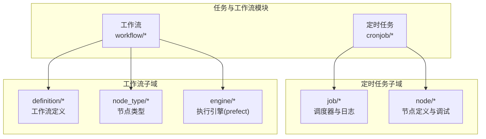
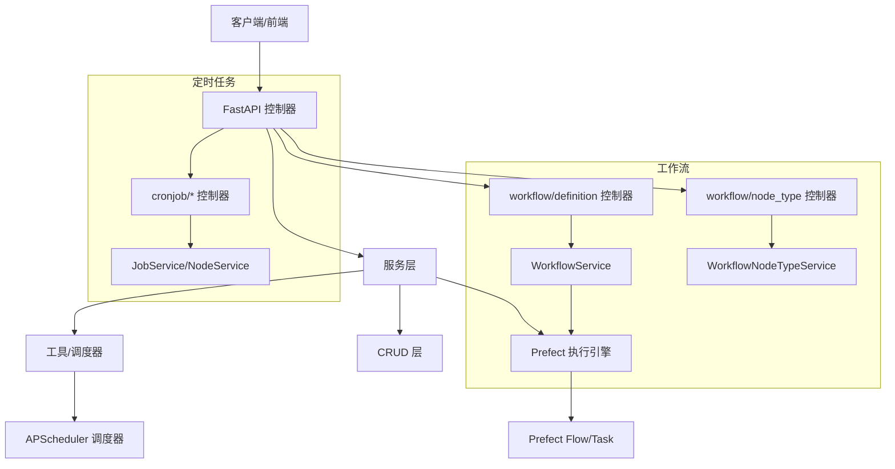
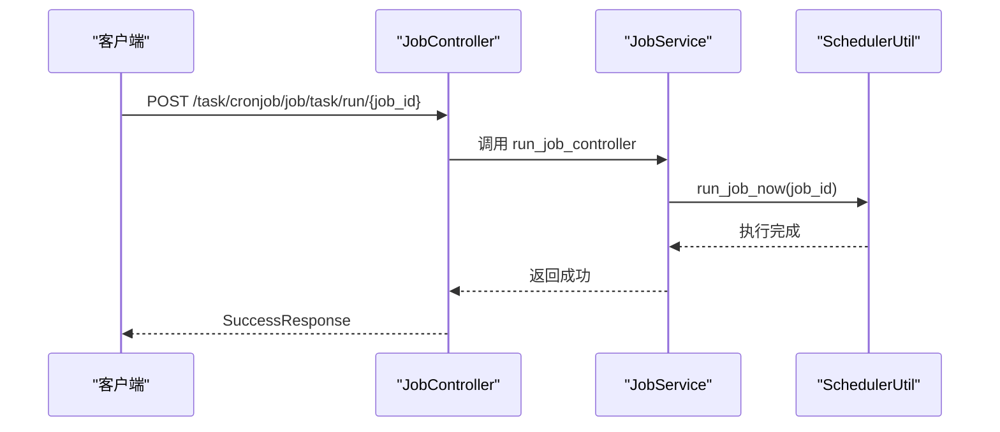
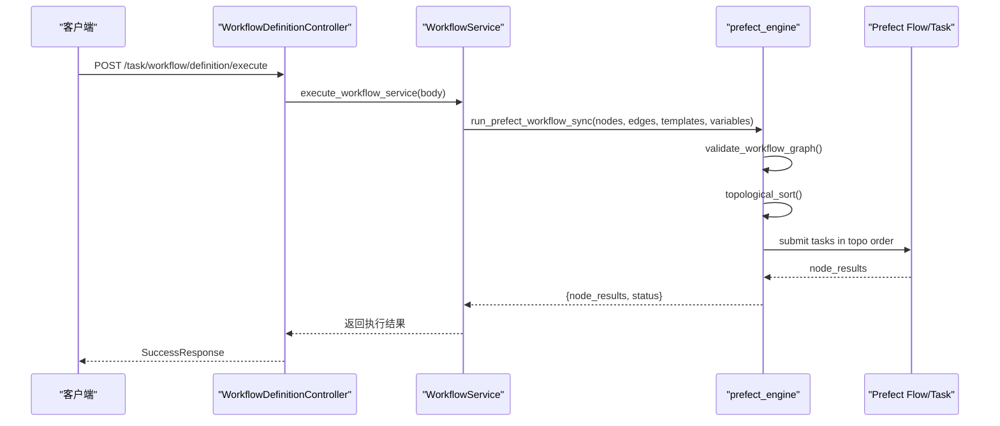
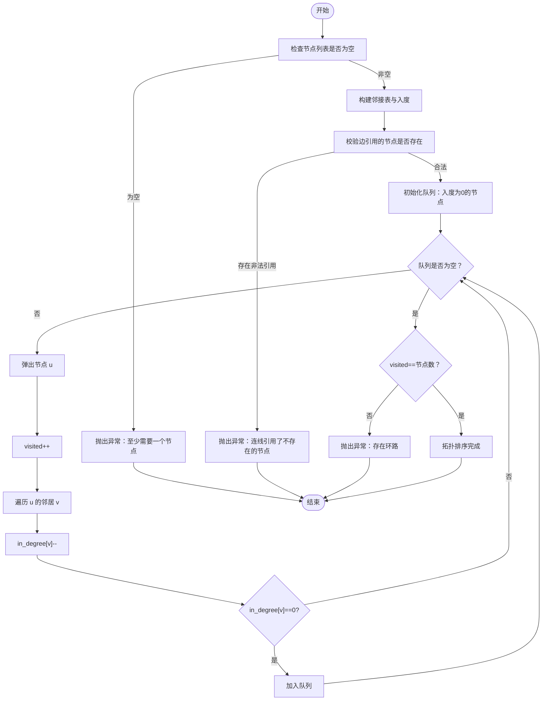
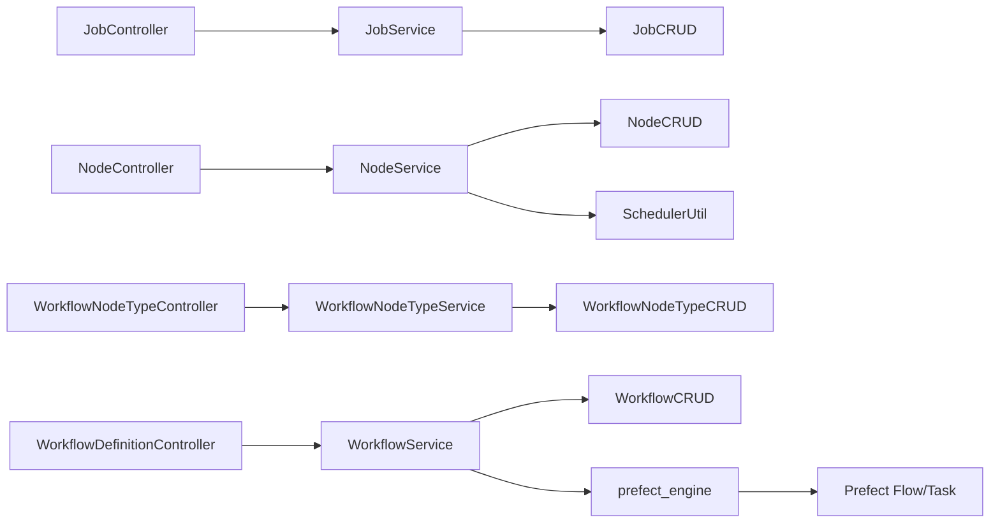

# 任务管理 API

<cite>
**本文档引用的文件**
- [backend/app/plugin/module_task/__init__.py](file://backend/app/plugin/module_task/__init__.py)
- [backend/app/plugin/module_task/plugin.toml](file://backend/app/plugin/module_task/plugin.toml)
- [backend/app/plugin/module_task/cronjob/job/controller.py](file://backend/app/plugin/module_task/cronjob/job/controller.py)
- [backend/app/plugin/module_task/cronjob/job/schema.py](file://backend/app/plugin/module_task/cronjob/job/schema.py)
- [backend/app/plugin/module_task/cronjob/job/service.py](file://backend/app/plugin/module_task/cronjob/job/service.py)
- [backend/app/plugin/module_task/cronjob/node/controller.py](file://backend/app/plugin/module_task/cronjob/node/controller.py)
- [backend/app/plugin/module_task/cronjob/node/schema.py](file://backend/app/plugin/module_task/cronjob/node/schema.py)
- [backend/app/plugin/module_task/cronjob/node/service.py](file://backend/app/plugin/module_task/cronjob/node/service.py)
- [backend/app/plugin/module_task/workflow/definition/controller.py](file://backend/app/plugin/module_task/workflow/definition/controller.py)
- [backend/app/plugin/module_task/workflow/definition/schema.py](file://backend/app/plugin/module_task/workflow/definition/schema.py)
- [backend/app/plugin/module_task/workflow/definition/service.py](file://backend/app/plugin/module_task/workflow/definition/service.py)
- [backend/app/plugin/module_task/workflow/engine/prefect_engine.py](file://backend/app/plugin/module_task/workflow/engine/prefect_engine.py)
- [backend/app/plugin/module_task/workflow/node_type/controller.py](file://backend/app/plugin/module_task/workflow/node_type/controller.py)
- [backend/app/plugin/module_task/workflow/node_type/schema.py](file://backend/app/plugin/module_task/workflow/node_type/schema.py)
- [backend/app/plugin/module_task/workflow/node_type/service.py](file://backend/app/plugin/module_task/workflow/node_type/service.py)
</cite>

## 目录
1. [简介](#简介)
2. [项目结构](#项目结构)
3. [核心组件](#核心组件)
4. [架构总览](#架构总览)
5. [详细组件分析](#详细组件分析)
6. [依赖分析](#依赖分析)
7. [性能考虑](#性能考虑)
8. [故障排查指南](#故障排查指南)
9. [结论](#结论)
10. [附录](#附录)

## 简介
本文件为“任务管理模块”的详细 API 接口文档，覆盖以下能力域：
- 定时任务管理：调度器状态与操作、任务生命周期控制、执行日志查询与清理
- 工作流定义：工作流草稿/发布/执行、DAG 校验与拓扑执行
- 工作流节点类型：节点类型定义、分类与参数模板
- 工作引擎：基于 Prefect 的拓扑执行与结果聚合

文档面向后端开发者与前端对接人员，提供接口清单、请求/响应结构、参数约束、异常处理与最佳实践，并辅以架构与流程图帮助理解。

## 项目结构
任务管理模块位于后端插件目录，采用“功能域+层次”组织方式：
- cronjob：定时任务相关（任务节点、调度器操作、执行日志）
- workflow：工作流相关（定义、节点类型、执行引擎）

图表来源
- [backend/app/plugin/module_task/__init__.py:1-8](file://backend/app/plugin/module_task/__init__.py#L1-L8)
- [backend/app/plugin/module_task/cronjob/job/controller.py:17-17](file://backend/app/plugin/module_task/cronjob/job/controller.py#L17-L17)
- [backend/app/plugin/module_task/cronjob/node/controller.py:22-22](file://backend/app/plugin/module_task/cronjob/node/controller.py#L22-L22)
- [backend/app/plugin/module_task/workflow/definition/controller.py:23-23](file://backend/app/plugin/module_task/workflow/definition/controller.py#L23-L23)
- [backend/app/plugin/module_task/workflow/node_type/controller.py:21-25](file://backend/app/plugin/module_task/workflow/node_type/controller.py#L21-L25)
- [backend/app/plugin/module_task/workflow/engine/prefect_engine.py:1-7](file://backend/app/plugin/module_task/workflow/engine/prefect_engine.py#L1-L7)

章节来源
- [backend/app/plugin/module_task/plugin.toml:1-9](file://backend/app/plugin/module_task/plugin.toml#L1-L9)

## 核心组件
- 调度器与日志（cronjob/job）
  - 提供调度器状态查询、任务列表、启动/暂停/恢复/关闭、清空任务、同步任务到数据库、任务操作（暂停/恢复/立即执行/移除）、执行日志分页查询、详情、删除
- 节点（cronjob/node）
  - 节点 CRUD、节点选项、节点调试（立即/定时/Cron/间隔/指定时间）
- 工作流定义（workflow/definition）
  - 工作流 CRUD、发布（DAG 无环校验）、执行（Prefect 拓扑执行）
- 工作流节点类型（workflow/node_type）
  - 节点类型 CRUD、选项（仅启用项）、排序与分类
- 执行引擎（workflow/engine/prefect_engine）
  - DAG 校验、拓扑排序、Prefect Flow/Task 封装、同步执行入口

章节来源
- [backend/app/plugin/module_task/cronjob/job/controller.py:17-377](file://backend/app/plugin/module_task/cronjob/job/controller.py#L17-L377)
- [backend/app/plugin/module_task/cronjob/node/controller.py:22-231](file://backend/app/plugin/module_task/cronjob/node/controller.py#L22-L231)
- [backend/app/plugin/module_task/workflow/definition/controller.py:23-211](file://backend/app/plugin/module_task/workflow/definition/controller.py#L23-L211)
- [backend/app/plugin/module_task/workflow/node_type/controller.py:21-182](file://backend/app/plugin/module_task/workflow/node_type/controller.py#L21-L182)
- [backend/app/plugin/module_task/workflow/engine/prefect_engine.py:1-225](file://backend/app/plugin/module_task/workflow/engine/prefect_engine.py#L1-L225)

## 架构总览
整体架构由“控制器 → 服务 → CRUD/工具”组成，定时任务与工作流解耦，工作流执行通过 Prefect 引擎按拓扑顺序执行。

图表来源
- [backend/app/plugin/module_task/cronjob/job/controller.py:17-377](file://backend/app/plugin/module_task/cronjob/job/controller.py#L17-L377)
- [backend/app/plugin/module_task/cronjob/node/controller.py:22-231](file://backend/app/plugin/module_task/cronjob/node/controller.py#L22-L231)
- [backend/app/plugin/module_task/workflow/definition/controller.py:23-211](file://backend/app/plugin/module_task/workflow/definition/controller.py#L23-L211)
- [backend/app/plugin/module_task/workflow/node_type/controller.py:21-182](file://backend/app/plugin/module_task/workflow/node_type/controller.py#L21-L182)
- [backend/app/plugin/module_task/workflow/engine/prefect_engine.py:1-225](file://backend/app/plugin/module_task/workflow/engine/prefect_engine.py#L1-L225)

## 详细组件分析

### 定时任务管理 API
- 调度器状态与操作
  - GET /task/cronjob/job/scheduler/status：获取调度器状态（状态、是否运行、任务数量）
  - GET /task/cronjob/job/scheduler/jobs：获取调度器任务列表（ID、名称、触发器、下次运行时间、状态）
  - POST /task/cronjob/job/scheduler/start：启动调度器
  - POST /task/cronjob/job/scheduler/pause：暂停调度器
  - POST /task/cronjob/job/scheduler/resume：恢复调度器
  - POST /task/cronjob/job/scheduler/shutdown：关闭调度器
  - DELETE /task/cronjob/job/scheduler/jobs/clear：清空所有任务
  - GET /task/cronjob/job/scheduler/console：获取调度器控制台输出
  - POST /task/cronjob/job/scheduler/sync：同步调度器任务到执行日志表（返回同步数量）
- 任务操作
  - POST /task/cronjob/job/task/pause/{job_id}：暂停任务
  - POST /task/cronjob/job/task/resume/{job_id}：恢复任务
  - POST /task/cronjob/job/task/run/{job_id}：立即执行任务
  - DELETE /task/cronjob/job/task/remove/{job_id}：移除任务
- 执行日志
  - GET /task/cronjob/job/log/list：分页查询执行日志（支持按任务ID/名称/状态/触发方式过滤）
  - GET /task/cronjob/job/log/detail/{id}：获取执行日志详情
  - DELETE /task/cronjob/job/log/delete：批量删除执行日志

请求/响应要点
- 统一响应包装：SuccessResponse(data, msg)，部分操作返回 None
- 权限控制：每个路由均依赖权限校验（如 module_task:cronjob:job:*）
- 调度器操作：通过 SchedulerUtil 统一封装（启动/暂停/恢复/关闭/清空/同步/任务操作）

章节来源
- [backend/app/plugin/module_task/cronjob/job/controller.py:23-377](file://backend/app/plugin/module_task/cronjob/job/controller.py#L23-L377)
- [backend/app/plugin/module_task/cronjob/job/schema.py:12-58](file://backend/app/plugin/module_task/cronjob/job/schema.py#L12-L58)
- [backend/app/plugin/module_task/cronjob/job/service.py:9-222](file://backend/app/plugin/module_task/cronjob/job/service.py#L9-L222)

### 工作流定义 API
- 工作流 CRUD
  - GET /task/workflow/definition/detail/{id}：获取工作流详情（含 nodes/edges）
  - GET /task/workflow/definition/list：分页查询工作流列表
  - POST /task/workflow/definition/create：创建草稿工作流（保存画布 nodes/edges）
  - PUT /task/workflow/definition/update/{id}：更新工作流及画布
  - DELETE /task/workflow/definition/delete：批量删除工作流
- 发布与执行
  - POST /task/workflow/definition/publish/{id}：发布工作流（DAG 无环校验后置为 published）
  - POST /task/workflow/definition/execute：执行已发布工作流（Prefect 拓扑执行）

请求/响应要点
- 发布前校验：validate_workflow_graph（节点非空、边引用合法、无环）
- 执行流程：拓扑排序后逐节点提交 Prefect Task，收集 node_results 并返回
- 执行结果：WorkflowExecuteResultSchema（包含 workflow_id/name/status/start_time/end_time/variables/node_results/error）

章节来源
- [backend/app/plugin/module_task/workflow/definition/controller.py:26-211](file://backend/app/plugin/module_task/workflow/definition/controller.py#L26-L211)
- [backend/app/plugin/module_task/workflow/definition/schema.py:11-124](file://backend/app/plugin/module_task/workflow/definition/schema.py#L11-L124)
- [backend/app/plugin/module_task/workflow/definition/service.py:21-306](file://backend/app/plugin/module_task/workflow/definition/service.py#L21-L306)
- [backend/app/plugin/module_task/workflow/engine/prefect_engine.py:36-225](file://backend/app/plugin/module_task/workflow/engine/prefect_engine.py#L36-L225)

### 工作流节点类型 API
- 节点类型 CRUD
  - GET /task/workflow/node-type/options：获取画布节点类型选项（仅启用项）
  - GET /task/workflow/node-type/detail/{id}：获取节点类型详情
  - GET /task/workflow/node-type/list：分页查询节点类型列表
  - POST /task/workflow/node-type/create：创建节点类型（需提供 func 代码块）
  - PUT /task/workflow/node-type/update/{id}：更新节点类型
  - DELETE /task/workflow/node-type/delete：批量删除节点类型

请求/响应要点
- 分类限制：trigger/action/condition/control
- 默认参数模板：args/kwargs 作为默认值传入执行上下文
- 选项结构：与前端画布 palette 对齐（code/name/category/args/kwargs）

章节来源
- [backend/app/plugin/module_task/workflow/node_type/controller.py:28-182](file://backend/app/plugin/module_task/workflow/node_type/controller.py#L28-L182)
- [backend/app/plugin/module_task/workflow/node_type/schema.py:9-78](file://backend/app/plugin/module_task/workflow/node_type/schema.py#L9-L78)
- [backend/app/plugin/module_task/workflow/node_type/service.py:13-196](file://backend/app/plugin/module_task/workflow/node_type/service.py#L13-L196)

### 节点调试 API
- 节点 CRUD
  - GET /task/cronjob/node/options：获取定时任务节点选项（供 APScheduler 定时任务使用）
  - GET /task/cronjob/node/detail/{id}：获取节点详情
  - GET /task/cronjob/node/list：分页查询节点列表
  - POST /task/cronjob/node/create：创建节点（仅入库，不创建调度器任务）
  - PUT /task/cronjob/node/update/{id}：更新节点（仅入库）
  - DELETE /task/cronjob/node/delete：批量删除节点
  - DELETE /task/cronjob/node/clear：清空节点（同时清空调度器任务）
- 调试执行
  - POST /task/cronjob/node/execute/{id}：调试节点（立即/定时/Cron/间隔/指定时间）

触发器参数约束
- trigger 必须为 now/cron/interval/date
- 非立即执行时必须提供 trigger_args
- 开始/结束时间格式校验：YYYY-MM-DD HH:MM:SS，结束时间不得早于开始时间

章节来源
- [backend/app/plugin/module_task/cronjob/node/controller.py:25-231](file://backend/app/plugin/module_task/cronjob/node/controller.py#L25-L231)
- [backend/app/plugin/module_task/cronjob/node/schema.py:84-120](file://backend/app/plugin/module_task/cronjob/node/schema.py#L84-L120)
- [backend/app/plugin/module_task/cronjob/node/service.py:18-255](file://backend/app/plugin/module_task/cronjob/node/service.py#L18-L255)

### 执行流程与状态查询

#### 定时任务执行流程

图表来源
- [backend/app/plugin/module_task/cronjob/job/controller.py:242-264](file://backend/app/plugin/module_task/cronjob/job/controller.py#L242-L264)
- [backend/app/plugin/module_task/cronjob/job/service.py:9-222](file://backend/app/plugin/module_task/cronjob/job/service.py#L9-L222)

#### 工作流执行流程

图表来源
- [backend/app/plugin/module_task/workflow/definition/controller.py:188-211](file://backend/app/plugin/module_task/workflow/definition/controller.py#L188-L211)
- [backend/app/plugin/module_task/workflow/definition/service.py:224-306](file://backend/app/plugin/module_task/workflow/definition/service.py#L224-L306)
- [backend/app/plugin/module_task/workflow/engine/prefect_engine.py:189-225](file://backend/app/plugin/module_task/workflow/engine/prefect_engine.py#L189-L225)

#### DAG 校验与拓扑排序

图表来源
- [backend/app/plugin/module_task/workflow/engine/prefect_engine.py:36-101](file://backend/app/plugin/module_task/workflow/engine/prefect_engine.py#L36-L101)

## 依赖分析
- 控制器依赖服务层，服务层依赖 CRUD 与工具（SchedulerUtil、Prefect 引擎）
- 工作流执行依赖节点类型模板（func/args/kwargs），并在执行时注入上游结果与流程变量
- 调度器操作与节点调试通过 SchedulerUtil 统一封装

图表来源
- [backend/app/plugin/module_task/cronjob/job/controller.py:14-15](file://backend/app/plugin/module_task/cronjob/job/controller.py#L14-L15)
- [backend/app/plugin/module_task/cronjob/node/controller.py:19-20](file://backend/app/plugin/module_task/cronjob/node/controller.py#L19-L20)
- [backend/app/plugin/module_task/workflow/definition/controller.py:20-21](file://backend/app/plugin/module_task/workflow/definition/controller.py#L20-L21)
- [backend/app/plugin/module_task/workflow/node_type/controller.py:18-19](file://backend/app/plugin/module_task/workflow/node_type/controller.py#L18-L19)
- [backend/app/plugin/module_task/workflow/engine/prefect_engine.py:17-18](file://backend/app/plugin/module_task/workflow/engine/prefect_engine.py#L17-L18)

## 性能考虑
- 分页查询：日志与节点列表均支持分页与排序，避免一次性拉取大量数据
- 同步执行：工作流执行在独立线程池中运行，避免阻塞主线程
- 调度器批处理：清空/同步等批量操作通过调度器统一处理
- 结果聚合：Prefect 执行完成后一次性返回 node_results，便于前端展示

## 故障排查指南
常见异常与定位建议
- 工作流未发布即执行：检查 workflow_status 是否为 published
- DAG 存在环路或节点缺失：执行发布前 validate_workflow_graph 抛出异常
- 节点类型未注册或未配置 func：执行时会提示节点类型未注册或 func 为空
- Cron 表达式不正确：节点调试时对 Cron 表达式进行校验
- 任务不存在：删除节点时若调度器中不存在对应任务，会忽略异常但继续删除数据库记录

章节来源
- [backend/app/plugin/module_task/workflow/definition/service.py:244-260](file://backend/app/plugin/module_task/workflow/definition/service.py#L244-L260)
- [backend/app/plugin/module_task/workflow/engine/prefect_engine.py:36-72](file://backend/app/plugin/module_task/workflow/engine/prefect_engine.py#L36-L72)
- [backend/app/plugin/module_task/cronjob/node/service.py:225-252](file://backend/app/plugin/module_task/cronjob/node/service.py#L225-L252)

## 结论
本模块提供了完善的定时任务与工作流编排能力：
- 定时任务：调度器全生命周期管理、任务操作与执行日志可观测
- 工作流：DAG 无环校验、拓扑执行、节点类型模板化与参数化
- 执行引擎：基于 Prefect 的可靠执行与结果聚合
- 安全与权限：严格的权限控制与统一响应包装

建议在生产环境：
- 对工作流执行设置合理的超时与重试策略
- 对 Cron/Interval 触发器进行有效性校验
- 对节点类型 func 进行白名单与沙箱执行（如后续扩展）

## 附录
- 统一响应结构：SuccessResponse(data, msg)，部分无返回体的操作返回 None
- 权限命名空间：module_task:cronjob:job:* 与 module_task:workflow:* 等
- 调度器工具：SchedulerUtil 提供启动/暂停/恢复/关闭/清空/同步/任务操作等方法