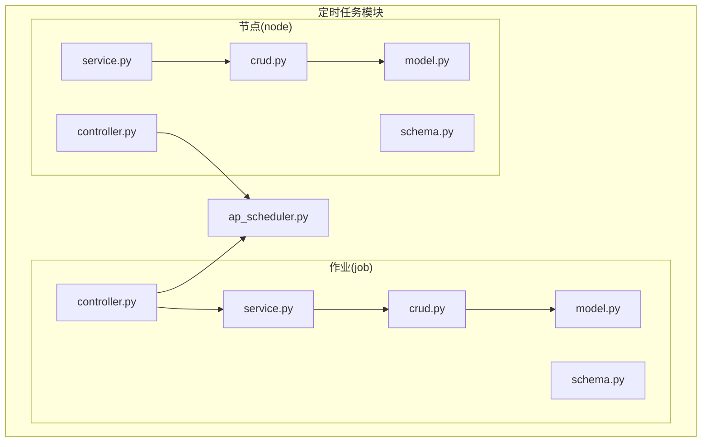
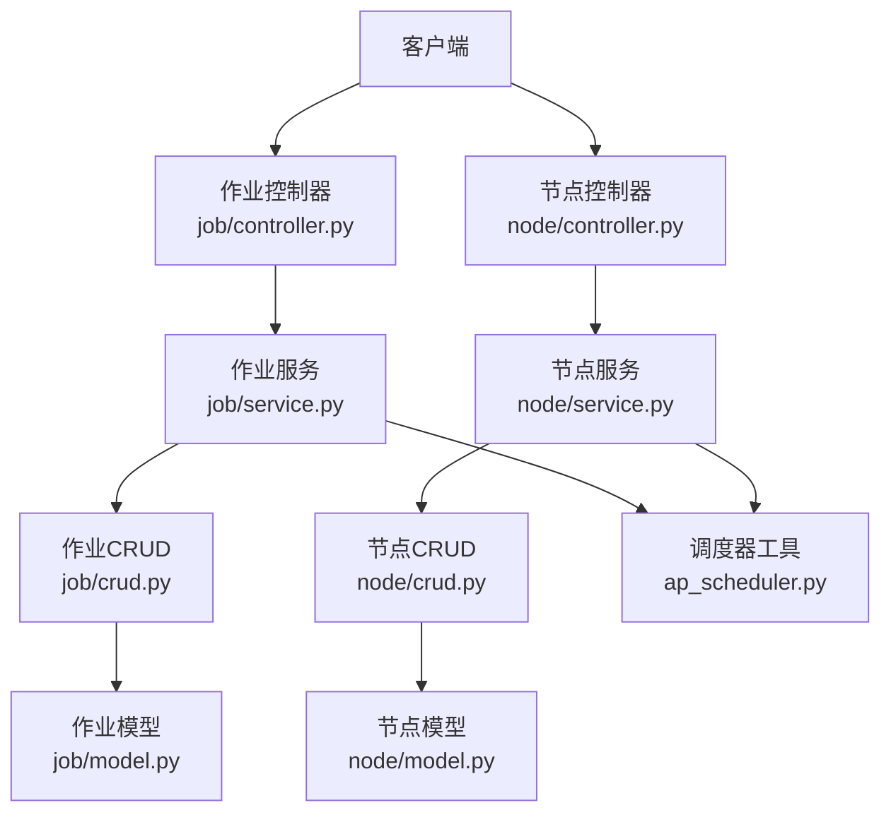
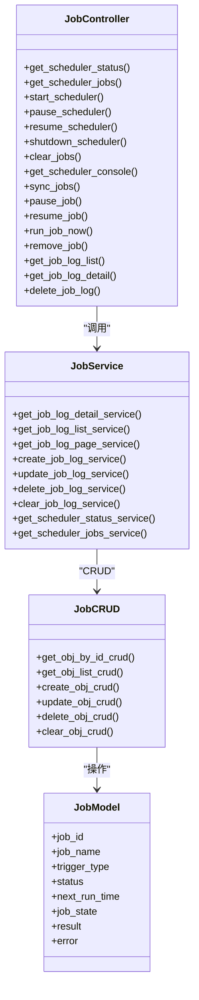
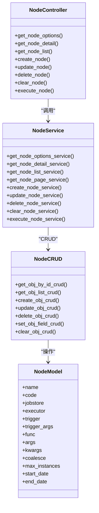
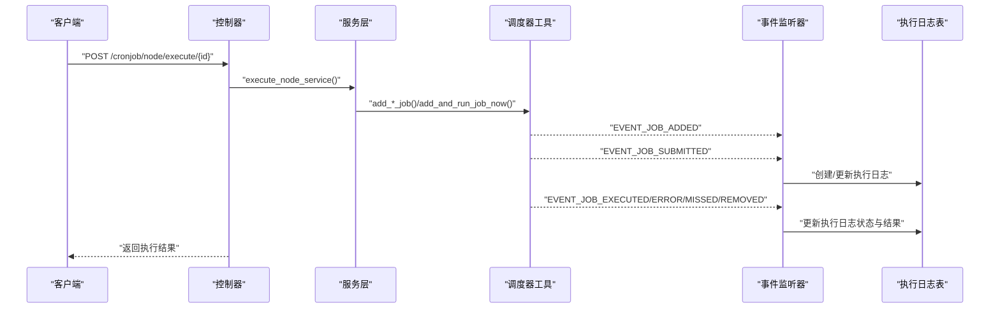
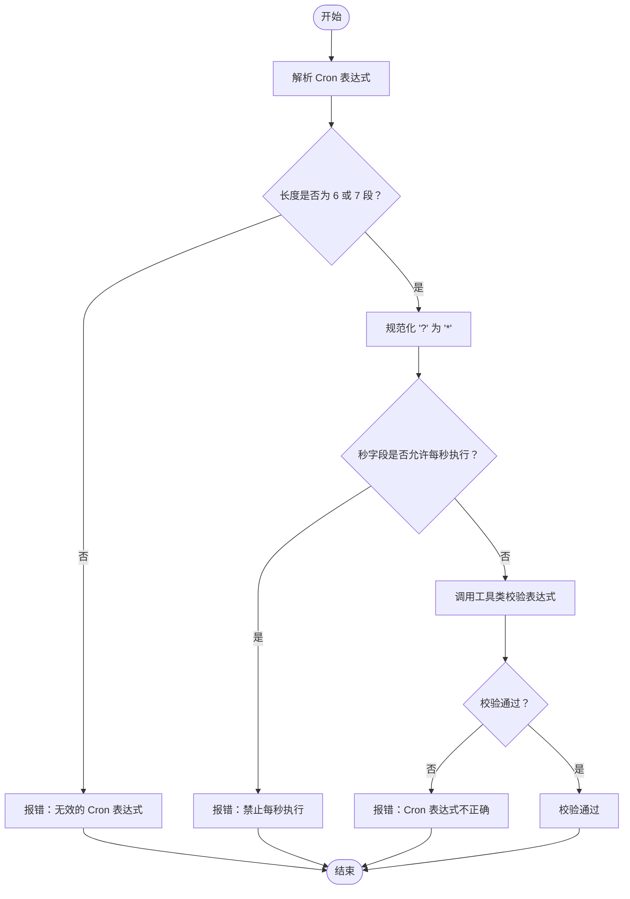
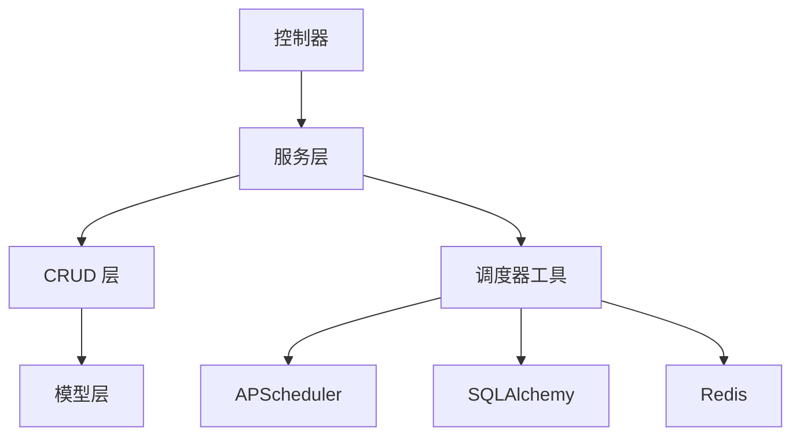

# 定时任务 API

<cite>
**本文引用的文件**
- [backend/app/plugin/module_task/cronjob/job/controller.py](file://backend/app/plugin/module_task/cronjob/job/controller.py)
- [backend/app/plugin/module_task/cronjob/job/service.py](file://backend/app/plugin/module_task/cronjob/job/service.py)
- [backend/app/plugin/module_task/cronjob/job/crud.py](file://backend/app/plugin/module_task/cronjob/job/crud.py)
- [backend/app/plugin/module_task/cronjob/job/schema.py](file://backend/app/plugin/module_task/cronjob/job/schema.py)
- [backend/app/plugin/module_task/cronjob/job/model.py](file://backend/app/plugin/module_task/cronjob/job/model.py)
- [backend/app/plugin/module_task/cronjob/node/controller.py](file://backend/app/plugin/module_task/cronjob/node/controller.py)
- [backend/app/plugin/module_task/cronjob/node/service.py](file://backend/app/plugin/module_task/cronjob/node/service.py)
- [backend/app/plugin/module_task/cronjob/node/crud.py](file://backend/app/plugin/module_task/cronjob/node/crud.py)
- [backend/app/plugin/module_task/cronjob/node/schema.py](file://backend/app/plugin/module_task/cronjob/node/schema.py)
- [backend/app/plugin/module_task/cronjob/node/model.py](file://backend/app/plugin/module_task/cronjob/node/model.py)
- [backend/app/core/ap_scheduler.py](file://backend/app/core/ap_scheduler.py)
- [backend/app/common/enums.py](file://backend/app/common/enums.py)
- [backend/app/plugin/module_task/plugin.toml](file://backend/app/plugin/module_task/plugin.toml)
</cite>

## 目录
1. [简介](#简介)
2. [项目结构](#项目结构)
3. [核心组件](#核心组件)
4. [架构总览](#架构总览)
5. [详细组件分析](#详细组件分析)
6. [依赖分析](#依赖分析)
7. [性能考虑](#性能考虑)
8. [故障排查指南](#故障排查指南)
9. [结论](#结论)
10. [附录](#附录)

## 简介
本文件为“定时任务模块”的详细 API 接口文档，覆盖以下能力：
- 任务作业管理接口（job）：调度器状态与操作、任务操作（暂停/恢复/立即执行/移除）、执行日志查询与清理
- 任务节点管理接口（node）：节点的增删改查、节点选项、调试执行（立即/定时/Cron/间隔/指定时间）

文档重点说明：
- Cron 表达式配置与校验
- 任务状态管理（运行中/暂停中/已停止/待执行/执行中/成功/失败/超时/已取消）
- 执行历史记录与持久化
- 并发控制、重试策略与超时处理
- 故障恢复机制与事件驱动日志更新
- API 示例与最佳实践

## 项目结构
定时任务模块位于 backend/app/plugin/module_task/cronjob 下，按功能拆分为 job（作业）与 node（节点）两个子模块，每个子模块均包含 controller、service、crud、schema、model 文件，并由 ap_scheduler 统一调度与事件处理。

图表来源
- [backend/app/plugin/module_task/cronjob/job/controller.py](file://backend/app/plugin/module_task/cronjob/job/controller.py)
- [backend/app/plugin/module_task/cronjob/job/service.py](file://backend/app/plugin/module_task/cronjob/job/service.py)
- [backend/app/plugin/module_task/cronjob/job/crud.py](file://backend/app/plugin/module_task/cronjob/job/crud.py)
- [backend/app/plugin/module_task/cronjob/job/model.py](file://backend/app/plugin/module_task/cronjob/job/model.py)
- [backend/app/plugin/module_task/cronjob/node/controller.py](file://backend/app/plugin/module_task/cronjob/node/controller.py)
- [backend/app/plugin/module_task/cronjob/node/service.py](file://backend/app/plugin/module_task/cronjob/node/service.py)
- [backend/app/plugin/module_task/cronjob/node/crud.py](file://backend/app/plugin/module_task/cronjob/node/crud.py)
- [backend/app/plugin/module_task/cronjob/node/model.py](file://backend/app/plugin/module_task/cronjob/node/model.py)
- [backend/app/core/ap_scheduler.py](file://backend/app/core/ap_scheduler.py)

章节来源
- [backend/app/plugin/module_task/cronjob/job/controller.py](file://backend/app/plugin/module_task/cronjob/job/controller.py)
- [backend/app/plugin/module_task/cronjob/node/controller.py](file://backend/app/plugin/module_task/cronjob/node/controller.py)
- [backend/app/core/ap_scheduler.py](file://backend/app/core/ap_scheduler.py)

## 核心组件
- 调度器工具（SchedulerUtil）
  - 统一管理调度器生命周期（启动/暂停/恢复/关闭）
  - 注册事件监听器，基于事件驱动写入执行日志
  - 提供 Cron/Interval/Date/立即执行等任务添加方法
  - 提供任务状态查询、任务列表、清空任务、同步任务到数据库等能力
- 作业（Job）模块
  - 控制器：暴露调度器状态、任务操作、执行日志查询与删除
  - 服务：封装日志 CRUD、分页查询、调度器状态/任务列表获取
  - 数据访问：基于通用 CRUD 基类进行数据库操作
  - 数据模型：定义任务执行日志表结构与状态枚举
  - 数据模型：定义任务执行日志表结构与状态枚举
- 节点（Node）模块
  - 控制器：暴露节点 CRUD、节点选项、调试执行
  - 服务：封装节点 CRUD、分页查询、调试执行（根据触发器类型创建调度器任务）
  - 数据访问：基于通用 CRUD 基类进行数据库操作
  - 数据模型：定义节点类型表结构（含触发器、参数、并发控制等）
  - 数据模型：定义节点类型表结构（含触发器、参数、并发控制等）

章节来源
- [backend/app/core/ap_scheduler.py](file://backend/app/core/ap_scheduler.py)
- [backend/app/plugin/module_task/cronjob/job/service.py](file://backend/app/plugin/module_task/cronjob/job/service.py)
- [backend/app/plugin/module_task/cronjob/job/crud.py](file://backend/app/plugin/module_task/cronjob/job/crud.py)
- [backend/app/plugin/module_task/cronjob/job/model.py](file://backend/app/plugin/module_task/cronjob/job/model.py)
- [backend/app/plugin/module_task/cronjob/node/service.py](file://backend/app/plugin/module_task/cronjob/node/service.py)
- [backend/app/plugin/module_task/cronjob/node/crud.py](file://backend/app/plugin/module_task/cronjob/node/crud.py)
- [backend/app/plugin/module_task/cronjob/node/model.py](file://backend/app/plugin/module_task/cronjob/node/model.py)

## 架构总览
定时任务模块采用“控制器-服务-数据访问-模型-调度器”的分层设计，控制器负责请求路由与鉴权，服务层负责业务逻辑与调度器交互，数据访问层负责数据库 CRUD，模型定义表结构与状态枚举，调度器统一管理任务生命周期与事件。

图表来源
- [backend/app/plugin/module_task/cronjob/job/controller.py](file://backend/app/plugin/module_task/cronjob/job/controller.py)
- [backend/app/plugin/module_task/cronjob/node/controller.py](file://backend/app/plugin/module_task/cronjob/node/controller.py)
- [backend/app/plugin/module_task/cronjob/job/service.py](file://backend/app/plugin/module_task/cronjob/job/service.py)
- [backend/app/plugin/module_task/cronjob/node/service.py](file://backend/app/plugin/module_task/cronjob/node/service.py)
- [backend/app/plugin/module_task/cronjob/job/crud.py](file://backend/app/plugin/module_task/cronjob/job/crud.py)
- [backend/app/plugin/module_task/cronjob/node/crud.py](file://backend/app/plugin/module_task/cronjob/node/crud.py)
- [backend/app/plugin/module_task/cronjob/job/model.py](file://backend/app/plugin/module_task/cronjob/job/model.py)
- [backend/app/plugin/module_task/cronjob/node/model.py](file://backend/app/plugin/module_task/cronjob/node/model.py)
- [backend/app/core/ap_scheduler.py](file://backend/app/core/ap_scheduler.py)

## 详细组件分析

### 作业（Job）模块 API
作业模块围绕“执行日志”与“调度器操作”两大主题提供接口，支持分页查询、详情查看、删除与清空，以及对调度器状态与任务的统一管理。

- 调度器状态与操作
  - GET /cronjob/job/scheduler/status：获取调度器状态（运行中/暂停/停止/未知）
  - GET /cronjob/job/scheduler/jobs：获取调度器任务列表（含触发器、下次执行时间、状态）
  - POST /cronjob/job/scheduler/start：启动调度器
  - POST /cronjob/job/scheduler/pause：暂停调度器
  - POST /cronjob/job/scheduler/resume：恢复调度器
  - POST /cronjob/job/scheduler/shutdown：关闭调度器
  - DELETE /cronjob/job/scheduler/jobs/clear：清空所有任务（不删除日志，将待执行日志标记为已取消）
  - GET /cronjob/job/scheduler/console：获取调度器控制台信息
  - POST /cronjob/job/scheduler/sync：同步调度器任务到数据库（创建待执行日志）

- 任务操作
  - POST /cronjob/job/task/pause/{job_id}：暂停任务（设置 next_run_time 为 None）
  - POST /cronjob/job/task/resume/{job_id}：恢复任务
  - POST /cronjob/job/task/run/{job_id}：立即执行任务（创建临时任务）
  - DELETE /cronjob/job/task/remove/{job_id}：移除任务

- 执行日志
  - GET /cronjob/job/log/list：分页查询执行日志（默认按创建时间倒序）
  - GET /cronjob/job/log/detail/{id}：获取执行日志详情
  - DELETE /cronjob/job/log/delete：批量删除执行日志

- 请求与响应
  - 所有接口返回统一响应结构（成功/失败、消息、数据）
  - 鉴权：通过权限装饰器校验模块权限（如 module_task:cronjob:job:*）

- Cron 表达式配置与校验
  - Cron 表达式格式：支持 6 或 7 段（秒/分/时/日/月/周/年），自动规范化“?”为“*”
  - 禁止每秒执行：若秒/分/时/日/月/周均为“*”，将拒绝
  - 表达式校验：通过工具类进行合法性校验

- 任务状态管理
  - 状态枚举：pending（待执行）、running（执行中）、success（成功）、failed（失败）、timeout（超时）、cancelled（已取消）
  - 事件驱动更新：基于调度器事件（提交/执行成功/执行失败/错过/移除）自动更新日志状态
  - 一次性任务与周期性任务区分：一次性任务（manual/date）执行后自动移除，周期性任务（cron/interval）在下次执行前保持 pending 状态

- 并发控制与实例数
  - 任务默认最大实例数为 1（单实例执行）
  - 节点模型支持 max_instances 字段，可在节点层面配置并发上限

- 重试策略与超时处理
  - 重试：未实现自动重试机制，失败日志状态为 failed
  - 超时：错过执行时间事件触发 timeout 状态
  - 最大实例：达到最大实例数时触发事件，阻止新实例启动

- 执行历史记录与持久化
  - 执行日志表：记录 job_id、job_name、触发方式、状态、下次执行时间、任务状态信息、结果、错误信息
  - 事件监听：在任务提交、执行成功、执行失败、错过、移除等事件时写入/更新日志
  - 清空策略：清空调度器任务不删除日志，仅将 pending 状态标记为 cancelled

- 故障恢复机制
  - 事件监听器覆盖调度器启动/暂停/恢复/关闭、执行器/JobStore 变更、任务添加/修改/移除、提交/执行/错误/错过/最大实例等事件
  - 对异常事件进行日志记录与状态更新，保证日志一致性

章节来源
- [backend/app/plugin/module_task/cronjob/job/controller.py](file://backend/app/plugin/module_task/cronjob/job/controller.py)
- [backend/app/plugin/module_task/cronjob/job/service.py](file://backend/app/plugin/module_task/cronjob/job/service.py)
- [backend/app/plugin/module_task/cronjob/job/crud.py](file://backend/app/plugin/module_task/cronjob/job/crud.py)
- [backend/app/plugin/module_task/cronjob/job/schema.py](file://backend/app/plugin/module_task/cronjob/job/schema.py)
- [backend/app/plugin/module_task/cronjob/job/model.py](file://backend/app/plugin/module_task/cronjob/job/model.py)
- [backend/app/core/ap_scheduler.py](file://backend/app/core/ap_scheduler.py)

### 节点（Node）模块 API
节点模块提供节点的 CRUD 与调试执行能力，节点本身不直接操作调度器，调试执行时根据触发器类型创建调度器任务。

- 节点选项
  - GET /cronjob/node/options：获取节点选项列表（供调度/调试使用）

- 节点详情与列表
  - GET /cronjob/node/detail/{id}：获取节点详情
  - GET /cronjob/node/list：分页查询节点（支持名称、状态、时间范围、创建/更新人等查询）

- 节点管理
  - POST /cronjob/node/create：创建节点（仅保存到数据库，不创建调度器任务）
  - PUT /cronjob/node/update/{id}：更新节点（仅更新数据库，不修改调度器任务）
  - DELETE /cronjob/node/delete：批量删除节点（同时尝试从调度器移除任务）
  - DELETE /cronjob/node/clear：清空所有节点（同时清空调度器任务）

- 调试执行
  - POST /cronjob/node/execute/{id}：调试节点（创建调度器任务并执行）
    - 触发方式：now/cron/interval/date
    - Cron/Interval：需提供触发器参数（Cron 表达式/间隔参数）
    - 时间范围：start_date/end_date 可选
    - 事件驱动：执行后由事件监听器写入执行日志

- 请求与响应
  - 所有接口返回统一响应结构
  - 鉴权：通过权限装饰器校验模块权限（如 module_task:cronjob:node:*）

- Cron 表达式配置与校验
  - Cron 表达式格式与校验规则同作业模块
  - 调试执行时对 Cron 表达式进行严格校验

- 并发控制与实例数
  - 节点模型支持 coalesce（合并运行）与 max_instances（最大实例数）
  - 调试执行时使用节点配置作为默认参数

- 重试策略与超时处理
  - 未实现自动重试机制
  - 超时与最大实例事件同作业模块

- 执行历史记录与持久化
  - 调试执行创建的临时任务同样受事件监听器管理，写入执行日志

- 故障恢复机制
  - 调试执行失败时抛出自定义异常，不影响调度器整体状态

章节来源
- [backend/app/plugin/module_task/cronjob/node/controller.py](file://backend/app/plugin/module_task/cronjob/node/controller.py)
- [backend/app/plugin/module_task/cronjob/node/service.py](file://backend/app/plugin/module_task/cronjob/node/service.py)
- [backend/app/plugin/module_task/cronjob/node/crud.py](file://backend/app/plugin/module_task/cronjob/node/crud.py)
- [backend/app/plugin/module_task/cronjob/node/schema.py](file://backend/app/plugin/module_task/cronjob/node/schema.py)
- [backend/app/plugin/module_task/cronjob/node/model.py](file://backend/app/plugin/module_task/cronjob/node/model.py)
- [backend/app/core/ap_scheduler.py](file://backend/app/core/ap_scheduler.py)

### 作业（Job）模块类图

图表来源
- [backend/app/plugin/module_task/cronjob/job/controller.py](file://backend/app/plugin/module_task/cronjob/job/controller.py)
- [backend/app/plugin/module_task/cronjob/job/service.py](file://backend/app/plugin/module_task/cronjob/job/service.py)
- [backend/app/plugin/module_task/cronjob/job/crud.py](file://backend/app/plugin/module_task/cronjob/job/crud.py)
- [backend/app/plugin/module_task/cronjob/job/model.py](file://backend/app/plugin/module_task/cronjob/job/model.py)

### 节点（Node）模块类图

图表来源
- [backend/app/plugin/module_task/cronjob/node/controller.py](file://backend/app/plugin/module_task/cronjob/node/controller.py)
- [backend/app/plugin/module_task/cronjob/node/service.py](file://backend/app/plugin/module_task/cronjob/node/service.py)
- [backend/app/plugin/module_task/cronjob/node/crud.py](file://backend/app/plugin/module_task/cronjob/node/crud.py)
- [backend/app/plugin/module_task/cronjob/node/model.py](file://backend/app/plugin/module_task/cronjob/node/model.py)

### 调度器事件与日志更新流程

图表来源
- [backend/app/plugin/module_task/cronjob/node/service.py](file://backend/app/plugin/module_task/cronjob/node/service.py)
- [backend/app/core/ap_scheduler.py](file://backend/app/core/ap_scheduler.py)

### Cron 表达式校验流程

图表来源
- [backend/app/core/ap_scheduler.py](file://backend/app/core/ap_scheduler.py)

## 依赖分析
- 模块间耦合
  - 控制器依赖服务层，服务层依赖 CRUD 层，CRUD 层依赖模型层
  - 服务层与调度器工具紧密耦合，用于任务创建、暂停、恢复、立即执行、清空等
- 外部依赖
  - APScheduler：任务调度、触发器、执行器、JobStore
  - SQLAlchemy：数据库 ORM 与连接
  - Redis：可选 JobStore（用于分布式任务）
- 权限与认证
  - 控制器通过权限装饰器校验模块权限（如 module_task:cronjob:job:*、module_task:cronjob:node:*）
  - 统一响应结构与日志记录贯穿各层

图表来源
- [backend/app/plugin/module_task/cronjob/job/controller.py](file://backend/app/plugin/module_task/cronjob/job/controller.py)
- [backend/app/plugin/module_task/cronjob/node/controller.py](file://backend/app/plugin/module_task/cronjob/node/controller.py)
- [backend/app/plugin/module_task/cronjob/job/service.py](file://backend/app/plugin/module_task/cronjob/job/service.py)
- [backend/app/plugin/module_task/cronjob/node/service.py](file://backend/app/plugin/module_task/cronjob/node/service.py)
- [backend/app/core/ap_scheduler.py](file://backend/app/core/ap_scheduler.py)

章节来源
- [backend/app/plugin/module_task/cronjob/job/controller.py](file://backend/app/plugin/module_task/cronjob/job/controller.py)
- [backend/app/plugin/module_task/cronjob/node/controller.py](file://backend/app/plugin/module_task/cronjob/node/controller.py)
- [backend/app/core/ap_scheduler.py](file://backend/app/core/ap_scheduler.py)
- [backend/app/common/enums.py](file://backend/app/common/enums.py)

## 性能考虑
- 并发与执行器
  - 默认执行器为 AsyncIOExecutor，线程池与进程池可按需配置
  - 任务默认最大实例数为 1，避免竞争与资源冲突
- 任务存储
  - 支持内存、SQLAlchemy、Redis 三种 JobStore，可根据场景选择
- 事件监听开销
  - 事件监听器在任务提交/执行/错误/错过/移除等关键节点写入日志，建议在高并发场景下关注数据库写入压力
- Cron/Interval 触发
  - Cron 表达式校验与规范化减少无效任务创建，降低调度器负担

## 故障排查指南
- 常见问题
  - Cron 表达式不正确：检查表达式长度与字段合法性
  - 任务未执行：确认调度器状态、任务是否被暂停、是否达到最大实例数
  - 日志缺失：检查事件监听器是否正常注册与处理
  - 节点不存在：调试执行前确保节点已创建且有效
- 排查步骤
  - 查看调度器状态与任务列表
  - 查看执行日志详情与状态
  - 检查事件监听器日志与数据库写入情况
  - 校验 Cron/Interval 参数与时间范围

章节来源
- [backend/app/plugin/module_task/cronjob/job/controller.py](file://backend/app/plugin/module_task/cronjob/job/controller.py)
- [backend/app/plugin/module_task/cronjob/node/controller.py](file://backend/app/plugin/module_task/cronjob/node/controller.py)
- [backend/app/core/ap_scheduler.py](file://backend/app/core/ap_scheduler.py)

## 结论
定时任务模块通过清晰的分层设计与事件驱动的日志机制，提供了稳定可靠的调度与监控能力。作业与节点模块分别聚焦于“执行日志管理”与“节点定义与调试执行”，配合调度器工具实现对 Cron/Interval/Date/立即执行等多种触发方式的支持。在并发控制、超时处理与故障恢复方面具备完善的机制，适合在生产环境中部署与运维。

## 附录
- 插件元信息
  - 名称：task
  - 标题：任务与工作流
  - 版本：1.0.0
  - 标签：task、cron、workflow

章节来源
- [backend/app/plugin/module_task/plugin.toml](file://backend/app/plugin/module_task/plugin.toml)