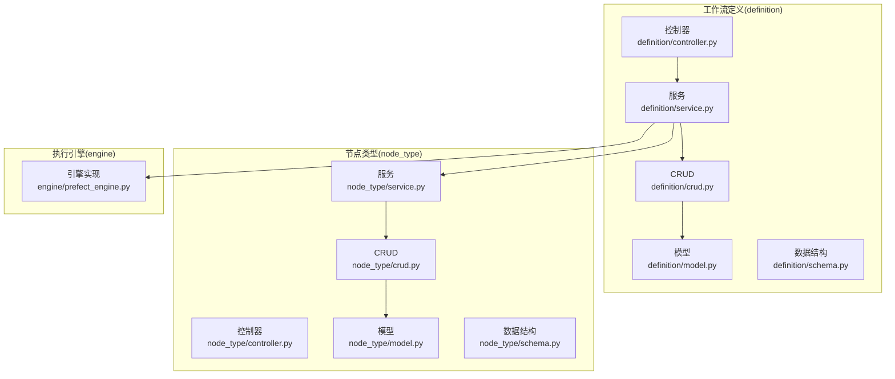
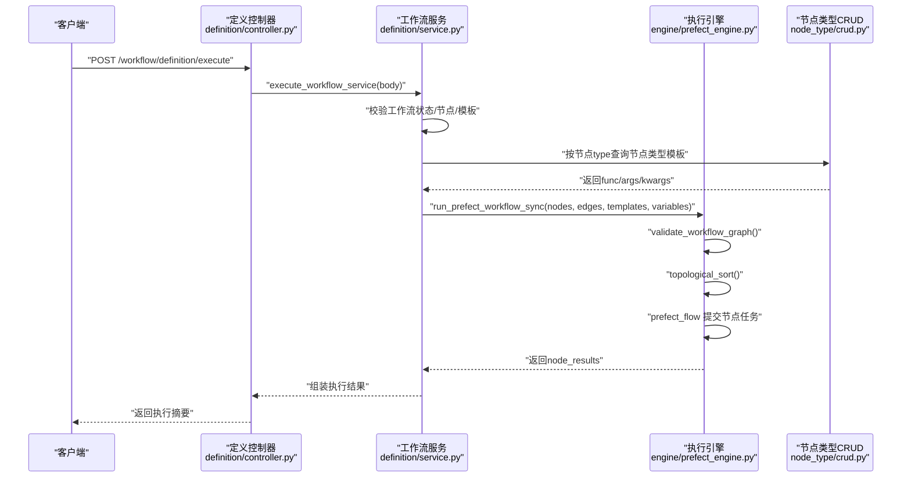
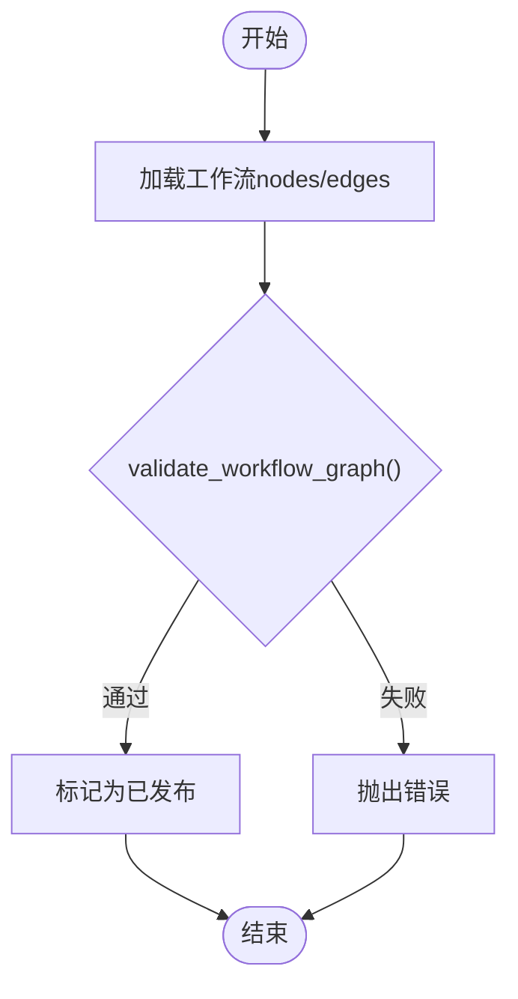
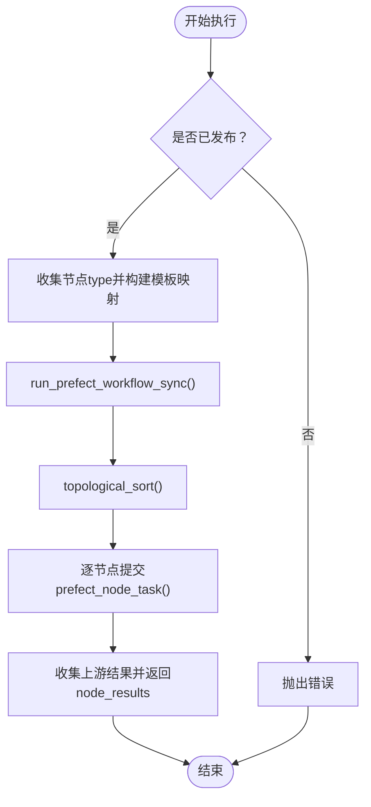
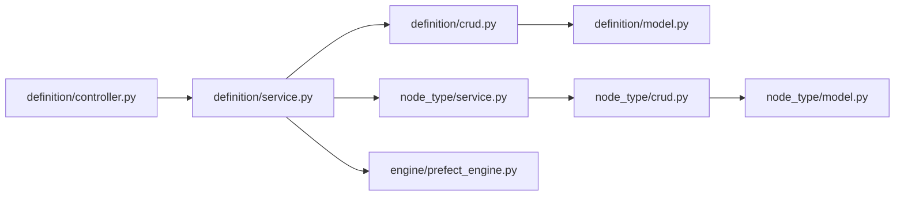

# 工作流 API

<cite>
**本文档引用的文件**
- [backend/app/plugin/module_task/workflow/definition/controller.py](file://backend/app/plugin/module_task/workflow/definition/controller.py)
- [backend/app/plugin/module_task/workflow/definition/schema.py](file://backend/app/plugin/module_task/workflow/definition/schema.py)
- [backend/app/plugin/module_task/workflow/definition/service.py](file://backend/app/plugin/module_task/workflow/definition/service.py)
- [backend/app/plugin/module_task/workflow/definition/crud.py](file://backend/app/plugin/module_task/workflow/definition/crud.py)
- [backend/app/plugin/module_task/workflow/definition/model.py](file://backend/app/plugin/module_task/workflow/definition/model.py)
- [backend/app/plugin/module_task/workflow/node_type/controller.py](file://backend/app/plugin/module_task/workflow/node_type/controller.py)
- [backend/app/plugin/module_task/workflow/node_type/schema.py](file://backend/app/plugin/module_task/workflow/node_type/schema.py)
- [backend/app/plugin/module_task/workflow/node_type/service.py](file://backend/app/plugin/module_task/workflow/node_type/service.py)
- [backend/app/plugin/module_task/workflow/node_type/crud.py](file://backend/app/plugin/module_task/workflow/node_type/crud.py)
- [backend/app/plugin/module_task/workflow/node_type/model.py](file://backend/app/plugin/module_task/workflow/node_type/model.py)
- [backend/app/plugin/module_task/workflow/engine/prefect_engine.py](file://backend/app/plugin/module_task/workflow/engine/prefect_engine.py)
</cite>

## 目录
1. [简介](#简介)
2. [项目结构](#项目结构)
3. [核心组件](#核心组件)
4. [架构总览](#架构总览)
5. [详细组件分析](#详细组件分析)
6. [依赖分析](#依赖分析)
7. [性能考虑](#性能考虑)
8. [故障排查指南](#故障排查指南)
9. [结论](#结论)
10. [附录](#附录)

## 简介
本文件为工作流模块的完整 API 接口文档，覆盖以下三大子域：
- 工作流定义管理接口（definition）：负责工作流画布的创建、编辑、查询、删除、发布与执行。
- 工作流节点类型管理接口（node_type）：负责编排节点类型（与定时任务节点分离）的创建、查询、更新、删除与选项获取。
- 工作流引擎接口（engine）：基于 Prefect 的 DAG 执行引擎，负责将 Vue Flow 画布转换为有向无环图并按拓扑顺序执行。

文档重点包括：
- 工作流创建、编辑、发布与执行的端到端流程与参数说明
- 节点配置、连接关系、执行条件与并行处理机制
- 工作流设计、节点类型定义、执行引擎控制与状态监控
- 工作流持久化、执行上下文管理与异常处理机制

## 项目结构
工作流模块位于后端插件目录下，采用“按功能域划分”的组织方式：
- definition：工作流定义的控制器、服务、CRUD、模型与数据结构
- node_type：节点类型定义的控制器、服务、CRUD、模型与数据结构
- engine：执行引擎（Prefect）实现

图表来源
- [backend/app/plugin/module_task/workflow/definition/controller.py:23-211](file://backend/app/plugin/module_task/workflow/definition/controller.py#L23-L211)
- [backend/app/plugin/module_task/workflow/definition/service.py:21-306](file://backend/app/plugin/module_task/workflow/definition/service.py#L21-L306)
- [backend/app/plugin/module_task/workflow/definition/crud.py:11-97](file://backend/app/plugin/module_task/workflow/definition/crud.py#L11-L97)
- [backend/app/plugin/module_task/workflow/definition/model.py:7-26](file://backend/app/plugin/module_task/workflow/definition/model.py#L7-L26)
- [backend/app/plugin/module_task/workflow/node_type/controller.py:21-182](file://backend/app/plugin/module_task/workflow/node_type/controller.py#L21-L182)
- [backend/app/plugin/module_task/workflow/node_type/service.py:13-196](file://backend/app/plugin/module_task/workflow/node_type/service.py#L13-L196)
- [backend/app/plugin/module_task/workflow/node_type/crud.py:12-110](file://backend/app/plugin/module_task/workflow/node_type/crud.py#L12-L110)
- [backend/app/plugin/module_task/workflow/node_type/model.py:13-35](file://backend/app/plugin/module_task/workflow/node_type/model.py#L13-L35)
- [backend/app/plugin/module_task/workflow/engine/prefect_engine.py:1-225](file://backend/app/plugin/module_task/workflow/engine/prefect_engine.py#L1-L225)

章节来源
- [backend/app/plugin/module_task/workflow/definition/controller.py:23-211](file://backend/app/plugin/module_task/workflow/definition/controller.py#L23-L211)
- [backend/app/plugin/module_task/workflow/node_type/controller.py:21-182](file://backend/app/plugin/module_task/workflow/node_type/controller.py#L21-L182)

## 核心组件
- 工作流定义（definition）
  - 控制器：提供详情、列表、创建、更新、删除、发布、执行等接口
  - 服务：封装业务逻辑，调用 CRUD 与引擎
  - CRUD/模型/数据结构：数据持久化与请求/响应模型
- 节点类型（node_type）
  - 控制器：提供选项、详情、列表、创建、更新、删除接口
  - 服务：封装节点类型管理逻辑
  - CRUD/模型/数据结构：节点类型持久化与查询参数
- 执行引擎（engine）
  - 图校验与拓扑排序
  - Prefect Flow/Task 封装与同步执行入口

章节来源
- [backend/app/plugin/module_task/workflow/definition/service.py:21-306](file://backend/app/plugin/module_task/workflow/definition/service.py#L21-L306)
- [backend/app/plugin/module_task/workflow/node_type/service.py:13-196](file://backend/app/plugin/module_task/workflow/node_type/service.py#L13-L196)
- [backend/app/plugin/module_task/workflow/engine/prefect_engine.py:36-225](file://backend/app/plugin/module_task/workflow/engine/prefect_engine.py#L36-L225)

## 架构总览
工作流执行的关键路径：控制器接收请求 → 服务层进行权限与业务校验 → 引擎层将画布转换为 DAG 并执行 → 返回执行结果。

图表来源
- [backend/app/plugin/module_task/workflow/definition/controller.py:188-211](file://backend/app/plugin/module_task/workflow/definition/controller.py#L188-L211)
- [backend/app/plugin/module_task/workflow/definition/service.py:225-306](file://backend/app/plugin/module_task/workflow/definition/service.py#L225-L306)
- [backend/app/plugin/module_task/workflow/engine/prefect_engine.py:189-225](file://backend/app/plugin/module_task/workflow/engine/prefect_engine.py#L189-L225)
- [backend/app/plugin/module_task/workflow/node_type/crud.py:12-97](file://backend/app/plugin/module_task/workflow/node_type/crud.py#L12-L97)

## 详细组件分析

### 工作流定义管理接口（definition）

- 基础路径：/workflow/definition
- 支持操作：
  - 获取详情：GET /detail/{id}
  - 列表查询：GET /list
  - 创建草稿：POST /create
  - 更新：PUT /update/{id}
  - 删除：DELETE /delete
  - 发布：POST /publish/{id}
  - 执行：POST /execute

- 请求与响应要点
  - 详情与列表返回统一包装格式
  - 创建/更新支持节点与连线（nodes/edges）字段
  - 发布前会进行图有效性校验（无环）
  - 执行时将节点类型模板与流程变量注入到每个节点任务

- 关键流程图（发布校验）

图表来源
- [backend/app/plugin/module_task/workflow/definition/service.py:183-223](file://backend/app/plugin/module_task/workflow/definition/service.py#L183-L223)
- [backend/app/plugin/module_task/workflow/engine/prefect_engine.py:36-72](file://backend/app/plugin/module_task/workflow/engine/prefect_engine.py#L36-L72)

- 关键流程图（执行流程）

图表来源
- [backend/app/plugin/module_task/workflow/definition/service.py:225-306](file://backend/app/plugin/module_task/workflow/definition/service.py#L225-L306)
- [backend/app/plugin/module_task/workflow/engine/prefect_engine.py:189-214](file://backend/app/plugin/module_task/workflow/engine/prefect_engine.py#L189-L214)

章节来源
- [backend/app/plugin/module_task/workflow/definition/controller.py:26-211](file://backend/app/plugin/module_task/workflow/definition/controller.py#L26-L211)
- [backend/app/plugin/module_task/workflow/definition/schema.py:11-124](file://backend/app/plugin/module_task/workflow/definition/schema.py#L11-L124)
- [backend/app/plugin/module_task/workflow/definition/service.py:21-306](file://backend/app/plugin/module_task/workflow/definition/service.py#L21-L306)
- [backend/app/plugin/module_task/workflow/definition/crud.py:11-97](file://backend/app/plugin/module_task/workflow/definition/crud.py#L11-L97)
- [backend/app/plugin/module_task/workflow/definition/model.py:7-26](file://backend/app/plugin/module_task/workflow/definition/model.py#L7-L26)

### 节点类型管理接口（node_type）

- 基础路径：/workflow/node-type
- 支持操作：
  - 选项（画布 palette）：GET /options
  - 详情：GET /detail/{id}
  - 列表：GET /list
  - 创建：POST /create
  - 更新：PUT /update/{id}
  - 删除：DELETE /delete

- 节点类型关键属性
  - code：与画布节点 type 对应
  - category：trigger/action/condition/control
  - func：Python 代码块（需定义 handler）
  - args/kwargs：默认参数（位置参数逗号分隔，关键字参数 JSON）
  - is_active：是否启用
  - sort_order：排序

- 选项接口说明
  - 仅返回启用的节点类型，供画布左侧拖拽使用
  - 返回结构与前端 Node options 对齐

章节来源
- [backend/app/plugin/module_task/workflow/node_type/controller.py:28-182](file://backend/app/plugin/module_task/workflow/node_type/controller.py#L28-L182)
- [backend/app/plugin/module_task/workflow/node_type/schema.py:9-78](file://backend/app/plugin/module_task/workflow/node_type/schema.py#L9-L78)
- [backend/app/plugin/module_task/workflow/node_type/service.py:13-196](file://backend/app/plugin/module_task/workflow/node_type/service.py#L13-L196)
- [backend/app/plugin/module_task/workflow/node_type/crud.py:12-110](file://backend/app/plugin/module_task/workflow/node_type/crud.py#L12-L110)
- [backend/app/plugin/module_task/workflow/node_type/model.py:13-35](file://backend/app/plugin/module_task/workflow/node_type/model.py#L13-L35)

### 执行引擎接口（engine）

- 核心职责
  - 将 Vue Flow 画布 nodes/edges 转换为 DAG
  - 校验图的有效性（无环）
  - 按拓扑顺序提交节点任务
  - 收集节点执行结果并返回

- 关键函数
  - validate_workflow_graph：检查节点是否存在、边是否合法、是否存在环
  - topological_sort：生成拓扑有序节点序列
  - run_workflow_prefect_flow：Prefect Flow 入口，逐节点提交任务
  - run_prefect_workflow_sync：同步入口，串联校验与执行
  - prefect_node_task：单节点任务封装，注入上游结果与流程变量

- 执行上下文
  - 节点参数解析：args（逗号分隔）、kwargs（JSON）
  - 上游结果聚合：以 source->result 形式传递给下游
  - 流程变量：variables 注入到每个节点的 kwargs 中

- 并行处理机制
  - 引擎按拓扑顺序提交任务，同一层节点由 Prefect 并行调度
  - 通过上游结果聚合实现节点间的数据传递

章节来源
- [backend/app/plugin/module_task/workflow/engine/prefect_engine.py:36-225](file://backend/app/plugin/module_task/workflow/engine/prefect_engine.py#L36-L225)

## 依赖分析
- 控制器依赖服务层，服务层依赖 CRUD 与模型，同时依赖执行引擎
- 节点类型服务依赖节点类型 CRUD 与模型
- 执行引擎依赖调度工具与日志

图表来源
- [backend/app/plugin/module_task/workflow/definition/controller.py:23-211](file://backend/app/plugin/module_task/workflow/definition/controller.py#L23-L211)
- [backend/app/plugin/module_task/workflow/definition/service.py:1-306](file://backend/app/plugin/module_task/workflow/definition/service.py#L1-L306)
- [backend/app/plugin/module_task/workflow/definition/crud.py:11-97](file://backend/app/plugin/module_task/workflow/definition/crud.py#L11-L97)
- [backend/app/plugin/module_task/workflow/node_type/service.py:1-196](file://backend/app/plugin/module_task/workflow/node_type/service.py#L1-L196)
- [backend/app/plugin/module_task/workflow/node_type/crud.py:12-110](file://backend/app/plugin/module_task/workflow/node_type/crud.py#L12-L110)
- [backend/app/plugin/module_task/workflow/engine/prefect_engine.py:1-225](file://backend/app/plugin/module_task/workflow/engine/prefect_engine.py#L1-L225)

## 性能考虑
- 执行引擎在独立线程池中运行，避免阻塞主线程
- 拓扑排序与图校验复杂度近似 O(V+E)，适合中小规模工作流
- 节点参数解析与 JSON 解析为轻量操作，建议在节点模板中预设合理默认值
- 大型工作流建议拆分为多个小型工作流或使用并行子流程

## 故障排查指南
- 工作流不存在：创建/更新/删除/发布/执行均会校验对象存在性
- 编码冲突：创建/更新时若编码重复会抛出错误
- 未发布不可执行：执行前必须确保工作流状态为已发布
- 图无效：发布与执行前均会校验图是否无环、节点与连线是否合法
- 节点类型缺失：执行时若节点 type 未注册或未配置 func，会抛出错误
- 执行异常：捕获异常并返回失败结果，包含错误信息与时间戳

章节来源
- [backend/app/plugin/module_task/workflow/definition/service.py:111-181](file://backend/app/plugin/module_task/workflow/definition/service.py#L111-L181)
- [backend/app/plugin/module_task/workflow/definition/service.py:183-223](file://backend/app/plugin/module_task/workflow/definition/service.py#L183-L223)
- [backend/app/plugin/module_task/workflow/definition/service.py:225-306](file://backend/app/plugin/module_task/workflow/definition/service.py#L225-L306)
- [backend/app/plugin/module_task/workflow/engine/prefect_engine.py:36-72](file://backend/app/plugin/module_task/workflow/engine/prefect_engine.py#L36-L72)

## 结论
工作流模块提供了从设计到执行的完整能力：
- 通过节点类型系统与画布配置，实现灵活的工作流设计
- 通过发布校验与执行引擎，保障执行的正确性与可观测性
- 通过统一的 API 与数据结构，便于前后端协作与扩展

## 附录

### API 定义总览

- 工作流定义（definition）
  - GET /workflow/definition/detail/{id}
  - GET /workflow/definition/list
  - POST /workflow/definition/create
  - PUT /workflow/definition/update/{id}
  - DELETE /workflow/definition/delete
  - POST /workflow/definition/publish/{id}
  - POST /workflow/definition/execute

- 节点类型（node_type）
  - GET /workflow/node-type/options
  - GET /workflow/node-type/detail/{id}
  - GET /workflow/node-type/list
  - POST /workflow/node-type/create
  - PUT /workflow/node-type/update/{id}
  - DELETE /workflow/node-type/delete

章节来源
- [backend/app/plugin/module_task/workflow/definition/controller.py:26-211](file://backend/app/plugin/module_task/workflow/definition/controller.py#L26-L211)
- [backend/app/plugin/module_task/workflow/node_type/controller.py:28-182](file://backend/app/plugin/module_task/workflow/node_type/controller.py#L28-L182)