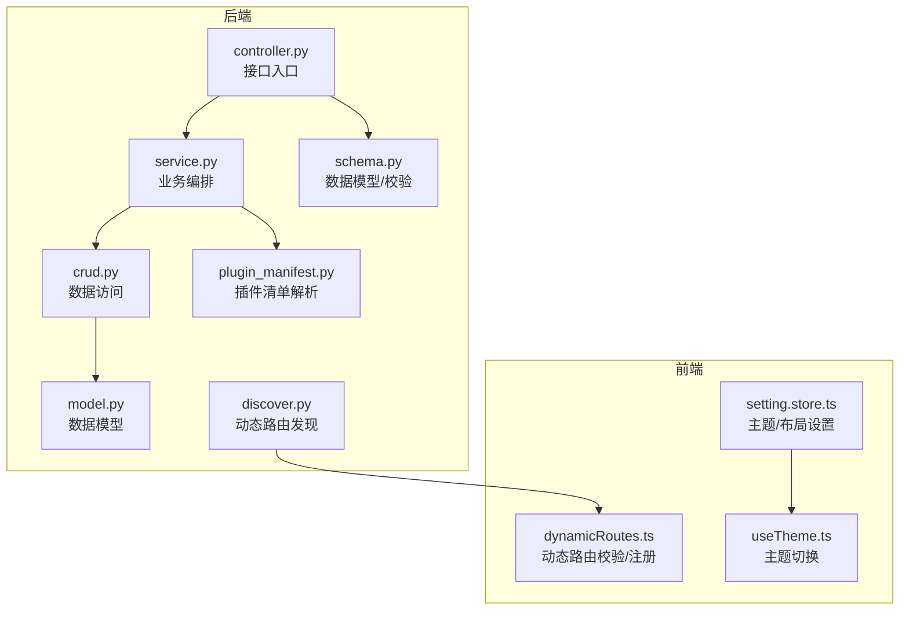
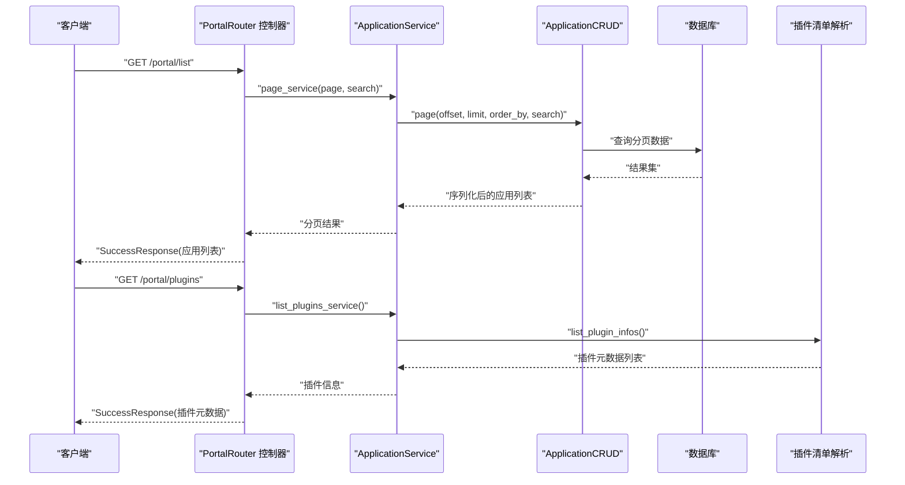
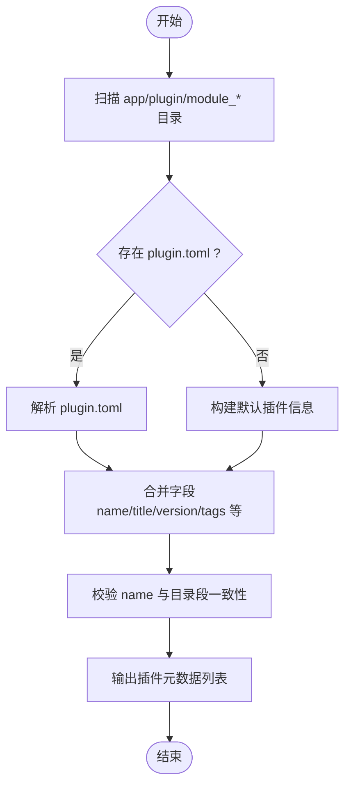
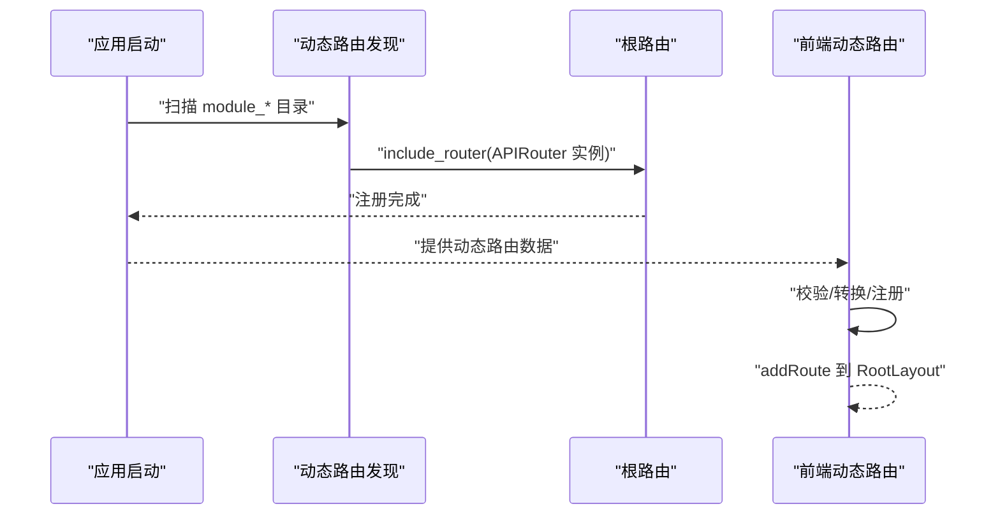
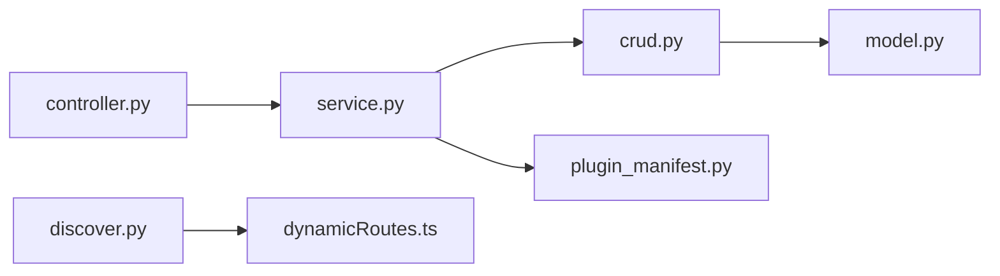

# 应用门户 API

<cite>
**本文引用的文件**
- [controller.py](file://backend/app/api/v1/module_application/portal/controller.py)
- [schema.py](file://backend/app/api/v1/module_application/portal/schema.py)
- [service.py](file://backend/app/api/v1/module_application/portal/service.py)
- [crud.py](file://backend/app/api/v1/module_application/portal/crud.py)
- [model.py](file://backend/app/api/v1/module_application/portal/model.py)
- [plugin_manifest.py](file://backend/app/api/v1/module_application/portal/plugin_manifest.py)
- [discover.py](file://backend/app/core/discover.py)
- [__init__.py](file://backend/app/api/v1/module_application/__init__.py)
- [init_app.py](file://backend/app/scripts/init_app.py)
- [dynamicRoutes.ts](file://frontend/web/src/router/dynamicRoutes.ts)
- [setting.store.ts](file://frontend/web/src/store/modules/setting.store.ts)
- [useTheme.ts](file://frontend/web/src/hooks/core/useTheme.ts)
- [plugin.toml](file://backend/app/plugin/module_example/plugin.toml)
- [README.en.md](file://README.en.md)
</cite>

## 目录
1. [简介](#简介)
2. [项目结构](#项目结构)
3. [核心组件](#核心组件)
4. [架构总览](#架构总览)
5. [详细组件分析](#详细组件分析)
6. [依赖分析](#依赖分析)
7. [性能考虑](#性能考虑)
8. [故障排除指南](#故障排除指南)
9. [结论](#结论)
10. [附录](#附录)

## 简介
本文件为“应用门户”模块的详细 API 接口文档，覆盖门户管理、插件清单与动态路由注册等能力。重点包括：
- 门户配置接口：应用的增删改查、状态批量设置、分页与查询参数。
- 插件发现机制：扫描 app/plugin 下 module_* 目录与可选 plugin.toml，输出插件元数据。
- 动态路由注册：后端自动发现与注册、前端动态路由校验与注册流程。
- 模块加载接口：插件目录结构与自动映射规则。
- 安全机制与权限控制：基于权限点的鉴权与操作日志。
- 个性化与主题：前端主题切换、布局与显示设置。

## 项目结构
门户模块位于后端 API v1 的 application 子模块下，采用标准的 MVC 分层：
- controller：HTTP 接口入口，负责参数注入与权限校验。
- service：业务逻辑编排，协调 CRUD 与插件清单解析。
- crud：数据访问层，封装通用 CRUD 操作。
- model：SQLAlchemy 数据模型。
- schema：请求/响应数据模型与校验器。
- plugin_manifest：插件清单解析与元数据构建。
- discover：动态路由自动发现与注册。
- 前端 dynamicRoutes：动态路由校验、转换与注册。

图表来源
- [controller.py:1-222](file://backend/app/api/v1/module_application/portal/controller.py#L1-L222)
- [service.py:1-191](file://backend/app/api/v1/module_application/portal/service.py#L1-L191)
- [crud.py:1-107](file://backend/app/api/v1/module_application/portal/crud.py#L1-L107)
- [model.py:1-24](file://backend/app/api/v1/module_application/portal/model.py#L1-L24)
- [schema.py:1-105](file://backend/app/api/v1/module_application/portal/schema.py#L1-L105)
- [plugin_manifest.py:1-117](file://backend/app/api/v1/module_application/portal/plugin_manifest.py#L1-L117)
- [discover.py:1-172](file://backend/app/core/discover.py#L1-L172)
- [dynamicRoutes.ts:1-471](file://frontend/web/src/router/dynamicRoutes.ts#L1-L471)
- [setting.store.ts:36-216](file://frontend/web/src/store/modules/setting.store.ts#L36-L216)
- [useTheme.ts:1-136](file://frontend/web/src/hooks/core/useTheme.ts#L1-L136)

章节来源
- [controller.py:1-222](file://backend/app/api/v1/module_application/portal/controller.py#L1-L222)
- [schema.py:1-105](file://backend/app/api/v1/module_application/portal/schema.py#L1-L105)
- [service.py:1-191](file://backend/app/api/v1/module_application/portal/service.py#L1-L191)
- [crud.py:1-107](file://backend/app/api/v1/module_application/portal/crud.py#L1-L107)
- [model.py:1-24](file://backend/app/api/v1/module_application/portal/model.py#L1-L24)
- [plugin_manifest.py:1-117](file://backend/app/api/v1/module_application/portal/plugin_manifest.py#L1-L117)
- [discover.py:1-172](file://backend/app/core/discover.py#L1-L172)
- [dynamicRoutes.ts:1-471](file://frontend/web/src/router/dynamicRoutes.ts#L1-L471)
- [setting.store.ts:36-216](file://frontend/web/src/store/modules/setting.store.ts#L36-L216)
- [useTheme.ts:1-136](file://frontend/web/src/hooks/core/useTheme.ts#L1-L136)

## 核心组件
- 门户控制器（PortalRouter）：提供应用详情、列表、创建、更新、删除、批量状态设置等接口。
- 服务层（ApplicationService）：封装业务逻辑，调用 CRUD 与插件清单解析。
- 数据访问层（ApplicationCRUD）：基于通用基类实现增删改查与分页。
- 数据模型（ApplicationModel）：门户应用表结构。
- 插件清单（plugin_manifest）：扫描 module_* 目录与 plugin.toml，输出插件元数据。
- 动态路由（discover）：自动发现并注册插件路由。
- 前端动态路由（dynamicRoutes）：校验、转换与注册动态路由，避免与静态壳层冲突。

章节来源
- [controller.py:23-222](file://backend/app/api/v1/module_application/portal/controller.py#L23-L222)
- [service.py:16-191](file://backend/app/api/v1/module_application/portal/service.py#L16-L191)
- [crud.py:11-107](file://backend/app/api/v1/module_application/portal/crud.py#L11-L107)
- [model.py:12-24](file://backend/app/api/v1/module_application/portal/model.py#L12-L24)
- [plugin_manifest.py:109-117](file://backend/app/api/v1/module_application/portal/plugin_manifest.py#L109-L117)
- [discover.py:62-172](file://backend/app/core/discover.py#L62-L172)
- [dynamicRoutes.ts:404-471](file://frontend/web/src/router/dynamicRoutes.ts#L404-L471)

## 架构总览
后端通过 APIRouter 路由到控制器，控制器调用服务层，服务层协调 CRUD 与插件清单解析；动态路由发现模块在应用启动时扫描插件目录并注册到根路由。前端动态路由模块负责校验与注册，避免与静态壳层冲突。

图表来源
- [controller.py:54-84](file://backend/app/api/v1/module_application/portal/controller.py#L54-L84)
- [controller.py:87-110](file://backend/app/api/v1/module_application/portal/controller.py#L87-L110)
- [service.py:74-101](file://backend/app/api/v1/module_application/portal/service.py#L74-L101)
- [service.py:22-30](file://backend/app/api/v1/module_application/portal/service.py#L22-L30)
- [crud.py:39-56](file://backend/app/api/v1/module_application/portal/crud.py#L39-L56)
- [plugin_manifest.py:109-117](file://backend/app/api/v1/module_application/portal/plugin_manifest.py#L109-L117)

## 详细组件分析

### 门户配置接口
- 路由前缀：/portal
- 权限点：基于 AuthPermission 注入的权限点进行鉴权
- 关键接口：
  - GET /portal/detail/{id}：获取应用详情
  - GET /portal/list：分页查询应用列表（支持模糊/精确/时间范围查询）
  - POST /portal/create：创建应用
  - PUT /portal/update/{id}：更新应用
  - DELETE /portal/delete：批量删除应用
  - PATCH /portal/available/setting：批量设置应用状态

请求/响应模型：
- ApplicationCreateSchema/ApplicationUpdateSchema：包含名称、访问地址、图标 URL、状态、描述等字段，并对 URL 进行校验。
- ApplicationOutSchema：继承基础模型与用户/租户字段，用于响应。
- ApplicationQueryParam：支持名称模糊匹配、状态/用户/时间范围查询。

章节来源
- [controller.py:26-222](file://backend/app/api/v1/module_application/portal/controller.py#L26-L222)
- [schema.py:11-105](file://backend/app/api/v1/module_application/portal/schema.py#L11-L105)
- [service.py:33-191](file://backend/app/api/v1/module_application/portal/service.py#L33-L191)
- [crud.py:24-107](file://backend/app/api/v1/module_application/portal/crud.py#L24-L107)
- [model.py:21-24](file://backend/app/api/v1/module_application/portal/model.py#L21-L24)

### 插件清单与发现机制
- 插件目录结构：app/plugin/module_*，每个模块可包含可选 plugin.toml。
- 清单字段：name、title、version、description、optional、tags 等；当 name 与目录段不一致时标记为不匹配。
- 发现流程：
  - 后端扫描 app/plugin 下 module_* 目录，解析 plugin.toml（如存在）。
  - 输出插件元数据列表，供管理端展示。
- 自动路由注册：
  - 后端在启动时扫描 module_*/**/controller.py，顶层定义的 APIRouter 实例会被注册到对应前缀。
  - 前端动态路由模块负责校验与注册，避免与静态壳层冲突。

图表来源
- [plugin_manifest.py:59-106](file://backend/app/api/v1/module_application/portal/plugin_manifest.py#L59-L106)
- [plugin.toml:1-9](file://backend/app/plugin/module_example/plugin.toml#L1-L9)

章节来源
- [plugin_manifest.py:1-117](file://backend/app/api/v1/module_application/portal/plugin_manifest.py#L1-L117)
- [plugin.toml:1-9](file://backend/app/plugin/module_example/plugin.toml#L1-L9)
- [discover.py:62-172](file://backend/app/core/discover.py#L62-L172)
- [README.en.md:387-415](file://README.en.md#L387-L415)

### 动态路由注册与模块加载
- 后端自动发现：
  - 扫描 app/plugin/module_*/**/controller.py，顶层 APIRouter 实例注册到容器路由（前缀为 /xxx，xxx 为 module_ 后的名称）。
  - 对未导出路由或导入失败的情况给出明确日志提示。
- 前端动态路由：
  - 校验：重复名称、缺失 component、深层误用 layout 占位等。
  - 转换：将 AppRouteRecord 转换为 vue-router 记录，支持 iframe、嵌套父级等场景。
  - 注册：批量 addRoute 到 RootLayout，跳过与静态壳层冲突的一级 path 段。

图表来源
- [discover.py:62-172](file://backend/app/core/discover.py#L62-L172)
- [init_app.py:152-158](file://backend/app/scripts/init_app.py#L152-L158)
- [dynamicRoutes.ts:404-471](file://frontend/web/src/router/dynamicRoutes.ts#L404-L471)

章节来源
- [discover.py:1-172](file://backend/app/core/discover.py#L1-L172)
- [init_app.py:125-166](file://backend/app/scripts/init_app.py#L125-L166)
- [dynamicRoutes.ts:1-471](file://frontend/web/src/router/dynamicRoutes.ts#L1-L471)

### 门户布局配置、主题切换与个性化设置
- 主题与布局：
  - 前端设置存储（setting.store.ts）维护主题类型、主题模式、菜单主题、颜色、布局等持久化配置。
  - 主题切换钩子（useTheme.ts）支持亮色、暗色、自动模式，自动计算主色明暗变体并应用。
- 个性化设置：
  - 显示开关：面包屑、工作标签、语言选择、通知等。
  - 功能开关：唯一展开、色弱模式、节日特效等。
  - 布局样式：页面过渡、标签样式、圆角、容器宽度等。

章节来源
- [setting.store.ts:36-216](file://frontend/web/src/store/modules/setting.store.ts#L36-L216)
- [useTheme.ts:1-136](file://frontend/web/src/hooks/core/useTheme.ts#L1-L136)

### 安全机制、权限控制与隔离策略
- 权限控制：
  - 控制器使用 AuthPermission 注入权限点，如 module_application:portal:query、module_application:portal:create 等。
  - 每个接口均绑定相应权限点，未授权调用将被拒绝。
- 日志与审计：
  - 控制器使用 OperationLogRoute 记录操作日志，便于审计。
- 输入校验：
  - schema 对 URL 进行严格校验，防止非法输入。
- 隔离策略：
  - 插件路由按模块前缀隔离，避免相互覆盖。
  - 前端动态路由注册时跳过与静态壳层冲突的一级 path 段，避免覆盖首页/仪表盘等。

章节来源
- [controller.py:34-36](file://backend/app/api/v1/module_application/portal/controller.py#L34-L36)
- [controller.py:63-64](file://backend/app/api/v1/module_application/portal/controller.py#L63-L64)
- [controller.py:123-124](file://backend/app/api/v1/module_application/portal/controller.py#L123-L124)
- [controller.py:152-153](file://backend/app/api/v1/module_application/portal/controller.py#L152-L153)
- [controller.py:181-182](file://backend/app/api/v1/module_application/portal/controller.py#L181-L182)
- [controller.py:207-208](file://backend/app/api/v1/module_application/portal/controller.py#L207-L208)
- [schema.py:20-42](file://backend/app/api/v1/module_application/portal/schema.py#L20-L42)
- [dynamicRoutes.ts:379-380](file://frontend/web/src/router/dynamicRoutes.ts#L379-L380)

## 依赖分析
- 组件耦合：
  - controller 依赖 service；service 依赖 crud 与 plugin_manifest；crud 依赖 model 与通用基类。
  - 前端 dynamicRoutes 依赖路由类型与组件加载器，避免与静态路由冲突。
- 外部依赖：
  - 后端依赖 FastAPI、SQLAlchemy、tomli/tomllib（Python 3.11+ 使用内置 tomllib）。
  - 前端依赖 vue-router、VueUse、Element Plus 等生态。

图表来源
- [controller.py:1-222](file://backend/app/api/v1/module_application/portal/controller.py#L1-L222)
- [service.py:1-191](file://backend/app/api/v1/module_application/portal/service.py#L1-L191)
- [crud.py:1-107](file://backend/app/api/v1/module_application/portal/crud.py#L1-L107)
- [model.py:1-24](file://backend/app/api/v1/module_application/portal/model.py#L1-L24)
- [plugin_manifest.py:1-117](file://backend/app/api/v1/module_application/portal/plugin_manifest.py#L1-L117)
- [discover.py:1-172](file://backend/app/core/discover.py#L1-L172)
- [dynamicRoutes.ts:1-471](file://frontend/web/src/router/dynamicRoutes.ts#L1-L471)

章节来源
- [controller.py:1-222](file://backend/app/api/v1/module_application/portal/controller.py#L1-L222)
- [service.py:1-191](file://backend/app/api/v1/module_application/portal/service.py#L1-L191)
- [crud.py:1-107](file://backend/app/api/v1/module_application/portal/crud.py#L1-L107)
- [model.py:1-24](file://backend/app/api/v1/module_application/portal/model.py#L1-L24)
- [plugin_manifest.py:1-117](file://backend/app/api/v1/module_application/portal/plugin_manifest.py#L1-L117)
- [discover.py:1-172](file://backend/app/core/discover.py#L1-L172)
- [dynamicRoutes.ts:1-471](file://frontend/web/src/router/dynamicRoutes.ts#L1-L471)

## 性能考虑
- 分页查询：后端使用 OFFSET/LIMIT 分页，建议配合索引与合理排序字段。
- 动态路由发现：扫描与导入模块在启动阶段执行，建议保持模块结构清晰、避免循环导入。
- 前端组件懒加载：通过 import.meta.glob 按需加载，减少初始包体积。
- 主题切换：临时禁用过渡避免闪烁，切换后恢复过渡，保证用户体验。

## 故障排除指南
- “未找到路由”或“未注册任何路由”：
  - 检查 controller.py 是否在模块顶层定义 APIRouter 实例。
  - 确认目录名为合法 Python 标识符，且包含 __init__.py。
  - 参考后端日志中的导入失败提示，定位具体异常类型与原因。
- “插件元数据为空”：
  - 确认 module_* 目录命名规范与 plugin.toml 路径正确。
  - 检查 plugin.toml 语法与字段类型。
- “动态路由覆盖静态壳层”：
  - 前端注册时会跳过与静态壳层冲突的一级 path 段，确认路由 path 首段未与保留段冲突。
- “权限不足”：
  - 确认调用接口所需的权限点已在用户角色中配置。

章节来源
- [discover.py:33-59](file://backend/app/core/discover.py#L33-L59)
- [discover.py:136-143](file://backend/app/core/discover.py#L136-L143)
- [dynamicRoutes.ts:379-380](file://frontend/web/src/router/dynamicRoutes.ts#L379-L380)
- [controller.py:34-36](file://backend/app/api/v1/module_application/portal/controller.py#L34-L36)

## 结论
应用门户模块提供了完善的门户管理、插件发现与动态路由注册能力，结合严格的权限控制与前端个性化设置，能够满足企业级应用门户的扩展与定制需求。通过清晰的目录与命名规范、完善的日志与校验机制，系统具备良好的可维护性与可扩展性。

## 附录
- API 路由前缀：/portal
- 权限点示例：
  - 详情查询：module_application:portal:detail
  - 列表查询：module_application:portal:query
  - 创建：module_application:portal:create
  - 更新：module_application:portal:update
  - 删除：module_application:portal:delete
  - 批量设置：module_application:portal:patch
- 插件目录结构与自动映射参考：README.en.md 中的“Plugin Directory Structure”与“Automatic Route Registration Mechanism”。

章节来源
- [controller.py:23-222](file://backend/app/api/v1/module_application/portal/controller.py#L23-L222)
- [__init__.py:1-7](file://backend/app/api/v1/module_application/__init__.py#L1-L7)
- [README.en.md:387-415](file://README.en.md#L387-L415)