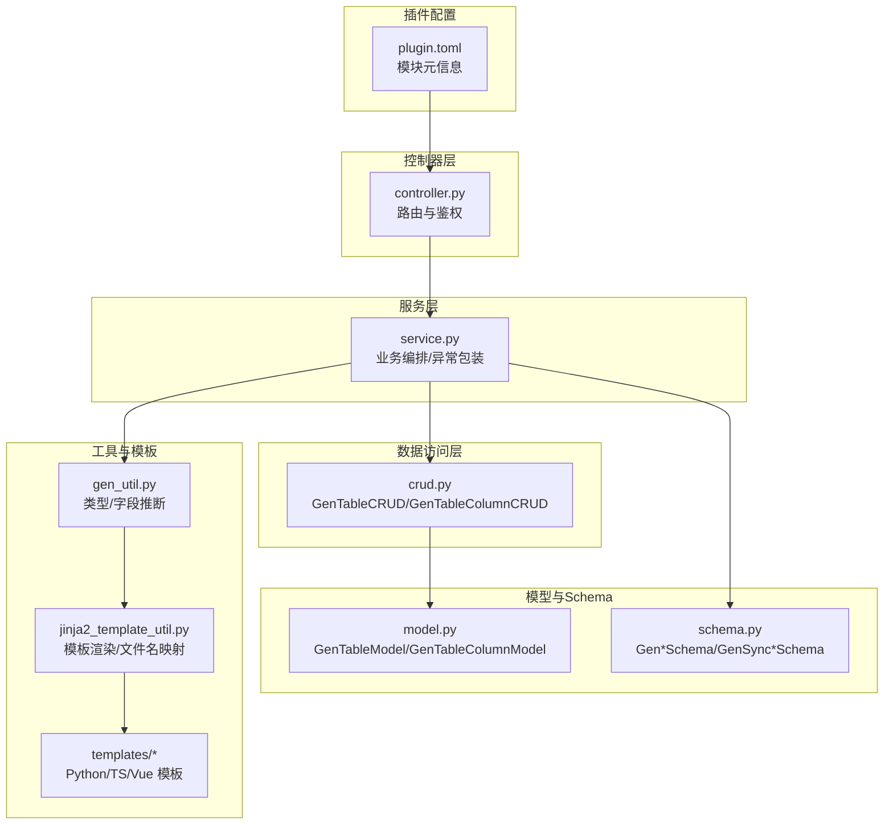
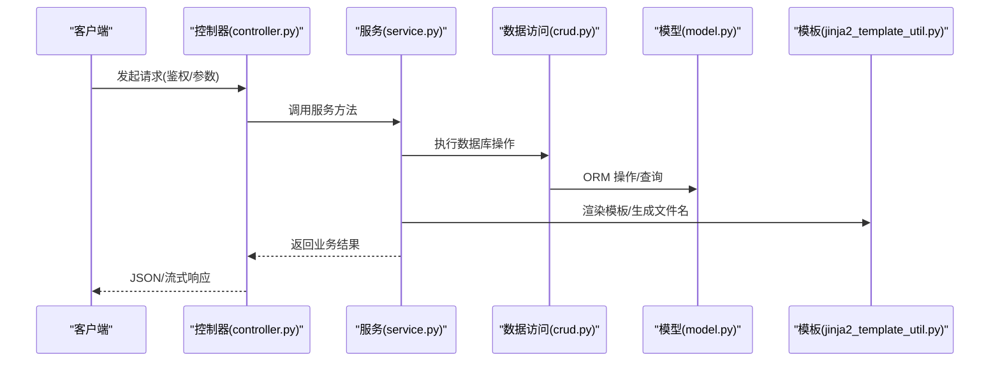
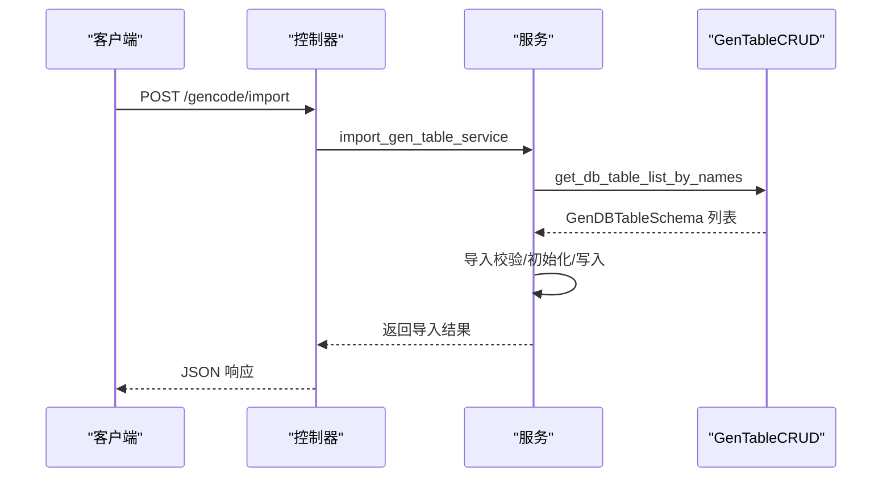
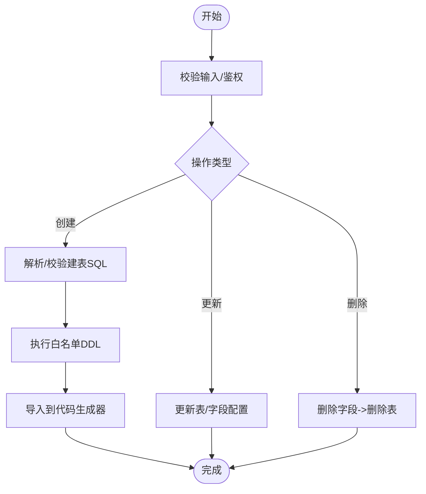
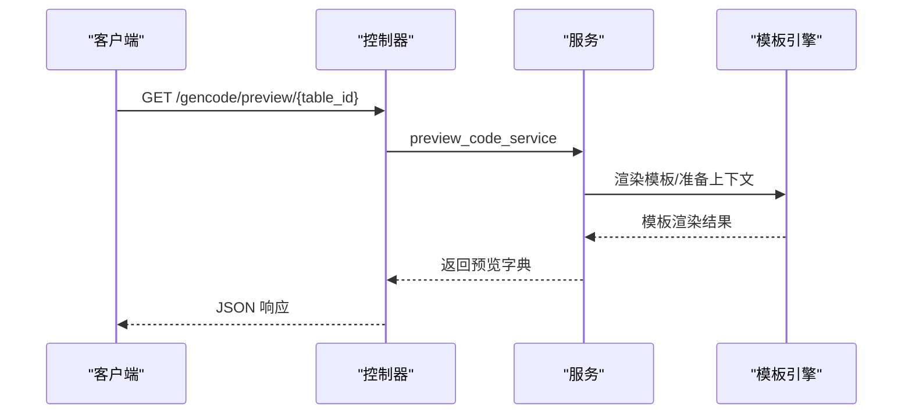
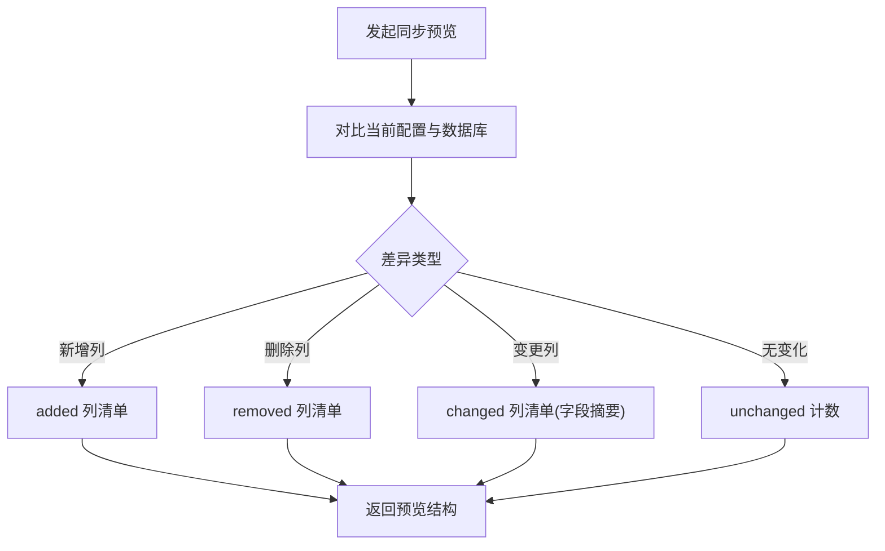
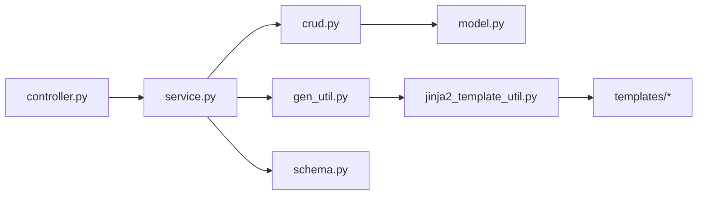

# 代码生成器 API

<cite>
**本文引用的文件**
- [controller.py](file://backend/app/plugin/module_generator/gencode/controller.py)
- [service.py](file://backend/app/plugin/module_generator/gencode/service.py)
- [crud.py](file://backend/app/plugin/module_generator/gencode/crud.py)
- [schema.py](file://backend/app/plugin/module_generator/gencode/schema.py)
- [model.py](file://backend/app/plugin/module_generator/gencode/model.py)
- [gen_util.py](file://backend/app/plugin/module_generator/gencode/tools/gen_util.py)
- [jinja2_template_util.py](file://backend/app/plugin/module_generator/gencode/tools/jinja2_template_util.py)
- [plugin.toml](file://backend/app/plugin/module_generator/plugin.toml)
- [controller.py.j2](file://backend/app/plugin/module_generator/gencode/templates/python/controller.py.j2)
- [api.ts.j2](file://backend/app/plugin/module_generator/gencode/templates/ts/api.ts.j2)
- [index.vue.j2](file://backend/app/plugin/module_generator/gencode/templates/vue/index.vue.j2)
</cite>

## 目录
1. [简介](#简介)
2. [项目结构](#项目结构)
3. [核心组件](#核心组件)
4. [架构总览](#架构总览)
5. [详细组件分析](#详细组件分析)
6. [依赖分析](#依赖分析)
7. [性能考虑](#性能考虑)
8. [故障排查指南](#故障排查指南)
9. [结论](#结论)
10. [附录](#附录)

## 简介
本文件为“代码生成器模块”的完整 API 接口文档，覆盖数据库表查询、业务表管理、代码生成、预览与同步等能力。重点说明：
- 表结构导入、创建、更新、删除的接口规范与参数要求
- 批量代码生成、本地代码生成、代码预览的调用方式与返回格式
- 数据库同步差异预览、表结构创建 SQL 生成等高级功能
- 代码生成模板配置、输出格式选择与下载机制
- 接口权限控制、错误处理与调试模式使用

## 项目结构
代码生成器模块位于后端插件目录，采用“控制器-服务-数据访问-工具-模板”的分层设计，配合 Pydantic Schema 进行参数校验与序列化。

**图表来源**
- [controller.py:1-363](file://backend/app/plugin/module_generator/gencode/controller.py#L1-L363)
- [service.py:1-800](file://backend/app/plugin/module_generator/gencode/service.py#L1-L800)
- [crud.py:1-639](file://backend/app/plugin/module_generator/gencode/crud.py#L1-L639)
- [model.py:1-252](file://backend/app/plugin/module_generator/gencode/model.py#L1-L252)
- [schema.py:1-326](file://backend/app/plugin/module_generator/gencode/schema.py#L1-L326)
- [gen_util.py:1-342](file://backend/app/plugin/module_generator/gencode/tools/gen_util.py#L1-L342)
- [jinja2_template_util.py:1-795](file://backend/app/plugin/module_generator/gencode/tools/jinja2_template_util.py#L1-L795)
- [plugin.toml:1-9](file://backend/app/plugin/module_generator/plugin.toml#L1-L9)

**章节来源**
- [controller.py:1-363](file://backend/app/plugin/module_generator/gencode/controller.py#L1-L363)
- [service.py:1-800](file://backend/app/plugin/module_generator/gencode/service.py#L1-L800)
- [crud.py:1-639](file://backend/app/plugin/module_generator/gencode/crud.py#L1-L639)
- [schema.py:1-326](file://backend/app/plugin/module_generator/gencode/schema.py#L1-L326)
- [model.py:1-252](file://backend/app/plugin/module_generator/gencode/model.py#L1-L252)
- [gen_util.py:1-342](file://backend/app/plugin/module_generator/gencode/tools/gen_util.py#L1-L342)
- [jinja2_template_util.py:1-795](file://backend/app/plugin/module_generator/gencode/tools/jinja2_template_util.py#L1-L795)
- [plugin.toml:1-9](file://backend/app/plugin/module_generator/plugin.toml#L1-L9)

## 核心组件
- 控制器层：定义 REST 接口、参数绑定、鉴权与响应封装
- 服务层：业务编排、异常包装、模板渲染、菜单与权限注入
- 数据访问层：CRUD 操作、数据库方言适配、分页与过滤
- 模型与 Schema：ORM 模型与 Pydantic 输入/输出模型
- 工具与模板：类型映射、字段推断、Jinja2 渲染与文件名映射
- 插件配置：模块元信息与标签

**章节来源**
- [controller.py:24-363](file://backend/app/plugin/module_generator/gencode/controller.py#L24-L363)
- [service.py:69-800](file://backend/app/plugin/module_generator/gencode/service.py#L69-L800)
- [crud.py:24-639](file://backend/app/plugin/module_generator/gencode/crud.py#L24-L639)
- [schema.py:11-326](file://backend/app/plugin/module_generator/gencode/schema.py#L11-L326)
- [model.py:10-252](file://backend/app/plugin/module_generator/gencode/model.py#L10-L252)
- [gen_util.py:12-342](file://backend/app/plugin/module_generator/gencode/tools/gen_util.py#L12-L342)
- [jinja2_template_util.py:19-795](file://backend/app/plugin/module_generator/gencode/tools/jinja2_template_util.py#L19-L795)

## 架构总览
代码生成器遵循“控制器-服务-数据访问-模板引擎”的分层架构，控制器负责鉴权与参数校验，服务层负责业务流程与模板渲染，数据访问层负责数据库交互与方言适配，工具层提供类型映射与字段推断，模板层输出后端控制器、服务、CRUD、Schema、Model 以及前端 API 与页面。

**图表来源**
- [controller.py:27-363](file://backend/app/plugin/module_generator/gencode/controller.py#L27-L363)
- [service.py:241-800](file://backend/app/plugin/module_generator/gencode/service.py#L241-L800)
- [crud.py:24-639](file://backend/app/plugin/module_generator/gencode/crud.py#L24-L639)
- [jinja2_template_util.py:54-795](file://backend/app/plugin/module_generator/gencode/tools/jinja2_template_util.py#L54-L795)

## 详细组件分析

### 1. 数据库表查询与导入
- 接口：GET /gencode/db/list
  - 功能：分页查询数据库表列表（数据库侧分页，避免全量反射）
  - 鉴权：module_generator:dblist:query
  - 请求参数：分页参数、模糊查询（表名/注释）
  - 返回：分页结果（items、total、has_next）
- 接口：POST /gencode/import
  - 功能：批量导入表结构（从数据库表导入到代码生成器）
  - 鉴权：module_generator:gencode:import
  - 请求体：表名数组
  - 返回：布尔结果
- 数据访问：GenTableCRUD.get_db_table_page/get_db_table_list_by_names
  - 方言适配：MySQL/Postgres 专用 SQL，回退到全量遍历

**图表来源**
- [controller.py:96-125](file://backend/app/plugin/module_generator/gencode/controller.py#L96-L125)
- [service.py:357-441](file://backend/app/plugin/module_generator/gencode/service.py#L357-L441)
- [crud.py:312-336](file://backend/app/plugin/module_generator/gencode/crud.py#L312-L336)

**章节来源**
- [controller.py:63-125](file://backend/app/plugin/module_generator/gencode/controller.py#L63-L125)
- [service.py:307-441](file://backend/app/plugin/module_generator/gencode/service.py#L307-L441)
- [crud.py:192-336](file://backend/app/plugin/module_generator/gencode/crud.py#L192-L336)
- [schema.py:11-22](file://backend/app/plugin/module_generator/gencode/schema.py#L11-L22)

### 2. 业务表管理（增删改查）
- 接口：GET /gencode/list
  - 功能：分页查询业务表列表
  - 鉴权：module_generator:gencode:query
  - 返回：分页结果
- 接口：GET /gencode/detail/{table_id}
  - 功能：获取业务表详情
  - 鉴权：module_generator:gencode:query
  - 返回：GenTableOutSchema
- 接口：POST /gencode/create
  - 功能：创建表结构（执行建表 SQL 并导入）
  - 鉴权：module_generator:gencode:create
  - 请求体：GenCreateTableSqlBody(sql)
  - 返回：布尔结果
- 接口：PUT /gencode/update/{table_id}
  - 功能：编辑业务表信息
  - 鉴权：module_generator:gencode:update
  - 请求体：GenTableSchema
  - 返回：GenTableOutSchema
- 接口：DELETE /gencode/delete
  - 功能：批量删除业务表（先删字段，再删表）
  - 鉴权：module_generator:gencode:delete
  - 请求体：ID 数组
  - 返回：空

**图表来源**
- [controller.py:127-236](file://backend/app/plugin/module_generator/gencode/controller.py#L127-L236)
- [service.py:444-601](file://backend/app/plugin/module_generator/gencode/service.py#L444-L601)
- [schema.py:24-28](file://backend/app/plugin/module_generator/gencode/schema.py#L24-L28)

**章节来源**
- [controller.py:27-236](file://backend/app/plugin/module_generator/gencode/controller.py#L27-L236)
- [service.py:241-601](file://backend/app/plugin/module_generator/gencode/service.py#L241-L601)
- [schema.py:78-270](file://backend/app/plugin/module_generator/gencode/schema.py#L78-L270)

### 3. 代码生成与预览
- 接口：POST /gencode/batch/output
  - 功能：批量生成代码并打包为 ZIP 流
  - 鉴权：module_generator:gencode:operate
  - 请求体：表名数组
  - 返回：StreamResponse(application/zip)
- 接口：POST /gencode/output/{table_name}
  - 功能：生成代码到指定路径（安全写入）
  - 鉴权：module_generator:gencode:code
  - 路径参数：表名
  - 返回：布尔结果
- 接口：GET /gencode/preview/{table_id}
  - 功能：预览代码（模板渲染，返回文件名->内容映射）
  - 鉴权：module_generator:gencode:query
  - 返回：dict

**图表来源**
- [controller.py:291-314](file://backend/app/plugin/module_generator/gencode/controller.py#L291-L314)
- [service.py:649-704](file://backend/app/plugin/module_generator/gencode/service.py#L649-L704)
- [jinja2_template_util.py:152-242](file://backend/app/plugin/module_generator/gencode/tools/jinja2_template_util.py#L152-L242)

**章节来源**
- [controller.py:238-314](file://backend/app/plugin/module_generator/gencode/controller.py#L238-L314)
- [service.py:649-704](file://backend/app/plugin/module_generator/gencode/service.py#L649-L704)
- [jinja2_template_util.py:295-366](file://backend/app/plugin/module_generator/gencode/tools/jinja2_template_util.py#L295-L366)

### 4. 数据库同步与差异预览
- 接口：POST /gencode/sync_db/{table_name}
  - 功能：同步数据库（执行白名单 ALTER/DDL，限制外键约束添加）
  - 鉴权：module_generator:db:sync
  - 返回：空
- 接口：GET /gencode/sync_db/preview/{table_name}
  - 功能：同步前差异预览（主表+可选子表），不落库
  - 鉴权：module_generator:db:sync
  - 返回：GenSyncPreviewSchema

**图表来源**
- [controller.py:316-363](file://backend/app/plugin/module_generator/gencode/controller.py#L316-L363)
- [service.py:444-529](file://backend/app/plugin/module_generator/gencode/service.py#L444-L529)
- [schema.py:283-296](file://backend/app/plugin/module_generator/gencode/schema.py#L283-L296)

**章节来源**
- [controller.py:316-363](file://backend/app/plugin/module_generator/gencode/controller.py#L316-L363)
- [service.py:444-529](file://backend/app/plugin/module_generator/gencode/service.py#L444-L529)
- [schema.py:272-296](file://backend/app/plugin/module_generator/gencode/schema.py#L272-L296)

### 5. 权限控制与错误处理
- 权限控制
  - 控制器使用 AuthPermission 注解，按模块与动作维度授权
  - 示例权限键：module_generator:gencode:query、module_generator:gencode:import、module_generator:gencode:create、module_generator:gencode:update、module_generator:gencode:delete、module_generator:gencode:operate、module_generator:gencode:code、module_generator:db:sync、module_generator:dblist:query
- 错误处理
  - 服务层装饰器 handle_service_exception 将异常包装为 CustomException
  - CRUD 层对 SQL 执行失败进行捕获与日志记录

**章节来源**
- [controller.py:36-125](file://backend/app/plugin/module_generator/gencode/controller.py#L36-L125)
- [service.py:43-62](file://backend/app/plugin/module_generator/gencode/service.py#L43-L62)

### 6. 模板配置与输出格式
- 模板清单
  - 后端：controller.py.j2、service.py.j2、crud.py.j2、schema.py.j2、model.py.j2、__init__.py.j2
  - 前端：api.ts.j2、index.vue.j2
- 文件名映射
  - Jinja2TemplateUtil.get_file_name 将模板映射到 backend/frontend 目标路径
- 输出格式
  - 本地生成：按模板渲染后写入目标路径
  - 批量生成：返回 ZIP 流，前端可直接下载

**章节来源**
- [jinja2_template_util.py:295-366](file://backend/app/plugin/module_generator/gencode/tools/jinja2_template_util.py#L295-L366)
- [controller.py.j2:1-239](file://backend/app/plugin/module_generator/gencode/templates/python/controller.py.j2#L1-L239)
- [api.ts.j2:1-136](file://backend/app/plugin/module_generator/gencode/templates/ts/api.ts.j2#L1-L136)
- [index.vue.j2:1-825](file://backend/app/plugin/module_generator/gencode/templates/vue/index.vue.j2#L1-L825)

## 依赖分析
- 控制器依赖服务层，服务层依赖数据访问层与工具层，工具层依赖模板引擎与常量配置
- 数据访问层依赖 ORM 模型与数据库引擎
- 模板引擎依赖模板目录与过滤器

**图表来源**
- [controller.py:14-22](file://backend/app/plugin/module_generator/gencode/controller.py#L14-L22)
- [service.py:29-40](file://backend/app/plugin/module_generator/gencode/service.py#L29-L40)
- [crud.py:11-18](file://backend/app/plugin/module_generator/gencode/crud.py#L11-L18)
- [gen_util.py:3-8](file://backend/app/plugin/module_generator/gencode/tools/gen_util.py#L3-L8)
- [jinja2_template_util.py:5-16](file://backend/app/plugin/module_generator/gencode/tools/jinja2_template_util.py#L5-L16)
- [schema.py:4-8](file://backend/app/plugin/module_generator/gencode/schema.py#L4-L8)

**章节来源**
- [controller.py:14-22](file://backend/app/plugin/module_generator/gencode/controller.py#L14-L22)
- [service.py:29-40](file://backend/app/plugin/module_generator/gencode/service.py#L29-L40)
- [crud.py:11-18](file://backend/app/plugin/module_generator/gencode/crud.py#L11-L18)
- [gen_util.py:3-8](file://backend/app/plugin/module_generator/gencode/tools/gen_util.py#L3-L8)
- [jinja2_template_util.py:5-16](file://backend/app/plugin/module_generator/gencode/tools/jinja2_template_util.py#L5-L16)
- [schema.py:4-8](file://backend/app/plugin/module_generator/gencode/schema.py#L4-L8)

## 性能考虑
- 数据库表列表查询采用数据库侧分页（MySQL/Postgres 专用 SQL），避免全量遍历导致的性能问题
- 批量生成返回流式 ZIP，降低内存占用
- 模板渲染采用异步环境，提升并发渲染效率

[本节为通用指导，无需特定文件引用]

## 故障排查指南
- 常见错误
  - 导入失败：检查表名是否已存在、SQL 语法是否正确
  - 同步失败：确认仅执行白名单 DDL/ALTER，避免 DROP/DELETE/INSERT/UPDATE/TRUNCATE
  - 预览异常：检查模板上下文与字段推断逻辑
- 日志与异常
  - 服务层统一包装异常，便于定位
  - CRUD 层对 SQL 执行失败进行日志记录
- 调试建议
  - 启用调试模式查看详细日志
  - 使用差异预览接口在同步前核对变更

**章节来源**
- [service.py:43-62](file://backend/app/plugin/module_generator/gencode/service.py#L43-L62)
- [service.py:444-529](file://backend/app/plugin/module_generator/gencode/service.py#L444-L529)
- [crud.py:380-396](file://backend/app/plugin/module_generator/gencode/crud.py#L380-L396)

## 结论
代码生成器模块提供了完整的“从数据库到代码”的自动化流水线，具备完善的权限控制、错误处理与性能优化。通过标准化的接口与模板体系，开发者可以快速完成业务表的导入、配置、生成与同步，显著提升开发效率。

[本节为总结，无需特定文件引用]

## 附录

### A. 接口一览与鉴权键
- GET /gencode/db/list：module_generator:dblist:query
- POST /gencode/import：module_generator:gencode:import
- GET /gencode/list：module_generator:gencode:query
- GET /gencode/detail/{table_id}：module_generator:gencode:query
- POST /gencode/create：module_generator:gencode:create
- PUT /gencode/update/{table_id}：module_generator:gencode:update
- DELETE /gencode/delete：module_generator:gencode:delete
- POST /gencode/batch/output：module_generator:gencode:operate
- POST /gencode/output/{table_name}：module_generator:gencode:code
- GET /gencode/preview/{table_id}：module_generator:gencode:query
- POST /gencode/sync_db/{table_name}：module_generator:db:sync
- GET /gencode/sync_db/preview/{table_name}：module_generator:db:sync

**章节来源**
- [controller.py:27-363](file://backend/app/plugin/module_generator/gencode/controller.py#L27-L363)

### B. 数据模型与字段说明
- GenTableSchema/GenTableOutSchema：业务表配置与输出模型
- GenTableColumnSchema/GenTableColumnOutSchema：字段配置与输出模型
- GenDBTableSchema：数据库表信息（跨方言统一结构）
- GenSyncPreviewSchema/GenSyncColumnChange：同步差异预览模型

**章节来源**
- [schema.py:11-326](file://backend/app/plugin/module_generator/gencode/schema.py#L11-L326)
- [model.py:10-252](file://backend/app/plugin/module_generator/gencode/model.py#L10-L252)

### C. 模板与输出路径映射
- 后端模板映射：controller.py.j2 → backend/app/plugin/{package_name}/{module_name}/controller.py
- 前端模板映射：api.ts.j2 → frontend/src/api/{package_name}/{module_name}.ts
- 页面模板映射：index.vue.j2 → frontend/src/views/{package_name}/{module_name}/index.vue

**章节来源**
- [jinja2_template_util.py:317-366](file://backend/app/plugin/module_generator/gencode/tools/jinja2_template_util.py#L317-L366)