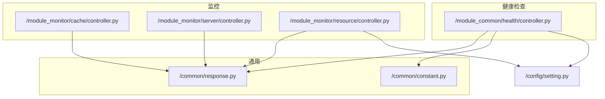
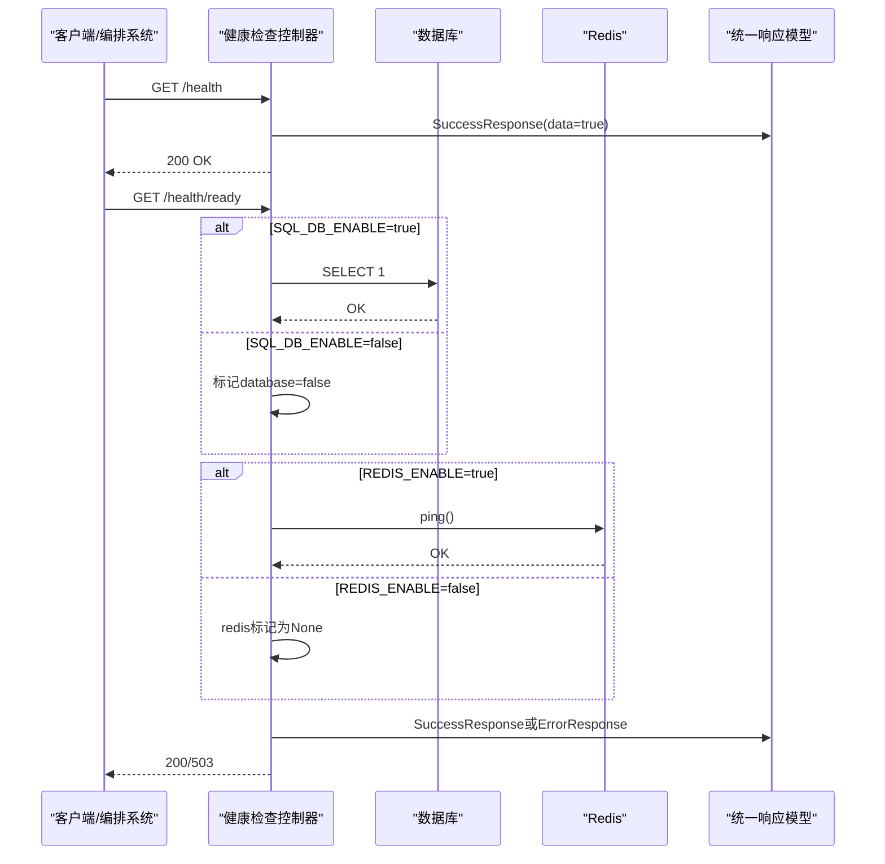
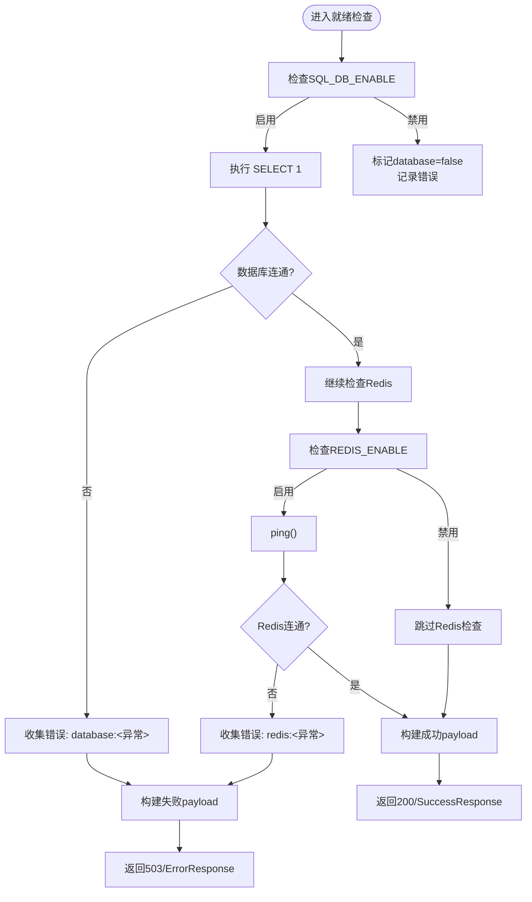
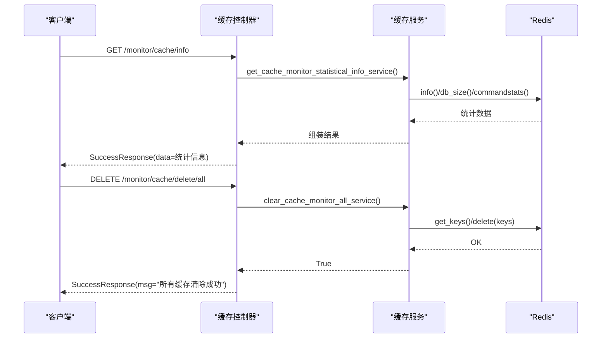
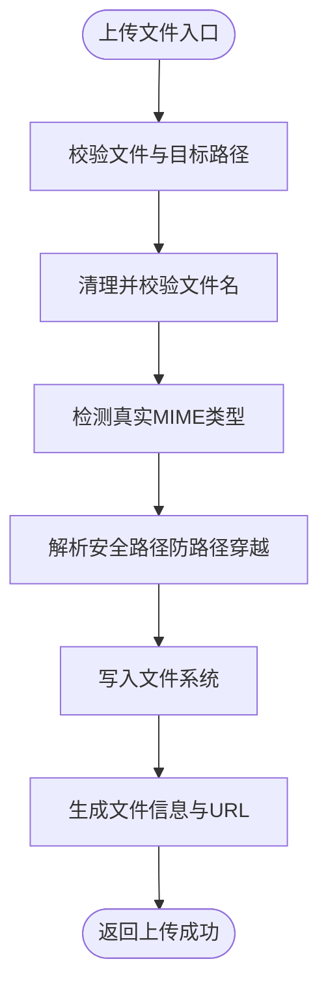
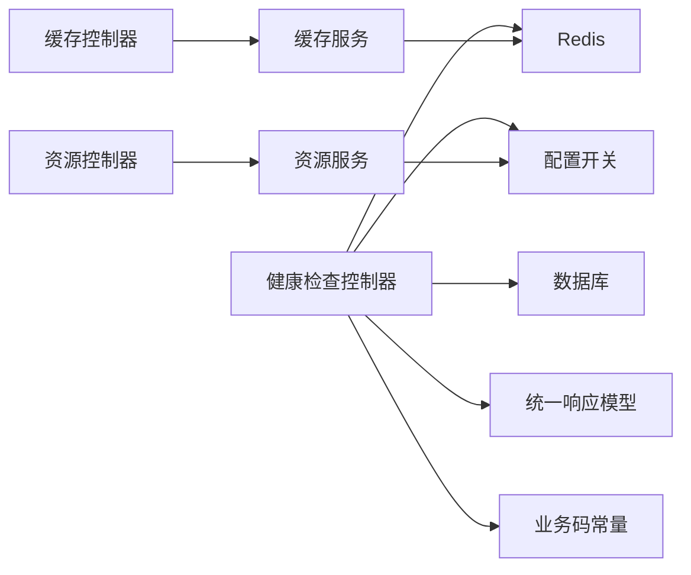

# 健康检查 API

<cite>
**本文引用的文件**
- [backend/app/api/v1/module_common/health/controller.py](file://backend/app/api/v1/module_common/health/controller.py)
- [backend/app/common/response.py](file://backend/app/common/response.py)
- [backend/app/common/constant.py](file://backend/app/common/constant.py)
- [backend/app/config/setting.py](file://backend/app/config/setting.py)
- [backend/app/api/v1/module_monitor/cache/controller.py](file://backend/app/api/v1/module_monitor/cache/controller.py)
- [backend/app/api/v1/module_monitor/cache/service.py](file://backend/app/api/v1/module_monitor/cache/service.py)
- [backend/app/api/v1/module_monitor/server/controller.py](file://backend/app/api/v1/module_monitor/server/controller.py)
- [backend/app/api/v1/module_monitor/resource/controller.py](file://backend/app/api/v1/module_monitor/resource/controller.py)
- [backend/app/api/v1/module_monitor/resource/service.py](file://backend/app/api/v1/module_monitor/resource/service.py)
</cite>

## 目录
1. [简介](#简介)
2. [项目结构](#项目结构)
3. [核心组件](#核心组件)
4. [架构总览](#架构总览)
5. [详细组件分析](#详细组件分析)
6. [依赖关系分析](#依赖关系分析)
7. [性能考量](#性能考量)
8. [故障排查指南](#故障排查指南)
9. [结论](#结论)
10. [附录](#附录)

## 简介
本文件面向“健康检查模块”的 API 接口文档，覆盖系统健康状态查询、服务可用性检测与性能指标监控的接口规范。重点包括：
- 存活探针与就绪探针接口，用于容器编排与负载均衡摘流
- 数据库连接状态与 Redis 可用性检查
- 缓存监控、服务器监控与资源管理能力
- 健康检查结果格式化输出、错误聚合与响应模型
- 配置开关与扩展机制说明

## 项目结构
健康检查相关能力主要分布在以下模块：
- 健康检查：/module_common/health
- 监控：/module_monitor/cache、/module_monitor/server、/module_monitor/resource
- 通用响应与常量：/common/response.py、/common/constant.py
- 配置：/config/setting.py

图表来源
- [backend/app/api/v1/module_common/health/controller.py:1-89](file://backend/app/api/v1/module_common/health/controller.py#L1-L89)
- [backend/app/api/v1/module_monitor/cache/controller.py:1-197](file://backend/app/api/v1/module_monitor/cache/controller.py#L1-L197)
- [backend/app/api/v1/module_monitor/server/controller.py:1-33](file://backend/app/api/v1/module_monitor/server/controller.py#L1-L33)
- [backend/app/api/v1/module_monitor/resource/controller.py:1-276](file://backend/app/api/v1/module_monitor/resource/controller.py#L1-L276)
- [backend/app/common/response.py:1-176](file://backend/app/common/response.py#L1-L176)
- [backend/app/common/constant.py:1-213](file://backend/app/common/constant.py#L1-L213)
- [backend/app/config/setting.py:1-355](file://backend/app/config/setting.py#L1-L355)

章节来源
- [backend/app/api/v1/module_common/health/controller.py:1-89](file://backend/app/api/v1/module_common/health/controller.py#L1-L89)
- [backend/app/common/response.py:1-176](file://backend/app/common/response.py#L1-L176)
- [backend/app/common/constant.py:1-213](file://backend/app/common/constant.py#L1-L213)
- [backend/app/config/setting.py:1-355](file://backend/app/config/setting.py#L1-L355)

## 核心组件
- 健康检查控制器：提供存活探针与就绪探针，检查数据库与 Redis 状态
- 监控控制器与服务：提供缓存监控、服务器监控、资源管理等能力
- 通用响应模型：统一的成功/错误响应结构，便于健康检查结果标准化输出
- 配置开关：通过配置决定是否启用数据库与 Redis 检查

章节来源
- [backend/app/api/v1/module_common/health/controller.py:17-89](file://backend/app/api/v1/module_common/health/controller.py#L17-L89)
- [backend/app/common/response.py:26-102](file://backend/app/common/response.py#L26-L102)
- [backend/app/config/setting.py:83-114](file://backend/app/config/setting.py#L83-L114)

## 架构总览
健康检查与监控的交互流程如下：

图表来源
- [backend/app/api/v1/module_common/health/controller.py:17-89](file://backend/app/api/v1/module_common/health/controller.py#L17-L89)
- [backend/app/common/response.py:36-102](file://backend/app/common/response.py#L36-L102)
- [backend/app/common/constant.py:42-44](file://backend/app/common/constant.py#L42-L44)
- [backend/app/config/setting.py:83-114](file://backend/app/config/setting.py#L83-L114)

## 详细组件分析

### 健康检查接口
- 接口路径：/health、/health/ready
- 方法：GET
- 认证：无需认证
- 触发条件：
  - 存活探针：进程启动即返回健康
  - 就绪探针：在启动阶段已连接 Redis，此处进行周期性轻量 ping；数据库使用 SELECT 1
- 检查频率：由编排系统或探针配置决定（例如 Kubernetes livenessProbe/readinessProbe）
- 告警阈值：无内置阈值；503 表示依赖未就绪
- 结果格式：统一响应模型，data 包含 checks 与 errors

图表来源
- [backend/app/api/v1/module_common/health/controller.py:34-89](file://backend/app/api/v1/module_common/health/controller.py#L34-L89)
- [backend/app/common/response.py:36-102](file://backend/app/common/response.py#L36-L102)
- [backend/app/common/constant.py:42-44](file://backend/app/common/constant.py#L42-L44)
- [backend/app/config/setting.py:83-114](file://backend/app/config/setting.py#L83-L114)

章节来源
- [backend/app/api/v1/module_common/health/controller.py:17-89](file://backend/app/api/v1/module_common/health/controller.py#L17-L89)
- [backend/app/common/response.py:26-102](file://backend/app/common/response.py#L26-L102)
- [backend/app/common/constant.py:42-44](file://backend/app/common/constant.py#L42-L44)
- [backend/app/config/setting.py:83-114](file://backend/app/config/setting.py#L83-L114)

### 缓存监控接口
- 接口路径：/monitor/cache/info、/monitor/cache/get/names、/monitor/cache/get/keys/{cache_name}、/monitor/cache/get/value/{cache_name}/{cache_key}、/monitor/cache/delete/name/{cache_name}、/monitor/cache/delete/key/{cache_key}、/monitor/cache/delete/all
- 方法：GET/DELETE
- 认证：需要权限 module_monitor:cache:query/module_monitor:cache:delete
- 功能：
  - 获取缓存统计信息（info、db_size、command_stats）
  - 获取缓存名称列表
  - 获取指定缓存名称下的键列表
  - 获取指定键的值
  - 清除指定缓存名称、指定键或全部缓存

图表来源
- [backend/app/api/v1/module_monitor/cache/controller.py:19-197](file://backend/app/api/v1/module_monitor/cache/controller.py#L19-L197)
- [backend/app/api/v1/module_monitor/cache/service.py:14-155](file://backend/app/api/v1/module_monitor/cache/service.py#L14-L155)

章节来源
- [backend/app/api/v1/module_monitor/cache/controller.py:1-197](file://backend/app/api/v1/module_monitor/cache/controller.py#L1-L197)
- [backend/app/api/v1/module_monitor/cache/service.py:1-155](file://backend/app/api/v1/module_monitor/cache/service.py#L1-L155)

### 服务器监控接口
- 接口路径：/monitor/server/info
- 方法：GET
- 认证：需要权限 module_monitor:server:query
- 功能：查询服务器监控信息（由服务层实现）

章节来源
- [backend/app/api/v1/module_monitor/server/controller.py:1-33](file://backend/app/api/v1/module_monitor/server/controller.py#L1-L33)

### 资源管理接口
- 接口路径：/monitor/resource/list、/monitor/resource/upload、/monitor/resource/download、/monitor/resource/delete、/monitor/resource/move、/monitor/resource/copy、/monitor/resource/rename、/monitor/resource/create-dir、/monitor/resource/export
- 方法：GET/POST/DELETE
- 认证：需要相应权限 module_monitor:resource:query/upload/download/delete/move/copy/rename/create_dir/export
- 功能：目录浏览、文件上传/下载、移动/复制/重命名、创建目录、导出资源列表
- 安全要点：严格的路径遍历防护、文件名清洗、MIME 类型检测、最大上传大小限制

图表来源
- [backend/app/api/v1/module_monitor/resource/controller.py:64-152](file://backend/app/api/v1/module_monitor/resource/controller.py#L64-L152)
- [backend/app/api/v1/module_monitor/resource/service.py:616-727](file://backend/app/api/v1/module_monitor/resource/service.py#L616-L727)

章节来源
- [backend/app/api/v1/module_monitor/resource/controller.py:1-276](file://backend/app/api/v1/module_monitor/resource/controller.py#L1-L276)
- [backend/app/api/v1/module_monitor/resource/service.py:1-800](file://backend/app/api/v1/module_monitor/resource/service.py#L1-L800)

## 依赖关系分析
- 健康检查依赖：
  - 配置开关：SQL_DB_ENABLE、REDIS_ENABLE
  - 数据库：使用 SELECT 1 轻量检查
  - Redis：通过 request.app.state.redis.ping()
  - 响应模型：SuccessResponse/ErrorResponse
  - 业务码：RET.SERVICE_UNAVAILABLE.code
- 监控模块依赖：
  - 缓存服务依赖 RedisCURD 进行 info/db_size/commandstats 等操作
  - 资源服务依赖配置中的静态目录与上传限制

图表来源
- [backend/app/api/v1/module_common/health/controller.py:40-89](file://backend/app/api/v1/module_common/health/controller.py#L40-L89)
- [backend/app/config/setting.py:83-114](file://backend/app/config/setting.py#L83-L114)
- [backend/app/common/response.py:36-102](file://backend/app/common/response.py#L36-L102)
- [backend/app/common/constant.py:42-44](file://backend/app/common/constant.py#L42-L44)
- [backend/app/api/v1/module_monitor/cache/controller.py:1-197](file://backend/app/api/v1/module_monitor/cache/controller.py#L1-L197)
- [backend/app/api/v1/module_monitor/cache/service.py:1-155](file://backend/app/api/v1/module_monitor/cache/service.py#L1-L155)
- [backend/app/api/v1/module_monitor/resource/controller.py:1-276](file://backend/app/api/v1/module_monitor/resource/controller.py#L1-L276)
- [backend/app/api/v1/module_monitor/resource/service.py:1-800](file://backend/app/api/v1/module_monitor/resource/service.py#L1-L800)

章节来源
- [backend/app/api/v1/module_common/health/controller.py:40-89](file://backend/app/api/v1/module_common/health/controller.py#L40-L89)
- [backend/app/config/setting.py:83-114](file://backend/app/config/setting.py#L83-L114)
- [backend/app/common/response.py:36-102](file://backend/app/common/response.py#L36-L102)
- [backend/app/common/constant.py:42-44](file://backend/app/common/constant.py#L42-L44)
- [backend/app/api/v1/module_monitor/cache/controller.py:1-197](file://backend/app/api/v1/module_monitor/cache/controller.py#L1-L197)
- [backend/app/api/v1/module_monitor/cache/service.py:1-155](file://backend/app/api/v1/module_monitor/cache/service.py#L1-L155)
- [backend/app/api/v1/module_monitor/resource/controller.py:1-276](file://backend/app/api/v1/module_monitor/resource/controller.py#L1-L276)
- [backend/app/api/v1/module_monitor/resource/service.py:1-800](file://backend/app/api/v1/module_monitor/resource/service.py#L1-L800)

## 性能考量
- 就绪检查采用轻量级操作（SELECT 1、ping），避免对生产造成压力
- 缓存统计信息通过 Redis 原生命令聚合，建议在高并发场景下合理设置探针间隔
- 资源上传/下载涉及磁盘 IO，建议结合限速与并发控制策略

## 故障排查指南
- 503 依赖未就绪
  - 检查 SQL_DB_ENABLE 与数据库连接串
  - 检查 REDIS_ENABLE 与 Redis 地址/密码
  - 查看 errors 字段中的具体异常
- 响应格式
  - 成功：SuccessResponse，data 为 payload
  - 失败：ErrorResponse，code=RET.SERVICE_UNAVAILABLE.code，status_code=503
- 常见问题
  - 数据库连接失败：确认连接串与网络可达
  - Redis 连接失败：确认 Redis 服务状态与鉴权配置
  - 路径遍历/上传异常：检查资源服务的安全策略与上传限制

章节来源
- [backend/app/api/v1/module_common/health/controller.py:79-89](file://backend/app/api/v1/module_common/health/controller.py#L79-L89)
- [backend/app/common/constant.py:42-44](file://backend/app/common/constant.py#L42-L44)
- [backend/app/api/v1/module_monitor/resource/service.py:56-800](file://backend/app/api/v1/module_monitor/resource/service.py#L56-L800)

## 结论
本健康检查模块通过存活与就绪探针快速反映系统健康状况，并结合数据库与 Redis 的轻量检查，为容器编排与运维提供可靠依据。监控模块进一步补充了缓存、服务器与资源管理能力，配合统一响应模型与配置开关，形成可扩展、可维护的健康监控体系。

## 附录

### 接口一览（摘要）
- 健康检查
  - GET /health：存活探针
  - GET /health/ready：就绪探针
- 缓存监控
  - GET /monitor/cache/info
  - GET /monitor/cache/get/names
  - GET /monitor/cache/get/keys/{cache_name}
  - GET /monitor/cache/get/value/{cache_name}/{cache_key}
  - DELETE /monitor/cache/delete/name/{cache_name}
  - DELETE /monitor/cache/delete/key/{cache_key}
  - DELETE /monitor/cache/delete/all
- 服务器监控
  - GET /monitor/server/info
- 资源管理
  - GET /monitor/resource/list
  - POST /monitor/resource/upload
  - GET /monitor/resource/download
  - DELETE /monitor/resource/delete
  - POST /monitor/resource/move
  - POST /monitor/resource/copy
  - POST /monitor/resource/rename
  - POST /monitor/resource/create-dir
  - POST /monitor/resource/export

章节来源
- [backend/app/api/v1/module_common/health/controller.py:17-89](file://backend/app/api/v1/module_common/health/controller.py#L17-L89)
- [backend/app/api/v1/module_monitor/cache/controller.py:1-197](file://backend/app/api/v1/module_monitor/cache/controller.py#L1-L197)
- [backend/app/api/v1/module_monitor/server/controller.py:1-33](file://backend/app/api/v1/module_monitor/server/controller.py#L1-L33)
- [backend/app/api/v1/module_monitor/resource/controller.py:1-276](file://backend/app/api/v1/module_monitor/resource/controller.py#L1-L276)