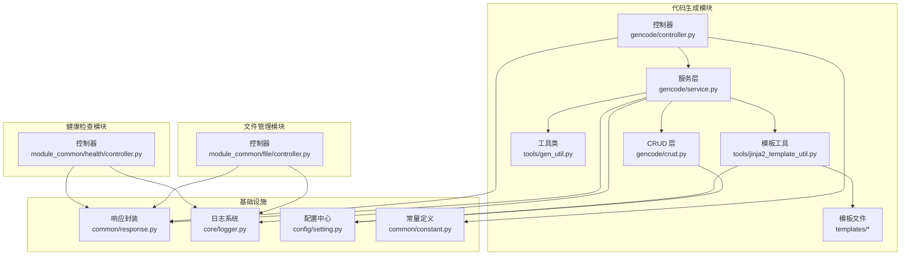
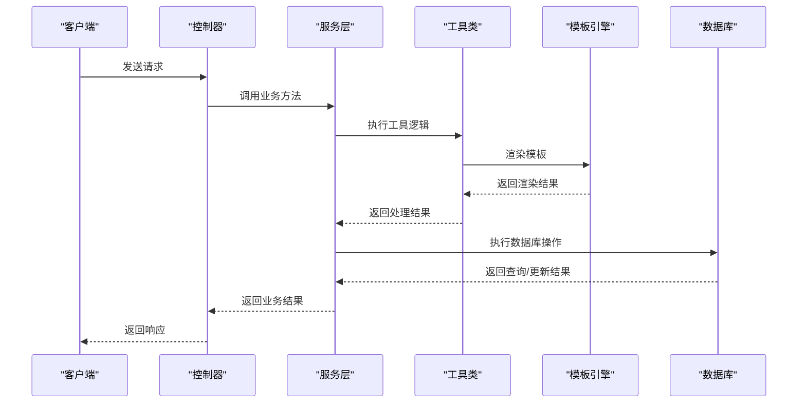
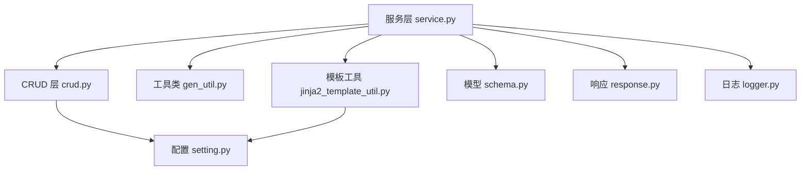

# 开发工具 API

<cite>
**本文档引用的文件**
- [controller.py](file://backend/app/plugin/module_generator/gencode/controller.py)
- [service.py](file://backend/app/plugin/module_generator/gencode/service.py)
- [schema.py](file://backend/app/plugin/module_generator/gencode/schema.py)
- [crud.py](file://backend/app/plugin/module_generator/gencode/crud.py)
- [gen_util.py](file://backend/app/plugin/module_generator/gencode/tools/gen_util.py)
- [jinja2_template_util.py](file://backend/app/plugin/module_generator/gencode/tools/jinja2_template_util.py)
- [controller.py](file://backend/app/api/v1/module_common/file/controller.py)
- [controller.py](file://backend/app/api/v1/module_common/health/controller.py)
- [response.py](file://backend/app/common/response.py)
- [logger.py](file://backend/app/core/logger.py)
- [setting.py](file://backend/app/config/setting.py)
- [constant.py](file://backend/app/common/constant.py)
- [controller.py](file://backend/app/plugin/module_generator/gencode/templates/python/controller.py.j2)
- [api.ts.j2](file://backend/app/plugin/module_generator/gencode/templates/ts/api.ts.j2)
- [index.vue.j2](file://backend/app/plugin/module_generator/gencode/templates/vue/index.vue.j2)
</cite>

## 目录
1. [简介](#简介)
2. [项目结构](#项目结构)
3. [核心组件](#核心组件)
4. [架构概览](#架构概览)
5. [详细组件分析](#详细组件分析)
6. [依赖关系分析](#依赖关系分析)
7. [性能考虑](#性能考虑)
8. [故障排查指南](#故障排查指南)
9. [结论](#结论)

## 简介
本文件为 FastapiAdmin 项目的开发工具模块 API 文档，涵盖代码生成器、文件管理与健康检查三大功能域。文档详细说明了：
- 代码生成：数据库表导入、业务表配置、模板渲染、批量代码生成与下载、数据库同步与差异预览
- 文件管理：文件上传、下载与删除的接口规范
- 健康检查：存活与就绪探针，依赖检查与状态返回
- 配置选项、使用限制与最佳实践
- 调试模式、错误处理与日志记录机制

## 项目结构
开发工具模块位于后端应用的插件目录中，采用分层架构：
- 控制器层：定义 API 路由与请求入口
- 服务层：封装业务逻辑与流程编排
- 数据访问层：CRUD 操作与数据库交互
- 工具层：代码生成模板工具与通用工具
- 模板层：Jinja2 模板与前端 Vue/TS 模板

**图表来源**
- [controller.py:1-363](file://backend/app/plugin/module_generator/gencode/controller.py#L1-L363)
- [service.py:1-800](file://backend/app/plugin/module_generator/gencode/service.py#L1-L800)
- [crud.py:1-639](file://backend/app/plugin/module_generator/gencode/crud.py#L1-L639)
- [gen_util.py:1-342](file://backend/app/plugin/module_generator/gencode/tools/gen_util.py#L1-L342)
- [jinja2_template_util.py:1-795](file://backend/app/plugin/module_generator/gencode/tools/jinja2_template_util.py#L1-L795)
- [controller.py:1-78](file://backend/app/api/v1/module_common/file/controller.py#L1-L78)
- [controller.py:1-89](file://backend/app/api/v1/module_common/health/controller.py#L1-L89)
- [response.py:1-176](file://backend/app/common/response.py#L1-L176)
- [logger.py:1-147](file://backend/app/core/logger.py#L1-L147)
- [setting.py:1-200](file://backend/app/config/setting.py#L1-L200)

**章节来源**
- [controller.py:1-363](file://backend/app/plugin/module_generator/gencode/controller.py#L1-L363)
- [controller.py:1-78](file://backend/app/api/v1/module_common/file/controller.py#L1-L78)
- [controller.py:1-89](file://backend/app/api/v1/module_common/health/controller.py#L1-L89)

## 核心组件
- 代码生成器：提供数据库表导入、业务表配置、模板渲染、批量代码生成与下载、数据库同步与差异预览
- 文件管理器：提供文件上传、下载与删除接口
- 健康检查器：提供存活与就绪探针，检测数据库与 Redis 依赖状态

**章节来源**
- [controller.py:24-363](file://backend/app/plugin/module_generator/gencode/controller.py#L24-L363)
- [controller.py:22-78](file://backend/app/api/v1/module_common/file/controller.py#L22-L78)
- [controller.py:14-89](file://backend/app/api/v1/module_common/health/controller.py#L14-L89)

## 架构概览
开发工具模块遵循典型的三层架构：
- 表现层（控制器）：接收请求、校验参数、调用服务层、返回响应
- 业务层（服务）：编排流程、调用 CRUD、模板渲染、异常处理
- 数据层（CRUD）：数据库访问、SQL 构建与执行、分页查询
- 工具层：类型映射、模板引擎、文件流处理

**图表来源**
- [controller.py:24-363](file://backend/app/plugin/module_generator/gencode/controller.py#L24-L363)
- [service.py:69-800](file://backend/app/plugin/module_generator/gencode/service.py#L69-L800)
- [jinja2_template_util.py:19-795](file://backend/app/plugin/module_generator/gencode/tools/jinja2_template_util.py#L19-L795)
- [crud.py:24-639](file://backend/app/plugin/module_generator/gencode/crud.py#L24-L639)

## 详细组件分析

### 代码生成器 API

#### 1) 业务表管理
- 查询业务表列表
  - 方法：GET
  - 路径：/api/v1/gencode/list
  - 权限：module_generator:gencode:query
  - 分页参数：page_no/page_size/order_by
  - 搜索参数：table_name/table_comment
  - 返回：分页结果与总数
- 查询数据库表列表
  - 方法：GET
  - 路径：/api/v1/gencode/db/list
  - 权限：module_generator:dblist:query
  - 分页参数：page_no/page_size/order_by
  - 搜索参数：table_name/table_comment
  - 返回：数据库表列表（按方言分页）
- 导入表结构
  - 方法：POST
  - 路径：/api/v1/gencode/import
  - 权限：module_generator:gencode:import
  - 请求体：表名数组
  - 返回：导入结果
- 获取业务表详情
  - 方法：GET
  - 路径：/api/v1/gencode/detail/{table_id}
  - 权限：module_generator:gencode:query
  - 返回：业务表详细信息
- 创建表结构（DDL）
  - 方法：POST
  - 路径：/api/v1/gencode/create
  - 权限：module_generator:gencode:create
  - 请求体：包含 SQL 的 JSON 对象
  - 返回：创建结果
- 编辑业务表信息
  - 方法：PUT
  - 路径：/api/v1/gencode/update/{table_id}
  - 权限：module_generator:gencode:update
  - 请求体：业务表信息
  - 返回：更新后的业务表信息
- 删除业务表信息
  - 方法：DELETE
  - 路径：/api/v1/gencode/delete
  - 权限：module_generator:gencode:delete
  - 请求体：ID 数组
  - 返回：删除结果

**章节来源**
- [controller.py:27-339](file://backend/app/plugin/module_generator/gencode/controller.py#L27-L339)
- [schema.py:24-326](file://backend/app/plugin/module_generator/gencode/schema.py#L24-L326)
- [crud.py:78-139](file://backend/app/plugin/module_generator/gencode/crud.py#L78-L139)

#### 2) 代码生成与下载
- 预览代码
  - 方法：GET
  - 路径：/api/v1/gencode/preview/{table_id}
  - 权限：module_generator:gencode:query
  - 返回：文件名到渲染内容的映射
- 生成代码到指定路径
  - 方法：POST
  - 路径：/api/v1/gencode/output/{table_name}
  - 权限：module_generator:gencode:code
  - 返回：生成结果
- 批量生成代码
  - 方法：POST
  - 路径：/api/v1/gencode/batch/output
  - 权限：module_generator:gencode:operate
  - 请求体：表名数组
  - 返回：ZIP 文件流响应

**章节来源**
- [controller.py:291-363](file://backend/app/plugin/module_generator/gencode/controller.py#L291-L363)
- [service.py:649-704](file://backend/app/plugin/module_generator/gencode/service.py#L649-L704)

#### 3) 数据库同步与差异预览
- 同步数据库
  - 方法：POST
  - 路径：/api/v1/gencode/sync_db/{table_name}
  - 权限：module_generator:db:sync
  - 返回：同步结果
- 同步数据库差异预览
  - 方法：GET
  - 路径：/api/v1/gencode/sync_db/preview/{table_name}
  - 权限：module_generator:db:sync
  - 返回：差异预览结构

**章节来源**
- [controller.py:316-363](file://backend/app/plugin/module_generator/gencode/controller.py#L316-L363)
- [schema.py:283-296](file://backend/app/plugin/module_generator/gencode/schema.py#L283-L296)

#### 4) 代码生成配置参数与模板选择
- 业务表配置模型（GenTableSchema）
  - 关键字段：table_name、table_comment、class_name、package_name、module_name、business_name、function_name、parent_menu_id、columns、sub_table_name、sub_table_fk_name
  - 字段规范：包名强制 module_xxx 前缀；模块名与业务名进行 slug 规范化；主子表配置一致性校验
- 字段配置模型（GenTableColumnSchema）
  - 关键字段：column_name、column_comment、column_type、column_length、column_default、is_pk、is_increment、is_nullable、is_unique、python_type、python_field、is_insert、is_edit、is_list、is_query、query_type、html_type、dict_type、sort
  - 默认推断：HTML 类型、查询类型、插入/编辑/列表/查询开关、主键强约束
- 模板选择与输出格式
  - 后端模板：python/controller.py.j2、python/service.py.j2、python/crud.py.j2、python/schema.py.j2、python/model.py.j2、python/__init__.py.j2
  - 前端模板：ts/api.ts.j2、vue/index.vue.j2
  - 输出路径：后端位于 backend/app/plugin/{package_name}/{module_name}，前端位于 frontend/src/views/{package_name}/{module_name} 与 frontend/src/api/{package_name}

**章节来源**
- [schema.py:78-270](file://backend/app/plugin/module_generator/gencode/schema.py#L78-L270)
- [gen_util.py:12-342](file://backend/app/plugin/module_generator/gencode/tools/gen_util.py#L12-L342)
- [jinja2_template_util.py:19-795](file://backend/app/plugin/module_generator/gencode/tools/jinja2_template_util.py#L19-L795)
- [controller.py:1-239](file://backend/app/plugin/module_generator/gencode/templates/python/controller.py.j2#L1-L239)
- [api.ts.j2:1-136](file://backend/app/plugin/module_generator/gencode/templates/ts/api.ts.j2#L1-L136)
- [index.vue.j2:1-825](file://backend/app/plugin/module_generator/gencode/templates/vue/index.vue.j2#L1-L825)

#### 5) 下载机制
- 预览代码：返回字典映射，键为文件名，值为渲染内容
- 生成代码到指定路径：写入本地文件系统，支持菜单与权限自动创建
- 批量生成代码：返回 ZIP 文件流，Content-Disposition 设置为 attachment，文件名为 code.zip

**章节来源**
- [controller.py:243-263](file://backend/app/plugin/module_generator/gencode/controller.py#L243-L263)
- [service.py:707-800](file://backend/app/plugin/module_generator/gencode/service.py#L707-L800)
- [response.py:104-135](file://backend/app/common/response.py#L104-L135)

### 文件管理 API

#### 1) 文件上传
- 方法：POST
- 路径：/api/v1/file/upload
- 权限：module_common:file:upload
- 请求体：multipart/form-data，包含文件字段
- 返回：上传文件详情

**章节来源**
- [controller.py:25-49](file://backend/app/api/v1/module_common/file/controller.py#L25-L49)

#### 2) 文件下载与删除
- 方法：POST
- 路径：/api/v1/file/download
- 权限：module_common:file:download
- 请求体：file_path（文件绝对路径）、delete（是否删除）
- 返回：FileResponse，支持后台任务删除

**章节来源**
- [controller.py:51-78](file://backend/app/api/v1/module_common/file/controller.py#L51-L78)

### 健康检查 API

#### 1) 存活探针（Liveness）
- 方法：GET
- 路径：/api/v1/health/
- 返回：系统健康状态（轻量检查）

#### 2) 就绪探针（Readiness）
- 方法：GET
- 路径：/api/v1/health/ready/
- 返回：依赖检查结果（database、redis），任一失败返回 503

**章节来源**
- [controller.py:17-89](file://backend/app/api/v1/module_common/health/controller.py#L17-L89)

## 依赖关系分析

**图表来源**
- [service.py:69-800](file://backend/app/plugin/module_generator/gencode/service.py#L69-L800)
- [crud.py:24-639](file://backend/app/plugin/module_generator/gencode/crud.py#L24-L639)
- [gen_util.py:12-342](file://backend/app/plugin/module_generator/gencode/tools/gen_util.py#L12-L342)
- [jinja2_template_util.py:19-795](file://backend/app/plugin/module_generator/gencode/tools/jinja2_template_util.py#L19-L795)
- [schema.py:1-326](file://backend/app/plugin/module_generator/gencode/schema.py#L1-L326)
- [response.py:1-176](file://backend/app/common/response.py#L1-L176)
- [logger.py:1-147](file://backend/app/core/logger.py#L1-L147)
- [setting.py:1-200](file://backend/app/config/setting.py#L1-L200)

**章节来源**
- [service.py:69-800](file://backend/app/plugin/module_generator/gencode/service.py#L69-L800)
- [crud.py:24-639](file://backend/app/plugin/module_generator/gencode/crud.py#L24-L639)

## 性能考虑
- 数据库表列表分页：针对 MySQL 与 PostgreSQL 使用系统表进行数据库侧分页，避免全量遍历导致的性能问题
- 模板渲染：Jinja2 异步渲染，减少阻塞
- 文件下载：流式响应，避免一次性加载大文件到内存
- 日志：Loguru 配置轮转与压缩，控制磁盘占用

**章节来源**
- [crud.py:192-311](file://backend/app/plugin/module_generator/gencode/crud.py#L192-L311)
- [jinja2_template_util.py:64-83](file://backend/app/plugin/module_generator/gencode/tools/jinja2_template_util.py#L64-L83)
- [response.py:104-135](file://backend/app/common/response.py#L104-L135)
- [logger.py:107-130](file://backend/app/core/logger.py#L107-L130)

## 故障排查指南
- 常见错误码：参考 RET 枚举，涵盖成功、HTTP 标准错误、服务器错误与自定义业务错误
- 异常处理：服务层装饰器统一捕获异常，CustomException 透传，其他异常包装为统一错误
- 日志记录：使用 loguru，支持控制台与文件输出，错误日志单独分离，支持 JSON Lines
- 调试模式：设置 DEBUG 为 True，启用 Swagger UI 与 ReDoc 文档

**章节来源**
- [constant.py:7-200](file://backend/app/common/constant.py#L7-L200)
- [service.py:43-63](file://backend/app/plugin/module_generator/gencode/service.py#L43-L63)
- [logger.py:71-147](file://backend/app/core/logger.py#L71-L147)
- [setting.py:37-47](file://backend/app/config/setting.py#L37-L47)

## 结论
开发工具模块提供了完善的代码生成、文件管理与健康检查能力，具备良好的扩展性与可维护性。通过严格的权限控制、异常处理与日志记录机制，确保系统稳定运行。建议在生产环境中合理配置数据库与 Redis 连接参数，并结合就绪探针保障服务可用性。