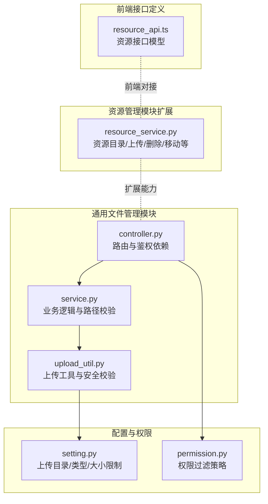
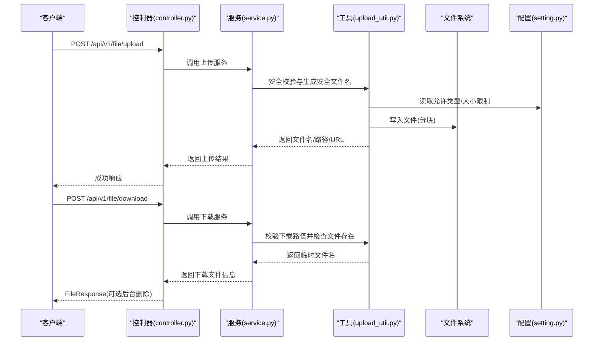
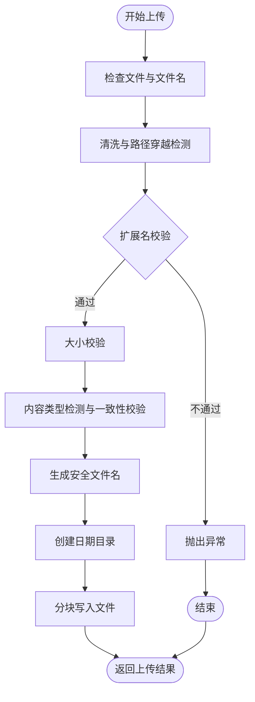
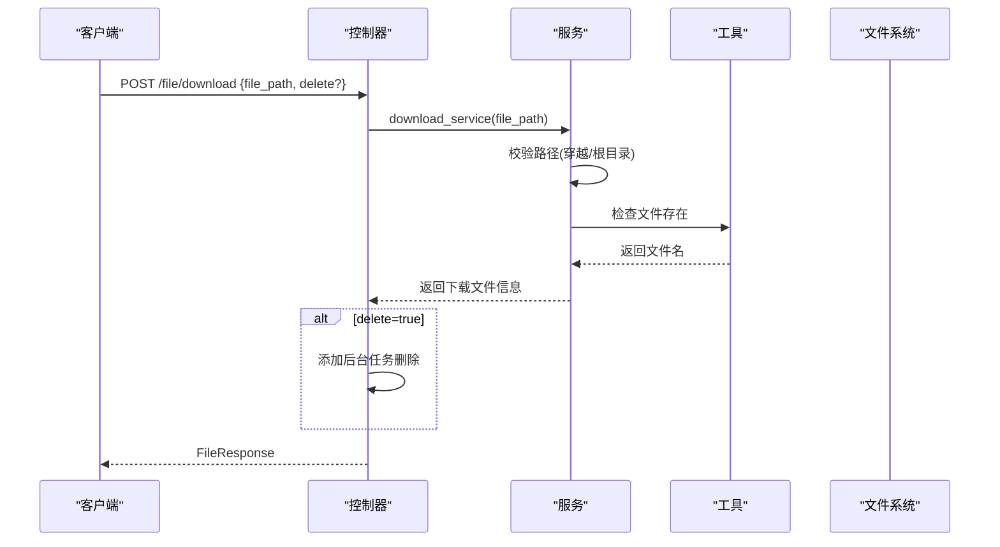
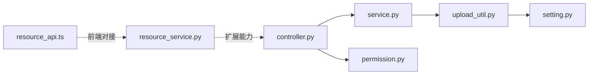

# 文件管理 API

<cite>
**本文引用的文件**
- [controller.py](file://backend/app/api/v1/module_common/file/controller.py)
- [service.py](file://backend/app/api/v1/module_common/file/service.py)
- [upload_util.py](file://backend/app/utils/upload_util.py)
- [setting.py](file://backend/app/config/setting.py)
- [permission.py](file://backend/app/core/permission.py)
- [resource_service.py](file://backend/app/api/v1/module_monitor/resource/service.py)
- [resource_api.ts](file://frontend/web/src/api/module_monitor/resource.ts)
</cite>

## 目录
1. [简介](#简介)
2. [项目结构](#项目结构)
3. [核心组件](#核心组件)
4. [架构总览](#架构总览)
5. [详细组件分析](#详细组件分析)
6. [依赖分析](#依赖分析)
7. [性能考虑](#性能考虑)
8. [故障排查指南](#故障排查指南)
9. [结论](#结论)
10. [附录](#附录)

## 简介
本文件管理 API 提供了本地文件上传、下载、删除与批量删除能力，并结合安全校验、文件类型与大小限制、路径穿越防护、权限控制与 URL 生成等机制，满足通用文件管理场景需求。同时，仓库模块提供了更丰富的资源管理能力（上传、下载、删除、移动、复制、重命名、目录浏览、统计与排序等），可作为文件管理的补充或扩展。

## 项目结构
文件管理相关模块位于后端的通用模块中，采用“控制器-服务-工具”的分层设计，配合配置中心与权限中间件，形成清晰的职责边界。

图表来源
- [controller.py:22-78](file://backend/app/api/v1/module_common/file/controller.py#L22-L78)
- [service.py:12-106](file://backend/app/api/v1/module_common/file/service.py#L12-L106)
- [upload_util.py:81-471](file://backend/app/utils/upload_util.py#L81-L471)
- [setting.py:182-195](file://backend/app/config/setting.py#L182-L195)
- [permission.py:13-311](file://backend/app/core/permission.py#L13-L311)
- [resource_service.py:280-851](file://backend/app/api/v1/module_monitor/resource/service.py#L280-L851)
- [resource_api.ts:130-204](file://frontend/web/src/api/module_monitor/resource.ts#L130-L204)

章节来源
- [controller.py:22-78](file://backend/app/api/v1/module_common/file/controller.py#L22-L78)
- [service.py:12-106](file://backend/app/api/v1/module_common/file/service.py#L12-L106)
- [upload_util.py:81-471](file://backend/app/utils/upload_util.py#L81-L471)
- [setting.py:182-195](file://backend/app/config/setting.py#L182-L195)
- [permission.py:13-311](file://backend/app/core/permission.py#L13-L311)
- [resource_service.py:280-851](file://backend/app/api/v1/module_monitor/resource/service.py#L280-L851)
- [resource_api.ts:130-204](file://frontend/web/src/api/module_monitor/resource.ts#L130-L204)

## 核心组件
- 控制器层：定义上传/下载接口、绑定鉴权权限与操作日志路由类。
- 服务层：封装上传/下载流程、路径安全校验、异常处理。
- 工具层：提供文件名校验、路径穿越检测、类型与大小校验、安全文件名生成、分块读取与删除等。
- 配置层：集中管理上传目录、允许类型、最大文件大小等。
- 权限层：提供基于角色/部门/自定义的数据权限过滤策略（用于通用模块的鉴权依赖）。
- 资源服务（扩展）：提供更全面的资源管理能力（上传、下载、删除、移动、复制、重命名、目录浏览、统计与排序等）。

章节来源
- [controller.py:25-78](file://backend/app/api/v1/module_common/file/controller.py#L25-L78)
- [service.py:17-106](file://backend/app/api/v1/module_common/file/service.py#L17-L106)
- [upload_util.py:81-471](file://backend/app/utils/upload_util.py#L81-L471)
- [setting.py:182-195](file://backend/app/config/setting.py#L182-L195)
- [permission.py:13-311](file://backend/app/core/permission.py#L13-L311)
- [resource_service.py:280-851](file://backend/app/api/v1/module_monitor/resource/service.py#L280-L851)

## 架构总览
文件管理 API 的调用链路如下：

图表来源
- [controller.py:25-78](file://backend/app/api/v1/module_common/file/controller.py#L25-L78)
- [service.py:17-106](file://backend/app/api/v1/module_common/file/service.py#L17-L106)
- [upload_util.py:381-471](file://backend/app/utils/upload_util.py#L381-L471)
- [setting.py:182-195](file://backend/app/config/setting.py#L182-L195)

## 详细组件分析

### 上传接口
- 接口路径：POST /api/v1/file/upload
- 权限要求：需要具备 module_common:file:upload 权限
- 输入：multipart/form-data，字段名为 file
- 输出：包含文件名、原始文件名、文件路径、文件 URL 的结构化响应
- 安全校验：
  - 文件名清洗与路径穿越检测
  - 扩展名白名单与危险扩展名黑名单校验
  - 文件大小上限校验
  - 内容类型与扩展名一致性检测
  - 安全文件名生成规则（含时间戳、机器码、随机码）
  - 写入路径严格限定在上传根目录内
- 存储策略：
  - 按年/月/日分目录存放
  - 分块写入（默认 8MB）

图表来源
- [service.py:17-47](file://backend/app/api/v1/module_common/file/service.py#L17-L47)
- [upload_util.py:381-444](file://backend/app/utils/upload_util.py#L381-L444)

章节来源
- [controller.py:25-48](file://backend/app/api/v1/module_common/file/controller.py#L25-L48)
- [service.py:17-47](file://backend/app/api/v1/module_common/file/service.py#L17-L47)
- [upload_util.py:110-174](file://backend/app/utils/upload_util.py#L110-L174)
- [upload_util.py:251-268](file://backend/app/utils/upload_util.py#L251-L268)
- [upload_util.py:271-292](file://backend/app/utils/upload_util.py#L271-L292)
- [upload_util.py:420-437](file://backend/app/utils/upload_util.py#L420-L437)

### 下载接口
- 接口路径：POST /api/v1/file/download
- 权限要求：需要具备 module_common:file:download 权限
- 输入：body 中包含 file_path 与 delete（可选）
- 输出：FileResponse，包含文件内容；若 delete 为真，则在下载完成后异步删除
- 安全校验：
  - 路径穿越检测
  - 限定在上传根目录内
  - 文件存在性校验
- 生成临时文件名用于下载响应

图表来源
- [controller.py:51-78](file://backend/app/api/v1/module_common/file/controller.py#L51-L78)
- [service.py:81-106](file://backend/app/api/v1/module_common/file/service.py#L81-L106)
- [upload_util.py:459-471](file://backend/app/utils/upload_util.py#L459-L471)

章节来源
- [controller.py:51-78](file://backend/app/api/v1/module_common/file/controller.py#L51-L78)
- [service.py:50-79](file://backend/app/api/v1/module_common/file/service.py#L50-L79)
- [upload_util.py:364-378](file://backend/app/utils/upload_util.py#L364-L378)

### 删除接口（通用模块）
- 通用模块未直接暴露删除接口，但工具层提供删除能力，可在业务侧按需使用。
- 删除行为：
  - 通过工具层删除文件（支持缺失安全删除）
  - 可结合下载接口的 delete 参数实现“下载即删”

章节来源
- [upload_util.py:364-378](file://backend/app/utils/upload_util.py#L364-L378)
- [controller.py:73-76](file://backend/app/api/v1/module_common/file/controller.py#L73-L76)

### 批量删除（资源模块扩展）
- 资源模块提供批量删除能力，支持返回成功/失败列表，适合批量清理场景。
- 能力要点：
  - 单条删除：遇到异常立即抛出
  - 批量删除：逐条执行并收集结果

章节来源
- [resource_service.py:813-836](file://backend/app/api/v1/module_monitor/resource/service.py#L813-L836)

### 文件存储策略
- 上传目录：由配置项决定，按“年/月/日”分层组织
- 文件名策略：包含原始名称清洗、时间戳、机器码、随机码与扩展名
- 写入方式：分块写入，降低内存占用
- 路径安全：严格限定在上传根目录内，避免越权访问

章节来源
- [setting.py:182-183](file://backend/app/config/setting.py#L182-L183)
- [upload_util.py:271-292](file://backend/app/utils/upload_util.py#L271-L292)
- [upload_util.py:420-437](file://backend/app/utils/upload_util.py#L420-L437)
- [service.py:63-79](file://backend/app/api/v1/module_common/file/service.py#L63-L79)

### 文件类型与大小限制
- 允许类型：由配置项维护
- 危险类型：内置黑名单，禁止上传
- 大小限制：统一阈值，超出抛出异常
- 类型一致性：通过文件内容前缀检测与声明扩展名进行比对

章节来源
- [setting.py:184-194](file://backend/app/config/setting.py#L184-L194)
- [upload_util.py:15-61](file://backend/app/utils/upload_util.py#L15-L61)
- [upload_util.py:251-268](file://backend/app/utils/upload_util.py#L251-L268)
- [upload_util.py:227-248](file://backend/app/utils/upload_util.py#L227-L248)

### 安全检查机制
- 文件名校验与路径穿越检测
- 扩展名白名单与黑名单
- 文件大小与类型一致性
- 下载路径严格限定在上传根目录
- URL 生成基于基础 URL 与文件路径拼接

章节来源
- [upload_util.py:110-145](file://backend/app/utils/upload_util.py#L110-L145)
- [upload_util.py:204-224](file://backend/app/utils/upload_util.py#L204-L224)
- [upload_util.py:251-268](file://backend/app/utils/upload_util.py#L251-L268)
- [service.py:50-79](file://backend/app/api/v1/module_common/file/service.py#L50-L79)
- [upload_util.py:429](file://backend/app/utils/upload_util.py#L429)

### 权限控制
- 上传/下载接口通过权限依赖进行鉴权
- 通用模块权限键：
  - module_common:file:upload
  - module_common:file:download
- 数据权限策略（通用模块未直接使用，但提供能力）：
  - 角色/部门/自定义/仅本人等策略
  - 可用于业务模型的数据隔离

章节来源
- [controller.py:30](file://backend/app/api/v1/module_common/file/controller.py#L30)
- [controller.py:55](file://backend/app/api/v1/module_common/file/controller.py#L55)
- [permission.py:13-311](file://backend/app/core/permission.py#L13-L311)

### URL 生成与过期时间
- URL 生成：基于基础 URL 与文件路径拼接
- 过期时间：未提供内置过期机制，建议在应用层自行实现签名 URL 或 CDN 缓存控制

章节来源
- [upload_util.py:429](file://backend/app/utils/upload_util.py#L429)

### 元数据管理、分类标签与搜索
- 通用模块未提供元数据与分类标签字段
- 资源模块提供文件信息模型（名称、URL、相对路径、大小、创建/修改时间、是否隐藏等），可用于前端展示与二次开发
- 搜索与排序：资源模块提供目录浏览、统计与排序能力，可作为搜索与筛选的基础

章节来源
- [resource_api.ts:130-204](file://frontend/web/src/api/module_monitor/resource.ts#L130-L204)
- [resource_service.py:280-351](file://backend/app/api/v1/module_monitor/resource/service.py#L280-L351)
- [resource_service.py:548-566](file://backend/app/api/v1/module_monitor/resource/service.py#L548-L566)

### 上传进度跟踪、断点续传与并发处理
- 上传进度跟踪：未提供内置进度回调
- 断点续传：未提供内置断点续传机制
- 并发处理：上传采用分块写入，减少内存峰值；下载采用流式读取

章节来源
- [upload_util.py:431-434](file://backend/app/utils/upload_util.py#L431-L434)
- [upload_util.py:348-361](file://backend/app/utils/upload_util.py#L348-L361)

### 清理策略、存储优化与性能监控
- 清理策略：资源模块提供批量删除能力，适合定期清理
- 存储优化：按日期分目录、分块写入、流式读取
- 性能监控：通用模块提供操作日志路由类，可记录上传/下载等关键操作

章节来源
- [resource_service.py:813-836](file://backend/app/api/v1/module_monitor/resource/service.py#L813-L836)
- [setting.py:182-195](file://backend/app/config/setting.py#L182-L195)
- [controller.py:18](file://backend/app/api/v1/module_common/file/controller.py#L18)

## 依赖分析
- 控制器依赖权限中间件与操作日志路由类
- 服务层依赖工具层与配置中心
- 工具层依赖配置中心与日志
- 资源模块提供更丰富的文件管理能力，与通用模块互补

图表来源
- [controller.py:14-22](file://backend/app/api/v1/module_common/file/controller.py#L14-L22)
- [service.py:5-9](file://backend/app/api/v1/module_common/file/service.py#L5-L9)
- [upload_util.py:11-13](file://backend/app/utils/upload_util.py#L11-L13)
- [setting.py:13-21](file://backend/app/config/setting.py#L13-L21)
- [permission.py:6-10](file://backend/app/core/permission.py#L6-L10)
- [resource_service.py:280-351](file://backend/app/api/v1/module_monitor/resource/service.py#L280-L351)
- [resource_api.ts:130-204](file://frontend/web/src/api/module_monitor/resource.ts#L130-L204)

章节来源
- [controller.py:14-22](file://backend/app/api/v1/module_common/file/controller.py#L14-L22)
- [service.py:5-9](file://backend/app/api/v1/module_common/file/service.py#L5-L9)
- [upload_util.py:11-13](file://backend/app/utils/upload_util.py#L11-L13)
- [setting.py:13-21](file://backend/app/config/setting.py#L13-L21)
- [permission.py:6-10](file://backend/app/core/permission.py#L6-L10)
- [resource_service.py:280-351](file://backend/app/api/v1/module_monitor/resource/service.py#L280-L351)
- [resource_api.ts:130-204](file://frontend/web/src/api/module_monitor/resource.ts#L130-L204)

## 性能考虑
- 分块写入与流式读取：降低内存峰值，提升大文件稳定性
- 日期分目录：便于清理与容量管理
- 操作日志：便于定位性能瓶颈与异常

## 故障排查指南
- 文件类型不被允许：检查配置中的允许类型与黑名单
- 文件过大：调整配置中的最大文件大小
- 路径穿越：确认文件名清洗与路径校验逻辑
- 下载失败：确认文件存在且在上传根目录内
- 删除失败：检查权限与文件系统权限

章节来源
- [upload_util.py:204-224](file://backend/app/utils/upload_util.py#L204-L224)
- [upload_util.py:251-268](file://backend/app/utils/upload_util.py#L251-L268)
- [service.py:50-79](file://backend/app/api/v1/module_common/file/service.py#L50-L79)
- [resource_service.py:813-836](file://backend/app/api/v1/module_monitor/resource/service.py#L813-L836)

## 结论
文件管理 API 在通用模块中提供了安全可靠的上传/下载能力，并通过严格的校验与分层设计保障了可用性与安全性。资源模块进一步扩展了文件管理能力，适合需要更丰富资源管理场景的项目。建议在生产环境中结合权限策略、操作日志与存储清理策略，持续优化性能与安全性。

## 附录
- 接口清单（通用模块）
  - 上传：POST /api/v1/file/upload（需要权限 module_common:file:upload）
  - 下载：POST /api/v1/file/download（需要权限 module_common:file:download）
- 配置项参考
  - 上传目录：UPLOAD_FILE_PATH
  - 允许类型：ALLOWED_EXTENSIONS
  - 最大文件大小：MAX_FILE_SIZE
  - 机器码：UPLOAD_MACHINE

章节来源
- [controller.py:25-78](file://backend/app/api/v1/module_common/file/controller.py#L25-L78)
- [setting.py:182-195](file://backend/app/config/setting.py#L182-L195)