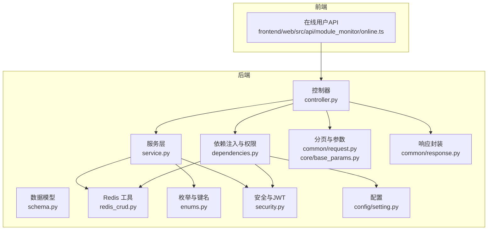
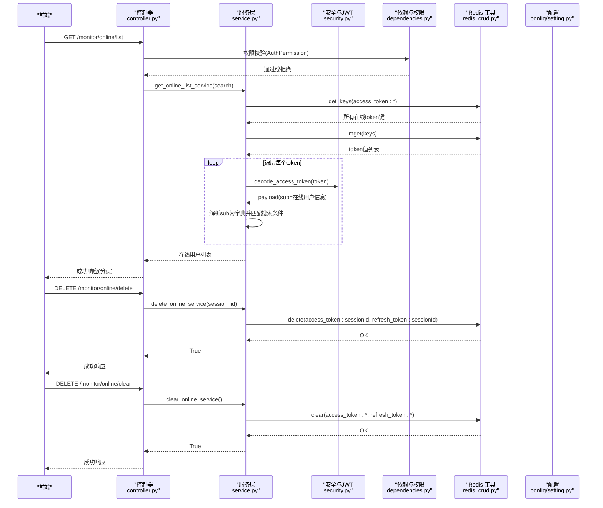
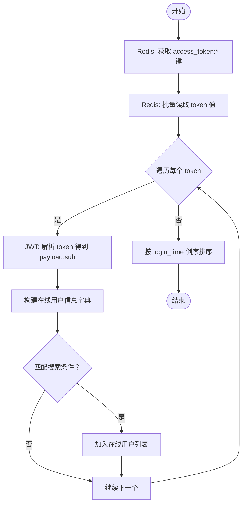
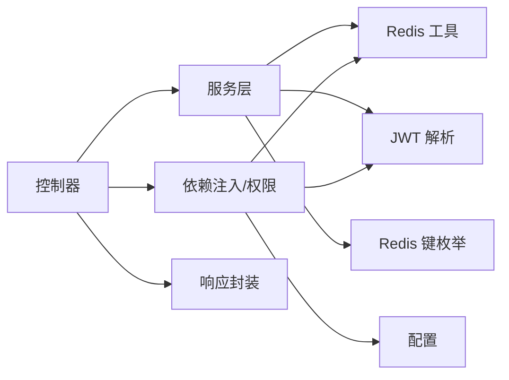

# 在线用户监控 API

<cite>
**本文引用的文件**
- [backend/app/api/v1/module_monitor/online/controller.py](file://backend/app/api/v1/module_monitor/online/controller.py)
- [backend/app/api/v1/module_monitor/online/schema.py](file://backend/app/api/v1/module_monitor/online/schema.py)
- [backend/app/api/v1/module_monitor/online/service.py](file://backend/app/api/v1/module_monitor/online/service.py)
- [backend/app/core/dependencies.py](file://backend/app/core/dependencies.py)
- [backend/app/core/redis_crud.py](file://backend/app/core/redis_crud.py)
- [backend/app/common/enums.py](file://backend/app/common/enums.py)
- [backend/app/core/security.py](file://backend/app/core/security.py)
- [backend/app/common/request.py](file://backend/app/common/request.py)
- [backend/app/core/base_params.py](file://backend/app/core/base_params.py)
- [backend/app/common/response.py](file://backend/app/common/response.py)
- [backend/app/config/setting.py](file://backend/app/config/setting.py)
- [frontend/web/src/api/module_monitor/online.ts](file://frontend/web/src/api/module_monitor/online.ts)
</cite>

## 目录
1. [简介](#简介)
2. [项目结构](#项目结构)
3. [核心组件](#核心组件)
4. [架构概览](#架构概览)
5. [详细组件分析](#详细组件分析)
6. [依赖分析](#依赖分析)
7. [性能考虑](#性能考虑)
8. [故障排查指南](#故障排查指南)
9. [结论](#结论)
10. [附录](#附录)

## 简介
本文件为在线用户监控模块的完整 API 接口文档，覆盖以下能力：
- 获取在线用户列表（支持分页、模糊搜索、排序）
- 用户会话管理（强制下线、清除全部在线会话）
- 在线用户识别机制、会话状态跟踪、心跳与过期处理
- 请求与响应格式、分页查询、状态筛选与排序条件
- 会话存储策略、过期机制与安全注销流程
- 用户行为分析、异常登录检测与并发控制相关接口说明

该模块以 Redis 存储在线会话，JWT 作为认证载体，结合后端权限与滑动过期策略，实现高并发下的在线用户实时监控。

## 项目结构
在线用户监控模块位于后端模块 monitor 的 online 子模块，包含控制器、服务层与数据模型；前端通过统一 API 调用。

图表来源
- [backend/app/api/v1/module_monitor/online/controller.py:1-109](file://backend/app/api/v1/module_monitor/online/controller.py#L1-L109)
- [backend/app/api/v1/module_monitor/online/service.py:1-119](file://backend/app/api/v1/module_monitor/online/service.py#L1-L119)
- [backend/app/api/v1/module_monitor/online/schema.py:1-41](file://backend/app/api/v1/module_monitor/online/schema.py#L1-L41)
- [backend/app/core/dependencies.py:1-296](file://backend/app/core/dependencies.py#L1-L296)
- [backend/app/core/redis_crud.py:1-343](file://backend/app/core/redis_crud.py#L1-L343)
- [backend/app/common/enums.py:42-74](file://backend/app/common/enums.py#L42-L74)
- [backend/app/core/security.py:1-149](file://backend/app/core/security.py#L1-L149)
- [backend/app/common/request.py:1-75](file://backend/app/common/request.py#L1-L75)
- [backend/app/core/base_params.py:1-94](file://backend/app/core/base_params.py#L1-L94)
- [backend/app/common/response.py:1-176](file://backend/app/common/response.py#L1-L176)
- [backend/app/config/setting.py:65-74](file://backend/app/config/setting.py#L65-L74)
- [frontend/web/src/api/module_monitor/online.ts:1-53](file://frontend/web/src/api/module_monitor/online.ts#L1-L53)

章节来源
- [backend/app/api/v1/module_monitor/online/controller.py:1-109](file://backend/app/api/v1/module_monitor/online/controller.py#L1-L109)
- [backend/app/api/v1/module_monitor/online/service.py:1-119](file://backend/app/api/v1/module_monitor/online/service.py#L1-L119)
- [backend/app/api/v1/module_monitor/online/schema.py:1-41](file://backend/app/api/v1/module_monitor/online/schema.py#L1-L41)
- [frontend/web/src/api/module_monitor/online.ts:1-53](file://frontend/web/src/api/module_monitor/online.ts#L1-L53)

## 核心组件
- 控制器层：定义三个接口，分别负责在线用户列表查询、强制下线与清空全部在线会话。
- 服务层：负责从 Redis 读取在线会话、解析 JWT、构建在线用户列表、执行强制下线与清空。
- 数据模型：定义在线用户输出模型与查询参数模型。
- 依赖与权限：提供 Redis 连接注入、权限校验、滑动过期与在线校验。
- Redis 工具：提供键检索、批量读取、删除与清空等操作。
- 安全与配置：JWT 解析、滑动过期开关、TOKEN 类型与过期时间等。

章节来源
- [backend/app/api/v1/module_monitor/online/controller.py:17-109](file://backend/app/api/v1/module_monitor/online/controller.py#L17-L109)
- [backend/app/api/v1/module_monitor/online/service.py:13-119](file://backend/app/api/v1/module_monitor/online/service.py#L13-L119)
- [backend/app/api/v1/module_monitor/online/schema.py:8-41](file://backend/app/api/v1/module_monitor/online/schema.py#L8-L41)
- [backend/app/core/dependencies.py:32-129](file://backend/app/core/dependencies.py#L32-L129)
- [backend/app/core/redis_crud.py:9-200](file://backend/app/core/redis_crud.py#L9-L200)
- [backend/app/core/security.py:116-149](file://backend/app/core/security.py#L116-L149)
- [backend/app/config/setting.py:65-74](file://backend/app/config/setting.py#L65-L74)

## 架构概览
在线用户监控的整体交互流程如下：

图表来源
- [backend/app/api/v1/module_monitor/online/controller.py:20-109](file://backend/app/api/v1/module_monitor/online/controller.py#L20-L109)
- [backend/app/api/v1/module_monitor/online/service.py:17-119](file://backend/app/api/v1/module_monitor/online/service.py#L17-L119)
- [backend/app/core/dependencies.py:236-296](file://backend/app/core/dependencies.py#L236-L296)
- [backend/app/core/security.py:116-149](file://backend/app/core/security.py#L116-L149)
- [backend/app/core/redis_crud.py:32-96](file://backend/app/core/redis_crud.py#L32-L96)
- [backend/app/config/setting.py:65-74](file://backend/app/config/setting.py#L65-L74)

## 详细组件分析

### 接口总览
- 路由前缀：/monitor/online
- 标签：在线用户
- 权限标识：
  - 查询在线用户：module_monitor:online:query
  - 强制下线：module_monitor:online:delete
  - 清除全部在线用户：module_monitor:online:delete

章节来源
- [backend/app/api/v1/module_monitor/online/controller.py:17-17](file://backend/app/api/v1/module_monitor/online/controller.py#L17-L17)

### 获取在线用户列表
- 方法与路径：GET /monitor/online/list
- 权限：module_monitor:online:query
- 功能：从 Redis 中扫描所有在线会话，解析 JWT 提取在线用户信息，支持按名称、IP、登录地点模糊搜索，并按登录时间倒序排序。
- 分页：服务层对内存中的列表进行切片分页，支持 page_no、page_size 与 order_by（服务层内部默认按 login_time 倒序）。
- 响应：分页结果对象，包含 items、total、page_no、page_size、has_next。

请求参数
- 查询参数（来自前端 PageQuery 与 OnlineUserPageQuery）
  - page_no：页码，默认 1
  - page_size：每页数量，默认 10，最大 100
  - order_by：排序字段（服务层内部默认按 login_time 倒序）
  - name：登录名称（模糊匹配）
  - ipaddr：登录 IP（模糊匹配）
  - login_location：登录地点（模糊匹配）

响应数据结构
- items：在线用户数组，元素字段参见“在线用户输出模型”
- total：总数
- page_no：当前页
- page_size：每页条数
- has_next：是否存在下一页

章节来源
- [backend/app/api/v1/module_monitor/online/controller.py:20-53](file://backend/app/api/v1/module_monitor/online/controller.py#L20-L53)
- [backend/app/api/v1/module_monitor/online/service.py:17-49](file://backend/app/api/v1/module_monitor/online/service.py#L17-L49)
- [backend/app/api/v1/module_monitor/online/schema.py:8-25](file://backend/app/api/v1/module_monitor/online/schema.py#L8-L25)
- [backend/app/common/request.py:22-75](file://backend/app/common/request.py#L22-L75)
- [backend/app/core/base_params.py:8-42](file://backend/app/core/base_params.py#L8-L42)
- [frontend/web/src/api/module_monitor/online.ts:35-39](file://frontend/web/src/api/module_monitor/online.ts#L35-L39)

### 强制下线
- 方法与路径：DELETE /monitor/online/delete
- 权限：module_monitor:online:delete
- 功能：根据会话编号删除对应的访问令牌与刷新令牌，使目标用户立即离线。
- 请求体：session_id（字符串）
- 响应：成功或失败消息

章节来源
- [backend/app/api/v1/module_monitor/online/controller.py:55-82](file://backend/app/api/v1/module_monitor/online/controller.py#L55-L82)
- [backend/app/api/v1/module_monitor/online/service.py:52-68](file://backend/app/api/v1/module_monitor/online/service.py#L52-L68)

### 清除所有在线用户
- 方法与路径：DELETE /monitor/online/clear
- 权限：module_monitor:online:delete
- 功能：清空所有在线会话（删除 access_token 与 refresh_token 前缀的所有键）。
- 响应：成功或失败消息

章节来源
- [backend/app/api/v1/module_monitor/online/controller.py:84-109](file://backend/app/api/v1/module_monitor/online/controller.py#L84-L109)
- [backend/app/api/v1/module_monitor/online/service.py:71-86](file://backend/app/api/v1/module_monitor/online/service.py#L71-L86)

### 在线用户识别机制
- 识别依据：Redis 中以 access_token:sessionId 为键存储的访问令牌。
- 识别流程：
  - 通过 Redis 键模式 access_token:* 获取所有在线会话键。
  - 批量读取键对应的 token 值。
  - 解析 JWT 载荷（payload.sub）为在线用户信息字典。
  - 应用搜索条件（名称、IP、登录地点）进行过滤。
  - 按 login_time 倒序排序。

图表来源
- [backend/app/api/v1/module_monitor/online/service.py:17-49](file://backend/app/api/v1/module_monitor/online/service.py#L17-L49)
- [backend/app/core/redis_crud.py:32-46](file://backend/app/core/redis_crud.py#L32-L46)
- [backend/app/core/security.py:116-139](file://backend/app/core/security.py#L116-L139)

章节来源
- [backend/app/api/v1/module_monitor/online/service.py:17-49](file://backend/app/api/v1/module_monitor/online/service.py#L17-L49)

### 会话状态跟踪与心跳检测
- 在线状态：通过 Redis 中是否存在 access_token:sessionId 键判断。
- 心跳检测：当前实现未在后端显式维护心跳检测逻辑，但可通过滑动过期策略实现“活跃即续期”的效果。
- 滑动过期：当用户存在且启用 TOKEN_SLIDING_EXPIRE 时，每次访问将自动延长 access_token 与 refresh_token 的过期时间。

章节来源
- [backend/app/core/dependencies.py:87-96](file://backend/app/core/dependencies.py#L87-L96)
- [backend/app/config/setting.py:73-73](file://backend/app/config/setting.py#L73-L73)

### 超时处理
- 过期时间：ACCESS_TOKEN_EXPIRE_MINUTES 与 REFRESH_TOKEN_EXPIRE_MINUTES。
- 过期触发：JWT 解析阶段若过期将抛出异常，导致认证失败。
- 自动续期：滑动过期开启时，每次访问会重置过期时间。

章节来源
- [backend/app/config/setting.py:69-73](file://backend/app/config/setting.py#L69-L73)
- [backend/app/core/security.py:144-146](file://backend/app/core/security.py#L144-L146)
- [backend/app/core/dependencies.py:87-96](file://backend/app/core/dependencies.py#L87-L96)

### 会话存储策略与安全注销
- 存储策略：
  - 访问令牌键：access_token:sessionId
  - 刷新令牌键：refresh_token:sessionId
- 注销流程：
  - 强制下线：删除 access_token:sessionId 与 refresh_token:sessionId。
  - 清空全部：删除 access_token:* 与 refresh_token:*。
- 安全性：
  - 通过权限中间件限制操作。
  - JWT 解析失败或过期将拒绝访问。

章节来源
- [backend/app/common/enums.py:42-53](file://backend/app/common/enums.py#L42-L53)
- [backend/app/api/v1/module_monitor/online/service.py:52-86](file://backend/app/api/v1/module_monitor/online/service.py#L52-L86)
- [backend/app/core/redis_crud.py:167-200](file://backend/app/core/redis_crud.py#L167-L200)
- [backend/app/core/dependencies.py:236-296](file://backend/app/core/dependencies.py#L236-L296)

### 用户行为分析、异常登录检测与并发控制
- 行为分析：当前接口未提供专门的行为分析接口，可在现有在线用户列表基础上扩展统计维度（如活跃度、地域分布等）。
- 异常登录检测：建议在登录流程中增加 IP/设备/地理位置的异常检测与告警，当前模块侧重在线用户管理而非登录审计。
- 并发控制：当前模块未提供并发会话上限控制接口，可在登录流程中引入会话数限制与踢人策略。

章节来源
- [backend/app/api/v1/module_monitor/online/controller.py:20-109](file://backend/app/api/v1/module_monitor/online/controller.py#L20-L109)

## 依赖分析
- 控制器依赖权限中间件与 Redis 连接注入。
- 服务层依赖 Redis 工具、JWT 解析与枚举键名。
- 依赖注入与权限校验贯穿认证链路，确保在线状态与滑动过期生效。
- 响应封装统一业务状态码与消息格式。

图表来源
- [backend/app/api/v1/module_monitor/online/controller.py:1-17](file://backend/app/api/v1/module_monitor/online/controller.py#L1-L17)
- [backend/app/api/v1/module_monitor/online/service.py:1-11](file://backend/app/api/v1/module_monitor/online/service.py#L1-L11)
- [backend/app/core/dependencies.py:32-129](file://backend/app/core/dependencies.py#L32-L129)
- [backend/app/core/redis_crud.py:9-200](file://backend/app/core/redis_crud.py#L9-L200)
- [backend/app/core/security.py:116-149](file://backend/app/core/security.py#L116-L149)
- [backend/app/common/enums.py:42-53](file://backend/app/common/enums.py#L42-L53)
- [backend/app/common/response.py:26-34](file://backend/app/common/response.py#L26-L34)
- [backend/app/config/setting.py:65-74](file://backend/app/config/setting.py#L65-L74)

章节来源
- [backend/app/api/v1/module_monitor/online/controller.py:1-17](file://backend/app/api/v1/module_monitor/online/controller.py#L1-L17)
- [backend/app/api/v1/module_monitor/online/service.py:1-11](file://backend/app/api/v1/module_monitor/online/service.py#L1-L11)
- [backend/app/core/dependencies.py:32-129](file://backend/app/core/dependencies.py#L32-L129)
- [backend/app/common/response.py:26-34](file://backend/app/common/response.py#L26-L34)

## 性能考虑
- Redis 全量扫描：access_token:* 可能产生大量键，建议在高并发场景下限制在线会话总量或引入索引优化。
- 批量读取：使用 mget 减少网络往返，提升列表查询性能。
- 内存分页：服务层对内存列表进行切片分页，适合中小规模在线用户；大规模场景建议数据库分页或缓存分页。
- 滑动过期：频繁访问会持续续期，降低会话中断概率，但需关注 Redis 写放大。

章节来源
- [backend/app/api/v1/module_monitor/online/service.py:31-49](file://backend/app/api/v1/module_monitor/online/service.py#L31-L49)
- [backend/app/common/request.py:22-75](file://backend/app/common/request.py#L22-L75)
- [backend/app/core/dependencies.py:87-96](file://backend/app/core/dependencies.py#L87-L96)

## 故障排查指南
- 认证失败（401）：
  - 检查 Authorization 头是否为 bearer 类型。
  - 确认 JWT 未过期，检查 SECRET_KEY 与 ALGORITHM 配置。
  - 确认 Redis 中 access_token:sessionId 是否存在。
- 权限不足（403）：
  - 确认用户角色是否具备 module_monitor:online:* 权限。
- 强制下线失败：
  - 检查 session_id 是否正确。
  - 确认 Redis 中对应键是否存在。
- 清空失败：
  - 检查 Redis 连接与权限。
- 分页异常：
  - 确认 page_no 与 page_size 合法范围（最小 1，page_size 最大 100）。

章节来源
- [backend/app/core/security.py:43-50](file://backend/app/core/security.py#L43-L50)
- [backend/app/core/security.py:141-149](file://backend/app/core/security.py#L141-L149)
- [backend/app/core/dependencies.py:61-85](file://backend/app/core/dependencies.py#L61-L85)
- [backend/app/common/request.py:54-57](file://backend/app/common/request.py#L54-L57)
- [backend/app/common/response.py:70-102](file://backend/app/common/response.py#L70-L102)

## 结论
在线用户监控模块通过 Redis 与 JWT 实现了高效的在线会话管理，支持列表查询、强制下线与清空全部在线用户。结合滑动过期与权限控制，满足高并发场景下的实时监控需求。建议后续在登录流程中完善异常检测与并发控制，并在现有接口基础上扩展行为分析能力。

## 附录

### 请求与响应格式
- 统一响应模型字段
  - code：业务状态码
  - msg：提示消息
  - data：响应数据
  - status_code：HTTP 状态码
  - success：是否成功

章节来源
- [backend/app/common/response.py:26-34](file://backend/app/common/response.py#L26-L34)

### 在线用户输出模型
- 字段说明
  - name：用户名称
  - session_id：会话编号
  - user_id：用户ID
  - user_name：用户名
  - ipaddr：登录IP
  - login_location：登录地点
  - os：操作系统
  - browser：浏览器
  - login_time：登录时间
  - login_type：登录类型（PC端/移动端）

章节来源
- [backend/app/api/v1/module_monitor/online/schema.py:8-25](file://backend/app/api/v1/module_monitor/online/schema.py#L8-L25)

### 前端调用示例
- 查询在线用户列表：GET /monitor/online/list，params 支持分页与模糊搜索字段
- 强制下线：DELETE /monitor/online/delete，data 为会话编号字符串
- 清除全部在线用户：DELETE /monitor/online/clear

章节来源
- [frontend/web/src/api/module_monitor/online.ts:7-30](file://frontend/web/src/api/module_monitor/online.ts#L7-L30)