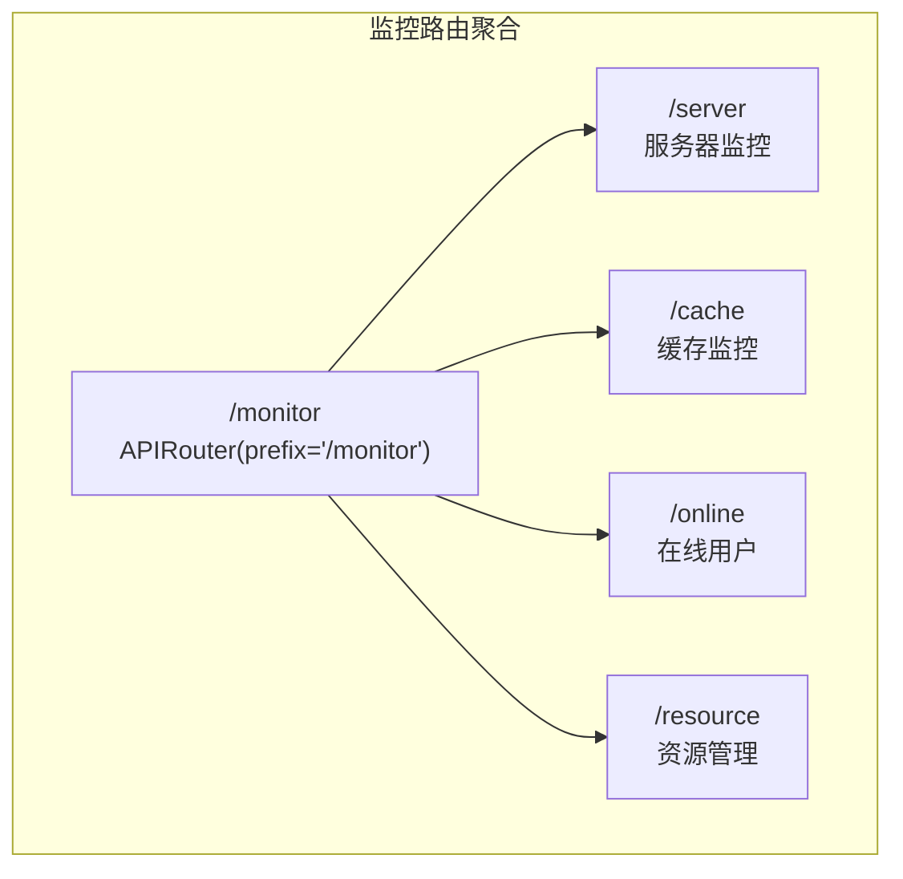
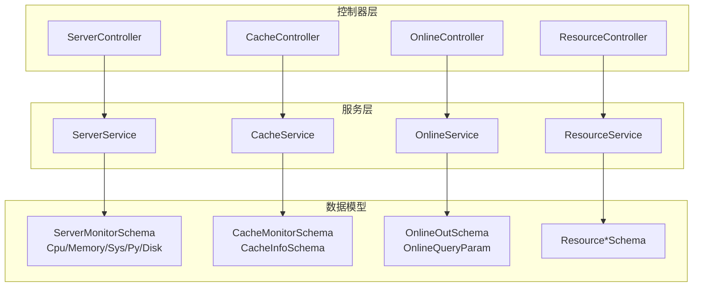
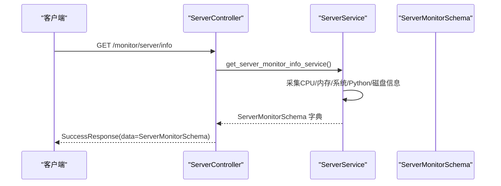
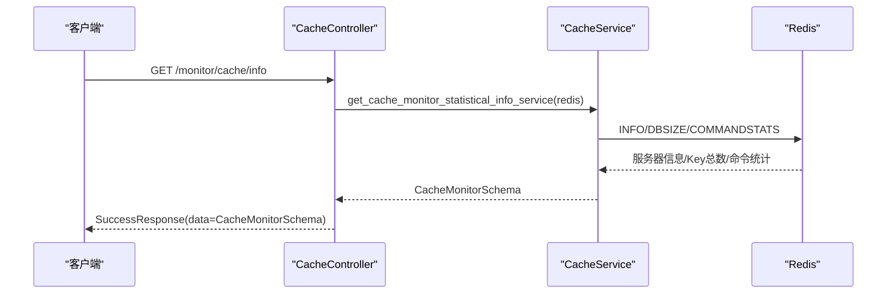
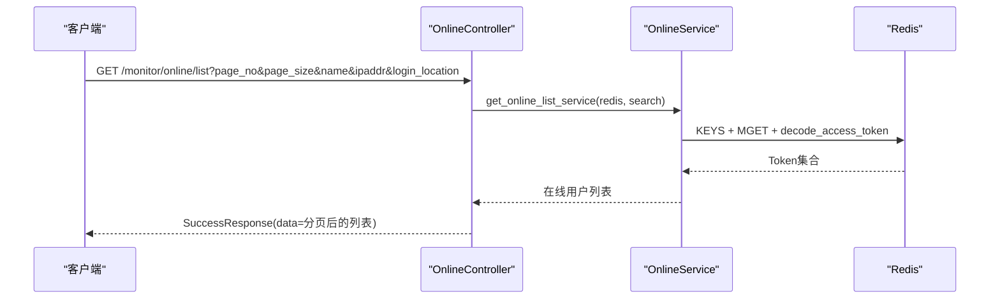
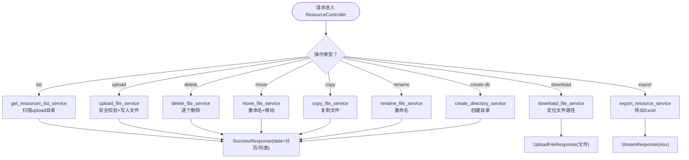
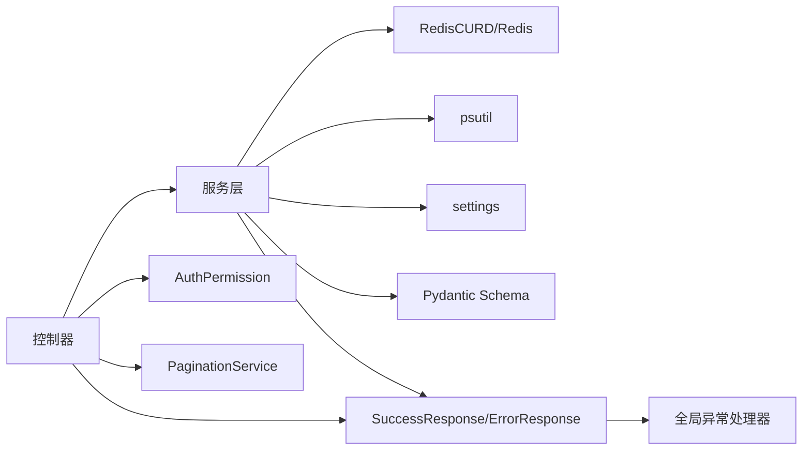

# 服务器监控 API

<cite>
**本文引用的文件**
- [backend/app/api/v1/module_monitor/__init__.py](file://backend/app/api/v1/module_monitor/__init__.py)
- [backend/app/api/v1/module_monitor/server/controller.py](file://backend/app/api/v1/module_monitor/server/controller.py)
- [backend/app/api/v1/module_monitor/server/service.py](file://backend/app/api/v1/module_monitor/server/service.py)
- [backend/app/api/v1/module_monitor/server/schema.py](file://backend/app/api/v1/module_monitor/server/schema.py)
- [backend/app/api/v1/module_monitor/cache/controller.py](file://backend/app/api/v1/module_monitor/cache/controller.py)
- [backend/app/api/v1/module_monitor/cache/service.py](file://backend/app/api/v1/module_monitor/cache/service.py)
- [backend/app/api/v1/module_monitor/cache/schema.py](file://backend/app/api/v1/module_monitor/cache/schema.py)
- [backend/app/api/v1/module_monitor/online/controller.py](file://backend/app/api/v1/module_monitor/online/controller.py)
- [backend/app/api/v1/module_monitor/online/service.py](file://backend/app/api/v1/module_monitor/online/service.py)
- [backend/app/api/v1/module_monitor/online/schema.py](file://backend/app/api/v1/module_monitor/online/schema.py)
- [backend/app/api/v1/module_monitor/resource/controller.py](file://backend/app/api/v1/module_monitor/resource/controller.py)
- [backend/app/api/v1/module_monitor/resource/service.py](file://backend/app/api/v1/module_monitor/resource/service.py)
- [backend/app/api/v1/module_monitor/resource/schema.py](file://backend/app/api/v1/module_monitor/resource/schema.py)
- [backend/app/common/response.py](file://backend/app/common/response.py)
- [backend/app/common/enums.py](file://backend/app/common/enums.py)
- [backend/app/core/exceptions.py](file://backend/app/core/exceptions.py)
</cite>

## 目录
1. [简介](#简介)
2. [项目结构](#项目结构)
3. [核心组件](#核心组件)
4. [架构总览](#架构总览)
5. [详细组件分析](#详细组件分析)
6. [依赖分析](#依赖分析)
7. [性能考虑](#性能考虑)
8. [故障排查指南](#故障排查指南)
9. [结论](#结论)
10. [附录](#附录)

## 简介
本文件为服务器监控模块的完整 API 接口文档，覆盖以下能力：
- 服务器健康检查与资源监控：CPU、内存、系统信息、Python 进程、磁盘分区
- 缓存监控与运维：Redis 命令统计、键空间浏览、键值查看与清理
- 在线用户监控与强制下线：在线用户列表、按条件筛选、强制下线、清空会话
- 资源管理与运维自动化：目录浏览、文件上传/下载、移动/复制/重命名/创建目录、导出资源列表
- 统一响应格式、状态码定义、错误日志接口
- 服务器集群管理、自动切换与故障转移的监控接口说明（基于现有模块能力的扩展建议）

## 项目结构
监控模块位于后端 API v1 层，按功能划分为四个子模块，并由统一的路由前缀聚合：
- 服务器监控：/monitor/server
- 缓存监控：/monitor/cache
- 在线用户：/monitor/online
- 资源管理：/monitor/resource

图表来源
- [backend/app/api/v1/module_monitor/__init__.py:1-14](file://backend/app/api/v1/module_monitor/__init__.py#L1-L14)

章节来源
- [backend/app/api/v1/module_monitor/__init__.py:1-14](file://backend/app/api/v1/module_monitor/__init__.py#L1-L14)

## 核心组件
- 统一响应模型与响应封装
  - 成功响应 SuccessResponse：封装 code/msg/data/status_code/success
  - 错误响应 ErrorResponse：封装 code/msg/status_code/success
  - 流式与文件响应：StreamResponse、UploadFileResponse
- 统一异常处理
  - CustomException：业务异常基类，支持自定义 code/status_code/msg/data
  - 全局异常处理器：捕获并统一输出 ErrorResponse
- Redis 集成
  - 通过依赖注入获取 Redis 客户端，供缓存与在线用户模块使用
- 权限控制
  - 通过 AuthPermission 依赖校验模块权限位，如 module_monitor:server:query、module_monitor:cache:delete 等

章节来源
- [backend/app/common/response.py:26-176](file://backend/app/common/response.py#L26-L176)
- [backend/app/core/exceptions.py:15-248](file://backend/app/core/exceptions.py#L15-L248)
- [backend/app/common/enums.py:42-74](file://backend/app/common/enums.py#L42-L74)

## 架构总览
监控模块采用“控制器-服务-数据模型”的分层设计，控制器负责路由与鉴权，服务层负责业务逻辑与外部系统交互（Redis/文件系统），数据模型负责请求/响应的数据结构。

图表来源
- [backend/app/api/v1/module_monitor/server/controller.py:1-33](file://backend/app/api/v1/module_monitor/server/controller.py#L1-L33)
- [backend/app/api/v1/module_monitor/server/service.py:20-164](file://backend/app/api/v1/module_monitor/server/service.py#L20-L164)
- [backend/app/api/v1/module_monitor/server/schema.py:4-78](file://backend/app/api/v1/module_monitor/server/schema.py#L4-L78)
- [backend/app/api/v1/module_monitor/cache/controller.py:1-197](file://backend/app/api/v1/module_monitor/cache/controller.py#L1-L197)
- [backend/app/api/v1/module_monitor/cache/service.py:9-155](file://backend/app/api/v1/module_monitor/cache/service.py#L9-L155)
- [backend/app/api/v1/module_monitor/cache/schema.py:6-25](file://backend/app/api/v1/module_monitor/cache/schema.py#L6-L25)
- [backend/app/api/v1/module_monitor/online/controller.py:1-109](file://backend/app/api/v1/module_monitor/online/controller.py#L1-L109)
- [backend/app/api/v1/module_monitor/online/service.py:13-119](file://backend/app/api/v1/module_monitor/online/service.py#L13-L119)
- [backend/app/api/v1/module_monitor/online/schema.py:8-41](file://backend/app/api/v1/module_monitor/online/schema.py#L8-L41)
- [backend/app/api/v1/module_monitor/resource/controller.py:1-276](file://backend/app/api/v1/module_monitor/resource/controller.py#L1-L276)
- [backend/app/api/v1/module_monitor/resource/service.py:30-800](file://backend/app/api/v1/module_monitor/resource/service.py#L30-L800)
- [backend/app/api/v1/module_monitor/resource/schema.py:16-204](file://backend/app/api/v1/module_monitor/resource/schema.py#L16-L204)

## 详细组件分析

### 服务器监控（/monitor/server）
- 接口
  - GET /monitor/server/info
    - 权限：module_monitor:server:query
    - 功能：采集并返回服务器 CPU、内存、系统、Python 进程、磁盘分区等监控信息
    - 响应：SuccessResponse，data 为 ServerMonitorSchema
- 数据模型
  - CpuInfoSchema：CPU 核心数、用户态/系统态/空闲使用率
  - MemoryInfoSchema：内存总量/已用/剩余/使用率
  - SysInfoSchema：主机 IP/名称、系统架构/平台、工作目录
  - PyInfoSchema：Python 名称/版本/启动时间/运行时长/路径/内存占用/使用率
  - DiskInfoSchema：挂载点、文件系统类型、总/已用/剩余/使用率
  - ServerMonitorSchema：聚合上述字段

图表来源
- [backend/app/api/v1/module_monitor/server/controller.py:15-32](file://backend/app/api/v1/module_monitor/server/controller.py#L15-L32)
- [backend/app/api/v1/module_monitor/server/service.py:24-37](file://backend/app/api/v1/module_monitor/server/service.py#L24-L37)
- [backend/app/api/v1/module_monitor/server/schema.py:68-78](file://backend/app/api/v1/module_monitor/server/schema.py#L68-L78)

章节来源
- [backend/app/api/v1/module_monitor/server/controller.py:1-33](file://backend/app/api/v1/module_monitor/server/controller.py#L1-L33)
- [backend/app/api/v1/module_monitor/server/service.py:20-164](file://backend/app/api/v1/module_monitor/server/service.py#L20-L164)
- [backend/app/api/v1/module_monitor/server/schema.py:1-78](file://backend/app/api/v1/module_monitor/server/schema.py#L1-L78)

### 缓存监控（/monitor/cache）
- 接口
  - GET /monitor/cache/info
    - 权限：module_monitor:cache:query
    - 功能：获取 Redis 服务器信息、数据库 Key 总数、命令统计
    - 响应：SuccessResponse，data 为 CacheMonitorSchema
  - GET /monitor/cache/get/names
    - 权限：module_monitor:cache:query
    - 功能：获取系统内置缓存名称清单（来源于 RedisInitKeyConfig）
    - 响应：SuccessResponse，data 为 CacheInfoSchema 列表
  - GET /monitor/cache/get/keys/{cache_name}
    - 权限：module_monitor:cache:query
    - 功能：列出指定缓存前缀下的键名
    - 响应：SuccessResponse，data 为键名数组
  - GET /monitor/cache/get/value/{cache_name}/{cache_key}
    - 权限：module_monitor:cache:query
    - 功能：获取指定键的值
    - 响应：SuccessResponse，data 为 CacheInfoSchema
  - DELETE /monitor/cache/delete/name/{cache_name}
    - 权限：module_monitor:cache:delete
    - 功能：清除指定缓存前缀下的所有键
    - 响应：SuccessResponse 或抛出 CustomException
  - DELETE /monitor/cache/delete/key/{cache_key}
    - 权限：module_monitor:cache:delete
    - 功能：按键名模式清除匹配的键
    - 响应：SuccessResponse 或抛出 CustomException
  - DELETE /monitor/cache/delete/all
    - 权限：module_monitor:cache:delete
    - 功能：清空 Redis 数据库（谨慎使用）
    - 响应：SuccessResponse 或抛出 CustomException
- 数据模型
  - CacheMonitorSchema：command_stats/db_size/info
  - CacheInfoSchema：cache_key/cache_name/cache_value/remark

图表来源
- [backend/app/api/v1/module_monitor/cache/controller.py:19-40](file://backend/app/api/v1/module_monitor/cache/controller.py#L19-L40)
- [backend/app/api/v1/module_monitor/cache/service.py:14-35](file://backend/app/api/v1/module_monitor/cache/service.py#L14-L35)

章节来源
- [backend/app/api/v1/module_monitor/cache/controller.py:1-197](file://backend/app/api/v1/module_monitor/cache/controller.py#L1-L197)
- [backend/app/api/v1/module_monitor/cache/service.py:9-155](file://backend/app/api/v1/module_monitor/cache/service.py#L9-L155)
- [backend/app/api/v1/module_monitor/cache/schema.py:6-25](file://backend/app/api/v1/module_monitor/cache/schema.py#L6-L25)
- [backend/app/common/enums.py:42-74](file://backend/app/common/enums.py#L42-L74)

### 在线用户（/monitor/online）
- 接口
  - GET /monitor/online/list
    - 权限：module_monitor:online:query
    - 功能：获取在线用户列表，支持分页与模糊查询（名称/IP/登录地）
    - 响应：SuccessResponse，data 为 OnlineOutSchema 列表
  - DELETE /monitor/online/delete
    - 权限：module_monitor:online:delete
    - 功能：强制下线指定会话（删除 ACCESS_TOKEN/REFRESH_TOKEN）
    - 响应：SuccessResponse 或 ErrorResponse
  - DELETE /monitor/online/clear
    - 权限：module_monitor:online:delete
    - 功能：清空所有在线用户会话
    - 响应：SuccessResponse 或 ErrorResponse
- 数据模型
  - OnlineOutSchema：name/session_id/user_id/user_name/ipaddr/login_location/os/browser/login_time/login_type
  - OnlineQueryParam：支持 name/ipaddr/login_location 的模糊查询

图表来源
- [backend/app/api/v1/module_monitor/online/controller.py:20-52](file://backend/app/api/v1/module_monitor/online/controller.py#L20-L52)
- [backend/app/api/v1/module_monitor/online/service.py:16-49](file://backend/app/api/v1/module_monitor/online/service.py#L16-L49)
- [backend/app/api/v1/module_monitor/online/schema.py:27-41](file://backend/app/api/v1/module_monitor/online/schema.py#L27-L41)

章节来源
- [backend/app/api/v1/module_monitor/online/controller.py:1-109](file://backend/app/api/v1/module_monitor/online/controller.py#L1-L109)
- [backend/app/api/v1/module_monitor/online/service.py:13-119](file://backend/app/api/v1/module_monitor/online/service.py#L13-L119)
- [backend/app/api/v1/module_monitor/online/schema.py:1-41](file://backend/app/api/v1/module_monitor/online/schema.py#L1-L41)

### 资源管理（/monitor/resource）
- 接口
  - GET /monitor/resource/list
    - 权限：module_monitor:resource:query
    - 功能：列出 upload 目录下的文件/目录，支持分页与名称模糊搜索
    - 响应：SuccessResponse，data 为 ResourceDirectorySchema
  - POST /monitor/resource/upload
    - 权限：module_monitor:resource:upload
    - 功能：上传文件至目标目录，内置安全校验与类型检测
    - 响应：SuccessResponse，data 为 ResourceUploadSchema
  - GET /monitor/resource/download
    - 权限：module_monitor:resource:download
    - 功能：下载指定文件（返回文件路径，由 FileResponse 下发）
    - 响应：UploadFileResponse（文件流）
  - DELETE /monitor/resource/delete
    - 权限：module_monitor:resource:delete
    - 功能：删除一个或多个文件/目录
    - 响应：SuccessResponse
  - POST /monitor/resource/move
    - 权限：module_monitor:resource:move
    - 功能：移动文件/目录（支持覆盖）
    - 响应：SuccessResponse
  - POST /monitor/resource/copy
    - 权限：module_monitor:resource:copy
    - 功能：复制文件/目录
    - 响应：SuccessResponse
  - POST /monitor/resource/rename
    - 权限：module_monitor:resource:rename
    - 功能：重命名文件/目录
    - 响应：SuccessResponse
  - POST /monitor/resource/create-dir
    - 权限：module_monitor:resource:create_dir
    - 功能：在指定父目录下创建新目录
    - 响应：SuccessResponse
  - POST /monitor/resource/export
    - 权限：module_monitor:resource:export
    - 功能：导出资源列表为 Excel
    - 响应：StreamResponse（xlsx）
- 数据模型
  - ResourceItemSchema：name/file_url/relative_path/is_file/is_dir/size/created_time/modified_time/is_hidden
  - ResourceDirectorySchema：path/name/items/total_files/total_dirs/total_size
  - ResourceUploadSchema：filename/file_url/file_size/upload_time
  - ResourceMoveSchema/ResourceCopySchema/ResourceRenameSchema/ResourceCreateDirSchema：操作参数模型
  - ResourceSearchQueryParam：name/path 搜索参数

图表来源
- [backend/app/api/v1/module_monitor/resource/controller.py:26-276](file://backend/app/api/v1/module_monitor/resource/controller.py#L26-L276)
- [backend/app/api/v1/module_monitor/resource/service.py:339-800](file://backend/app/api/v1/module_monitor/resource/service.py#L339-L800)
- [backend/app/api/v1/module_monitor/resource/schema.py:16-204](file://backend/app/api/v1/module_monitor/resource/schema.py#L16-L204)

章节来源
- [backend/app/api/v1/module_monitor/resource/controller.py:1-276](file://backend/app/api/v1/module_monitor/resource/controller.py#L1-L276)
- [backend/app/api/v1/module_monitor/resource/service.py:30-800](file://backend/app/api/v1/module_monitor/resource/service.py#L30-L800)
- [backend/app/api/v1/module_monitor/resource/schema.py:1-204](file://backend/app/api/v1/module_monitor/resource/schema.py#L1-L204)

## 依赖分析
- 控制器依赖
  - 权限：AuthPermission（按模块与操作位校验）
  - Redis：通过 redis_getter 依赖注入 Redis 客户端
  - 分页：PaginationQueryParam + PaginationService
- 服务层依赖
  - RedisCURD：对 Redis 的统一 CRUD 封装
  - psutil：采集服务器 CPU/内存/磁盘/进程信息
  - settings：读取静态资源根目录与静态 URL 配置
- 数据模型依赖
  - Pydantic BaseModel + Field/ConfigDict：定义字段约束与序列化行为
- 统一响应与异常
  - ResponseSchema/SuccessResponse/ErrorResponse：统一输出格式
  - CustomException + 全局异常处理器：统一错误处理

图表来源
- [backend/app/api/v1/module_monitor/server/service.py:1-18](file://backend/app/api/v1/module_monitor/server/service.py#L1-L18)
- [backend/app/api/v1/module_monitor/cache/service.py:1-6](file://backend/app/api/v1/module_monitor/cache/service.py#L1-L6)
- [backend/app/api/v1/module_monitor/online/service.py:1-10](file://backend/app/api/v1/module_monitor/online/service.py#L1-L10)
- [backend/app/api/v1/module_monitor/resource/service.py:12-27](file://backend/app/api/v1/module_monitor/resource/service.py#L12-L27)
- [backend/app/common/response.py:26-102](file://backend/app/common/response.py#L26-L102)
- [backend/app/core/exceptions.py:57-248](file://backend/app/core/exceptions.py#L57-L248)

章节来源
- [backend/app/api/v1/module_monitor/server/service.py:1-18](file://backend/app/api/v1/module_monitor/server/service.py#L1-L18)
- [backend/app/api/v1/module_monitor/cache/service.py:1-6](file://backend/app/api/v1/module_monitor/cache/service.py#L1-L6)
- [backend/app/api/v1/module_monitor/online/service.py:1-10](file://backend/app/api/v1/module_monitor/online/service.py#L1-L10)
- [backend/app/api/v1/module_monitor/resource/service.py:12-27](file://backend/app/api/v1/module_monitor/resource/service.py#L12-L27)
- [backend/app/common/response.py:26-102](file://backend/app/common/response.py#L26-L102)
- [backend/app/core/exceptions.py:57-248](file://backend/app/core/exceptions.py#L57-L248)

## 性能考虑
- 服务器监控
  - 采集指标来自 psutil，开销较低；建议前端轮询间隔≥10s，避免频繁采集
  - 磁盘分区遍历可能较慢，建议按需调用且限制刷新频率
- 缓存监控
  - INFO/DBSIZE/COMMANDSTATS 为轻量级命令；KEYS 扫描在大数据集上可能阻塞，建议配合前缀匹配与分页
  - 清空操作（delete/all）为高风险操作，建议仅在维护窗口执行
- 在线用户
  - KEYS + MGET 读取大量 token，建议分页与条件过滤；避免全量扫描
- 资源管理
  - 目录扫描与文件上传/下载为 IO 密集；建议限制单次上传大小与并发数
  - 导出 Excel 为内存操作，注意控制导出范围与结果集上限

## 故障排查指南
- 统一响应与错误码
  - 成功响应：code=业务码（默认 OK）、success=true、status_code=200
  - 错误响应：code/msg/status_code/success=false，业务异常通过 CustomException 抛出
  - 全局异常处理器将异常记录到日志并返回 ErrorResponse
- 常见问题定位
  - 权限不足：确认权限位是否包含 module_monitor:* 或具体操作位
  - Redis 不可用：检查 Redis 连接配置与网络连通性
  - 路径越权/不安全：资源管理模块对路径与文件名进行严格校验，避免 ../ 等路径穿越
  - 文件类型不匹配：上传时会检测真实 MIME 类型，扩展名与实际类型不一致将产生告警
- 日志接口
  - 控制器与服务层均使用 log 记录关键事件与错误，便于定位问题

章节来源
- [backend/app/common/response.py:26-102](file://backend/app/common/response.py#L26-L102)
- [backend/app/core/exceptions.py:57-248](file://backend/app/core/exceptions.py#L57-L248)
- [backend/app/api/v1/module_monitor/resource/service.py:56-146](file://backend/app/api/v1/module_monitor/resource/service.py#L56-L146)

## 结论
本监控模块提供了服务器、缓存、在线用户与资源管理的完整 API 能力，具备统一的响应格式、完善的权限控制与安全校验。结合现有能力，可进一步扩展集群状态可视化、健康检查探测、自动切换与故障转移的监控接口，以满足生产级运维需求。

## 附录

### 统一响应格式
- 成功响应
  - 字段：code、msg、data、status_code、success
  - 示例：SuccessResponse(data=..., msg="...", code=..., status_code=200, success=true)
- 错误响应
  - 字段：code、msg、status_code、success（success=false）
  - 示例：ErrorResponse(msg="...", code=..., status_code=4xx/5xx)

章节来源
- [backend/app/common/response.py:26-102](file://backend/app/common/response.py#L26-L102)

### 权限位对照
- 服务器监控：module_monitor:server:query
- 缓存监控：module_monitor:cache:query、module_monitor:cache:delete
- 在线用户：module_monitor:online:query、module_monitor:online:delete
- 资源管理：module_monitor:resource:query、module_monitor:resource:upload、module_monitor:resource:download、module_monitor:resource:delete、module_monitor:resource:move、module_monitor:resource:copy、module_monitor:resource:rename、module_monitor:resource:create_dir、module_monitor:resource:export

章节来源
- [backend/app/api/v1/module_monitor/server/controller.py:19-20](file://backend/app/api/v1/module_monitor/server/controller.py#L19-L20)
- [backend/app/api/v1/module_monitor/cache/controller.py:21-179](file://backend/app/api/v1/module_monitor/cache/controller.py#L21-L179)
- [backend/app/api/v1/module_monitor/online/controller.py:22-90](file://backend/app/api/v1/module_monitor/online/controller.py#L22-L90)
- [backend/app/api/v1/module_monitor/resource/controller.py:31-275](file://backend/app/api/v1/module_monitor/resource/controller.py#L31-L275)

### 服务器集群管理与故障转移（扩展建议）
- 健康检查探测
  - 建议新增 /monitor/health 接口，返回节点存活状态、延迟、可用区信息
- 负载均衡状态
  - 建议新增 /monitor/loadbalancer 接口，返回上游节点健康度、流量分配权重
- 自动切换与故障转移
  - 建议新增 /monitor/failover 接口，触发主备切换、熔断降级与重试策略
- 以上为概念性扩展，需结合具体网关/负载均衡器与注册中心实现