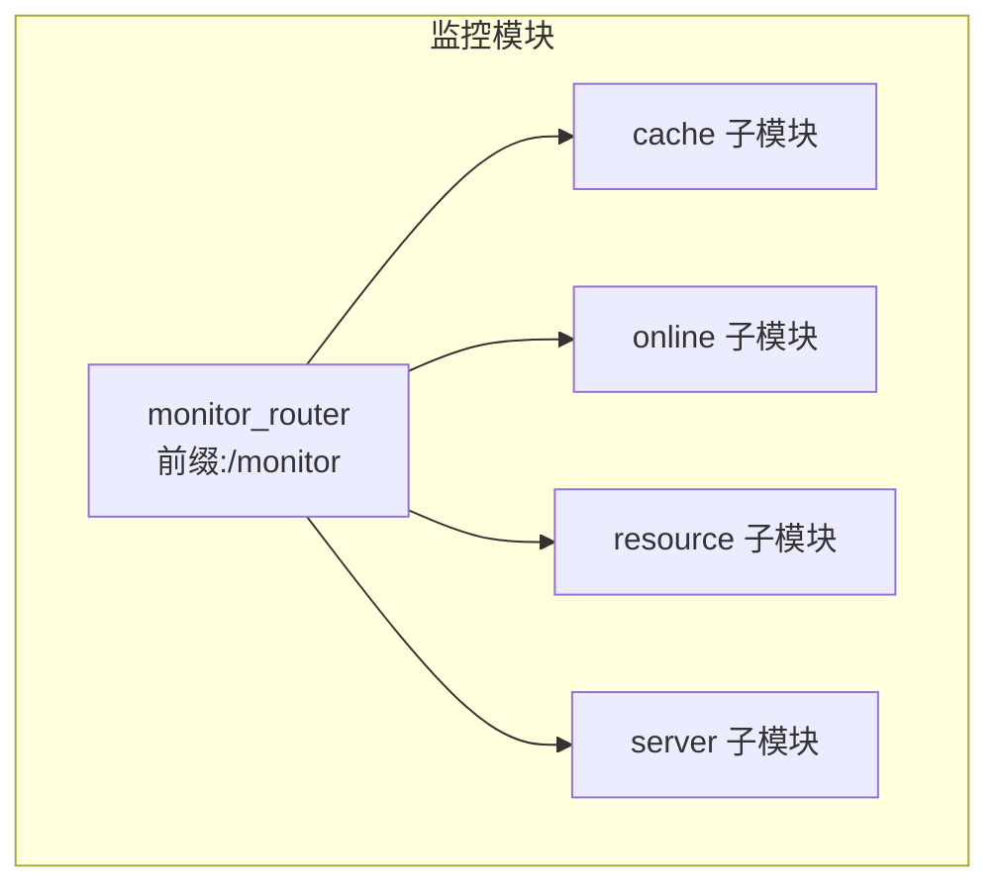
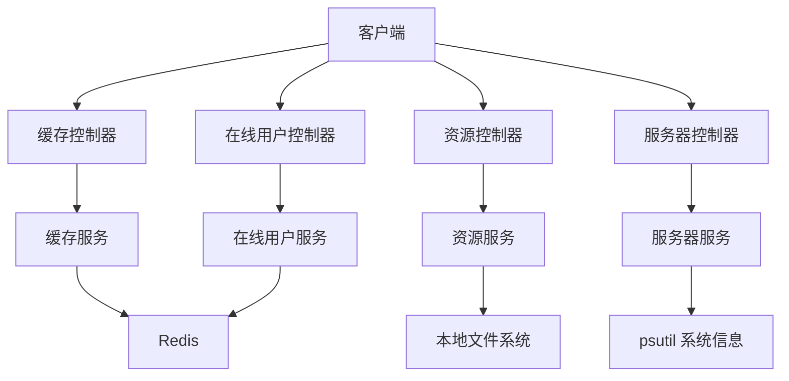
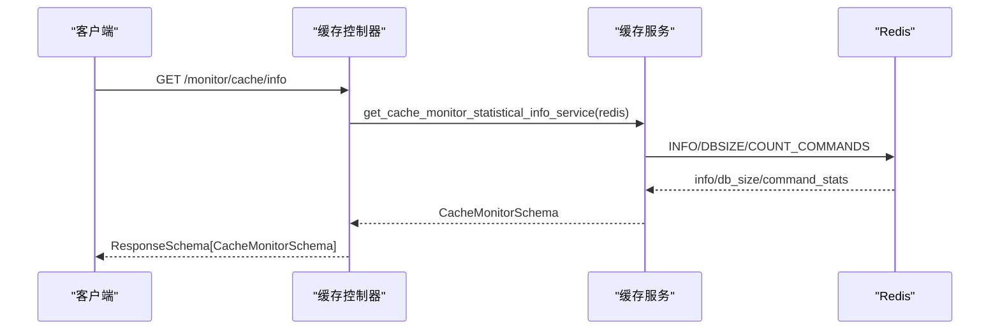
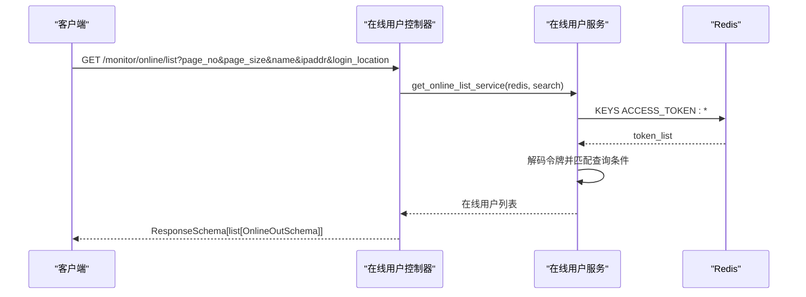
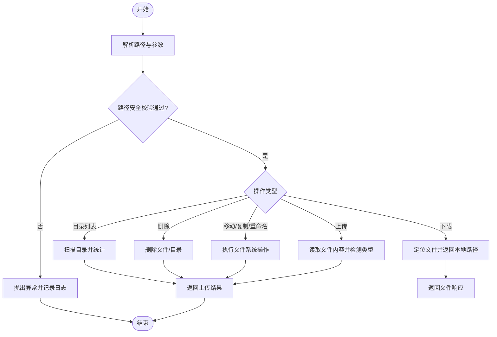
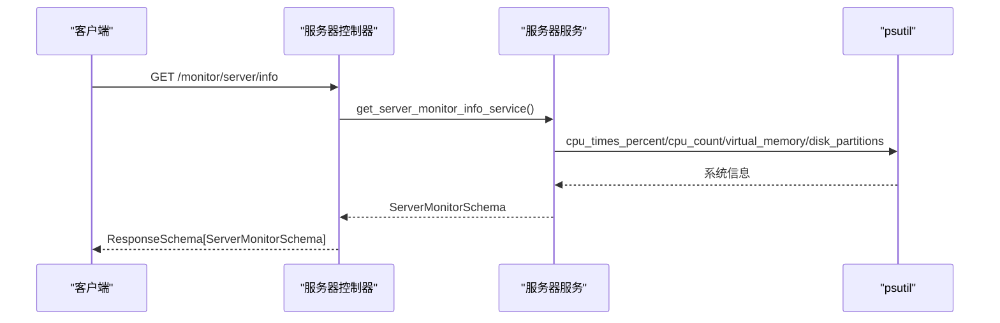
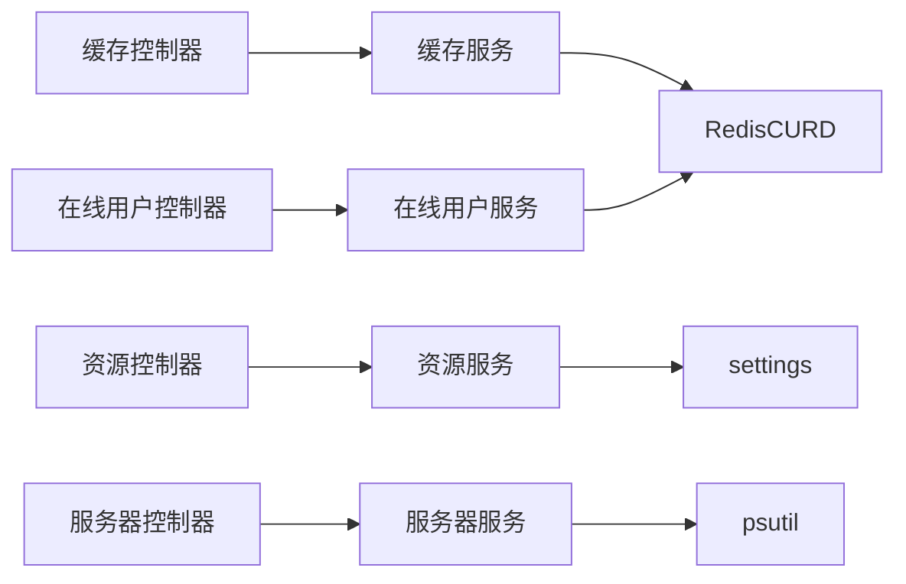

# 监控管理 API

<cite>
**本文引用的文件**
- [backend/app/api/v1/module_monitor/__init__.py](file://backend/app/api/v1/module_monitor/__init__.py)
- [backend/app/api/v1/module_monitor/cache/controller.py](file://backend/app/api/v1/module_monitor/cache/controller.py)
- [backend/app/api/v1/module_monitor/cache/schema.py](file://backend/app/api/v1/module_monitor/cache/schema.py)
- [backend/app/api/v1/module_monitor/cache/service.py](file://backend/app/api/v1/module_monitor/cache/service.py)
- [backend/app/api/v1/module_monitor/online/controller.py](file://backend/app/api/v1/module_monitor/online/controller.py)
- [backend/app/api/v1/module_monitor/online/schema.py](file://backend/app/api/v1/module_monitor/online/schema.py)
- [backend/app/api/v1/module_monitor/online/service.py](file://backend/app/api/v1/module_monitor/online/service.py)
- [backend/app/api/v1/module_monitor/resource/controller.py](file://backend/app/api/v1/module_monitor/resource/controller.py)
- [backend/app/api/v1/module_monitor/resource/schema.py](file://backend/app/api/v1/module_monitor/resource/schema.py)
- [backend/app/api/v1/module_monitor/resource/service.py](file://backend/app/api/v1/module_monitor/resource/service.py)
- [backend/app/api/v1/module_monitor/server/controller.py](file://backend/app/api/v1/module_monitor/server/controller.py)
- [backend/app/api/v1/module_monitor/server/schema.py](file://backend/app/api/v1/module_monitor/server/schema.py)
- [backend/app/api/v1/module_monitor/server/service.py](file://backend/app/api/v1/module_monitor/server/service.py)
</cite>

## 目录
1. [简介](#简介)
2. [项目结构](#项目结构)
3. [核心组件](#核心组件)
4. [架构总览](#架构总览)
5. [详细组件分析](#详细组件分析)
6. [依赖分析](#依赖分析)
7. [性能考虑](#性能考虑)
8. [故障排查指南](#故障排查指南)
9. [结论](#结论)
10. [附录](#附录)

## 简介
本文件为“监控管理模块”的完整 API 接口文档，覆盖以下监控维度：
- 缓存监控：Redis 命令统计、数据库键数量、键名枚举、键值读取、清理策略
- 在线用户监控：在线用户列表、按条件筛选、强制下线、清空在线会话
- 资源监控：文件系统目录浏览、文件上传/下载、移动/复制/重命名/创建目录、删除、导出
- 服务器监控：CPU/内存/磁盘/系统/Python 运行时信息

文档详细说明各接口的数据采集方式、监控指标定义、数据更新频率、查询条件、请求响应格式、时间范围与聚合统计能力、存储策略、清理机制与性能优化，并给出告警触发条件与通知机制的接口说明建议。

## 项目结构
监控模块位于后端应用的 v1 API 下，按功能划分为四个子模块：cache、online、resource、server。每个子模块包含 controller（路由与鉴权）、schema（数据模型）、service（业务逻辑）三层。

图表来源
- [backend/app/api/v1/module_monitor/__init__.py:1-14](file://backend/app/api/v1/module_monitor/__init__.py#L1-L14)

章节来源
- [backend/app/api/v1/module_monitor/__init__.py:1-14](file://backend/app/api/v1/module_monitor/__init__.py#L1-L14)

## 核心组件
- 路由聚合器：monitor_router 聚合四个子模块路由，统一前缀 /monitor
- 控制器层：负责鉴权、分页、查询参数解析、调用服务层并返回统一响应
- 服务层：封装具体业务逻辑，如 Redis 操作、文件系统操作、系统信息采集
- 数据模型层：Pydantic Schema 定义请求/响应结构，保证类型安全与文档自动生成

章节来源
- [backend/app/api/v1/module_monitor/cache/controller.py:1-197](file://backend/app/api/v1/module_monitor/cache/controller.py#L1-L197)
- [backend/app/api/v1/module_monitor/online/controller.py:1-109](file://backend/app/api/v1/module_monitor/online/controller.py#L1-L109)
- [backend/app/api/v1/module_monitor/resource/controller.py:1-276](file://backend/app/api/v1/module_monitor/resource/controller.py#L1-L276)
- [backend/app/api/v1/module_monitor/server/controller.py:1-33](file://backend/app/api/v1/module_monitor/server/controller.py#L1-L33)

## 架构总览
监控模块采用典型的三层架构：控制器接收请求并进行参数校验与鉴权，服务层执行业务逻辑，数据模型层保障接口契约。Redis 用于缓存与在线用户会话存储；文件系统用于资源管理；psutil 用于服务器监控信息采集。

图表来源
- [backend/app/api/v1/module_monitor/cache/controller.py:1-197](file://backend/app/api/v1/module_monitor/cache/controller.py#L1-L197)
- [backend/app/api/v1/module_monitor/online/controller.py:1-109](file://backend/app/api/v1/module_monitor/online/controller.py#L1-L109)
- [backend/app/api/v1/module_monitor/resource/controller.py:1-276](file://backend/app/api/v1/module_monitor/resource/controller.py#L1-L276)
- [backend/app/api/v1/module_monitor/server/controller.py:1-33](file://backend/app/api/v1/module_monitor/server/controller.py#L1-L33)

## 详细组件分析

### 缓存监控（/monitor/cache）
- 功能概览
  - 获取缓存统计信息（命令统计、数据库键数量、服务器信息）
  - 获取缓存名称列表（基于预设键前缀）
  - 获取指定缓存名称下的键名列表
  - 获取指定键的值
  - 清除指定缓存名称的所有键、指定键、或全部缓存

- 数据采集方式
  - 通过 RedisCURD 封装的 Redis 客户端执行 info、db_size、commandstats、keys、get、delete、clear 等命令
  - 命令统计字段来源于 Redis 的命令统计字典，清洗为“名称-调用次数”结构

- 监控指标定义
  - 命令统计：list[dict]，元素包含 name（命令名）、value（调用次数）
  - db_size：int，数据库中 Key 总数
  - info：dict，Redis 服务器信息

- 数据更新频率
  - 读取类接口为即时查询，无内置定时刷新
  - 建议：结合调度任务定期采集并落库，前端轮询或 WebSocket 推送

- 查询条件
  - 键名列表按前缀匹配（cache_name:*）
  - 键值读取按 cache_name:cache_key 组合键读取

- 请求/响应格式
  - 统计信息：ResponseSchema[CacheMonitorSchema]
  - 名称列表：ResponseSchema[list[CacheInfoSchema]]
  - 键名列表：ResponseSchema[list[str]]
  - 键值：ResponseSchema[CacheInfoSchema]
  - 清理结果：ResponseSchema[None]

- 存储策略与清理机制
  - 仅对本系统预设的键前缀进行清理，避免误删
  - 清理策略：按前缀批量删除、按模式删除、全库清理（谨慎）

- 性能优化
  - 批量 keys + mget 减少网络往返
  - 对大集合采用分页或分批处理
  - 对热点键增加 TTL 管理，避免无限增长

- 告警与通知
  - 建议：当 db_size 超过阈值、命令统计异常峰值、内存使用率过高时触发告警
  - 通知机制：Webhook/邮件/IM，携带指标与阈值信息

图表来源
- [backend/app/api/v1/module_monitor/cache/controller.py:19-41](file://backend/app/api/v1/module_monitor/cache/controller.py#L19-L41)
- [backend/app/api/v1/module_monitor/cache/service.py:14-36](file://backend/app/api/v1/module_monitor/cache/service.py#L14-L36)

章节来源
- [backend/app/api/v1/module_monitor/cache/controller.py:1-197](file://backend/app/api/v1/module_monitor/cache/controller.py#L1-L197)
- [backend/app/api/v1/module_monitor/cache/schema.py:1-25](file://backend/app/api/v1/module_monitor/cache/schema.py#L1-L25)
- [backend/app/api/v1/module_monitor/cache/service.py:1-155](file://backend/app/api/v1/module_monitor/cache/service.py#L1-L155)

### 在线用户监控（/monitor/online）
- 功能概览
  - 获取在线用户列表（支持分页与模糊查询）
  - 强制下线指定会话
  - 清空所有在线会话

- 数据采集方式
  - 从 Redis 中扫描 ACCESS_TOKEN.* 与 REFRESH_TOKEN.* 键，解码访问令牌中的会话信息
  - 会话信息包含用户名称、会话 ID、IP、登录地点、浏览器、操作系统、登录时间、登录类型等

- 监控指标定义
  - 在线用户列表：OnlineOutSchema
  - 查询参数：OnlineQueryParam（name、ipaddr、login_location 支持模糊匹配）

- 数据更新频率
  - 实时从 Redis 读取，无持久化存储
  - 建议：结合登录/登出事件写入 Redis，前端轮询或订阅变更

- 查询条件
  - 模糊查询：name、login_location、ipaddr
  - 分页：服务端对内存列表进行分页（非数据库 OFFSET/LIMIT）

- 请求/响应格式
  - 列表：ResponseSchema[list[OnlineOutSchema]]
  - 强制下线/清空：ResponseSchema[None]

- 存储策略与清理机制
  - 会话令牌存储于 Redis，过期或手动删除即失效
  - 强制下线删除 ACCESS_TOKEN 与 REFRESH_TOKEN

- 性能优化
  - 批量 mget 读取 token，减少网络往返
  - 对超大在线规模建议分页与条件过滤

- 告警与通知
  - 建议：异常登录（异地/高风险地区）、并发会话过多、长时间未活跃会话触发告警
  - 通知机制：短信/邮件/IM，携带用户与风险标签

图表来源
- [backend/app/api/v1/module_monitor/online/controller.py:20-53](file://backend/app/api/v1/module_monitor/online/controller.py#L20-L53)
- [backend/app/api/v1/module_monitor/online/service.py:16-49](file://backend/app/api/v1/module_monitor/online/service.py#L16-L49)

章节来源
- [backend/app/api/v1/module_monitor/online/controller.py:1-109](file://backend/app/api/v1/module_monitor/online/controller.py#L1-L109)
- [backend/app/api/v1/module_monitor/online/schema.py:1-41](file://backend/app/api/v1/module_monitor/online/schema.py#L1-L41)
- [backend/app/api/v1/module_monitor/online/service.py:1-119](file://backend/app/api/v1/module_monitor/online/service.py#L1-L119)

### 资源监控（/monitor/resource）
- 功能概览
  - 目录列表：列出指定目录的文件/子目录，支持分页与搜索
  - 文件上传：支持文件大小限制、类型检测、路径安全校验
  - 文件下载：根据路径返回本地文件系统路径供 FileResponse 使用
  - 文件操作：移动、复制、重命名、创建目录
  - 删除：批量删除文件/目录
  - 导出：导出资源列表为 Excel

- 数据采集方式
  - 本地文件系统扫描与统计
  - 通过安全路径解析函数限制访问范围，防止路径遍历

- 监控指标定义
  - 目录项：ResourceItemSchema（名称、URL、相对路径、是否文件/目录、大小、时间、隐藏标记）
  - 目录汇总：ResourceDirectorySchema（路径、名称、项列表、文件数、目录数、总大小）
  - 上传响应：ResourceUploadSchema（文件名、URL、大小、上传时间）
  - 搜索参数：ResourceSearchQueryParam（名称关键词、目录路径）

- 数据更新频率
  - 读取类接口即时返回
  - 上传/下载/移动/复制/重命名/删除为即时操作

- 查询条件
  - 目录列表：分页 + 模糊名称 + 精确路径
  - 搜索导出：名称关键词 + 路径限定

- 请求/响应格式
  - 目录列表：ResponseSchema[list[dict]]（内部为 ResourceDirectorySchema）
  - 上传：ResponseSchema[ResourceUploadSchema]
  - 下载：FileResponse（返回本地文件路径）
  - 操作：ResponseSchema[None]
  - 导出：StreamResponse（Excel 流）

- 存储策略与清理机制
  - 仅允许访问 upload 目录，严格路径校验
  - 上传文件名清洗与冲突处理（重名自动加序号）
  - 删除操作不可逆，建议配合备份与审计

- 性能优化
  - 限制最大搜索结果数与路径深度
  - 上传文件大小限制与类型检测
  - 导出使用流式响应，避免内存峰值

- 告警与通知
  - 建议：异常上传（大文件/危险类型）、批量删除、跨目录操作触发告警
  - 通知机制：邮件/IM，携带操作人与资源清单

图表来源
- [backend/app/api/v1/module_monitor/resource/service.py:56-146](file://backend/app/api/v1/module_monitor/resource/service.py#L56-L146)
- [backend/app/api/v1/module_monitor/resource/controller.py:26-62](file://backend/app/api/v1/module_monitor/resource/controller.py#L26-L62)

章节来源
- [backend/app/api/v1/module_monitor/resource/controller.py:1-276](file://backend/app/api/v1/module_monitor/resource/controller.py#L1-L276)
- [backend/app/api/v1/module_monitor/resource/schema.py:1-204](file://backend/app/api/v1/module_monitor/resource/schema.py#L1-L204)
- [backend/app/api/v1/module_monitor/resource/service.py:1-800](file://backend/app/api/v1/module_monitor/resource/service.py#L1-L800)

### 服务器监控（/monitor/server）
- 功能概览
  - 获取服务器监控信息：CPU、内存、系统、Python 运行时、磁盘

- 数据采集方式
  - 使用 psutil 采集 CPU/内存/磁盘/进程信息
  - 使用 platform 与 socket 获取系统与主机信息

- 监控指标定义
  - CPU：核心数、用户/系统/空闲使用率
  - 内存：总量、已用、剩余、使用率
  - 系统：主机 IP、名称、架构、操作系统、工作目录
  - Python：名称、版本、启动时间、运行时长、内存占用/使用率/总量/剩余
  - 磁盘：挂载点、文件系统类型、总/已用/可用、使用率

- 数据更新频率
  - 即时查询，无内置缓存
  - 建议：定时采集并缓存，前端轮询或推送

- 查询条件
  - 无查询参数，直接返回当前系统状态

- 请求/响应格式
  - ResponseSchema[ServerMonitorSchema]

- 存储策略与清理机制
  - 无持久化存储，仅返回当前快照
  - 建议：历史趋势入库，支持时间序列分析

- 性能优化
  - 采集指标分组，避免重复系统调用
  - 对磁盘分区遍历做异常容错

- 告警与通知
  - 建议：CPU/内存/磁盘使用率超阈值、Python 内存泄漏、运行时长异常波动触发告警
  - 通知机制：Webhook/IM，携带指标与阈值

图表来源
- [backend/app/api/v1/module_monitor/server/controller.py:15-33](file://backend/app/api/v1/module_monitor/server/controller.py#L15-L33)
- [backend/app/api/v1/module_monitor/server/service.py:23-37](file://backend/app/api/v1/module_monitor/server/service.py#L23-L37)

章节来源
- [backend/app/api/v1/module_monitor/server/controller.py:1-33](file://backend/app/api/v1/module_monitor/server/controller.py#L1-L33)
- [backend/app/api/v1/module_monitor/server/schema.py:1-78](file://backend/app/api/v1/module_monitor/server/schema.py#L1-L78)
- [backend/app/api/v1/module_monitor/server/service.py:1-164](file://backend/app/api/v1/module_monitor/server/service.py#L1-L164)

## 依赖分析
- 控制器依赖
  - 鉴权：AuthPermission（权限标识）
  - Redis：redis_getter（注入 Redis 客户端）
  - 分页：PaginationQueryParam + PaginationService
  - 日志：log
  - 统一响应：SuccessResponse/ErrorResponse/ResponseSchema

- 服务层依赖
  - RedisCURD：封装 Redis 操作
  - psutil：系统信息采集
  - settings：静态资源根目录与开关
  - ExcelUtil：导出工具

图表来源
- [backend/app/api/v1/module_monitor/cache/service.py:1-155](file://backend/app/api/v1/module_monitor/cache/service.py#L1-L155)
- [backend/app/api/v1/module_monitor/online/service.py:1-119](file://backend/app/api/v1/module_monitor/online/service.py#L1-L119)
- [backend/app/api/v1/module_monitor/resource/service.py:1-800](file://backend/app/api/v1/module_monitor/resource/service.py#L1-L800)
- [backend/app/api/v1/module_monitor/server/service.py:1-164](file://backend/app/api/v1/module_monitor/server/service.py#L1-L164)

章节来源
- [backend/app/api/v1/module_monitor/cache/controller.py:1-197](file://backend/app/api/v1/module_monitor/cache/controller.py#L1-L197)
- [backend/app/api/v1/module_monitor/online/controller.py:1-109](file://backend/app/api/v1/module_monitor/online/controller.py#L1-L109)
- [backend/app/api/v1/module_monitor/resource/controller.py:1-276](file://backend/app/api/v1/module_monitor/resource/controller.py#L1-L276)
- [backend/app/api/v1/module_monitor/server/controller.py:1-33](file://backend/app/api/v1/module_monitor/server/controller.py#L1-L33)

## 性能考虑
- Redis 读写
  - 使用 mget 批量读取 token，减少 RTT
  - keys 命令慎用，建议配合前缀与分页
  - 对热键设置合理 TTL，避免无限增长

- 文件系统
  - 限制最大搜索结果数与路径深度
  - 上传前进行类型与大小检测，避免恶意/超大文件
  - 导出使用流式响应，避免内存峰值

- 服务器监控
  - 指标分组采集，避免重复系统调用
  - 对磁盘分区遍历做异常容错

- 前端交互
  - 列表接口支持分页，避免一次性传输大量数据
  - 轮询间隔与缓存策略结合，降低后端压力

## 故障排查指南
- 缓存监控
  - 若 db_size 为 0 或异常，检查 Redis 是否连接正常、是否有键空间
  - 清理失败：确认权限与键前缀匹配

- 在线用户监控
  - 强制下线失败：确认会话 ID 是否存在、Redis 是否可写
  - 列表为空：检查 ACCESS_TOKEN.* 前缀是否正确、令牌是否过期

- 资源监控
  - 路径遍历被拦截：检查传入路径是否包含 .. 或 \0
  - 上传失败：检查文件大小、类型、目标目录权限
  - 下载失败：确认文件存在且为文件类型

- 服务器监控
  - 指标为空：检查 psutil 是否可用、权限是否足够
  - 磁盘信息缺失：部分分区可能无权限访问

章节来源
- [backend/app/api/v1/module_monitor/cache/service.py:100-155](file://backend/app/api/v1/module_monitor/cache/service.py#L100-L155)
- [backend/app/api/v1/module_monitor/online/service.py:51-86](file://backend/app/api/v1/module_monitor/online/service.py#L51-L86)
- [backend/app/api/v1/module_monitor/resource/service.py:56-146](file://backend/app/api/v1/module_monitor/resource/service.py#L56-L146)
- [backend/app/api/v1/module_monitor/server/service.py:118-146](file://backend/app/api/v1/module_monitor/server/service.py#L118-L146)

## 结论
监控管理模块提供了完善的缓存、在线用户、资源与服务器监控能力。通过统一的控制器与服务层抽象，结合 Redis、文件系统与 psutil，实现了高可用的监控数据采集与展示。建议在生产环境中引入定时采集、历史数据入库、告警与通知机制，以提升可观测性与运维效率。

## 附录

### 接口一览（按模块）
- 缓存监控（/monitor/cache）
  - GET /monitor/cache/info
  - GET /monitor/cache/get/names
  - GET /monitor/cache/get/keys/{cache_name}
  - GET /monitor/cache/get/value/{cache_name}/{cache_key}
  - DELETE /monitor/cache/delete/name/{cache_name}
  - DELETE /monitor/cache/delete/key/{cache_key}
  - DELETE /monitor/cache/delete/all

- 在线用户（/monitor/online）
  - GET /monitor/online/list
  - DELETE /monitor/online/delete
  - DELETE /monitor/online/clear

- 资源管理（/monitor/resource）
  - GET /monitor/resource/list
  - POST /monitor/resource/upload
  - GET /monitor/resource/download
  - DELETE /monitor/resource/delete
  - POST /monitor/resource/move
  - POST /monitor/resource/copy
  - POST /monitor/resource/rename
  - POST /monitor/resource/create-dir
  - POST /monitor/resource/export

- 服务器监控（/monitor/server）
  - GET /monitor/server/info

章节来源
- [backend/app/api/v1/module_monitor/cache/controller.py:19-197](file://backend/app/api/v1/module_monitor/cache/controller.py#L19-L197)
- [backend/app/api/v1/module_monitor/online/controller.py:20-109](file://backend/app/api/v1/module_monitor/online/controller.py#L20-L109)
- [backend/app/api/v1/module_monitor/resource/controller.py:26-276](file://backend/app/api/v1/module_monitor/resource/controller.py#L26-L276)
- [backend/app/api/v1/module_monitor/server/controller.py:15-33](file://backend/app/api/v1/module_monitor/server/controller.py#L15-L33)