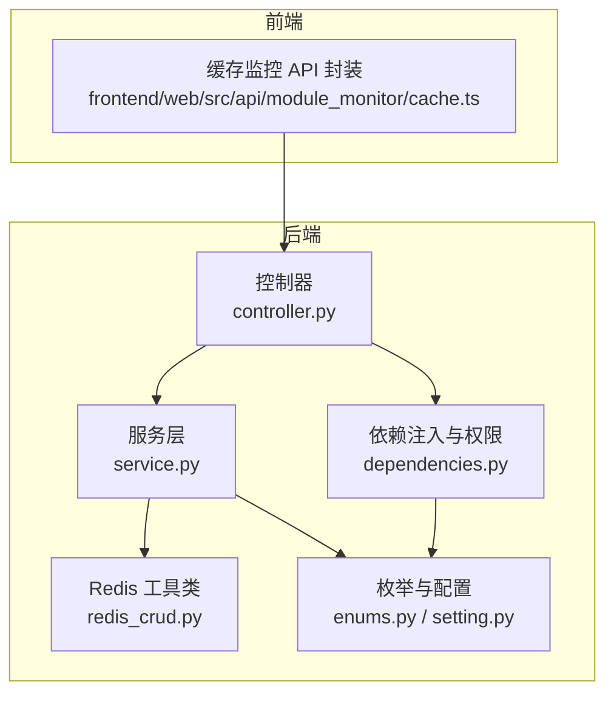
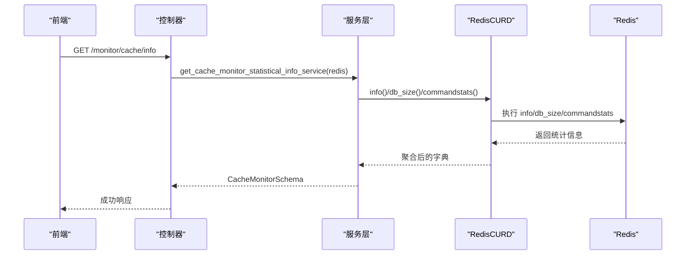
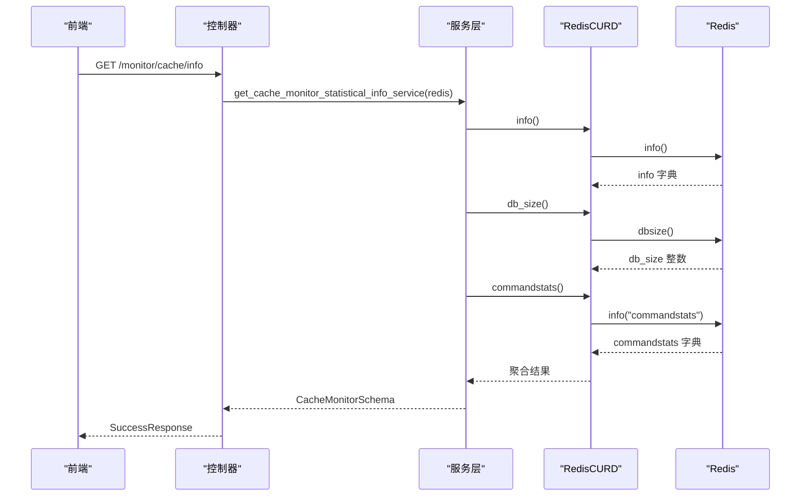
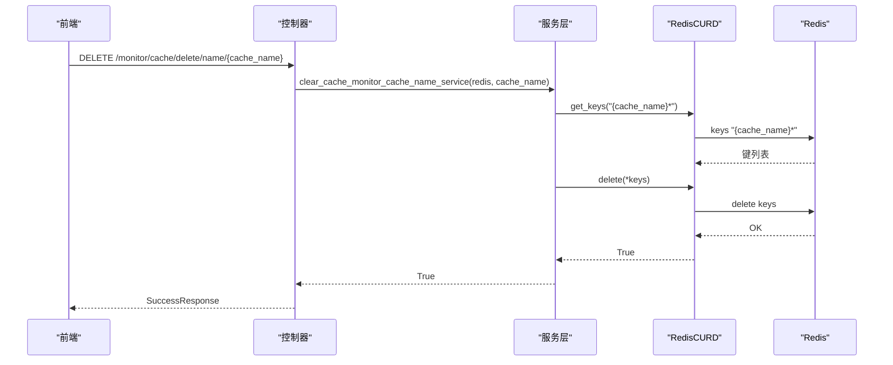
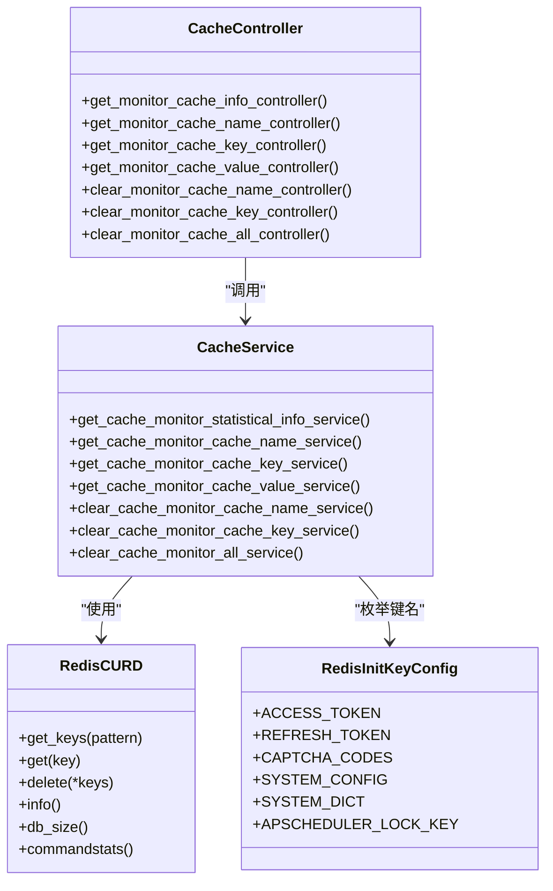

# 缓存监控 API

<cite>
**本文引用的文件**
- [controller.py](file://backend/app/api/v1/module_monitor/cache/controller.py)
- [service.py](file://backend/app/api/v1/module_monitor/cache/service.py)
- [schema.py](file://backend/app/api/v1/module_monitor/cache/schema.py)
- [redis_crud.py](file://backend/app/core/redis_crud.py)
- [enums.py](file://backend/app/common/enums.py)
- [dependencies.py](file://backend/app/core/dependencies.py)
- [setting.py](file://backend/app/config/setting.py)
- [cache.ts](file://frontend/web/src/api/module_monitor/cache.ts)
</cite>

## 目录
1. [简介](#简介)
2. [项目结构](#项目结构)
3. [核心组件](#核心组件)
4. [架构总览](#架构总览)
5. [详细组件分析](#详细组件分析)
6. [依赖关系分析](#依赖关系分析)
7. [性能考量](#性能考量)
8. [故障排查指南](#故障排查指南)
9. [结论](#结论)
10. [附录](#附录)

## 简介
本文件为缓存监控模块的 API 接口文档，覆盖以下能力：
- 获取缓存监控信息（Redis 命令统计、数据库大小、服务器信息）
- 获取缓存名称列表（系统内置键名枚举）
- 获取缓存键名列表（按命名空间前缀匹配）
- 查询缓存值（按命名空间与键名组合）
- 清理缓存（按命名空间、按键名模糊匹配、全量清理）

同时说明 Redis 数据采集方式、监控指标定义、数据更新频率、查询条件、请求/响应格式、分页与过滤、安全机制、批量删除策略、性能影响、异常处理、连接池管理与告警触发条件。

## 项目结构
后端采用 FastAPI + Redis 异步客户端，缓存监控模块位于 monitor/cache 子模块，遵循“控制器-服务-数据模型”的分层设计；前端通过统一请求封装调用后端接口。

**图表来源**
- [controller.py:1-197](file://backend/app/api/v1/module_monitor/cache/controller.py#L1-L197)
- [service.py:1-155](file://backend/app/api/v1/module_monitor/cache/service.py#L1-L155)
- [redis_crud.py:1-343](file://backend/app/core/redis_crud.py#L1-L343)
- [enums.py:42-74](file://backend/app/common/enums.py#L42-L74)
- [dependencies.py:32-42](file://backend/app/core/dependencies.py#L32-L42)
- [setting.py:305-312](file://backend/app/config/setting.py#L305-L312)
- [cache.ts:1-56](file://frontend/web/src/api/module_monitor/cache.ts#L1-L56)

**章节来源**
- [controller.py:1-197](file://backend/app/api/v1/module_monitor/cache/controller.py#L1-L197)
- [service.py:1-155](file://backend/app/api/v1/module_monitor/cache/service.py#L1-L155)
- [schema.py:1-25](file://backend/app/api/v1/module_monitor/cache/schema.py#L1-L25)
- [redis_crud.py:1-343](file://backend/app/core/redis_crud.py#L1-L343)
- [enums.py:42-74](file://backend/app/common/enums.py#L42-L74)
- [dependencies.py:32-42](file://backend/app/core/dependencies.py#L32-L42)
- [setting.py:305-312](file://backend/app/config/setting.py#L305-L312)
- [cache.ts:1-56](file://frontend/web/src/api/module_monitor/cache.ts#L1-L56)

## 核心组件
- 控制器层：定义各路由端点、鉴权依赖、响应封装与日志记录。
- 服务层：封装 Redis 读写与统计逻辑，负责数据聚合与转换。
- Redis 工具类：提供 keys/get/set/delete/info/db_size/commandstats 等常用操作与异常兜底。
- 枚举与配置：定义系统内置缓存键名枚举、Redis 连接配置。
- 依赖注入与权限：提供 Redis 连接注入、权限校验装饰器。
- 前端 API 封装：统一请求方法与类型定义。

**章节来源**
- [controller.py:1-197](file://backend/app/api/v1/module_monitor/cache/controller.py#L1-L197)
- [service.py:1-155](file://backend/app/api/v1/module_monitor/cache/service.py#L1-L155)
- [redis_crud.py:1-343](file://backend/app/core/redis_crud.py#L1-L343)
- [enums.py:42-74](file://backend/app/common/enums.py#L42-L74)
- [dependencies.py:32-42](file://backend/app/core/dependencies.py#L32-L42)
- [setting.py:305-312](file://backend/app/config/setting.py#L305-L312)
- [cache.ts:1-56](file://frontend/web/src/api/module_monitor/cache.ts#L1-L56)

## 架构总览
缓存监控 API 的典型调用链路如下：

**图表来源**
- [controller.py:19-40](file://backend/app/api/v1/module_monitor/cache/controller.py#L19-L40)
- [service.py:14-35](file://backend/app/api/v1/module_monitor/cache/service.py#L14-L35)
- [redis_crud.py:273-307](file://backend/app/core/redis_crud.py#L273-L307)

**章节来源**
- [controller.py:19-40](file://backend/app/api/v1/module_monitor/cache/controller.py#L19-L40)
- [service.py:14-35](file://backend/app/api/v1/module_monitor/cache/service.py#L14-L35)
- [redis_crud.py:273-307](file://backend/app/core/redis_crud.py#L273-L307)

## 详细组件分析

### 接口清单与说明

- 获取缓存监控信息
  - 方法与路径：GET /monitor/cache/info
  - 权限：module_monitor:cache:query
  - 输入：无
  - 输出：包含命令统计、数据库大小、服务器信息的对象
  - 采集方式：调用 Redis info、dbsize、commandstats
  - 更新频率：每次请求实时采集
  - 查询条件：无
  - 响应格式：SuccessResponse 包裹 CacheMonitorSchema
  - 安全机制：鉴权依赖 AuthPermission
  - 性能影响：info/commandstats 为轻量命令，但 commandstats 可能返回较大字典

- 获取缓存名称列表
  - 方法与路径：GET /monitor/cache/get/names
  - 权限：module_monitor:cache:query
  - 输入：无
  - 输出：系统内置键名列表（含备注说明）
  - 采集方式：遍历 RedisInitKeyConfig 枚举
  - 更新频率：随枚举定义变化
  - 查询条件：无
  - 响应格式：SuccessResponse 包裹 CacheInfoSchema 数组
  - 安全机制：鉴权依赖 AuthPermission
  - 性能影响：纯内存枚举，开销极低

- 获取缓存键名列表
  - 方法与路径：GET /monitor/cache/get/keys/{cache_name}
  - 权限：module_monitor:cache:query
  - 输入：cache_name（路径参数）
  - 输出：以 {cache_name}: 开头的键名列表（去除命名空间前缀）
  - 采集方式：Redis keys 模式匹配 + 前缀切分
  - 更新频率：实时
  - 查询条件：按命名空间前缀匹配
  - 响应格式：SuccessResponse 包裹 CacheInfoSchema 数组
  - 安全机制：鉴权依赖 AuthPermission
  - 性能影响：keys 命令可能阻塞，建议配合前缀规范与合理数量

- 获取缓存值
  - 方法与路径：GET /monitor/cache/get/value/{cache_name}/{cache_key}
  - 权限：module_monitor:cache:query
  - 输入：cache_name、cache_key（路径参数）
  - 输出：包含键名、命名空间、值与备注的对象
  - 采集方式：Redis get
  - 更新频率：实时
  - 查询条件：精确键名
  - 响应格式：SuccessResponse 包裹 CacheInfoSchema
  - 安全机制：鉴权依赖 AuthPermission
  - 性能影响：get 为轻量命令

- 清除指定缓存名称的所有缓存
  - 方法与路径：DELETE /monitor/cache/delete/name/{cache_name}
  - 权限：module_monitor:cache:delete
  - 输入：cache_name（路径参数）
  - 输出：布尔结果（成功/失败）
  - 采集方式：先 keys 匹配，再 delete 批量删除
  - 更新频率：即时
  - 查询条件：按命名空间前缀匹配
  - 响应格式：SuccessResponse 或 CustomException
  - 安全机制：鉴权依赖 AuthPermission；仅清理本系统命名空间内的键
  - 性能影响：批量删除可能阻塞，建议在低峰期执行

- 清除指定缓存键（模糊匹配）
  - 方法与路径：DELETE /monitor/cache/delete/key/{cache_key}
  - 权限：module_monitor:cache:delete
  - 输入：cache_key（路径参数）
  - 输出：布尔结果
  - 采集方式：先 keys 模式匹配（包含 cache_key），再 delete 批量删除
  - 更新频率：即时
  - 查询条件：键名包含 cache_key
  - 响应格式：SuccessResponse 或 CustomException
  - 安全机制：鉴权依赖 AuthPermission
  - 性能影响：模糊匹配可能返回大量键，谨慎使用

- 清除所有缓存
  - 方法与路径：DELETE /monitor/cache/delete/all
  - 权限：module_monitor:cache:delete
  - 输入：无
  - 输出：布尔结果
  - 采集方式：keys 全量匹配，再 delete 批量删除
  - 更新频率：即时
  - 查询条件：无
  - 响应格式：SuccessResponse 或 CustomException
  - 安全机制：鉴权依赖 AuthPermission；注意风险
  - 性能影响：全量删除，强烈建议谨慎使用

**章节来源**
- [controller.py:19-197](file://backend/app/api/v1/module_monitor/cache/controller.py#L19-L197)
- [service.py:14-155](file://backend/app/api/v1/module_monitor/cache/service.py#L14-L155)
- [schema.py:6-25](file://backend/app/api/v1/module_monitor/cache/schema.py#L6-L25)
- [enums.py:42-74](file://backend/app/common/enums.py#L42-L74)
- [redis_crud.py:32-46](file://backend/app/core/redis_crud.py#L32-L46)
- [dependencies.py:236-295](file://backend/app/core/dependencies.py#L236-L295)

### 数据模型与响应格式

- 缓存监控信息模型（CacheMonitorSchema）
  - 字段：command_stats（命令统计数组）、db_size（数据库键总数）、info（服务器信息字典）
  - 用途：对外统一返回监控统计

- 缓存对象信息模型（CacheInfoSchema）
  - 字段：cache_key（键名）、cache_name（命名空间）、cache_value（值）、remark（备注）
  - 用途：键列表与值查询的统一返回结构

- 前端类型定义
  - CacheMonitor、CommandStats、RedisInfo、CacheInfo、CacheForm
  - 与后端模型一一对应，确保前后端契约一致

**章节来源**
- [schema.py:6-25](file://backend/app/api/v1/module_monitor/cache/schema.py#L6-L25)
- [cache.ts:58-96](file://frontend/web/src/api/module_monitor/cache.ts#L58-L96)

### 处理流程与时序

- 获取监控信息时序

**图表来源**
- [controller.py:19-40](file://backend/app/api/v1/module_monitor/cache/controller.py#L19-L40)
- [service.py:14-35](file://backend/app/api/v1/module_monitor/cache/service.py#L14-L35)
- [redis_crud.py:273-307](file://backend/app/core/redis_crud.py#L273-L307)

- 清理命名空间键时序

**图表来源**
- [controller.py:117-142](file://backend/app/api/v1/module_monitor/cache/controller.py#L117-L142)
- [service.py:100-116](file://backend/app/api/v1/module_monitor/cache/service.py#L100-L116)
- [redis_crud.py:32-46](file://backend/app/core/redis_crud.py#L32-L46)
- [redis_crud.py:167-181](file://backend/app/core/redis_crud.py#L167-L181)

### 算法与复杂度

- 获取键名列表
  - 步骤：keys 模式匹配 → 过滤前缀 → 切分得到相对键名
  - 时间复杂度：O(N)（N 为匹配到的键数量）
  - 空间复杂度：O(M)（M 为返回键列表长度）
  - 风险：keys 可能阻塞，建议配合前缀规范与数量限制

- 清理键
  - 步骤：keys 模式匹配 → delete 批量删除
  - 时间复杂度：O(N)（N 为匹配到的键数量）
  - 空间复杂度：O(1)
  - 风险：批量删除可能阻塞，建议在低峰期执行

**章节来源**
- [service.py:57-74](file://backend/app/api/v1/module_monitor/cache/service.py#L57-L74)
- [redis_crud.py:32-46](file://backend/app/core/redis_crud.py#L32-L46)
- [redis_crud.py:167-181](file://backend/app/core/redis_crud.py#L167-L181)

## 依赖关系分析

**图表来源**
- [controller.py:1-197](file://backend/app/api/v1/module_monitor/cache/controller.py#L1-L197)
- [service.py:1-155](file://backend/app/api/v1/module_monitor/cache/service.py#L1-L155)
- [redis_crud.py:1-343](file://backend/app/core/redis_crud.py#L1-L343)
- [enums.py:42-74](file://backend/app/common/enums.py#L42-L74)

**章节来源**
- [controller.py:1-197](file://backend/app/api/v1/module_monitor/cache/controller.py#L1-L197)
- [service.py:1-155](file://backend/app/api/v1/module_monitor/cache/service.py#L1-L155)
- [redis_crud.py:1-343](file://backend/app/core/redis_crud.py#L1-L343)
- [enums.py:42-74](file://backend/app/common/enums.py#L42-L74)

## 性能考量
- Redis 连接池
  - 连接池大小与超时：由配置决定，健康检查间隔与最大连接数受控
  - 建议：根据并发与峰值 QPS 调整连接池大小，避免过度占用
- keys 命令
  - 高风险：可能阻塞 Redis，建议限制匹配范围与数量
  - 建议：使用前缀命名空间、定期维护键生命周期
- 批量删除
  - delete 批量删除可能造成阻塞，建议在低峰期执行
  - 建议：拆分批次、增加重试与熔断
- 命令统计
  - commandstats 返回较大字典，建议前端按需展示与分页

**章节来源**
- [setting.py:305-312](file://backend/app/config/setting.py#L305-L312)
- [redis_crud.py:32-46](file://backend/app/core/redis_crud.py#L32-L46)
- [redis_crud.py:167-181](file://backend/app/core/redis_crud.py#L167-L181)
- [service.py:14-35](file://backend/app/api/v1/module_monitor/cache/service.py#L14-L35)

## 故障排查指南
- 常见错误与处理
  - 未认证/权限不足：返回 401/403，检查权限标识与登录状态
  - Redis 连接失败：检查 REDIS_URI、连接池配置与网络连通性
  - keys 命令阻塞：优化键命名与匹配模式，避免全量扫描
  - 清理失败：确认返回布尔值与异常捕获，必要时重试
- 日志与追踪
  - 控制器与服务层均记录关键日志，便于定位问题
  - 建议开启更细粒度日志以辅助排查
- 前端调用
  - 使用统一请求封装，确保错误提示与状态码一致

**章节来源**
- [controller.py:10-14](file://backend/app/api/v1/module_monitor/cache/controller.py#L10-L14)
- [dependencies.py:236-295](file://backend/app/core/dependencies.py#L236-L295)
- [redis_crud.py:28-30](file://backend/app/core/redis_crud.py#L28-L30)
- [redis_crud.py:41-46](file://backend/app/core/redis_crud.py#L41-L46)
- [redis_crud.py:176-181](file://backend/app/core/redis_crud.py#L176-L181)
- [cache.ts:1-56](file://frontend/web/src/api/module_monitor/cache.ts#L1-L56)

## 结论
缓存监控模块提供了完整的 Redis 数据采集与清理能力，具备清晰的鉴权与安全机制。建议在生产环境中：
- 严格限制 keys 命令使用范围
- 在低峰期执行批量清理
- 合理配置连接池与超时参数
- 前端按需展示命令统计，避免渲染压力

## 附录

### 请求与响应示例（字段说明）
- 获取监控信息
  - 请求：GET /monitor/cache/info
  - 响应：SuccessResponse.data 为 CacheMonitorSchema
    - command_stats：数组，元素含 name、value
    - db_size：整数
    - info：字典，包含 redis_version、connected_clients、used_memory_human 等
- 获取缓存名称列表
  - 请求：GET /monitor/cache/get/names
  - 响应：SuccessResponse.data 为 CacheInfoSchema 数组
    - cache_name：命名空间
    - remark：说明
- 获取键名列表
  - 请求：GET /monitor/cache/get/keys/{cache_name}
  - 响应：SuccessResponse.data 为键名数组（去前缀）
- 获取缓存值
  - 请求：GET /monitor/cache/get/value/{cache_name}/{cache_key}
  - 响应：SuccessResponse.data 为 CacheInfoSchema
- 清理缓存
  - 请求：DELETE /monitor/cache/delete/name/{cache_name} 或 /delete/key/{cache_key} 或 /delete/all
  - 响应：SuccessResponse.data 为布尔值

**章节来源**
- [controller.py:19-197](file://backend/app/api/v1/module_monitor/cache/controller.py#L19-L197)
- [schema.py:6-25](file://backend/app/api/v1/module_monitor/cache/schema.py#L6-L25)
- [cache.ts:5-54](file://frontend/web/src/api/module_monitor/cache.ts#L5-L54)