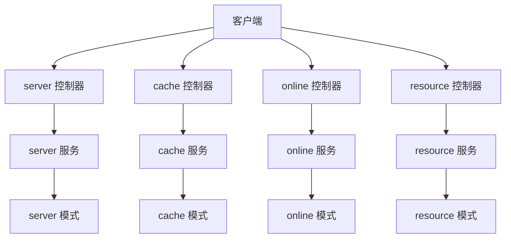
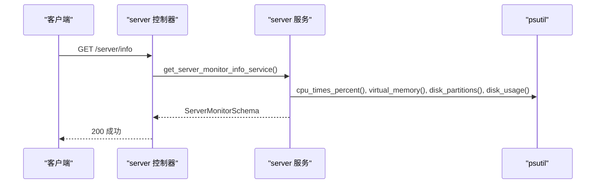
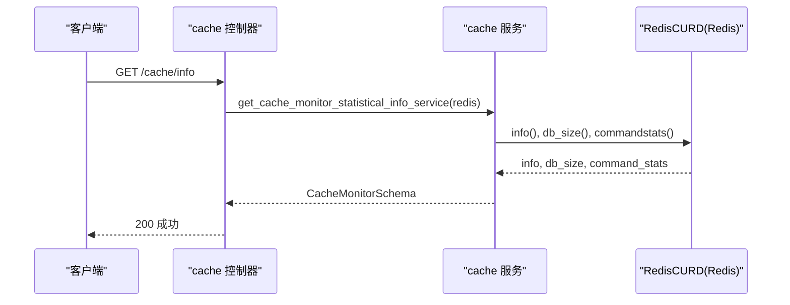
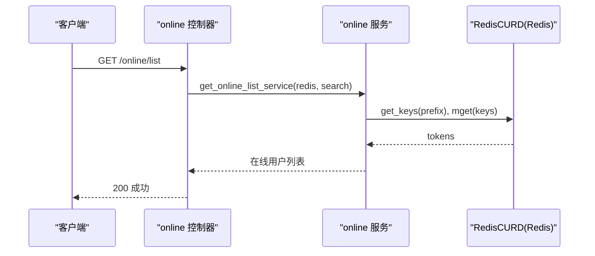
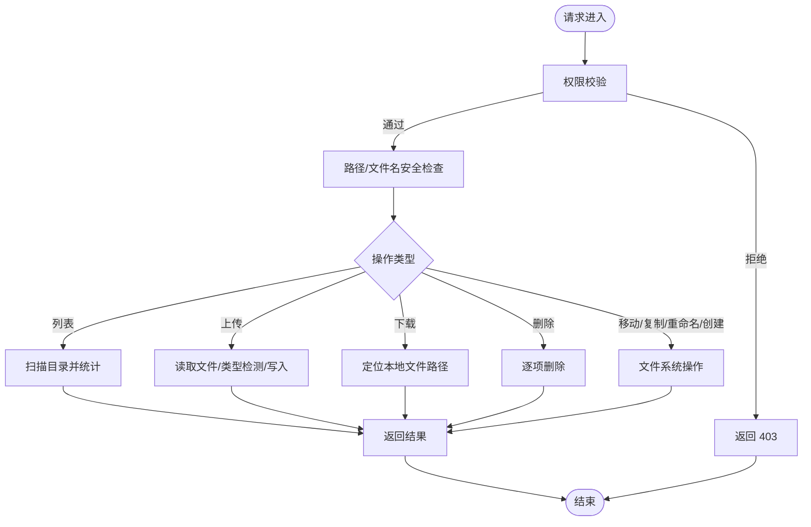
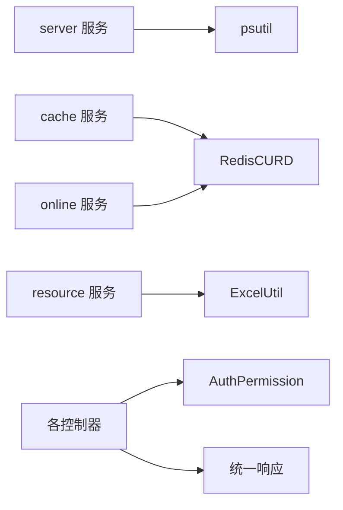

# 资源监控 API

<cite>
**本文引用的文件**
- [backend/app/api/v1/module_monitor/server/controller.py](file://backend/app/api/v1/module_monitor/server/controller.py)
- [backend/app/api/v1/module_monitor/server/service.py](file://backend/app/api/v1/module_monitor/server/service.py)
- [backend/app/api/v1/module_monitor/server/schema.py](file://backend/app/api/v1/module_monitor/server/schema.py)
- [backend/app/api/v1/module_monitor/cache/controller.py](file://backend/app/api/v1/module_monitor/cache/controller.py)
- [backend/app/api/v1/module_monitor/cache/service.py](file://backend/app/api/v1/module_monitor/cache/service.py)
- [backend/app/api/v1/module_monitor/cache/schema.py](file://backend/app/api/v1/module_monitor/cache/schema.py)
- [backend/app/api/v1/module_monitor/online/controller.py](file://backend/app/api/v1/module_monitor/online/controller.py)
- [backend/app/api/v1/module_monitor/online/service.py](file://backend/app/api/v1/module_monitor/online/service.py)
- [backend/app/api/v1/module_monitor/online/schema.py](file://backend/app/api/v1/module_monitor/online/schema.py)
- [backend/app/api/v1/module_monitor/resource/controller.py](file://backend/app/api/v1/module_monitor/resource/controller.py)
- [backend/app/api/v1/module_monitor/resource/service.py](file://backend/app/api/v1/module_monitor/resource/service.py)
- [backend/app/api/v1/module_monitor/resource/schema.py](file://backend/app/api/v1/module_monitor/resource/schema.py)
</cite>

## 目录
1. [简介](#简介)
2. [项目结构](#项目结构)
3. [核心组件](#核心组件)
4. [架构总览](#架构总览)
5. [详细组件分析](#详细组件分析)
6. [依赖分析](#依赖分析)
7. [性能考虑](#性能考虑)
8. [故障排查指南](#故障排查指南)
9. [结论](#结论)
10. [附录](#附录)

## 简介
本文件为“资源监控模块”的 API 接口文档，聚焦以下系统资源与运行状态的监控能力：
- 服务器资源：CPU 使用率、内存占用、磁盘空间、系统与 Python 运行信息
- 缓存监控：Redis 命令统计、数据库键数量、键名与值的查询与清理
- 在线用户：在线用户列表、按条件搜索、强制下线与清空
- 资源管理：静态资源目录浏览、上传、下载、删除、移动、复制、重命名、创建目录、导出列表

文档涵盖接口定义、请求/响应格式、数据模型、安全与权限控制、以及与现有代码实现的映射关系。

## 项目结构
资源监控模块位于后端 API 的 v1 版本下，按功能划分为四个子模块：
- server：服务器资源监控
- cache：缓存监控（Redis）
- online：在线用户监控
- resource：静态资源管理

```mermaid
graph TB
subgraph "监控模块"
S["server<br/>服务器监控"]
C["cache<br/>缓存监控"]
O["online<br/>在线用户"]
R["resource<br/>静态资源"]
end
S --> S_API["/server/info"]
C --> C_API1["/cache/info"]
C --> C_API2["/cache/get/names"]
C --> C_API3["/cache/get/keys/{cache_name}"]
C --> C_API4["/cache/get/value/{cache_name}/{cache_key}"]
C --> C_API5["/cache/delete/name/{cache_name}"]
C --> C_API6["/cache/delete/key/{cache_key}"]
C --> C_API7["/cache/delete/all"]
O --> O_API1["/online/list"]
O --> O_API2["/online/delete"]
O --> O_API3["/online/clear"]
R --> R_API1["/resource/list"]
R --> R_API2["/resource/upload"]
R --> R_API3["/resource/download"]
R --> R_API4["/resource/delete"]
R --> R_API5["/resource/move"]
R --> R_API6["/resource/copy"]
R --> R_API7["/resource/rename"]
R --> R_API8["/resource/create-dir"]
R --> R_API9["/resource/export"]
```

图表来源
- [backend/app/api/v1/module_monitor/server/controller.py:15-32](file://backend/app/api/v1/module_monitor/server/controller.py#L15-L32)
- [backend/app/api/v1/module_monitor/cache/controller.py:19-196](file://backend/app/api/v1/module_monitor/cache/controller.py#L19-L196)
- [backend/app/api/v1/module_monitor/online/controller.py:20-108](file://backend/app/api/v1/module_monitor/online/controller.py#L20-L108)
- [backend/app/api/v1/module_monitor/resource/controller.py:26-275](file://backend/app/api/v1/module_monitor/resource/controller.py#L26-L275)

章节来源
- [backend/app/api/v1/module_monitor/server/controller.py:12-32](file://backend/app/api/v1/module_monitor/server/controller.py#L12-L32)
- [backend/app/api/v1/module_monitor/cache/controller.py:16-196](file://backend/app/api/v1/module_monitor/cache/controller.py#L16-L196)
- [backend/app/api/v1/module_monitor/online/controller.py:17-108](file://backend/app/api/v1/module_monitor/online/controller.py#L17-L108)
- [backend/app/api/v1/module_monitor/resource/controller.py:23-275](file://backend/app/api/v1/module_monitor/resource/controller.py#L23-L275)

## 核心组件
- 服务器监控（server）：聚合 CPU、内存、系统、Python 进程、磁盘分区使用情况，统一返回结构体
- 缓存监控（cache）：提供 Redis 统计信息、键名枚举、键值读取、按名称/键清理
- 在线用户（online）：基于 Redis 的在线用户列表、模糊搜索、强制下线、清空
- 资源管理（resource）：静态资源目录浏览、上传/下载、删除、移动/复制/重命名、创建目录、导出列表

章节来源
- [backend/app/api/v1/module_monitor/server/service.py:24-37](file://backend/app/api/v1/module_monitor/server/service.py#L24-L37)
- [backend/app/api/v1/module_monitor/cache/service.py:15-35](file://backend/app/api/v1/module_monitor/cache/service.py#L15-L35)
- [backend/app/api/v1/module_monitor/online/service.py:17-49](file://backend/app/api/v1/module_monitor/online/service.py#L17-L49)
- [backend/app/api/v1/module_monitor/resource/service.py:339-410](file://backend/app/api/v1/module_monitor/resource/service.py#L339-L410)

## 架构总览
各模块均采用“控制器（controller）—服务（service）—模式（schema）”三层结构，控制器负责路由与鉴权，服务层封装业务逻辑与外部依赖（psutil、Redis、文件系统），模式层定义请求/响应的数据结构。

图表来源
- [backend/app/api/v1/module_monitor/server/controller.py:22-32](file://backend/app/api/v1/module_monitor/server/controller.py#L22-L32)
- [backend/app/api/v1/module_monitor/cache/controller.py:26-40](file://backend/app/api/v1/module_monitor/cache/controller.py#L26-L40)
- [backend/app/api/v1/module_monitor/online/controller.py:27-52](file://backend/app/api/v1/module_monitor/online/controller.py#L27-L52)
- [backend/app/api/v1/module_monitor/resource/controller.py:34-61](file://backend/app/api/v1/module_monitor/resource/controller.py#L34-L61)

## 详细组件分析

### 服务器监控（/server/info）
- 功能：一次性获取服务器 CPU、内存、系统、Python 运行、磁盘分区使用情况
- 请求
  - 方法：GET
  - 路径：/server/info
  - 权限：module_monitor:server:query
- 响应
  - 结构：包含 cpu、mem、sys、py、disks 字段的对象
  - 数据模型：见 ServerMonitorSchema/CpuInfoSchema/MemoryInfoSchema/SysInfoSchema/PyInfoSchema/DiskInfoSchema
- 采集方式与计算
  - CPU：psutil.cpu_times_percent() 用户/系统/空闲占比
  - 内存：psutil.virtual_memory() 总量/已用/剩余/使用率
  - 系统：主机名、IP、平台、架构、工作目录
  - Python：进程名、版本、启动时间、运行时长、进程内存、可用内存、内存使用率
  - 磁盘：遍历分区，psutil.disk_partitions()/disk_usage(mountpoint)
- 时间序列与趋势
  - 当前实现为即时快照；若需趋势分析，可在客户端侧定时轮询并自行构建时间序列

图表来源
- [backend/app/api/v1/module_monitor/server/controller.py:22-32](file://backend/app/api/v1/module_monitor/server/controller.py#L22-L32)
- [backend/app/api/v1/module_monitor/server/service.py:31-37](file://backend/app/api/v1/module_monitor/server/service.py#L31-L37)

章节来源
- [backend/app/api/v1/module_monitor/server/controller.py:15-32](file://backend/app/api/v1/module_monitor/server/controller.py#L15-L32)
- [backend/app/api/v1/module_monitor/server/service.py:24-146](file://backend/app/api/v1/module_monitor/server/service.py#L24-L146)
- [backend/app/api/v1/module_monitor/server/schema.py:68-78](file://backend/app/api/v1/module_monitor/server/schema.py#L68-L78)

### 缓存监控（Redis）
- 功能：获取 Redis 统计、键名列表、键值读取、按名称/键清理、清空全部
- 请求
  - GET /cache/info：权限 module_monitor:cache:query
  - GET /cache/get/names：权限 module_monitor:cache:query
  - GET /cache/get/keys/{cache_name}：权限 module_monitor:cache:query
  - GET /cache/get/value/{cache_name}/{cache_key}：权限 module_monitor:cache:query
  - DELETE /cache/delete/name/{cache_name}：权限 module_monitor:cache:delete
  - DELETE /cache/delete/key/{cache_key}：权限 module_monitor:cache:delete
  - DELETE /cache/delete/all：权限 module_monitor:cache:delete
- 响应
  - /cache/info：返回 command_stats、db_size、info
  - /cache/get/names：返回缓存名称清单（结合 RedisInitKeyConfig）
  - /cache/get/keys/{cache_name}：返回键名列表（按前缀匹配）
  - /cache/get/value/{cache_name}/{cache_key}：返回键值对象
  - 删除接口：返回布尔结果
- 采集与计算
  - 统计：RedisCURD.info()/db_size()/commandstats()
  - 键名：按前缀匹配与切分
  - 值：按键读取
- 历史与阈值
  - 当前接口为即时查询；可通过定时任务采集并入库实现历史与阈值告警

图表来源
- [backend/app/api/v1/module_monitor/cache/controller.py:26-40](file://backend/app/api/v1/module_monitor/cache/controller.py#L26-L40)
- [backend/app/api/v1/module_monitor/cache/service.py:15-35](file://backend/app/api/v1/module_monitor/cache/service.py#L15-L35)

章节来源
- [backend/app/api/v1/module_monitor/cache/controller.py:19-196](file://backend/app/api/v1/module_monitor/cache/controller.py#L19-L196)
- [backend/app/api/v1/module_monitor/cache/service.py:15-151](file://backend/app/api/v1/module_monitor/cache/service.py#L15-L151)
- [backend/app/api/v1/module_monitor/cache/schema.py:6-25](file://backend/app/api/v1/module_monitor/cache/schema.py#L6-L25)

### 在线用户（/online/*）
- 功能：在线用户列表、按名称/IP/登录地模糊搜索、强制下线、清空全部
- 请求
  - GET /online/list：分页 + 搜索参数，权限 module_monitor:online:query
  - DELETE /online/delete：Body 传 session_id，权限 module_monitor:online:delete
  - DELETE /online/clear：权限 module_monitor:online:delete
- 响应
  - 列表：分页后的在线用户数组（字段见 OnlineOutSchema）
  - 强制下线/清空：布尔结果
- 采集与计算
  - 从 Redis 读取 ACCESS_TOKEN/REFRESH_TOKEN 前缀键，解码 token 获取会话信息
  - 支持按 name/ipaddr/login_location 模糊匹配
- 历史与阈值
  - 可结合审计日志与定时任务记录在线峰值，设定阈值触发告警

图表来源
- [backend/app/api/v1/module_monitor/online/controller.py:27-52](file://backend/app/api/v1/module_monitor/online/controller.py#L27-L52)
- [backend/app/api/v1/module_monitor/online/service.py:17-49](file://backend/app/api/v1/module_monitor/online/service.py#L17-L49)

章节来源
- [backend/app/api/v1/module_monitor/online/controller.py:20-108](file://backend/app/api/v1/module_monitor/online/controller.py#L20-L108)
- [backend/app/api/v1/module_monitor/online/service.py:17-118](file://backend/app/api/v1/module_monitor/online/service.py#L17-L118)
- [backend/app/api/v1/module_monitor/online/schema.py:8-41](file://backend/app/api/v1/module_monitor/online/schema.py#L8-L41)

### 静态资源管理（/resource/*）
- 功能：目录列表、上传、下载、删除、移动、复制、重命名、创建目录、导出列表
- 请求
  - GET /resource/list：分页 + 搜索，权限 module_monitor:resource:query
  - POST /resource/upload：multipart/form-data，权限 module_monitor:resource:upload
  - GET /resource/download：权限 module_monitor:resource:download
  - DELETE /resource/delete：Body 路径数组，权限 module_monitor:resource:delete
  - POST /resource/move：权限 module_monitor:resource:move
  - POST /resource/copy：权限 module_monitor:resource:copy
  - POST /resource/rename：权限 module_monitor:resource:rename
  - POST /resource/create-dir：权限 module_monitor:resource:create_dir
  - POST /resource/export：权限 module_monitor:resource:export
- 响应
  - 列表：目录路径、名称、项数组、统计（文件数/目录数/总大小）
  - 上传/导出：上传结果或 Excel 流
  - 其他：成功/失败消息
- 安全与权限
  - 所有接口均受权限校验
  - 路径与文件名均进行严格的安全检查与清理，防止路径穿越
- 采集与计算
  - 列表：扫描目录，统计文件/目录/大小
  - 上传：大小限制、类型检测、重复名处理
  - 下载：返回本地文件路径供 FileResponse 使用
  - 导出：ExcelUtil 导出

图表来源
- [backend/app/api/v1/module_monitor/resource/controller.py:34-151](file://backend/app/api/v1/module_monitor/resource/controller.py#L34-L151)
- [backend/app/api/v1/module_monitor/resource/service.py:57-145](file://backend/app/api/v1/module_monitor/resource/service.py#L57-L145)

章节来源
- [backend/app/api/v1/module_monitor/resource/controller.py:26-275](file://backend/app/api/v1/module_monitor/resource/controller.py#L26-L275)
- [backend/app/api/v1/module_monitor/resource/service.py:339-727](file://backend/app/api/v1/module_monitor/resource/service.py#L339-L727)
- [backend/app/api/v1/module_monitor/resource/schema.py:16-204](file://backend/app/api/v1/module_monitor/resource/schema.py#L16-L204)

## 依赖分析
- 外部库
  - psutil：系统资源采集（CPU/内存/磁盘/分区）
  - redis(asyncio)：缓存监控与在线用户会话管理
  - ExcelUtil：资源列表导出
- 内部依赖
  - RedisCURD：Redis 读写封装
  - AuthPermission：权限校验
  - ResponseSchema/SuccessResponse/ErrorResponse：统一响应结构
  - PaginationService：分页工具
  - 日志与异常：log、CustomException

图表来源
- [backend/app/api/v1/module_monitor/server/service.py:1-17](file://backend/app/api/v1/module_monitor/server/service.py#L1-L17)
- [backend/app/api/v1/module_monitor/cache/service.py:1-6](file://backend/app/api/v1/module_monitor/cache/service.py#L1-L6)
- [backend/app/api/v1/module_monitor/online/service.py:1-8](file://backend/app/api/v1/module_monitor/online/service.py#L1-L8)
- [backend/app/api/v1/module_monitor/resource/service.py:10-16](file://backend/app/api/v1/module_monitor/resource/service.py#L10-L16)

章节来源
- [backend/app/api/v1/module_monitor/server/service.py:1-17](file://backend/app/api/v1/module_monitor/server/service.py#L1-L17)
- [backend/app/api/v1/module_monitor/cache/service.py:1-6](file://backend/app/api/v1/module_monitor/cache/service.py#L1-L6)
- [backend/app/api/v1/module_monitor/online/service.py:1-8](file://backend/app/api/v1/module_monitor/online/service.py#L1-L8)
- [backend/app/api/v1/module_monitor/resource/service.py:10-16](file://backend/app/api/v1/module_monitor/resource/service.py#L10-L16)

## 性能考虑
- 服务器监控
  - psutil 调用开销极低，适合高频轮询；建议客户端侧按秒级采集，服务端无需额外缓存
- 缓存监控
  - info/db_size/commandstats 为轻量查询；键名/键值读取受键数量影响，建议分页/分批处理
- 在线用户
  - 从 Redis 读取 token 并解码，复杂度与在线人数线性相关；建议分页与条件过滤
- 资源管理
  - 目录扫描与文件 I/O 受磁盘性能影响；上传/下载建议使用流式响应与断点续传（当前未实现）

## 故障排查指南
- 权限不足
  - 现象：返回 403
  - 处理：确认角色具备相应 module_monitor:* 权限
- 路径/文件名安全
  - 现象：非法路径、路径穿越、文件名攻击被阻断
  - 处理：检查输入是否包含 ..、\、/、%2e%2e 等危险字符
- 资源不存在/不可访问
  - 现象：目录不存在、路径不是目录、权限不足
  - 处理：确认路径正确且具有访问权限
- 上传失败
  - 现象：文件过大、类型不匹配、扩展名受限
  - 处理：调整文件大小与类型，或更换允许的扩展名
- Redis 相关
  - 现象：连接失败、键不存在、清理失败
  - 处理：检查 Redis 连接配置与键前缀

章节来源
- [backend/app/api/v1/module_monitor/resource/service.py:114-144](file://backend/app/api/v1/module_monitor/resource/service.py#L114-L144)
- [backend/app/api/v1/module_monitor/resource/service.py:658-697](file://backend/app/api/v1/module_monitor/resource/service.py#L658-L697)
- [backend/app/api/v1/module_monitor/cache/controller.py:136-142](file://backend/app/api/v1/module_monitor/cache/controller.py#L136-L142)
- [backend/app/api/v1/module_monitor/online/service.py:52-86](file://backend/app/api/v1/module_monitor/online/service.py#L52-L86)

## 结论
本模块提供了完善的系统资源与运行状态监控能力，覆盖服务器、缓存、在线用户与静态资源管理。当前接口均为即时查询，建议在生产环境中配合定时采集与历史存储，以支撑趋势分析、阈值告警与容量规划。

## 附录

### 接口一览与要点
- 服务器监控
  - GET /server/info：返回 CPU/内存/系统/Python/磁盘信息
- 缓存监控
  - GET /cache/info：Redis 统计
  - GET /cache/get/names：缓存名称清单
  - GET /cache/get/keys/{cache_name}：键名列表
  - GET /cache/get/value/{cache_name}/{cache_key}：键值
  - DELETE /cache/delete/name/{cache_name}：按名称清理
  - DELETE /cache/delete/key/{cache_key}：按键清理
  - DELETE /cache/delete/all：清空全部
- 在线用户
  - GET /online/list：分页 + 模糊搜索
  - DELETE /online/delete：强制下线
  - DELETE /online/clear：清空全部
- 资源管理
  - GET /resource/list：目录列表与统计
  - POST /resource/upload：上传文件
  - GET /resource/download：下载文件
  - DELETE /resource/delete：删除文件/目录
  - POST /resource/move：移动
  - POST /resource/copy：复制
  - POST /resource/rename：重命名
  - POST /resource/create-dir：创建目录
  - POST /resource/export：导出列表

章节来源
- [backend/app/api/v1/module_monitor/server/controller.py:15-32](file://backend/app/api/v1/module_monitor/server/controller.py#L15-L32)
- [backend/app/api/v1/module_monitor/cache/controller.py:19-196](file://backend/app/api/v1/module_monitor/cache/controller.py#L19-L196)
- [backend/app/api/v1/module_monitor/online/controller.py:20-108](file://backend/app/api/v1/module_monitor/online/controller.py#L20-L108)
- [backend/app/api/v1/module_monitor/resource/controller.py:26-275](file://backend/app/api/v1/module_monitor/resource/controller.py#L26-L275)