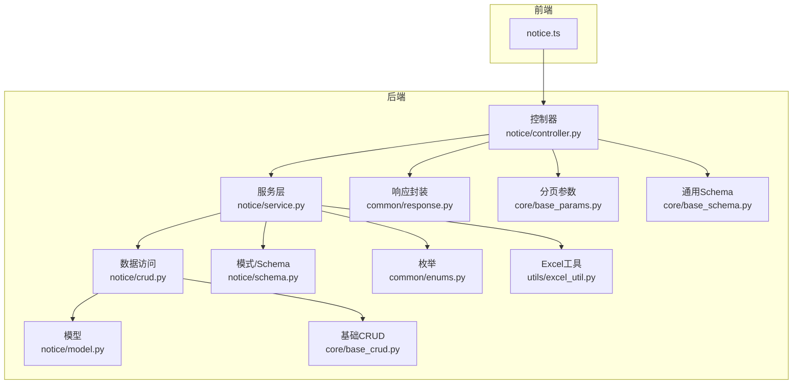
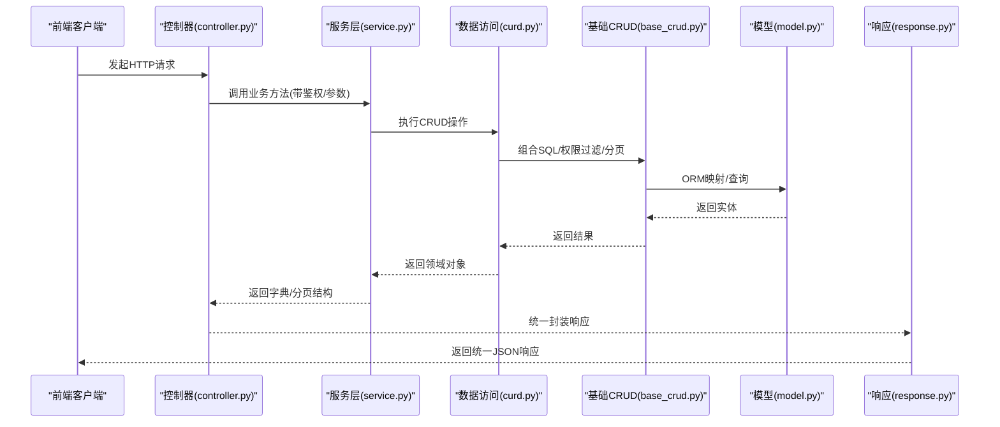
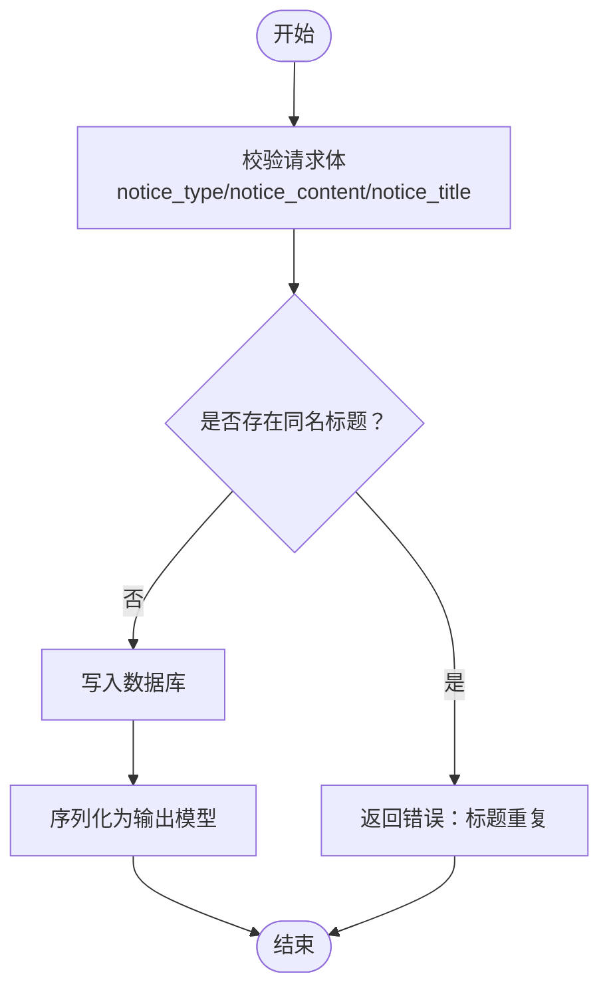
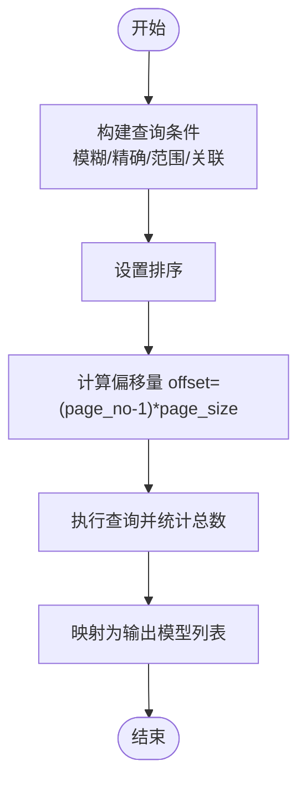
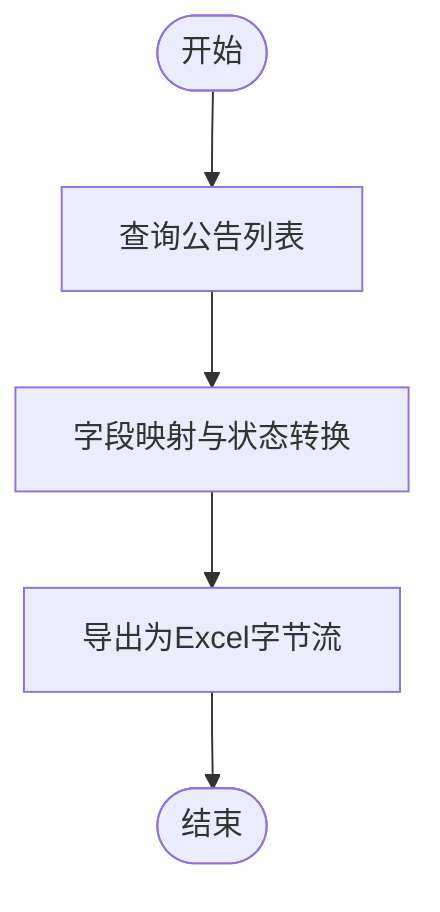
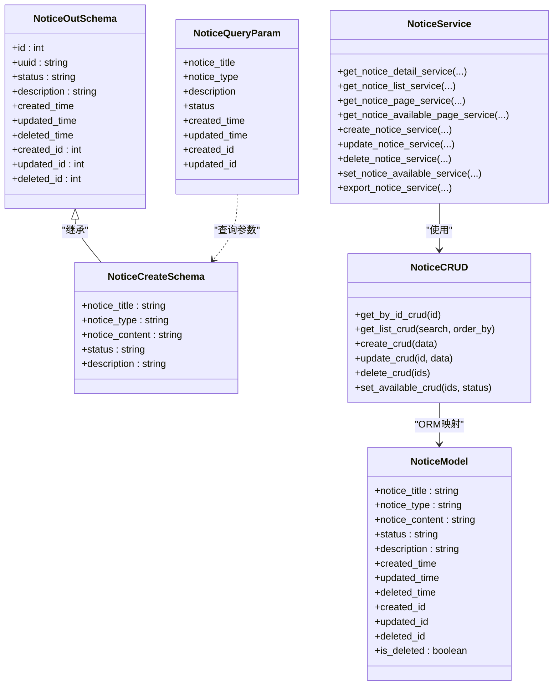
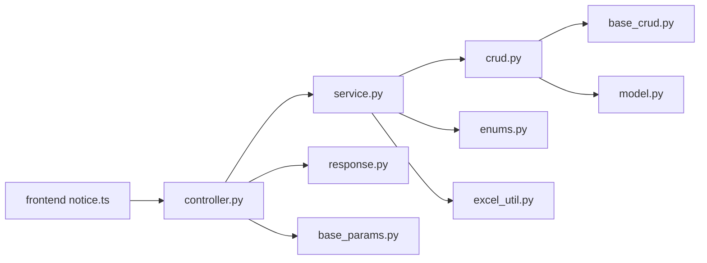

# 公告管理 API

<cite>
**本文引用的文件**
- [backend/app/api/v1/module_system/notice/controller.py](file://backend/app/api/v1/module_system/notice/controller.py)
- [backend/app/api/v1/module_system/notice/service.py](file://backend/app/api/v1/module_system/notice/service.py)
- [backend/app/api/v1/module_system/notice/crud.py](file://backend/app/api/v1/module_system/notice/crud.py)
- [backend/app/api/v1/module_system/notice/model.py](file://backend/app/api/v1/module_system/notice/model.py)
- [backend/app/api/v1/module_system/notice/schema.py](file://backend/app/api/v1/module_system/notice/schema.py)
- [backend/app/core/base_crud.py](file://backend/app/core/base_crud.py)
- [backend/app/common/response.py](file://backend/app/common/response.py)
- [backend/app/core/base_params.py](file://backend/app/core/base_params.py)
- [backend/app/core/base_schema.py](file://backend/app/core/base_schema.py)
- [backend/app/common/enums.py](file://backend/app/common/enums.py)
- [backend/app/utils/excel_util.py](file://backend/app/utils/excel_util.py)
- [frontend/web/src/api/module_system/notice.ts](file://frontend/web/src/api/module_system/notice.ts)
</cite>

## 目录
1. [简介](#简介)
2. [项目结构](#项目结构)
3. [核心组件](#核心组件)
4. [架构总览](#架构总览)
5. [详细组件分析](#详细组件分析)
6. [依赖分析](#依赖分析)
7. [性能考虑](#性能考虑)
8. [故障排查指南](#故障排查指南)
9. [结论](#结论)
10. [附录](#附录)

## 简介
本文件为“公告管理”模块的完整 API 接口文档，覆盖公告的创建、查询、更新、删除、批量状态变更、导出以及面向用户的“全局启用公告”查询能力。文档详细说明每个接口的 HTTP 方法、URL 路径、请求参数、响应格式与错误处理，并结合前端调用示例，帮助前后端协同对接。

## 项目结构
公告管理模块位于后端的系统模块目录下，采用典型的三层架构：控制器（controller）、服务（service）、数据访问（CRUD/Model/Schema）。前端通过统一的 notice API 模块发起请求。

图表来源
- [backend/app/api/v1/module_system/notice/controller.py:18-233](file://backend/app/api/v1/module_system/notice/controller.py#L18-L233)
- [backend/app/api/v1/module_system/notice/service.py:15-254](file://backend/app/api/v1/module_system/notice/service.py#L15-L254)
- [backend/app/api/v1/module_system/notice/crud.py:10-107](file://backend/app/api/v1/module_system/notice/crud.py#L10-L107)
- [backend/app/api/v1/module_system/notice/model.py:7-21](file://backend/app/api/v1/module_system/notice/model.py#L7-L21)
- [backend/app/api/v1/module_system/notice/schema.py:16-101](file://backend/app/api/v1/module_system/notice/schema.py#L16-L101)
- [backend/app/core/base_crud.py:26-571](file://backend/app/core/base_crud.py#L26-L571)
- [backend/app/common/response.py:26-176](file://backend/app/common/response.py#L26-L176)
- [backend/app/core/base_params.py:8-94](file://backend/app/core/base_params.py#L8-L94)
- [backend/app/core/base_schema.py:15-75](file://backend/app/core/base_schema.py#L15-L75)
- [backend/app/common/enums.py:94-109](file://backend/app/common/enums.py#L94-L109)
- [backend/app/utils/excel_util.py:94-111](file://backend/app/utils/excel_util.py#L94-L111)
- [frontend/web/src/api/module_system/notice.ts:1-96](file://frontend/web/src/api/module_system/notice.ts#L1-L96)

章节来源
- [backend/app/api/v1/module_system/notice/controller.py:18-233](file://backend/app/api/v1/module_system/notice/controller.py#L18-L233)
- [backend/app/api/v1/module_system/notice/service.py:15-254](file://backend/app/api/v1/module_system/notice/service.py#L15-L254)
- [backend/app/api/v1/module_system/notice/crud.py:10-107](file://backend/app/api/v1/module_system/notice/crud.py#L10-L107)
- [backend/app/api/v1/module_system/notice/model.py:7-21](file://backend/app/api/v1/module_system/notice/model.py#L7-L21)
- [backend/app/api/v1/module_system/notice/schema.py:16-101](file://backend/app/api/v1/module_system/notice/schema.py#L16-L101)
- [backend/app/core/base_crud.py:26-571](file://backend/app/core/base_crud.py#L26-L571)
- [backend/app/common/response.py:26-176](file://backend/app/common/response.py#L26-L176)
- [backend/app/core/base_params.py:8-94](file://backend/app/core/base_params.py#L8-L94)
- [backend/app/core/base_schema.py:15-75](file://backend/app/core/base_schema.py#L15-L75)
- [backend/app/common/enums.py:94-109](file://backend/app/common/enums.py#L94-L109)
- [backend/app/utils/excel_util.py:94-111](file://backend/app/utils/excel_util.py#L94-L111)
- [frontend/web/src/api/module_system/notice.ts:1-96](file://frontend/web/src/api/module_system/notice.ts#L1-L96)

## 核心组件
- 控制器：定义路由、鉴权与参数校验，调用服务层并返回统一响应。
- 服务层：封装业务逻辑，包括校验、去重、分页、导出等。
- CRUD 层：基于通用基础 CRUD 封装公告的增删改查与批量更新。
- 模型与 Schema：定义数据库表结构与请求/响应数据模型。
- 响应与参数：统一响应结构、分页参数、通用审计字段、枚举等。

章节来源
- [backend/app/api/v1/module_system/notice/controller.py:18-233](file://backend/app/api/v1/module_system/notice/controller.py#L18-L233)
- [backend/app/api/v1/module_system/notice/service.py:15-254](file://backend/app/api/v1/module_system/notice/service.py#L15-L254)
- [backend/app/api/v1/module_system/notice/crud.py:10-107](file://backend/app/api/v1/module_system/notice/crud.py#L10-L107)
- [backend/app/api/v1/module_system/notice/model.py:7-21](file://backend/app/api/v1/module_system/notice/model.py#L7-L21)
- [backend/app/api/v1/module_system/notice/schema.py:16-101](file://backend/app/api/v1/module_system/notice/schema.py#L16-L101)
- [backend/app/common/response.py:26-176](file://backend/app/common/response.py#L26-L176)
- [backend/app/core/base_params.py:8-94](file://backend/app/core/base_params.py#L8-L94)
- [backend/app/core/base_schema.py:15-75](file://backend/app/core/base_schema.py#L15-L75)
- [backend/app/common/enums.py:94-109](file://backend/app/common/enums.py#L94-L109)

## 架构总览
公告管理的调用链路如下：

图表来源
- [backend/app/api/v1/module_system/notice/controller.py:21-233](file://backend/app/api/v1/module_system/notice/controller.py#L21-L233)
- [backend/app/api/v1/module_system/notice/service.py:20-254](file://backend/app/api/v1/module_system/notice/service.py#L20-L254)
- [backend/app/api/v1/module_system/notice/crud.py:10-107](file://backend/app/api/v1/module_system/notice/crud.py#L10-L107)
- [backend/app/core/base_crud.py:26-571](file://backend/app/core/base_crud.py#L26-L571)
- [backend/app/api/v1/module_system/notice/model.py:7-21](file://backend/app/api/v1/module_system/notice/model.py#L7-L21)
- [backend/app/common/response.py:26-176](file://backend/app/common/response.py#L26-L176)

## 详细组件分析

### 公告管理 API 定义
以下为公告管理模块提供的全部接口清单，包含 HTTP 方法、URL 路径、请求参数、响应格式与典型错误码说明。

- 获取公告详情
  - 方法：GET
  - 路径：/notice/detail/{id}
  - 路径参数：
    - id：公告ID（整数）
  - 权限：module_system:notice:detail
  - 请求示例（来自前端）：GET /system/notice/detail/123
  - 响应：统一响应结构，data 为公告详情对象
  - 错误码：401/403（权限不足）、404（资源不存在）

- 查询公告列表（分页）
  - 方法：GET
  - 路径：/notice/list
  - 查询参数（分页+筛选）：
    - page_no：当前页码（>=1）
    - page_size：每页数量（1~100）
    - order_by：排序字段数组（JSON 字符串，如 [{"updated_time":"desc"}]）
    - notice_title：公告标题（模糊匹配）
    - notice_type：公告类型（精确匹配，1=通知，2=公告）
    - description：描述（模糊匹配）
    - status：状态（精确匹配）
    - created_time：创建时间范围（两个时间元素）
    - updated_time：更新时间范围（两个时间元素）
    - created_id：创建人ID（精确匹配）
    - updated_id：更新人ID（精确匹配）
  - 权限：module_system:notice:query
  - 响应：统一响应结构，data 为分页对象（page_no/page_size/total/items）
  - 错误码：400（参数非法）、401/403（权限不足）

- 创建公告
  - 方法：POST
  - 路径：/notice/create
  - 请求体：
    - notice_title：公告标题（必填，长度限制见 schema）
    - notice_type：公告类型（必填，仅允许 1 或 2）
    - notice_content：公告内容（必填）
    - status：是否启用（默认 0 启用，1 禁用）
    - description：描述（可选）
  - 权限：module_system:notice:create
  - 响应：统一响应结构，data 为刚创建的公告对象
  - 错误码：400（校验失败/标题重复）、401/403（权限不足）

- 修改公告
  - 方法：PUT
  - 路径：/notice/update/{id}
  - 路径参数：
    - id：公告ID（整数）
  - 请求体：同创建（NoticeCreateSchema）
  - 权限：module_system:notice:update
  - 响应：统一响应结构，data 为更新后的公告对象
  - 错误码：400（校验失败/不存在/标题重复）、401/403（权限不足）

- 删除公告
  - 方法：DELETE
  - 路径：/notice/delete
  - 请求体：数组 ids（公告ID列表）
  - 权限：module_system:notice:delete
  - 响应：统一响应结构（无 data）
  - 错误码：400（ids为空/某ID不存在）、401/403（权限不足）

- 批量修改公告状态
  - 方法：PATCH
  - 路径：/notice/available/setting
  - 请求体：
    - ids：ID列表
    - status：目标状态（如 0 启用，1 禁用）
  - 权限：module_system:notice:patch
  - 响应：统一响应结构（无 data）
  - 错误码：400（ids为空/状态非法）、401/403（权限不足）

- 导出公告
  - 方法：POST
  - 路径：/notice/export
  - 请求体：查询参数（与 /notice/list 相同）
  - 响应：application/vnd.openxmlformats-officedocument.spreadsheetml.sheet（Excel 文件流）
  - 错误码：400（参数非法）、401/403（权限不足）

- 获取全局启用公告
  - 方法：GET
  - 路径：/notice/available
  - 请求：无需鉴权（但需登录）
  - 响应：统一响应结构，data 为分页对象（固定每页 10 条，按ID升序）
  - 用途：门户/首页展示“全局启用”的公告

章节来源
- [backend/app/api/v1/module_system/notice/controller.py:21-233](file://backend/app/api/v1/module_system/notice/controller.py#L21-L233)
- [backend/app/api/v1/module_system/notice/schema.py:56-101](file://backend/app/api/v1/module_system/notice/schema.py#L56-L101)
- [backend/app/core/base_params.py:8-42](file://backend/app/core/base_params.py#L8-L42)
- [frontend/web/src/api/module_system/notice.ts:1-96](file://frontend/web/src/api/module_system/notice.ts#L1-L96)

### 数据模型与字段说明
- 表：sys_notice
- 字段：
  - notice_title：公告标题（字符串，非空）
  - notice_type：公告类型（字符串，1=通知，2=公告）
  - notice_content：公告内容（文本，可空）
  - status：状态（字符串，0=启用，1=禁用）
  - description：描述（字符串，可空）
  - created_time/updated_time/deleted_time：创建/更新/删除时间
  - created_id/updated_id/deleted_id：创建/更新/删除人ID
  - is_deleted：软删除标记

章节来源
- [backend/app/api/v1/module_system/notice/model.py:7-21](file://backend/app/api/v1/module_system/notice/model.py#L7-L21)
- [backend/app/core/base_schema.py:15-28](file://backend/app/core/base_schema.py#L15-L28)

### 请求与响应模型
- 请求模型：
  - NoticeCreateSchema：创建/更新时使用
  - NoticeQueryParam：查询参数（支持模糊/精确/范围/关联字段）
- 响应模型：
  - NoticeOutSchema：对外输出（继承基础审计字段与用户信息）
- 统一响应：
  - ResponseSchema：包含 code/msg/data/status_code/success
  - SuccessResponse/ErrorResponse：便捷响应封装

章节来源
- [backend/app/api/v1/module_system/notice/schema.py:16-101](file://backend/app/api/v1/module_system/notice/schema.py#L16-L101)
- [backend/app/core/base_schema.py:15-41](file://backend/app/core/base_schema.py#L15-L41)
- [backend/app/common/response.py:26-102](file://backend/app/common/response.py#L26-L102)

### 业务流程图：创建公告

图表来源
- [backend/app/api/v1/module_system/notice/service.py:128-147](file://backend/app/api/v1/module_system/notice/service.py#L128-L147)
- [backend/app/api/v1/module_system/notice/schema.py:16-44](file://backend/app/api/v1/module_system/notice/schema.py#L16-L44)

### 业务流程图：分页查询

图表来源
- [backend/app/api/v1/module_system/notice/service.py:78-107](file://backend/app/api/v1/module_system/notice/service.py#L78-L107)
- [backend/app/core/base_crud.py:151-214](file://backend/app/core/base_crud.py#L151-L214)

### 业务流程图：导出公告

图表来源
- [backend/app/api/v1/module_system/notice/service.py:216-254](file://backend/app/api/v1/module_system/notice/service.py#L216-L254)
- [backend/app/utils/excel_util.py:94-111](file://backend/app/utils/excel_util.py#L94-L111)

### 类关系图：公告模块核心类

图表来源
- [backend/app/api/v1/module_system/notice/model.py:7-21](file://backend/app/api/v1/module_system/notice/model.py#L7-L21)
- [backend/app/api/v1/module_system/notice/schema.py:16-101](file://backend/app/api/v1/module_system/notice/schema.py#L16-L101)
- [backend/app/api/v1/module_system/notice/crud.py:10-107](file://backend/app/api/v1/module_system/notice/crud.py#L10-L107)
- [backend/app/api/v1/module_system/notice/service.py:15-254](file://backend/app/api/v1/module_system/notice/service.py#L15-L254)

## 依赖分析
- 控制器依赖：
  - 依赖认证与权限：AuthPermission、get_current_user
  - 依赖分页参数：PaginationQueryParam
  - 依赖查询参数：NoticeQueryParam
  - 依赖统一响应：ResponseSchema/SuccessResponse
- 服务层依赖：
  - 依赖 NoticeCRUD
  - 依赖枚举：QueueEnum（查询条件构造）
  - 依赖 ExcelUtil（导出）
- CRUD 层依赖：
  - 依赖基础 CRUDBase，实现分页、权限过滤、软删除、批量更新等
- 前端依赖：
  - 通过 notice.ts 统一调用后端接口

图表来源
- [backend/app/api/v1/module_system/notice/controller.py:1-233](file://backend/app/api/v1/module_system/notice/controller.py#L1-L233)
- [backend/app/api/v1/module_system/notice/service.py:1-254](file://backend/app/api/v1/module_system/notice/service.py#L1-L254)
- [backend/app/api/v1/module_system/notice/crud.py:1-107](file://backend/app/api/v1/module_system/notice/crud.py#L1-L107)
- [backend/app/core/base_crud.py:1-571](file://backend/app/core/base_crud.py#L1-L571)
- [backend/app/common/response.py:1-176](file://backend/app/common/response.py#L1-L176)
- [backend/app/core/base_params.py:1-94](file://backend/app/core/base_params.py#L1-L94)
- [backend/app/common/enums.py:94-109](file://backend/app/common/enums.py#L94-L109)
- [backend/app/utils/excel_util.py:1-111](file://backend/app/utils/excel_util.py#L1-L111)
- [frontend/web/src/api/module_system/notice.ts:1-96](file://frontend/web/src/api/module_system/notice.ts#L1-L96)

章节来源
- [backend/app/api/v1/module_system/notice/controller.py:1-233](file://backend/app/api/v1/module_system/notice/controller.py#L1-L233)
- [backend/app/api/v1/module_system/notice/service.py:1-254](file://backend/app/api/v1/module_system/notice/service.py#L1-L254)
- [backend/app/api/v1/module_system/notice/crud.py:1-107](file://backend/app/api/v1/module_system/notice/crud.py#L1-L107)
- [backend/app/core/base_crud.py:1-571](file://backend/app/core/base_crud.py#L1-L571)
- [backend/app/common/response.py:1-176](file://backend/app/common/response.py#L1-L176)
- [backend/app/core/base_params.py:1-94](file://backend/app/core/base_params.py#L1-L94)
- [backend/app/common/enums.py:94-109](file://backend/app/common/enums.py#L94-L109)
- [backend/app/utils/excel_util.py:1-111](file://backend/app/utils/excel_util.py#L1-L111)
- [frontend/web/src/api/module_system/notice.ts:1-96](file://frontend/web/src/api/module_system/notice.ts#L1-L96)

## 性能考虑
- 分页查询：
  - 使用主键计数优化（优先使用主键列计数，避免全表扫描）
  - 支持自定义 order_by，建议在高频查询字段上建立索引
- 权限过滤：
  - 自动注入软删除与数据权限过滤，避免越权与全表扫描
- 导出：
  - 使用 pandas/openpyxl 导出，注意大数据量时内存占用；建议分批或异步导出
- 并发与一致性：
  - 更新流程包含二次验证，防止并发修改导致的权限逃逸

章节来源
- [backend/app/core/base_crud.py:186-214](file://backend/app/core/base_crud.py#L186-L214)
- [backend/app/core/base_crud.py:284-291](file://backend/app/core/base_crud.py#L284-L291)

## 故障排查指南
- 常见错误与定位
  - 400 参数错误：检查 NoticeCreateSchema/NoticeQueryParam 的字段约束与格式
  - 400 标题重复：创建/更新时 notice_title 重复
  - 400 删除对象为空：ids 数组为空或包含不存在的ID
  - 403 权限不足：确认用户具备对应模块权限（如 module_system:notice:*）
  - 500 服务异常：查看服务层日志，关注 CustomException 抛出点
- 建议排查步骤
  - 核对前端传参与后端 schema 是否一致
  - 检查 NoticeQueryParam 的时间范围与状态枚举
  - 确认分页 order_by 格式（JSON 字符串）
  - 导出失败时检查 ExcelUtil 的映射与数据完整性

章节来源
- [backend/app/api/v1/module_system/notice/service.py:128-197](file://backend/app/api/v1/module_system/notice/service.py#L128-L197)
- [backend/app/api/v1/module_system/notice/schema.py:16-44](file://backend/app/api/v1/module_system/notice/schema.py#L16-L44)
- [backend/app/common/response.py:70-102](file://backend/app/common/response.py#L70-L102)

## 结论
公告管理模块提供了完善的公告生命周期管理能力，接口设计遵循统一响应规范，具备良好的扩展性与安全性。通过权限过滤与软删除机制，确保数据安全与审计可追溯。建议在生产环境中配合索引与缓存策略进一步提升查询性能，并对大体量导出任务采用异步处理。

## 附录

### 前端调用示例（来自 notice.ts）
- 列表查询：GET /system/notice/list
- 可用公告：GET /system/notice/available
- 详情：GET /system/notice/detail/:id
- 创建：POST /system/notice/create
- 更新：PUT /system/notice/update/:id
- 删除：DELETE /system/notice/delete
- 批量状态：PATCH /system/notice/available/setting
- 导出：POST /system/notice/export

章节来源
- [frontend/web/src/api/module_system/notice.ts:1-96](file://frontend/web/src/api/module_system/notice.ts#L1-L96)