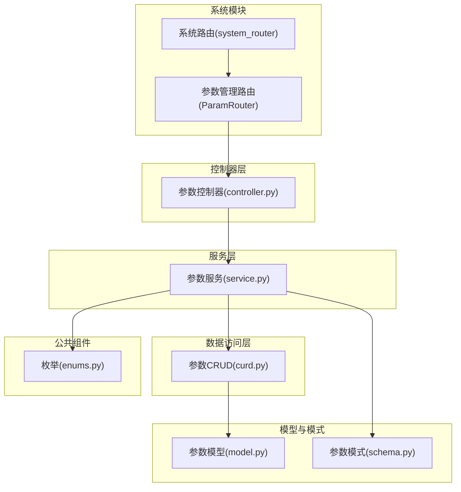
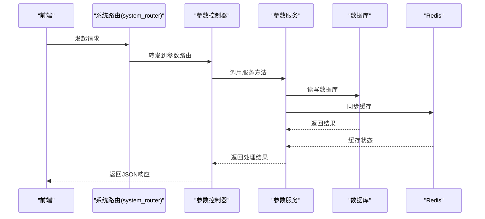
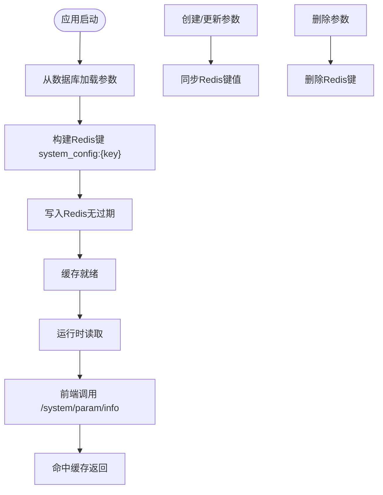

# 参数管理 API

<cite>
**本文引用的文件**
- [controller.py](file://backend/app/api/v1/module_system/params/controller.py)
- [service.py](file://backend/app/api/v1/module_system/params/service.py)
- [crud.py](file://backend/app/api/v1/module_system/params/crud.py)
- [model.py](file://backend/app/api/v1/module_system/params/model.py)
- [schema.py](file://backend/app/api/v1/module_system/params/schema.py)
- [enums.py](file://backend/app/common/enums.py)
- [__init__.py](file://backend/app/api/v1/module_system/__init__.py)
- [params.ts](file://frontend/web/src/api/module_system/params.ts)
- [sys_menu.json](file://backend/app/scripts/data/sys_menu.json)
</cite>

## 目录
1. [简介](#简介)
2. [项目结构](#项目结构)
3. [核心组件](#核心组件)
4. [架构总览](#架构总览)
5. [详细接口文档](#详细接口文档)
6. [依赖与权限](#依赖与权限)
7. [参数缓存机制与配置生效策略](#参数缓存机制与配置生效策略)
8. [性能与扩展性](#性能与扩展性)
9. [故障排查](#故障排查)
10. [结论](#结论)

## 简介
本文件为“参数管理”模块的完整 API 文档，覆盖系统参数配置、参数分类管理、参数值管理等能力。内容包括：
- 参数列表查询、参数详情、参数创建、参数更新、参数删除、参数启用/禁用
- 参数缓存机制、运行时参数更新与配置生效策略
- 完整的接口清单、请求参数、响应格式与错误码说明
- 实际使用场景与最佳实践建议

## 项目结构
参数管理模块位于后端系统模块中，采用标准的分层架构：
- 控制器层：定义路由与对外接口
- 服务层：封装业务逻辑与缓存同步
- 数据访问层：基于通用 CRUD 封装实现数据库操作
- 模型层：SQLAlchemy ORM 映射
- 模式层：Pydantic 输入/输出校验
- 枚举与常量：Redis 键命名规范与权限标识

图表来源
- [__init__.py:17-29](file://backend/app/api/v1/module_system/__init__.py#L17-L29)
- [controller.py:18-288](file://backend/app/api/v1/module_system/params/controller.py#L18-L288)
- [service.py:25-457](file://backend/app/api/v1/module_system/params/service.py#L25-L457)
- [crud.py:10-109](file://backend/app/api/v1/module_system/params/crud.py#L10-L109)
- [model.py:7-25](file://backend/app/api/v1/module_system/params/model.py#L7-L25)
- [schema.py:9-79](file://backend/app/api/v1/module_system/params/schema.py#L9-L79)
- [enums.py:42-73](file://backend/app/common/enums.py#L42-L73)

章节来源
- [__init__.py:17-29](file://backend/app/api/v1/module_system/__init__.py#L17-L29)
- [controller.py:18-288](file://backend/app/api/v1/module_system/params/controller.py#L18-L288)
- [service.py:25-457](file://backend/app/api/v1/module_system/params/service.py#L25-L457)
- [crud.py:10-109](file://backend/app/api/v1/module_system/params/crud.py#L10-L109)
- [model.py:7-25](file://backend/app/api/v1/module_system/params/model.py#L7-L25)
- [schema.py:9-79](file://backend/app/api/v1/module_system/params/schema.py#L9-L79)
- [enums.py:42-73](file://backend/app/common/enums.py#L42-L73)

## 核心组件
- 路由与控制器：定义参数管理的所有对外接口，包含查询、创建、更新、删除、导出、上传、初始化缓存等。
- 服务层：负责业务规则、权限校验、Redis 缓存同步、Excel 导出、文件上传等。
- CRUD 层：基于通用基类实现增删改查与分页。
- 模型与模式：ORM 映射与 Pydantic 校验。
- 枚举与常量：Redis 键命名规范、权限标识、查询操作符等。

章节来源
- [controller.py:18-288](file://backend/app/api/v1/module_system/params/controller.py#L18-L288)
- [service.py:25-457](file://backend/app/api/v1/module_system/params/service.py#L25-L457)
- [crud.py:10-109](file://backend/app/api/v1/module_system/params/crud.py#L10-L109)
- [model.py:7-25](file://backend/app/api/v1/module_system/params/model.py#L7-L25)
- [schema.py:9-79](file://backend/app/api/v1/module_system/params/schema.py#L9-L79)
- [enums.py:42-73](file://backend/app/common/enums.py#L42-L73)

## 架构总览
参数管理的调用链路如下：
- 前端通过系统模块下的参数路由发起请求
- 控制器进行权限校验与参数解析
- 服务层执行业务逻辑并同步 Redis 缓存
- CRUD 层访问数据库
- 模式层进行输入/输出校验

图表来源
- [__init__.py:17-29](file://backend/app/api/v1/module_system/__init__.py#L17-L29)
- [controller.py:18-288](file://backend/app/api/v1/module_system/params/controller.py#L18-L288)
- [service.py:25-457](file://backend/app/api/v1/module_system/params/service.py#L25-L457)
- [crud.py:10-109](file://backend/app/api/v1/module_system/params/crud.py#L10-L109)
- [enums.py:42-73](file://backend/app/common/enums.py#L42-L73)

## 详细接口文档

### 路由前缀与标签
- 前缀：/system/param
- 标签：参数管理

章节来源
- [controller.py:18-288](file://backend/app/api/v1/module_system/params/controller.py#L18-L288)
- [__init__.py:17-29](file://backend/app/api/v1/module_system/__init__.py#L17-L29)

### 1. 获取参数详情
- 方法：GET
- 路径：/system/param/detail/{id}
- 权限：module_system:param:detail
- 路径参数
  - id：参数ID（整数）
- 响应
  - data：参数详情对象（见“返回模型”）
  - msg：成功提示
- 错误
  - 404：参数不存在
  - 403：权限不足

章节来源
- [controller.py:21-43](file://backend/app/api/v1/module_system/params/controller.py#L21-L43)
- [service.py:30-43](file://backend/app/api/v1/module_system/params/service.py#L30-L43)
- [sys_menu.json:726-745](file://backend/app/scripts/data/sys_menu.json#L726-L745)

### 2. 根据配置键获取参数详情
- 方法：GET
- 路径：/system/param/key/{config_key}
- 权限：module_system:param:query
- 路径参数
  - config_key：配置键（字符串）
- 响应
  - data：参数详情对象
  - msg：成功提示
- 错误
  - 404：配置键不存在
  - 403：权限不足

章节来源
- [controller.py:46-68](file://backend/app/api/v1/module_system/params/controller.py#L46-L68)
- [service.py:46-60](file://backend/app/api/v1/module_system/params/service.py#L46-L60)
- [sys_menu.json:746-754](file://backend/app/scripts/data/sys_menu.json#L746-L754)

### 3. 根据配置键获取参数值
- 方法：GET
- 路径：/system/param/value/{config_key}
- 权限：module_system:param:query
- 路径参数
  - config_key：配置键（字符串）
- 响应
  - data：参数值（字符串或空）
  - msg：成功提示
- 错误
  - 404：配置键不存在
  - 403：权限不足

章节来源
- [controller.py:71-95](file://backend/app/api/v1/module_system/params/controller.py#L71-L95)
- [service.py:63-77](file://backend/app/api/v1/module_system/params/service.py#L63-L77)
- [sys_menu.json:746-754](file://backend/app/scripts/data/sys_menu.json#L746-L754)

### 4. 获取参数列表（分页）
- 方法：GET
- 路径：/system/param/list
- 权限：module_system:param:query
- 查询参数
  - page_no：页码（整数，默认从1开始）
  - page_size：每页大小（整数）
  - order_by：排序字段列表（如 [{"id":"asc"}]）
  - config_name：参数名称（模糊匹配）
  - config_key：参数键名（模糊匹配）
  - config_type：是否系统内置（布尔）
  - description：描述（模糊匹配）
  - status：状态（精确匹配）
  - created_time：创建时间范围（数组，两个时间点）
  - updated_time：更新时间范围（数组，两个时间点）
- 响应
  - data：分页结果（包含列表与总数）
  - msg：成功提示
- 错误
  - 403：权限不足

章节来源
- [controller.py:98-128](file://backend/app/api/v1/module_system/params/controller.py#L98-L128)
- [service.py:107-135](file://backend/app/api/v1/module_system/params/service.py#L107-L135)
- [schema.py:40-79](file://backend/app/api/v1/module_system/params/schema.py#L40-L79)
- [sys_menu.json:746-754](file://backend/app/scripts/data/sys_menu.json#L746-L754)

### 5. 创建参数
- 方法：POST
- 路径：/system/param/create
- 权限：module_system:param:create
- 请求体
  - config_name：参数名称（字符串，最大长度64）
  - config_key：参数键名（字符串，小写字母/数字/_.-，以小写字母开头）
  - config_value：参数键值（字符串或空）
  - config_type：是否系统内置（布尔，默认False）
  - status：状态（字符串，默认"0"）
  - description：描述（字符串，最大长度500）
- 响应
  - data：新创建的参数对象
  - msg：成功提示
- 错误
  - 400：键名非法或重复
  - 403：权限不足
  - 500：缓存同步失败

章节来源
- [controller.py:131-155](file://backend/app/api/v1/module_system/params/controller.py#L131-L155)
- [service.py:138-174](file://backend/app/api/v1/module_system/params/service.py#L138-L174)
- [schema.py:9-28](file://backend/app/api/v1/module_system/params/schema.py#L9-L28)
- [sys_menu.json:626-644](file://backend/app/scripts/data/sys_menu.json#L626-L644)

### 6. 修改参数
- 方法：PUT
- 路径：/system/param/update/{id}
- 权限：module_system:param:update
- 路径参数
  - id：参数ID（整数）
- 请求体
  - config_name：参数名称（字符串）
  - config_key：参数键名（字符串，不可变更）
  - config_value：参数键值（字符串或空）
  - config_type：是否系统内置（布尔）
  - status：状态（字符串）
  - description：描述（字符串）
- 响应
  - data：更新后的参数对象
  - msg：成功提示
- 错误
  - 400：键名非法、键名被修改或不存在
  - 403：权限不足
  - 500：缓存同步失败

章节来源
- [controller.py:158-184](file://backend/app/api/v1/module_system/params/controller.py#L158-L184)
- [service.py:177-221](file://backend/app/api/v1/module_system/params/service.py#L177-L221)
- [schema.py:30-33](file://backend/app/api/v1/module_system/params/schema.py#L30-L33)
- [sys_menu.json:646-664](file://backend/app/scripts/data/sys_menu.json#L646-L664)

### 7. 删除参数
- 方法：DELETE
- 路径：/system/param/delete
- 权限：module_system:param:delete
- 请求体
  - ids：参数ID列表（整数数组）
- 响应
  - msg：成功提示
- 错误
  - 400：删除对象为空、参数不存在、系统内置参数不可删除
  - 403：权限不足
  - 500：缓存删除失败

章节来源
- [controller.py:187-211](file://backend/app/api/v1/module_system/params/controller.py#L187-L211)
- [service.py:224-262](file://backend/app/api/v1/module_system/params/service.py#L224-L262)
- [sys_menu.json:666-684](file://backend/app/scripts/data/sys_menu.json#L666-L684)

### 8. 导出参数
- 方法：POST
- 路径：/system/param/export
- 权限：module_system:param:export
- 请求体
  - 支持与列表查询相同的查询参数（config_name、config_key、config_type、description、status、created_time、updated_time）
- 响应
  - 流式响应：Excel 文件（application/vnd.openxmlformats-officedocument.spreadsheetml.sheet）
- 错误
  - 403：权限不足

章节来源
- [controller.py:214-242](file://backend/app/api/v1/module_system/params/controller.py#L214-L242)
- [service.py:265-299](file://backend/app/api/v1/module_system/params/service.py#L265-L299)
- [sys_menu.json:686-704](file://backend/app/scripts/data/sys_menu.json#L686-L704)

### 9. 上传文件
- 方法：POST
- 路径：/system/param/upload
- 权限：module_system:param:upload
- 请求体
  - file：文件（multipart/form-data）
- 响应
  - data：上传结果（文件名、路径、URL等）
  - msg：成功提示
- 错误
  - 500：上传失败

章节来源
- [controller.py:245-264](file://backend/app/api/v1/module_system/params/controller.py#L245-L264)
- [service.py:302-320](file://backend/app/api/v1/module_system/params/service.py#L302-L320)
- [sys_menu.json:706-724](file://backend/app/scripts/data/sys_menu.json#L706-L724)

### 10. 获取初始化缓存参数
- 方法：GET
- 路径：/system/param/info
- 权限：无需认证（用于启动时拉取）
- 响应
  - data：系统配置列表（从 Redis 中批量读取）
  - msg：成功提示
- 错误
  - 500：解析配置失败

章节来源
- [controller.py:267-287](file://backend/app/api/v1/module_system/params/controller.py#L267-L287)
- [service.py:361-384](file://backend/app/api/v1/module_system/params/service.py#L361-L384)
- [params.ts:15-23](file://frontend/web/src/api/module_system/params.ts#L15-L23)

## 依赖与权限
- 权限标识
  - module_system:param:create：创建参数
  - module_system:param:update：修改参数
  - module_system:param:delete：删除参数
  - module_system:param:export：导出参数
  - module_system:param:upload：上传文件
  - module_system:param:detail：参数详情
  - module_system:param:query：查询参数
- Redis 键命名
  - system_config：系统配置键前缀
  - 示例：system_config:{config_key}

章节来源
- [sys_menu.json:626-754](file://backend/app/scripts/data/sys_menu.json#L626-L754)
- [enums.py:42-73](file://backend/app/common/enums.py#L42-L73)
- [service.py:160-166](file://backend/app/api/v1/module_system/params/service.py#L160-L166)

## 参数缓存机制与配置生效策略
- 缓存键空间
  - Redis 键前缀：system_config
  - 单个参数键：system_config:{config_key}
- 生命周期
  - 默认不过期（expire=None），由服务层在创建/更新/删除时显式维护
- 初始化流程
  - 应用启动时，服务层从数据库加载所有参数并写入 Redis
  - 前端在未认证状态下可直接调用 /system/param/info 拉取缓存参数
- 运行时更新策略
  - 创建/更新：写入 Redis 并保持与数据库一致
  - 删除：从 Redis 删除对应键
- 中间件配置读取
  - 服务层提供专用方法批量读取演示模式、IP 白名单、API 白名单、IP 黑名单等关键配置

图表来源
- [service.py:323-358](file://backend/app/api/v1/module_system/params/service.py#L323-L358)
- [service.py:361-384](file://backend/app/api/v1/module_system/params/service.py#L361-L384)
- [service.py:138-174](file://backend/app/api/v1/module_system/params/service.py#L138-L174)
- [service.py:177-221](file://backend/app/api/v1/module_system/params/service.py#L177-L221)
- [service.py:224-262](file://backend/app/api/v1/module_system/params/service.py#L224-L262)
- [params.ts:15-23](file://frontend/web/src/api/module_system/params.ts#L15-L23)

## 性能与扩展性
- 列表查询支持分页与多字段排序，适合大数据量场景
- Redis 缓存用于高频读取，减少数据库压力
- 批量读取中间件所需配置，降低多次网络往返
- 建议
  - 对频繁读取的参数键建立合理的缓存策略
  - 对大字段（如 config_value）注意内存占用
  - 使用白名单/黑名单等配置时，建议集中管理并定期校验

[本节为通用性能建议，不涉及具体文件分析]

## 故障排查
- 常见错误与定位
  - 400：键名非法（需符合小写字母开头且仅包含小写字母/数字/_.-）
  - 400：键名重复（创建时）
  - 400：键名被修改（更新时）
  - 400：系统内置参数不可删除
  - 404：参数不存在（详情/键查询）
  - 500：缓存同步失败（创建/更新/删除）
- 排查步骤
  - 检查 Redis 连接与键空间
  - 核对权限标识是否正确
  - 查看服务层日志中的错误堆栈
  - 确认数据库连接与事务提交

章节来源
- [service.py:152-154](file://backend/app/api/v1/module_system/params/service.py#L152-L154)
- [service.py:195-196](file://backend/app/api/v1/module_system/params/service.py#L195-L196)
- [service.py:243-247](file://backend/app/api/v1/module_system/params/service.py#L243-L247)
- [service.py:167-169](file://backend/app/api/v1/module_system/params/service.py#L167-L169)
- [service.py:214-216](file://backend/app/api/v1/module_system/params/service.py#L214-L216)
- [service.py:260-262](file://backend/app/api/v1/module_system/params/service.py#L260-L262)

## 结论
参数管理模块提供了完善的参数配置、查询、导入导出与缓存同步能力，结合权限控制与中间件配置读取，满足生产环境对配置管理的高可用需求。建议在实际使用中：
- 规范化参数键命名与用途
- 通过缓存与分页优化查询性能
- 严格控制权限与审计日志
- 定期备份与校验配置数据