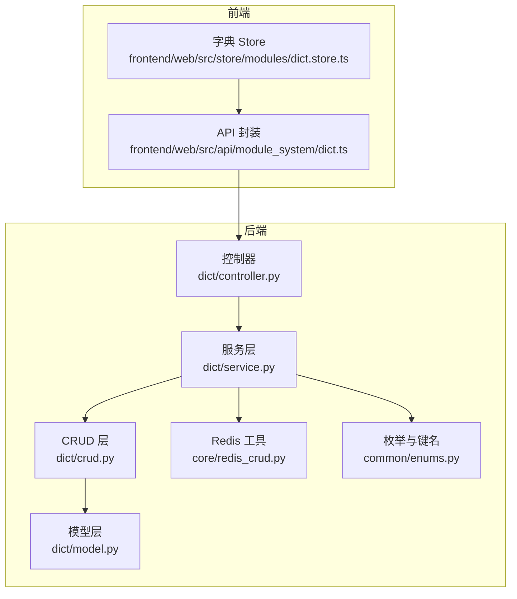
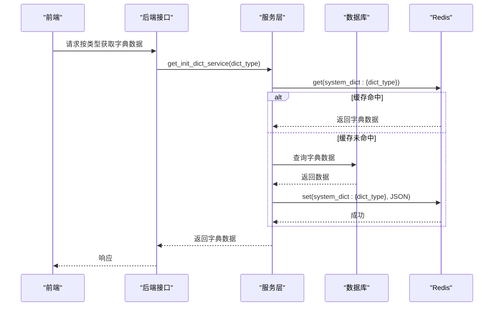
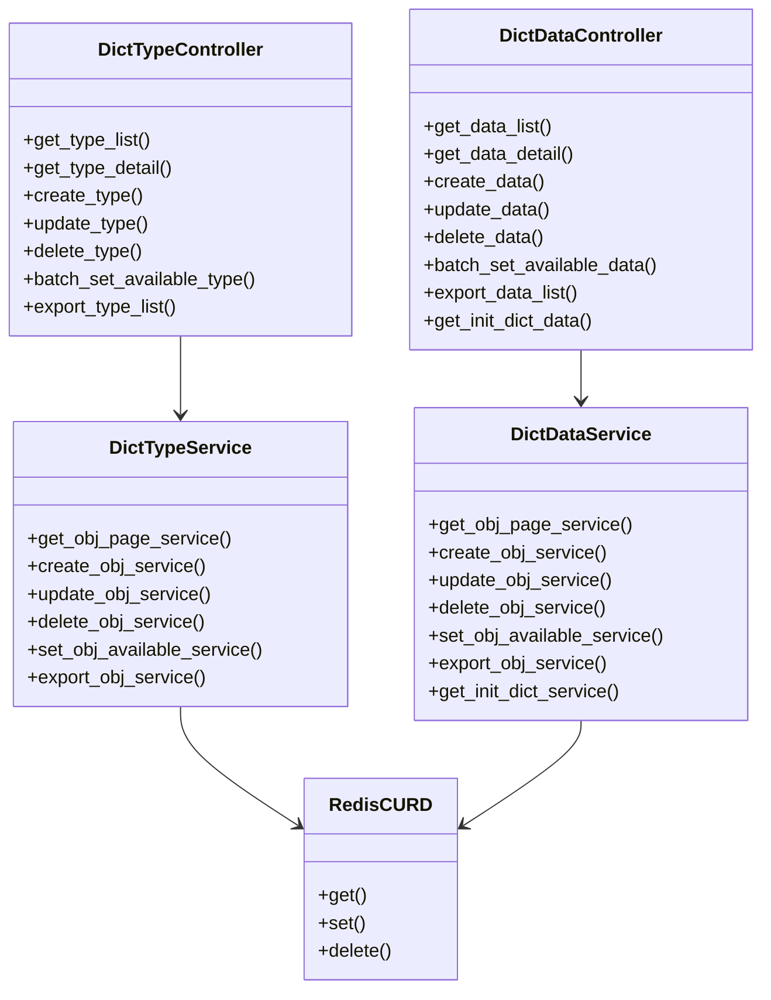
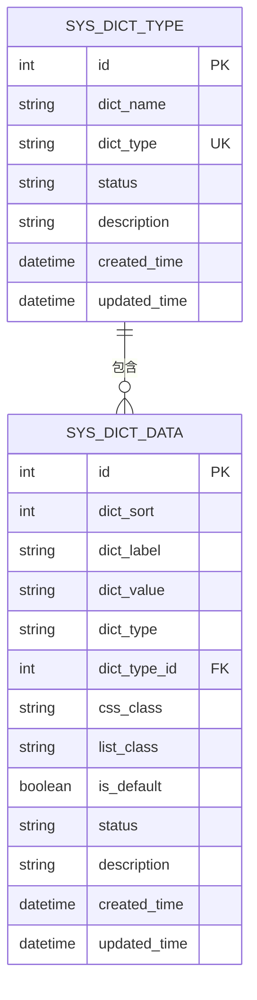
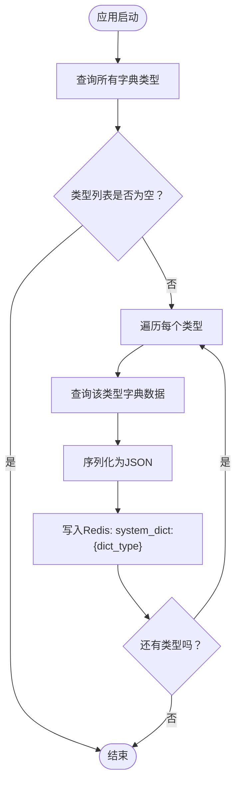

# 字典管理 API

<cite>
**本文引用的文件**
- [controller.py](file://backend/app/api/v1/module_system/dict/controller.py)
- [schema.py](file://backend/app/api/v1/module_system/dict/schema.py)
- [model.py](file://backend/app/api/v1/module_system/dict/model.py)
- [service.py](file://backend/app/api/v1/module_system/dict/service.py)
- [crud.py](file://backend/app/api/v1/module_system/dict/crud.py)
- [enums.py](file://backend/app/common/enums.py)
- [redis_crud.py](file://backend/app/core/redis_crud.py)
- [dict.ts](file://frontend/web/src/api/module_system/dict.ts)
- [dict.store.ts](file://frontend/web/src/store/modules/dict.store.ts)
</cite>

## 目录
1. [简介](#简介)
2. [项目结构](#项目结构)
3. [核心组件](#核心组件)
4. [架构总览](#架构总览)
5. [详细组件分析](#详细组件分析)
6. [依赖分析](#依赖分析)
7. [性能考虑](#性能考虑)
8. [故障排查指南](#故障排查指南)
9. [结论](#结论)
10. [附录](#附录)

## 简介
本文件为“字典管理”模块的完整 API 接口文档，覆盖字典类型与字典数据的全生命周期管理，包括：
- 字典类型：列表/详情/创建/更新/删除/批量启停/导出/选项列表
- 字典数据：列表/详情/创建/更新/删除/批量启停/导出/按类型获取
- 数据字典查询：按类型获取初始化字典数据，支持前端下拉框与业务配置管理
- 缓存机制：基于 Redis 的字典数据缓存与失效策略

文档提供每个接口的 HTTP 方法、URL 路径、请求参数、响应格式与错误码说明，并给出典型使用场景与最佳实践。

## 项目结构
后端采用分层架构：API 控制器 → 服务层 → CRUD 数据层 → SQLAlchemy 模型；前端通过 API 封装与 Pinia Store 实现字典数据的本地缓存与按需加载。

图表来源
- [controller.py:28-529](file://backend/app/api/v1/module_system/dict/controller.py#L28-L529)
- [service.py:27-723](file://backend/app/api/v1/module_system/dict/service.py#L27-L723)
- [crud.py:14-286](file://backend/app/api/v1/module_system/dict/crud.py#L14-L286)
- [model.py:7-67](file://backend/app/api/v1/module_system/dict/model.py#L7-L67)
- [redis_crud.py:9-343](file://backend/app/core/redis_crud.py#L9-L343)
- [enums.py:42-74](file://backend/app/common/enums.py#L42-L74)
- [dict.ts:1-183](file://frontend/web/src/api/module_system/dict.ts#L1-L183)
- [dict.store.ts:1-152](file://frontend/web/src/store/modules/dict.store.ts#L1-L152)

章节来源
- [controller.py:28-529](file://backend/app/api/v1/module_system/dict/controller.py#L28-L529)
- [service.py:27-723](file://backend/app/api/v1/module_system/dict/service.py#L27-L723)
- [crud.py:14-286](file://backend/app/api/v1/module_system/dict/crud.py#L14-L286)
- [model.py:7-67](file://backend/app/api/v1/module_system/dict/model.py#L7-L67)
- [enums.py:42-74](file://backend/app/common/enums.py#L42-L74)
- [redis_crud.py:9-343](file://backend/app/core/redis_crud.py#L9-L343)
- [dict.ts:1-183](file://frontend/web/src/api/module_system/dict.ts#L1-L183)
- [dict.store.ts:1-152](file://frontend/web/src/store/modules/dict.store.ts#L1-L152)

## 核心组件
- 控制器层：定义路由、鉴权与参数校验，调用服务层执行业务逻辑。
- 服务层：封装业务规则、Redis 缓存同步、Excel 导出、初始化加载。
- CRUD 层：基于通用基类实现字典类型/数据的增删改查与分页。
- 模型层：SQLAlchemy 映射，定义字段与关系。
- 枚举与键名：统一 Redis 键命名规范。
- 前端 API 封装：对后端接口进行封装，便于页面调用。
- 前端 Store：本地缓存字典数据，减少重复请求，支持批量获取与标签查找。

章节来源
- [controller.py:28-529](file://backend/app/api/v1/module_system/dict/controller.py#L28-L529)
- [service.py:27-723](file://backend/app/api/v1/module_system/dict/service.py#L27-L723)
- [crud.py:14-286](file://backend/app/api/v1/module_system/dict/crud.py#L14-L286)
- [model.py:7-67](file://backend/app/api/v1/module_system/dict/model.py#L7-L67)
- [enums.py:42-74](file://backend/app/common/enums.py#L42-L74)
- [dict.ts:1-183](file://frontend/web/src/api/module_system/dict.ts#L1-L183)
- [dict.store.ts:1-152](file://frontend/web/src/store/modules/dict.store.ts#L1-L152)

## 架构总览
字典管理遵循“控制器-服务-数据层-模型”的分层设计，Redis 作为缓存层贯穿创建/更新/删除流程，保证前端下拉框与业务配置的实时一致性。

图表来源
- [service.py:424-466](file://backend/app/api/v1/module_system/dict/service.py#L424-L466)
- [redis_crud.py:48-96](file://backend/app/core/redis_crud.py#L48-L96)
- [enums.py:42-49](file://backend/app/common/enums.py#L42-L49)

章节来源
- [service.py:376-466](file://backend/app/api/v1/module_system/dict/service.py#L376-L466)
- [redis_crud.py:48-96](file://backend/app/core/redis_crud.py#L48-L96)
- [enums.py:42-49](file://backend/app/common/enums.py#L42-L49)

## 详细组件分析

### 字典类型接口
- 列表查询
  - 方法与路径：GET /dict/type/list
  - 权限：module_system:dict_type:query
  - 请求参数：分页参数 + 查询参数（字典名称、字典类型、状态、创建/更新时间范围）
  - 响应：分页结果（包含字典类型列表）
  - 错误码：见“故障排查指南”
- 详情查询
  - 方法与路径：GET /dict/type/detail/{id}
  - 权限：module_system:dict_type:detail
  - 请求参数：路径参数 id（字典类型ID）
  - 响应：字典类型详情
- 选项列表（全部字典类型）
  - 方法与路径：GET /dict/type/optionselect
  - 权限：module_system:dict_type:query
  - 请求参数：无
  - 响应：全部字典类型列表
- 创建
  - 方法与路径：POST /dict/type/create
  - 权限：module_system:dict_type:create
  - 请求体：字典类型创建模型（名称、类型、状态、描述）
  - 响应：创建后的字典类型详情
  - 说明：创建后会在 Redis 中写入占位键，便于后续初始化
- 更新
  - 方法与路径：PUT /dict/type/update/{id}
  - 权限：module_system:dict_type:update
  - 请求体：字典类型更新模型
  - 响应：更新后的字典类型详情
  - 说明：若类型或状态变更，会联动更新对应字典数据并刷新 Redis 缓存
- 删除
  - 方法与路径：DELETE /dict/type/delete
  - 权限：module_system:dict_type:delete
  - 请求体：ID 列表
  - 响应：无
  - 说明：若类型下存在字典数据则禁止删除；删除成功后清理对应 Redis 缓存
- 批量启停
  - 方法与路径：PATCH /dict/type/available/setting
  - 权限：module_system:dict_type:patch
  - 请求体：批量设置模型（ID 列表 + 状态）
  - 响应：无
- 导出
  - 方法与路径：POST /dict/type/export
  - 权限：module_system:dict_type:export
  - 请求体：查询参数
  - 响应：Excel 文件流
- 校验规则
  - 字典类型名称：必填，去除首尾空格
  - 字典类型：必填，小写字母开头，仅允许小写字母/数字/下划线

章节来源
- [controller.py:31-273](file://backend/app/api/v1/module_system/dict/controller.py#L31-L273)
- [schema.py:17-110](file://backend/app/api/v1/module_system/dict/schema.py#L17-L110)
- [service.py:102-298](file://backend/app/api/v1/module_system/dict/service.py#L102-L298)
- [crud.py:14-132](file://backend/app/api/v1/module_system/dict/crud.py#L14-L132)

### 字典数据接口
- 列表查询
  - 方法与路径：GET /dict/data/list
  - 权限：module_system:dict_data:query
  - 请求参数：分页参数 + 查询参数（标签、类型、类型ID、状态、创建/更新时间范围）
  - 响应：分页结果（包含字典数据列表）
- 详情查询
  - 方法与路径：GET /dict/data/detail/{id}
  - 权限：module_system:dict_data:detail
  - 请求参数：路径参数 id（字典数据ID）
  - 响应：字典数据详情
- 创建
  - 方法与路径：POST /dict/data/create
  - 权限：module_system:dict_data:create
  - 请求体：字典数据创建模型（排序、标签、键值、类型、类型ID、样式、是否默认、状态、描述）
  - 响应：创建后的字典数据详情
  - 说明：同类型下标签/键值唯一；创建后刷新对应类型 Redis 缓存
- 更新
  - 方法与路径：PUT /dict/data/update/{id}
  - 权限：module_system:dict_data:update
  - 请求体：字典数据更新模型
  - 响应：更新后的字典数据详情
  - 说明：若类型变更，会刷新旧类型缓存；标签/键值在同一类型内唯一
- 删除
  - 方法与路径：DELETE /dict/data/delete
  - 权限：module_system:dict_data:delete
  - 请求体：ID 列表
  - 响应：无
  - 说明：系统默认数据不可删除；删除后清理对应类型缓存
- 批量启停
  - 方法与路径：PATCH /dict/data/available/setting
  - 权限：module_system:dict_data:patch
  - 请求体：批量设置模型（ID 列表 + 状态）
  - 响应：无
- 导出
  - 方法与路径：POST /dict/data/export
  - 权限：module_system:dict_data:export
  - 请求体：查询参数 + 分页参数
  - 响应：Excel 文件流
- 按类型获取初始化数据
  - 方法与路径：GET /dict/data/info/{dict_type}
  - 权限：无需认证
  - 请求参数：路径参数 dict_type（字典类型）
  - 响应：该类型字典数据列表
  - 说明：优先从 Redis 读取，未命中则初始化并写入缓存

章节来源
- [controller.py:276-529](file://backend/app/api/v1/module_system/dict/controller.py#L276-L529)
- [schema.py:112-202](file://backend/app/api/v1/module_system/dict/schema.py#L112-L202)
- [service.py:301-723](file://backend/app/api/v1/module_system/dict/service.py#L301-L723)
- [crud.py:134-286](file://backend/app/api/v1/module_system/dict/crud.py#L134-L286)

### 前端集成与缓存机制
- API 封装
  - 前端通过 dict.ts 对后端接口进行封装，统一请求与响应类型。
- 字典 Store
  - 使用 Pinia 管理字典数据，支持：
    - 批量获取指定类型字典
    - 按类型与值查找标签
    - 清空缓存
    - 持久化（localStorage）
- 使用场景
  - 表单下拉框：按需加载指定类型字典
  - 表格列展示：根据 dict_value 映射 dict_label
  - 状态字段：将状态码转换为可读文本

章节来源
- [dict.ts:1-183](file://frontend/web/src/api/module_system/dict.ts#L1-L183)
- [dict.store.ts:1-152](file://frontend/web/src/store/modules/dict.store.ts#L1-L152)

## 依赖分析
- 控制器依赖服务层，服务层依赖 CRUD 层与 Redis 工具；模型层提供 ORM 映射。
- Redis 键命名统一使用枚举中的 SYSTEM_DICT 前缀，键格式为 system_dict:{dict_type}。
- 前端通过 API 封装与 Store 与后端交互，Store 负责本地缓存与去重。

图表来源
- [controller.py:28-529](file://backend/app/api/v1/module_system/dict/controller.py#L28-L529)
- [service.py:27-723](file://backend/app/api/v1/module_system/dict/service.py#L27-L723)
- [redis_crud.py:9-343](file://backend/app/core/redis_crud.py#L9-L343)

章节来源
- [controller.py:28-529](file://backend/app/api/v1/module_system/dict/controller.py#L28-L529)
- [service.py:27-723](file://backend/app/api/v1/module_system/dict/service.py#L27-L723)
- [redis_crud.py:9-343](file://backend/app/core/redis_crud.py#L9-L343)

## 性能考虑
- Redis 缓存：字典数据按类型缓存，避免频繁数据库查询；更新/删除后及时刷新缓存。
- 分页查询：列表接口支持分页与排序，建议前端按需加载。
- 批量操作：批量启停与删除减少网络往返，提升效率。
- 前端缓存：Store 自动去重与持久化，降低重复请求。

## 故障排查指南
- 常见错误码
  - 400：请求参数校验失败（如字典类型格式不合法、必填字段为空）
  - 401：未认证或权限不足
  - 403：无操作权限
  - 404：资源不存在（如 ID 不存在）
  - 409：业务冲突（如字典类型/数据已存在、类型下仍有数据、系统默认数据不可删除）
  - 500：服务内部错误（如 Redis 写入失败、数据库异常）
- 常见问题定位
  - 创建/更新失败：检查字典类型名称与类型字段是否符合规则；确认标签/键值在同一类型内唯一。
  - 删除失败：确认类型下是否存在字典数据；系统默认数据不可删除。
  - 缓存未生效：检查 Redis 键 system_dict:{dict_type} 是否存在；必要时触发初始化或手动刷新缓存。
  - 前端下拉框无数据：确认 dict_type 是否正确；检查 Store 是否已缓存；必要时清空缓存后重试。

章节来源
- [schema.py:27-155](file://backend/app/api/v1/module_system/dict/schema.py#L27-L155)
- [service.py:116-248](file://backend/app/api/v1/module_system/dict/service.py#L116-L248)
- [service.py:483-665](file://backend/app/api/v1/module_system/dict/service.py#L483-L665)

## 结论
字典管理模块提供了完善的类型与数据管理能力，并通过 Redis 缓存与前端 Store 实现高效的数据查询与展示。建议在生产环境中：
- 严格遵守字段校验规则
- 合理使用批量操作
- 关注缓存一致性与失效策略
- 结合前端 Store 做好本地缓存与持久化

## 附录

### 接口清单与示例

- 字典类型
  - GET /dict/type/list
    - 权限：module_system:dict_type:query
    - 请求参数：分页 + 查询（名称/类型/状态/时间范围）
    - 响应：分页结果
  - GET /dict/type/detail/{id}
    - 权限：module_system:dict_type:detail
    - 响应：字典类型详情
  - GET /dict/type/optionselect
    - 权限：module_system:dict_type:query
    - 响应：全部字典类型列表
  - POST /dict/type/create
    - 权限：module_system:dict_type:create
    - 请求体：名称、类型、状态、描述
    - 响应：创建后的类型详情
  - PUT /dict/type/update/{id}
    - 权限：module_system:dict_type:update
    - 请求体：更新模型
    - 响应：更新后的类型详情
  - DELETE /dict/type/delete
    - 权限：module_system:dict_type:delete
    - 请求体：ID 列表
    - 响应：无
  - PATCH /dict/type/available/setting
    - 权限：module_system:dict_type:patch
    - 请求体：ID 列表 + 状态
    - 响应：无
  - POST /dict/type/export
    - 权限：module_system:dict_type:export
    - 请求体：查询参数
    - 响应：Excel 文件流

- 字典数据
  - GET /dict/data/list
    - 权限：module_system:dict_data:query
    - 请求参数：分页 + 查询（标签/类型/类型ID/状态/时间范围）
    - 响应：分页结果
  - GET /dict/data/detail/{id}
    - 权限：module_system:dict_data:detail
    - 响应：字典数据详情
  - POST /dict/data/create
    - 权限：module_system:dict_data:create
    - 请求体：排序、标签、键值、类型、类型ID、样式、是否默认、状态、描述
    - 响应：创建后的数据详情
  - PUT /dict/data/update/{id}
    - 权限：module_system:dict_data:update
    - 请求体：更新模型
    - 响应：更新后的数据详情
  - DELETE /dict/data/delete
    - 权限：module_system:dict_data:delete
    - 请求体：ID 列表
    - 响应：无
  - PATCH /dict/data/available/setting
    - 权限：module_system:dict_data:patch
    - 请求体：ID 列表 + 状态
    - 响应：无
  - POST /dict/data/export
    - 权限：module_system:dict_data:export
    - 请求体：查询参数 + 分页参数
    - 响应：Excel 文件流
  - GET /dict/data/info/{dict_type}
    - 权限：无需认证
    - 响应：该类型字典数据列表

章节来源
- [controller.py:31-529](file://backend/app/api/v1/module_system/dict/controller.py#L31-L529)
- [schema.py:17-202](file://backend/app/api/v1/module_system/dict/schema.py#L17-L202)
- [dict.ts:1-183](file://frontend/web/src/api/module_system/dict.ts#L1-L183)

### 数据模型与字段说明

图表来源
- [model.py:7-67](file://backend/app/api/v1/module_system/dict/model.py#L7-L67)

章节来源
- [model.py:7-67](file://backend/app/api/v1/module_system/dict/model.py#L7-L67)

### 缓存键与初始化流程

图表来源
- [service.py:376-422](file://backend/app/api/v1/module_system/dict/service.py#L376-L422)
- [enums.py:42-49](file://backend/app/common/enums.py#L42-L49)

章节来源
- [service.py:376-422](file://backend/app/api/v1/module_system/dict/service.py#L376-L422)
- [enums.py:42-49](file://backend/app/common/enums.py#L42-L49)