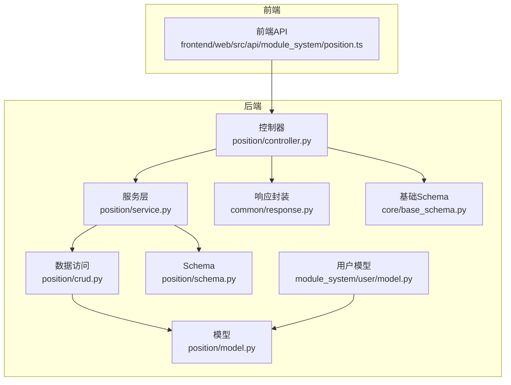
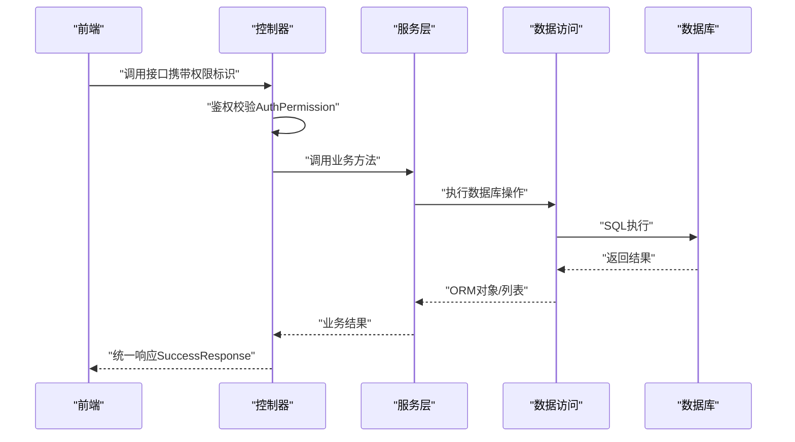
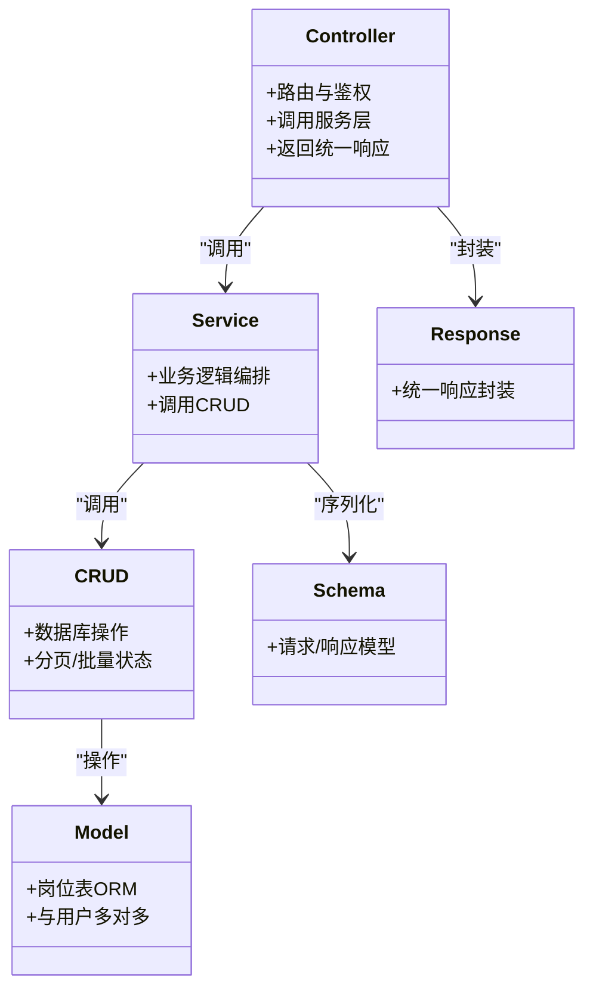
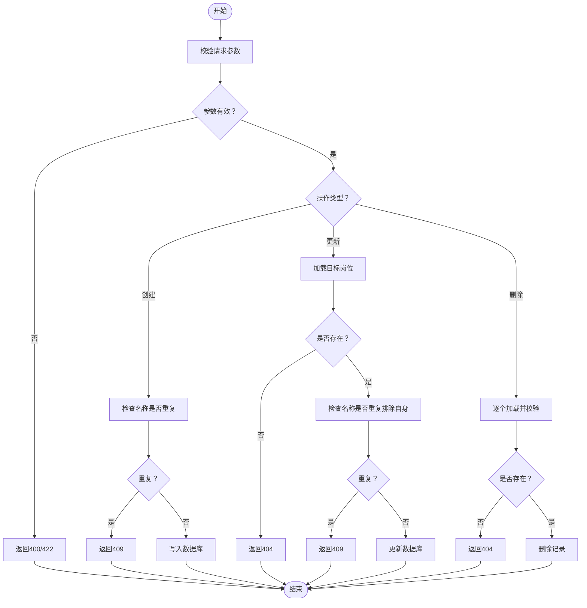

# 岗位管理 API

<cite>
**本文档引用的文件**
- [controller.py](file://backend/app/api/v1/module_system/position/controller.py)
- [service.py](file://backend/app/api/v1/module_system/position/service.py)
- [crud.py](file://backend/app/api/v1/module_system/position/crud.py)
- [model.py](file://backend/app/api/v1/module_system/position/model.py)
- [schema.py](file://backend/app/api/v1/module_system/position/schema.py)
- [response.py](file://backend/app/common/response.py)
- [base_schema.py](file://backend/app/core/base_schema.py)
- [position.ts](file://frontend/web/src/api/module_system/position.ts)
- [user.model.py](file://backend/app/api/v1/module_system/user/model.py)
- [position.sql(mysql)](file://backend/sql/mysql/fastapiadmin_2026-04-19_223353.sql)
- [position.sql(postgres)](file://backend/sql/postgres/fastapiadmin_2026-04-19_224727.sql)
- [constant.py](file://backend/app/common/constant.py)
- [permission.py](file://backend/app/core/permission.py)
</cite>

## 目录
1. [简介](#简介)
2. [项目结构](#项目结构)
3. [核心组件](#核心组件)
4. [架构总览](#架构总览)
5. [详细组件分析](#详细组件分析)
6. [依赖分析](#依赖分析)
7. [性能考虑](#性能考虑)
8. [故障排查指南](#故障排查指南)
9. [结论](#结论)
10. [附录](#附录)

## 简介
本文件为“岗位管理”模块的完整 API 接口文档，覆盖岗位信息的增删改查、批量状态变更、导出、以及岗位与用户的多对多关联关系。文档同时解释权限控制机制、用户岗位分配与业务流程控制，并提供前后端接口路径与响应结构说明，便于开发与测试对接。

## 项目结构
岗位管理模块位于后端系统模块化目录下，采用典型的分层架构：控制器（Controller）负责路由与鉴权，服务（Service）封装业务逻辑，数据访问（CRUD）封装数据库操作，模型（Model）定义数据结构与关系，Schema 定义请求/响应模型，前端通过独立 API 文件调用后端接口。

图表来源
- [controller.py:23-222](file://backend/app/api/v1/module_system/position/controller.py#L23-L222)
- [service.py:15-201](file://backend/app/api/v1/module_system/position/service.py#L15-L201)
- [crud.py:11-90](file://backend/app/api/v1/module_system/position/crud.py#L11-L90)
- [model.py:12-30](file://backend/app/api/v1/module_system/position/model.py#L12-L30)
- [schema.py:9-77](file://backend/app/api/v1/module_system/position/schema.py#L9-L77)
- [response.py:26-176](file://backend/app/common/response.py#L26-L176)
- [base_schema.py:15-75](file://backend/app/core/base_schema.py#L15-L75)
- [position.ts:1-85](file://frontend/web/src/api/module_system/position.ts#L1-L85)
- [user.model.py:40-151](file://backend/app/api/v1/module_system/user/model.py#L40-L151)

章节来源
- [controller.py:23-222](file://backend/app/api/v1/module_system/position/controller.py#L23-L222)
- [position.ts:1-85](file://frontend/web/src/api/module_system/position.ts#L1-L85)

## 核心组件
- 控制器（Controller）：定义岗位管理的 HTTP 路由与鉴权依赖，负责接收请求参数、调用服务层并返回统一响应。
- 服务层（Service）：封装岗位的查询、分页、创建、更新、删除、批量状态变更、导出等业务逻辑。
- 数据访问（CRUD）：基于通用基类封装增删改查、分页、批量状态设置等数据库操作。
- 模型（Model）：定义岗位表与用户岗位关联表的 ORM 映射，包含岗位与用户之间的多对多关系。
- Schema：定义岗位的创建/更新/查询/输出模型，以及分页查询参数。
- 响应封装（Response）：统一返回结构，包含业务状态码、消息、数据与 HTTP 状态码。
- 基础Schema（BaseSchema）：提供通用的审计字段与批量状态变更模型。
- 前端API：定义与后端接口一一对应的前端调用方法。

章节来源
- [service.py:15-201](file://backend/app/api/v1/module_system/position/service.py#L15-L201)
- [crud.py:11-90](file://backend/app/api/v1/module_system/position/crud.py#L11-L90)
- [model.py:12-30](file://backend/app/api/v1/module_system/position/model.py#L12-L30)
- [schema.py:9-77](file://backend/app/api/v1/module_system/position/schema.py#L9-L77)
- [response.py:26-176](file://backend/app/common/response.py#L26-L176)
- [base_schema.py:15-75](file://backend/app/core/base_schema.py#L15-L75)
- [position.ts:1-85](file://frontend/web/src/api/module_system/position.ts#L1-L85)

## 架构总览
岗位管理模块遵循“控制器-服务-数据访问-模型”的分层设计，控制器负责鉴权与参数解析，服务层进行业务校验与流程编排，数据访问层抽象数据库操作，模型定义关系与约束。权限控制通过依赖注入的鉴权装饰器实现，确保不同操作具备相应的权限标识。

图表来源
- [controller.py:26-222](file://backend/app/api/v1/module_system/position/controller.py#L26-L222)
- [service.py:18-201](file://backend/app/api/v1/module_system/position/service.py#L18-L201)
- [crud.py:11-90](file://backend/app/api/v1/module_system/position/crud.py#L11-L90)
- [response.py:36-102](file://backend/app/common/response.py#L36-L102)

## 详细组件分析

### 岗位管理接口清单
- 查询岗位列表
  - 方法与路径：GET /position/list
  - 权限标识：module_system:position:query
  - 请求参数：分页参数（page_no/page_size/order_by），查询参数（name/description/status/created_time/updated_time/created_id/updated_id）
  - 响应：分页结果（列表+总数）
  - 错误码：401/403/404/422/500（参考统一返回码）

- 查询岗位详情
  - 方法与路径：GET /position/detail/{id}
  - 权限标识：module_system:position:detail
  - 请求参数：Path{id: int}
  - 响应：岗位详情对象
  - 错误码：401/403/404/422/500

- 创建岗位
  - 方法与路径：POST /position/create
  - 权限标识：module_system:position:create
  - 请求参数：PositionCreateSchema（name/order/status/description）
  - 响应：新建岗位详情
  - 错误码：400/401/403/409/422/500

- 修改岗位
  - 方法与路径：PUT /position/update/{id}
  - 权限标识：module_system:position:update
  - 请求参数：Path{id: int} + PositionUpdateSchema
  - 响应：更新后的岗位详情
  - 错误码：400/401/403/404/409/422/500

- 删除岗位
  - 方法与路径：DELETE /position/delete
  - 权限标识：module_system:position:delete
  - 请求参数：Body{ids: list[int]}
  - 响应：成功消息
  - 错误码：400/401/403/404/422/500

- 批量修改岗位状态
  - 方法与路径：PATCH /position/available/setting
  - 权限标识：module_system:position:patch
  - 请求参数：Body{ids: list[int], status: string}
  - 响应：成功消息
  - 错误码：400/401/403/422/500

- 导出岗位
  - 方法与路径：POST /position/export
  - 权限标识：module_system:position:export
  - 请求参数：PositionQueryParam（同列表查询参数）
  - 响应：Excel 文件流（application/vnd.openxmlformats-officedocument.spreadsheetml.sheet）
  - 错误码：400/401/403/422/500

章节来源
- [controller.py:26-222](file://backend/app/api/v1/module_system/position/controller.py#L26-L222)
- [schema.py:36-77](file://backend/app/api/v1/module_system/position/schema.py#L36-L77)
- [base_schema.py:52-57](file://backend/app/core/base_schema.py#L52-L57)
- [response.py:26-102](file://backend/app/common/response.py#L26-L102)

### 请求与响应模型
- 岗位创建模型（PositionCreateSchema）
  - 字段：name（必填，最大长度64）、order（默认1，>=1）、status（默认"0"，启用）、description（可选，最大长度255）
  - 校验：名称去空格且非空

- 岗位更新模型（PositionUpdateSchema）
  - 继承创建模型，用于更新场景

- 岗位输出模型（PositionOutSchema）
  - 继承创建模型与基础审计字段、创建/更新人信息

- 岗位查询参数（PositionQueryParam）
  - 支持模糊匹配（name/description）、精确匹配（status）、时间范围（created_time/updated_time）、关联人（created_id/updated_id）

- 批量状态变更（BatchSetAvailable）
  - 字段：ids（列表）、status（字符串）

- 统一响应（ResponseSchema）
  - 字段：code、msg、data、status_code、success

章节来源
- [schema.py:9-77](file://backend/app/api/v1/module_system/position/schema.py#L9-L77)
- [base_schema.py:15-75](file://backend/app/core/base_schema.py#L15-L75)
- [response.py:26-102](file://backend/app/common/response.py#L26-L102)

### 数据模型与关系
- 岗位模型（PositionModel）
  - 表：sys_position
  - 字段：name、order、状态、描述、审计字段
  - 关系：与用户通过中间表 sys_user_positions 多对多关联

- 用户岗位关联表（sys_user_positions）
  - user_id、position_id 为主键，分别外键至 sys_user 与 sys_position

- 用户模型（UserModel）
  - positions 关系：与岗位多对多

章节来源
- [model.py:12-30](file://backend/app/api/v1/module_system/position/model.py#L12-L30)
- [user.model.py:40-151](file://backend/app/api/v1/module_system/user/model.py#L40-L151)
- [position.sql(mysql):866-884](file://backend/sql/mysql/fastapiadmin_2026-04-19_223353.sql#L866-L884)
- [position.sql(postgres):2985-3016](file://backend/sql/postgres/fastapiadmin_2026-04-19_224727.sql#L2985-L3016)

### 权限控制机制
- 控制器在各路由上使用 AuthPermission 依赖，传入权限标识字符串，未授权或权限不足将返回 401/403。
- 服务层与数据访问层不直接处理权限，权限判断集中在控制器层。
- 响应统一使用 SuccessResponse/ErrorResponse，其中业务状态码来自 RET 枚举。

章节来源
- [controller.py:35-173](file://backend/app/api/v1/module_system/position/controller.py#L35-L173)
- [constant.py:7-213](file://backend/app/common/constant.py#L7-L213)
- [response.py:36-102](file://backend/app/common/response.py#L36-L102)

### 前后端接口映射
- 前端 API 路径前缀为 /system/position，与后端 /position 对应，方法名与后端一致。
- 前端导出接口返回 Blob，后端返回流式响应。

章节来源
- [position.ts:1-85](file://frontend/web/src/api/module_system/position.ts#L1-L85)
- [controller.py:195-222](file://backend/app/api/v1/module_system/position/controller.py#L195-L222)

## 依赖分析
- 控制器依赖：AuthPermission（鉴权）、分页与查询参数依赖、服务层 PositionService。
- 服务层依赖：PositionCRUD、ExcelUtil（导出）、自定义异常（CustomException）。
- 数据访问层依赖：通用基类 CRUDBase、模型 PositionModel。
- 模型依赖：用户模型（用于关系回溯）。
- 响应封装依赖：统一返回结构与 HTTP 状态码。

图表来源
- [controller.py:23-222](file://backend/app/api/v1/module_system/position/controller.py#L23-L222)
- [service.py:15-201](file://backend/app/api/v1/module_system/position/service.py#L15-L201)
- [crud.py:11-90](file://backend/app/api/v1/module_system/position/crud.py#L11-L90)
- [model.py:12-30](file://backend/app/api/v1/module_system/position/model.py#L12-L30)
- [schema.py:9-77](file://backend/app/api/v1/module_system/position/schema.py#L9-L77)
- [response.py:26-176](file://backend/app/common/response.py#L26-L176)

## 性能考虑
- 分页查询使用 OFFSET/LIMIT，建议结合索引与合理 page_size 控制单次返回量。
- 导出接口先查询全量列表再导出，建议在大数据量场景限制导出范围或采用分批导出策略。
- 多对多关系查询使用 selectin 加载，减少 N+1 查询风险。
- 批量状态变更与批量删除建议限制单次批量数量，避免长事务与锁竞争。

## 故障排查指南
- 常见错误码
  - 400 参数错误：请求参数缺失或格式不正确（如名称为空、ID 列表为空）。
  - 401 未授权：缺少有效令牌或令牌过期。
  - 403 访问受限：权限不足，未包含所需权限标识。
  - 404 资源不存在：查询/更新/删除的目标不存在。
  - 409 资源冲突：创建/更新时名称重复。
  - 422 无法处理的实体：数据校验失败。
  - 500 服务器内部错误：数据库异常或服务异常。

- 常见问题定位
  - 创建失败提示“岗位已存在”：检查名称是否重复。
  - 更新失败提示“岗位不存在”：确认 id 是否正确。
  - 导出文件为空：确认查询条件是否过严导致无数据。
  - 权限错误：核对调用方是否具备 module_system:position:* 权限。

章节来源
- [constant.py:23-56](file://backend/app/common/constant.py#L23-L56)
- [service.py:90-166](file://backend/app/api/v1/module_system/position/service.py#L90-L166)
- [controller.py:35-173](file://backend/app/api/v1/module_system/position/controller.py#L35-L173)

## 结论
岗位管理模块提供了完善的岗位生命周期管理能力，配合统一的鉴权与响应机制，能够满足后台管理系统对岗位信息与用户岗位分配的需求。通过清晰的分层设计与标准化的接口规范，便于前后端协作与后续扩展。

## 附录

### 岗位管理流程图（创建/更新/删除）

图表来源
- [service.py:90-166](file://backend/app/api/v1/module_system/position/service.py#L90-L166)