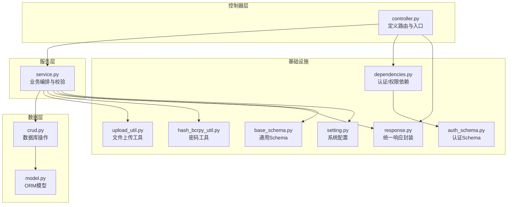
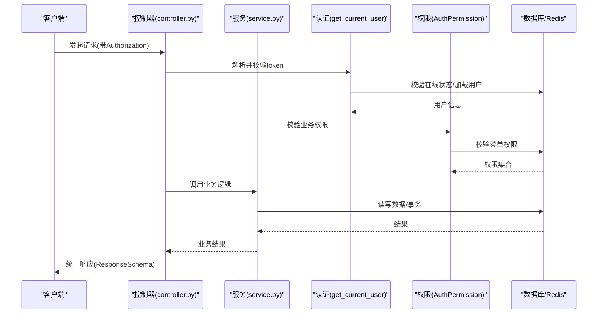
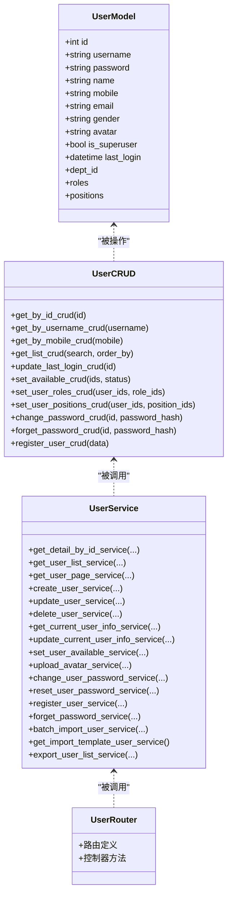

# 用户管理 API

<cite>
**本文引用的文件**
- [controller.py](file://backend/app/api/v1/module_system/user/controller.py)
- [service.py](file://backend/app/api/v1/module_system/user/service.py)
- [crud.py](file://backend/app/api/v1/module_system/user/crud.py)
- [schema.py](file://backend/app/api/v1/module_system/user/schema.py)
- [model.py](file://backend/app/api/v1/module_system/user/model.py)
- [response.py](file://backend/app/common/response.py)
- [dependencies.py](file://backend/app/core/dependencies.py)
- [upload_util.py](file://backend/app/utils/upload_util.py)
- [hash_bcrpy_util.py](file://backend/app/utils/hash_bcrpy_util.py)
- [setting.py](file://backend/app/config/setting.py)
- [base_schema.py](file://backend/app/core/base_schema.py)
- [auth_schema.py](file://backend/app/api/v1/module_system/auth/schema.py)
</cite>

## 目录
1. [简介](#简介)
2. [项目结构](#项目结构)
3. [核心组件](#核心组件)
4. [架构总览](#架构总览)
5. [详细接口文档](#详细接口文档)
6. [依赖关系分析](#依赖关系分析)
7. [性能与安全考量](#性能与安全考量)
8. [故障排查指南](#故障排查指南)
9. [结论](#结论)

## 简介
本文件为用户管理模块的完整 API 接口文档，覆盖用户基本信息管理、头像上传、密码管理、注册登录、导入导出等核心能力。文档详细记录每个接口的 HTTP 方法、URL 路径、请求参数、响应格式、错误码以及安全机制、权限控制与数据访问限制，并提供实际使用场景与最佳实践建议。

## 项目结构
用户管理模块采用典型的分层架构：
- 控制器层（Controller）：定义路由、接收请求、返回统一响应。
- 服务层（Service）：封装业务逻辑、调用数据层、处理复杂流程。
- 数据层（CRUD）：封装数据库操作、关系维护。
- 模型层（Model）：定义数据库表结构及关系。
- Schema 层：定义请求/响应数据模型与校验规则。
- 基础设施：认证鉴权、文件上传、密码加密、配置与响应封装等。

图表来源
- [controller.py:30-456](file://backend/app/api/v1/module_system/user/controller.py#L30-L456)
- [service.py:35-737](file://backend/app/api/v1/module_system/user/service.py#L35-L737)
- [crud.py:18-221](file://backend/app/api/v1/module_system/user/crud.py#L18-L221)
- [model.py:64-151](file://backend/app/api/v1/module_system/user/model.py#L64-L151)
- [dependencies.py:44-296](file://backend/app/core/dependencies.py#L44-L296)
- [upload_util.py:381-444](file://backend/app/utils/upload_util.py#L381-L444)
- [hash_bcrpy_util.py:21-73](file://backend/app/utils/hash_bcrpy_util.py#L21-L73)
- [setting.py:182-195](file://backend/app/config/setting.py#L182-L195)
- [response.py:26-176](file://backend/app/common/response.py#L26-L176)
- [base_schema.py:52-75](file://backend/app/core/base_schema.py#L52-L75)
- [auth_schema.py:9-93](file://backend/app/api/v1/module_system/auth/schema.py#L9-L93)

章节来源
- [controller.py:30-456](file://backend/app/api/v1/module_system/user/controller.py#L30-L456)
- [service.py:35-737](file://backend/app/api/v1/module_system/user/service.py#L35-L737)
- [crud.py:18-221](file://backend/app/api/v1/module_system/user/crud.py#L18-L221)
- [model.py:64-151](file://backend/app/api/v1/module_system/user/model.py#L64-L151)
- [dependencies.py:44-296](file://backend/app/core/dependencies.py#L44-L296)
- [upload_util.py:381-444](file://backend/app/utils/upload_util.py#L381-L444)
- [hash_bcrpy_util.py:21-73](file://backend/app/utils/hash_bcrpy_util.py#L21-L73)
- [setting.py:182-195](file://backend/app/config/setting.py#L182-L195)
- [response.py:26-176](file://backend/app/common/response.py#L26-L176)
- [base_schema.py:52-75](file://backend/app/core/base_schema.py#L52-L75)
- [auth_schema.py:9-93](file://backend/app/api/v1/module_system/auth/schema.py#L9-L93)

## 核心组件
- 控制器（UserRouter）：集中定义用户管理相关路由，统一响应包装。
- 服务（UserService）：实现业务规则、权限校验、数据校验与流程编排。
- 数据层（UserCRUD）：封装用户 CRUD、关联关系维护、状态变更等。
- 模型（UserModel）：定义用户表结构、多对多关系（角色、岗位）、外键约束。
- Schema：定义请求/响应模型与字段校验规则（用户名、手机号、邮箱、密码强度等）。
- 基础设施：认证依赖（令牌解析、在线校验、权限校验）、文件上传工具、密码加密工具、统一响应封装。

章节来源
- [controller.py:30-456](file://backend/app/api/v1/module_system/user/controller.py#L30-L456)
- [service.py:35-737](file://backend/app/api/v1/module_system/user/service.py#L35-L737)
- [crud.py:18-221](file://backend/app/api/v1/module_system/user/crud.py#L18-L221)
- [model.py:64-151](file://backend/app/api/v1/module_system/user/model.py#L64-L151)
- [schema.py:20-310](file://backend/app/api/v1/module_system/user/schema.py#L20-L310)
- [dependencies.py:44-296](file://backend/app/core/dependencies.py#L44-L296)
- [upload_util.py:381-444](file://backend/app/utils/upload_util.py#L381-L444)
- [hash_bcrpy_util.py:21-73](file://backend/app/utils/hash_bcrpy_util.py#L21-L73)
- [response.py:26-176](file://backend/app/common/response.py#L26-L176)
- [base_schema.py:52-75](file://backend/app/core/base_schema.py#L52-L75)
- [auth_schema.py:9-93](file://backend/app/api/v1/module_system/auth/schema.py#L9-L93)

## 架构总览
用户管理模块遵循“控制器-服务-数据层-模型”的分层设计，配合认证与权限中间件，确保接口安全与数据一致性。

图表来源
- [controller.py:33-456](file://backend/app/api/v1/module_system/user/controller.py#L33-L456)
- [dependencies.py:44-296](file://backend/app/core/dependencies.py#L44-L296)
- [service.py:35-737](file://backend/app/api/v1/module_system/user/service.py#L35-L737)
- [response.py:26-176](file://backend/app/common/response.py#L26-L176)

## 详细接口文档

### 1. 当前用户信息查询
- 方法与路径
  - GET /api/v1/user/current/info
- 权限要求
  - 需要有效登录态（携带合法 Access Token）
- 请求参数
  - 无
- 响应
  - 成功：返回当前用户信息（包含菜单树）
  - 失败：返回统一错误响应
- 业务规则
  - 仅能查询当前登录用户信息
  - 超级管理员拥有全部菜单权限
  - 普通用户仅返回其角色关联的菜单
- 实际使用场景
  - 登录后拉取用户资料与菜单权限，构建前端侧边栏

章节来源
- [controller.py:33-53](file://backend/app/api/v1/module_system/user/controller.py#L33-L53)
- [service.py:279-332](file://backend/app/api/v1/module_system/user/service.py#L279-L332)
- [dependencies.py:44-129](file://backend/app/core/dependencies.py#L44-L129)

### 2. 上传当前用户头像
- 方法与路径
  - POST /api/v1/user/current/avatar/upload
- 权限要求
  - 需要有效登录态
- 请求参数
  - multipart/form-data
    - file: 上传的头像文件（支持图片类型）
- 响应
  - 成功：返回上传后的文件信息（文件名、路径、URL）
  - 失败：返回统一错误响应
- 业务规则
  - 仅允许当前登录用户上传头像
  - 上传文件类型与大小受配置限制
  - 上传路径按日期分目录存储
- 实际使用场景
  - 用户在个人资料页面上传头像，保存后用于界面展示

章节来源
- [controller.py:56-75](file://backend/app/api/v1/module_system/user/controller.py#L56-L75)
- [service.py:390-408](file://backend/app/api/v1/module_system/user/service.py#L390-L408)
- [upload_util.py:381-444](file://backend/app/utils/upload_util.py#L381-L444)
- [setting.py:182-195](file://backend/app/config/setting.py#L182-L195)

### 3. 更新当前用户基本信息
- 方法与路径
  - PUT /api/v1/user/current/info/update
- 权限要求
  - 需要有效登录态
- 请求参数
  - JSON
    - name: 名称（可选，长度<=32）
    - mobile: 手机号（可选，需符合手机号格式）
    - email: 邮箱（可选，需符合邮箱格式）
    - gender: 性别（可选）
    - avatar: 头像URL（可选，需为HTTP/HTTPS）
- 响应
  - 成功：返回更新后的用户信息
  - 失败：返回统一错误响应
- 业务规则
  - 超级管理员禁止修改个人信息
  - 手机号、邮箱不可与其他用户重复
  - 头像URL必须为合法HTTP/HTTPS地址
- 实际使用场景
  - 用户修改昵称、联系方式、性别等基础信息

章节来源
- [controller.py:78-100](file://backend/app/api/v1/module_system/user/controller.py#L78-L100)
- [service.py:335-367](file://backend/app/api/v1/module_system/user/service.py#L335-L367)
- [schema.py:20-101](file://backend/app/api/v1/module_system/user/schema.py#L20-L101)

### 4. 修改当前用户密码
- 方法与路径
  - PUT /api/v1/user/current/password/change
- 权限要求
  - 需要有效登录态
- 请求参数
  - JSON
    - old_password: 旧密码
    - new_password: 新密码（长度>=6）
- 响应
  - 成功：返回更新后的用户信息，并提示“请重新登录”
  - 失败：返回统一错误响应
- 业务规则
  - 必须提供旧密码且验证正确
  - 新密码长度>=6
  - 修改后需重新登录生效
- 实际使用场景
  - 用户主动修改登录密码

章节来源
- [controller.py:103-125](file://backend/app/api/v1/module_system/user/controller.py#L103-L125)
- [service.py:411-443](file://backend/app/api/v1/module_system/user/service.py#L411-L443)
- [hash_bcrpy_util.py:27-51](file://backend/app/utils/hash_bcrpy_util.py#L27-L51)

### 5. 重置用户密码（管理员）
- 方法与路径
  - PUT /api/v1/user/reset/password
- 权限要求
  - 需具备业务权限：module_system:user:update
- 请求参数
  - JSON
    - id: 目标用户ID
    - password: 新密码（长度>=6）
- 响应
  - 成功：返回更新后的用户信息
  - 失败：返回统一错误响应
- 业务规则
  - 不允许重置超级管理员密码
  - 目标用户必须存在且状态正常
- 实际使用场景
  - 管理员为异常用户重置密码

章节来源
- [controller.py:128-150](file://backend/app/api/v1/module_system/user/controller.py#L128-L150)
- [service.py:446-474](file://backend/app/api/v1/module_system/user/service.py#L446-L474)

### 6. 用户注册
- 方法与路径
  - POST /api/v1/user/register
- 权限要求
  - 无需登录态（开放注册）
- 请求参数
  - JSON
    - name: 昵称（可选）
    - mobile: 手机号（可选）
    - username: 账号（3-32位，字母开头，仅含字母/数字/_ . -）
    - password: 密码（哈希值）
    - role_ids: 角色ID列表（可选）
    - description: 备注（可选，长度<=255）
- 响应
  - 成功：返回注册后的用户信息
  - 失败：返回统一错误响应
- 业务规则
  - 账号唯一性校验
  - 密码需进行哈希处理
  - 默认状态为启用
- 实际使用场景
  - 新用户自助注册

章节来源
- [controller.py:153-176](file://backend/app/api/v1/module_system/user/controller.py#L153-L176)
- [service.py:477-504](file://backend/app/api/v1/module_system/user/service.py#L477-L504)
- [schema.py:103-176](file://backend/app/api/v1/module_system/user/schema.py#L103-L176)

### 7. 忘记密码（找回）
- 方法与路径
  - POST /api/v1/user/forget/password
- 权限要求
  - 无需登录态（开放找回）
- 请求参数
  - JSON
    - username: 用户名
    - new_password: 新密码
    - mobile: 手机号（可选）
- 响应
  - 成功：返回更新后的用户信息
  - 失败：返回统一错误响应
- 业务规则
  - 用户必须存在且状态正常
  - 不允许重置超级管理员密码
- 实际使用场景
  - 用户通过找回流程重置密码

章节来源
- [controller.py:179-202](file://backend/app/api/v1/module_system/user/controller.py#L179-L202)
- [service.py:507-534](file://backend/app/api/v1/module_system/user/service.py#L507-L534)

### 8. 查询用户列表（分页）
- 方法与路径
  - GET /api/v1/user/list
- 权限要求
  - 需具备业务权限：module_system:user:query
- 请求参数
  - 查询参数
    - page_no: 页码（从1开始）
    - page_size: 每页条数
    - order_by: 排序字段（如 id:asc）
    - username: 用户名（模糊）
    - name: 昵称（模糊）
    - mobile: 手机号（模糊）
    - email: 邮箱（模糊）
    - dept_id: 部门ID（精确）
    - tenant_id: 租户ID（精确，平台管理员可见）
    - status: 状态（精确）
    - created_time: 创建时间范围（数组）
    - updated_time: 更新时间范围（数组）
    - created_id: 创建人（精确）
    - updated_id: 更新人（精确）
- 响应
  - 成功：返回分页结果（包含总条数与列表）
  - 失败：返回统一错误响应
- 业务规则
  - 支持多字段模糊/精确/范围查询
  - 超级管理员可查看全部数据
- 实际使用场景
  - 管理后台用户列表展示与筛选

章节来源
- [controller.py:205-235](file://backend/app/api/v1/module_system/user/controller.py#L205-L235)
- [service.py:89-118](file://backend/app/api/v1/module_system/user/service.py#L89-L118)
- [schema.py:262-310](file://backend/app/api/v1/module_system/user/schema.py#L262-L310)

### 9. 查询用户详情
- 方法与路径
  - GET /api/v1/user/detail/{id}
- 权限要求
  - 需具备业务权限：module_system:user:detail
- 请求参数
  - 路径参数
    - id: 用户ID
- 响应
  - 成功：返回用户详情（包含部门名称、角色、岗位等）
  - 失败：返回统一错误响应
- 业务规则
  - 超级管理员可查看全部用户详情
- 实际使用场景
  - 查看单个用户的完整信息

章节来源
- [controller.py:238-260](file://backend/app/api/v1/module_system/user/controller.py#L238-L260)
- [service.py:39-61](file://backend/app/api/v1/module_system/user/service.py#L39-L61)

### 10. 创建用户（管理员）
- 方法与路径
  - POST /api/v1/user/create
- 权限要求
  - 需具备业务权限：module_system:user:create
- 请求参数
  - JSON
    - username: 账号（3-32位，字母开头，仅含字母/数字/_ . -）
    - password: 密码（哈希值，可选）
    - name: 昵称（可选）
    - mobile: 手机号（可选）
    - email: 邮箱（可选）
    - gender: 性别（可选）
    - status: 状态（默认启用）
    - is_superuser: 是否超管（不允许直接创建）
    - dept_id: 部门ID（可选）
    - tenant_id: 租户ID（平台管理员可指定）
    - role_ids: 角色ID列表（可选）
    - position_ids: 岗位ID列表（可选）
    - description: 备注（可选）
- 响应
  - 成功：返回创建后的用户信息
  - 失败：返回统一错误响应
- 业务规则
  - 不允许创建超级管理员
  - 账号唯一性校验
  - 部门存在性与可用性校验
  - 角色/岗位存在性与可用性校验
- 实际使用场景
  - 管理员批量创建用户并分配角色/岗位

章节来源
- [controller.py:263-289](file://backend/app/api/v1/module_system/user/controller.py#L263-L289)
- [service.py:121-163](file://backend/app/api/v1/module_system/user/service.py#L121-L163)

### 11. 修改用户（管理员）
- 方法与路径
  - PUT /api/v1/user/update/{id}
- 权限要求
  - 需具备业务权限：module_system:user:update
- 请求参数
  - 路径参数
    - id: 用户ID
  - JSON
    - username: 账号（3-32位，字母开头，仅含字母/数字/_ . -）
    - name: 昵称（可选）
    - mobile: 手机号（可选）
    - email: 邮箱（可选）
    - gender: 性别（可选）
    - status: 状态（可选）
    - dept_id: 部门ID（可选）
    - role_ids: 角色ID列表（可选）
    - position_ids: 岗位ID列表（可选）
    - description: 备注（可选）
- 响应
  - 成功：返回更新后的用户信息
  - 失败：返回统一错误响应
- 业务规则
  - 不允许修改超级管理员
  - 账号、手机号、邮箱不可与其他用户重复
  - 部门存在性与可用性校验
  - 角色/岗位存在性与可用性校验
- 实际使用场景
  - 管理员调整用户资料与权限

章节来源
- [controller.py:292-316](file://backend/app/api/v1/module_system/user/controller.py#L292-L316)
- [service.py:166-243](file://backend/app/api/v1/module_system/user/service.py#L166-L243)

### 12. 删除用户（管理员）
- 方法与路径
  - DELETE /api/v1/user/delete
- 权限要求
  - 需具备业务权限：module_system:user:delete
- 请求参数
  - JSON
    - ids: 用户ID列表
- 响应
  - 成功：返回删除成功消息
  - 失败：返回统一错误响应
- 业务规则
  - 不允许删除超级管理员
  - 不允许删除启用状态的用户
  - 不允许删除当前登录用户
  - 删除前清理角色/岗位关联
- 实际使用场景
  - 管理员批量停用并删除用户

章节来源
- [controller.py:319-341](file://backend/app/api/v1/module_system/user/controller.py#L319-L341)
- [service.py:246-277](file://backend/app/api/v1/module_system/user/service.py#L246-L277)

### 13. 批量修改用户状态
- 方法与路径
  - PATCH /api/v1/user/available/setting
- 权限要求
  - 需具备业务权限：module_system:user:patch
- 请求参数
  - JSON
    - ids: 用户ID列表
    - status: 状态（0启用/1停用）
- 响应
  - 成功：返回批量修改成功消息
  - 失败：返回统一错误响应
- 业务规则
  - 不允许修改超级管理员状态
- 实际使用场景
  - 管理员批量启用/停用用户

章节来源
- [controller.py:344-366](file://backend/app/api/v1/module_system/user/controller.py#L344-L366)
- [service.py:370-387](file://backend/app/api/v1/module_system/user/service.py#L370-L387)

### 14. 获取用户导入模板
- 方法与路径
  - POST /api/v1/user/import/template
- 权限要求
  - 需具备业务权限：module_system:user:download
- 请求参数
  - 无
- 响应
  - 成功：返回Excel模板文件流（application/vnd.openxmlformats-officedocument.spreadsheetml.sheet）
  - 失败：返回统一错误响应
- 业务规则
  - 返回包含下拉选项的Excel模板
- 实际使用场景
  - 下载导入模板，准备批量导入数据

章节来源
- [controller.py:369-393](file://backend/app/api/v1/module_system/user/controller.py#L369-L393)
- [service.py:662-687](file://backend/app/api/v1/module_system/user/service.py#L662-L687)

### 15. 导出用户
- 方法与路径
  - POST /api/v1/user/export
- 权限要求
  - 需具备业务权限：module_system:user:export
- 请求参数
  - 查询参数
    - page_no/page_size/order_by 与列表查询一致
    - 搜索条件同列表查询
- 响应
  - 成功：返回Excel文件流（application/vnd.openxmlformats-officedocument.spreadsheetml.sheet）
  - 失败：返回统一错误响应
- 业务规则
  - 支持分页导出
  - 字段映射与状态转换
- 实际使用场景
  - 导出用户数据用于备份或报表

章节来源
- [controller.py:396-428](file://backend/app/api/v1/module_system/user/controller.py#L396-L428)
- [service.py:689-736](file://backend/app/api/v1/module_system/user/service.py#L689-L736)

### 16. 导入用户
- 方法与路径
  - POST /api/v1/user/import/data
- 权限要求
  - 需具备业务权限：module_system:user:import
- 请求参数
  - multipart/form-data
    - file: Excel文件（需包含模板列）
- 响应
  - 成功：返回导入结果消息（包含成功/失败统计与错误明细）
  - 失败：返回统一错误响应
- 业务规则
  - 支持更新已有用户（可选）
  - 超级管理员不允许修改
  - 字段校验与默认密码设置
- 实际使用场景
  - 批量导入用户，快速初始化系统

章节来源
- [controller.py:431-455](file://backend/app/api/v1/module_system/user/controller.py#L431-L455)
- [service.py:537-659](file://backend/app/api/v1/module_system/user/service.py#L537-L659)

## 依赖关系分析

图表来源
- [model.py:64-151](file://backend/app/api/v1/module_system/user/model.py#L64-L151)
- [crud.py:18-221](file://backend/app/api/v1/module_system/user/crud.py#L18-L221)
- [service.py:35-737](file://backend/app/api/v1/module_system/user/service.py#L35-L737)
- [controller.py:30-456](file://backend/app/api/v1/module_system/user/controller.py#L30-L456)

章节来源
- [model.py:64-151](file://backend/app/api/v1/module_system/user/model.py#L64-L151)
- [crud.py:18-221](file://backend/app/api/v1/module_system/user/crud.py#L18-L221)
- [service.py:35-737](file://backend/app/api/v1/module_system/user/service.py#L35-L737)
- [controller.py:30-456](file://backend/app/api/v1/module_system/user/controller.py#L30-L456)

## 性能与安全考量
- 认证与权限
  - 令牌解析与在线校验：通过 Redis 存储在线状态，支持滑动过期。
  - 权限校验：基于角色菜单权限集合，满足任一所需权限即通过。
- 数据访问控制
  - 超级管理员拥有最高权限；普通用户仅能访问自身或受数据范围限制的数据。
- 文件上传
  - 严格的文件类型与大小校验，防止恶意文件上传；路径穿越防护。
- 密码安全
  - 使用 bcrypt 进行密码哈希，支持密码强度检查。
- 响应统一
  - 所有接口返回统一的 ResponseSchema，包含业务状态码、消息与数据体。

章节来源
- [dependencies.py:44-296](file://backend/app/core/dependencies.py#L44-L296)
- [upload_util.py:15-444](file://backend/app/utils/upload_util.py#L15-L444)
- [hash_bcrpy_util.py:14-73](file://backend/app/utils/hash_bcrpy_util.py#L14-L73)
- [response.py:26-176](file://backend/app/common/response.py#L26-L176)
- [setting.py:67-78](file://backend/app/config/setting.py#L67-L78)

## 故障排查指南
- 常见错误码
  - 401 未认证/非法凭证/认证已失效
  - 403 无权限操作
  - 400 请求参数错误/业务异常
  - 500 服务器内部错误
- 常见问题定位
  - 令牌无效：确认 Authorization 头格式与 Redis 在线状态。
  - 权限不足：检查用户角色与菜单权限是否满足接口要求。
  - 数据冲突：账号/手机号/邮箱重复、超级管理员不可修改/删除。
  - 文件上传失败：检查文件类型、大小与路径穿越风险。
- 日志与追踪
  - 统一日志输出与响应封装，便于定位问题。

章节来源
- [response.py:26-176](file://backend/app/common/response.py#L26-L176)
- [dependencies.py:44-296](file://backend/app/core/dependencies.py#L44-L296)
- [service.py:35-737](file://backend/app/api/v1/module_system/user/service.py#L35-L737)

## 结论
用户管理模块提供了完善的用户生命周期管理能力，覆盖从注册、登录、信息维护到权限管理与数据导入导出的全流程。通过清晰的分层设计、严格的认证与权限控制、统一的响应封装与安全措施，确保了系统的稳定性与安全性。建议在生产环境中结合监控与审计策略，持续优化性能与用户体验。