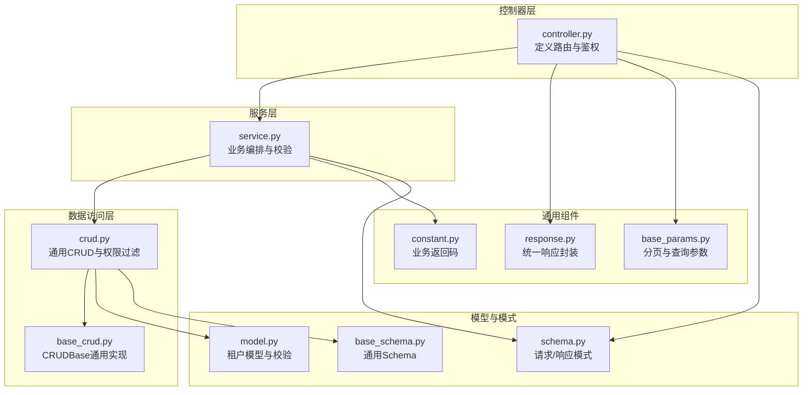
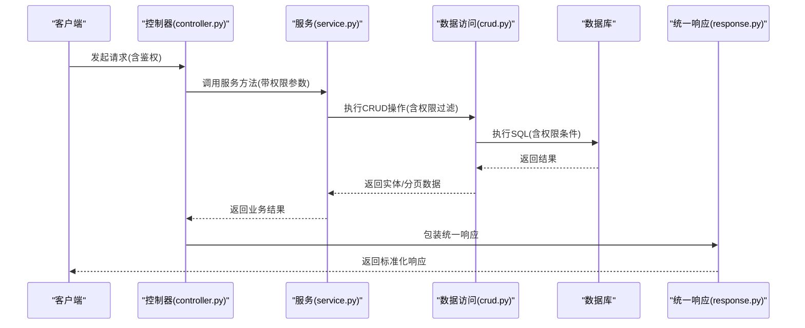
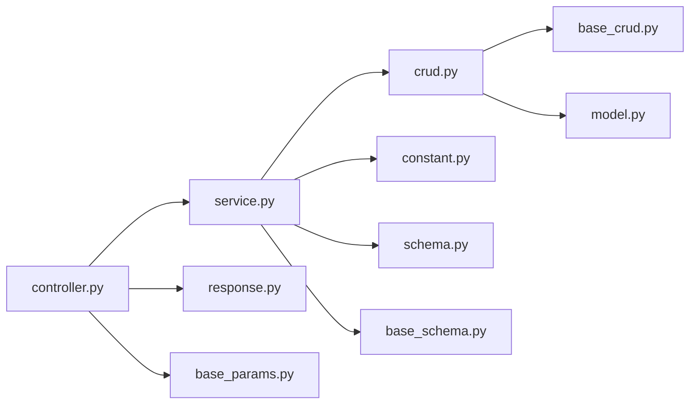

# 租户管理 API

<cite>
**本文引用的文件**
- [controller.py](file://backend/app/api/v1/module_system/tenant/controller.py)
- [service.py](file://backend/app/api/v1/module_system/tenant/service.py)
- [crud.py](file://backend/app/api/v1/module_system/tenant/crud.py)
- [model.py](file://backend/app/api/v1/module_system/tenant/model.py)
- [schema.py](file://backend/app/api/v1/module_system/tenant/schema.py)
- [response.py](file://backend/app/common/response.py)
- [constant.py](file://backend/app/common/constant.py)
- [base_crud.py](file://backend/app/core/base_crud.py)
- [base_params.py](file://backend/app/core/base_params.py)
- [base_schema.py](file://backend/app/core/base_schema.py)
</cite>

## 目录
1. [简介](#简介)
2. [项目结构](#项目结构)
3. [核心组件](#核心组件)
4. [架构总览](#架构总览)
5. [详细组件分析](#详细组件分析)
6. [依赖分析](#依赖分析)
7. [性能考虑](#性能考虑)
8. [故障排查指南](#故障排查指南)
9. [结论](#结论)
10. [附录](#附录)

## 简介
本文件为“租户管理”模块的完整 API 接口文档，覆盖多租户架构下的租户信息管理与资源配额相关能力。内容包括：
- 多租户架构与数据隔离策略
- 租户生命周期管理：创建、查询、更新、删除、启用/禁用
- 分页查询、条件筛选、排序
- 响应格式与错误码规范
- 实际使用场景与最佳实践

## 项目结构
租户管理模块位于后端 API 层，采用典型的 MVC 分层设计：
- 控制器层（Controller）：定义路由、接收请求、返回统一响应
- 服务层（Service）：编排业务逻辑、权限校验、跨表联动
- 数据访问层（CRUD）：封装通用数据库操作与权限过滤
- 模型层（Model）：定义数据库表结构与校验规则
- 模式层（Schema）：定义请求/响应数据结构与校验

图表来源
- [controller.py:1-117](file://backend/app/api/v1/module_system/tenant/controller.py#L1-L117)
- [service.py:1-149](file://backend/app/api/v1/module_system/tenant/service.py#L1-L149)
- [crud.py:1-60](file://backend/app/api/v1/module_system/tenant/crud.py#L1-L60)
- [base_crud.py:1-571](file://backend/app/core/base_crud.py#L1-L571)
- [model.py:1-40](file://backend/app/api/v1/module_system/tenant/model.py#L1-L40)
- [schema.py:1-99](file://backend/app/api/v1/module_system/tenant/schema.py#L1-L99)
- [base_schema.py:1-75](file://backend/app/core/base_schema.py#L1-L75)
- [response.py:1-176](file://backend/app/common/response.py#L1-L176)
- [constant.py:1-805](file://backend/app/common/constant.py#L1-L805)
- [base_params.py:1-94](file://backend/app/core/base_params.py#L1-L94)

章节来源
- [controller.py:1-117](file://backend/app/api/v1/module_system/tenant/controller.py#L1-L117)
- [service.py:1-149](file://backend/app/api/v1/module_system/tenant/service.py#L1-L149)
- [crud.py:1-60](file://backend/app/api/v1/module_system/tenant/crud.py#L1-L60)
- [base_crud.py:1-571](file://backend/app/core/base_crud.py#L1-L571)
- [model.py:1-40](file://backend/app/api/v1/module_system/tenant/model.py#L1-L40)
- [schema.py:1-99](file://backend/app/api/v1/module_system/tenant/schema.py#L1-L99)
- [base_schema.py:1-75](file://backend/app/core/base_schema.py#L1-L75)
- [response.py:1-176](file://backend/app/common/response.py#L1-L176)
- [constant.py:1-805](file://backend/app/common/constant.py#L1-L805)
- [base_params.py:1-94](file://backend/app/core/base_params.py#L1-L94)

## 核心组件
- 控制器（TenantRouter）：暴露租户管理相关路由，负责参数注入、鉴权与统一响应包装
- 服务（TenantService）：实现业务规则，如系统租户保护、唯一性校验、初始管理员创建、关联数据检查等
- CRUD（TenantCRUD）：基于通用 CRUDBase 封装租户的增删改查与分页
- 模型（TenantModel）：定义租户表结构、字段约束与校验
- 模式（Schema）：定义创建/更新/查询/响应的数据结构与校验规则
- 统一响应（ResponseSchema/SuccessResponse/ErrorResponse）：标准化返回结构
- 业务返回码（RET）：统一业务错误码与 HTTP 状态码映射

章节来源
- [controller.py:1-117](file://backend/app/api/v1/module_system/tenant/controller.py#L1-L117)
- [service.py:1-149](file://backend/app/api/v1/module_system/tenant/service.py#L1-L149)
- [crud.py:1-60](file://backend/app/api/v1/module_system/tenant/crud.py#L1-L60)
- [model.py:1-40](file://backend/app/api/v1/module_system/tenant/model.py#L1-L40)
- [schema.py:1-99](file://backend/app/api/v1/module_system/tenant/schema.py#L1-L99)
- [response.py:1-176](file://backend/app/common/response.py#L1-L176)
- [constant.py:1-805](file://backend/app/common/constant.py#L1-L805)

## 架构总览
租户管理遵循“控制器-服务-数据访问-模型”的分层架构，并通过权限过滤实现数据隔离。系统租户（ID=1）具有特殊保护策略，普通租户通过业务表的 tenant_id 实现数据隔离。

图表来源
- [controller.py:1-117](file://backend/app/api/v1/module_system/tenant/controller.py#L1-L117)
- [service.py:1-149](file://backend/app/api/v1/module_system/tenant/service.py#L1-L149)
- [crud.py:1-60](file://backend/app/api/v1/module_system/tenant/crud.py#L1-L60)
- [base_crud.py:1-571](file://backend/app/core/base_crud.py#L1-L571)
- [response.py:1-176](file://backend/app/common/response.py#L1-L176)

## 详细组件分析

### 控制器层（路由与鉴权）
- 路由前缀：/tenant
- 鉴权策略：使用 AuthPermission 注入权限点，确保调用方具备对应模块权限
- 统一响应：SuccessResponse/ErrorResponse 包装响应结构

章节来源
- [controller.py:1-117](file://backend/app/api/v1/module_system/tenant/controller.py#L1-L117)

### 服务层（业务编排）
- 详情查询：校验租户是否存在，返回序列化结果
- 分页查询：支持按名称/编码/状态/时间范围查询，支持自定义排序
- 创建租户：校验名称/编码唯一性；创建租户后自动生成初始管理员用户；异常回滚
- 更新租户：系统租户保护（编码不可改、不允许禁用）；校验名称/编码唯一性
- 删除租户：禁止删除系统租户；检查关联数据（用户、部门、角色、岗位），存在则拒绝
- 批量启用/禁用：系统租户不允许禁用

章节来源
- [service.py:1-149](file://backend/app/api/v1/module_system/tenant/service.py#L1-L149)

### 数据访问层（CRUD 与权限过滤）
- 基于 CRUDBase 提供 get/list/page/create/update/delete/set 等通用能力
- 权限过滤：自动追加软删除过滤与数据权限过滤
- 分页优化：主键计数，避免全表扫描

章节来源
- [crud.py:1-60](file://backend/app/api/v1/module_system/tenant/crud.py#L1-L60)
- [base_crud.py:1-571](file://backend/app/core/base_crud.py#L1-L571)

### 模型与模式
- 模型（TenantModel）：表名 sys_tenant，字段 name/code/status/start_time/end_time；系统租户保护策略
- 模式（Schema）：TenantCreateSchema/TenantUpdateSchema/TenantOutSchema/TenantQueryParam；字段长度与格式校验、时间范围校验

章节来源
- [model.py:1-40](file://backend/app/api/v1/module_system/tenant/model.py#L1-L40)
- [schema.py:1-99](file://backend/app/api/v1/module_system/tenant/schema.py#L1-L99)

### 统一响应与错误码
- 统一响应结构：code/msg/data/status_code/success
- 业务返回码：RET 枚举，覆盖成功、HTTP 标准错误、自定义业务错误等

章节来源
- [response.py:1-176](file://backend/app/common/response.py#L1-L176)
- [constant.py:1-805](file://backend/app/common/constant.py#L1-L805)

## 依赖分析
租户管理模块内部依赖清晰，耦合度低，职责单一：
- 控制器依赖服务层与统一响应
- 服务层依赖 CRUD 与各业务 CRUD（用户/部门/角色/岗位）
- CRUD 依赖通用 CRUDBase 与权限过滤
- 模式依赖通用 Schema 与校验工具

图表来源
- [controller.py:1-117](file://backend/app/api/v1/module_system/tenant/controller.py#L1-L117)
- [service.py:1-149](file://backend/app/api/v1/module_system/tenant/service.py#L1-L149)
- [crud.py:1-60](file://backend/app/api/v1/module_system/tenant/crud.py#L1-L60)
- [base_crud.py:1-571](file://backend/app/core/base_crud.py#L1-L571)
- [model.py:1-40](file://backend/app/api/v1/module_system/tenant/model.py#L1-L40)
- [response.py:1-176](file://backend/app/common/response.py#L1-L176)
- [constant.py:1-805](file://backend/app/common/constant.py#L1-L805)
- [base_params.py:1-94](file://backend/app/core/base_params.py#L1-L94)
- [schema.py:1-99](file://backend/app/api/v1/module_system/tenant/schema.py#L1-L99)
- [base_schema.py:1-75](file://backend/app/core/base_schema.py#L1-L75)

## 性能考虑
- 分页查询：使用主键计数，避免 count(*) 全表扫描
- 权限过滤：在 SQL 层面追加软删除与数据权限条件，减少应用层过滤成本
- 预加载：CRUDBase 支持 selectinload 预加载，避免 N+1 查询
- 批量操作：set/delete 支持批量更新/删除，降低网络往返

章节来源
- [base_crud.py:151-214](file://backend/app/core/base_crud.py#L151-L214)
- [base_crud.py:374-403](file://backend/app/core/base_crud.py#L374-L403)
- [base_crud.py:446-451](file://backend/app/core/base_crud.py#L446-L451)

## 故障排查指南
常见错误与定位建议：
- 业务错误码（RET）：参考业务返回码定义，快速定位错误类型
- 数据唯一性冲突：创建/更新时名称/编码重复
- 权限不足：缺少模块权限点
- 关联数据未清理：删除租户前需清理用户/部门/角色/岗位
- 系统租户保护：系统租户不允许删除、禁用或修改特定字段
- 时间范围校验：开始时间不得晚于结束时间

章节来源
- [constant.py:1-805](file://backend/app/common/constant.py#L1-L805)
- [service.py:1-149](file://backend/app/api/v1/module_system/tenant/service.py#L1-L149)
- [schema.py:1-99](file://backend/app/api/v1/module_system/tenant/schema.py#L1-L99)

## 结论
租户管理模块通过清晰的分层设计与严格的权限过滤，实现了多租户架构下的数据隔离与资源管理。系统租户保护与关联数据检查保障了系统的稳定性与一致性。统一响应与错误码体系提升了接口的可观测性与可维护性。

## 附录

### API 定义总览
- 路由前缀：/tenant
- 鉴权：AuthPermission（权限点见控制器注释）

章节来源
- [controller.py:1-117](file://backend/app/api/v1/module_system/tenant/controller.py#L1-L117)

### 详情查询
- 方法：GET
- 路径：/tenant/detail/{id}
- 权限点：module_system:tenant:query
- 请求参数：
  - 路径参数：id（整数，租户ID）
- 响应：
  - data：租户详情（TenantOutSchema）
  - code/msg/success/status_code：统一响应字段

章节来源
- [controller.py:20-33](file://backend/app/api/v1/module_system/tenant/controller.py#L20-L33)
- [service.py:21-26](file://backend/app/api/v1/module_system/tenant/service.py#L21-L26)
- [schema.py:71-76](file://backend/app/api/v1/module_system/tenant/schema.py#L71-L76)

### 列表查询（分页）
- 方法：GET
- 路径：/tenant/list
- 权限点：module_system:tenant:query
- 查询参数：
  - 分页：page_no（默认1）、page_size（默认10，上限100）、order_by（JSON数组字符串）
  - 搜索：name（模糊）、code（模糊）、status（精确）、created_time（时间范围）
- 响应：
  - data：分页结果（items、total、page_no、page_size、has_next）
  - items：租户列表（TenantOutSchema）

章节来源
- [controller.py:35-57](file://backend/app/api/v1/module_system/tenant/controller.py#L35-L57)
- [base_params.py:8-42](file://backend/app/core/base_params.py#L8-L42)
- [schema.py:77-99](file://backend/app/api/v1/module_system/tenant/schema.py#L77-L99)
- [service.py:28-43](file://backend/app/api/v1/module_system/tenant/service.py#L28-L43)
- [crud.py:31-47](file://backend/app/api/v1/module_system/tenant/crud.py#L31-L47)

### 创建租户
- 方法：POST
- 路径：/tenant/create
- 权限点：module_system:tenant:create
- 请求体：TenantCreateSchema
  - 字段：name、code、status（默认0）、description、start_time、end_time
  - 校验：名称/编码非空、编码仅字母数字、时间范围合理
- 响应：
  - data：新创建租户（TenantOutSchema）
  - 同时创建初始管理员用户（用户名：租户编码_admin，临时密码随机生成）

章节来源
- [controller.py:60-72](file://backend/app/api/v1/module_system/tenant/controller.py#L60-L72)
- [schema.py:9-41](file://backend/app/api/v1/module_system/tenant/schema.py#L9-L41)
- [service.py:46-90](file://backend/app/api/v1/module_system/tenant/service.py#L46-L90)
- [model.py:10-40](file://backend/app/api/v1/module_system/tenant/model.py#L10-L40)

### 更新租户
- 方法：PUT
- 路径：/tenant/update/{id}
- 权限点：module_system:tenant:update
- 请求体：TenantUpdateSchema（部分字段可更新）
  - 字段：name、code、status、description、start_time、end_time
  - 校验：编码仅字母数字、时间范围合理
- 特殊规则：
  - 系统租户（id=1）：编码不可修改、不允许禁用
- 响应：
  - data：更新后的租户（TenantOutSchema）

章节来源
- [controller.py:75-88](file://backend/app/api/v1/module_system/tenant/controller.py#L75-L88)
- [schema.py:44-68](file://backend/app/api/v1/module_system/tenant/schema.py#L44-L68)
- [service.py:92-116](file://backend/app/api/v1/module_system/tenant/service.py#L92-L116)
- [model.py:10-40](file://backend/app/api/v1/module_system/tenant/model.py#L10-L40)

### 删除租户
- 方法：DELETE
- 路径：/tenant/delete
- 权限点：module_system:tenant:delete
- 请求体：ids（整数数组，租户ID列表）
- 限制：
  - 禁止删除系统租户（id=1）
  - 若租户下存在用户/部门/角色/岗位，拒绝删除
- 响应：无 data，仅成功提示

章节来源
- [controller.py:91-102](file://backend/app/api/v1/module_system/tenant/controller.py#L91-L102)
- [service.py:118-142](file://backend/app/api/v1/module_system/tenant/service.py#L118-L142)

### 批量启用/禁用
- 方法：PATCH
- 路径：/tenant/available/setting
- 权限点：module_system:tenant:patch
- 请求体：BatchSetAvailable
  - ids：租户ID列表
  - status：0启用/1禁用
- 限制：
  - 禁止对系统租户（id=1）执行禁用操作
- 响应：无 data，仅成功提示

章节来源
- [controller.py:105-116](file://backend/app/api/v1/module_system/tenant/controller.py#L105-L116)
- [base_schema.py:52-57](file://backend/app/core/base_schema.py#L52-L57)
- [service.py:144-148](file://backend/app/api/v1/module_system/tenant/service.py#L144-L148)

### 统一响应与错误码
- 统一响应结构：code/msg/data/status_code/success
- 业务返回码（节选）：
  - 成功：OK/SUCCESS/CREATED 等
  - 参数错误：BAD_REQUEST/PARAMERR 等
  - 权限错误：INVALID_PERMISSION/UNAUTHORIZED 等
  - 业务错误：DATAEXIST/DATAERR 等

章节来源
- [response.py:26-101](file://backend/app/common/response.py#L26-L101)
- [constant.py:7-180](file://backend/app/common/constant.py#L7-L180)

### 多租户隔离机制与资源配额
- 数据隔离策略：
  - 系统租户（ID=1）：平台管理，受严格保护
  - 普通租户：通过业务表的 tenant_id 字段实现数据隔离
  - 权限过滤：CRUDBase 在查询时自动追加软删除与数据权限条件
- 资源配额管理：
  - 本模块未直接实现资源配额控制，可在业务表中扩展配额字段并在服务层增加校验逻辑

章节来源
- [model.py:10-20](file://backend/app/api/v1/module_system/tenant/model.py#L10-L20)
- [base_crud.py:446-451](file://backend/app/core/base_crud.py#L446-L451)
- [service.py:46-90](file://backend/app/api/v1/module_system/tenant/service.py#L46-L90)

### 实际使用场景示例
- 场景一：创建新租户并初始化管理员
  - 调用“创建租户”，系统同时创建初始管理员用户（用户名：租户编码_admin，临时密码）
- 场景二：批量启用/禁用多个租户
  - 调用“批量启用/禁用”，传入租户ID列表与目标状态
- 场景三：删除租户前清理关联数据
  - 先清理用户/部门/角色/岗位，再调用“删除租户”

章节来源
- [service.py:46-90](file://backend/app/api/v1/module_system/tenant/service.py#L46-L90)
- [service.py:118-142](file://backend/app/api/v1/module_system/tenant/service.py#L118-L142)
- [controller.py:105-116](file://backend/app/api/v1/module_system/tenant/controller.py#L105-L116)