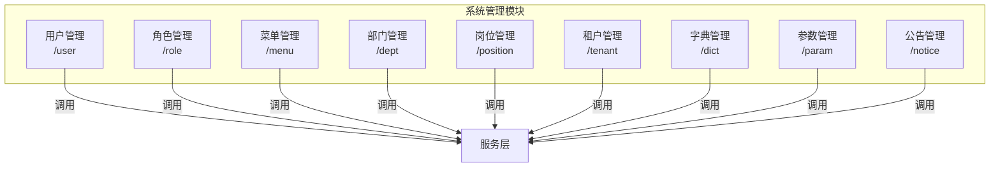
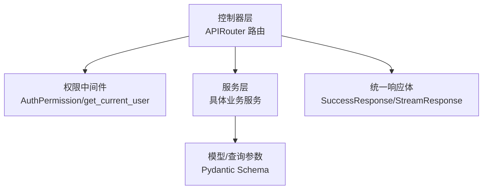
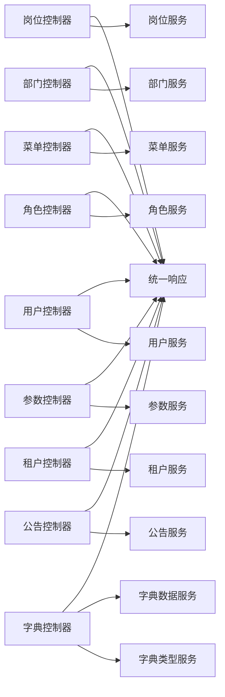

# 系统管理 API

<cite>
**本文引用的文件**
- [backend/app/api/v1/module_system/user/controller.py](file://backend/app/api/v1/module_system/user/controller.py)
- [backend/app/api/v1/module_system/user/schema.py](file://backend/app/api/v1/module_system/user/schema.py)
- [backend/app/api/v1/module_system/role/controller.py](file://backend/app/api/v1/module_system/role/controller.py)
- [backend/app/api/v1/module_system/role/schema.py](file://backend/app/api/v1/module_system/role/schema.py)
- [backend/app/api/v1/module_system/menu/controller.py](file://backend/app/api/v1/module_system/menu/controller.py)
- [backend/app/api/v1/module_system/menu/schema.py](file://backend/app/api/v1/module_system/menu/schema.py)
- [backend/app/api/v1/module_system/dept/controller.py](file://backend/app/api/v1/module_system/dept/controller.py)
- [backend/app/api/v1/module_system/dept/schema.py](file://backend/app/api/v1/module_system/dept/schema.py)
- [backend/app/api/v1/module_system/position/controller.py](file://backend/app/api/v1/module_system/position/controller.py)
- [backend/app/api/v1/module_system/position/schema.py](file://backend/app/api/v1/module_system/position/schema.py)
- [backend/app/api/v1/module_system/dict/controller.py](file://backend/app/api/v1/module_system/dict/controller.py)
- [backend/app/api/v1/module_system/params/controller.py](file://backend/app/api/v1/module_system/params/controller.py)
- [backend/app/api/v1/module_system/notice/controller.py](file://backend/app/api/v1/module_system/notice/controller.py)
- [backend/app/api/v1/module_system/tenant/controller.py](file://backend/app/api/v1/module_system/tenant/controller.py)
- [backend/app/common/response.py](file://backend/app/common/response.py)
- [backend/app/core/dependencies.py](file://backend/app/core/dependencies.py)
- [backend/app/core/router_class.py](file://backend/app/core/router_class.py)
- [backend/app/utils/common_util.py](file://backend/app/utils/common_util.py)
</cite>

## 目录
1. [简介](#简介)
2. [项目结构](#项目结构)
3. [核心组件](#核心组件)
4. [架构总览](#架构总览)
5. [详细组件分析](#详细组件分析)
6. [依赖关系分析](#依赖关系分析)
7. [性能考量](#性能考量)
8. [故障排查指南](#故障排查指南)
9. [结论](#结论)
10. [附录](#附录)

## 简介
本文件为“系统管理”模块的完整 API 接口文档，覆盖用户管理、角色管理、菜单管理、部门管理、岗位管理、字典管理、参数管理、公告管理和租户管理等子模块。内容包括：
- 每个接口的 HTTP 方法、URL 路径、请求参数、响应格式与错误码
- 权限控制、认证机制、数据验证与业务规则约束
- 完整的 CRUD 示例与典型使用场景
- 安全机制、权限控制与数据访问限制说明

## 项目结构
系统管理模块采用按功能域划分的目录组织方式，控制器层负责路由与鉴权，服务层封装业务逻辑，模型与查询参数在 schema 中定义，统一返回体在公共响应模块中实现。

图表来源
- [backend/app/api/v1/module_system/user/controller.py:30-456](file://backend/app/api/v1/module_system/user/controller.py#L30-L456)
- [backend/app/api/v1/module_system/role/controller.py:24-244](file://backend/app/api/v1/module_system/role/controller.py#L24-L244)
- [backend/app/api/v1/module_system/menu/controller.py:16-166](file://backend/app/api/v1/module_system/menu/controller.py#L16-L166)
- [backend/app/api/v1/module_system/dept/controller.py:16-190](file://backend/app/api/v1/module_system/dept/controller.py#L16-L190)
- [backend/app/api/v1/module_system/position/controller.py:23-222](file://backend/app/api/v1/module_system/position/controller.py#L23-L222)
- [backend/app/api/v1/module_system/tenant/controller.py:17-117](file://backend/app/api/v1/module_system/tenant/controller.py#L17-L117)
- [backend/app/api/v1/module_system/dict/controller.py:28-529](file://backend/app/api/v1/module_system/dict/controller.py#L28-L529)
- [backend/app/api/v1/module_system/params/controller.py:18-288](file://backend/app/api/v1/module_system/params/controller.py#L18-L288)
- [backend/app/api/v1/module_system/notice/controller.py:18-233](file://backend/app/api/v1/module_system/notice/controller.py#L18-L233)

章节来源
- [backend/app/api/v1/module_system/user/controller.py:30-456](file://backend/app/api/v1/module_system/user/controller.py#L30-L456)
- [backend/app/api/v1/module_system/role/controller.py:24-244](file://backend/app/api/v1/module_system/role/controller.py#L24-L244)
- [backend/app/api/v1/module_system/menu/controller.py:16-166](file://backend/app/api/v1/module_system/menu/controller.py#L16-L166)
- [backend/app/api/v1/module_system/dept/controller.py:16-190](file://backend/app/api/v1/module_system/dept/controller.py#L16-L190)
- [backend/app/api/v1/module_system/position/controller.py:23-222](file://backend/app/api/v1/module_system/position/controller.py#L23-L222)
- [backend/app/api/v1/module_system/tenant/controller.py:17-117](file://backend/app/api/v1/module_system/tenant/controller.py#L17-L117)
- [backend/app/api/v1/module_system/dict/controller.py:28-529](file://backend/app/api/v1/module_system/dict/controller.py#L28-L529)
- [backend/app/api/v1/module_system/params/controller.py:18-288](file://backend/app/api/v1/module_system/params/controller.py#L18-L288)
- [backend/app/api/v1/module_system/notice/controller.py:18-233](file://backend/app/api/v1/module_system/notice/controller.py#L18-L233)

## 核心组件
- 控制器层（Controller）
  - 路由定义、请求解析、权限校验、调用服务层、返回统一响应体
  - 使用自定义路由类记录操作日志
- 服务层（Service）
  - 封装业务逻辑，执行数据持久化与复杂流程
- 数据模型与查询参数（Schema）
  - Pydantic 模型定义请求/响应结构与字段校验
- 统一响应体（Response）
  - SuccessResponse/StreamResponse/ResponseSchema 统一输出格式

章节来源
- [backend/app/api/v1/module_system/user/controller.py:30-456](file://backend/app/api/v1/module_system/user/controller.py#L30-L456)
- [backend/app/common/response.py](file://backend/app/common/response.py)
- [backend/app/core/router_class.py](file://backend/app/core/router_class.py)
- [backend/app/api/v1/module_system/user/schema.py:1-310](file://backend/app/api/v1/module_system/user/schema.py#L1-L310)

## 架构总览
系统管理模块遵循“控制器-服务-模型”的分层架构，控制器负责鉴权与参数解析，服务层处理业务规则与数据访问，模型层保证输入输出一致性。

图表来源
- [backend/app/api/v1/module_system/user/controller.py:30-456](file://backend/app/api/v1/module_system/user/controller.py#L30-L456)
- [backend/app/core/dependencies.py](file://backend/app/core/dependencies.py)
- [backend/app/common/response.py](file://backend/app/common/response.py)

## 详细组件分析

### 用户管理（/user）
- 功能概览
  - 当前用户信息查询、头像上传、基本信息更新、密码修改/重置、注册/忘记密码
  - 分页查询、详情查询、创建、更新、删除、批量启停、导入导出、批量导入
- 关键接口
  - GET /user/current/info
    - 权限：当前用户
    - 响应：当前用户信息
  - POST /user/current/avatar/upload
    - 权限：当前用户
    - 响应：头像URL
  - PUT /user/current/info/update
    - 权限：当前用户
    - 请求：当前用户更新模型
    - 响应：更新后的用户信息
  - PUT /user/current/password/change
    - 权限：当前用户
    - 请求：旧密码、新密码
    - 响应：提示重新登录
  - PUT /user/reset/password
    - 权限：具备用户管理写权限
    - 请求：目标用户ID与新密码
    - 响应：重置结果
  - POST /user/register
    - 权限：无（公开注册）
    - 请求：注册模型（用户名、密码、角色等）
    - 响应：注册结果
  - POST /user/forget/password
    - 权限：无（公开忘记密码）
    - 请求：用户名、新密码、手机号（可选）
    - 响应：重置结果
  - GET /user/list
    - 权限：module_system:user:query
    - 查询：分页参数、用户查询参数
    - 响应：分页用户列表
  - GET /user/detail/{id}
    - 权限：module_system:user:detail
    - 路径：用户ID
    - 响应：用户详情
  - POST /user/create
    - 权限：module_system:user:create
    - 请求：创建模型（默认密码与状态）
    - 响应：创建结果
  - PUT /user/update/{id}
    - 权限：module_system:user:update
    - 请求：更新模型
    - 响应：更新结果
  - DELETE /user/delete
    - 权限：module_system:user:delete
    - 请求：ID列表
    - 响应：删除结果
  - PATCH /user/available/setting
    - 权限：module_system:user:patch
    - 请求：ID列表与启用状态
    - 响应：批量启停结果
  - POST /user/import/template
    - 权限：module_system:user:download
    - 响应：Excel 模板下载
  - POST /user/export
    - 权限：module_system:user:export
    - 查询：分页参数、用户查询参数
    - 响应：Excel 文件流
  - POST /user/import/data
    - 权限：module_system:user:import
    - 请求：Excel 文件
    - 响应：导入结果
- 数据验证与业务规则
  - 用户名格式、密码长度、邮箱/手机号格式、头像URL合法性
  - 创建用户默认状态与初始密码策略
  - 批量导入支持更新覆盖
- 错误码
  - 通用：400（参数/校验错误）、401（未认证）、403（权限不足）、404（资源不存在）、500（服务器错误）

章节来源
- [backend/app/api/v1/module_system/user/controller.py:33-456](file://backend/app/api/v1/module_system/user/controller.py#L33-L456)
- [backend/app/api/v1/module_system/user/schema.py:20-310](file://backend/app/api/v1/module_system/user/schema.py#L20-L310)
- [backend/app/common/response.py](file://backend/app/common/response.py)

### 角色管理（/role）
- 功能概览
  - 分页查询、详情查询、创建、更新、删除、批量启停、角色授权、导出
- 关键接口
  - GET /role/list
    - 权限：module_system:role:query
    - 查询：分页参数、角色查询参数
    - 响应：分页角色列表
  - GET /role/detail/{id}
    - 权限：module_system:role:detail
    - 路径：角色ID
    - 响应：角色详情
  - POST /role/create
    - 权限：module_system:role:create
    - 请求：角色创建模型（名称、编码、排序、数据范围、状态、描述）
    - 响应：创建结果
  - PUT /role/update/{id}
    - 权限：module_system:role:update
    - 请求：角色更新模型
    - 响应：更新结果
  - DELETE /role/delete
    - 权限：module_system:role:delete
    - 请求：ID列表
    - 响应：删除结果
  - PATCH /role/available/setting
    - 权限：module_system:role:patch
    - 请求：ID列表与启用状态
    - 响应：批量启停结果
  - PATCH /role/permission/setting
    - 权限：module_system:role:permission
    - 请求：数据范围、菜单ID列表、部门ID列表、角色ID列表
    - 响应：授权结果
  - POST /role/export
    - 权限：module_system:role:export
    - 查询：角色查询参数
    - 响应：Excel 文件流
- 数据验证与业务规则
  - 角色编码格式校验
  - 角色授权时的数据范围与关联ID校验
- 错误码
  - 通用：400、401、403、404、500

章节来源
- [backend/app/api/v1/module_system/role/controller.py:27-244](file://backend/app/api/v1/module_system/role/controller.py#L27-L244)
- [backend/app/api/v1/module_system/role/schema.py:21-126](file://backend/app/api/v1/module_system/role/schema.py#L21-L126)
- [backend/app/common/response.py](file://backend/app/common/response.py)

### 菜单管理（/menu）
- 功能概览
  - 菜单树查询、详情查询、创建、更新、删除、批量启停
- 关键接口
  - GET /menu/tree
    - 权限：module_system:menu:query
    - 查询：菜单查询参数
    - 响应：菜单树
  - GET /menu/detail/{id}
    - 权限：module_system:menu:detail
    - 路径：菜单ID
    - 响应：菜单详情
  - POST /menu/create
    - 权限：module_system:menu:create
    - 请求：菜单创建模型（类型、路由、组件、权限标识、父子关系、终端等）
    - 响应：创建结果
  - PUT /menu/update/{id}
    - 权限：module_system:menu:update
    - 请求：菜单更新模型
    - 响应：更新结果
  - DELETE /menu/delete
    - 权限：module_system:menu:delete
    - 请求：ID列表
    - 响应：删除结果
  - PATCH /menu/available/setting
    - 权限：module_system:menu:patch
    - 请求：ID列表与启用状态
    - 响应：批量启停结果
- 数据验证与业务规则
  - 菜单类型与字段组合校验（如外链/按钮的必填项）
  - 路由路径/组件路径格式约束
- 错误码
  - 通用：400、401、403、404、500

章节来源
- [backend/app/api/v1/module_system/menu/controller.py:19-166](file://backend/app/api/v1/module_system/menu/controller.py#L19-L166)
- [backend/app/api/v1/module_system/menu/schema.py:11-168](file://backend/app/api/v1/module_system/menu/schema.py#L11-L168)
- [backend/app/common/response.py](file://backend/app/common/response.py)

### 部门管理（/dept）
- 功能概览
  - 部门树查询、详情查询、创建、更新、删除、批量启停
- 关键接口
  - GET /dept/tree
    - 权限：module_system:dept:query
    - 查询：部门查询参数
    - 响应：部门树
  - GET /dept/detail/{id}
    - 权限：module_system:dept:detail
    - 路径：部门ID
    - 响应：部门详情
  - POST /dept/create
    - 权限：module_system:dept:create
    - 请求：部门创建模型（名称、编码、排序、负责人、电话、邮箱、父ID、状态、描述）
    - 响应：创建结果
  - PUT /dept/update/{id}
    - 权限：module_system:dept:update
    - 请求：部门更新模型
    - 响应：更新结果
  - DELETE /dept/delete
    - 权限：module_system:dept:delete
    - 请求：ID列表
    - 响应：删除结果
  - PATCH /dept/available/setting
    - 权限：module_system:dept:patch
    - 请求：ID列表与启用状态
    - 响应：批量启停结果
- 数据验证与业务规则
  - 部门名称与编码格式校验
- 错误码
  - 通用：400、401、403、404、500

章节来源
- [backend/app/api/v1/module_system/dept/controller.py:19-190](file://backend/app/api/v1/module_system/dept/controller.py#L19-L190)
- [backend/app/api/v1/module_system/dept/schema.py:9-102](file://backend/app/api/v1/module_system/dept/schema.py#L9-L102)
- [backend/app/common/response.py](file://backend/app/common/response.py)

### 岗位管理（/position）
- 功能概览
  - 列表查询、详情查询、创建、更新、删除、批量启停、导出
- 关键接口
  - GET /position/list
    - 权限：module_system:position:query
    - 查询：分页参数、岗位查询参数
    - 响应：分页岗位列表
  - GET /position/detail/{id}
    - 权限：module_system:position:detail
    - 路径：岗位ID
    - 响应：岗位详情
  - POST /position/create
    - 权限：module_system:position:create
    - 请求：岗位创建模型（名称、排序、状态、描述）
    - 响应：创建结果
  - PUT /position/update/{id}
    - 权限：module_system:position:update
    - 请求：岗位更新模型
    - 响应：更新结果
  - DELETE /position/delete
    - 权限：module_system:position:delete
    - 请求：ID列表
    - 响应：删除结果
  - PATCH /position/available/setting
    - 权限：module_system:position:patch
    - 请求：ID列表与启用状态
    - 响应：批量启停结果
  - POST /position/export
    - 权限：module_system:position:export
    - 查询：岗位查询参数
    - 响应：Excel 文件流
- 数据验证与业务规则
  - 岗位名称非空校验
- 错误码
  - 通用：400、401、403、404、500

章节来源
- [backend/app/api/v1/module_system/position/controller.py:26-222](file://backend/app/api/v1/module_system/position/controller.py#L26-L222)
- [backend/app/api/v1/module_system/position/schema.py:9-77](file://backend/app/api/v1/module_system/position/schema.py#L9-L77)
- [backend/app/common/response.py](file://backend/app/common/response.py)

### 字典管理（/dict）
- 功能概览
  - 字典类型：详情、列表、下拉、创建、更新、删除、批量启停、导出
  - 字典数据：详情、列表、创建、更新、删除、批量启停、导出、按类型获取
- 关键接口
  - 类型
    - GET /dict/type/detail/{id}
      - 权限：module_system:dict_type:detail
      - 响应：字典类型详情
    - GET /dict/type/list
      - 权限：module_system:dict_type:query
      - 查询：分页参数、字典类型查询参数
      - 响应：分页字典类型列表
    - GET /dict/type/optionselect
      - 权限：module_system:dict_type:query
      - 响应：全部字典类型
    - POST /dict/type/create
      - 权限：module_system:dict_type:create
      - 请求：字典类型创建模型
      - 响应：创建结果
    - PUT /dict/type/update/{id}
      - 权限：module_system:dict_type:update
      - 请求：字典类型更新模型
      - 响应：更新结果
    - DELETE /dict/type/delete
      - 权限：module_system:dict_type:delete
      - 请求：ID列表
      - 响应：删除结果
    - PATCH /dict/type/available/setting
      - 权限：module_system:dict_type:patch
      - 请求：ID列表与启用状态
      - 响应：批量启停结果
    - POST /dict/type/export
      - 权限：module_system:dict_type:export
      - 查询：字典类型查询参数
      - 响应：Excel 文件流
  - 数据
    - GET /dict/data/detail/{id}
      - 权限：module_system:dict_data:detail
      - 响应：字典数据详情
    - GET /dict/data/list
      - 权限：module_system:dict_data:query
      - 查询：分页参数、字典数据查询参数
      - 响应：分页字典数据列表
    - POST /dict/data/create
      - 权限：module_system:dict_data:create
      - 请求：字典数据创建模型
      - 响应：创建结果
    - PUT /dict/data/update/{id}
      - 权限：module_system:dict_data:update
      - 请求：字典数据更新模型
      - 响应：更新结果
    - DELETE /dict/data/delete
      - 权限：module_system:dict_data:delete
      - 请求：ID列表
      - 响应：删除结果
    - PATCH /dict/data/available/setting
      - 权限：module_system:dict_data:patch
      - 请求：ID列表与启用状态
      - 响应：批量启停结果
    - POST /dict/data/export
      - 权限：module_system:dict_data:export
      - 查询：字典数据查询参数、分页参数
      - 响应：Excel 文件流
    - GET /dict/data/info/{dict_type}
      - 权限：无需登录（读取缓存）
      - 响应：按类型获取的字典数据
- 数据验证与业务规则
  - 字典类型/数据的启用状态与ID集合校验
  - 读取字典数据时使用 Redis 缓存
- 错误码
  - 通用：400、401、403、404、500

章节来源
- [backend/app/api/v1/module_system/dict/controller.py:31-529](file://backend/app/api/v1/module_system/dict/controller.py#L31-L529)
- [backend/app/common/response.py](file://backend/app/common/response.py)

### 参数管理（/param）
- 功能概览
  - 详情、按键查询、按键取值、列表、创建、更新、删除、导出、文件上传、初始化缓存参数
- 关键接口
  - GET /param/detail/{id}
    - 权限：module_system:param:detail
    - 响应：参数详情
  - GET /param/key/{config_key}
    - 权限：module_system:param:query
    - 响应：参数详情
  - GET /param/value/{config_key}
    - 权限：module_system:param:query
    - 响应：参数值
  - GET /param/list
    - 权限：module_system:param:query
    - 查询：分页参数、参数查询参数
    - 响应：分页参数列表
  - POST /param/create
    - 权限：module_system:param:create
    - 请求：参数创建模型
    - 响应：创建结果
  - PUT /param/update/{id}
    - 权限：module_system:param:update
    - 请求：参数更新模型
    - 响应：更新结果
  - DELETE /param/delete
    - 权限：module_system:param:delete
    - 请求：ID列表
    - 响应：删除结果
  - POST /param/export
    - 权限：module_system:param:export
    - 查询：参数查询参数
    - 响应：Excel 文件流
  - POST /param/upload
    - 权限：module_system:param:upload
    - 请求：文件
    - 响应：上传结果
  - GET /param/info
    - 权限：无需登录（读取缓存）
    - 响应：初始化缓存参数
- 数据验证与业务规则
  - 参数键唯一性与值类型约束
  - 初始化参数从 Redis 缓存读取
- 错误码
  - 通用：400、401、403、404、500

章节来源
- [backend/app/api/v1/module_system/params/controller.py:21-288](file://backend/app/api/v1/module_system/params/controller.py#L21-L288)
- [backend/app/common/response.py](file://backend/app/common/response.py)

### 公告管理（/notice）
- 功能概览
  - 详情、列表、创建、更新、删除、批量启停、导出、获取全局启用公告
- 关键接口
  - GET /notice/detail/{id}
    - 权限：module_system:notice:detail
    - 响应：公告详情
  - GET /notice/list
    - 权限：module_system:notice:query
    - 查询：分页参数、公告查询参数
    - 响应：分页公告列表
  - POST /notice/create
    - 权限：module_system:notice:create
    - 请求：公告创建模型
    - 响应：创建结果
  - PUT /notice/update/{id}
    - 权限：module_system:notice:update
    - 请求：公告更新模型
    - 响应：更新结果
  - DELETE /notice/delete
    - 权限：module_system:notice:delete
    - 请求：ID列表
    - 响应：删除结果
  - PATCH /notice/available/setting
    - 权限：module_system:notice:patch
    - 请求：ID列表与启用状态
    - 响应：批量启停结果
  - POST /notice/export
    - 权限：module_system:notice:export
    - 查询：公告查询参数
    - 响应：Excel 文件流
  - GET /notice/available
    - 权限：当前用户
    - 响应：全局启用公告列表
- 数据验证与业务规则
  - 公告状态与ID集合校验
- 错误码
  - 通用：400、401、403、404、500

章节来源
- [backend/app/api/v1/module_system/notice/controller.py:21-233](file://backend/app/api/v1/module_system/notice/controller.py#L21-L233)
- [backend/app/common/response.py](file://backend/app/common/response.py)

### 租户管理（/tenant）
- 功能概览
  - 详情、列表（分页）、创建、更新、删除、批量启停
- 关键接口
  - GET /tenant/detail/{id}
    - 权限：module_system:tenant:query
    - 响应：租户详情
  - GET /tenant/list
    - 权限：module_system:tenant:query
    - 查询：分页参数、租户查询参数
    - 响应：分页租户列表
  - POST /tenant/create
    - 权限：module_system:tenant:create
    - 请求：租户创建模型
    - 响应：创建结果
  - PUT /tenant/update/{id}
    - 权限：module_system:tenant:update
    - 请求：租户更新模型
    - 响应：更新结果
  - DELETE /tenant/delete
    - 权限：module_system:tenant:delete
    - 请求：ID列表
    - 响应：删除结果
  - PATCH /tenant/available/setting
    - 权限：module_system:tenant:patch
    - 请求：ID列表与启用状态
    - 响应：批量启停结果
- 数据验证与业务规则
  - 租户状态与ID集合校验
- 错误码
  - 通用：400、401、403、404、500

章节来源
- [backend/app/api/v1/module_system/tenant/controller.py:20-117](file://backend/app/api/v1/module_system/tenant/controller.py#L20-L117)
- [backend/app/common/response.py](file://backend/app/common/response.py)

### 安全机制与权限控制
- 认证
  - 当前用户信息接口依赖当前用户上下文
  - 其他接口通过权限注解进行鉴权
- 权限标识
  - 用户管理：module_system:user:{query,detail,create,update,delete,patch,export,import,download}
  - 角色管理：module_system:role:{query,detail,create,update,delete,patch,permission,export}
  - 菜单管理：module_system:menu:{query,detail,create,update,delete,patch}
  - 部门管理：module_system:dept:{query,detail,create,update,delete,patch}
  - 岗位管理：module_system:position:{query,detail,create,update,delete,patch,export}
  - 字典管理：module_system:dict_type:{query,detail,create,update,delete,patch,export}, module_system:dict_data:{query,detail,create,update,delete,patch,export}
  - 参数管理：module_system:param:{query,detail,create,update,delete,export,upload}
  - 公告管理：module_system:notice:{query,detail,create,update,delete,patch,export}
  - 租户管理：module_system:tenant:{query,create,update,delete,patch}
- 数据访问限制
  - 用户查询支持按租户过滤（平台管理员可筛选）
  - 角色授权支持数据范围（仅本人/本部门/本部门及以下/全部/自定义）

章节来源
- [backend/app/api/v1/module_system/user/controller.py:214-214](file://backend/app/api/v1/module_system/user/controller.py#L214-L214)
- [backend/app/api/v1/module_system/role/controller.py:198-198](file://backend/app/api/v1/module_system/role/controller.py#L198-L198)
- [backend/app/api/v1/module_system/menu/controller.py:128-128](file://backend/app/api/v1/module_system/menu/controller.py#L128-L128)
- [backend/app/api/v1/module_system/dept/controller.py:144-144](file://backend/app/api/v1/module_system/dept/controller.py#L144-L144)
- [backend/app/api/v1/module_system/position/controller.py:147-147](file://backend/app/api/v1/module_system/position/controller.py#L147-L147)
- [backend/app/api/v1/module_system/dict/controller.py:192-192](file://backend/app/api/v1/module_system/dict/controller.py#L192-L192)
- [backend/app/api/v1/module_system/params/controller.py:196-196](file://backend/app/api/v1/module_system/params/controller.py#L196-L196)
- [backend/app/api/v1/module_system/notice/controller.py:139-139](file://backend/app/api/v1/module_system/notice/controller.py#L139-L139)
- [backend/app/api/v1/module_system/tenant/controller.py:98-98](file://backend/app/api/v1/module_system/tenant/controller.py#L98-L98)

### 数据验证与业务规则
- 字段长度与格式
  - 用户名、名称、密码、邮箱、手机号、头像URL、部门/角色编码等均有明确长度与格式约束
- 业务约束
  - 菜单类型与字段组合校验、路由路径/组件路径格式
  - 角色授权时的数据范围与关联ID校验
  - 字典类型/数据的启用状态与ID集合校验
  - 参数键唯一性与值类型约束
- 导入导出
  - 支持 Excel 模板下载与数据导入，导入支持更新覆盖
  - 导出为 Excel 文件流

章节来源
- [backend/app/api/v1/module_system/user/schema.py:103-176](file://backend/app/api/v1/module_system/user/schema.py#L103-L176)
- [backend/app/api/v1/module_system/menu/schema.py:11-92](file://backend/app/api/v1/module_system/menu/schema.py#L11-L92)
- [backend/app/api/v1/module_system/role/schema.py:21-78](file://backend/app/api/v1/module_system/role/schema.py#L21-L78)
- [backend/app/api/v1/module_system/dept/schema.py:9-58](file://backend/app/api/v1/module_system/dept/schema.py#L9-L58)
- [backend/app/api/v1/module_system/position/schema.py:9-24](file://backend/app/api/v1/module_system/position/schema.py#L9-L24)
- [backend/app/api/v1/module_system/dict/controller.py:247-273](file://backend/app/api/v1/module_system/dict/controller.py#L247-L273)
- [backend/app/api/v1/module_system/params/controller.py:220-242](file://backend/app/api/v1/module_system/params/controller.py#L220-L242)

### 统一响应与错误码
- 统一响应体
  - 成功响应：SuccessResponse
  - 流式响应：StreamResponse（用于导出）
  - 通用包装：ResponseSchema<T>
- 错误码
  - 400：参数/校验错误
  - 401：未认证
  - 403：权限不足
  - 404：资源不存在
  - 500：服务器错误

章节来源
- [backend/app/common/response.py](file://backend/app/common/response.py)
- [backend/app/api/v1/module_system/user/controller.py:39-53](file://backend/app/api/v1/module_system/user/controller.py#L39-L53)
- [backend/app/api/v1/module_system/role/controller.py:37-60](file://backend/app/api/v1/module_system/role/controller.py#L37-L60)

## 依赖关系分析
- 控制器依赖
  - 权限依赖：AuthPermission、get_current_user
  - 数据库依赖：db_getter（异步会话）
  - Redis 依赖：redis_getter（缓存/字典/参数）
  - 日志：log
  - 统一响应：SuccessResponse、StreamResponse、ResponseSchema
- 服务层依赖
  - 各模块 Service 调用 CRUD 与业务逻辑
- 数据模型依赖
  - Pydantic Schema 定义请求/响应结构与校验

图表来源
- [backend/app/api/v1/module_system/user/controller.py:28-28](file://backend/app/api/v1/module_system/user/controller.py#L28-L28)
- [backend/app/api/v1/module_system/role/controller.py:22-22](file://backend/app/api/v1/module_system/role/controller.py#L22-L22)
- [backend/app/api/v1/module_system/menu/controller.py:13-13](file://backend/app/api/v1/module_system/menu/controller.py#L13-L13)
- [backend/app/api/v1/module_system/dept/controller.py:13-13](file://backend/app/api/v1/module_system/dept/controller.py#L13-L13)
- [backend/app/api/v1/module_system/position/controller.py:20-20](file://backend/app/api/v1/module_system/position/controller.py#L20-L20)
- [backend/app/api/v1/module_system/tenant/controller.py:14-14](file://backend/app/api/v1/module_system/tenant/controller.py#L14-L14)
- [backend/app/api/v1/module_system/dict/controller.py:26-26](file://backend/app/api/v1/module_system/dict/controller.py#L26-L26)
- [backend/app/api/v1/module_system/params/controller.py:16-16](file://backend/app/api/v1/module_system/params/controller.py#L16-L16)
- [backend/app/api/v1/module_system/notice/controller.py:16-16](file://backend/app/api/v1/module_system/notice/controller.py#L16-L16)
- [backend/app/common/response.py](file://backend/app/common/response.py)

章节来源
- [backend/app/api/v1/module_system/user/controller.py:10-28](file://backend/app/api/v1/module_system/user/controller.py#L10-L28)
- [backend/app/api/v1/module_system/role/controller.py:9-22](file://backend/app/api/v1/module_system/role/controller.py#L9-L22)
- [backend/app/api/v1/module_system/menu/controller.py:7-13](file://backend/app/api/v1/module_system/menu/controller.py#L7-L13)
- [backend/app/api/v1/module_system/dept/controller.py:7-13](file://backend/app/api/v1/module_system/dept/controller.py#L7-L13)
- [backend/app/api/v1/module_system/position/controller.py:7-20](file://backend/app/api/v1/module_system/position/controller.py#L7-L20)
- [backend/app/api/v1/module_system/tenant/controller.py:7-14](file://backend/app/api/v1/module_system/tenant/controller.py#L7-L14)
- [backend/app/api/v1/module_system/dict/controller.py:8-26](file://backend/app/api/v1/module_system/dict/controller.py#L8-L26)
- [backend/app/api/v1/module_system/params/controller.py:8-16](file://backend/app/api/v1/module_system/params/controller.py#L8-L16)
- [backend/app/api/v1/module_system/notice/controller.py:7-16](file://backend/app/api/v1/module_system/notice/controller.py#L7-L16)
- [backend/app/common/response.py](file://backend/app/common/response.py)

## 性能考量
- 分页查询
  - 所有列表接口均支持分页参数，建议前端合理设置 page_no/page_size，避免一次性加载过多数据
- 导出与导入
  - 导出使用流式响应，减少内存占用
  - 导入支持批量处理，建议控制单次导入文件大小与行数
- 缓存
  - 字典与参数支持 Redis 缓存，读取效率高，写入后及时失效或更新
- 日志与审计
  - 自定义路由类记录操作日志，便于追踪与审计

## 故障排查指南
- 常见问题
  - 401 未认证：检查 Token 是否正确传递与有效
  - 403 权限不足：确认当前用户是否具备对应权限标识
  - 400 参数错误：核对请求体字段类型、长度与格式
  - 404 资源不存在：确认 ID 是否正确
  - 500 服务器错误：查看后端日志定位异常
- 排查步骤
  - 检查请求头 Authorization 与 Content-Type
  - 核对权限标识是否与用户角色匹配
  - 使用 Swagger/Redoc 查看接口文档与示例
  - 查看统一响应体中的 message 与 data 字段

章节来源
- [backend/app/common/response.py](file://backend/app/common/response.py)
- [backend/app/api/v1/module_system/user/controller.py:39-53](file://backend/app/api/v1/module_system/user/controller.py#L39-L53)
- [backend/app/api/v1/module_system/role/controller.py:37-60](file://backend/app/api/v1/module_system/role/controller.py#L37-L60)

## 结论
系统管理模块提供了完善的用户、角色、菜单、部门、岗位、字典、参数、公告与租户管理能力，具备严格的权限控制、数据验证与统一响应机制。通过分页、导出导入与缓存优化，满足企业级后台管理的性能与扩展需求。

## 附录
- 统一响应体字段
  - code：状态码
  - message：提示信息
  - data：响应数据
  - timestamp：时间戳
- 导出文件命名
  - 用户：user.xlsx
  - 角色：role.xlsx
  - 岗位：position.xlsx
  - 字典类型：dict_type.xlsx
  - 字典数据：dice_data.xlsx
  - 参数：params.xlsx
  - 公告：notice.xlsx

章节来源
- [backend/app/common/response.py](file://backend/app/common/response.py)
- [backend/app/api/v1/module_system/position/controller.py:217-221](file://backend/app/api/v1/module_system/position/controller.py#L217-L221)
- [backend/app/api/v1/module_system/dict/controller.py:494-498](file://backend/app/api/v1/module_system/dict/controller.py#L494-L498)
- [backend/app/api/v1/module_system/params/controller.py:238-242](file://backend/app/api/v1/module_system/params/controller.py#L238-L242)
- [backend/app/api/v1/module_system/notice/controller.py:205-209](file://backend/app/api/v1/module_system/notice/controller.py#L205-L209)