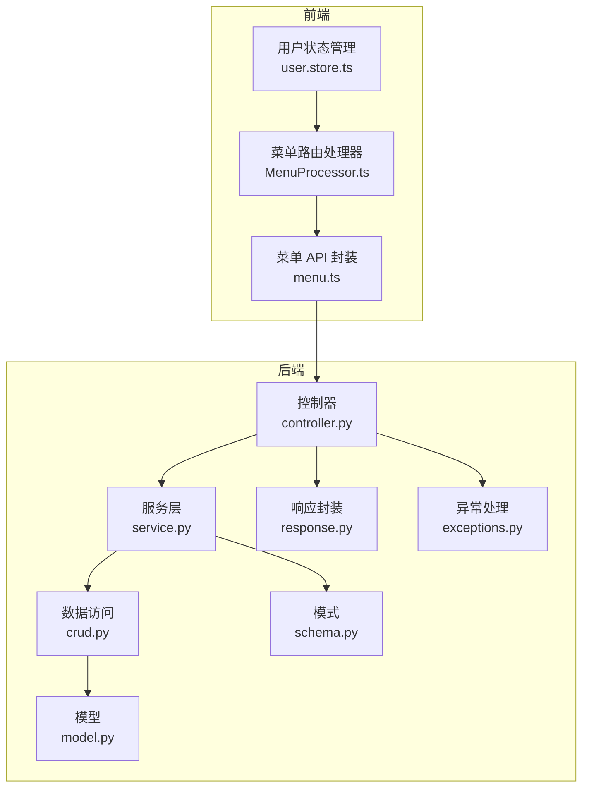
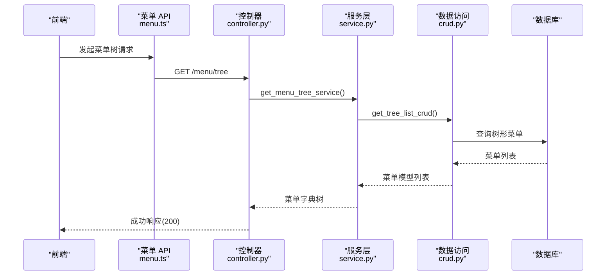
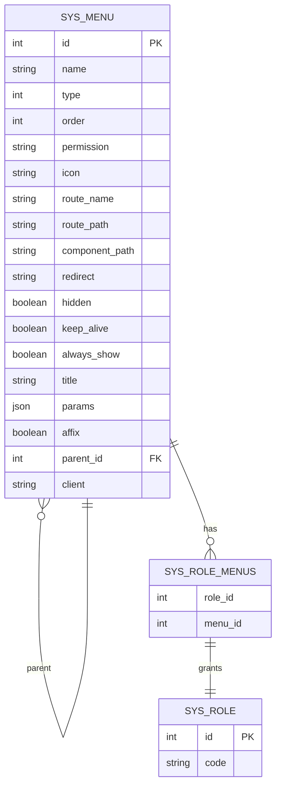
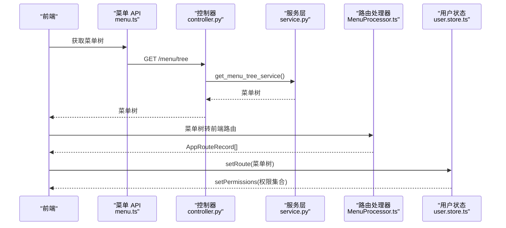
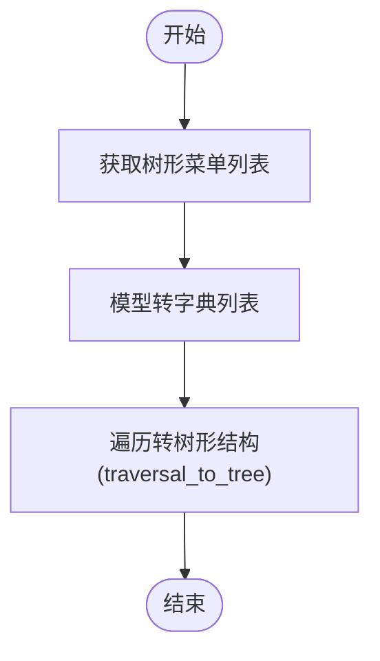
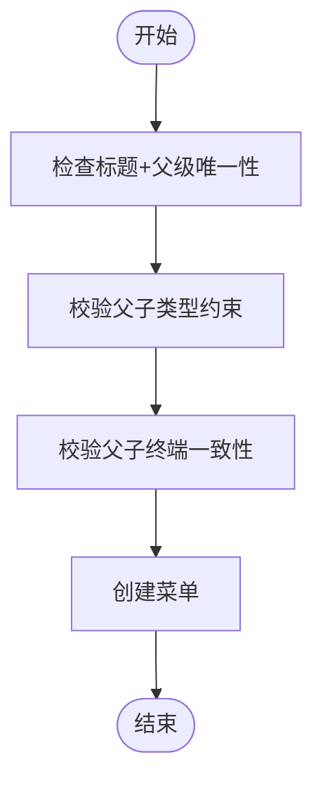
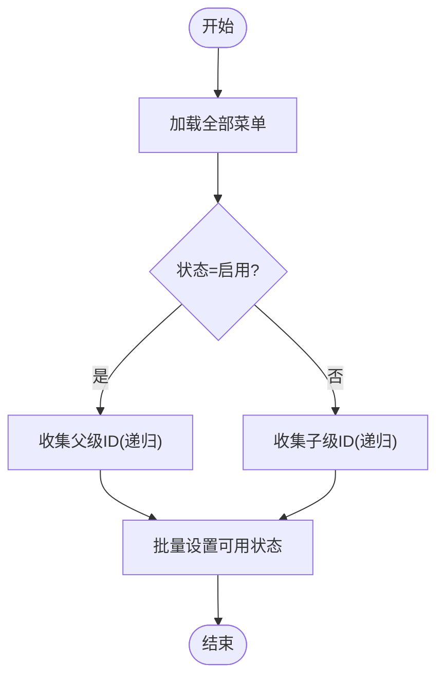
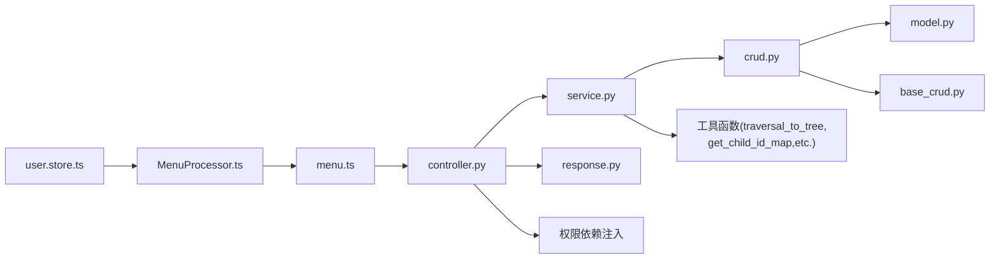

# 菜单管理 API

<cite>
**本文引用的文件**
- [controller.py](file://backend/app/api/v1/module_system/menu/controller.py)
- [service.py](file://backend/app/api/v1/module_system/menu/service.py)
- [crud.py](file://backend/app/api/v1/module_system/menu/crud.py)
- [model.py](file://backend/app/api/v1/module_system/menu/model.py)
- [schema.py](file://backend/app/api/v1/module_system/menu/schema.py)
- [response.py](file://backend/app/common/response.py)
- [exceptions.py](file://backend/app/core/exceptions.py)
- [menu.ts](file://frontend/web/src/api/module_system/menu.ts)
- [MenuProcessor.ts](file://frontend/web/src/router/MenuProcessor.ts)
- [user.store.ts](file://frontend/web/src/store/modules/user.store.ts)
- [enums.py](file://backend/app/common/enums.py)
- [base_schema.py](file://backend/app/core/base_schema.py)
</cite>

## 目录
1. [简介](#简介)
2. [项目结构](#项目结构)
3. [核心组件](#核心组件)
4. [架构总览](#架构总览)
5. [详细组件分析](#详细组件分析)
6. [依赖分析](#依赖分析)
7. [性能考虑](#性能考虑)
8. [故障排查指南](#故障排查指南)
9. [结论](#结论)
10. [附录](#附录)

## 简介
本文件为菜单管理模块的完整 API 接口文档，覆盖菜单结构管理、权限控制、菜单树形结构、动态菜单生成与前端路由映射等能力。文档详细说明每个接口的 HTTP 方法、URL 路径、请求参数、响应格式、错误码，并提供菜单创建、修改、删除、查询、排序、权限设置等操作的流程图与序列图，帮助开发者快速理解与集成。

## 项目结构
菜单管理模块位于后端的系统模块中，采用典型的分层架构：控制器（Controller）负责路由与鉴权，服务（Service）实现业务逻辑，数据访问（CRUD）封装数据库操作，模型（Model）定义表结构与关系，模式（Schema）定义请求/响应数据结构。前端通过 API 层与后端交互，再由路由处理器将菜单树转换为前端路由。

图表来源
- [controller.py:16-166](file://backend/app/api/v1/module_system/menu/controller.py#L16-L166)
- [service.py:23-245](file://backend/app/api/v1/module_system/menu/service.py#L23-L245)
- [crud.py:10-97](file://backend/app/api/v1/module_system/menu/crud.py#L10-L97)
- [model.py:13-103](file://backend/app/api/v1/module_system/menu/model.py#L13-L103)
- [schema.py:11-168](file://backend/app/api/v1/module_system/menu/schema.py#L11-L168)
- [response.py:26-102](file://backend/app/common/response.py#L26-L102)
- [exceptions.py:57-248](file://backend/app/core/exceptions.py#L57-L248)
- [menu.ts:1-111](file://frontend/web/src/api/module_system/menu.ts#L1-L111)
- [MenuProcessor.ts:151-390](file://frontend/web/src/router/MenuProcessor.ts#L151-L390)
- [user.store.ts:177-235](file://frontend/web/src/store/modules/user.store.ts#L177-L235)

章节来源
- [controller.py:16-166](file://backend/app/api/v1/module_system/menu/controller.py#L16-L166)
- [service.py:23-245](file://backend/app/api/v1/module_system/menu/service.py#L23-L245)
- [crud.py:10-97](file://backend/app/api/v1/module_system/menu/crud.py#L10-L97)
- [model.py:13-103](file://backend/app/api/v1/module_system/menu/model.py#L13-L103)
- [schema.py:11-168](file://backend/app/api/v1/module_system/menu/schema.py#L11-L168)
- [response.py:26-102](file://backend/app/common/response.py#L26-L102)
- [exceptions.py:57-248](file://backend/app/core/exceptions.py#L57-L248)
- [menu.ts:1-111](file://frontend/web/src/api/module_system/menu.ts#L1-L111)
- [MenuProcessor.ts:151-390](file://frontend/web/src/router/MenuProcessor.ts#L151-L390)
- [user.store.ts:177-235](file://frontend/web/src/store/modules/user.store.ts#L177-L235)

## 核心组件
- 控制器（Controller）：定义菜单管理相关路由，注入权限校验与日志记录，调用服务层执行业务逻辑。
- 服务层（Service）：实现菜单树构建、父子类型与终端一致性校验、批量状态变更、删除级联等业务规则。
- 数据访问（CRUD）：基于通用基类，提供树形列表、批量可用状态设置等数据库操作。
- 模型（Model）：定义菜单表结构、树形关系、角色关联及权限过滤策略。
- 模式（Schema）：定义菜单创建/更新/查询/输出的数据结构与校验规则。
- 响应与异常：统一封装响应格式与异常处理，保证前后端一致的错误语义。

章节来源
- [controller.py:16-166](file://backend/app/api/v1/module_system/menu/controller.py#L16-L166)
- [service.py:23-245](file://backend/app/api/v1/module_system/menu/service.py#L23-L245)
- [crud.py:10-97](file://backend/app/api/v1/module_system/menu/crud.py#L10-L97)
- [model.py:13-103](file://backend/app/api/v1/module_system/menu/model.py#L13-L103)
- [schema.py:11-168](file://backend/app/api/v1/module_system/menu/schema.py#L11-L168)
- [response.py:26-102](file://backend/app/common/response.py#L26-L102)
- [exceptions.py:57-248](file://backend/app/core/exceptions.py#L57-L248)

## 架构总览
菜单管理的请求从前端发起，经控制器鉴权与参数解析，进入服务层进行业务处理，最终通过 CRUD 访问数据库，返回统一响应格式。前端通过菜单 API 获取树形菜单，再由路由处理器转换为前端路由并注入守卫。

图表来源
- [menu.ts:6-12](file://frontend/web/src/api/module_system/menu.ts#L6-L12)
- [controller.py:19-44](file://backend/app/api/v1/module_system/menu/controller.py#L19-L44)
- [service.py:90-114](file://backend/app/api/v1/module_system/menu/service.py#L90-L114)
- [crud.py:61-83](file://backend/app/api/v1/module_system/menu/crud.py#L61-L83)

## 详细组件分析

### 接口清单与规范
- 基础路径：/menu
- 鉴权：每个接口均通过权限依赖注入进行鉴权，权限键命名规范为 module_system:menu:{action}
- 响应：统一使用响应封装，包含 code、msg、data、status_code、success
- 错误：自定义异常统一由全局异常处理器转换为标准错误响应

章节来源
- [controller.py:16-166](file://backend/app/api/v1/module_system/menu/controller.py#L16-L166)
- [response.py:26-102](file://backend/app/common/response.py#L26-L102)
- [exceptions.py:57-248](file://backend/app/core/exceptions.py#L57-L248)

#### 查询菜单树
- 方法：GET
- 路径：/menu/tree
- 权限键：module_system:menu:query
- 查询参数（来自查询模型）：
  - name：菜单名称（模糊）
  - route_path：路由地址（模糊）
  - component_path：组件路径（模糊）
  - type：菜单类型（1:目录 2:菜单 3:按钮 4:外链）
  - permission：权限标识（模糊）
  - description：描述（模糊）
  - status：是否启用
  - created_time：创建时间范围
  - updated_time：更新时间范围
  - created_id：创建人
  - updated_id：更新人
  - menu_client：终端 pc/app
- 响应：菜单树形结构（字典数组），按 order 升序排列
- 示例场景：后台菜单管理列表、前端侧边栏渲染

章节来源
- [controller.py:19-44](file://backend/app/api/v1/module_system/menu/controller.py#L19-L44)
- [schema.py:108-168](file://backend/app/api/v1/module_system/menu/schema.py#L108-L168)
- [service.py:90-114](file://backend/app/api/v1/module_system/menu/service.py#L90-L114)
- [crud.py:61-83](file://backend/app/api/v1/module_system/menu/crud.py#L61-L83)

#### 查询菜单详情
- 方法：GET
- 路径：/menu/detail/{id}
- 权限键：module_system:menu:detail
- 路径参数：
  - id：菜单ID
- 响应：菜单详情对象（包含父级名称）
- 示例场景：编辑菜单时回显数据

章节来源
- [controller.py:46-68](file://backend/app/api/v1/module_system/menu/controller.py#L46-L68)
- [service.py:68-88](file://backend/app/api/v1/module_system/menu/service.py#L68-L88)
- [crud.py:26-40](file://backend/app/api/v1/module_system/menu/crud.py#L26-L40)

#### 创建菜单
- 方法：POST
- 路径：/menu/create
- 权限键：module_system:menu:create
- 请求体（来自创建模型）：
  - name、type、order、permission、icon、route_name、route_path、component_path、redirect、hidden、keep_alive、always_show、title、params、affix、parent_id、status、description、client
- 校验规则：
  - 路由路径必须以 / 开头
  - 组件路径不能以 / 开头
  - 父子类型约束：目录仅允许目录/菜单/外链；菜单仅允许按钮；按钮/外链不可挂子级
  - 子菜单终端须与父菜单一致
  - 标题+父级唯一性校验
- 响应：创建后的菜单对象
- 示例场景：新增一级目录、二级菜单、按钮权限等

章节来源
- [controller.py:70-92](file://backend/app/api/v1/module_system/menu/controller.py#L70-L92)
- [schema.py:11-92](file://backend/app/api/v1/module_system/menu/schema.py#L11-L92)
- [service.py:117-140](file://backend/app/api/v1/module_system/menu/service.py#L117-L140)
- [enums.py:94-109](file://backend/app/common/enums.py#L94-L109)

#### 修改菜单
- 方法：PUT
- 路径：/menu/update/{id}
- 权限键：module_system:menu:update
- 路径参数：
  - id：菜单ID
- 请求体（来自更新模型）：同创建模型
- 校验规则：同创建菜单
- 响应：更新后的菜单对象
- 示例场景：调整菜单排序、修改路由、切换可用状态

章节来源
- [controller.py:94-118](file://backend/app/api/v1/module_system/menu/controller.py#L94-L118)
- [service.py:143-179](file://backend/app/api/v1/module_system/menu/service.py#L143-L179)
- [schema.py:94-98](file://backend/app/api/v1/module_system/menu/schema.py#L94-L98)

#### 删除菜单
- 方法：DELETE
- 路径：/menu/delete
- 权限键：module_system:menu:delete
- 请求体：
  - ids：菜单ID列表（支持批量）
- 行为：递归删除所选菜单及其所有子菜单
- 响应：空数据
- 示例场景：批量删除目录及其子菜单

章节来源
- [controller.py:120-142](file://backend/app/api/v1/module_system/menu/controller.py#L120-L142)
- [service.py:182-214](file://backend/app/api/v1/module_system/menu/service.py#L182-L214)
- [crud.py:85-97](file://backend/app/api/v1/module_system/menu/crud.py#L85-L97)

#### 批量修改菜单状态
- 方法：PATCH
- 路径：/menu/available/setting
- 权限键：module_system:menu:patch
- 请求体（来自批量设置模型）：
  - ids：菜单ID列表
  - status：是否可用（0:启用 1:禁用）
- 行为：启用时递归激活所有父级；禁用时递归禁用所有子级
- 响应：空数据
- 示例场景：启用/禁用某目录及其全部子菜单

章节来源
- [controller.py:144-166](file://backend/app/api/v1/module_system/menu/controller.py#L144-L166)
- [service.py:217-245](file://backend/app/api/v1/module_system/menu/service.py#L217-L245)
- [base_schema.py:52-57](file://backend/app/core/base_schema.py#L52-L57)

### 数据模型与关系
菜单模型支持树形结构与角色关联，具备权限过滤策略，便于基于角色的菜单权限控制。

图表来源
- [model.py:24-103](file://backend/app/api/v1/module_system/menu/model.py#L24-L103)

章节来源
- [model.py:13-103](file://backend/app/api/v1/module_system/menu/model.py#L13-L103)

### 权限控制与动态菜单生成
- 后端权限：
  - 控制器通过权限依赖注入校验 module_system:menu:* 类权限键
  - 菜单模型采用基于角色的权限过滤策略
- 前端权限：
  - 用户登录后，后端返回菜单树；前端根据用户角色与菜单权限标识生成路由
  - 路由处理器对菜单进行路径规范化、组件映射与可见性过滤
  - 用户状态管理收集权限标识，供前端指令与组件使用

图表来源
- [menu.ts:6-12](file://frontend/web/src/api/module_system/menu.ts#L6-L12)
- [controller.py:19-44](file://backend/app/api/v1/module_system/menu/controller.py#L19-L44)
- [service.py:90-114](file://backend/app/api/v1/module_system/menu/service.py#L90-L114)
- [MenuProcessor.ts:151-222](file://frontend/web/src/router/MenuProcessor.ts#L151-L222)
- [user.store.ts:177-235](file://frontend/web/src/store/modules/user.store.ts#L177-L235)

章节来源
- [controller.py:16-166](file://backend/app/api/v1/module_system/menu/controller.py#L16-L166)
- [model.py:27-27](file://backend/app/api/v1/module_system/menu/model.py#L27-L27)
- [MenuProcessor.ts:151-390](file://frontend/web/src/router/MenuProcessor.ts#L151-L390)
- [user.store.ts:177-235](file://frontend/web/src/store/modules/user.store.ts#L177-L235)

### 复杂逻辑流程图

#### 菜单树构建流程

图表来源
- [service.py:90-114](file://backend/app/api/v1/module_system/menu/service.py#L90-L114)
- [crud.py:61-83](file://backend/app/api/v1/module_system/menu/crud.py#L61-L83)

#### 菜单创建校验流程

图表来源
- [service.py:117-140](file://backend/app/api/v1/module_system/menu/service.py#L117-L140)
- [schema.py:40-92](file://backend/app/api/v1/module_system/menu/schema.py#L40-L92)

#### 批量状态变更流程

图表来源
- [service.py:217-245](file://backend/app/api/v1/module_system/menu/service.py#L217-L245)
- [crud.py:85-97](file://backend/app/api/v1/module_system/menu/crud.py#L85-L97)

## 依赖分析
- 控制器依赖服务层与权限依赖注入，响应统一由响应封装提供
- 服务层依赖 CRUD 与工具函数，进行树形构建与状态递归处理
- CRUD 依赖通用基类与模型，提供树形列表与批量状态设置
- 模型定义树形关系与角色关联，配合权限过滤策略
- 前端依赖 API 封装与路由处理器，完成菜单树到路由的映射

图表来源
- [controller.py:1-16](file://backend/app/api/v1/module_system/menu/controller.py#L1-L16)
- [service.py:1-21](file://backend/app/api/v1/module_system/menu/service.py#L1-L21)
- [crud.py:1-8](file://backend/app/api/v1/module_system/menu/crud.py#L1-L8)
- [model.py:1-12](file://backend/app/api/v1/module_system/menu/model.py#L1-L12)
- [menu.ts:1-5](file://frontend/web/src/api/module_system/menu.ts#L1-L5)
- [MenuProcessor.ts:1-14](file://frontend/web/src/router/MenuProcessor.ts#L1-L14)
- [user.store.ts:1-18](file://frontend/web/src/store/modules/user.store.ts#L1-L18)

章节来源
- [controller.py:1-16](file://backend/app/api/v1/module_system/menu/controller.py#L1-L16)
- [service.py:1-21](file://backend/app/api/v1/module_system/menu/service.py#L1-L21)
- [crud.py:1-8](file://backend/app/api/v1/module_system/menu/crud.py#L1-L8)
- [model.py:1-12](file://backend/app/api/v1/module_system/menu/model.py#L1-L12)
- [menu.ts:1-5](file://frontend/web/src/api/module_system/menu.ts#L1-L5)
- [MenuProcessor.ts:1-14](file://frontend/web/src/router/MenuProcessor.ts#L1-L14)
- [user.store.ts:1-18](file://frontend/web/src/store/modules/user.store.ts#L1-L18)

## 性能考虑
- 树形查询使用预加载 children 关系，减少 N+1 查询
- 批量状态变更通过 ID 映射与递归收集，避免逐条更新
- 菜单列表默认按 order 升序，减少前端排序开销
- 前端路由生成阶段一次性处理菜单树，避免重复计算

## 故障排查指南
- 参数校验错误：请求体字段类型不符或必填缺失，返回 422，message 为具体提示
- 自定义业务异常：如菜单类型不合法、父级不存在、标题重复等，返回对应业务码与消息
- 数据库异常：SQLAlchemyError 统一包装为 400，message 提示数据库操作失败
- 未捕获异常：返回 500，message 为服务器内部错误

章节来源
- [exceptions.py:107-248](file://backend/app/core/exceptions.py#L107-L248)
- [response.py:26-102](file://backend/app/common/response.py#L26-L102)

## 结论
菜单管理模块通过清晰的分层设计与严格的权限控制，提供了完整的菜单结构管理能力。后端统一响应与异常处理保障了接口稳定性，前端路由处理器实现了菜单树到路由的无缝映射，结合用户权限集合，支持动态菜单生成与细粒度的页面内按钮权限控制。

## 附录

### 响应与错误码约定
- 成功响应：code=200，success=true，data 为具体数据
- 错误响应：统一使用 ResponseSchema，包含 code、msg、status_code、success

章节来源
- [response.py:26-102](file://backend/app/common/response.py#L26-L102)