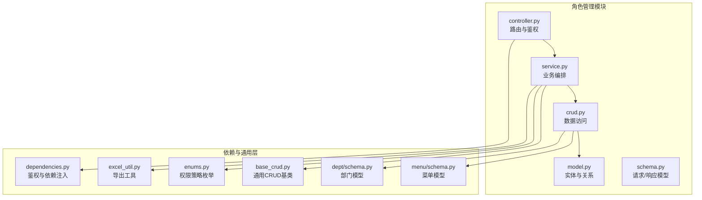
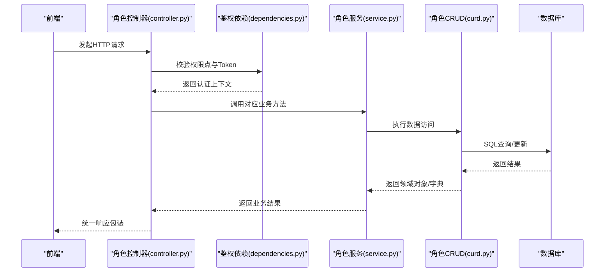
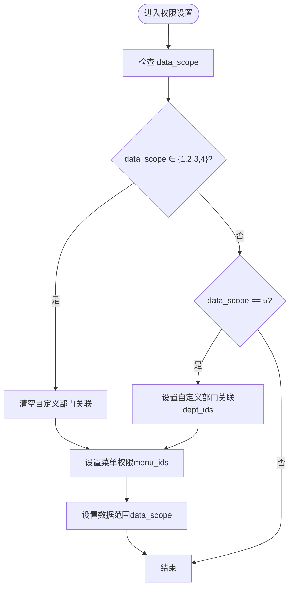
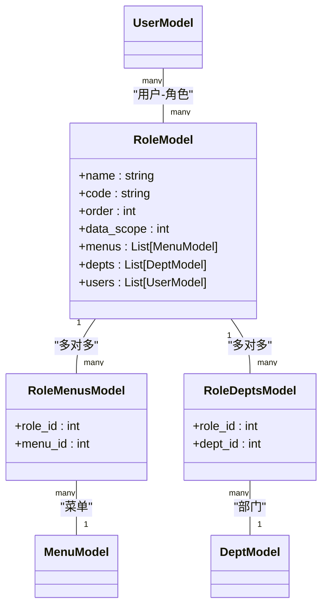

# 角色管理 API

<cite>
**本文引用的文件**
- [backend/app/api/v1/module_system/role/controller.py](file://backend/app/api/v1/module_system/role/controller.py)
- [backend/app/api/v1/module_system/role/crud.py](file://backend/app/api/v1/module_system/role/crud.py)
- [backend/app/api/v1/module_system/role/model.py](file://backend/app/api/v1/module_system/role/model.py)
- [backend/app/api/v1/module_system/role/schema.py](file://backend/app/api/v1/module_system/role/schema.py)
- [backend/app/api/v1/module_system/role/service.py](file://backend/app/api/v1/module_system/role/service.py)
- [backend/app/api/v1/module_system/menu/schema.py](file://backend/app/api/v1/module_system/menu/schema.py)
- [backend/app/api/v1/module_system/dept/schema.py](file://backend/app/api/v1/module_system/dept/schema.py)
- [backend/app/core/base_crud.py](file://backend/app/core/base_crud.py)
- [backend/app/core/dependencies.py](file://backend/app/core/dependencies.py)
- [backend/app/common/enums.py](file://backend/app/common/enums.py)
- [backend/app/utils/excel_util.py](file://backend/app/utils/excel_util.py)
- [frontend/web/src/api/module_system/role.ts](file://frontend/web/src/api/module_system/role.ts)
</cite>

## 目录
1. [简介](#简介)
2. [项目结构](#项目结构)
3. [核心组件](#核心组件)
4. [架构总览](#架构总览)
5. [详细组件分析](#详细组件分析)
6. [依赖分析](#依赖分析)
7. [性能考虑](#性能考虑)
8. [故障排查指南](#故障排查指南)
9. [结论](#结论)
10. [附录](#附录)

## 简介
本文件为“角色管理”模块的完整 API 接口文档，覆盖角色基本信息管理、权限分配、角色与用户关联等核心能力。内容包括：
- 角色 CRUD 操作（创建、查询、更新、删除）
- 角色列表分页查询与导出
- 角色状态批量设置
- 角色权限设置（菜单权限、数据范围、部门权限）
- 权限控制机制、菜单权限分配与数据访问限制说明
- 实际使用场景与接口调用示例

## 项目结构
角色管理模块位于后端模块系统子目录下，采用标准的 MVC 分层设计：
- controller 层：定义路由、鉴权与参数依赖
- service 层：封装业务逻辑与流程编排
- crud 层：封装数据访问与关系维护
- model 层：定义实体与多对多关系
- schema 层：定义请求/响应模型与校验器

图表来源
- [backend/app/api/v1/module_system/role/controller.py:1-244](file://backend/app/api/v1/module_system/role/controller.py#L1-L244)
- [backend/app/api/v1/module_system/role/service.py:1-242](file://backend/app/api/v1/module_system/role/service.py#L1-L242)
- [backend/app/api/v1/module_system/role/crud.py:1-135](file://backend/app/api/v1/module_system/role/crud.py#L1-L135)
- [backend/app/api/v1/module_system/role/model.py:1-100](file://backend/app/api/v1/module_system/role/model.py#L1-L100)
- [backend/app/api/v1/module_system/role/schema.py:1-126](file://backend/app/api/v1/module_system/role/schema.py#L1-L126)
- [backend/app/core/base_crud.py:1-200](file://backend/app/core/base_crud.py#L1-L200)
- [backend/app/core/dependencies.py:1-200](file://backend/app/core/dependencies.py#L1-L200)
- [backend/app/common/enums.py:1-122](file://backend/app/common/enums.py#L1-L122)
- [backend/app/utils/excel_util.py:1-111](file://backend/app/utils/excel_util.py#L1-L111)
- [backend/app/api/v1/module_system/menu/schema.py:1-168](file://backend/app/api/v1/module_system/menu/schema.py#L1-L168)
- [backend/app/api/v1/module_system/dept/schema.py:1-102](file://backend/app/api/v1/module_system/dept/schema.py#L1-L102)

章节来源
- [backend/app/api/v1/module_system/role/controller.py:1-244](file://backend/app/api/v1/module_system/role/controller.py#L1-L244)
- [backend/app/api/v1/module_system/role/service.py:1-242](file://backend/app/api/v1/module_system/role/service.py#L1-L242)
- [backend/app/api/v1/module_system/role/crud.py:1-135](file://backend/app/api/v1/module_system/role/crud.py#L1-L135)
- [backend/app/api/v1/module_system/role/model.py:1-100](file://backend/app/api/v1/module_system/role/model.py#L1-L100)
- [backend/app/api/v1/module_system/role/schema.py:1-126](file://backend/app/api/v1/module_system/role/schema.py#L1-L126)

## 核心组件
- 控制器（Controller）：定义所有角色相关接口，统一鉴权与参数依赖，返回统一响应包装。
- 服务（Service）：实现业务流程，如分页查询、创建/更新/删除、权限设置、导出等。
- 数据访问（CRUD）：基于通用基类，提供查询、分页、批量设置状态、设置菜单/部门/数据范围等能力。
- 模型（Model）：定义角色实体、角色-菜单多对多、角色-部门多对多关系，并声明权限过滤策略。
- 模式（Schema）：定义请求/响应模型、查询参数模型与字段校验。

章节来源
- [backend/app/api/v1/module_system/role/controller.py:24-244](file://backend/app/api/v1/module_system/role/controller.py#L24-L244)
- [backend/app/api/v1/module_system/role/service.py:18-242](file://backend/app/api/v1/module_system/role/service.py#L18-L242)
- [backend/app/api/v1/module_system/role/crud.py:12-135](file://backend/app/api/v1/module_system/role/crud.py#L12-L135)
- [backend/app/api/v1/module_system/role/model.py:64-100](file://backend/app/api/v1/module_system/role/model.py#L64-L100)
- [backend/app/api/v1/module_system/role/schema.py:21-126](file://backend/app/api/v1/module_system/role/schema.py#L21-L126)

## 架构总览
角色管理接口遵循统一鉴权与响应规范，控制器负责路由与权限点校验，服务层编排业务，CRUD 层执行数据库操作，模型定义关系与权限策略，Excel 工具支持导出。

图表来源
- [backend/app/api/v1/module_system/role/controller.py:27-244](file://backend/app/api/v1/module_system/role/controller.py#L27-L244)
- [backend/app/core/dependencies.py:44-129](file://backend/app/core/dependencies.py#L44-L129)
- [backend/app/api/v1/module_system/role/service.py:18-242](file://backend/app/api/v1/module_system/role/service.py#L18-L242)
- [backend/app/api/v1/module_system/role/crud.py:12-135](file://backend/app/api/v1/module_system/role/crud.py#L12-L135)

## 详细组件分析

### 接口清单与规范
- 基础路径：/system/role（前端定义）
- 控制器前缀：/role（后端定义），最终对外路径为 /system/role + 控制器路径
- 鉴权：每个接口均依赖权限点校验，例如 module_system:role:list、module_system:role:detail、module_system:role:create、module_system:role:update、module_system:role:delete、module_system:role:patch、module_system:role:permission、module_system:role:export
- 统一响应：SuccessResponse/StreamResponse 包装，包含 msg、code、data 等字段

章节来源
- [frontend/web/src/api/module_system/role.ts:1-120](file://frontend/web/src/api/module_system/role.ts#L1-L120)
- [backend/app/api/v1/module_system/role/controller.py:24-244](file://backend/app/api/v1/module_system/role/controller.py#L24-L244)

### 角色列表查询
- 方法与路径
  - GET /system/role/list
- 权限点
  - module_system:role:query
- 请求参数（查询参数）
  - name: 角色名称（模糊匹配）
  - status: 启用状态（精确匹配）
  - created_time: 创建时间范围（数组，两个时间值）
  - updated_time: 更新时间范围（数组，两个时间值）
  - 分页参数：page_no、page_size（由分页依赖提供）
- 响应
  - 成功：分页结果（包含 total、records 列表）
- 错误码
  - 10401：认证失效/非法凭证
  - 其他：业务异常由统一异常处理返回

章节来源
- [backend/app/api/v1/module_system/role/controller.py:27-61](file://backend/app/api/v1/module_system/role/controller.py#L27-L61)
- [backend/app/api/v1/module_system/role/service.py:57-86](file://backend/app/api/v1/module_system/role/service.py#L57-L86)
- [backend/app/api/v1/module_system/role/schema.py:93-126](file://backend/app/api/v1/module_system/role/schema.py#L93-L126)

### 角色详情查询
- 方法与路径
  - GET /system/role/detail/{id}
- 权限点
  - module_system:role:detail
- 路径参数
  - id: 角色ID
- 响应
  - 成功：角色详情（包含 menus、depts）
- 错误码
  - 10401：认证失效/非法凭证
  - 其他：业务异常

章节来源
- [backend/app/api/v1/module_system/role/controller.py:63-85](file://backend/app/api/v1/module_system/role/controller.py#L63-L85)
- [backend/app/api/v1/module_system/role/service.py:21-34](file://backend/app/api/v1/module_system/role/service.py#L21-L34)

### 角色创建
- 方法与路径
  - POST /system/role/create
- 权限点
  - module_system:role:create
- 请求体
  - name: 角色名称（必填）
  - code: 角色编码（必填，唯一）
  - order: 显示排序（默认 1）
  - data_scope: 数据权限范围（默认 1）
  - status: 是否启用（默认 0）
  - description: 描述（可选）
- 响应
  - 成功：新创建的角色详情
- 错误码
  - 10401：认证失效/非法凭证
  - 其他：业务异常（如名称/编码重复）

章节来源
- [backend/app/api/v1/module_system/role/controller.py:88-111](file://backend/app/api/v1/module_system/role/controller.py#L88-L111)
- [backend/app/api/v1/module_system/role/schema.py:21-50](file://backend/app/api/v1/module_system/role/schema.py#L21-L50)
- [backend/app/api/v1/module_system/role/service.py:88-108](file://backend/app/api/v1/module_system/role/service.py#L88-L108)

### 角色更新
- 方法与路径
  - PUT /system/role/update/{id}
- 权限点
  - module_system:role:update
- 路径参数
  - id: 角色ID
- 请求体
  - name/code/order/status/description（同创建，按需更新）
- 响应
  - 成功：更新后的角色详情
- 错误码
  - 10401：认证失效/非法凭证
  - 其他：业务异常（如不存在、名称/编码冲突）

章节来源
- [backend/app/api/v1/module_system/role/controller.py:113-138](file://backend/app/api/v1/module_system/role/controller.py#L113-L138)
- [backend/app/api/v1/module_system/role/service.py:109-133](file://backend/app/api/v1/module_system/role/service.py#L109-L133)

### 角色删除
- 方法与路径
  - DELETE /system/role/delete
- 权限点
  - module_system:role:delete
- 请求体
  - ids: 角色ID列表（数组）
- 响应
  - 成功：空数据
- 错误码
  - 10401：认证失效/非法凭证
  - 其他：业务异常（如对象为空、角色不存在）

章节来源
- [backend/app/api/v1/module_system/role/controller.py:140-163](file://backend/app/api/v1/module_system/role/controller.py#L140-L163)
- [backend/app/api/v1/module_system/role/service.py:134-153](file://backend/app/api/v1/module_system/role/service.py#L134-L153)

### 批量设置角色状态
- 方法与路径
  - PATCH /system/role/available/setting
- 权限点
  - module_system:role:patch
- 请求体
  - ids: 角色ID列表
  - status: 目标状态（启用/停用）
- 响应
  - 成功：空数据
- 错误码
  - 10401：认证失效/非法凭证
  - 其他：业务异常

章节来源
- [backend/app/api/v1/module_system/role/controller.py:165-188](file://backend/app/api/v1/module_system/role/controller.py#L165-L188)
- [backend/app/api/v1/module_system/role/service.py:182-194](file://backend/app/api/v1/module_system/role/service.py#L182-L194)

### 角色权限设置（菜单/数据范围/部门）
- 方法与路径
  - PATCH /system/role/permission/setting
- 权限点
  - module_system:role:permission
- 请求体
  - data_scope: 数据权限范围（1~5）
  - role_ids: 角色ID列表
  - menu_ids: 菜单ID列表（未勾选时可为空，表示清空）
  - dept_ids: 部门ID列表（仅在 data_scope=5 时生效，未勾选时清空）
- 响应
  - 成功：空数据
- 错误码
  - 10401：认证失效/非法凭证
  - 其他：业务异常

图表来源
- [backend/app/api/v1/module_system/role/service.py:154-181](file://backend/app/api/v1/module_system/role/service.py#L154-L181)
- [backend/app/api/v1/module_system/role/crud.py:60-122](file://backend/app/api/v1/module_system/role/crud.py#L60-L122)

章节来源
- [backend/app/api/v1/module_system/role/controller.py:190-213](file://backend/app/api/v1/module_system/role/controller.py#L190-L213)
- [backend/app/api/v1/module_system/role/service.py:154-181](file://backend/app/api/v1/module_system/role/service.py#L154-L181)
- [backend/app/api/v1/module_system/role/crud.py:60-122](file://backend/app/api/v1/module_system/role/crud.py#L60-L122)

### 角色导出
- 方法与路径
  - POST /system/role/export
- 权限点
  - module_system:role:export
- 请求体
  - 查询参数：同列表查询（name、status、created_time、updated_time）
- 响应
  - 成功：Excel 文件流（application/vnd.openxmlformats-officedocument.spreadsheetml.sheet）
- 错误码
  - 10401：认证失效/非法凭证
  - 其他：业务异常

章节来源
- [backend/app/api/v1/module_system/role/controller.py:215-244](file://backend/app/api/v1/module_system/role/controller.py#L215-L244)
- [backend/app/api/v1/module_system/role/service.py:196-242](file://backend/app/api/v1/module_system/role/service.py#L196-L242)
- [backend/app/utils/excel_util.py:93-111](file://backend/app/utils/excel_util.py#L93-L111)

### 前端调用示例
- 列表查询：GET /system/role/list（携带分页与查询参数）
- 详情查询：GET /system/role/detail/{id}
- 创建：POST /system/role/create（body：角色表单）
- 更新：PUT /system/role/update/{id}（body：角色表单）
- 删除：DELETE /system/role/delete（body：[ids]）
- 批量状态：PATCH /system/role/available/setting（body：{ids,status}）
- 权限设置：PATCH /system/role/permission/setting（body：{data_scope,role_ids,menu_ids,dept_ids}）
- 导出：POST /system/role/export（body：查询参数，responseType: blob）

章节来源
- [frontend/web/src/api/module_system/role.ts:5-69](file://frontend/web/src/api/module_system/role.ts#L5-L69)

## 依赖分析
- 鉴权依赖
  - 通过 AuthPermission 依赖注入，校验权限点与 Token 有效性
  - 当前用户上下文包含可用角色与职位过滤
- 权限过滤策略
  - 角色模型声明了基于“当前用户绑定角色”的权限过滤策略
  - 通用 CRUD 基类在查询时应用权限过滤
- 多对多关系
  - 角色-菜单：sys_role_menus
  - 角色-部门：sys_role_depts
- 数据范围与部门权限
  - data_scope=5 时启用自定义部门权限，否则清空部门关联

图表来源
- [backend/app/api/v1/module_system/role/model.py:64-100](file://backend/app/api/v1/module_system/role/model.py#L64-L100)
- [backend/app/api/v1/module_system/role/crud.py:60-122](file://backend/app/api/v1/module_system/role/crud.py#L60-L122)
- [backend/app/api/v1/module_system/menu/schema.py:1-168](file://backend/app/api/v1/module_system/menu/schema.py#L1-L168)
- [backend/app/api/v1/module_system/dept/schema.py:1-102](file://backend/app/api/v1/module_system/dept/schema.py#L1-L102)

章节来源
- [backend/app/core/dependencies.py:44-129](file://backend/app/core/dependencies.py#L44-L129)
- [backend/app/common/enums.py:111-122](file://backend/app/common/enums.py#L111-L122)
- [backend/app/core/base_crud.py:43-104](file://backend/app/core/base_crud.py#L43-L104)

## 性能考虑
- 分页查询
  - 使用 OFFSET/LIMIT 分页，避免一次性加载大量数据
  - 通用基类对 count 查询进行优化（优先使用主键计数）
- 预加载
  - 角色模型默认预加载 menus、depts、users，减少 N+1 查询
- 权限过滤
  - 在查询阶段应用权限过滤，避免在应用层二次过滤
- 导出
  - 使用 pandas/openpyxl 导出列表，注意大数据量时的内存占用

章节来源
- [backend/app/api/v1/module_system/role/service.py:57-86](file://backend/app/api/v1/module_system/role/service.py#L57-L86)
- [backend/app/core/base_crud.py:151-200](file://backend/app/core/base_crud.py#L151-L200)
- [backend/app/api/v1/module_system/role/model.py:73-74](file://backend/app/api/v1/module_system/role/model.py#L73-L74)
- [backend/app/utils/excel_util.py:93-111](file://backend/app/utils/excel_util.py#L93-L111)

## 故障排查指南
- 认证失败（10401）
  - 检查请求头 Authorization 是否包含有效 Bearer Token
  - 确认 Token 未过期且用户在线状态正常
- 权限不足
  - 确认当前用户具备对应权限点（如 module_system:role:*）
- 业务异常
  - 角色名称/编码重复：检查唯一性约束
  - 角色不存在：确认 ID 正确
  - 删除对象为空：确认请求体 ids 非空
- 导出异常
  - 确认查询参数合法，导出数据量适中

章节来源
- [backend/app/core/dependencies.py:61-129](file://backend/app/core/dependencies.py#L61-L129)
- [backend/app/api/v1/module_system/role/service.py:100-153](file://backend/app/api/v1/module_system/role/service.py#L100-L153)

## 结论
角色管理模块提供了完善的 CRUD、权限设置与导出能力，结合统一鉴权与权限过滤策略，能够满足多场景下的角色与权限管理需求。建议在生产环境中关注分页与导出性能、权限点配置与数据范围策略的一致性。

## 附录

### 数据模型与字段说明
- 角色实体（sys_role）
  - name：角色名称
  - code：角色编码（唯一）
  - order：显示排序
  - data_scope：数据权限范围（1~5）
  - status：启用状态
  - menus：菜单列表
  - depts：部门列表
  - users：用户列表
- 关联表
  - sys_role_menus：角色-菜单多对多
  - sys_role_depts：角色-部门多对多

章节来源
- [backend/app/api/v1/module_system/role/model.py:64-100](file://backend/app/api/v1/module_system/role/model.py#L64-L100)

### 权限点对照
- 查询列表：module_system:role:query
- 查询详情：module_system:role:detail
- 创建：module_system:role:create
- 更新：module_system:role:update
- 删除：module_system:role:delete
- 批量状态：module_system:role:patch
- 权限设置：module_system:role:permission
- 导出：module_system:role:export

章节来源
- [backend/app/api/v1/module_system/role/controller.py:36-212](file://backend/app/api/v1/module_system/role/controller.py#L36-L212)