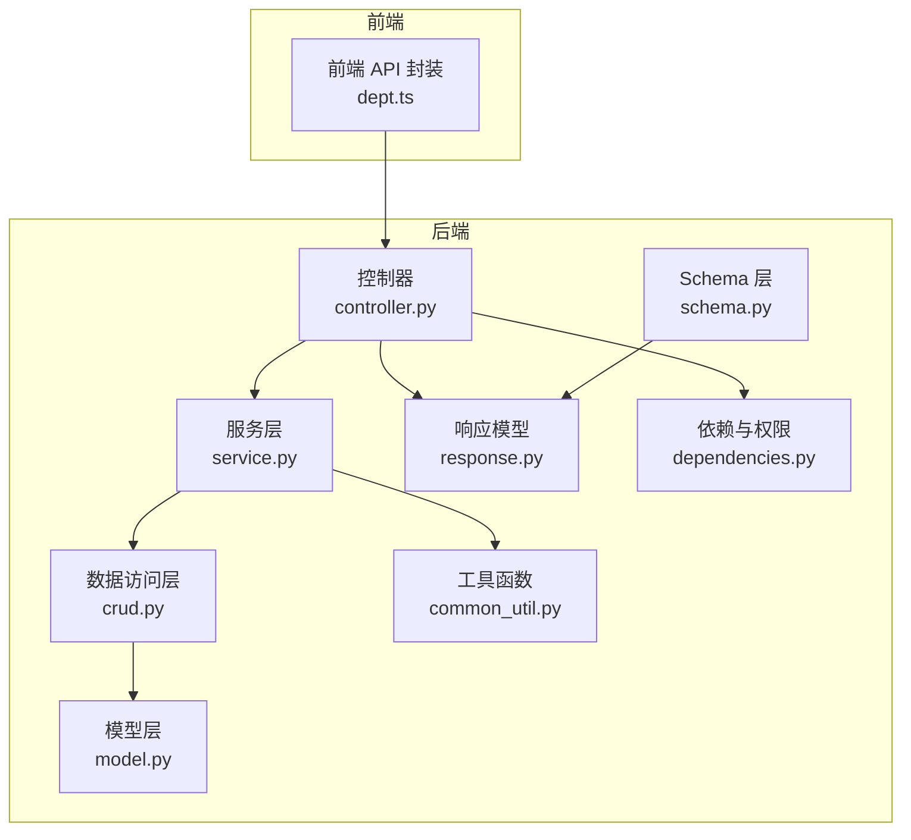
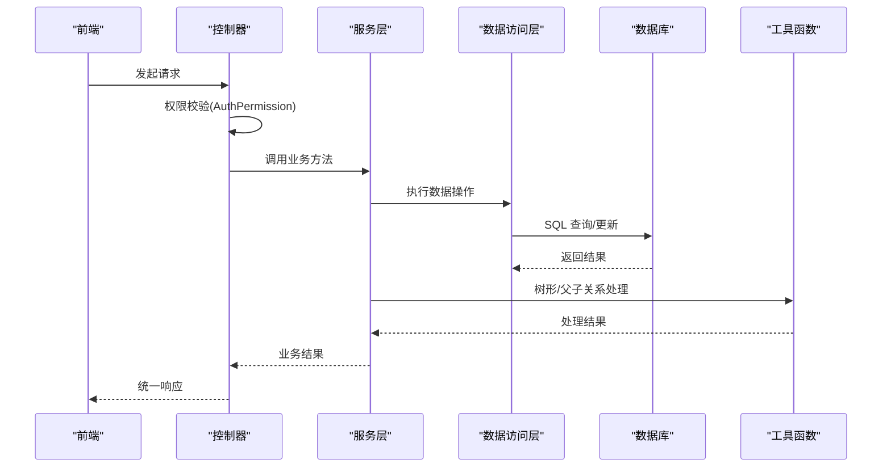
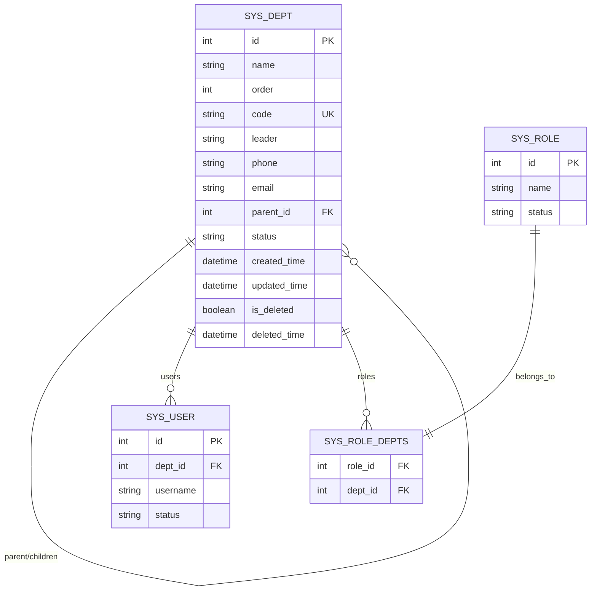
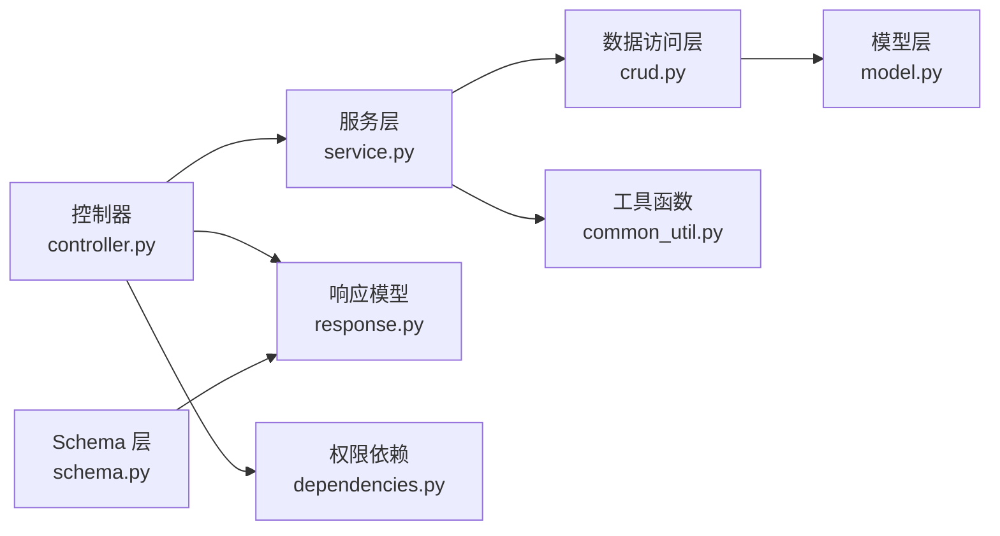

# 部门管理 API

<cite>
**本文档引用的文件**
- [controller.py](file://backend/app/api/v1/module_system/dept/controller.py)
- [service.py](file://backend/app/api/v1/module_system/dept/service.py)
- [crud.py](file://backend/app/api/v1/module_system/dept/crud.py)
- [schema.py](file://backend/app/api/v1/module_system/dept/schema.py)
- [model.py](file://backend/app/api/v1/module_system/dept/model.py)
- [response.py](file://backend/app/common/response.py)
- [base_schema.py](file://backend/app/core/base_schema.py)
- [dependencies.py](file://backend/app/core/dependencies.py)
- [common_util.py](file://backend/app/utils/common_util.py)
- [enums.py](file://backend/app/common/enums.py)
- [exceptions.py](file://backend/app/core/exceptions.py)
- [dept.ts](file://frontend/web/src/api/module_system/dept.ts)
</cite>

## 目录
1. [简介](#简介)
2. [项目结构](#项目结构)
3. [核心组件](#核心组件)
4. [架构总览](#架构总览)
5. [详细组件分析](#详细组件分析)
6. [依赖关系分析](#依赖关系分析)
7. [性能考量](#性能考量)
8. [故障排查指南](#故障排查指南)
9. [结论](#结论)
10. [附录](#附录)

## 简介
本文件为 FastapiAdmin 部门管理模块的完整 API 接口文档，覆盖组织架构管理、部门层级结构、数据权限控制等核心能力。文档详细记录了每个接口的 HTTP 方法、URL 路径、请求参数、响应格式与错误码，并提供部门创建、修改、删除、查询、层级管理等操作的说明与示例。同时解释部门数据权限控制机制、用户归属关系与数据隔离策略，帮助开发者与运维人员快速理解与集成。

## 项目结构
部门管理模块位于后端 API 层的 v1 版本下，采用标准的 MVC 分层设计：
- 控制器层：处理 HTTP 请求与响应，负责路由与鉴权
- 服务层：封装业务逻辑，协调 CRUD 操作与工具函数
- 数据访问层：基于通用基类实现部门数据的增删改查
- 模型层：定义数据库表结构与关系，支持树形结构与多对多关联
- Schema 层：定义请求与响应的数据模型与校验规则
- 前端 API：提供与后端接口一致的调用封装

图表来源
- [controller.py:1-190](file://backend/app/api/v1/module_system/dept/controller.py#L1-L190)
- [service.py:1-190](file://backend/app/api/v1/module_system/dept/service.py#L1-L190)
- [crud.py:1-110](file://backend/app/api/v1/module_system/dept/crud.py#L1-L110)
- [model.py:1-59](file://backend/app/api/v1/module_system/dept/model.py#L1-L59)
- [schema.py:1-102](file://backend/app/api/v1/module_system/dept/schema.py#L1-L102)
- [response.py:1-176](file://backend/app/common/response.py#L1-L176)
- [dependencies.py:1-296](file://backend/app/core/dependencies.py#L1-L296)
- [common_util.py:1-447](file://backend/app/utils/common_util.py#L1-L447)
- [dept.ts:1-83](file://frontend/web/src/api/module_system/dept.ts#L1-L83)

章节来源
- [controller.py:1-190](file://backend/app/api/v1/module_system/dept/controller.py#L1-L190)
- [service.py:1-190](file://backend/app/api/v1/module_system/dept/service.py#L1-L190)
- [crud.py:1-110](file://backend/app/api/v1/module_system/dept/crud.py#L1-L110)
- [model.py:1-59](file://backend/app/api/v1/module_system/dept/model.py#L1-L59)
- [schema.py:1-102](file://backend/app/api/v1/module_system/dept/schema.py#L1-L102)
- [response.py:1-176](file://backend/app/common/response.py#L1-L176)
- [dependencies.py:1-296](file://backend/app/core/dependencies.py#L1-L296)
- [common_util.py:1-447](file://backend/app/utils/common_util.py#L1-L447)
- [dept.ts:1-83](file://frontend/web/src/api/module_system/dept.ts#L1-L83)

## 核心组件
- 控制器：定义部门管理的 REST 接口，统一鉴权与日志记录
- 服务层：实现业务逻辑，包括树形结构构建、批量状态变更、父子关系处理
- 数据访问层：基于通用基类，提供树形列表、批量可用状态设置等能力
- 模型层：定义部门表结构、树形父子关系、与用户/角色的多对多关联
- Schema 层：定义创建、更新、查询参数与输出模型，包含字段校验
- 响应模型：统一的响应结构，便于前端解析
- 依赖与权限：统一的权限校验与用户上下文注入
- 工具函数：树形遍历、父子 ID 映射与递归计算

章节来源
- [controller.py:1-190](file://backend/app/api/v1/module_system/dept/controller.py#L1-L190)
- [service.py:1-190](file://backend/app/api/v1/module_system/dept/service.py#L1-L190)
- [crud.py:1-110](file://backend/app/api/v1/module_system/dept/crud.py#L1-L110)
- [model.py:1-59](file://backend/app/api/v1/module_system/dept/model.py#L1-L59)
- [schema.py:1-102](file://backend/app/api/v1/module_system/dept/schema.py#L1-L102)
- [response.py:1-176](file://backend/app/common/response.py#L1-L176)
- [dependencies.py:1-296](file://backend/app/core/dependencies.py#L1-L296)
- [common_util.py:1-447](file://backend/app/utils/common_util.py#L1-L447)

## 架构总览
部门管理模块遵循 FastAPI + SQLAlchemy 的分层架构，控制器负责路由与鉴权，服务层封装业务，数据访问层抽象数据库操作，模型层定义实体关系，Schema 层约束输入输出，响应模型统一输出格式，依赖与权限模块提供认证与权限校验，工具函数支撑树形结构与权限策略。

图表来源
- [controller.py:1-190](file://backend/app/api/v1/module_system/dept/controller.py#L1-L190)
- [service.py:1-190](file://backend/app/api/v1/module_system/dept/service.py#L1-L190)
- [crud.py:1-110](file://backend/app/api/v1/module_system/dept/crud.py#L1-L110)
- [common_util.py:1-447](file://backend/app/utils/common_util.py#L1-L447)
- [response.py:1-176](file://backend/app/common/response.py#L1-L176)

## 详细组件分析

### 接口总览与权限
- 基础路径：/system/dept（前端封装）
- 实际路由前缀：/dept（后端控制器）
- 权限标识：
  - 查询部门树：module_system:dept:query
  - 查询部门详情：module_system:dept:detail
  - 创建部门：module_system:dept:create
  - 修改部门：module_system:dept:update
  - 删除部门：module_system:dept:delete
  - 批量修改状态：module_system:dept:patch

章节来源
- [controller.py:16-190](file://backend/app/api/v1/module_system/dept/controller.py#L16-L190)
- [dependencies.py:236-296](file://backend/app/core/dependencies.py#L236-L296)

### 接口定义与规范

#### 1) 查询部门树
- 方法：GET
- 路径：/dept/tree
- 权限：module_system:dept:query
- 查询参数：
  - name: 部门名称（模糊匹配）
  - status: 部门状态（精确匹配）
  - created_time: 创建时间范围（数组，两个元素）
  - updated_time: 更新时间范围（数组，两个元素）
- 响应：统一响应模型，data 为部门树形结构列表
- 示例响应结构（简化）：
  - id, name, code, leader, phone, email, parent_id, parent_name, children

章节来源
- [controller.py:19-47](file://backend/app/api/v1/module_system/dept/controller.py#L19-L47)
- [service.py:47-71](file://backend/app/api/v1/module_system/dept/service.py#L47-L71)
- [schema.py:72-102](file://backend/app/api/v1/module_system/dept/schema.py#L72-L102)
- [response.py:26-68](file://backend/app/common/response.py#L26-L68)

#### 2) 查询部门详情
- 方法：GET
- 路径：/dept/detail/{id}
- 权限：module_system:dept:detail
- 路径参数：
  - id: 部门ID（整数）
- 响应：统一响应模型，data 为部门详情对象（包含父部门名称）

章节来源
- [controller.py:50-75](file://backend/app/api/v1/module_system/dept/controller.py#L50-L75)
- [service.py:27-44](file://backend/app/api/v1/module_system/dept/service.py#L27-L44)
- [schema.py:64-71](file://backend/app/api/v1/module_system/dept/schema.py#L64-L71)

#### 3) 创建部门
- 方法：POST
- 路径：/dept/create
- 权限：module_system:dept:create
- 请求体：
  - name: 部门名称（必填，最大长度64）
  - order: 显示顺序（非负整数，默认1）
  - code: 部门编码（必填，最大长度16，需唯一）
  - leader: 部门负责人（可选）
  - phone: 手机（可选）
  - email: 邮箱（可选）
  - parent_id: 父部门ID（可选，非负）
  - status: 是否启用（字符串，0启用，1禁用，默认0）
  - description: 备注说明（可选）
- 响应：统一响应模型，data 为创建成功的部门对象

章节来源
- [controller.py:78-103](file://backend/app/api/v1/module_system/dept/controller.py#L78-L103)
- [service.py:74-95](file://backend/app/api/v1/module_system/dept/service.py#L74-L95)
- [schema.py:9-21](file://backend/app/api/v1/module_system/dept/schema.py#L9-L21)

#### 4) 修改部门
- 方法：PUT
- 路径：/dept/update/{id}
- 权限：module_system:dept:update
- 路径参数：
  - id: 部门ID（整数）
- 请求体：同创建部门（除ID外）
- 响应：统一响应模型，data 为更新后的部门对象

章节来源
- [controller.py:106-133](file://backend/app/api/v1/module_system/dept/controller.py#L106-L133)
- [service.py:98-123](file://backend/app/api/v1/module_system/dept/service.py#L98-L123)
- [schema.py:60-67](file://backend/app/api/v1/module_system/dept/schema.py#L60-L67)

#### 5) 删除部门
- 方法：DELETE
- 路径：/dept/delete
- 权限：module_system:dept:delete
- 请求体：
  - ids: 部门ID列表（整数数组）
- 响应：统一响应模型（无data），表示删除成功
- 说明：删除时会递归删除目标部门及其所有子部门

章节来源
- [controller.py:136-161](file://backend/app/api/v1/module_system/dept/controller.py#L136-L161)
- [service.py:126-161](file://backend/app/api/v1/module_system/dept/service.py#L126-L161)
- [common_util.py:127-165](file://backend/app/utils/common_util.py#L127-L165)

#### 6) 批量修改部门状态
- 方法：PATCH
- 路径：/dept/available/setting
- 权限：module_system:dept:patch
- 请求体：
  - ids: 部门ID列表（整数数组）
  - status: 目标状态（字符串，0启用，1禁用）
- 响应：统一响应模型（无data），表示批量设置成功
- 说明：启用时会同时启用其所有父级部门；禁用时会同时禁用其所有子级部门

章节来源
- [controller.py:164-189](file://backend/app/api/v1/module_system/dept/controller.py#L164-L189)
- [service.py:164-189](file://backend/app/api/v1/module_system/dept/service.py#L164-L189)
- [common_util.py:90-165](file://backend/app/utils/common_util.py#L90-L165)

### 数据模型与关系

图表来源
- [model.py:14-59](file://backend/app/api/v1/module_system/dept/model.py#L14-L59)

章节来源
- [model.py:1-59](file://backend/app/api/v1/module_system/dept/model.py#L1-L59)

### 权限与数据隔离策略
- 权限过滤策略：部门模型采用基于部门关联的权限过滤策略（DEPT_BASED），确保用户只能访问其所在部门及子部门的数据
- 用户上下文：通过 AuthPermission 注入当前用户信息，结合角色与菜单权限进行校验
- 数据范围：服务层在执行查询与更新时，会根据用户所属部门范围进行数据隔离

章节来源
- [model.py:22-22](file://backend/app/api/v1/module_system/dept/model.py#L22-L22)
- [dependencies.py:236-296](file://backend/app/core/dependencies.py#L236-L296)
- [enums.py:111-122](file://backend/app/common/enums.py#L111-L122)

### 前端调用示例
- 列表查询：GET /system/dept/tree（支持 name、status、created_time）
- 详情查询：GET /system/dept/detail/{id}
- 创建：POST /system/dept/create
- 更新：PUT /system/dept/update/{id}
- 删除：DELETE /system/dept/delete（body 传入 ID 数组）
- 批量状态：PATCH /system/dept/available/setting（body 传入 ids 与 status）

章节来源
- [dept.ts:1-83](file://frontend/web/src/api/module_system/dept.ts#L1-L83)

## 依赖关系分析

图表来源
- [controller.py:1-190](file://backend/app/api/v1/module_system/dept/controller.py#L1-L190)
- [service.py:1-190](file://backend/app/api/v1/module_system/dept/service.py#L1-L190)
- [crud.py:1-110](file://backend/app/api/v1/module_system/dept/crud.py#L1-L110)
- [model.py:1-59](file://backend/app/api/v1/module_system/dept/model.py#L1-L59)
- [schema.py:1-102](file://backend/app/api/v1/module_system/dept/schema.py#L1-L102)
- [response.py:1-176](file://backend/app/common/response.py#L1-L176)
- [dependencies.py:1-296](file://backend/app/core/dependencies.py#L1-L296)
- [common_util.py:1-447](file://backend/app/utils/common_util.py#L1-L447)

章节来源
- [controller.py:1-190](file://backend/app/api/v1/module_system/dept/controller.py#L1-L190)
- [service.py:1-190](file://backend/app/api/v1/module_system/dept/service.py#L1-L190)
- [crud.py:1-110](file://backend/app/api/v1/module_system/dept/crud.py#L1-L110)
- [model.py:1-59](file://backend/app/api/v1/module_system/dept/model.py#L1-L59)
- [schema.py:1-102](file://backend/app/api/v1/module_system/dept/schema.py#L1-L102)
- [response.py:1-176](file://backend/app/common/response.py#L1-L176)
- [dependencies.py:1-296](file://backend/app/core/dependencies.py#L1-L296)
- [common_util.py:1-447](file://backend/app/utils/common_util.py#L1-L447)

## 性能考量
- 树形结构构建：服务层使用遍历算法将扁平列表转换为树形结构，避免递归深度过大带来的性能问题
- 预加载策略：数据访问层在树形查询时预加载 children 关系，减少 N+1 查询
- 批量操作：删除与状态变更均采用批量处理，减少多次往返
- 权限过滤：模型层启用 DEPT_BASED 策略，确保查询时自动应用数据范围限制

章节来源
- [service.py:64-71](file://backend/app/api/v1/module_system/dept/service.py#L64-L71)
- [crud.py:61-83](file://backend/app/api/v1/module_system/dept/crud.py#L61-L83)
- [model.py:22-22](file://backend/app/api/v1/module_system/dept/model.py#L22-L22)
- [common_util.py:168-205](file://backend/app/utils/common_util.py#L168-L205)

## 故障排查指南
- 常见错误码与含义：
  - 401 未认证/非法凭证：检查 Token 是否有效、是否过期、是否在线
  - 403 无权限操作：确认用户角色是否具备相应权限标识
  - 422 参数校验失败：检查请求体字段类型与长度是否符合 Schema 定义
  - 500 服务器内部错误：查看服务层异常处理与日志
- 常见问题定位：
  - 创建/更新失败：检查部门名称与编码是否重复
  - 删除失败：确认传入的 ID 列表是否为空或包含无效 ID
  - 树形结构异常：检查 parent_id 是否形成环路或自引用

章节来源
- [exceptions.py:57-248](file://backend/app/core/exceptions.py#L57-L248)
- [service.py:88-123](file://backend/app/api/v1/module_system/dept/service.py#L88-L123)
- [common_util.py:117-124](file://backend/app/utils/common_util.py#L117-L124)

## 结论
部门管理模块提供了完善的组织架构管理能力，涵盖树形结构查询、详情查询、创建、更新、删除与批量状态变更。通过统一的权限过滤策略与数据隔离机制，确保不同用户只能访问其授权范围内的部门数据。前后端接口清晰、职责明确，便于扩展与维护。

## 附录

### 统一响应模型字段
- code: 业务状态码
- msg: 响应消息
- data: 响应数据（可能为对象、数组或 null）
- status_code: HTTP 状态码
- success: 操作是否成功

章节来源
- [response.py:26-68](file://backend/app/common/response.py#L26-L68)

### 权限标识对照
- 查询部门树：module_system:dept:query
- 查询部门详情：module_system:dept:detail
- 创建部门：module_system:dept:create
- 修改部门：module_system:dept:update
- 删除部门：module_system:dept:delete
- 批量修改状态：module_system:dept:patch

章节来源
- [controller.py:27-172](file://backend/app/api/v1/module_system/dept/controller.py#L27-L172)
- [dependencies.py:236-296](file://backend/app/core/dependencies.py#L236-L296)