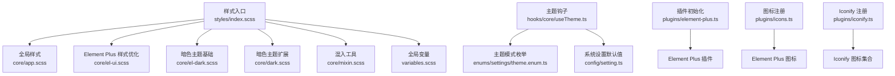
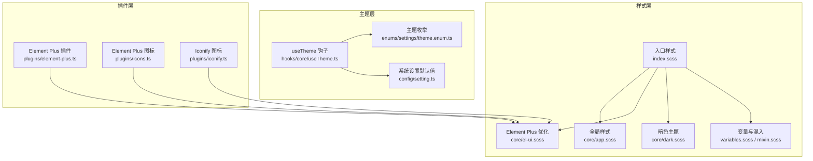
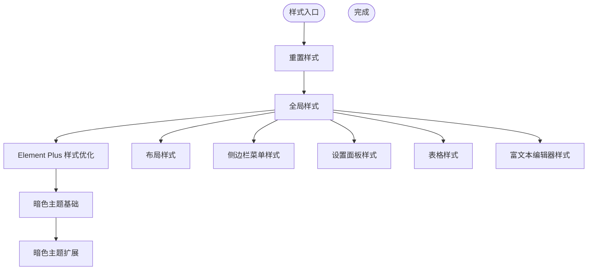
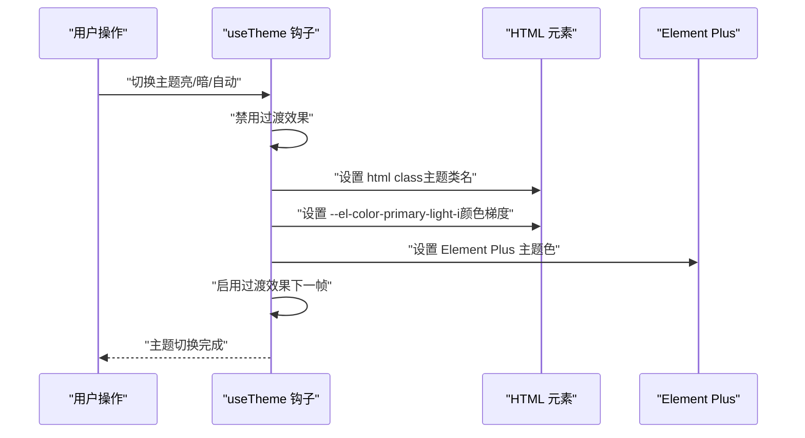
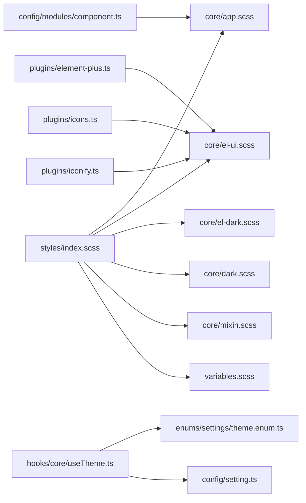

# UI 设计系统

<cite>
**本文档引用的文件**
- [frontend/web/src/styles/index.scss](file://frontend/web/src/styles/index.scss)
- [frontend/web/src/styles/variables.scss](file://frontend/web/src/styles/variables.scss)
- [frontend/web/src/styles/core/app.scss](file://frontend/web/src/styles/core/app.scss)
- [frontend/web/src/styles/core/dark.scss](file://frontend/web/src/styles/core/dark.scss)
- [frontend/web/src/styles/core/el-ui.scss](file://frontend/web/src/styles/core/el-ui.scss)
- [frontend/web/src/styles/core/el-dark.scss](file://frontend/web/src/styles/core/el-dark.scss)
- [frontend/web/src/styles/core/mixin.scss](file://frontend/web/src/styles/core/mixin.scss)
- [frontend/web/src/plugins/element-plus.ts](file://frontend/web/src/plugins/element-plus.ts)
- [frontend/web/src/plugins/icons.ts](file://frontend/web/src/plugins/icons.ts)
- [frontend/web/src/plugins/iconify.ts](file://frontend/web/src/plugins/iconify.ts)
- [frontend/web/src/hooks/core/useTheme.ts](file://frontend/web/src/hooks/core/useTheme.ts)
- [frontend/web/src/config/setting.ts](file://frontend/web/src/config/setting.ts)
- [frontend/web/src/enums/settings/theme.enum.ts](file://frontend/web/src/enums/settings/theme.enum.ts)
- [frontend/web/src/config/modules/component.ts](file://frontend/web/src/config/modules/component.ts)
</cite>

## 目录
1. [简介](#简介)
2. [项目结构](#项目结构)
3. [核心组件](#核心组件)
4. [架构总览](#架构总览)
5. [详细组件分析](#详细组件分析)
6. [依赖关系分析](#依赖关系分析)
7. [性能考量](#性能考量)
8. [故障排查指南](#故障排查指南)
9. [结论](#结论)
10. [附录](#附录)

## 简介
本文件面向 UI 设计系统，围绕基于 Element Plus 的组件库集成与定制化开发进行系统化说明。重点涵盖样式架构（Tailwind CSS 基础样式、项目全局样式、暗色主题样式）、主题变量系统与颜色体系、尺寸规范、组件样式定制指南（CSS 变量使用、样式覆盖、响应式设计）、动画库集成、图标系统与字体管理，并总结设计系统最佳实践（可访问性、跨浏览器兼容性、性能优化），为 UI 开发提供统一的设计规范与开发指南。

## 项目结构
前端样式采用模块化组织，通过一个入口样式文件集中引入各模块样式，形成清晰的层次结构：
- 样式入口：集中引入重置、全局、Element Plus 优化、暗色主题、路由过渡、布局、菜单、设置面板、表格、富文本等样式模块
- 全局变量：提供全局 SCSS 变量注入，便于组件内引用
- 核心样式：包含全局通用样式、卡片盒模型、移动端适配、徽章与动画等
- 主题系统：通过 CSS 变量与 JS 主题钩子实现亮/暗/自动三模式切换
- 图标系统：Element Plus 图标与 Iconify 本地图标集合注册
- 组件注册：全局业务组件配置与异步加载

**图表来源**
- [frontend/web/src/styles/index.scss:1-45](file://frontend/web/src/styles/index.scss#L1-L45)
- [frontend/web/src/styles/core/app.scss:1-308](file://frontend/web/src/styles/core/app.scss#L1-L308)
- [frontend/web/src/styles/core/el-ui.scss:1-523](file://frontend/web/src/styles/core/el-ui.scss#L1-L523)
- [frontend/web/src/styles/core/el-dark.scss:1-3](file://frontend/web/src/styles/core/el-dark.scss#L1-L3)
- [frontend/web/src/styles/core/dark.scss:1-92](file://frontend/web/src/styles/core/dark.scss#L1-L92)
- [frontend/web/src/styles/core/mixin.scss:1-119](file://frontend/web/src/styles/core/mixin.scss#L1-L119)
- [frontend/web/src/styles/variables.scss:1-9](file://frontend/web/src/styles/variables.scss#L1-L9)
- [frontend/web/src/hooks/core/useTheme.ts:1-178](file://frontend/web/src/hooks/core/useTheme.ts#L1-L178)
- [frontend/web/src/enums/settings/theme.enum.ts:1-33](file://frontend/web/src/enums/settings/theme.enum.ts#L1-L33)
- [frontend/web/src/config/setting.ts:1-224](file://frontend/web/src/config/setting.ts#L1-L224)
- [frontend/web/src/plugins/element-plus.ts:1-7](file://frontend/web/src/plugins/element-plus.ts#L1-L7)
- [frontend/web/src/plugins/icons.ts:1-10](file://frontend/web/src/plugins/icons.ts#L1-L10)
- [frontend/web/src/plugins/iconify.ts:1-14](file://frontend/web/src/plugins/iconify.ts#L1-L14)

**章节来源**
- [frontend/web/src/styles/index.scss:1-45](file://frontend/web/src/styles/index.scss#L1-L45)
- [frontend/web/src/styles/variables.scss:1-9](file://frontend/web/src/styles/variables.scss#L1-L9)

## 核心组件
- 样式入口与模块化：通过入口样式文件集中引入各模块，确保加载顺序与作用域明确
- 全局样式与盒模型：统一卡片边框、阴影、圆角与布局容器高度，提供多种盒模式（边框/阴影）
- Element Plus 样式优化：统一组件高度、圆角、按钮、表单、对话框、下拉菜单等样式细节
- 暗色主题：覆盖 Element Plus 暗色变量与富文本编辑器暗色样式
- 主题系统：CSS 变量驱动的主题切换，配合 JS 钩子实现颜色梯度、过渡优化与持久化
- 图标系统：Element Plus 图标与 Iconify 本地图标集合，减少外部依赖
- 全局组件配置：集中注册与异步加载业务组件，便于全局使用

**章节来源**
- [frontend/web/src/styles/core/app.scss:1-308](file://frontend/web/src/styles/core/app.scss#L1-L308)
- [frontend/web/src/styles/core/el-ui.scss:1-523](file://frontend/web/src/styles/core/el-ui.scss#L1-L523)
- [frontend/web/src/styles/core/dark.scss:1-92](file://frontend/web/src/styles/core/dark.scss#L1-L92)
- [frontend/web/src/hooks/core/useTheme.ts:1-178](file://frontend/web/src/hooks/core/useTheme.ts#L1-L178)
- [frontend/web/src/plugins/icons.ts:1-10](file://frontend/web/src/plugins/icons.ts#L1-L10)
- [frontend/web/src/plugins/iconify.ts:1-14](file://frontend/web/src/plugins/iconify.ts#L1-L14)
- [frontend/web/src/config/modules/component.ts:1-100](file://frontend/web/src/config/modules/component.ts#L1-L100)

## 架构总览
UI 设计系统采用“CSS 变量 + SCSS 模块 + 主题钩子”的架构：
- CSS 变量作为主题与尺寸的核心载体，贯穿全局样式与 Element Plus 样式优化
- SCSS 模块化组织样式，入口集中引入，便于维护与扩展
- 主题钩子负责主题切换、颜色梯度计算、过渡优化与状态持久化
- 图标系统通过插件注册，提供丰富的图标资源
- 全局组件配置实现组件级别的统一与按需加载

**图表来源**
- [frontend/web/src/styles/index.scss:1-45](file://frontend/web/src/styles/index.scss#L1-L45)
- [frontend/web/src/styles/core/app.scss:1-308](file://frontend/web/src/styles/core/app.scss#L1-L308)
- [frontend/web/src/styles/core/el-ui.scss:1-523](file://frontend/web/src/styles/core/el-ui.scss#L1-L523)
- [frontend/web/src/styles/core/dark.scss:1-92](file://frontend/web/src/styles/core/dark.scss#L1-L92)
- [frontend/web/src/styles/variables.scss:1-9](file://frontend/web/src/styles/variables.scss#L1-L9)
- [frontend/web/src/styles/core/mixin.scss:1-119](file://frontend/web/src/styles/core/mixin.scss#L1-L119)
- [frontend/web/src/hooks/core/useTheme.ts:1-178](file://frontend/web/src/hooks/core/useTheme.ts#L1-L178)
- [frontend/web/src/enums/settings/theme.enum.ts:1-33](file://frontend/web/src/enums/settings/theme.enum.ts#L1-L33)
- [frontend/web/src/config/setting.ts:1-224](file://frontend/web/src/config/setting.ts#L1-L224)
- [frontend/web/src/plugins/element-plus.ts:1-7](file://frontend/web/src/plugins/element-plus.ts#L1-L7)
- [frontend/web/src/plugins/icons.ts:1-10](file://frontend/web/src/plugins/icons.ts#L1-L10)
- [frontend/web/src/plugins/iconify.ts:1-14](file://frontend/web/src/plugins/iconify.ts#L1-L14)

## 详细组件分析

### 样式架构与模块化
- 入口样式集中引入重置、全局、Element Plus 优化、暗色主题、路由过渡、布局、菜单、设置面板、表格、富文本等模块，确保加载顺序与作用域明确
- 全局样式提供统一的卡片盒模型、移动端适配、徽章与动画等通用能力
- Element Plus 样式优化统一组件高度、圆角、按钮、表单、对话框、下拉菜单等细节，提升一致性与可用性
- 暗色主题覆盖 Element Plus 暗色变量与富文本编辑器暗色样式，保证视觉一致性

**图表来源**
- [frontend/web/src/styles/index.scss:1-45](file://frontend/web/src/styles/index.scss#L1-L45)
- [frontend/web/src/styles/core/app.scss:1-308](file://frontend/web/src/styles/core/app.scss#L1-L308)
- [frontend/web/src/styles/core/el-ui.scss:1-523](file://frontend/web/src/styles/core/el-ui.scss#L1-L523)
- [frontend/web/src/styles/core/dark.scss:1-92](file://frontend/web/src/styles/core/dark.scss#L1-L92)

**章节来源**
- [frontend/web/src/styles/index.scss:1-45](file://frontend/web/src/styles/index.scss#L1-L45)
- [frontend/web/src/styles/core/app.scss:1-308](file://frontend/web/src/styles/core/app.scss#L1-L308)
- [frontend/web/src/styles/core/el-ui.scss:1-523](file://frontend/web/src/styles/core/el-ui.scss#L1-L523)
- [frontend/web/src/styles/core/dark.scss:1-92](file://frontend/web/src/styles/core/dark.scss#L1-L92)

### 主题变量系统与颜色体系
- CSS 变量：通过 CSS 变量统一承载主题色、圆角、边框、阴影等设计令牌，便于运行时动态切换
- 主题钩子：useTheme 提供主题切换、颜色梯度计算（亮/暗）、过渡优化与状态持久化
- 颜色预设：提供多套主题色预设，满足不同场景需求；默认主色与主题切换逻辑保持一致
- 暗色模式：覆盖 Element Plus 暗色变量与富文本编辑器暗色样式，保证组件在暗色下的可读性与一致性

**图表来源**
- [frontend/web/src/hooks/core/useTheme.ts:1-178](file://frontend/web/src/hooks/core/useTheme.ts#L1-L178)
- [frontend/web/src/config/setting.ts:1-224](file://frontend/web/src/config/setting.ts#L1-L224)
- [frontend/web/src/enums/settings/theme.enum.ts:1-33](file://frontend/web/src/enums/settings/theme.enum.ts#L1-L33)

**章节来源**
- [frontend/web/src/hooks/core/useTheme.ts:1-178](file://frontend/web/src/hooks/core/useTheme.ts#L1-L178)
- [frontend/web/src/config/setting.ts:1-224](file://frontend/web/src/config/setting.ts#L1-L224)
- [frontend/web/src/enums/settings/theme.enum.ts:1-33](file://frontend/web/src/enums/settings/theme.enum.ts#L1-L33)

### 尺寸规范与响应式设计
- 组件尺寸：通过 CSS 变量统一组件高度、圆角等尺寸规范，确保组件在不同设备上的一致性
- 响应式适配：针对移动端（如触摸反馈、滚动行为）与平板设备（如表单布局）进行专项优化
- 布局容器：提供全高容器与弹性布局，确保内容在不同屏幕尺寸下的合理排布

**章节来源**
- [frontend/web/src/styles/core/el-ui.scss:1-523](file://frontend/web/src/styles/core/el-ui.scss#L1-L523)
- [frontend/web/src/styles/core/app.scss:1-308](file://frontend/web/src/styles/core/app.scss#L1-L308)

### 组件样式定制指南
- CSS 变量使用：优先使用 CSS 变量（如主题色、圆角、边框、阴影）进行样式定制，避免硬编码
- 样式覆盖：在 Element Plus 样式优化基础上进行局部覆盖，遵循“尽量不破坏默认结构”的原则
- 响应式设计：结合媒体查询与 Flex 布局，确保在不同设备上的良好体验
- 动画与过渡：通过主题钩子禁用过渡以避免闪烁，再在下一帧恢复，保证切换流畅

**章节来源**
- [frontend/web/src/styles/core/el-ui.scss:1-523](file://frontend/web/src/styles/core/el-ui.scss#L1-L523)
- [frontend/web/src/hooks/core/useTheme.ts:1-178](file://frontend/web/src/hooks/core/useTheme.ts#L1-L178)

### 动画库集成与图标系统
- 动画库：通过主题钩子与自定义动画（如对话框开启动画、遮罩层动画）实现流畅的交互体验
- 图标系统：Element Plus 图标与 Iconify 本地图标集合注册，减少外部依赖，提升加载稳定性

**章节来源**
- [frontend/web/src/plugins/icons.ts:1-10](file://frontend/web/src/plugins/icons.ts#L1-L10)
- [frontend/web/src/plugins/iconify.ts:1-14](file://frontend/web/src/plugins/iconify.ts#L1-L14)
- [frontend/web/src/styles/core/el-ui.scss:372-425](file://frontend/web/src/styles/core/el-ui.scss#L372-L425)

### 字体管理
- 字体资源：项目包含字体资源目录，用于统一字体家族与字重
- 字体加载：建议通过本地字体与 Web 字体结合的方式，确保在不同环境下稳定加载

**章节来源**
- [frontend/web/src/assets/font](file://frontend/web/src/assets/font)

## 依赖关系分析
- 样式入口依赖各模块样式文件，形成清晰的依赖链
- useTheme 钩子依赖主题枚举与系统设置，默认主题色与 SCSS 变量保持一致
- Element Plus 插件与图标插件共同支撑组件库与图标资源
- 全局组件配置通过异步加载实现按需注册，降低初始包体积

**图表来源**
- [frontend/web/src/styles/index.scss:1-45](file://frontend/web/src/styles/index.scss#L1-L45)
- [frontend/web/src/styles/core/app.scss:1-308](file://frontend/web/src/styles/core/app.scss#L1-L308)
- [frontend/web/src/styles/core/el-ui.scss:1-523](file://frontend/web/src/styles/core/el-ui.scss#L1-L523)
- [frontend/web/src/styles/core/el-dark.scss:1-3](file://frontend/web/src/styles/core/el-dark.scss#L1-L3)
- [frontend/web/src/styles/core/dark.scss:1-92](file://frontend/web/src/styles/core/dark.scss#L1-L92)
- [frontend/web/src/styles/core/mixin.scss:1-119](file://frontend/web/src/styles/core/mixin.scss#L1-L119)
- [frontend/web/src/styles/variables.scss:1-9](file://frontend/web/src/styles/variables.scss#L1-L9)
- [frontend/web/src/hooks/core/useTheme.ts:1-178](file://frontend/web/src/hooks/core/useTheme.ts#L1-L178)
- [frontend/web/src/enums/settings/theme.enum.ts:1-33](file://frontend/web/src/enums/settings/theme.enum.ts#L1-L33)
- [frontend/web/src/config/setting.ts:1-224](file://frontend/web/src/config/setting.ts#L1-L224)
- [frontend/web/src/plugins/element-plus.ts:1-7](file://frontend/web/src/plugins/element-plus.ts#L1-L7)
- [frontend/web/src/plugins/icons.ts:1-10](file://frontend/web/src/plugins/icons.ts#L1-L10)
- [frontend/web/src/plugins/iconify.ts:1-14](file://frontend/web/src/plugins/iconify.ts#L1-L14)
- [frontend/web/src/config/modules/component.ts:1-100](file://frontend/web/src/config/modules/component.ts#L1-L100)

**章节来源**
- [frontend/web/src/styles/index.scss:1-45](file://frontend/web/src/styles/index.scss#L1-L45)
- [frontend/web/src/hooks/core/useTheme.ts:1-178](file://frontend/web/src/hooks/core/useTheme.ts#L1-L178)
- [frontend/web/src/plugins/element-plus.ts:1-7](file://frontend/web/src/plugins/element-plus.ts#L1-L7)
- [frontend/web/src/config/modules/component.ts:1-100](file://frontend/web/src/config/modules/component.ts#L1-L100)

## 性能考量
- 样式模块化：通过入口集中引入，减少重复加载与作用域冲突
- 主题切换优化：通过禁用过渡避免闪烁，再在下一帧恢复，保证切换流畅
- 组件异步加载：全局组件通过异步加载实现按需注册，降低初始包体积
- 图标本地化：Iconify 图标集合本地注册，减少外部依赖与网络请求
- 响应式适配：针对移动端与平板设备进行专项优化，减少不必要的重绘与回流

## 故障排查指南
- 主题切换闪烁：检查主题钩子是否正确禁用与恢复过渡效果
- 暗色主题不生效：确认 HTML 元素是否正确设置主题类名，以及 CSS 变量是否被覆盖
- Element Plus 样式异常：检查样式覆盖顺序与优先级，避免与默认样式冲突
- 图标加载失败：确认图标插件是否正确初始化，以及本地图标集合是否完整
- 全局组件未注册：检查全局组件配置与异步加载逻辑

**章节来源**
- [frontend/web/src/hooks/core/useTheme.ts:45-98](file://frontend/web/src/hooks/core/useTheme.ts#L45-L98)
- [frontend/web/src/styles/core/el-ui.scss:1-523](file://frontend/web/src/styles/core/el-ui.scss#L1-L523)
- [frontend/web/src/plugins/icons.ts:1-10](file://frontend/web/src/plugins/icons.ts#L1-L10)
- [frontend/web/src/plugins/iconify.ts:1-14](file://frontend/web/src/plugins/iconify.ts#L1-L14)
- [frontend/web/src/config/modules/component.ts:1-100](file://frontend/web/src/config/modules/component.ts#L1-L100)

## 结论
本 UI 设计系统通过 CSS 变量、SCSS 模块化与主题钩子实现了统一的主题与样式规范，结合 Element Plus 组件库与本地图标系统，提供了良好的一致性与可维护性。通过响应式设计与性能优化策略，确保在多设备与多浏览器环境下的稳定表现。建议在后续迭代中持续完善主题色预设、暗色主题覆盖与组件样式定制指南，以进一步提升设计系统的可扩展性与易用性。

## 附录
- 设计系统最佳实践
  - 可访问性：确保对比度、键盘导航与语义化标签
  - 跨浏览器兼容性：关注 CSS 变量与 Flex 布局的兼容性
  - 性能优化：减少重绘与回流、按需加载、缓存策略
- 统一的设计规范与开发指南
  - 颜色体系：基于 CSS 变量与颜色梯度
  - 尺寸规范：统一组件高度与圆角
  - 响应式设计：移动端优先与断点策略
  - 动画与过渡：流畅且可感知的交互体验