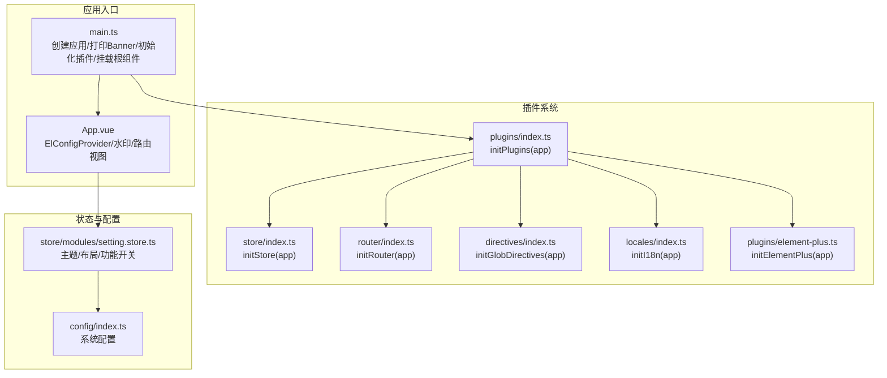
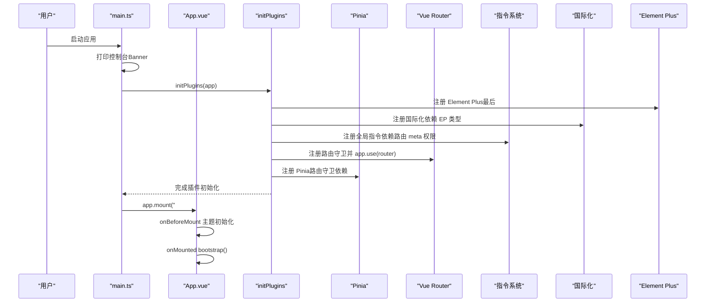
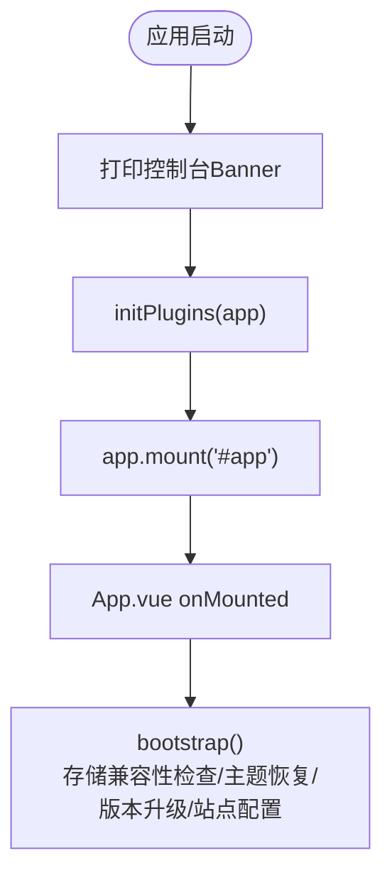
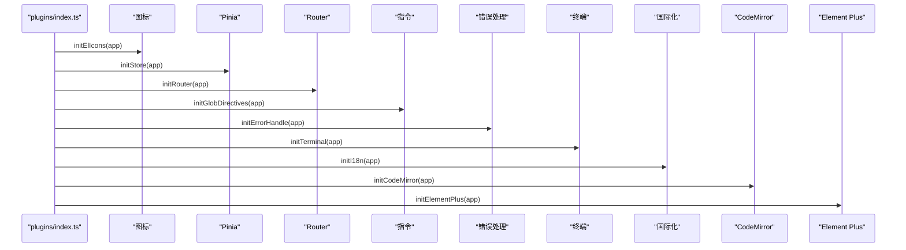
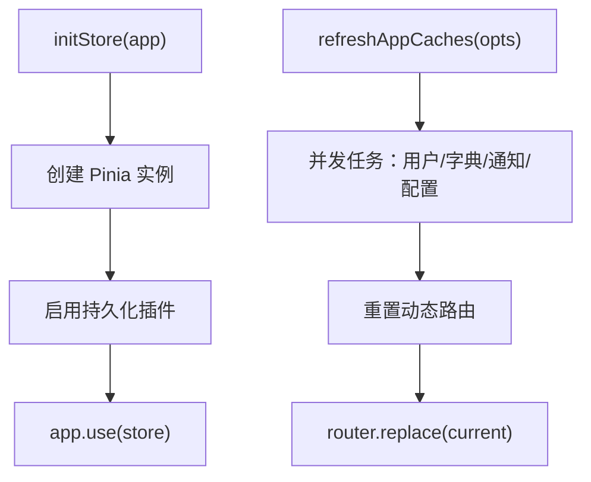
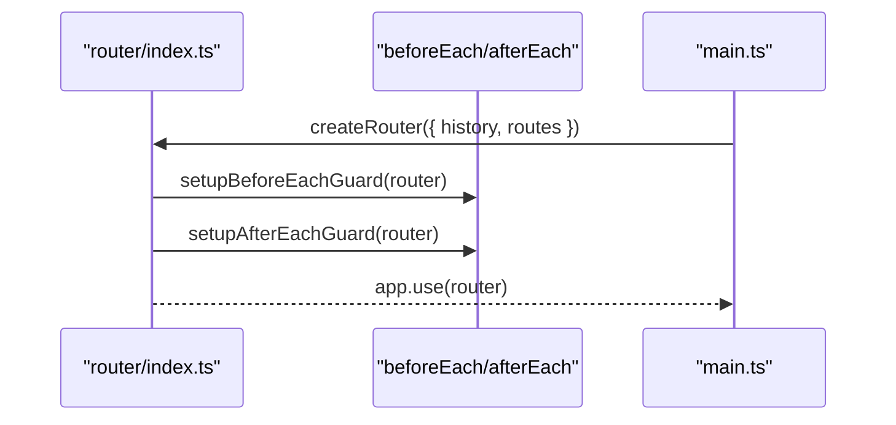
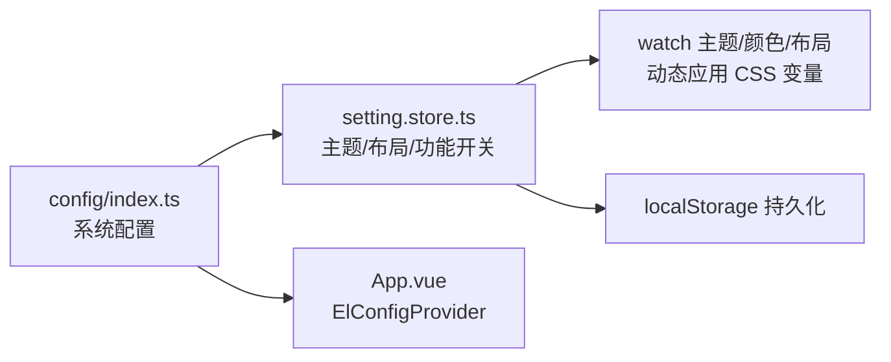
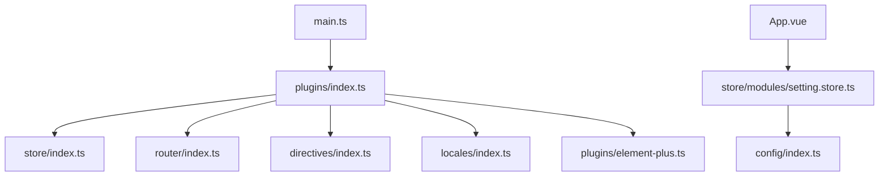

# Vue3 架构设计

<cite>
**本文档引用的文件**
- [frontend/web/src/main.ts](file://frontend/web/src/main.ts)
- [frontend/web/src/App.vue](file://frontend/web/src/App.vue)
- [frontend/web/src/plugins/index.ts](file://frontend/web/src/plugins/index.ts)
- [frontend/web/src/store/index.ts](file://frontend/web/src/store/index.ts)
- [frontend/web/src/router/index.ts](file://frontend/web/src/router/index.ts)
- [frontend/web/src/directives/index.ts](file://frontend/web/src/directives/index.ts)
- [frontend/web/src/locales/index.ts](file://frontend/web/src/locales/index.ts)
- [frontend/web/src/plugins/element-plus.ts](file://frontend/web/src/plugins/element-plus.ts)
- [frontend/web/src/hooks/core/useAppBootstrap.ts](file://frontend/web/src/hooks/core/useAppBootstrap.ts)
- [frontend/web/src/utils/index.ts](file://frontend/web/src/utils/index.ts)
- [frontend/web/src/config/index.ts](file://frontend/web/src/config/index.ts)
- [frontend/web/src/store/modules/setting.store.ts](file://frontend/web/src/store/modules/setting.store.ts)
- [frontend/web/package.json](file://frontend/web/package.json)
- [frontend/web/vite.config.ts](file://frontend/web/vite.config.ts)
</cite>

## 更新摘要
**所做更改**
- 更新了依赖版本信息，反映 Vue 3.5.34、Element Plus ~2.13.7、Vue Router 5.0.7 的现代化升级
- 增强了构建配置和插件系统的说明，包括新的 Vite 插件和自动导入机制
- 补充了现代化开发工具链的集成说明

## 目录
1. [简介](#简介)
2. [项目结构](#项目结构)
3. [核心组件](#核心组件)
4. [架构总览](#架构总览)
5. [详细组件分析](#详细组件分析)
6. [依赖关系分析](#依赖关系分析)
7. [性能考量](#性能考量)
8. [故障排查指南](#故障排查指南)
9. [结论](#结论)
10. [附录](#附录)

## 简介
本文件面向 Vue3 Composition API 的前端架构，系统性阐述应用初始化流程、插件注册机制与全局配置管理。重点覆盖以下方面：
- 应用启动顺序：控制台 Banner 打印 → 插件初始化 → 根组件挂载，并解释每个阶段职责与依赖关系
- 插件系统：Pinia 状态管理、Router 路由系统、指令系统、国际化、Element Plus UI 库的集成方式与注册顺序
- 配置管理：环境变量处理、主题配置、功能开关与持久化策略
- 新功能开发指导：基于现有架构的设计约束与扩展建议

**更新** 本次更新反映了前端架构的重大现代化改进，包括 Vue 3.5.34、Element Plus ~2.13.7、Vue Router 5.0.7 等依赖的升级，以及现代化开发工具链的集成。

## 项目结构
前端采用 Vite + Vue3 + TypeScript + Element Plus 技术栈，遵循"按功能域划分"的组织方式：
- 应用入口与根组件：main.ts、App.vue
- 插件体系：plugins 目录，统一通过 initPlugins(app) 注册
- 状态管理：store 目录，基于 Pinia 并启用持久化
- 路由系统：router 目录，包含静态路由、动态路由与守卫
- 指令系统：directives 目录，集中注册 v-auth、v-roles、v-highlight、v-ripple 与 v-hasPerm
- 国际化：locales 目录，基于 vue-i18n，支持中英双语与本地存储恢复
- 配置中心：config 目录，集中管理主题、菜单、颜色等全局配置
- 工具与横切能力：utils 目录，按领域拆分子模块

**图表来源**
- [frontend/web/src/main.ts:23-34](file://frontend/web/src/main.ts#L23-L34)
- [frontend/web/src/plugins/index.ts:24-48](file://frontend/web/src/plugins/index.ts#L24-L48)
- [frontend/web/src/store/index.ts:15-17](file://frontend/web/src/store/index.ts#L15-L17)
- [frontend/web/src/router/index.ts:22-27](file://frontend/web/src/router/index.ts#L22-L27)
- [frontend/web/src/directives/index.ts:9-17](file://frontend/web/src/directives/index.ts#L9-L17)
- [frontend/web/src/locales/index.ts:127-129](file://frontend/web/src/locales/index.ts#L127-L129)
- [frontend/web/src/plugins/element-plus.ts:4-6](file://frontend/web/src/plugins/element-plus.ts#L4-L6)
- [frontend/web/src/App.vue:24-50](file://frontend/web/src/App.vue#L24-L50)
- [frontend/web/src/store/modules/setting.store.ts:180-200](file://frontend/web/src/store/modules/setting.store.ts#L180-L200)
- [frontend/web/src/config/index.ts:38-137](file://frontend/web/src/config/index.ts#L38-L137)

**章节来源**
- [frontend/web/src/main.ts:1-35](file://frontend/web/src/main.ts#L1-L35)
- [frontend/web/src/plugins/index.ts:1-49](file://frontend/web/src/plugins/index.ts#L1-L49)

## 核心组件
- 应用入口与启动流程
  - 创建应用实例、打印控制台 Banner、异步初始化插件、最后挂载根组件
  - 根组件负责主题初始化、站点配置加载与存储异常事件监听
- 插件注册中枢
  - initPlugins(app) 作为唯一入口，严格规定注册顺序，确保依赖满足
- Pinia 状态管理
  - 创建 Store 实例并启用持久化插件，集中管理用户、字典、通知、工作标签等状态
- 路由系统
  - Hash 模式路由，静态路由首屏注册，动态路由在守卫中按需挂载
- 指令系统
  - 全局注册 v-auth、v-roles、v-highlight、v-ripple 与 v-hasPerm
- 国际化
  - 基于 vue-i18n，支持中英双语与本地存储恢复语言偏好
- Element Plus
  - 最后注册，确保组件与样式完整加载

**更新** 依赖升级后，所有核心组件都受益于最新的 Vue 3.5.34 生态系统改进，包括更好的 TypeScript 支持、性能优化和开发体验增强。

**章节来源**
- [frontend/web/src/main.ts:23-34](file://frontend/web/src/main.ts#L23-L34)
- [frontend/web/src/App.vue:70-98](file://frontend/web/src/App.vue#L70-L98)
- [frontend/web/src/plugins/index.ts:24-48](file://frontend/web/src/plugins/index.ts#L24-L48)
- [frontend/web/src/store/index.ts:1-17](file://frontend/web/src/store/index.ts#L1-L17)
- [frontend/web/src/router/index.ts:1-27](file://frontend/web/src/router/index.ts#L1-L27)
- [frontend/web/src/directives/index.ts:1-17](file://frontend/web/src/directives/index.ts#L1-L17)
- [frontend/web/src/locales/index.ts:127-129](file://frontend/web/src/locales/index.ts#L127-L129)
- [frontend/web/src/plugins/element-plus.ts:1-6](file://frontend/web/src/plugins/element-plus.ts#L1-L6)

## 架构总览
应用启动遵循严格的顺序契约，确保各子系统在正确时机就绪：
1) 控制台 Banner 打印（无依赖）
2) 插件初始化（按依赖顺序）
3) 根组件挂载（随后 App.vue 生命周期接管）

**图表来源**
- [frontend/web/src/main.ts:23-34](file://frontend/web/src/main.ts#L23-L34)
- [frontend/web/src/plugins/index.ts:24-48](file://frontend/web/src/plugins/index.ts#L24-L48)
- [frontend/web/src/App.vue:70-98](file://frontend/web/src/App.vue#L70-L98)

## 详细组件分析

### 应用初始化与启动顺序
- 控制台 Banner 打印：在创建应用实例前执行，确保无依赖干扰
- 插件初始化：通过 initPlugins(app) 统一调度，严格遵循依赖顺序
- 根组件挂载：完成插件初始化后挂载，App.vue 在 onMounted 中执行 bootstrap

**图表来源**
- [frontend/web/src/main.ts:23-34](file://frontend/web/src/main.ts#L23-L34)
- [frontend/web/src/hooks/core/useAppBootstrap.ts:10-18](file://frontend/web/src/hooks/core/useAppBootstrap.ts#L10-L18)
- [frontend/web/src/App.vue:70-98](file://frontend/web/src/App.vue#L70-L98)

**章节来源**
- [frontend/web/src/main.ts:23-34](file://frontend/web/src/main.ts#L23-L34)
- [frontend/web/src/hooks/core/useAppBootstrap.ts:1-22](file://frontend/web/src/hooks/core/useAppBootstrap.ts#L1-L22)
- [frontend/web/src/App.vue:70-98](file://frontend/web/src/App.vue#L70-L98)

### 插件注册机制与依赖顺序
- 注册顺序约定（initPlugins 调用顺序）：
  1) 图标注册（纯组件，无依赖）
  2) Pinia 状态管理（路由守卫、指令、组件均依赖 store，须在 router 之前）
  3) Vue Router（守卫中用到已初始化的 store）
  4) 全局指令（v-auth、v-highlight 等，依赖 router 的 meta 权限）
  5) 全局错误处理（window.onerror、unhandledrejection）
  6) 终端/控制台相关
  7) 国际化（依赖 Element Plus 部分类型，但 Element Plus 尚未注册，先注册语言包）
  8) CodeMirror 编辑器（独立注册，无依赖）
  9) Element Plus（最后注册，避免组件扫描过早触发）
- 关键实现路径：
  - 插件注册中枢：[frontend/web/src/plugins/index.ts:24-48](file://frontend/web/src/plugins/index.ts#L24-L48)
  - Pinia 初始化：[frontend/web/src/store/index.ts:15-17](file://frontend/web/src/store/index.ts#L15-L17)
  - 路由初始化：[frontend/web/src/router/index.ts:22-27](file://frontend/web/src/router/index.ts#L22-L27)
  - 指令注册：[frontend/web/src/directives/index.ts:9-17](file://frontend/web/src/directives/index.ts#L9-L17)
  - 国际化初始化：[frontend/web/src/locales/index.ts:127-129](file://frontend/web/src/locales/index.ts#L127-L129)
  - Element Plus 注册：[frontend/web/src/plugins/element-plus.ts:4-6](file://frontend/web/src/plugins/element-plus.ts#L4-L6)

**图表来源**
- [frontend/web/src/plugins/index.ts:24-48](file://frontend/web/src/plugins/index.ts#L24-L48)

**章节来源**
- [frontend/web/src/plugins/index.ts:24-48](file://frontend/web/src/plugins/index.ts#L24-L48)

### Pinia 状态管理
- Store 创建与持久化
  - 创建 Pinia 实例并启用持久化插件
  - 通过 initStore(app) 注册到应用
- 缓存刷新与动态路由重置
  - 提供 refreshAppCaches 方法，支持按需刷新用户、字典、通知、配置等缓存
  - 刷新路由后同步替换当前路由参数与哈希，保证页面一致性
- 设置项持久化
  - setting.store.ts 使用 useStorage 对主题、布局、功能开关等进行持久化

**更新** 基于 Vue 3.5.34 的最新 Composition API 支持，Pinia 状态管理获得了更好的响应式性能和更小的包体积。

**图表来源**
- [frontend/web/src/store/index.ts:11-17](file://frontend/web/src/store/index.ts#L11-L17)
- [frontend/web/src/store/index.ts:41-88](file://frontend/web/src/store/index.ts#L41-L88)
- [frontend/web/src/store/modules/setting.store.ts:180-200](file://frontend/web/src/store/modules/setting.store.ts#L180-L200)

**章节来源**
- [frontend/web/src/store/index.ts:1-89](file://frontend/web/src/store/index.ts#L1-L89)
- [frontend/web/src/store/modules/setting.store.ts:1-524](file://frontend/web/src/store/modules/setting.store.ts#L1-L524)

### Router 路由系统
- 路由创建与注册
  - 使用 Hash 模式（createWebHashHistory），便于静态部署与兼容非 HTTP 环境
  - 首屏注册 staticRoutes，动态路由在 beforeEach 中按需挂载
- 守卫与导航
  - beforeEach 与 afterEach 守卫分别处理鉴权与后置处理
  - 导航行为统一滚动至顶部
- 关键实现路径：
  - 路由创建与注册：[frontend/web/src/router/index.ts:16-27](file://frontend/web/src/router/index.ts#L16-L27)

**更新** Vue Router 5.0.7 带来了更好的 TypeScript 类型支持、性能优化和更稳定的路由守卫机制。

**图表来源**
- [frontend/web/src/router/index.ts:16-27](file://frontend/web/src/router/index.ts#L16-L27)

**章节来源**
- [frontend/web/src/router/index.ts:1-39](file://frontend/web/src/router/index.ts#L1-L39)

### 指令系统
- 全局指令注册
  - v-auth、v-roles、v-highlight、v-ripple 与 v-hasPerm 在 initGlobDirectives 中统一注册
  - v-hasPerm 通过 app.directive("hasPerm", hasPerm) 注入全局
- 权限与交互增强
  - 指令依赖路由 meta 权限，确保在路由守卫之后注册

**章节来源**
- [frontend/web/src/directives/index.ts:1-20](file://frontend/web/src/directives/index.ts#L1-L20)

### 国际化（i18n）
- 配置与初始化
  - 基于 vue-i18n，支持中英双语与运行时切换
  - 默认语言从本地存储或系统存储恢复，回退到简体中文
  - legacy=false，globalInjection=true，提供 $t 全局翻译函数
- 实现要点
  - 语言包同步导入，messages 映射语言枚举
  - 通过 initI18n(app) 注册到应用

**更新** vue-i18n 11.1.10 提供了更好的性能表现和更简洁的 API 设计。

**章节来源**
- [frontend/web/src/locales/index.ts:1-130](file://frontend/web/src/locales/index.ts#L1-L130)

### Element Plus UI 库
- 注册时机
  - 在国际化之后、Element Plus 语言包类型可用的前提下注册
  - 作为最后一个插件，确保组件与样式完整加载
- 根组件集成
  - App.vue 使用 ElConfigProvider 提供全局尺寸、语言与 z-index 配置

**更新** Element Plus ~2.13.7 带来了更丰富的组件生态、更好的暗色模式支持和性能优化。

**章节来源**
- [frontend/web/src/plugins/element-plus.ts:1-7](file://frontend/web/src/plugins/element-plus.ts#L1-L7)
- [frontend/web/src/App.vue:2-21](file://frontend/web/src/App.vue#L2-L21)

### 配置管理最佳实践
- 全局配置中心
  - config/index.ts 集中管理主题样式、菜单布局、颜色方案、快速入口与顶部栏配置
  - 使用冻结对象防止误修改
- 主题与布局
  - setting.store.ts 提供主题模式、颜色、布局、容器宽度等持久化配置
  - 通过 watch 监听主题与颜色变化，动态应用 CSS 变量与暗色模式
- 功能开关
  - 通过 useStorage 对显示/隐藏开关进行持久化，如标签页、水印、通知等
- 环境变量与构建模式
  - package.json 中定义多模式构建脚本（prod/dev/test/pro/gitee），便于不同环境差异化配置

**图表来源**
- [frontend/web/src/config/index.ts:38-137](file://frontend/web/src/config/index.ts#L38-L137)
- [frontend/web/src/store/modules/setting.store.ts:180-200](file://frontend/web/src/store/modules/setting.store.ts#L180-L200)
- [frontend/web/src/App.vue:2-21](file://frontend/web/src/App.vue#L2-L21)

**章节来源**
- [frontend/web/src/config/index.ts:1-140](file://frontend/web/src/config/index.ts#L1-L140)
- [frontend/web/src/store/modules/setting.store.ts:1-524](file://frontend/web/src/store/modules/setting.store.ts#L1-L524)
- [frontend/web/package.json:7-34](file://frontend/web/package.json#L7-L34)

### 现代化开发工具链
- Vite 构建系统
  - 基于 Vue 3.5.34 的最新特性，提供更快的冷启动和热更新
  - 集成 unplugin-auto-import 和 unplugin-vue-components，实现自动导入和组件注册
- TypeScript 支持
  - 完整的 TypeScript 类型定义，包括 Vue 3.5.34 的最新 API
  - 更好的开发体验和编译时错误检查
- 开发工具
  - vite-plugin-vue-devtools 提供强大的调试功能
  - 自动代码格式化和 ESLint 集成

**更新** 本次升级显著提升了开发效率和构建性能，同时保持了向后兼容性。

**章节来源**
- [frontend/web/vite.config.ts:1-200](file://frontend/web/vite.config.ts#L1-L200)
- [frontend/web/package.json:68-119](file://frontend/web/package.json#L68-L119)

## 依赖关系分析
- 外部依赖概览（节选）
  - Vue3 3.5.34、Vue Router 5.0.7、Pinia、Element Plus ~2.13.7、vue-i18n 11.1.10、CodeMirror、ECharts、TailwindCSS 等
- 关键内部依赖
  - main.ts 依赖 plugins/index.ts、App.vue
  - plugins/index.ts 依赖 store/index.ts、router/index.ts、directives/index.ts、locales/index.ts、plugins/element-plus.ts
  - App.vue 依赖 store/modules/setting.store.ts、config/index.ts

**更新** 依赖升级带来了更好的性能表现、更丰富的 API 和更强的生态系统支持。

**图表来源**
- [frontend/web/src/main.ts:12-16](file://frontend/web/src/main.ts#L12-L16)
- [frontend/web/src/plugins/index.ts:12-22](file://frontend/web/src/plugins/index.ts#L12-L22)
- [frontend/web/src/store/index.ts:1-17](file://frontend/web/src/store/index.ts#L1-L17)
- [frontend/web/src/router/index.ts:1-27](file://frontend/web/src/router/index.ts#L1-L27)
- [frontend/web/src/directives/index.ts:1-17](file://frontend/web/src/directives/index.ts#L1-L17)
- [frontend/web/src/locales/index.ts:1-130](file://frontend/web/src/locales/index.ts#L1-L130)
- [frontend/web/src/plugins/element-plus.ts:1-7](file://frontend/web/src/plugins/element-plus.ts#L1-L7)
- [frontend/web/src/App.vue:24-50](file://frontend/web/src/App.vue#L24-L50)
- [frontend/web/src/store/modules/setting.store.ts:1-524](file://frontend/web/src/store/modules/setting.store.ts#L1-L524)
- [frontend/web/src/config/index.ts:1-140](file://frontend/web/src/config/index.ts#L1-L140)

**章节来源**
- [frontend/web/package.json:68-119](file://frontend/web/package.json#L68-L119)

## 性能考量
- 插件注册顺序优化
  - 将依赖强的插件（如 Router、指令）置于 Pinia 之后，避免运行时等待
  - 将 Element Plus 放在最后，减少组件扫描开销
- 路由与指令
  - Hash 模式降低服务端配置复杂度，提升静态部署性能
  - 指令按需使用，避免在大量节点上重复绑定
- 状态持久化
  - Pinia 持久化仅保留必要键，减少存储体积与序列化成本
- 主题与样式
  - 通过 CSS 变量与暗色模式 class 切换，避免频繁重绘
- 构建与脚本
  - 多模式构建脚本支持按环境优化打包策略
- **更新** 现代化依赖带来的性能提升
  - Vue 3.5.34 提供了更好的响应式系统和更小的包体积
  - Element Plus ~2.13.7 优化了组件渲染性能
  - Vite 7.1.5 带来了更快的构建速度和更好的开发体验

## 故障排查指南
- 控制台无 Banner
  - 检查 main.ts 是否在创建应用前执行打印逻辑
  - 参考：[frontend/web/src/main.ts:23-34](file://frontend/web/src/main.ts#L23-L34)
- 插件未生效
  - 确认 initPlugins(app) 调用顺序是否被修改
  - 确认依赖插件（如 Pinia、Router）是否在正确位置注册
  - 参考：[frontend/web/src/plugins/index.ts:24-48](file://frontend/web/src/plugins/index.ts#L24-L48)
- 路由守卫不触发
  - 确认 initRouter(app) 是否在 Pinia 之后注册
  - 确认 beforeEach/afterEach 是否正确导入与调用
  - 参考：[frontend/web/src/router/index.ts:22-27](file://frontend/web/src/router/index.ts#L22-L27)
- 国际化无效
  - 确认 initI18n(app) 是否在 Element Plus 语言包类型可用前提下注册
  - 检查语言存储恢复逻辑与默认语言回退
  - 参考：[frontend/web/src/locales/index.ts:127-129](file://frontend/web/src/locales/index.ts#L127-L129)
- 主题切换闪烁
  - 确保 App.vue onBeforeMount 中临时禁用过渡，onMounted 后恢复
  - 参考：[frontend/web/src/App.vue:81-84](file://frontend/web/src/App.vue#L81-L84)
- 存储异常导致白屏
  - 监听 app:storage-invalidated 事件并跳转登录页
  - 参考：[frontend/web/src/App.vue:87-98](file://frontend/web/src/App.vue#L87-L98)
- **更新** 依赖相关问题排查
  - Vue 3.5.34 兼容性问题：检查浏览器支持和 polyfill 配置
  - Element Plus ~2.13.7 组件问题：确认组件导入路径和版本匹配
  - Vue Router 5.0.7 路由问题：验证路由配置和守卫逻辑

**章节来源**
- [frontend/web/src/main.ts:23-34](file://frontend/web/src/main.ts#L23-L34)
- [frontend/web/src/plugins/index.ts:24-48](file://frontend/web/src/plugins/index.ts#L24-L48)
- [frontend/web/src/router/index.ts:22-27](file://frontend/web/src/router/index.ts#L22-L27)
- [frontend/web/src/locales/index.ts:127-129](file://frontend/web/src/locales/index.ts#L127-L129)
- [frontend/web/src/App.vue:81-98](file://frontend/web/src/App.vue#L81-L98)

## 结论
该 Vue3 架构通过严格的启动顺序与插件注册契约，实现了高内聚、低耦合的应用初始化流程。Pinia、Router、指令、国际化与 Element Plus 的集成遵循明确的依赖顺序，配合 config 与 setting.store 的配置中心，提供了完善的主题、布局与功能开关管理。

**更新** 本次现代化升级显著提升了整体性能和开发体验，Vue 3.5.34、Element Plus ~2.13.7、Vue Router 5.0.7 等依赖的引入为项目带来了更好的响应式性能、更丰富的组件生态和更强的生态系统支持。建议在新增功能时遵循现有插件注册顺序与持久化策略，充分利用现代化依赖提供的新特性和性能优势，确保系统稳定性与可维护性。

## 附录
- 新功能开发设计指导与约束规范
  - 插件注册：新增插件请在 plugins/index.ts 中添加 initXxx(app) 并在 initPlugins(app) 中按依赖顺序调用
  - 状态管理：优先使用 Pinia，必要时在 store/modules 下新增模块并启用持久化
  - 路由扩展：静态路由在 staticRoutes 中定义，动态路由在 beforeEach 中按需挂载
  - 指令扩展：在 directives/index.ts 中注册，并确保依赖路由 meta 权限
  - 国际化：新增翻译键值请在 locales/langs 下维护 JSON，并在组件中使用 $t 或 useI18n
  - 配置管理：新增配置项请在 config/index.ts 中集中管理，避免分散常量
  - 构建与环境：通过 package.json 的多模式脚本支持不同环境差异化配置
  - **更新** 现代化开发规范
    - 优先使用 Vue 3.5.34 的 Composition API 新特性
    - 利用 Element Plus ~2.13.7 的新组件和改进的样式系统
    - 采用 Vue Router 5.0.7 的新路由守卫和导航策略
    - 集成 Vite 7.1.5 的最新构建优化和开发工具