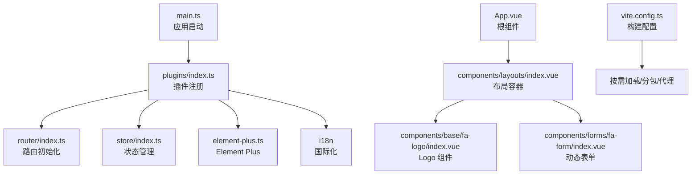
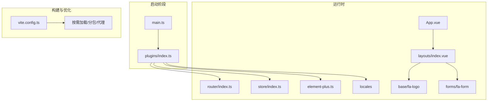
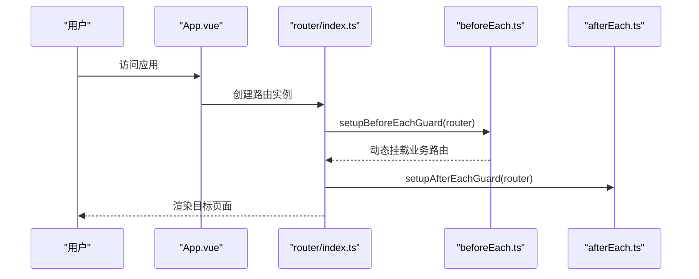
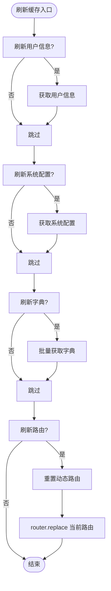
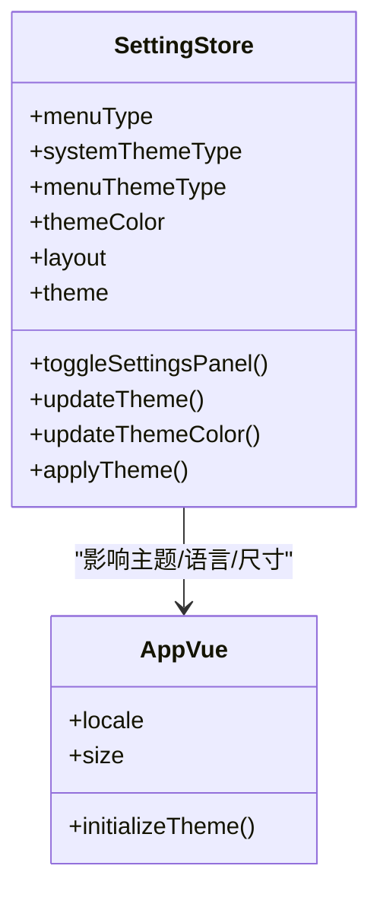
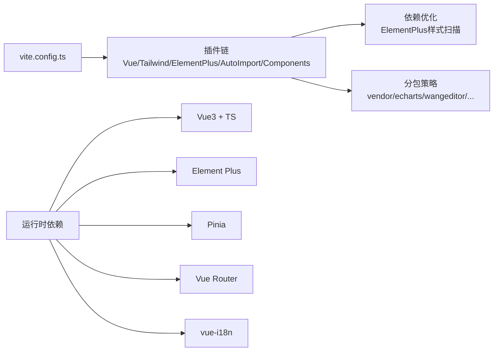

# 前端开发指南

<cite>
**本文引用的文件**
- [frontend/web/package.json](file://frontend/web/package.json)
- [frontend/web/vite.config.ts](file://frontend/web/vite.config.ts)
- [frontend/web/src/main.ts](file://frontend/web/src/main.ts)
- [frontend/web/src/App.vue](file://frontend/web/src/App.vue)
- [frontend/web/src/router/index.ts](file://frontend/web/src/router/index.ts)
- [frontend/web/src/store/index.ts](file://frontend/web/src/store/index.ts)
- [frontend/web/src/store/modules/setting.store.ts](file://frontend/web/src/store/modules/setting.store.ts)
- [frontend/web/src/plugins/element-plus.ts](file://frontend/web/src/plugins/element-plus.ts)
- [frontend/web/src/plugins/index.ts](file://frontend/web/src/plugins/index.ts)
- [frontend/web/src/config/index.ts](file://frontend/web/src/config/index.ts)
- [frontend/web/src/hooks/core/useAppBootstrap.ts](file://frontend/web/src/hooks/core/useAppBootstrap.ts)
- [frontend/web/src/locales/langs/en.json](file://frontend/web/src/locales/langs/en.json)
- [frontend/web/src/styles/index.scss](file://frontend/web/src/styles/index.scss)
- [frontend/web/src/components/layouts/index.vue](file://frontend/web/src/components/layouts/index.vue)
- [frontend/web/src/components/base/fa-logo/index.vue](file://frontend/web/src/components/base/fa-logo/index.vue)
- [frontend/web/src/components/forms/fa-form/index.vue](file://frontend/web/src/components/forms/fa-form/index.vue)
- [frontend/web/src/enums/appEnum.ts](file://frontend/web/src/enums/appEnum.ts)
</cite>

## 目录
1. [简介](#简介)
2. [项目结构](#项目结构)
3. [核心组件](#核心组件)
4. [架构总览](#架构总览)
5. [详细组件分析](#详细组件分析)
6. [依赖关系分析](#依赖关系分析)
7. [性能考量](#性能考量)
8. [故障排查指南](#故障排查指南)
9. [结论](#结论)
10. [附录](#附录)

## 简介
本指南面向 FastapiAdmin 前端团队，聚焦于基于 Vue3 + TypeScript 的前端架构设计与开发实践。内容涵盖组件化开发模式、状态管理策略、路由系统、UI 组件库（Element Plus）集成与自定义组件开发、国际化、页面布局、移动端适配与响应式设计、性能优化以及新功能开发流程与最佳实践。读者可据此快速上手并高质量交付功能。

## 项目结构
前端采用模块化组织方式，核心目录与职责如下：
- src/main.ts：应用启动入口，负责样式引入与插件初始化顺序
- src/App.vue：根组件，承载全局配置提供者、水印、AI 助手等
- src/router：路由定义与动态注册，包含静态路由与动态路由处理器
- src/store：Pinia 状态管理，模块化拆分，持久化策略明确
- src/plugins：插件注册入口，统一管理 Element Plus、国际化、指令、编辑器等
- src/components：组件库与业务组件，按功能域划分（布局、表单、图表、对话框等）
- src/styles：样式组织，按主题、布局、组件维度拆分
- src/locales：国际化资源，按语言文件组织
- vite.config.ts：构建与开发服务器配置，包含按需加载、分包策略、插件链路

**图表来源**
- [frontend/web/src/main.ts:1-35](file://frontend/web/src/main.ts#L1-L35)
- [frontend/web/src/plugins/index.ts:1-49](file://frontend/web/src/plugins/index.ts#L1-L49)
- [frontend/web/src/router/index.ts:1-39](file://frontend/web/src/router/index.ts#L1-L39)
- [frontend/web/src/store/index.ts:1-89](file://frontend/web/src/store/index.ts#L1-L89)
- [frontend/web/src/plugins/element-plus.ts:1-7](file://frontend/web/src/plugins/element-plus.ts#L1-L7)
- [frontend/web/src/App.vue:1-104](file://frontend/web/src/App.vue#L1-L104)
- [frontend/web/src/components/layouts/index.vue:1-69](file://frontend/web/src/components/layouts/index.vue#L1-L69)
- [frontend/web/src/components/base/fa-logo/index.vue:1-54](file://frontend/web/src/components/base/fa-logo/index.vue#L1-L54)
- [frontend/web/src/components/forms/fa-form/index.vue:1-620](file://frontend/web/src/components/forms/fa-form/index.vue#L1-L620)
- [frontend/web/vite.config.ts:1-292](file://frontend/web/vite.config.ts#L1-L292)

**章节来源**
- [frontend/web/src/main.ts:1-35](file://frontend/web/src/main.ts#L1-L35)
- [frontend/web/src/plugins/index.ts:1-49](file://frontend/web/src/plugins/index.ts#L1-L49)
- [frontend/web/src/router/index.ts:1-39](file://frontend/web/src/router/index.ts#L1-L39)
- [frontend/web/src/store/index.ts:1-89](file://frontend/web/src/store/index.ts#L1-L89)
- [frontend/web/vite.config.ts:1-292](file://frontend/web/vite.config.ts#L1-L292)

## 核心组件
- 应用启动与插件注册
  - 启动顺序严格控制：控制台 Banner → 插件初始化（Pinia → Router → 指令 → 国际化 → Element Plus）→ 挂载根组件
  - 插件注册入口集中管理，确保依赖顺序正确
- 根组件与全局配置
  - App.vue 通过 ElConfigProvider 提供全局尺寸、语言、层级等配置，并包裹水印与 AI 助手
  - 初始化主题、监听存储异常事件并跳转登录
- 路由系统
  - 使用 Hash 模式，便于静态部署与兼容性
  - 首屏注册静态路由，业务路由在前置守卫内动态挂载
  - 提供动态路由注册、菜单转换与 iframe 管理
- 状态管理
  - Pinia 持久化插件启用，集中管理用户、字典、通知、设置、工作标签等
  - 提供统一缓存刷新与路由重置能力
- UI 组件库与自定义组件
  - Element Plus 按需引入与样式优化，支持暗色主题
  - 自定义组件覆盖布局、表单、图表、对话框、表格等常用场景
- 国际化
  - 多语言资源集中管理，按模块组织键值
  - 语言切换与 Element Plus 语言包联动
- 样式体系
  - 全局样式按主题、布局、组件维度组织，支持主题切换与暗色模式
  - SCSS 模块化与变量管理，便于扩展与维护

**章节来源**
- [frontend/web/src/main.ts:1-35](file://frontend/web/src/main.ts#L1-L35)
- [frontend/web/src/App.vue:1-104](file://frontend/web/src/App.vue#L1-L104)
- [frontend/web/src/router/index.ts:1-39](file://frontend/web/src/router/index.ts#L1-L39)
- [frontend/web/src/store/index.ts:1-89](file://frontend/web/src/store/index.ts#L1-L89)
- [frontend/web/src/plugins/element-plus.ts:1-7](file://frontend/web/src/plugins/element-plus.ts#L1-L7)
- [frontend/web/src/plugins/index.ts:1-49](file://frontend/web/src/plugins/index.ts#L1-L49)
- [frontend/web/src/locales/langs/en.json:1-678](file://frontend/web/src/locales/langs/en.json#L1-L678)
- [frontend/web/src/styles/index.scss:1-45](file://frontend/web/src/styles/index.scss#L1-L45)

## 架构总览
整体架构遵循“启动顺序 → 插件注册 → 路由与状态 → 组件与样式”的分层设计，强调可扩展性与可维护性。

**图表来源**
- [frontend/web/src/main.ts:1-35](file://frontend/web/src/main.ts#L1-L35)
- [frontend/web/src/plugins/index.ts:1-49](file://frontend/web/src/plugins/index.ts#L1-L49)
- [frontend/web/src/router/index.ts:1-39](file://frontend/web/src/router/index.ts#L1-L39)
- [frontend/web/src/store/index.ts:1-89](file://frontend/web/src/store/index.ts#L1-L89)
- [frontend/web/src/plugins/element-plus.ts:1-7](file://frontend/web/src/plugins/element-plus.ts#L1-L7)
- [frontend/web/src/App.vue:1-104](file://frontend/web/src/App.vue#L1-L104)
- [frontend/web/src/components/layouts/index.vue:1-69](file://frontend/web/src/components/layouts/index.vue#L1-L69)
- [frontend/web/src/components/base/fa-logo/index.vue:1-54](file://frontend/web/src/components/base/fa-logo/index.vue#L1-L54)
- [frontend/web/src/components/forms/fa-form/index.vue:1-620](file://frontend/web/src/components/forms/fa-form/index.vue#L1-L620)
- [frontend/web/vite.config.ts:1-292](file://frontend/web/vite.config.ts#L1-L292)

## 详细组件分析

### 路由系统与动态注册
- 静态路由首屏注册，业务路由在前置守卫中动态挂载
- 提供动态路由注册、菜单转换、iframe 管理与路由验证
- Hash 模式提升部署与兼容性

**图表来源**
- [frontend/web/src/router/index.ts:1-39](file://frontend/web/src/router/index.ts#L1-L39)

**章节来源**
- [frontend/web/src/router/index.ts:1-39](file://frontend/web/src/router/index.ts#L1-L39)

### 状态管理策略与持久化
- Pinia 模块化拆分，包含用户、字典、通知、设置、工作标签等
- 持久化策略：localStorage + pinia-plugin-persistedstate
- 提供统一缓存刷新与路由重置能力，保障多模块一致性

**图表来源**
- [frontend/web/src/store/index.ts:41-88](file://frontend/web/src/store/index.ts#L41-L88)

**章节来源**
- [frontend/web/src/store/index.ts:1-89](file://frontend/web/src/store/index.ts#L1-L89)

### Element Plus 集成与主题系统
- 按需引入与样式优化，支持暗色主题与全局尺寸配置
- 主题切换通过 CSS 变量与类名控制，结合设置面板实现即时生效
- 语言包与 Element Plus 组件联动，保证国际化体验一致

**图表来源**
- [frontend/web/src/store/modules/setting.store.ts:1-524](file://frontend/web/src/store/modules/setting.store.ts#L1-L524)
- [frontend/web/src/App.vue:1-104](file://frontend/web/src/App.vue#L1-L104)

**章节来源**
- [frontend/web/src/store/modules/setting.store.ts:1-524](file://frontend/web/src/store/modules/setting.store.ts#L1-L524)
- [frontend/web/src/App.vue:1-104](file://frontend/web/src/App.vue#L1-L104)
- [frontend/web/src/plugins/element-plus.ts:1-7](file://frontend/web/src/plugins/element-plus.ts#L1-L7)

### 自定义组件开发规范
- 组件命名规范：功能域/组件名，如 base/fa-logo、forms/fa-form
- 组件职责单一，通过 props/emit/slots 与父组件解耦
- 响应式与移动端适配：使用响应式断点计算与弹性布局
- 可访问性与可维护性：语义化标签、明确的 prop 类型与默认值

示例：动态表单组件
- 支持多种 Element Plus 表单控件与自定义渲染
- 提供插槽、校验、隐藏字段、响应式栅格与输出清洗
- 暴露校验、重置、获取清洗后输出等方法

**章节来源**
- [frontend/web/src/components/base/fa-logo/index.vue:1-54](file://frontend/web/src/components/base/fa-logo/index.vue#L1-L54)
- [frontend/web/src/components/forms/fa-form/index.vue:1-620](file://frontend/web/src/components/forms/fa-form/index.vue#L1-L620)

### 页面布局与响应式设计
- 布局容器三区域结构：侧栏菜单、主内容区（顶栏+页面）、全局浮层
- 顶栏包含面包屑、搜索、通知、用户菜单等
- 响应式断点与栅格系统配合，移动端紧凑布局与交互优化

**章节来源**
- [frontend/web/src/components/layouts/index.vue:1-69](file://frontend/web/src/components/layouts/index.vue#L1-L69)

### 国际化实现
- 多语言资源集中管理，键值按模块组织
- 语言切换与 Element Plus 语言包联动，保证组件文案一致
- 语言枚举与主题、布局等枚举统一管理

**章节来源**
- [frontend/web/src/locales/langs/en.json:1-678](file://frontend/web/src/locales/langs/en.json#L1-L678)
- [frontend/web/src/enums/appEnum.ts:1-82](file://frontend/web/src/enums/appEnum.ts#L1-L82)

### 样式管理与主题系统
- 样式按主题、布局、组件维度组织，支持暗色模式与主题切换
- SCSS 变量与 mixin 管理，便于扩展与维护
- 全局样式引入顺序：Tailwind 基础 → 项目全局 → Element Plus 暗色 → 动画库

**章节来源**
- [frontend/web/src/styles/index.scss:1-45](file://frontend/web/src/styles/index.scss#L1-L45)
- [frontend/web/src/main.ts:1-35](file://frontend/web/src/main.ts#L1-L35)

## 依赖关系分析
- 构建与开发
  - Vite 插件链：Vue、Tailwind、Element Plus、自动导入、组件解析、压缩、DevTools
  - 依赖优化：预扫描 Element Plus 组件样式，减少首次加载抖动
  - 分包策略：按第三方库与业务代码拆分，提升缓存命中率
- 运行时依赖
  - Vue3 + TypeScript + Element Plus + Pinia + Vue Router + vue-i18n
  - 辅助库：@vueuse、echarts、highlight.js、xlsx、codemirror 等

**图表来源**
- [frontend/web/vite.config.ts:1-292](file://frontend/web/vite.config.ts#L1-L292)
- [frontend/web/package.json:1-205](file://frontend/web/package.json#L1-L205)

**章节来源**
- [frontend/web/vite.config.ts:1-292](file://frontend/web/vite.config.ts#L1-L292)
- [frontend/web/package.json:1-205](file://frontend/web/package.json#L1-L205)

## 性能考量
- 构建优化
  - 按需加载与分包：第三方库独立分包，提升缓存复用
  - 依赖预优化：扫描 Element Plus 组件样式，避免首次加载样式抖动
  - 生产环境压缩与注释控制，减小包体
- 运行时优化
  - Pinia 持久化减少重复请求
  - 主题切换过渡控制，避免闪烁
  - 组件懒加载与动态导入，降低首屏负担
- 代码质量
  - ESLint/Prettier/Stylelint 统一风格与质量门禁
  - husky/lint-staged 提前拦截问题

[本节为通用指导，无需特定文件引用]

## 故障排查指南
- 启动与插件顺序
  - 若 Element Plus 组件样式缺失或主题异常，检查插件注册顺序与 Element Plus 初始化时机
- 路由与权限
  - 动态路由未生效：确认前置守卫已执行并完成业务路由挂载
  - 登录后仍提示无权限：检查路由元信息与权限指令绑定
- 状态与缓存
  - 设置项切换无效：检查持久化键与 watch 监听是否生效
  - 缓存未刷新：调用统一刷新方法并重置当前路由
- 国际化
  - 语言切换不生效：确认语言包加载与 Element Plus 语言包同步
- 样式与主题
  - 暗色模式异常：检查主题类名与 CSS 变量注入
- 构建与打包
  - 依赖扫描不足导致样式缺失：确认依赖优化 include 列表与 Element Plus 样式扫描逻辑

**章节来源**
- [frontend/web/src/plugins/index.ts:1-49](file://frontend/web/src/plugins/index.ts#L1-L49)
- [frontend/web/src/router/index.ts:1-39](file://frontend/web/src/router/index.ts#L1-L39)
- [frontend/web/src/store/index.ts:1-89](file://frontend/web/src/store/index.ts#L1-L89)
- [frontend/web/src/store/modules/setting.store.ts:1-524](file://frontend/web/src/store/modules/setting.store.ts#L1-L524)
- [frontend/web/vite.config.ts:1-292](file://frontend/web/vite.config.ts#L1-L292)

## 结论
本指南总结了 FastapiAdmin 前端的架构设计与开发实践，围绕启动顺序、插件注册、路由与状态管理、UI 组件库集成、国际化、样式体系与性能优化等方面提供了系统化的说明与最佳实践。建议在新功能开发中遵循本文档的组件开发规范、状态管理策略与构建优化策略，以确保代码质量与可维护性。

[本节为总结性内容，无需特定文件引用]

## 附录

### 新功能开发流程与最佳实践
- 需求评审与设计
  - 明确功能边界与交互原型
  - 评估对路由、状态、权限的影响
- 技术设计
  - 选择现有组件或新建自定义组件
  - 设计状态模型与持久化策略
  - 规划国际化键值与文案
- 开发实施
  - 组件开发：遵循命名规范与单一职责
  - 路由与权限：新增静态路由或动态注册
  - 状态管理：新增模块或复用既有模块
  - 国际化：补充语言包键值
- 质量与测试
  - 本地调试与跨浏览器验证
  - 代码审查与自动化检查
- 构建与发布
  - 本地构建预览与性能分析
  - CI/CD 流水线与产物校验

[本节为通用指导，无需特定文件引用]