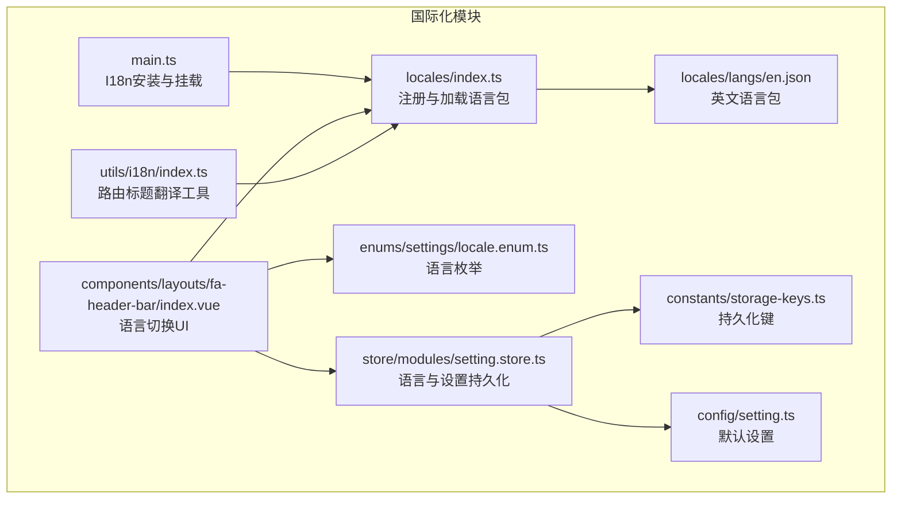
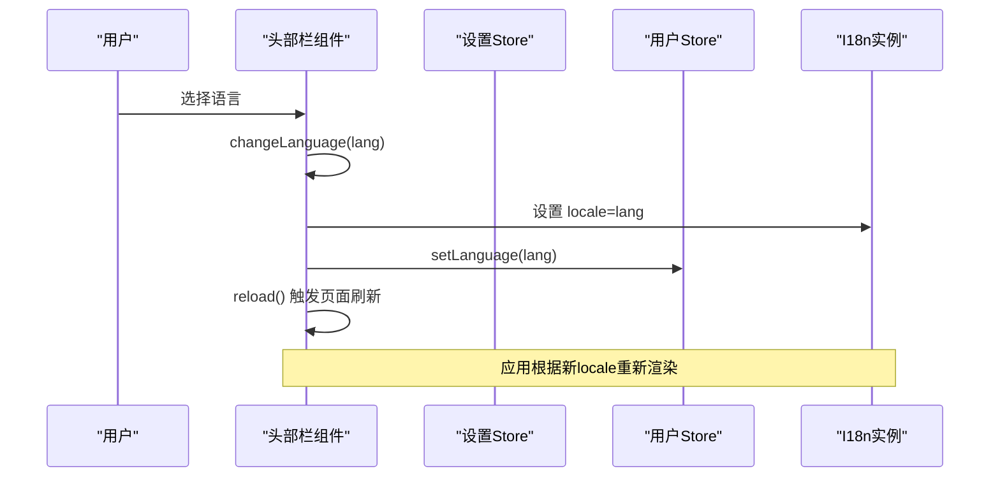
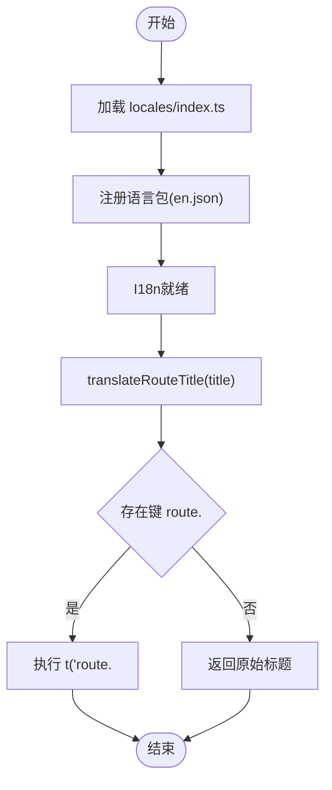
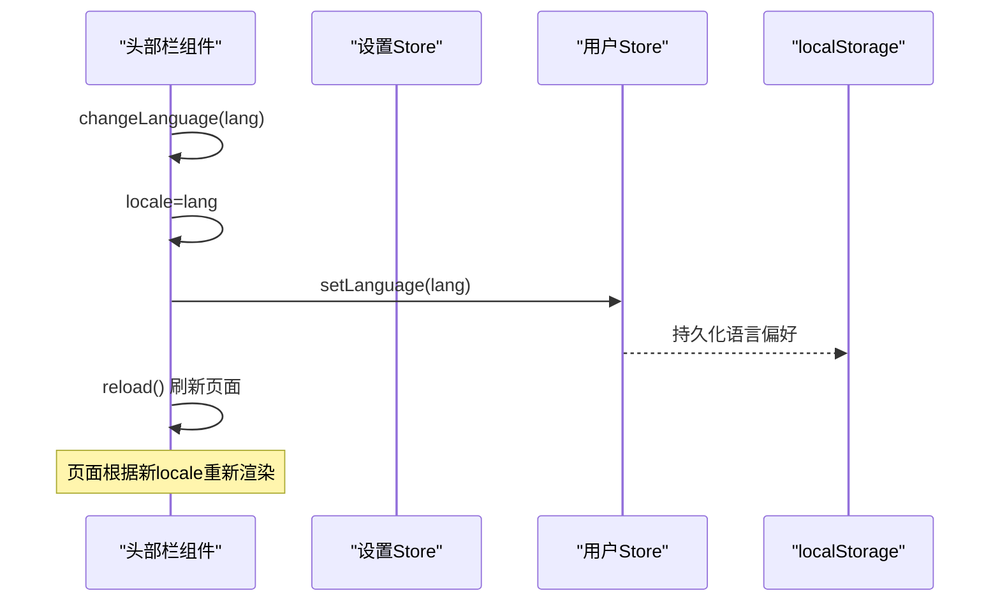
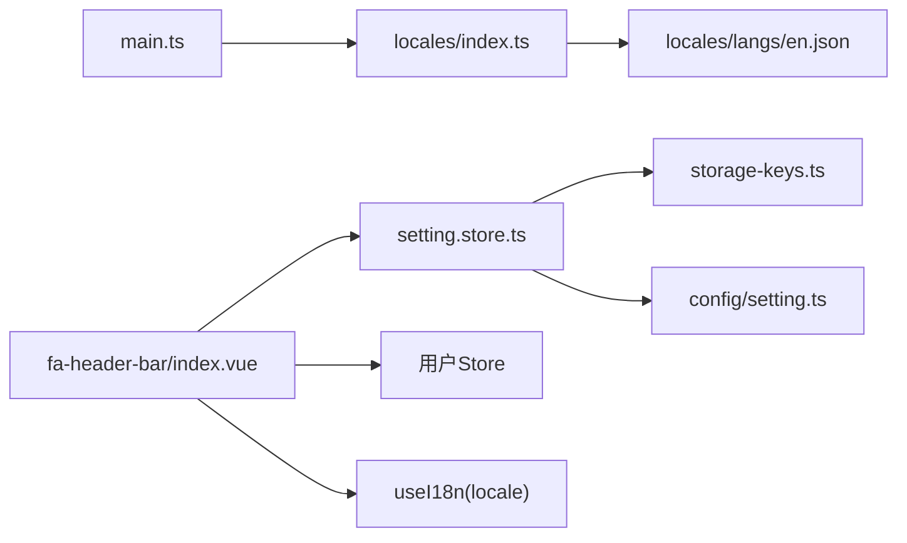

# 国际化支持

<cite>
**本文引用的文件**   
- [frontend/web/src/locales/langs/en.json](file://frontend/web/src/locales/langs/en.json)
- [frontend/web/src/utils/i18n/index.ts](file://frontend/web/src/utils/i18n/index.ts)
- [frontend/web/src/enums/settings/locale.enum.ts](file://frontend/web/src/enums/settings/locale.enum.ts)
- [frontend/web/src/store/modules/setting.store.ts](file://frontend/web/src/store/modules/setting.store.ts)
- [frontend/web/src/components/layouts/fa-header-bar/index.vue](file://frontend/web/src/components/layouts/fa-header-bar/index.vue)
- [frontend/web/src/locales/index.ts](file://frontend/web/src/locales/index.ts)
- [frontend/web/src/main.ts](file://frontend/web/src/main.ts)
- [frontend/web/src/config/setting.ts](file://frontend/web/src/config/setting.ts)
- [frontend/web/src/constants/storage-keys.ts](file://frontend/web/src/constants/storage-keys.ts)
</cite>

## 目录
1. [简介](#简介)
2. [项目结构](#项目结构)
3. [核心组件](#核心组件)
4. [架构总览](#架构总览)
5. [详细组件分析](#详细组件分析)
6. [依赖关系分析](#依赖关系分析)
7. [性能考量](#性能考量)
8. [故障排查指南](#故障排查指南)
9. [结论](#结论)
10. [附录](#附录)

## 简介
本指南围绕基于 Vue I18n 的多语言解决方案，系统讲解 FastapiAdmin 前端的国际化实现方式，涵盖语言包管理、动态语言切换、本地化策略、语言检测与偏好保存、默认语言设置、翻译键值规范与嵌套翻译、日期/数字/货币本地化格式化、RTL 语言支持与文本方向处理、翻译完整性检查与版本管理策略，以及多语言项目的最佳实践与常见问题。

## 项目结构
前端国际化相关的关键目录与文件如下：
- 语言包：frontend/web/src/locales/langs
- 国际化工具：frontend/web/src/utils/i18n
- 语言枚举与设置：frontend/web/src/enums/settings/locale.enum.ts、frontend/web/src/store/modules/setting.store.ts
- 语言选择组件：frontend/web/src/components/layouts/fa-header-bar/index.vue
- 国际化入口与注册：frontend/web/src/locales/index.ts、frontend/web/src/main.ts
- 默认配置与存储键：frontend/web/src/config/setting.ts、frontend/web/src/constants/storage-keys.ts

**图表来源**
- [frontend/web/src/locales/index.ts](file://frontend/web/src/locales/index.ts)
- [frontend/web/src/locales/langs/en.json](file://frontend/web/src/locales/langs/en.json)
- [frontend/web/src/utils/i18n/index.ts](file://frontend/web/src/utils/i18n/index.ts)
- [frontend/web/src/enums/settings/locale.enum.ts](file://frontend/web/src/enums/settings/locale.enum.ts)
- [frontend/web/src/store/modules/setting.store.ts](file://frontend/web/src/store/modules/setting.store.ts)
- [frontend/web/src/components/layouts/fa-header-bar/index.vue](file://frontend/web/src/components/layouts/fa-header-bar/index.vue)
- [frontend/web/src/main.ts](file://frontend/web/src/main.ts)
- [frontend/web/src/config/setting.ts](file://frontend/web/src/config/setting.ts)
- [frontend/web/src/constants/storage-keys.ts](file://frontend/web/src/constants/storage-keys.ts)

**章节来源**
- [frontend/web/src/locales/index.ts](file://frontend/web/src/locales/index.ts)
- [frontend/web/src/locales/langs/en.json](file://frontend/web/src/locales/langs/en.json)
- [frontend/web/src/utils/i18n/index.ts](file://frontend/web/src/utils/i18n/index.ts)
- [frontend/web/src/enums/settings/locale.enum.ts](file://frontend/web/src/enums/settings/locale.enum.ts)
- [frontend/web/src/store/modules/setting.store.ts](file://frontend/web/src/store/modules/setting.store.ts)
- [frontend/web/src/components/layouts/fa-header-bar/index.vue](file://frontend/web/src/components/layouts/fa-header-bar/index.vue)
- [frontend/web/src/main.ts](file://frontend/web/src/main.ts)
- [frontend/web/src/config/setting.ts](file://frontend/web/src/config/setting.ts)
- [frontend/web/src/constants/storage-keys.ts](file://frontend/web/src/constants/storage-keys.ts)

## 核心组件
- 语言包管理：通过 locales/index.ts 注册语言包，en.json 提供英文翻译键值。
- 动态语言切换：fa-header-bar 组件提供下拉菜单，调用 changeLanguage 更新 locale 并持久化用户语言偏好。
- 本地化策略：使用 translateRouteTitle 工具对路由标题进行键名映射与翻译。
- 语言检测与偏好保存：设置 store 中的 showLangSelect 控制语言选择器显示；语言偏好通过 useStorage 持久化到 localStorage。
- 默认语言设置：main.ts 安装 I18n 时设置默认语言；fa-header-bar 初始化时读取用户语言偏好。
- 键值规范与嵌套翻译：en.json 使用层级键（如 topBar.search.title），便于按模块组织与复用。
- 日期/数字/货币格式化：当前仓库未直接提供格式化实现，建议在需要的场景中引入 Intl 或第三方库进行本地化格式化。
- RTL 支持与文本方向：当前仓库未提供 RTL 语言支持与文本方向处理逻辑，建议在新增 RTL 语言时扩展样式与布局方向控制。

**章节来源**
- [frontend/web/src/locales/index.ts](file://frontend/web/src/locales/index.ts)
- [frontend/web/src/locales/langs/en.json](file://frontend/web/src/locales/langs/en.json)
- [frontend/web/src/utils/i18n/index.ts](file://frontend/web/src/utils/i18n/index.ts)
- [frontend/web/src/enums/settings/locale.enum.ts](file://frontend/web/src/enums/settings/locale.enum.ts)
- [frontend/web/src/store/modules/setting.store.ts](file://frontend/web/src/store/modules/setting.store.ts)
- [frontend/web/src/components/layouts/fa-header-bar/index.vue](file://frontend/web/src/components/layouts/fa-header-bar/index.vue)
- [frontend/web/src/main.ts](file://frontend/web/src/main.ts)

## 架构总览
Vue I18n 在应用启动时被安装并挂载，locales/index.ts 负责注册语言包；fa-header-bar 提供语言切换 UI；用户选择语言后更新 locale 并持久化；translateRouteTitle 对路由标题进行键名映射与翻译。

**图表来源**
- [frontend/web/src/components/layouts/fa-header-bar/index.vue](file://frontend/web/src/components/layouts/fa-header-bar/index.vue)
- [frontend/web/src/store/modules/setting.store.ts](file://frontend/web/src/store/modules/setting.store.ts)
- [frontend/web/src/main.ts](file://frontend/web/src/main.ts)

## 详细组件分析

### 语言包与注册
- locales/index.ts：负责注册语言包，作为 I18n 的资源入口。
- locales/langs/en.json：提供英文翻译键值，采用层级结构组织（如 topBar.search.title）。
- utils/i18n/index.ts：提供 translateRouteTitle 工具，将路由标题映射为翻译键并返回对应文案。

**图表来源**
- [frontend/web/src/locales/index.ts](file://frontend/web/src/locales/index.ts)
- [frontend/web/src/locales/langs/en.json](file://frontend/web/src/locales/langs/en.json)
- [frontend/web/src/utils/i18n/index.ts](file://frontend/web/src/utils/i18n/index.ts)

**章节来源**
- [frontend/web/src/locales/index.ts](file://frontend/web/src/locales/index.ts)
- [frontend/web/src/locales/langs/en.json](file://frontend/web/src/locales/langs/en.json)
- [frontend/web/src/utils/i18n/index.ts](file://frontend/web/src/utils/i18n/index.ts)

### 动态语言切换与偏好保存
- fa-header-bar/index.vue：提供语言选择下拉菜单，调用 changeLanguage 切换语言；初始化时读取用户语言偏好并设置 locale。
- setting.store.ts：提供 showLangSelect 控制语言选择器显示；语言偏好通过 useStorage 持久化到 localStorage。
- locale.enum.ts：定义语言枚举（如 zh-cn、en）。

**图表来源**
- [frontend/web/src/components/layouts/fa-header-bar/index.vue](file://frontend/web/src/components/layouts/fa-header-bar/index.vue)
- [frontend/web/src/store/modules/setting.store.ts](file://frontend/web/src/store/modules/setting.store.ts)
- [frontend/web/src/enums/settings/locale.enum.ts](file://frontend/web/src/enums/settings/locale.enum.ts)

**章节来源**
- [frontend/web/src/components/layouts/fa-header-bar/index.vue](file://frontend/web/src/components/layouts/fa-header-bar/index.vue)
- [frontend/web/src/store/modules/setting.store.ts](file://frontend/web/src/store/modules/setting.store.ts)
- [frontend/web/src/enums/settings/locale.enum.ts](file://frontend/web/src/enums/settings/locale.enum.ts)

### 语言检测与默认语言设置
- main.ts：安装并挂载 I18n，设置默认语言。
- fa-header-bar/index.vue：初始化时读取用户语言偏好并设置 locale。
- config/setting.ts：提供默认配置项，包括语言相关设置。
- constants/storage-keys.ts：提供持久化键常量，用于统一管理存储键名。

**章节来源**
- [frontend/web/src/main.ts](file://frontend/web/src/main.ts)
- [frontend/web/src/components/layouts/fa-header-bar/index.vue](file://frontend/web/src/components/layouts/fa-header-bar/index.vue)
- [frontend/web/src/config/setting.ts](file://frontend/web/src/config/setting.ts)
- [frontend/web/src/constants/storage-keys.ts](file://frontend/web/src/constants/storage-keys.ts)

### 翻译键值规范与嵌套翻译
- 层级键命名：en.json 使用如 topBar.search.title 的层级结构，便于模块化组织与复用。
- 嵌套翻译：通过点号分隔的键路径访问深层值，减少重复键与维护成本。
- 路由标题翻译：translateRouteTitle 将路由标题映射为 route.<title> 键，若存在则翻译，否则回退为原始标题。

**章节来源**
- [frontend/web/src/locales/langs/en.json](file://frontend/web/src/locales/langs/en.json)
- [frontend/web/src/utils/i18n/index.ts](file://frontend/web/src/utils/i18n/index.ts)

### 日期、数字与货币本地化格式化
- 当前仓库未直接提供日期/数字/货币的本地化格式化实现。
- 建议在需要的场景中引入 Intl.NumberFormat、Intl.DateTimeFormat 或第三方库（如 dayjs/numeral）进行本地化格式化。
- 可在组件或工具函数中封装格式化方法，结合当前 locale 进行动态格式化。

[本节为通用指导，不直接分析具体文件，故无“章节来源”]

### RTL 语言支持与文本方向处理
- 当前仓库未提供 RTL 语言支持与文本方向处理逻辑。
- 新增 RTL 语言时，建议：
  - 在 locales/index.ts 中注册 RTL 语言包。
  - 在 fa-header-bar 或全局样式中增加文本方向控制（如 dir="rtl"）。
  - 在布局与组件中处理双向箭头、图标镜像等细节。

[本节为通用指导，不直接分析具体文件，故无“章节来源”]

## 依赖关系分析
- 组件耦合与内聚：fa-header-bar 依赖设置 Store 与用户 Store，耦合度适中；语言切换逻辑集中在组件内，职责清晰。
- 直接与间接依赖：I18n 实例由 main.ts 安装，locales/index.ts 注册语言包；组件通过 useI18n 获取 locale；设置 Store 通过 useStorage 持久化语言偏好。
- 外部依赖与集成点：依赖 Element Plus 的 ElDropdown 与 ElDropdownItem 实现语言选择 UI；依赖 vue-i18n 提供的 t 与 te 方法。
- 接口契约与实现细节：translateRouteTitle 依赖 i18n.global.t 与 i18n.global.te；fa-header-bar 依赖 useI18n.locale 与 changeLanguage 流程。

**图表来源**
- [frontend/web/src/main.ts](file://frontend/web/src/main.ts)
- [frontend/web/src/locales/index.ts](file://frontend/web/src/locales/index.ts)
- [frontend/web/src/locales/langs/en.json](file://frontend/web/src/locales/langs/en.json)
- [frontend/web/src/components/layouts/fa-header-bar/index.vue](file://frontend/web/src/components/layouts/fa-header-bar/index.vue)
- [frontend/web/src/store/modules/setting.store.ts](file://frontend/web/src/store/modules/setting.store.ts)
- [frontend/web/src/constants/storage-keys.ts](file://frontend/web/src/constants/storage-keys.ts)
- [frontend/web/src/config/setting.ts](file://frontend/web/src/config/setting.ts)

**章节来源**
- [frontend/web/src/main.ts](file://frontend/web/src/main.ts)
- [frontend/web/src/locales/index.ts](file://frontend/web/src/locales/index.ts)
- [frontend/web/src/locales/langs/en.json](file://frontend/web/src/locales/langs/en.json)
- [frontend/web/src/components/layouts/fa-header-bar/index.vue](file://frontend/web/src/components/layouts/fa-header-bar/index.vue)
- [frontend/web/src/store/modules/setting.store.ts](file://frontend/web/src/store/modules/setting.store.ts)
- [frontend/web/src/constants/storage-keys.ts](file://frontend/web/src/constants/storage-keys.ts)
- [frontend/web/src/config/setting.ts](file://frontend/web/src/config/setting.ts)

## 性能考量
- 语言包体积控制：按模块拆分语言包，避免一次性加载过多键值；仅在进入对应模块时按需加载。
- 渲染性能：路由标题翻译仅在需要时调用 translateRouteTitle，避免频繁计算。
- 缓存与懒加载：利用浏览器缓存与按需加载策略，减少重复请求与解析成本。
- 本地化格式化：对日期/数字/货币的格式化应避免在高频渲染中重复创建格式化器，可在组件初始化时创建并复用。

[本节为通用指导，不直接分析具体文件，故无“章节来源”]

## 故障排查指南
- 语言切换无效：检查 fa-header-bar 的 changeLanguage 是否正确设置 locale，并确认用户 Store 的 setLanguage 是否持久化成功；查看设置 Store 的 showLangSelect 是否开启。
- 路由标题未翻译：确认 en.json 中是否存在 route.<title> 键；检查 translateRouteTitle 的键名拼接是否正确。
- 语言包未生效：确认 locales/index.ts 是否正确注册语言包；检查 main.ts 中 I18n 的安装顺序与默认语言设置。
- 本地化格式化异常：确认在需要的场景中已引入并正确使用本地化格式化方法；检查当前 locale 与格式化器配置。

**章节来源**
- [frontend/web/src/components/layouts/fa-header-bar/index.vue](file://frontend/web/src/components/layouts/fa-header-bar/index.vue)
- [frontend/web/src/store/modules/setting.store.ts](file://frontend/web/src/store/modules/setting.store.ts)
- [frontend/web/src/utils/i18n/index.ts](file://frontend/web/src/utils/i18n/index.ts)
- [frontend/web/src/locales/index.ts](file://frontend/web/src/locales/index.ts)
- [frontend/web/src/main.ts](file://frontend/web/src/main.ts)

## 结论
本项目基于 Vue I18n 实现了完善的多语言支持，具备清晰的语言包组织、动态语言切换与偏好保存机制。通过层级键值与路由标题翻译工具，实现了良好的可维护性与扩展性。建议后续补充日期/数字/货币的本地化格式化能力，并在新增 RTL 语言时完善文本方向处理与样式适配，以满足更广泛的国际化需求。

## 附录
- 翻译完整性检查：定期扫描语言包中的缺失键，确保各语言版本键值一致。
- 版本管理：在发布版本中标注语言包版本，配合变更日志追踪翻译更新。
- 最佳实践：保持键值命名一致性、避免硬编码字符串、按模块拆分语言包、提供默认回退文案。

[本节为通用指导，不直接分析具体文件，故无“章节来源”]