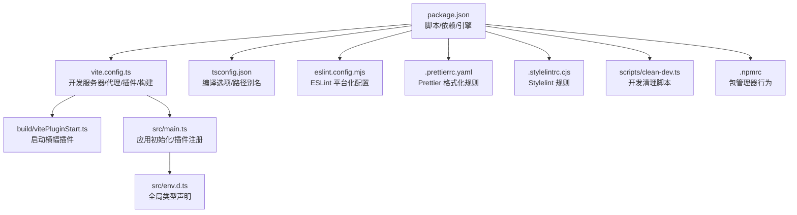
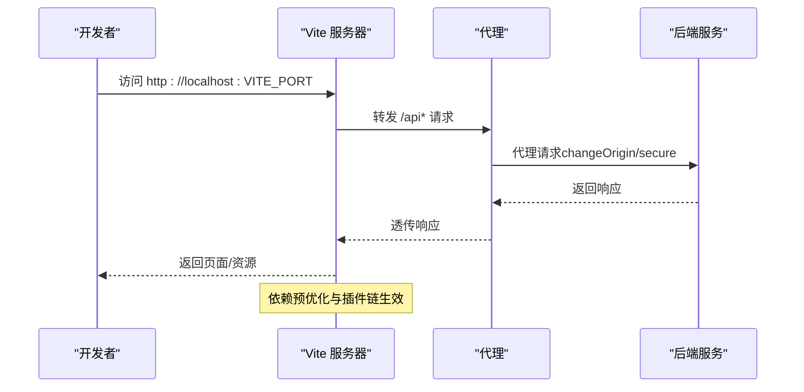
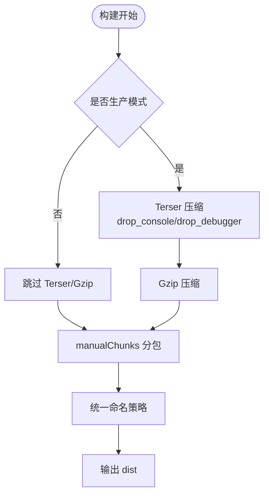
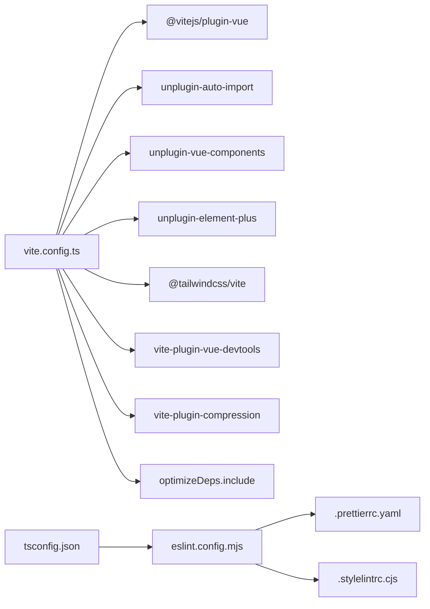

# 开发工作流程

<cite>
**本文引用的文件**
- [frontend/web/package.json](file://frontend/web/package.json)
- [frontend/web/vite.config.ts](file://frontend/web/vite.config.ts)
- [frontend/web/tsconfig.json](file://frontend/web/tsconfig.json)
- [frontend/web/eslint.config.mjs](file://frontend/web/eslint.config.mjs)
- [frontend/web/.prettierrc.yaml](file://frontend/web/.prettierrc.yaml)
- [frontend/web/.stylelintrc.cjs](file://frontend/web/.stylelintrc.cjs)
- [frontend/web/src/main.ts](file://frontend/web/src/main.ts)
- [frontend/web/src/env.d.ts](file://frontend/web/src/env.d.ts)
- [frontend/web/scripts/clean-dev.ts](file://frontend/web/scripts/clean-dev.ts)
- [frontend/web/build/vitePluginStart.ts](file://frontend/web/build/vitePluginStart.ts)
- [frontend/web/.npmrc](file://frontend/web/.npmrc)
</cite>

## 目录
1. [简介](#简介)
2. [项目结构](#项目结构)
3. [核心组件](#核心组件)
4. [架构总览](#架构总览)
5. [详细组件分析](#详细组件分析)
6. [依赖关系分析](#依赖关系分析)
7. [性能考量](#性能考量)
8. [故障排查指南](#故障排查指南)
9. [结论](#结论)
10. [附录](#附录)

## 简介
本指南面向前端团队，系统阐述基于 Vite 的开发工作流程与工程化实践，涵盖开发服务器与热重载、构建优化、TypeScript 类型检查、ESLint 与 Prettier 规范、包管理与版本控制、代码质量保障（单元/集成/端到端）、调试与性能分析、错误追踪、持续集成与自动化部署、以及开发工具链优化（代码分割、懒加载、缓存策略）。同时提供团队协作的统一开发环境与工作流规范。

## 项目结构
前端工程位于 frontend/web，采用 Vite + Vue 3 + TypeScript 技术栈，配合 Element Plus、Tailwind CSS、Pinia、Vue Router 等生态组件。核心目录与文件如下：
- 构建与开发：vite.config.ts、build/vitePluginStart.ts、scripts/clean-dev.ts
- 类型与规范：tsconfig.json、eslint.config.mjs、.prettierrc.yaml、.stylelintrc.cjs
- 应用入口：src/main.ts、src/env.d.ts
- 包管理：package.json、.npmrc



**图表来源**
- [frontend/web/package.json:1-205](file://frontend/web/package.json#L1-L205)
- [frontend/web/vite.config.ts:1-292](file://frontend/web/vite.config.ts#L1-L292)
- [frontend/web/build/vitePluginStart.ts:1-48](file://frontend/web/build/vitePluginStart.ts#L1-L48)
- [frontend/web/src/main.ts:1-35](file://frontend/web/src/main.ts#L1-L35)
- [frontend/web/src/env.d.ts:1-35](file://frontend/web/src/env.d.ts#L1-L35)
- [frontend/web/tsconfig.json:1-39](file://frontend/web/tsconfig.json#L1-L39)
- [frontend/web/eslint.config.mjs:1-88](file://frontend/web/eslint.config.mjs#L1-L88)
- [frontend/web/.prettierrc.yaml:1-42](file://frontend/web/.prettierrc.yaml#L1-L42)
- [frontend/web/.stylelintrc.cjs:1-68](file://frontend/web/.stylelintrc.cjs#L1-L68)
- [frontend/web/scripts/clean-dev.ts:1-713](file://frontend/web/scripts/clean-dev.ts#L1-L713)
- [frontend/web/.npmrc:1-3](file://frontend/web/.npmrc#L1-L3)

**章节来源**
- [frontend/web/package.json:1-205](file://frontend/web/package.json#L1-L205)
- [frontend/web/vite.config.ts:1-292](file://frontend/web/vite.config.ts#L1-L292)
- [frontend/web/src/main.ts:1-35](file://frontend/web/src/main.ts#L1-L35)

## 核心组件
- Vite 开发服务器与热重载：通过 server.host/port/open/proxy 配置实现本地联调与跨域代理。
- 构建优化：Rollup 输出策略、Terser 压缩、Gzip 压缩、代码分割与资源命名。
- 类型系统：TypeScript 编译选项、路径别名、全局类型声明。
- 代码质量：ESLint 平台化配置、Prettier、Stylelint，结合 lint-staged 与 Husky。
- 插件体系：自动导入 API、组件自动注册、Element Plus、Tailwind CSS、Vite DevTools。
- 开发辅助：启动横幅插件、开发清理脚本、包管理器配置。

**章节来源**
- [frontend/web/vite.config.ts:50-287](file://frontend/web/vite.config.ts#L50-L287)
- [frontend/web/tsconfig.json:1-39](file://frontend/web/tsconfig.json#L1-L39)
- [frontend/web/eslint.config.mjs:1-88](file://frontend/web/eslint.config.mjs#L1-L88)
- [frontend/web/.prettierrc.yaml:1-42](file://frontend/web/.prettierrc.yaml#L1-L42)
- [frontend/web/.stylelintrc.cjs:1-68](file://frontend/web/.stylelintrc.cjs#L1-L68)
- [frontend/web/build/vitePluginStart.ts:1-48](file://frontend/web/build/vitePluginStart.ts#L1-L48)
- [frontend/web/scripts/clean-dev.ts:1-713](file://frontend/web/scripts/clean-dev.ts#L1-L713)
- [frontend/web/.npmrc:1-3](file://frontend/web/.npmrc#L1-L3)

## 架构总览
下图展示从前端开发到构建产物的关键交互路径，包括开发服务器、代理、插件、构建优化与预览流程。

```mermaid
graph TB
subgraph "开发阶段"
Dev["浏览器"] <- --> Srv["Vite 开发服务器"]
Srv --> Proxy["代理配置<br/>VITE_APP_BASE_API -> VITE_API_BASE_URL"]
Srv --> OptDeps["依赖预优化<br/>optimizeDeps.include"]
Srv --> Plugins["插件链<br/>AutoImport/Components/ElementPlus/TailwindCSS/DevTools"]
end
subgraph "构建阶段"
Build["vite build"] --> Rollup["Rollup 输出配置<br/>manualChunks/命名策略"]
Rollup --> Terser["Terser 压缩<br/>drop_console/drop_debugger"]
Rollup --> Gzip["Gzip 压缩插件"]
Rollup --> Out["dist 输出"]
end
subgraph "质量与规范"
Lint["ESLint/Prettier/Stylelint"] --> Stage["lint-staged/Husky"]
Stage --> Commit["Git 提交"]
end
```

**图表来源**
- [frontend/web/vite.config.ts:60-287](file://frontend/web/vite.config.ts#L60-L287)
- [frontend/web/package.json:28-34](file://frontend/web/package.json#L28-L34)

## 详细组件分析

### Vite 开发服务器与热重载
- 服务器配置：host、port、open、proxy（API 代理），便于前后端联调与跨域访问。
- 依赖预优化：显式 include 常用库，减少首次冷启动抖动与依赖扫描时间。
- 插件链：自动导入 API、组件自动注册、Element Plus、Tailwind CSS、Vite DevTools（仅开发）。
- 启动横幅：自定义启动 Banner，打印版本、模式、API 地址、端口等信息。



**图表来源**
- [frontend/web/vite.config.ts:60-72](file://frontend/web/vite.config.ts#L60-L72)
- [frontend/web/vite.config.ts:208-261](file://frontend/web/vite.config.ts#L208-L261)
- [frontend/web/build/vitePluginStart.ts:16-35](file://frontend/web/build/vitePluginStart.ts#L16-L35)

**章节来源**
- [frontend/web/vite.config.ts:50-287](file://frontend/web/vite.config.ts#L50-L287)
- [frontend/web/build/vitePluginStart.ts:1-48](file://frontend/web/build/vitePluginStart.ts#L1-L48)

### 构建优化与代码分割
- 目标与输出：ES2024 目标、按模块拆分 vendor 与业务包，提升缓存命中率。
- 代码分割：manualChunks 按第三方库分包（如 element-plus、echarts、wangeditor 等），并针对 Vue 生态进行聚合。
- 资源命名：统一 JS/CSS/图片/字体/媒体命名策略，便于 CDN 缓存与回滚。
- 压缩策略：生产环境启用 Terser 去除 console 与 debugger，Gzip 压缩以降低传输体积。
- 动态导入：对视图级模块启用动态导入变量检查，确保按需加载。



**图表来源**
- [frontend/web/vite.config.ts:86-173](file://frontend/web/vite.config.ts#L86-L173)
- [frontend/web/vite.config.ts:197-204](file://frontend/web/vite.config.ts#L197-L204)

**章节来源**
- [frontend/web/vite.config.ts:86-173](file://frontend/web/vite.config.ts#L86-L173)

### TypeScript 配置与类型声明
- 编译选项：严格模式、Bundler 解析、ESNext 模块、DOM/Iteratable 库、sourceMap、路径别名。
- include/exclude：限定类型检查范围，排除 node_modules/dist。
- 全局类型：env.d.ts 声明 Vite 客户端类型与第三方模块类型，确保 IDE 与类型检查正确性。

**章节来源**
- [frontend/web/tsconfig.json:1-39](file://frontend/web/tsconfig.json#L1-L39)
- [frontend/web/src/env.d.ts:1-35](file://frontend/web/src/env.d.ts#L1-L35)

### ESLint 与 Prettier/Stylelint 规范
- ESLint 平台化配置：flat config 结构，引入 js、typescript-eslint、eslint-plugin-vue 推荐规则。
- 自动导入全局：读取 .auto-import.json，注入自动导入的全局变量，避免未定义报错。
- Prettier：统一缩进、分号、引号、尾逗号、换行等风格；支持 Vue、HTML、SCSS 等多语言。
- Stylelint：标准 + SCSS + Recess 排序，允许 Vue 深度选择器与 Tailwind 特定 at-rules。
- lint-staged：提交前自动格式化与修复，覆盖 Vue/JS/TS/JSON/SCSS/HTML/YAML 等。

**章节来源**
- [frontend/web/eslint.config.mjs:1-88](file://frontend/web/eslint.config.mjs#L1-L88)
- [frontend/web/.prettierrc.yaml:1-42](file://frontend/web/.prettierrc.yaml#L1-L42)
- [frontend/web/.stylelintrc.cjs:1-68](file://frontend/web/.stylelintrc.cjs#L1-L68)
- [frontend/web/package.json:41-67](file://frontend/web/package.json#L41-L67)

### 包管理策略与版本控制
- 包管理器：pnpm，指定引擎版本要求，抑制深层废弃依赖告警。
- 依赖与开发依赖：集中于 package.json，遵循“生产依赖最小化、开发依赖明确”的原则。
- overrides：对部分易冲突的依赖进行强制覆盖，保证稳定性。
- 脚本职责：dev/prod/build/preview/lint/type-check/clean 等，形成标准化工作流。

**章节来源**
- [frontend/web/package.json:179-193](file://frontend/web/package.json#L179-L193)
- [frontend/web/.npmrc:1-3](file://frontend/web/.npmrc#L1-L3)

### 代码质量保障流程
- 单元测试：建议使用 Vitest（与 Vite/Vue 3 协同良好），在 src 目录下按模块组织测试文件，利用 Vite 的原生 ES 模块支持与快照。
- 集成测试：以 e2e 测试框架（如 Playwright/Cypress）对接真实后端 API，结合代理配置与 mock 数据验证端到端流程。
- 提交前检查：husky + lint-staged 在 pre-commit 阶段自动执行 ESLint、Prettier、Stylelint，确保提交质量。

**章节来源**
- [frontend/web/package.json:28-34](file://frontend/web/package.json#L28-L34)
- [frontend/web/.husky/pre-commit:1-1](file://frontend/web/.husky/pre-commit#L1-L1)

### 开发调试技巧与性能分析
- DevTools：开发模式启用 Vite DevTools，定位组件、状态与性能热点。
- 启动横幅：查看版本、模式、API 地址、端口，便于快速核对环境。
- 依赖预优化：将常用库加入 optimizeDeps.include，缩短冷启动时间。
- 性能分析：结合浏览器性能面板与 Vite DevTools，识别慢依赖与渲染瓶颈。

**章节来源**
- [frontend/web/vite.config.ts:208-261](file://frontend/web/vite.config.ts#L208-L261)
- [frontend/web/build/vitePluginStart.ts:16-35](file://frontend/web/build/vitePluginStart.ts#L16-L35)

### 错误追踪与排障
- ESLint 规则：关闭显式 any、放宽多词组件名等，聚焦结构性问题。
- Prettier：将格式化压力交给工具，避免 CI/本地差异。
- Stylelint：允许深度选择器与 Tailwind at-rules，减少样式层面的误报。
- 日志与横幅：启动横幅打印关键信息，有助于快速定位配置问题。

**章节来源**
- [frontend/web/eslint.config.mjs:64-72](file://frontend/web/eslint.config.mjs#L64-L72)
- [frontend/web/.stylelintrc.cjs:26-40](file://frontend/web/.stylelintrc.cjs#L26-L40)

### 持续集成与自动化部署
- CI 工作流：仓库提供 GitHub Actions 示例文件（ci.yml），建议在流水线中执行安装、类型检查、构建与测试。
- 构建产物：dist 目录用于静态托管或容器镜像发布。
- 环境变量：通过 Vite 环境变量注入（VITE_*），在不同环境（dev/test/prod/gitee/dev）间切换。

**章节来源**
- [frontend/web/package.json:7-34](file://frontend/web/package.json#L7-L34)

### 开发工具链优化（代码分割、懒加载、缓存）
- 代码分割：manualChunks 按库聚合，vendor 与业务分离，提升缓存复用。
- 懒加载：动态导入视图级模块，按需加载，降低首屏体积。
- 缓存策略：资源文件带哈希名，静态资源分类命名，利于 CDN 缓存与失效控制。

**章节来源**
- [frontend/web/vite.config.ts:106-172](file://frontend/web/vite.config.ts#L106-L172)

### 团队协作规范
- 统一脚本：通过 package.json 统一脚本，避免环境差异。
- 提交规范：commitizen + cz-git，规范化提交信息，便于生成变更日志。
- 代码风格：ESLint + Prettier + Stylelint 三件套，配合 lint-staged 与 Husky。
- 开发清理：clean-dev.ts 脚本一键清理演示内容与示例路由，快速进入开发模式。

**章节来源**
- [frontend/web/package.json:34-40](file://frontend/web/package.json#L34-L40)
- [frontend/web/scripts/clean-dev.ts:1-713](file://frontend/web/scripts/clean-dev.ts#L1-L713)

## 依赖关系分析
- Vite 作为核心构建与开发服务器，依赖插件生态（AutoImport/Components/ElementPlus/TailwindCSS/DevTools/Gzip）。
- TypeScript 与 ESLint/Stylelint/Prettier 形成“类型 + 规则 + 格式”的质量闭环。
- 依赖预优化与代码分割共同作用，降低冷启动与首屏体积。



**图表来源**
- [frontend/web/vite.config.ts:174-207](file://frontend/web/vite.config.ts#L174-L207)
- [frontend/web/tsconfig.json:1-39](file://frontend/web/tsconfig.json#L1-L39)
- [frontend/web/eslint.config.mjs:1-88](file://frontend/web/eslint.config.mjs#L1-L88)
- [frontend/web/.prettierrc.yaml:1-42](file://frontend/web/.prettierrc.yaml#L1-L42)
- [frontend/web/.stylelintrc.cjs:1-68](file://frontend/web/.stylelintrc.cjs#L1-L68)

**章节来源**
- [frontend/web/vite.config.ts:174-207](file://frontend/web/vite.config.ts#L174-L207)
- [frontend/web/tsconfig.json:1-39](file://frontend/web/tsconfig.json#L1-L39)

## 性能考量
- 冷启动：optimizeDeps.include 预热常用依赖，减少首次扫描与依赖优化时间。
- 体积控制：manualChunks 拆分 vendor 与业务，Terser 去除无用代码，Gzip 压缩资源。
- 首屏优化：动态导入视图，按需加载第三方库，减少初始包体。
- 缓存策略：资源命名带 hash，分类输出，利于浏览器与 CDN 缓存。

**章节来源**
- [frontend/web/vite.config.ts:208-261](file://frontend/web/vite.config.ts#L208-L261)
- [frontend/web/vite.config.ts:104-173](file://frontend/web/vite.config.ts#L104-L173)

## 故障排查指南
- 环境变量未生效：检查 Vite 环境变量前缀与模式（dev/test/prod/gitee/dev）。
- 代理不生效：核对 VITE_APP_BASE_API 与 VITE_API_BASE_URL，确认 changeOrigin/secure。
- 类型报错：确认 tsconfig.json 的 include/exclude 与 env.d.ts 声明。
- 样式问题：检查 Stylelint 规则与 Tailwind at-rules 允许列表。
- 提交失败：lint-staged 未通过，先执行 pnpm lint 或修复提示问题。

**章节来源**
- [frontend/web/vite.config.ts:59-72](file://frontend/web/vite.config.ts#L59-L72)
- [frontend/web/.stylelintrc.cjs:39-66](file://frontend/web/.stylelintrc.cjs#L39-L66)
- [frontend/web/package.json:28-34](file://frontend/web/package.json#L28-L34)

## 结论
本指南围绕 Vite + Vue 3 + TypeScript 的前端工程化实践，给出了从开发服务器、构建优化、类型与规范、质量保障、调试与性能、到 CI/CD 与团队协作的完整方案。建议团队在本地与 CI 中统一执行类型检查、构建与测试，结合 clean-dev.ts 快速进入开发模式，确保一致性与高效率。

## 附录
- 常用脚本参考
  - 开发：pnpm dev / pnpm dev:force
  - 构建：pnpm build / pnpm build:pro / pnpm build:test / pnpm build:gitee
  - 预览：pnpm serve:pro / pnpm serve:dev / pnpm serve:test
  - 质量：pnpm lint / pnpm lint:eslint / pnpm lint:prettier / pnpm lint:stylelint
  - 类型：pnpm type-check / pnpm ts:check
  - 清理：pnpm clean:dev（执行 clean-dev.ts）

**章节来源**
- [frontend/web/package.json:7-34](file://frontend/web/package.json#L7-L34)
- [frontend/web/scripts/clean-dev.ts:633-713](file://frontend/web/scripts/clean-dev.ts#L633-L713)