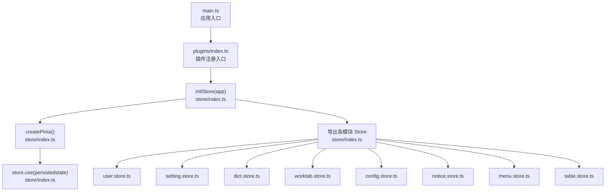
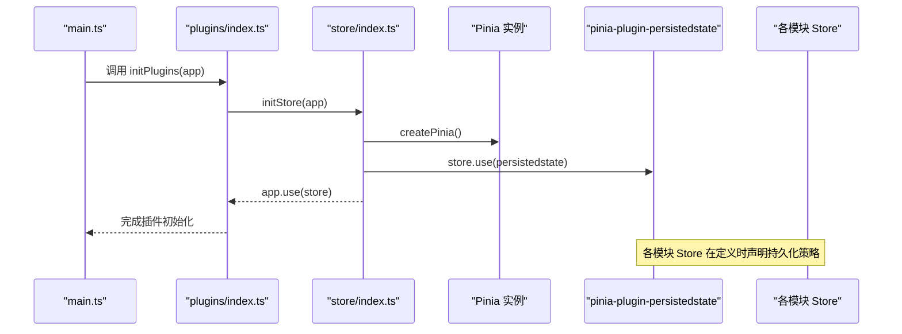
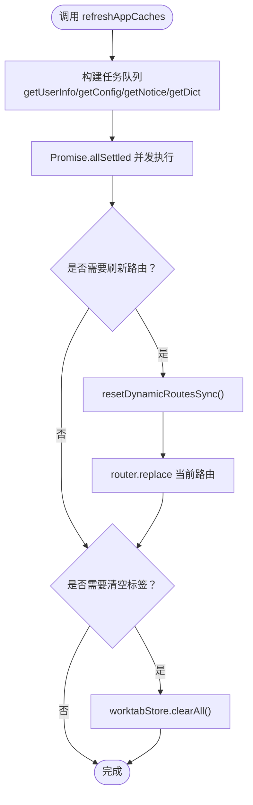
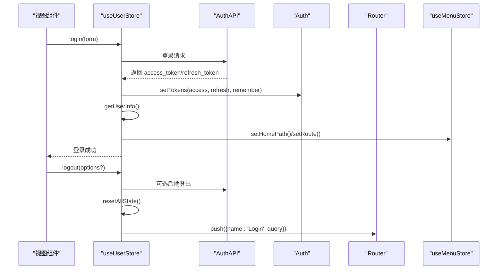
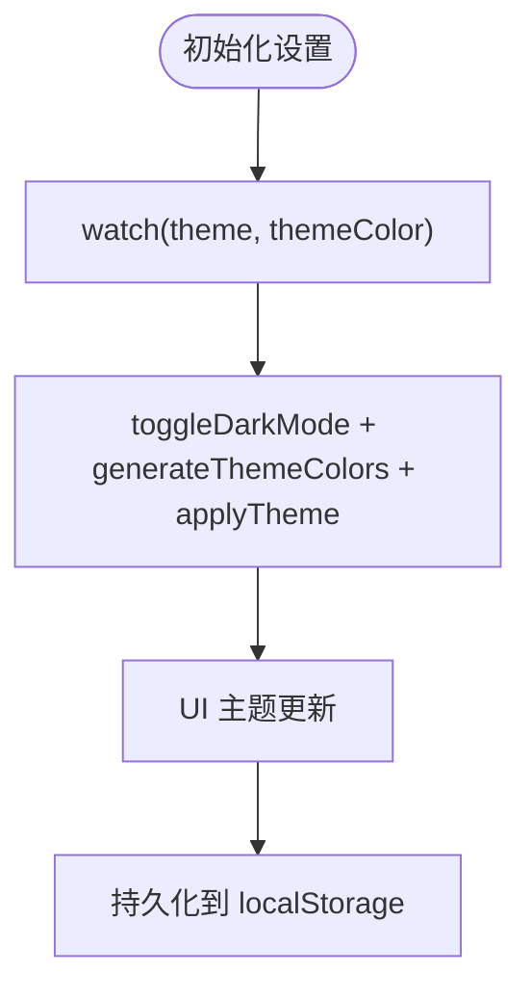
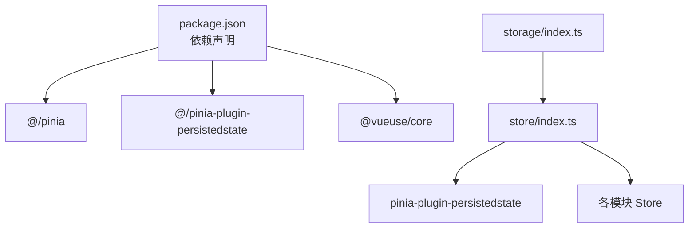

# Pinia Store 架构

<cite>
**本文档引用的文件**
- [store/index.ts](file://frontend/web/src/store/index.ts)
- [main.ts](file://frontend/web/src/main.ts)
- [plugins/index.ts](file://frontend/web/src/plugins/index.ts)
- [user.store.ts](file://frontend/web/src/store/modules/user.store.ts)
- [setting.store.ts](file://frontend/web/src/store/modules/setting.store.ts)
- [dict.store.ts](file://frontend/web/src/store/modules/dict.store.ts)
- [worktab.store.ts](file://frontend/web/src/store/modules/worktab.store.ts)
- [config.store.ts](file://frontend/web/src/store/modules/config.store.ts)
- [notice.store.ts](file://frontend/web/src/store/modules/notice.store.ts)
- [menu.store.ts](file://frontend/web/src/store/modules/menu.store.ts)
- [table.store.ts](file://frontend/web/src/store/modules/table.store.ts)
- [storage-keys.ts](file://frontend/web/src/constants/storage-keys.ts)
- [storage/index.ts](file://frontend/web/src/utils/storage/index.ts)
- [package.json](file://frontend/web/package.json)
</cite>

## 目录
1. [简介](#简介)
2. [项目结构](#项目结构)
3. [核心组件](#核心组件)
4. [架构总览](#架构总览)
5. [详细组件分析](#详细组件分析)
6. [依赖关系分析](#依赖关系分析)
7. [性能考虑](#性能考虑)
8. [故障排查指南](#故障排查指南)
9. [结论](#结论)
10. [附录](#附录)

## 简介
本文件系统性阐述 FastapiAdmin 前端工程中的 Pinia Store 架构，重点覆盖以下方面：
- Store 创建与初始化流程
- 插件系统与持久化机制
- 全局 Store 注册与模块化管理策略
- 核心 Store 的职责划分与实现要点
- 最佳实践：模块拆分、命名规范、依赖管理
- 生命周期管理与错误处理策略

## 项目结构
前端采用模块化 Store 设计，Store 根入口负责创建 Pinia 实例、安装持久化插件并集中导出各模块 Store；应用启动时通过插件注册流程在 Router 之前完成 Store 初始化。

**图表来源**
- [main.ts:23-34](file://frontend/web/src/main.ts#L23-L34)
- [plugins/index.ts:37-48](file://frontend/web/src/plugins/index.ts#L37-L48)
- [store/index.ts:11-29](file://frontend/web/src/store/index.ts#L11-L29)

**章节来源**
- [main.ts:23-34](file://frontend/web/src/main.ts#L23-L34)
- [plugins/index.ts:24-48](file://frontend/web/src/plugins/index.ts#L24-L48)
- [store/index.ts:11-29](file://frontend/web/src/store/index.ts#L11-L29)

## 核心组件
- Store 根入口：创建 Pinia 实例、安装持久化插件、集中导出模块 Store，并提供应用级缓存刷新工具。
- 用户 Store：管理登录状态、令牌、路由与权限、搜索历史、锁屏状态等。
- 设置 Store：管理布局、主题、页签、水印、工具栏等界面设置，部分设置使用持久化。
- 字典 Store：提供数据字典的缓存、批量获取、标签查找与清空。
- 工作标签页 Store：管理多标签页的打开、关闭、固定、缓存排除、路由有效性校验与持久化。
- 配置 Store：管理系统配置参数，支持强制刷新与缓存。
- 通知 Store：管理通知列表、已读状态与持久化。
- 菜单 Store：管理菜单列表、首页路径、动态路由移除函数与持久化。
- 表格 Store：管理全局表格外观与交互偏好，持久化到 localStorage。

**章节来源**
- [store/index.ts:11-29](file://frontend/web/src/store/index.ts#L11-L29)
- [user.store.ts:39-423](file://frontend/web/src/store/modules/user.store.ts#L39-L423)
- [setting.store.ts:27-524](file://frontend/web/src/store/modules/setting.store.ts#L27-L524)
- [dict.store.ts:41-152](file://frontend/web/src/store/modules/dict.store.ts#L41-L152)
- [worktab.store.ts:57-635](file://frontend/web/src/store/modules/worktab.store.ts#L57-L635)
- [config.store.ts:35-87](file://frontend/web/src/store/modules/config.store.ts#L35-L87)
- [notice.store.ts:35-125](file://frontend/web/src/store/modules/notice.store.ts#L35-L125)
- [menu.store.ts:42-120](file://frontend/web/src/store/modules/menu.store.ts#L42-L120)
- [table.store.ts:14-62](file://frontend/web/src/store/modules/table.store.ts#L14-L62)

## 架构总览
Pinia Store 架构遵循“根入口集中初始化 + 模块化职责分离”的设计，结合持久化插件实现跨页面状态共享与恢复。初始化流程严格依赖插件注册顺序，确保 Router 守卫能正确访问 Store。

**图表来源**
- [main.ts:29-34](file://frontend/web/src/main.ts#L29-L34)
- [plugins/index.ts:37-48](file://frontend/web/src/plugins/index.ts#L37-L48)
- [store/index.ts:11-13](file://frontend/web/src/store/index.ts#L11-L13)

**章节来源**
- [main.ts:23-34](file://frontend/web/src/main.ts#L23-L34)
- [plugins/index.ts:24-48](file://frontend/web/src/plugins/index.ts#L24-L48)
- [store/index.ts:11-13](file://frontend/web/src/store/index.ts#L11-L13)

## 详细组件分析

### Store 初始化与持久化机制
- 初始化流程
  - 在根入口创建 Pinia 实例并安装持久化插件。
  - 通过插件注册入口在 Router 之前完成 Store 注册，保证守卫可访问。
- 持久化策略
  - 通过插件在创建 Store 时注入持久化配置，支持按 Store 精细化控制。
  - 使用 localStorage 存储，键名可自定义或启用全局持久化。
- 全局缓存刷新
  - 提供统一的缓存刷新函数，支持并发拉取用户、配置、通知、字典等数据，并在需要时重置动态路由与工作标签页。

**图表来源**
- [store/index.ts:41-88](file://frontend/web/src/store/index.ts#L41-L88)

**章节来源**
- [store/index.ts:11-13](file://frontend/web/src/store/index.ts#L11-L13)
- [store/index.ts:41-88](file://frontend/web/src/store/index.ts#L41-L88)
- [plugins/index.ts:24-48](file://frontend/web/src/plugins/index.ts#L24-L48)

### 用户 Store（user.store）
- 职责
  - 登录/登出、令牌管理、用户信息获取与设置、路由与权限计算、锁屏状态与密码、搜索历史、记住我状态。
- 关键流程
  - 登录：调用认证接口，设置令牌与用户信息，获取路由并计算权限，清理动态路由初始化失败标记。
  - 登出：可选调用后端登出接口，统一清理状态与路由，支持跳转登录页并携带重定向参数。
  - 令牌刷新：基于刷新令牌请求新的访问令牌，保持“记住我”状态。
  - 状态重置：提供多种重置能力，包括完全重置（含字典与标签）。
- 依赖与协作
  - 与其他 Store 协作：设置 Store、工作标签页 Store、菜单 Store。
  - 延迟加载 Router 守卫工具，避免循环依赖。

**图表来源**
- [user.store.ts:240-312](file://frontend/web/src/store/modules/user.store.ts#L240-L312)
- [user.store.ts:344-356](file://frontend/web/src/store/modules/user.store.ts#L344-L356)
- [user.store.ts:317-330](file://frontend/web/src/store/modules/user.store.ts#L317-L330)

**章节来源**
- [user.store.ts:39-423](file://frontend/web/src/store/modules/user.store.ts#L39-L423)

### 设置 Store（setting.store）
- 职责
  - 管理布局、主题、页签、水印、工具栏等界面设置；部分设置使用持久化存储。
- 持久化方式
  - 使用 useStorage 与 persist 双重持久化策略，分别处理 UI 开关与主题配置。
- 主题与样式联动
  - 通过 watch 监听主题与颜色变化，动态应用 CSS 变量与暗色模式。

**图表来源**
- [setting.store.ts:180-200](file://frontend/web/src/store/modules/setting.store.ts#L180-L200)
- [setting.store.ts:517-523](file://frontend/web/src/store/modules/setting.store.ts#L517-L523)

**章节来源**
- [setting.store.ts:27-524](file://frontend/web/src/store/modules/setting.store.ts#L27-L524)

### 字典 Store（dict.store）
- 职责
  - 提供数据字典的缓存、批量获取、标签查找与清空。
- 性能优化
  - 按需加载与去重缓存，减少重复请求。
- 持久化
  - 使用全局持久化，跨页面共享字典数据。

**章节来源**
- [dict.store.ts:41-152](file://frontend/web/src/store/modules/dict.store.ts#L41-L152)

### 工作标签页 Store（worktab.store）
- 职责
  - 管理多标签页的打开、关闭、固定、批量关闭、KeepAlive 缓存排除、路由有效性校验与持久化。
- 关键算法
  - 标签页路由有效性验证：优先使用路由 name，否则解析路径参数进行匹配。
  - KeepAlive 排除策略：按组件名精确匹配，仅在同名实例全部移除后加入排除列表。
- 持久化
  - 使用自定义键名持久化，支持版本化键管理。

**章节来源**
- [worktab.store.ts:57-635](file://frontend/web/src/store/modules/worktab.store.ts#L57-L635)

### 配置 Store（config.store）
- 职责
  - 管理系统配置参数，支持强制刷新与缓存。
- 错误处理
  - 对响应数据进行类型校验，避免非数组数据污染状态。

**章节来源**
- [config.store.ts:35-87](file://frontend/web/src/store/modules/config.store.ts#L35-L87)

### 通知 Store（notice.store）
- 职责
  - 管理通知列表、已读状态与持久化。
- 交互
  - 支持单条与批量标记已读，过滤已读项。

**章节来源**
- [notice.store.ts:35-125](file://frontend/web/src/store/modules/notice.store.ts#L35-L125)

### 菜单 Store（menu.store）
- 职责
  - 管理菜单列表、首页路径、动态路由移除函数与持久化。
- 路由清理
  - 登出时调用移除函数清理动态路由，避免内存泄漏。

**章节来源**
- [menu.store.ts:42-120](file://frontend/web/src/store/modules/menu.store.ts#L42-L120)

### 表格 Store（table.store）
- 职责
  - 管理全局表格外观与交互偏好，持久化到 localStorage。
- 设计意图
  - 将“表格显示偏好”提升到 Pinia 层，实现跨页面同步。

**章节来源**
- [table.store.ts:14-62](file://frontend/web/src/store/modules/table.store.ts#L14-L62)

## 依赖关系分析
- 外部依赖
  - Pinia 与 pinia-plugin-persistedstate：状态管理与持久化。
  - VueUse 的 useStorage：细粒度持久化工具。
- 内部依赖
  - Store 之间通过组合式 API 共享状态，避免直接耦合。
  - 存储层提供版本化键管理与兼容性检查，保障升级与迁移。

**图表来源**
- [package.json:105-106](file://frontend/web/package.json#L105-L106)
- [package.json:106](file://frontend/web/package.json#L106)
- [store/index.ts:11-13](file://frontend/web/src/store/index.ts#L11-L13)
- [storage/index.ts:34-129](file://frontend/web/src/utils/storage/index.ts#L34-L129)

**章节来源**
- [package.json:105-106](file://frontend/web/package.json#L105-L106)
- [store/index.ts:11-13](file://frontend/web/src/store/index.ts#L11-L13)
- [storage/index.ts:34-129](file://frontend/web/src/utils/storage/index.ts#L34-L129)

## 性能考虑
- 并发加载：使用 Promise.allSettled 并发拉取多源数据，缩短首屏等待时间。
- 按需加载：字典与配置仅在需要时加载，避免冗余请求。
- KeepAlive 策略：通过组件名精确控制缓存排除，减少不必要的实例销毁与重建。
- 主题与样式：通过 CSS 变量与即时应用策略降低重绘成本。

## 故障排查指南
- 存储异常与登出
  - 当检测到存储异常时，系统会清除 localStorage 并标记存储失效，随后通过自定义事件触发路由登出流程，避免全量刷新。
- 路由有效性校验
  - 工作标签页 Store 在关闭或批量关闭标签时，同步校验路由有效性并清理无效标签，防止路由与状态脱节。
- 错误提示
  - 存储异常时弹出提示消息，引导用户重新登录恢复使用。

**章节来源**
- [storage/index.ts:190-230](file://frontend/web/src/utils/storage/index.ts#L190-L230)
- [worktab.store.ts:462-518](file://frontend/web/src/store/modules/worktab.store.ts#L462-L518)

## 结论
本架构通过根入口集中初始化、模块化职责分离与持久化策略，实现了稳定、可扩展且易维护的状态管理方案。配合严格的生命周期与错误处理机制，确保了用户体验与系统可靠性。

## 附录

### 最佳实践清单
- 模块拆分
  - 按业务域拆分 Store，避免单模块过度膨胀。
  - 将跨组件共享的状态上提到 Store，减少 props 传递层级。
- 命名规范
  - Store 名称使用 useXxxStore 命名，导出统一的 Hook 函数。
  - 持久化键名采用语义化前缀，便于检索与版本化管理。
- 依赖管理
  - Store 间通过组合式 API 共享状态，避免直接导入造成循环依赖。
  - 对外部 API 的调用进行错误捕获与降级处理。
- 生命周期
  - 在插件注册阶段完成 Store 初始化，确保守卫与组件可访问。
  - 登出与异常场景统一清理状态与路由，保证一致性。

### 关键配置参考
- 持久化键名常量
  - 认证、缓存、设置等键名集中管理，便于统一维护。
- 版本化键管理
  - 提供键前缀与版本匹配规则，支持跨版本数据迁移与兼容性检查。

**章节来源**
- [storage-keys.ts:8-79](file://frontend/web/src/constants/storage-keys.ts#L8-L79)
- [storage/index.ts:34-129](file://frontend/web/src/utils/storage/index.ts#L34-L129)