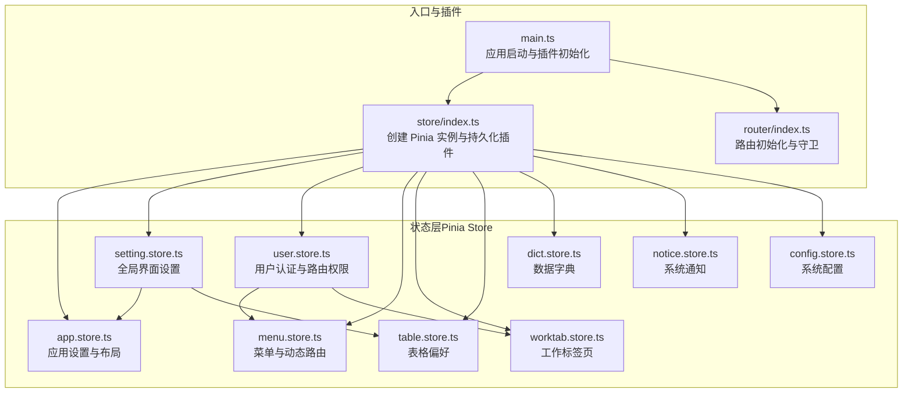
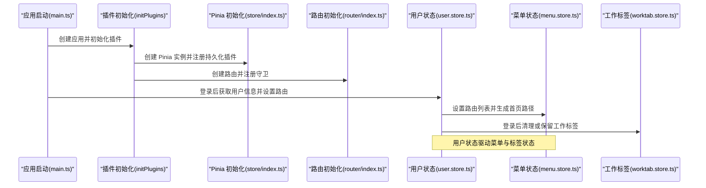
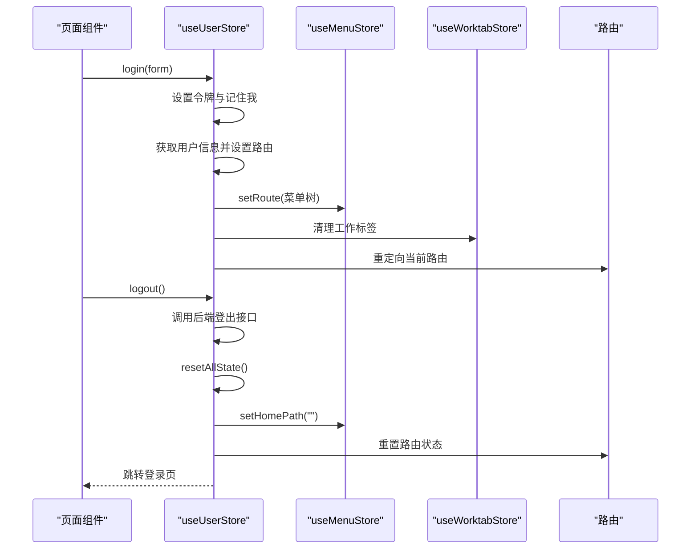
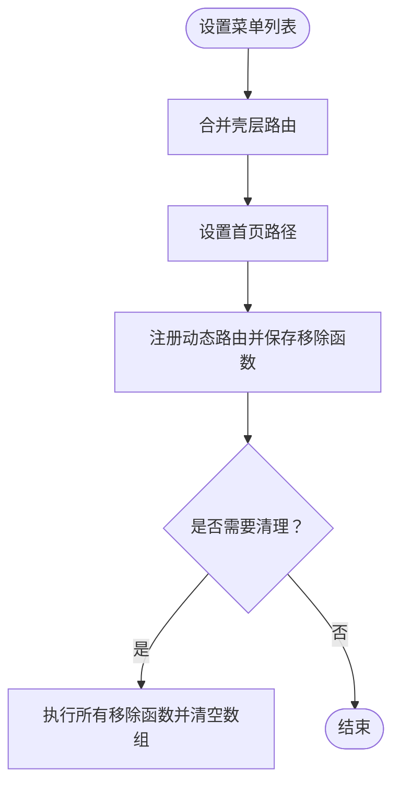
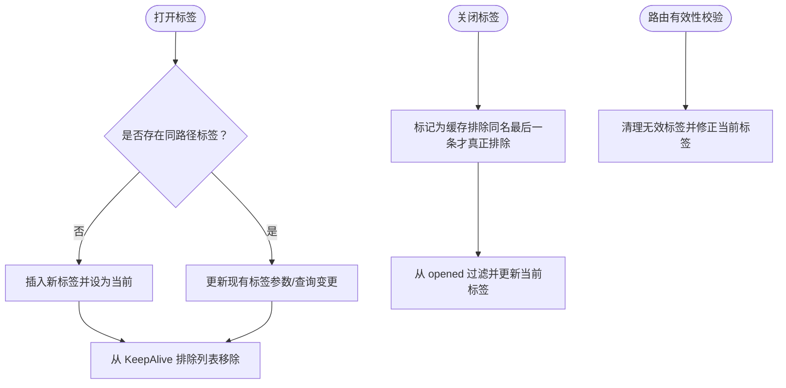
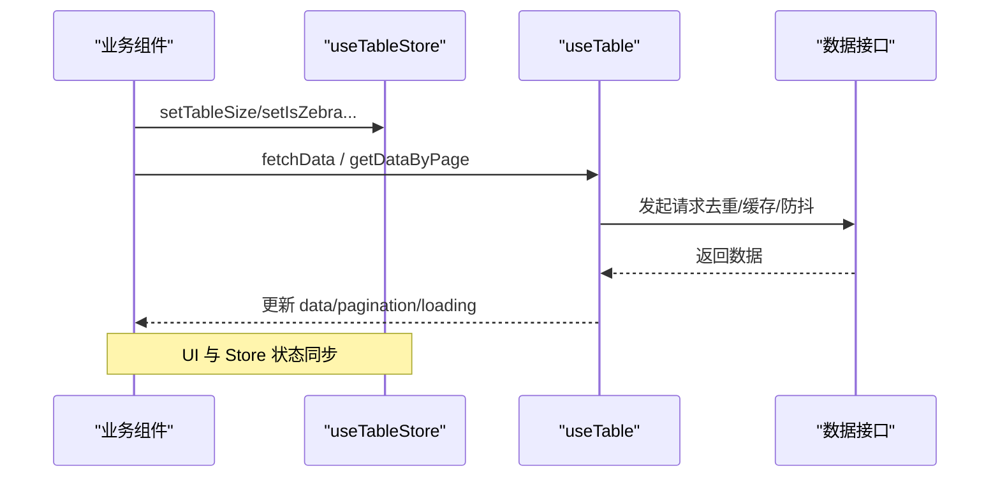
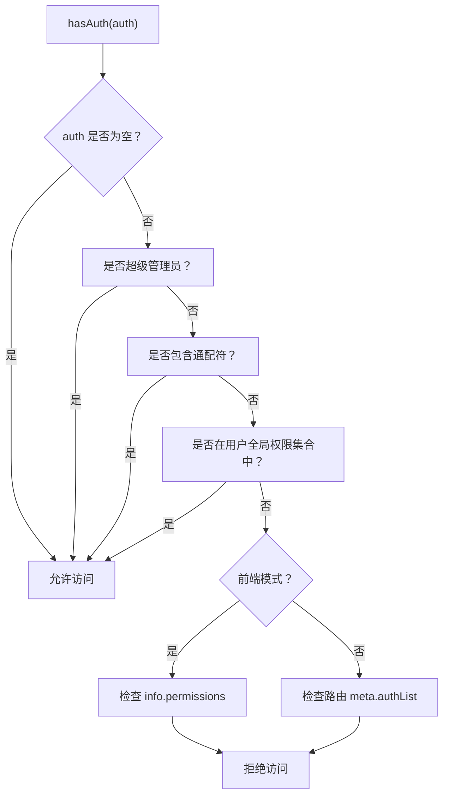
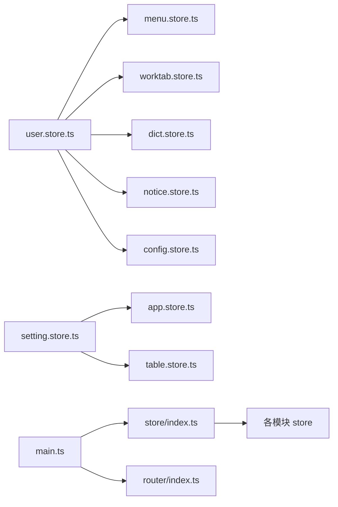

# Store 集成模式

<cite>
**本文档引用的文件**
- [frontend/web/src/store/index.ts](file://frontend/web/src/store/index.ts)
- [frontend/web/src/store/modules/app.store.ts](file://frontend/web/src/store/modules/app.store.ts)
- [frontend/web/src/store/modules/table.store.ts](file://frontend/web/src/store/modules/table.store.ts)
- [frontend/web/src/store/modules/user.store.ts](file://frontend/web/src/store/modules/user.store.ts)
- [frontend/web/src/store/modules/setting.store.ts](file://frontend/web/src/store/modules/setting.store.ts)
- [frontend/web/src/store/modules/worktab.store.ts](file://frontend/web/src/store/modules/worktab.store.ts)
- [frontend/web/src/store/modules/dict.store.ts](file://frontend/web/src/store/modules/dict.store.ts)
- [frontend/web/src/store/modules/notice.store.ts](file://frontend/web/src/store/modules/notice.store.ts)
- [frontend/web/src/store/modules/config.store.ts](file://frontend/web/src/store/modules/config.store.ts)
- [frontend/web/src/store/modules/menu.store.ts](file://frontend/web/src/store/modules/menu.store.ts)
- [frontend/web/src/hooks/core/useTable.ts](file://frontend/web/src/hooks/core/useTable.ts)
- [frontend/web/src/hooks/core/useAuth.ts](file://frontend/web/src/hooks/core/useAuth.ts)
- [frontend/web/src/hooks/core/useCommon.ts](file://frontend/web/src/hooks/core/useCommon.ts)
- [frontend/web/src/main.ts](file://frontend/web/src/main.ts)
- [frontend/web/src/router/index.ts](file://frontend/web/src/router/index.ts)
</cite>

## 目录
1. [简介](#简介)
2. [项目结构](#项目结构)
3. [核心组件](#核心组件)
4. [架构总览](#架构总览)
5. [详细组件分析](#详细组件分析)
6. [依赖关系分析](#依赖关系分析)
7. [性能考量](#性能考量)
8. [故障排查指南](#故障排查指南)
9. [结论](#结论)
10. [附录](#附录)

## 简介
本文件系统性阐述 FastapiAdmin 前端的 Store 集成模式，重点覆盖以下方面：
- Store 模块间协作与数据流转机制
- 菜单状态、表格状态等业务相关 Store 的集成方式
- Store 与组件的绑定策略（含 Composables 使用模式）
- 状态共享与状态隔离的设计原则
- Store 集成最佳实践（模块化设计、依赖注入、循环依赖规避）
- 复杂业务场景下的状态管理解决方案与重构指导

## 项目结构
前端采用 Pinia 状态管理，Store 位于 `frontend/web/src/store/modules/`，并通过集中导出与初始化入口进行统一管理。

**图表来源**
- [frontend/web/src/store/index.ts:1-89](file://frontend/web/src/store/index.ts#L1-L89)
- [frontend/web/src/store/modules/app.store.ts:1-123](file://frontend/web/src/store/modules/app.store.ts#L1-L123)
- [frontend/web/src/store/modules/setting.store.ts:1-524](file://frontend/web/src/store/modules/setting.store.ts#L1-L524)
- [frontend/web/src/store/modules/user.store.ts:1-423](file://frontend/web/src/store/modules/user.store.ts#L1-L423)
- [frontend/web/src/store/modules/menu.store.ts:1-120](file://frontend/web/src/store/modules/menu.store.ts#L1-L120)
- [frontend/web/src/store/modules/worktab.store.ts:1-635](file://frontend/web/src/store/modules/worktab.store.ts#L1-L635)
- [frontend/web/src/store/modules/table.store.ts:1-62](file://frontend/web/src/store/modules/table.store.ts#L1-L62)
- [frontend/web/src/store/modules/dict.store.ts:1-152](file://frontend/web/src/store/modules/dict.store.ts#L1-L152)
- [frontend/web/src/store/modules/notice.store.ts:1-125](file://frontend/web/src/store/modules/notice.store.ts#L1-L125)
- [frontend/web/src/store/modules/config.store.ts:1-87](file://frontend/web/src/store/modules/config.store.ts#L1-L87)
- [frontend/web/src/main.ts:1-35](file://frontend/web/src/main.ts#L1-L35)
- [frontend/web/src/router/index.ts:1-39](file://frontend/web/src/router/index.ts#L1-L39)

**章节来源**
- [frontend/web/src/store/index.ts:1-89](file://frontend/web/src/store/index.ts#L1-L89)
- [frontend/web/src/main.ts:1-35](file://frontend/web/src/main.ts#L1-L35)
- [frontend/web/src/router/index.ts:1-39](file://frontend/web/src/router/index.ts#L1-L39)

## 核心组件
- 应用设置与布局（app.store.ts）：设备类型、布局尺寸、语言、侧边栏状态、顶部菜单激活路径、引导可见性等。
- 全局界面设置（setting.store.ts）：菜单类型/宽度、主题/颜色、显示开关、样式与动画、节日特效、灰度模式等；大量使用 useStorage 与 watch 实现持久化与主题联动。
- 用户认证与路由权限（user.store.ts）：登录/登出、令牌管理、用户信息、路由列表、权限集合、锁屏状态、搜索历史等；与菜单、工作标签页、字典、通知等协同。
- 菜单与动态路由（menu.store.ts）：菜单列表、首页路径、动态路由移除函数集合；负责动态路由注册与清理。
- 工作标签页（worktab.store.ts）：标签页打开/关闭/固定、批量关闭、KeepAlive 排除、路由有效性校验、标题自定义、状态快照等。
- 表格偏好（table.store.ts）：表格密度、斑马纹、边框、表头背景、全屏、行拖拽、高亮当前行等；持久化到 localStorage。
- 数据字典（dict.store.ts）：按需加载字典、标签查找、批量获取、清空缓存等。
- 系统通知（notice.store.ts）：通知列表、已读标记、批量标记、通知数量统计、已读 ID 持久化。
- 系统配置（config.store.ts）：网站基础信息、图标配置、安全隐私配置、接口安全配置、演示环境配置等。

**章节来源**
- [frontend/web/src/store/modules/app.store.ts:1-123](file://frontend/web/src/store/modules/app.store.ts#L1-L123)
- [frontend/web/src/store/modules/setting.store.ts:1-524](file://frontend/web/src/store/modules/setting.store.ts#L1-L524)
- [frontend/web/src/store/modules/user.store.ts:1-423](file://frontend/web/src/store/modules/user.store.ts#L1-L423)
- [frontend/web/src/store/modules/menu.store.ts:1-120](file://frontend/web/src/store/modules/menu.store.ts#L1-L120)
- [frontend/web/src/store/modules/worktab.store.ts:1-635](file://frontend/web/src/store/modules/worktab.store.ts#L1-L635)
- [frontend/web/src/store/modules/table.store.ts:1-62](file://frontend/web/src/store/modules/table.store.ts#L1-L62)
- [frontend/web/src/store/modules/dict.store.ts:1-152](file://frontend/web/src/store/modules/dict.store.ts#L1-L152)
- [frontend/web/src/store/modules/notice.store.ts:1-125](file://frontend/web/src/store/modules/notice.store.ts#L1-L125)
- [frontend/web/src/store/modules/config.store.ts:1-87](file://frontend/web/src/store/modules/config.store.ts#L1-L87)

## 架构总览
Store 集成遵循“模块化 + 持久化 + 解耦”的设计原则，通过集中导出与按需懒加载避免循环依赖，配合 Composables 将状态与 UI 行为解耦。

**图表来源**
- [frontend/web/src/main.ts:1-35](file://frontend/web/src/main.ts#L1-L35)
- [frontend/web/src/store/index.ts:1-89](file://frontend/web/src/store/index.ts#L1-L89)
- [frontend/web/src/router/index.ts:1-39](file://frontend/web/src/router/index.ts#L1-L39)
- [frontend/web/src/store/modules/user.store.ts:1-423](file://frontend/web/src/store/modules/user.store.ts#L1-L423)
- [frontend/web/src/store/modules/menu.store.ts:1-120](file://frontend/web/src/store/modules/menu.store.ts#L1-L120)
- [frontend/web/src/store/modules/worktab.store.ts:1-635](file://frontend/web/src/store/modules/worktab.store.ts#L1-L635)

## 详细组件分析

### 用户状态（user.store.ts）与菜单/标签的协作
- 登录流程：登录成功后设置令牌、获取用户信息、设置路由与权限、清理动态路由初始化失败标记、重定向至当前页。
- 登出流程：调用后端登出接口（如有）、重置所有状态、清理工作标签、重置菜单首页路径、重置路由状态。
- 权限聚合：从角色与菜单树汇总权限集合，支持通配符与超级管理员快速放行。
- 循环依赖规避：通过延迟导入路由守卫工具，避免 user.store 与 beforeEach 的直接循环依赖。

**图表来源**
- [frontend/web/src/store/modules/user.store.ts:1-423](file://frontend/web/src/store/modules/user.store.ts#L1-L423)
- [frontend/web/src/store/modules/menu.store.ts:1-120](file://frontend/web/src/store/modules/menu.store.ts#L1-L120)
- [frontend/web/src/store/modules/worktab.store.ts:1-635](file://frontend/web/src/store/modules/worktab.store.ts#L1-L635)

**章节来源**
- [frontend/web/src/store/modules/user.store.ts:1-423](file://frontend/web/src/store/modules/user.store.ts#L1-L423)

### 菜单状态（menu.store.ts）与动态路由
- 菜单列表设置：合并壳层路由并设置首页路径。
- 动态路由注册：将动态路由注册到路由器并保存移除函数，以便登出时统一清理。
- 路由移除：提供 removeAllDynamicRoutes 与 clearRemoveRouteFns，确保路由生命周期可控。

**图表来源**
- [frontend/web/src/store/modules/menu.store.ts:1-120](file://frontend/web/src/store/modules/menu.store.ts#L1-L120)

**章节来源**
- [frontend/web/src/store/modules/menu.store.ts:1-120](file://frontend/web/src/store/modules/menu.store.ts#L1-L120)

### 工作标签页（worktab.store.ts）与 KeepAlive 排除策略
- 标签页打开/关闭/固定：支持批量关闭（左侧、右侧、其他、全部），并维护 keepAliveExclude。
- 路由有效性校验：动态路由校验与登录页过滤，保证标签页与路由一致性。
- 状态同步：路由变更后同步 current，避免持久化与真实路由脱节。

**图表来源**
- [frontend/web/src/store/modules/worktab.store.ts:1-635](file://frontend/web/src/store/modules/worktab.store.ts#L1-L635)

**章节来源**
- [frontend/web/src/store/modules/worktab.store.ts:1-635](file://frontend/web/src/store/modules/worktab.store.ts#L1-L635)

### 表格状态（table.store.ts）与 Composables 的绑定
- 表格偏好：密度、斑马纹、边框、表头背景、全屏、行拖拽、高亮当前行等，持久化到 localStorage。
- 与 useTable 的协作：通过 storeToRefs 或直接访问 store 的状态，实现 UI 与状态的双向绑定；useTable 提供请求去重、缓存、分页、刷新策略等能力，减少组件内样板代码。

**图表来源**
- [frontend/web/src/store/modules/table.store.ts:1-62](file://frontend/web/src/store/modules/table.store.ts#L1-L62)
- [frontend/web/src/hooks/core/useTable.ts:1-844](file://frontend/web/src/hooks/core/useTable.ts#L1-L844)

**章节来源**
- [frontend/web/src/store/modules/table.store.ts:1-62](file://frontend/web/src/store/modules/table.store.ts#L1-L62)
- [frontend/web/src/hooks/core/useTable.ts:1-844](file://frontend/web/src/hooks/core/useTable.ts#L1-L844)

### 权限与状态绑定（useAuth 与 user.store）
- 权限检查：支持前端模式（按钮权限列表）与后端模式（路由 meta 权限），兼容超级管理员与通配符。
- 与用户状态联动：从 user.store 的 prems 与 roles 中获取权限集合，结合当前路由 meta.authList 判断。

**图表来源**
- [frontend/web/src/hooks/core/useAuth.ts:1-87](file://frontend/web/src/hooks/core/useAuth.ts#L1-L87)
- [frontend/web/src/store/modules/user.store.ts:1-423](file://frontend/web/src/store/modules/user.store.ts#L1-L423)

**章节来源**
- [frontend/web/src/hooks/core/useAuth.ts:1-87](file://frontend/web/src/hooks/core/useAuth.ts#L1-L87)
- [frontend/web/src/store/modules/user.store.ts:1-423](file://frontend/web/src/store/modules/user.store.ts#L1-L423)

### 状态共享与隔离原则
- 共享：跨组件共享的全局状态（如用户信息、菜单、字典、通知、配置、表格偏好）通过 Pinia 全局 store 管理，确保一致性。
- 隔离：组件局部状态（如表单输入、本地临时变量）尽量避免污染全局 store；表格 Hook 内部的请求去重、缓存等属于模块内隔离。
- 持久化：对用户偏好与跨会话必要的状态（如用户、设置、工作标签、表格偏好、字典、通知）进行持久化，提升体验与性能。

**章节来源**
- [frontend/web/src/store/modules/user.store.ts:1-423](file://frontend/web/src/store/modules/user.store.ts#L1-L423)
- [frontend/web/src/store/modules/setting.store.ts:1-524](file://frontend/web/src/store/modules/setting.store.ts#L1-L524)
- [frontend/web/src/store/modules/worktab.store.ts:1-635](file://frontend/web/src/store/modules/worktab.store.ts#L1-L635)
- [frontend/web/src/store/modules/table.store.ts:1-62](file://frontend/web/src/store/modules/table.store.ts#L1-L62)
- [frontend/web/src/store/modules/dict.store.ts:1-152](file://frontend/web/src/store/modules/dict.store.ts#L1-L152)
- [frontend/web/src/store/modules/notice.store.ts:1-125](file://frontend/web/src/store/modules/notice.store.ts#L1-L125)
- [frontend/web/src/store/modules/config.store.ts:1-87](file://frontend/web/src/store/modules/config.store.ts#L1-L87)

## 依赖关系分析
- 模块内依赖：各 store 内部相互独立，通过 API 调用与路由交互；user.store 与 menu.store、worktab.store 存在业务耦合。
- 模块间依赖：store/index.ts 统一创建 Pinia 实例并注册持久化插件；main.ts 与 router/index.ts 作为外部依赖入口。
- 循环依赖规避：user.store 通过延迟导入路由守卫工具，避免与 beforeEach 的直接循环依赖。

**图表来源**
- [frontend/web/src/store/index.ts:1-89](file://frontend/web/src/store/index.ts#L1-L89)
- [frontend/web/src/store/modules/user.store.ts:1-423](file://frontend/web/src/store/modules/user.store.ts#L1-L423)
- [frontend/web/src/store/modules/menu.store.ts:1-120](file://frontend/web/src/store/modules/menu.store.ts#L1-L120)
- [frontend/web/src/store/modules/worktab.store.ts:1-635](file://frontend/web/src/store/modules/worktab.store.ts#L1-L635)
- [frontend/web/src/store/modules/dict.store.ts:1-152](file://frontend/web/src/store/modules/dict.store.ts#L1-L152)
- [frontend/web/src/store/modules/notice.store.ts:1-125](file://frontend/web/src/store/modules/notice.store.ts#L1-L125)
- [frontend/web/src/store/modules/config.store.ts:1-87](file://frontend/web/src/store/modules/config.store.ts#L1-L87)
- [frontend/web/src/store/modules/setting.store.ts:1-524](file://frontend/web/src/store/modules/setting.store.ts#L1-L524)
- [frontend/web/src/store/modules/app.store.ts:1-123](file://frontend/web/src/store/modules/app.store.ts#L1-L123)
- [frontend/web/src/store/modules/table.store.ts:1-62](file://frontend/web/src/store/modules/table.store.ts#L1-L62)
- [frontend/web/src/main.ts:1-35](file://frontend/web/src/main.ts#L1-L35)
- [frontend/web/src/router/index.ts:1-39](file://frontend/web/src/router/index.ts#L1-L39)

**章节来源**
- [frontend/web/src/store/index.ts:1-89](file://frontend/web/src/store/index.ts#L1-L89)
- [frontend/web/src/store/modules/user.store.ts:1-423](file://frontend/web/src/store/modules/user.store.ts#L1-L423)

## 性能考量
- 请求去重与缓存：useTable 提供实例内与全局的请求去重、缓存与智能防抖，显著降低重复请求与渲染成本。
- KeepAlive 排除策略：worktab.store 基于“同名组件最后一条标签关闭才真正排除”的策略，避免误排与频繁缓存切换。
- 持久化策略：对用户偏好与跨会话状态进行持久化，减少重复加载与网络请求。
- 主题与样式切换：setting.store 通过 watch 主题与颜色变化即时应用，避免不必要的重绘。

[本节为通用性能建议，无需特定文件引用]

## 故障排查指南
- 登录后菜单不显示或路由异常
  - 检查 user.store 的登录流程是否正确设置路由与权限，确认动态路由注册与移除函数是否保存与清理。
  - 参考：[frontend/web/src/store/modules/user.store.ts:1-423](file://frontend/web/src/store/modules/user.store.ts#L1-L423)，[frontend/web/src/store/modules/menu.store.ts:1-120](file://frontend/web/src/store/modules/menu.store.ts#L1-L120)
- 工作标签页与路由脱节
  - 确认 worktab.store 的 syncCurrentFromRoute 与 ensureRouterMatchesOpenedTab 是否被调用，避免标签页与当前路由不一致。
  - 参考：[frontend/web/src/store/modules/worktab.store.ts:1-635](file://frontend/web/src/store/modules/worktab.store.ts#L1-L635)
- 表格数据不刷新或缓存命中异常
  - 检查 useTable 的缓存策略与刷新方法（refreshCreate/refreshUpdate/refreshRemove/refreshData），必要时清理缓存或禁用缓存。
  - 参考：[frontend/web/src/hooks/core/useTable.ts:1-844](file://frontend/web/src/hooks/core/useTable.ts#L1-L844)
- 权限判断不符合预期
  - 核对 user.store 的 prems 与 roles，以及 useAuth 的前端/后端模式分支逻辑，确认通配符与超级管理员判定。
  - 参考：[frontend/web/src/hooks/core/useAuth.ts:1-87](file://frontend/web/src/hooks/core/useAuth.ts#L1-L87)，[frontend/web/src/store/modules/user.store.ts:1-423](file://frontend/web/src/store/modules/user.store.ts#L1-L423)

**章节来源**
- [frontend/web/src/store/modules/user.store.ts:1-423](file://frontend/web/src/store/modules/user.store.ts#L1-L423)
- [frontend/web/src/store/modules/menu.store.ts:1-120](file://frontend/web/src/store/modules/menu.store.ts#L1-L120)
- [frontend/web/src/store/modules/worktab.store.ts:1-635](file://frontend/web/src/store/modules/worktab.store.ts#L1-L635)
- [frontend/web/src/hooks/core/useTable.ts:1-844](file://frontend/web/src/hooks/core/useTable.ts#L1-L844)
- [frontend/web/src/hooks/core/useAuth.ts:1-87](file://frontend/web/src/hooks/core/useAuth.ts#L1-L87)

## 结论
本项目通过 Pinia 实现了清晰的 Store 模块化与持久化，配合 Composables 将状态与 UI 行为解耦，形成“状态共享 + 隔离”的平衡方案。用户、菜单、标签、表格、字典、通知、配置等模块围绕 user.store 形成闭环，既满足复杂业务场景的状态管理需求，又具备良好的扩展性与可维护性。

[本节为总结性内容，无需特定文件引用]

## 附录

### Store 集成最佳实践清单
- 模块化设计
  - 将业务域拆分为独立 store，避免过度耦合；公共状态集中管理，局部状态隔离。
- 依赖注入与懒加载
  - 通过 store/index.ts 统一创建与持久化；对存在循环依赖的模块采用按需 import 或延迟导入。
- 状态共享与隔离
  - 全局共享状态使用 Pinia；组件局部状态尽量不进入 store；表格 Hook 内部状态与网络请求去重/缓存在模块内隔离。
- 持久化策略
  - 对用户偏好、跨会话必要的状态进行持久化；注意 key 命名与 pick 字段选择，避免冗余存储。
- 循环依赖规避
  - 避免 store 之间直接互相导入；通过延迟导入或运行时动态导入解决。
- 复杂业务场景
  - 使用 useTable 的缓存与刷新策略管理列表数据；通过 worktab.store 的路由校验与 KeepAlive 排除策略保障标签页一致性；通过 setting.store 的 watch 与 useStorage 实现主题与样式的实时联动。

[本节为通用实践建议，无需特定文件引用]