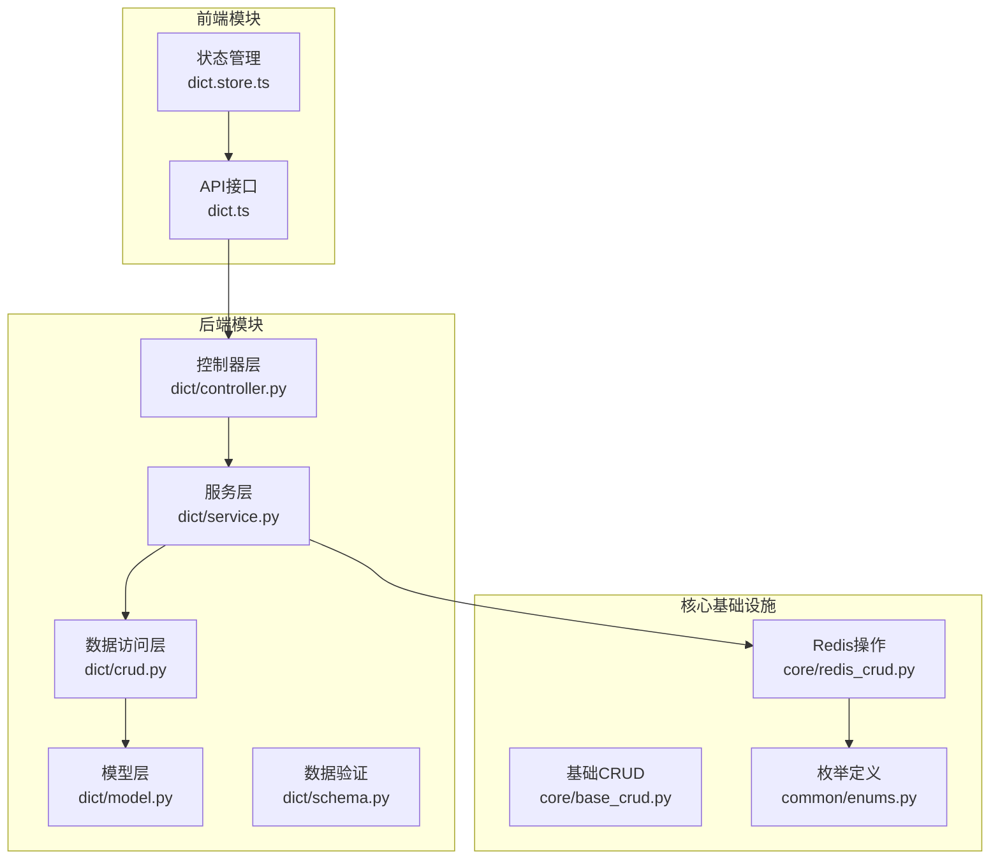
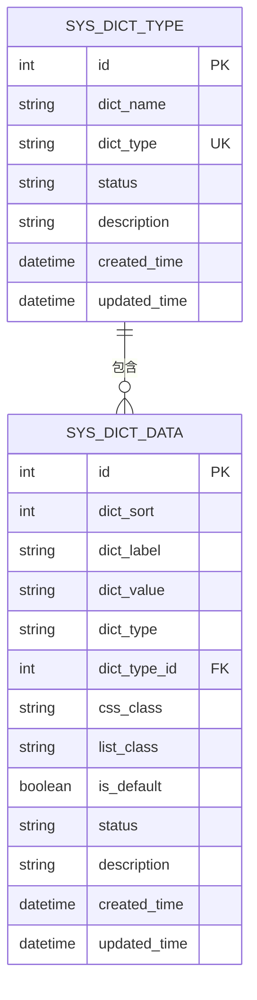
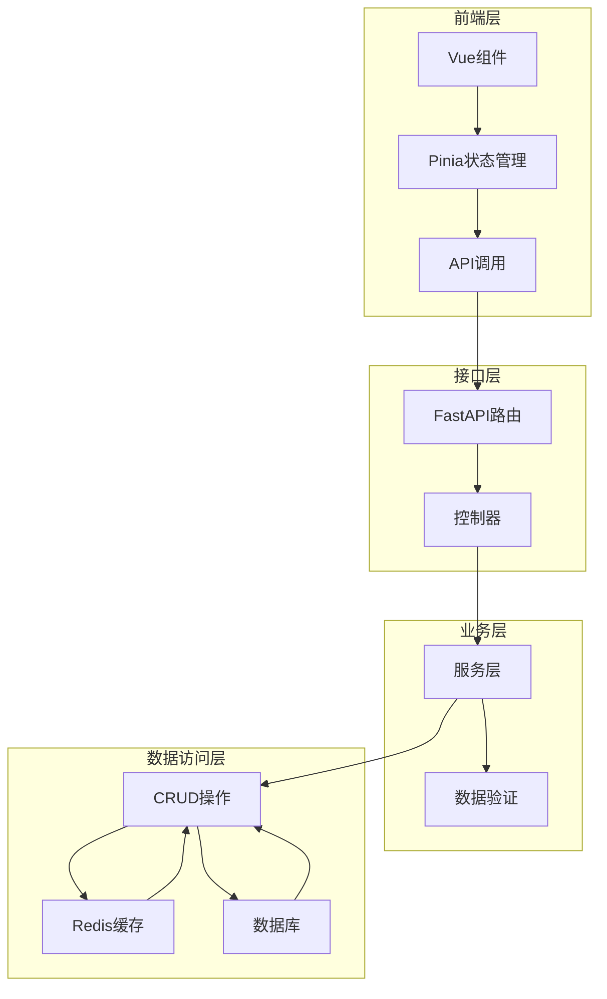
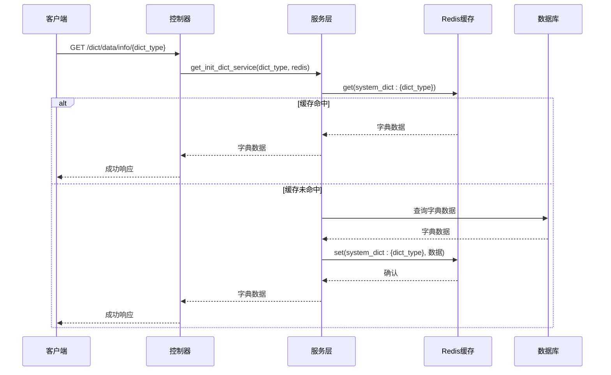
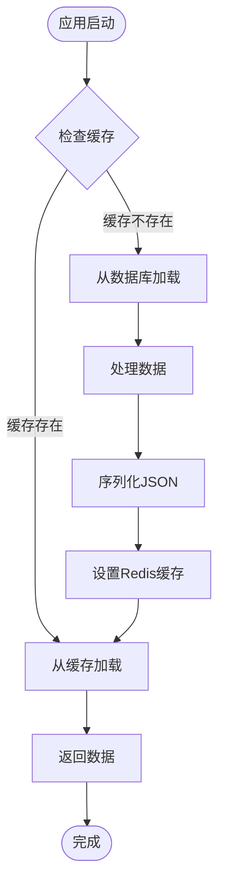
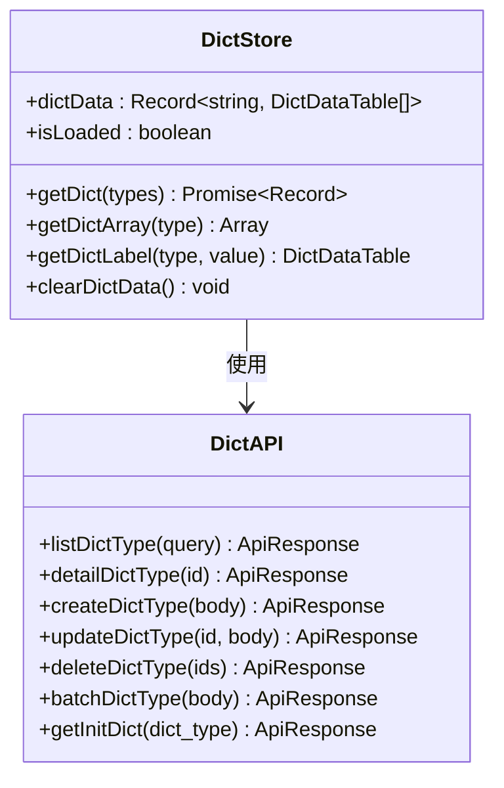
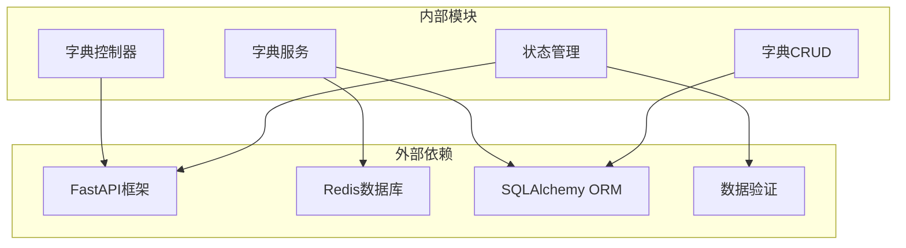

# 字典数据状态模块

<cite>
**本文档引用的文件**
- [backend/app/api/v1/module_system/dict/controller.py](file://backend/app/api/v1/module_system/dict/controller.py)
- [backend/app/api/v1/module_system/dict/service.py](file://backend/app/api/v1/module_system/dict/service.py)
- [backend/app/api/v1/module_system/dict/crud.py](file://backend/app/api/v1/module_system/dict/crud.py)
- [backend/app/api/v1/module_system/dict/model.py](file://backend/app/api/v1/module_system/dict/model.py)
- [backend/app/api/v1/module_system/dict/schema.py](file://backend/app/api/v1/module_system/dict/schema.py)
- [backend/app/common/enums.py](file://backend/app/common/enums.py)
- [backend/app/core/redis_crud.py](file://backend/app/core/redis_crud.py)
- [backend/app/core/base_crud.py](file://backend/app/core/base_crud.py)
- [frontend/web/src/store/modules/dict.store.ts](file://frontend/web/src/store/modules/dict.store.ts)
- [frontend/web/src/api/module_system/dict.ts](file://frontend/web/src/api/module_system/dict.ts)
- [backend/app/scripts/data/sys_dict_type.json](file://backend/app/scripts/data/sys_dict_type.json)
- [backend/app/scripts/data/sys_dict_data.json](file://backend/app/scripts/data/sys_dict_data.json)
</cite>

## 目录
1. [简介](#简介)
2. [项目结构](#项目结构)
3. [核心组件](#核心组件)
4. [架构概览](#架构概览)
5. [详细组件分析](#详细组件分析)
6. [依赖分析](#依赖分析)
7. [性能考虑](#性能考虑)
8. [故障排除指南](#故障排除指南)
9. [结论](#结论)
10. [附录](#附录)

## 简介

字典数据状态模块是FastapiAdmin系统中的核心数据管理组件，负责维护和管理系统的字典类型和字典数据。该模块实现了完整的字典数据生命周期管理，包括数据的分类管理、获取、缓存机制、懒加载策略以及远程同步机制。

该模块采用前后端分离的设计模式，后端提供RESTful API接口，前端通过Pinia状态管理实现本地缓存和数据转换。系统支持多种常用字典类型，如性别、状态、类型等，并提供了灵活的扩展机制。

## 项目结构

字典数据状态模块在项目中的组织结构如下：



**图表来源**
- [backend/app/api/v1/module_system/dict/controller.py:1-529](file://backend/app/api/v1/module_system/dict/controller.py#L1-L529)
- [backend/app/api/v1/module_system/dict/service.py:1-723](file://backend/app/api/v1/module_system/dict/service.py#L1-L723)
- [frontend/web/src/store/modules/dict.store.ts:1-152](file://frontend/web/src/store/modules/dict.store.ts#L1-L152)

**章节来源**
- [backend/app/api/v1/module_system/dict/controller.py:1-529](file://backend/app/api/v1/module_system/dict/controller.py#L1-L529)
- [backend/app/api/v1/module_system/dict/service.py:1-723](file://backend/app/api/v1/module_system/dict/service.py#L1-L723)
- [frontend/web/src/store/modules/dict.store.ts:1-152](file://frontend/web/src/store/modules/dict.store.ts#L1-L152)

## 核心组件

### 数据模型设计

字典数据模块采用双表设计，包含字典类型表和字典数据表，通过外键关系建立一对多的层级关系：



**图表来源**
- [backend/app/api/v1/module_system/dict/model.py:1-67](file://backend/app/api/v1/module_system/dict/model.py#L1-L67)

### 数据验证层

模块采用Pydantic模型进行数据验证，确保输入数据的完整性和一致性：

- **字典类型验证**：验证字典名称、类型格式（小写字母开头，仅包含小写字母/数字/下划线）
- **字典数据验证**：验证标签、键值、类型和类型ID的有效性
- **查询参数验证**：支持模糊查询、精确查询和时间范围查询

### 缓存策略

系统采用Redis作为缓存层，实现高效的字典数据访问：

- **缓存键命名**：`system_dict:{dict_type}`
- **缓存内容**：JSON序列化的字典数据列表
- **缓存策略**：按需加载，首次访问时从数据库加载并缓存
- **缓存更新**：数据变更时自动刷新相关缓存

**章节来源**
- [backend/app/api/v1/module_system/dict/model.py:1-67](file://backend/app/api/v1/module_system/dict/model.py#L1-L67)
- [backend/app/api/v1/module_system/dict/schema.py:1-202](file://backend/app/api/v1/module_system/dict/schema.py#L1-L202)
- [backend/app/common/enums.py:42-74](file://backend/app/common/enums.py#L42-L74)

## 架构概览

字典数据状态模块采用经典的三层架构设计，实现了清晰的职责分离：



**图表来源**
- [backend/app/api/v1/module_system/dict/controller.py:28-529](file://backend/app/api/v1/module_system/dict/controller.py#L28-L529)
- [frontend/web/src/store/modules/dict.store.ts:1-152](file://frontend/web/src/store/modules/dict.store.ts#L1-L152)

## 详细组件分析

### 控制器层分析

控制器层负责处理HTTP请求和响应，提供完整的RESTful API接口：



**图表来源**
- [backend/app/api/v1/module_system/dict/controller.py:507-529](file://backend/app/api/v1/module_system/dict/controller.py#L507-L529)
- [backend/app/api/v1/module_system/dict/service.py:424-467](file://backend/app/api/v1/module_system/dict/service.py#L424-L467)

**章节来源**
- [backend/app/api/v1/module_system/dict/controller.py:1-529](file://backend/app/api/v1/module_system/dict/controller.py#L1-L529)

### 服务层分析

服务层是业务逻辑的核心，实现了完整的字典数据管理功能：

#### 初始化流程



**图表来源**
- [backend/app/api/v1/module_system/dict/service.py:376-422](file://backend/app/api/v1/module_system/dict/service.py#L376-L422)

#### 数据更新流程

服务层实现了完整的数据变更处理机制，确保数据一致性和缓存同步：

- **字典类型更新**：当字典类型变更时，自动更新相关字典数据的状态
- **字典数据更新**：支持标签、键值、类型等字段的变更，自动刷新缓存
- **批量操作**：支持批量删除和状态变更操作

**章节来源**
- [backend/app/api/v1/module_system/dict/service.py:1-723](file://backend/app/api/v1/module_system/dict/service.py#L1-L723)

### 前端状态管理分析

前端使用Pinia实现字典数据的状态管理，提供了丰富的数据操作功能：



**图表来源**
- [frontend/web/src/store/modules/dict.store.ts:41-152](file://frontend/web/src/store/modules/dict.store.ts#L41-L152)
- [frontend/web/src/api/module_system/dict.ts:1-183](file://frontend/web/src/api/module_system/dict.ts#L1-L183)

**章节来源**
- [frontend/web/src/store/modules/dict.store.ts:1-152](file://frontend/web/src/store/modules/dict.store.ts#L1-L152)
- [frontend/web/src/api/module_system/dict.ts:1-183](file://frontend/web/src/api/module_system/dict.ts#L1-L183)

### 常用字典类型示例

系统预置了多种常用的字典类型，为业务开发提供即用的数据支持：

#### 性别字典
- 类型：`sys_user_sex`
- 值：0（男）、1（女）、2（未知）
- 样式：蓝色、粉色、红色

#### 系统状态字典
- 类型：`sys_common_status`
- 值：1（启用）、0（停用）

#### 操作类型字典
- 类型：`sys_oper_type`
- 值：1（新增）、2（修改）、3（删除）、4（分配权限）等

**章节来源**
- [backend/app/scripts/data/sys_dict_type.json:1-63](file://backend/app/scripts/data/sys_dict_type.json#L1-L63)
- [backend/app/scripts/data/sys_dict_data.json:1-410](file://backend/app/scripts/data/sys_dict_data.json#L1-L410)

## 依赖分析

字典数据状态模块的依赖关系体现了清晰的分层架构：



**图表来源**
- [backend/app/api/v1/module_system/dict/controller.py:1-26](file://backend/app/api/v1/module_system/dict/controller.py#L1-L26)
- [frontend/web/src/store/modules/dict.store.ts:36-38](file://frontend/web/src/store/modules/dict.store.ts#L36-L38)

**章节来源**
- [backend/app/api/v1/module_system/dict/controller.py:1-26](file://backend/app/api/v1/module_system/dict/controller.py#L1-L26)
- [frontend/web/src/store/modules/dict.store.ts:36-38](file://frontend/web/src/store/modules/dict.store.ts#L36-L38)

## 性能考虑

### 缓存优化策略

1. **懒加载机制**：仅在首次访问时从数据库加载字典数据
2. **批量缓存**：应用启动时预加载所有字典类型数据
3. **缓存失效**：数据变更时自动刷新相关缓存
4. **内存优化**：前端使用localStorage持久化缓存，减少重复请求

### 数据库查询优化

1. **索引优化**：字典类型字段建立唯一索引，提高查询效率
2. **预加载策略**：合理使用selectinload避免N+1查询问题
3. **分页查询**：大数据量时使用OFFSET/LIMIT分页
4. **权限过滤**：自动应用数据权限过滤，确保查询安全性

### 并发控制

1. **分布式锁**：使用Redis实现分布式锁，防止缓存击穿
2. **原子操作**：Redis操作使用原子性保证数据一致性
3. **重试机制**：网络异常时提供自动重试机制

## 故障排除指南

### 常见问题及解决方案

#### 缓存数据格式错误
**问题描述**：字典数据反序列化失败
**解决方案**：
1. 检查Redis中数据格式是否正确
2. 重新初始化字典缓存
3. 验证JSON序列化过程

#### 数据权限问题
**问题描述**：查询不到预期的字典数据
**解决方案**：
1. 检查用户的数据权限配置
2. 验证数据范围过滤逻辑
3. 确认用户所属部门和角色权限

#### 缓存更新延迟
**问题描述**：数据更新后前端显示仍是旧数据
**解决方案**：
1. 检查Redis缓存是否正确刷新
2. 验证缓存键名格式
3. 确认缓存过期时间设置

**章节来源**
- [backend/app/api/v1/module_system/dict/service.py:440-467](file://backend/app/api/v1/module_system/dict/service.py#L440-L467)
- [backend/app/core/redis_crud.py:48-96](file://backend/app/core/redis_crud.py#L48-L96)

## 结论

字典数据状态模块通过精心设计的架构和完善的缓存机制，为FastapiAdmin系统提供了高效、可靠的数据字典管理能力。模块具有以下特点：

1. **完整的功能覆盖**：支持字典类型和字典数据的全生命周期管理
2. **高效的性能表现**：通过Redis缓存和懒加载策略提升访问速度
3. **良好的扩展性**：清晰的分层架构便于功能扩展和维护
4. **可靠的错误处理**：完善的异常处理和故障恢复机制

该模块为业务开发提供了标准化的数据字典使用方式，大大简化了开发工作量，提高了系统的可维护性。

## 附录

### 最佳实践建议

1. **字典类型命名规范**：使用小写字母开头，仅包含小写字母、数字和下划线
2. **数据验证**：始终使用Pydantic模型进行数据验证
3. **缓存管理**：合理设置缓存过期时间和刷新策略
4. **错误处理**：完善异常捕获和错误日志记录
5. **性能监控**：定期监控缓存命中率和数据库查询性能

### 常用操作示例

#### 获取单个字典类型
```javascript
// 前端获取字典类型
const dictTypes = await DictAPI.optionDictType();
```

#### 获取字典数据
```javascript
// 前端获取字典数据
const dictData = await DictAPI.getInitDict('sys_user_sex');
```

#### 批量获取多个字典类型
```javascript
// 前端批量获取字典数据
const dictTypes = ['sys_user_sex', 'sys_common_status'];
const allDictData = await dictStore.getDict(dictTypes);
```