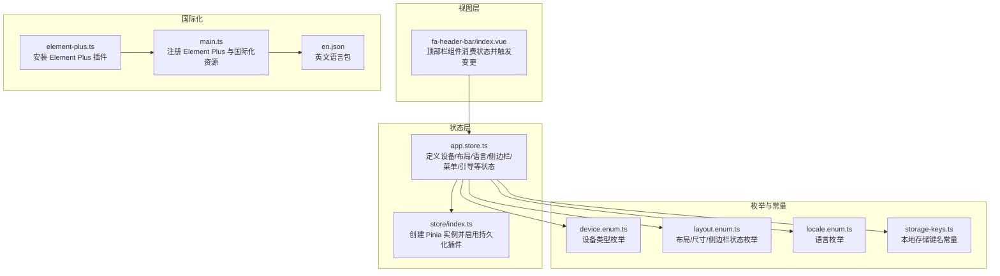
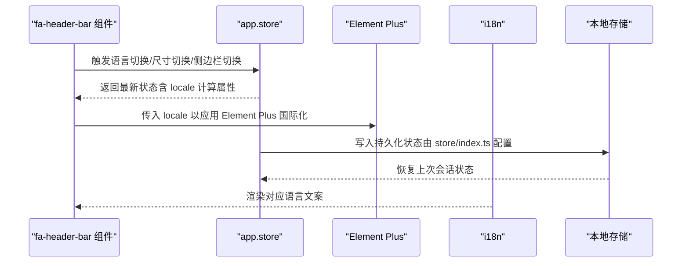
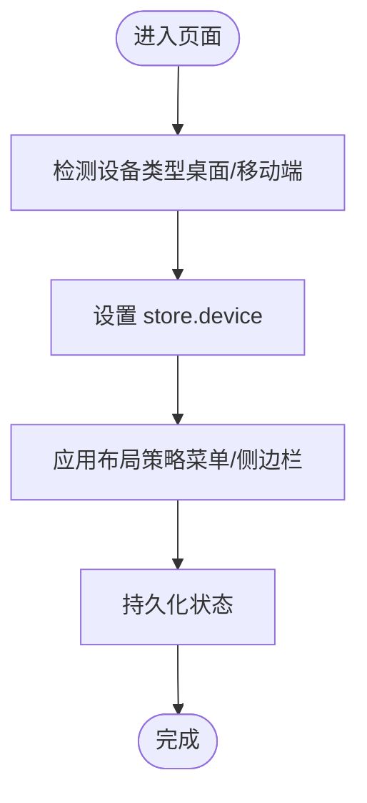
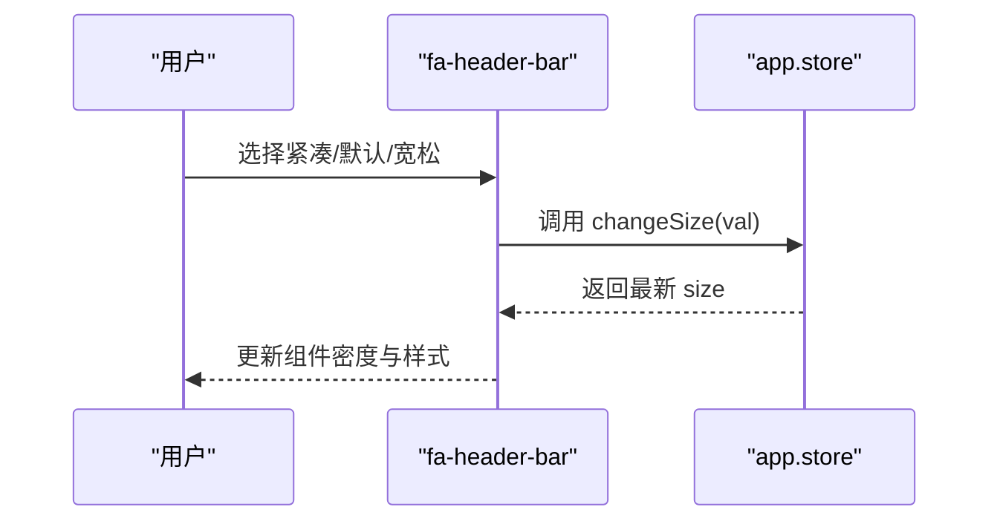
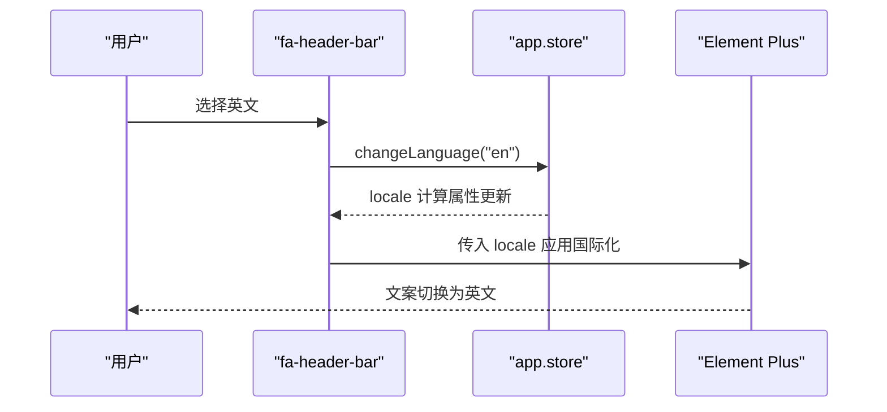
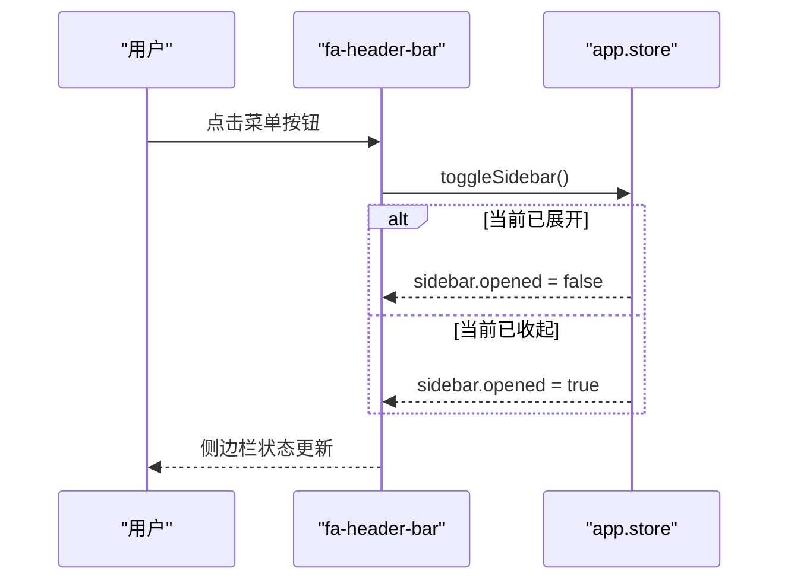
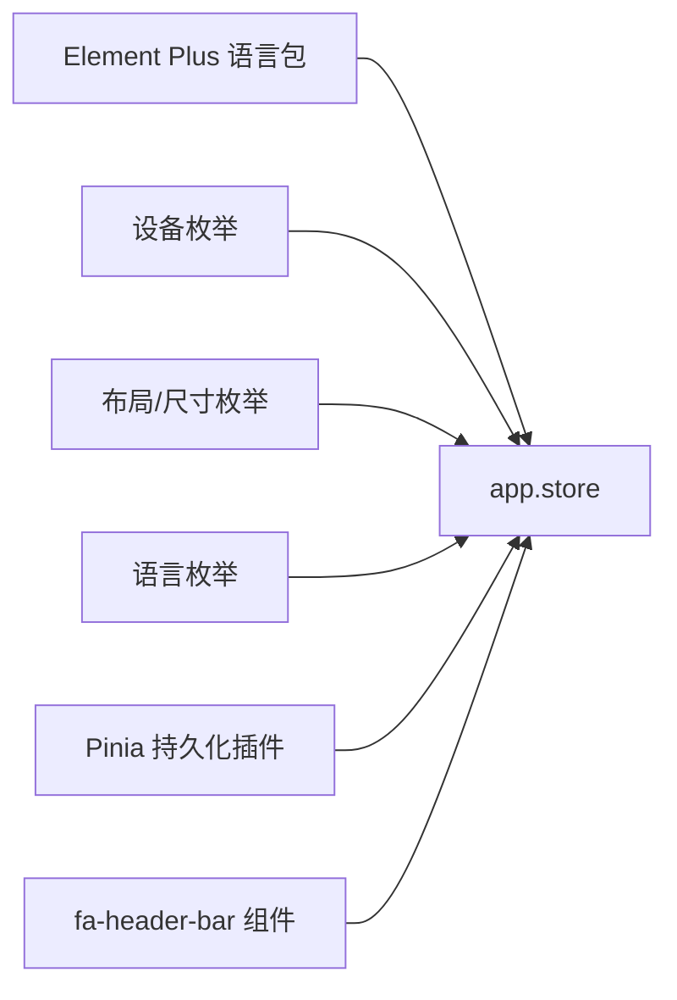

# 应用状态管理模块

<cite>
**本文引用的文件**
- [app.store.ts](file://frontend/web/src/store/modules/app.store.ts)
- [device.enum.ts](file://frontend/web/src/enums/settings/device.enum.ts)
- [layout.enum.ts](file://frontend/web/src/enums/settings/layout.enum.ts)
- [locale.enum.ts](file://frontend/web/src/enums/settings/locale.enum.ts)
- [storage-keys.ts](file://frontend/web/src/constants/storage-keys.ts)
- [index.ts](file://frontend/web/src/store/index.ts)
- [fa-header-bar/index.vue](file://frontend/web/src/components/layouts/fa-header-bar/index.vue)
- [element-plus.ts](file://frontend/web/src/plugins/element-plus.ts)
- [main.ts](file://frontend/web/src/main.ts)
- [en.json](file://frontend/web/src/locales/langs/en.json)
</cite>

## 目录
1. [简介](#简介)
2. [项目结构](#项目结构)
3. [核心组件](#核心组件)
4. [架构总览](#架构总览)
5. [详细组件分析](#详细组件分析)
6. [依赖关系分析](#依赖关系分析)
7. [性能考量](#性能考量)
8. [故障排查指南](#故障排查指南)
9. [结论](#结论)
10. [附录](#附录)

## 简介
本文件系统化梳理前端应用的状态管理模块，聚焦 app.store 的设计与实现，涵盖以下关键能力：
- 设备类型管理（桌面/移动端）
- 布局大小管理（默认/紧凑/宽松）
- 语言管理（中文/英文）
- 侧边栏状态管理（展开/收起）
- 顶部菜单激活路径管理
- 引导功能可见性管理

文档同时解释响应式布局适配机制、多语言切换实现与侧边栏交互逻辑，并提供状态更新示例与最佳实践，包含与 Element Plus 国际化的集成方式。

## 项目结构
应用状态管理采用 Pinia Store 架构，app.store 作为核心模块之一，配合持久化插件与全局国际化配置，形成统一的状态来源与视图驱动机制。

**图表来源**
- [app.store.ts:1-123](file://frontend/web/src/store/modules/app.store.ts#L1-L123)
- [index.ts:1-89](file://frontend/web/src/store/index.ts#L1-L89)
- [fa-header-bar/index.vue:1-511](file://frontend/web/src/components/layouts/fa-header-bar/index.vue#L1-L511)
- [element-plus.ts:1-7](file://frontend/web/src/plugins/element-plus.ts#L1-L7)
- [main.ts:1-35](file://frontend/web/src/main.ts#L1-L35)
- [en.json:1-678](file://frontend/web/src/locales/langs/en.json#L1-L678)
- [device.enum.ts:1-15](file://frontend/web/src/enums/settings/device.enum.ts#L1-L15)
- [layout.enum.ts:1-54](file://frontend/web/src/enums/settings/layout.enum.ts#L1-L54)
- [locale.enum.ts:1-15](file://frontend/web/src/enums/settings/locale.enum.ts#L1-L15)
- [storage-keys.ts:1-79](file://frontend/web/src/constants/storage-keys.ts#L1-L79)

**章节来源**
- [app.store.ts:1-123](file://frontend/web/src/store/modules/app.store.ts#L1-L123)
- [index.ts:1-89](file://frontend/web/src/store/index.ts#L1-L89)

## 核心组件
本节从“状态属性—作用—使用场景”的维度，逐项解析 app.store 的关键字段与方法。

- 设备类型（device）
  - 类型：字符串
  - 取值：来自设备枚举（desktop/mobile）
  - 作用：驱动响应式布局与交互行为（如移动端隐藏侧边栏、调整菜单形态）
  - 使用场景：路由守卫、布局渲染、菜单切换
  - 示例路径：[设备枚举定义:1-15](file://frontend/web/src/enums/settings/device.enum.ts#L1-L15)

- 布局大小（size）
  - 类型：字符串
  - 取值：默认/紧凑/宽松（对应组件尺寸枚举）
  - 作用：控制表单、按钮、表格等组件的整体密度
  - 使用场景：顶部栏尺寸选择器、全局样式适配
  - 示例路径：[布局/尺寸枚举:1-54](file://frontend/web/src/enums/settings/layout.enum.ts#L1-L54)

- 语言（language）
  - 类型：字符串
  - 取值：中文/英文（语言枚举）
  - 作用：决定界面文案与 Element Plus 国际化语言包
  - 使用场景：顶部栏语言下拉、用户偏好持久化
  - 示例路径：[语言枚举:1-15](file://frontend/web/src/enums/settings/locale.enum.ts#L1-L15)

- 侧边栏状态（sidebar）
  - 结构：opened（布尔）、withoutAnimation（布尔）
  - 作用：控制侧边栏展开/收起及过渡动画
  - 使用场景：菜单按钮点击、移动端自适应、设置面板联动
  - 示例路径：[侧边栏状态变更函数:61-74](file://frontend/web/src/store/modules/app.store.ts#L61-L74)

- 顶部菜单激活路径（activeTopMenuPath）
  - 类型：字符串
  - 作用：记录当前顶部菜单的激活路径，用于高亮与导航定位
  - 使用场景：菜单点击、面包屑联动、路由同步
  - 示例路径：[激活路径设置函数:91-94](file://frontend/web/src/store/modules/app.store.ts#L91-L94)

- 引导可见性（guideVisible）
  - 类型：布尔
  - 作用：控制新手引导面板的显示/隐藏
  - 使用场景：登录后首次展示、设置面板引导、用户偏好
  - 示例路径：[引导显隐函数:96-99](file://frontend/web/src/store/modules/app.store.ts#L96-L99)

- 语言区域（locale，computed）
  - 作用：根据语言返回 Element Plus 对应语言包，供国际化组件使用
  - 使用场景：Element Plus 组件语言切换、i18n 文案渲染
  - 示例路径：[语言区域计算属性:56-59](file://frontend/web/src/store/modules/app.store.ts#L56-L59)

- 状态持久化（persist: true）
  - 作用：通过 Pinia 持久化插件，将状态写入本地存储，刷新后仍可恢复
  - 使用场景：设备类型、语言、侧边栏状态、引导开关等
  - 示例路径：[store/index.ts 启用持久化:13-13](file://frontend/web/src/store/index.ts#L13-L13)

**章节来源**
- [app.store.ts:1-123](file://frontend/web/src/store/modules/app.store.ts#L1-L123)
- [device.enum.ts:1-15](file://frontend/web/src/enums/settings/device.enum.ts#L1-L15)
- [layout.enum.ts:1-54](file://frontend/web/src/enums/settings/layout.enum.ts#L1-L54)
- [locale.enum.ts:1-15](file://frontend/web/src/enums/settings/locale.enum.ts#L1-L15)
- [index.ts:13-13](file://frontend/web/src/store/index.ts#L13-L13)

## 架构总览
app.store 与视图层、国际化、持久化的关系如下：

**图表来源**
- [fa-header-bar/index.vue:100-119](file://frontend/web/src/components/layouts/fa-header-bar/index.vue#L100-L119)
- [app.store.ts:56-59](file://frontend/web/src/store/modules/app.store.ts#L56-L59)
- [index.ts:13-13](file://frontend/web/src/store/index.ts#L13-L13)
- [element-plus.ts:4-6](file://frontend/web/src/plugins/element-plus.ts#L4-L6)
- [main.ts:1-35](file://frontend/web/src/main.ts#L1-L35)

## 详细组件分析

### 设备类型管理（桌面/移动端）
- 设计要点
  - 使用设备枚举限定取值，避免非法状态
  - 与响应式断点结合，驱动菜单形态与布局策略
- 交互流程
  - 在路由守候或窗口尺寸变化时更新设备类型
  - 依据设备类型决定侧边栏初始状态与菜单布局

**图表来源**
- [device.enum.ts:4-14](file://frontend/web/src/enums/settings/device.enum.ts#L4-L14)
- [app.store.ts:76-79](file://frontend/web/src/store/modules/app.store.ts#L76-L79)

**章节来源**
- [device.enum.ts:1-15](file://frontend/web/src/enums/settings/device.enum.ts#L1-L15)
- [app.store.ts:76-79](file://frontend/web/src/store/modules/app.store.ts#L76-L79)

### 布局大小管理（默认/紧凑/宽松）
- 设计要点
  - 通过尺寸枚举约束取值，保证 UI 一致性
  - 与 Element Plus 组件尺寸联动，影响整体密度
- 交互流程
  - 顶部栏尺寸选择器触发 changeSize
  - 视图层根据 size 切换样式与间距

**图表来源**
- [fa-header-bar/index.vue:94-97](file://frontend/web/src/components/layouts/fa-header-bar/index.vue#L94-L97)
- [app.store.ts:81-84](file://frontend/web/src/store/modules/app.store.ts#L81-L84)
- [layout.enum.ts:38-53](file://frontend/web/src/enums/settings/layout.enum.ts#L38-L53)

**章节来源**
- [fa-header-bar/index.vue:94-97](file://frontend/web/src/components/layouts/fa-header-bar/index.vue#L94-L97)
- [app.store.ts:81-84](file://frontend/web/src/store/modules/app.store.ts#L81-L84)
- [layout.enum.ts:1-54](file://frontend/web/src/enums/settings/layout.enum.ts#L1-L54)

### 语言管理（中文/英文）
- 设计要点
  - locale 计算属性根据 language 返回 Element Plus 语言包
  - 顶部栏语言下拉直接绑定 locale，实现即时切换
- 交互流程
  - 用户在顶部栏切换语言
  - store 写入新语言并触发视图重绘

**图表来源**
- [fa-header-bar/index.vue:100-119](file://frontend/web/src/components/layouts/fa-header-bar/index.vue#L100-L119)
- [app.store.ts:56-59](file://frontend/web/src/store/modules/app.store.ts#L56-L59)
- [app.store.ts:86-89](file://frontend/web/src/store/modules/app.store.ts#L86-L89)
- [en.json:1-678](file://frontend/web/src/locales/langs/en.json#L1-L678)

**章节来源**
- [fa-header-bar/index.vue:100-119](file://frontend/web/src/components/layouts/fa-header-bar/index.vue#L100-L119)
- [app.store.ts:56-59](file://frontend/web/src/store/modules/app.store.ts#L56-L59)
- [app.store.ts:86-89](file://frontend/web/src/store/modules/app.store.ts#L86-L89)
- [en.json:1-678](file://frontend/web/src/locales/langs/en.json#L1-L678)

### 侧边栏状态管理（展开/收起）
- 设计要点
  - sidebar.opened 控制展开/收起；withoutAnimation 控制过渡动画
  - 提供 toggleSidebar/closeSideBar/openSideBar 三类操作
- 交互流程
  - 顶部栏菜单按钮点击 -> 切换侧边栏状态
  - 移动端自动收起，桌面端可展开

**图表来源**
- [fa-header-bar/index.vue:273-275](file://frontend/web/src/components/layouts/fa-header-bar/index.vue#L273-L275)
- [app.store.ts:61-74](file://frontend/web/src/store/modules/app.store.ts#L61-L74)

**章节来源**
- [fa-header-bar/index.vue:273-275](file://frontend/web/src/components/layouts/fa-header-bar/index.vue#L273-L275)
- [app.store.ts:61-74](file://frontend/web/src/store/modules/app.store.ts#L61-L74)

### 顶部菜单激活路径管理
- 设计要点
  - activeTopMenuPath 记录当前激活的顶部菜单路径
  - 用于高亮当前菜单、生成面包屑与路由同步
- 使用建议
  - 在菜单点击时调用 activeTopMenu(path)
  - 结合路由守卫与工作标签页实现导航一致性

**章节来源**
- [app.store.ts:91-94](file://frontend/web/src/store/modules/app.store.ts#L91-L94)

### 引导功能可见性管理
- 设计要点
  - guideVisible 控制新手引导面板显示/隐藏
  - 常与登录后首登、设置面板引导等场景结合
- 最佳实践
  - 将引导开关与用户偏好键（如 showGuide）关联
  - 引导结束后及时关闭，避免遮挡主内容

**章节来源**
- [app.store.ts:96-99](file://frontend/web/src/store/modules/app.store.ts#L96-L99)
- [storage-keys.ts:27-27](file://frontend/web/src/constants/storage-keys.ts#L27-L27)

## 依赖关系分析
- app.store 依赖
  - 设备/布局/语言枚举：确保取值合法与可维护
  - Element Plus 语言包：提供国际化文案与组件本地化
  - Pinia 持久化插件：保障状态跨会话可用
- 视图层依赖
  - fa-header-bar 组件消费 app.store 并触发变更
  - 顶部栏语言下拉、尺寸选择器、菜单按钮均与 app.store 交互

**图表来源**
- [app.store.ts:28-30](file://frontend/web/src/store/modules/app.store.ts#L28-L30)
- [device.enum.ts:4-14](file://frontend/web/src/enums/settings/device.enum.ts#L4-L14)
- [layout.enum.ts:38-53](file://frontend/web/src/enums/settings/layout.enum.ts#L38-L53)
- [locale.enum.ts:4-14](file://frontend/web/src/enums/settings/locale.enum.ts#L4-L14)
- [index.ts:13-13](file://frontend/web/src/store/index.ts#L13-L13)
- [fa-header-bar/index.vue:100-119](file://frontend/web/src/components/layouts/fa-header-bar/index.vue#L100-L119)

**章节来源**
- [app.store.ts:28-30](file://frontend/web/src/store/modules/app.store.ts#L28-L30)
- [index.ts:13-13](file://frontend/web/src/store/index.ts#L13-L13)

## 性能考量
- 状态粒度
  - 将设备类型、布局大小、语言、侧边栏状态拆分为独立字段，降低耦合，提升局部更新效率
- 持久化策略
  - 仅对必要状态开启持久化（如设备、语言、侧边栏），避免存储膨胀
- 国际化成本
  - locale 为计算属性，按需读取 Element Plus 语言包，减少重复实例化
- 视图更新
  - 通过响应式引用与计算属性，确保视图只在相关状态变更时重绘

## 故障排查指南
- 语言切换无效
  - 检查 app.store 的 changeLanguage 是否被调用
  - 确认 locale 计算属性是否正确返回对应语言包
  - 核对 Element Plus 插件是否已安装
  - 参考路径：[语言切换函数:86-89](file://frontend/web/src/store/modules/app.store.ts#L86-L89)，[locale 计算属性:56-59](file://frontend/web/src/store/modules/app.store.ts#L56-L59)，[Element Plus 安装:4-6](file://frontend/web/src/plugins/element-plus.ts#L4-L6)，[main.ts 注册:1-35](file://frontend/web/src/main.ts#L1-L35)

- 侧边栏无法切换
  - 检查 fa-header-bar 是否正确调用 toggleSidebar/closeSideBar/openSideBar
  - 确认 sidebar.opened 是否被修改
  - 参考路径：[侧边栏切换函数:61-74](file://frontend/web/src/store/modules/app.store.ts#L61-L74)，[菜单按钮事件:273-275](file://frontend/web/src/components/layouts/fa-header-bar/index.vue#L273-L275)

- 布局大小未生效
  - 检查 changeSize 是否被调用，以及视图层是否根据 size 切换样式
  - 参考路径：[尺寸切换函数:81-84](file://frontend/web/src/store/modules/app.store.ts#L81-L84)，[尺寸选择器:94-97](file://frontend/web/src/components/layouts/fa-header-bar/index.vue#L94-L97)

- 引导面板不显示
  - 检查 guideVisible 是否为 true，以及用户偏好键是否正确写入
  - 参考路径：[引导显隐函数:96-99](file://frontend/web/src/store/modules/app.store.ts#L96-L99)，[存储键常量:27-27](file://frontend/web/src/constants/storage-keys.ts#L27-L27)

**章节来源**
- [app.store.ts:56-59](file://frontend/web/src/store/modules/app.store.ts#L56-L59)
- [app.store.ts:61-74](file://frontend/web/src/store/modules/app.store.ts#L61-L74)
- [app.store.ts:81-84](file://frontend/web/src/store/modules/app.store.ts#L81-L84)
- [app.store.ts:86-89](file://frontend/web/src/store/modules/app.store.ts#L86-L89)
- [app.store.ts:96-99](file://frontend/web/src/store/modules/app.store.ts#L96-L99)
- [fa-header-bar/index.vue:94-97](file://frontend/web/src/components/layouts/fa-header-bar/index.vue#L94-L97)
- [fa-header-bar/index.vue:273-275](file://frontend/web/src/components/layouts/fa-header-bar/index.vue#L273-L275)
- [element-plus.ts:4-6](file://frontend/web/src/plugins/element-plus.ts#L4-L6)
- [main.ts:1-35](file://frontend/web/src/main.ts#L1-L35)
- [storage-keys.ts:27-27](file://frontend/web/src/constants/storage-keys.ts#L27-L27)

## 结论
app.store 以简洁明确的状态模型支撑了响应式布局、多语言切换与侧边栏交互等核心体验。通过与 Pinia 持久化、Element Plus 国际化及视图层组件的协同，实现了稳定、可维护且高性能的状态管理方案。建议在后续迭代中持续关注状态粒度与持久化范围，确保性能与用户体验的平衡。

## 附录
- 状态更新最佳实践
  - 优先使用模块提供的动作函数（如 changeLanguage、toggleSidebar），避免直接修改响应式引用
  - 对于需要跨会话保留的状态，确认已在 store/index.ts 中启用持久化
  - 语言切换后适当延迟刷新，确保国际化资源加载完成
- 与 Element Plus 国际化的集成
  - 在 main.ts 中安装 Element Plus 插件
  - 在 app.store 中通过 locale 计算属性返回对应语言包
  - 在视图层（如顶部栏）将 locale 绑定到 Element Plus 组件

**章节来源**
- [index.ts:13-13](file://frontend/web/src/store/index.ts#L13-L13)
- [element-plus.ts:4-6](file://frontend/web/src/plugins/element-plus.ts#L4-L6)
- [main.ts:1-35](file://frontend/web/src/main.ts#L1-L35)
- [app.store.ts:56-59](file://frontend/web/src/store/modules/app.store.ts#L56-L59)