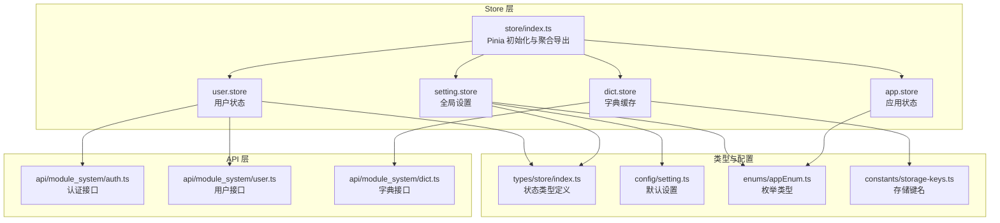
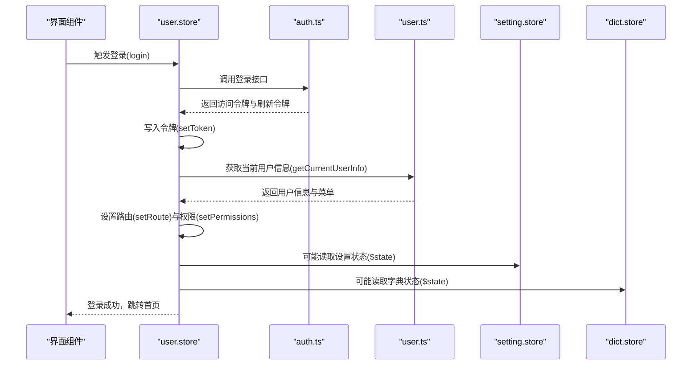
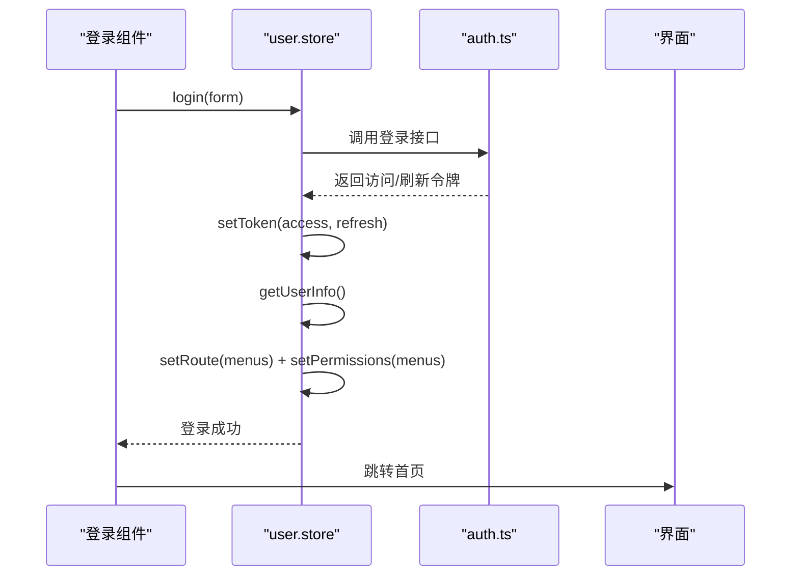
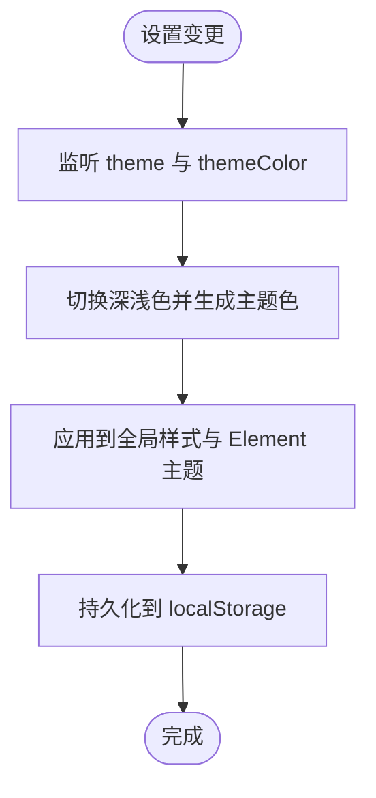
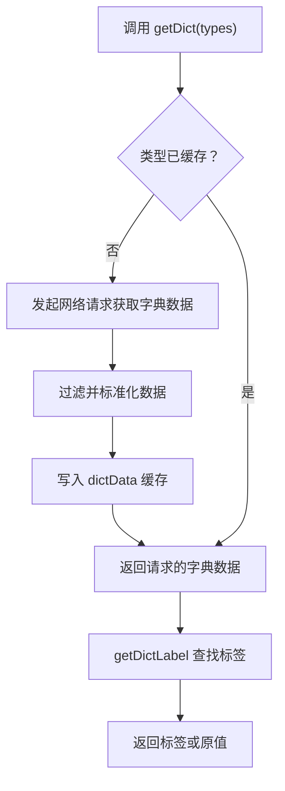
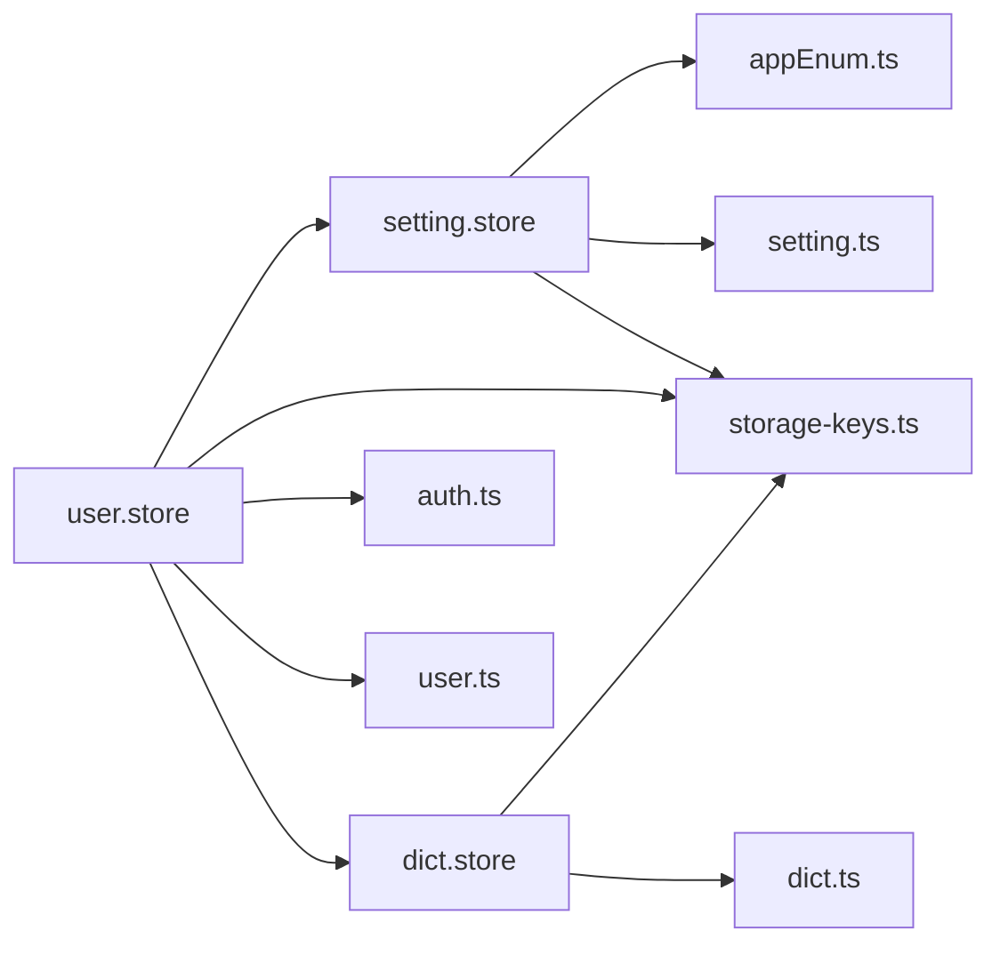

# 核心 Store 模块

<cite>
**本文引用的文件**
- [app.store.ts](file://frontend/web/src/store/modules/app.store.ts)
- [user.store.ts](file://frontend/web/src/store/modules/user.store.ts)
- [setting.store.ts](file://frontend/web/src/store/modules/setting.store.ts)
- [dict.store.ts](file://frontend/web/src/store/modules/dict.store.ts)
- [store/index.ts](file://frontend/web/src/store/index.ts)
- [storage-keys.ts](file://frontend/web/src/constants/storage-keys.ts)
- [setting.ts](file://frontend/web/src/config/setting.ts)
- [appEnum.ts](file://frontend/web/src/enums/appEnum.ts)
- [auth.ts](file://frontend/web/src/api/module_system/auth.ts)
- [user.ts](file://frontend/web/src/api/module_system/user.ts)
- [dict.ts](file://frontend/web/src/api/module_system/dict.ts)
- [store/index.ts](file://frontend/web/src/types/store/index.ts)
- [utils/index.ts](file://frontend/web/src/utils/index.ts)
</cite>

## 目录
1. [简介](#简介)
2. [项目结构](#项目结构)
3. [核心组件](#核心组件)
4. [架构总览](#架构总览)
5. [详细组件分析](#详细组件分析)
6. [依赖分析](#依赖分析)
7. [性能考量](#性能考量)
8. [故障排查指南](#故障排查指南)
9. [结论](#结论)
10. [附录](#附录)

## 简介
本文件聚焦于前端 Web 项目的“核心 Store 模块”，系统梳理并深入解析以下四个关键模块：
- 应用状态（app.store）
- 用户状态（user.store）
- 设置状态（setting.store）
- 字典状态（dict.store）

内容涵盖职责边界、状态结构、动作方法、持久化策略、数据同步与缓存管理、模块间交互与依赖关系、状态更新流程、副作用与异步操作管理，并提供使用示例与最佳实践建议。

## 项目结构
核心 Store 模块位于前端工程的 Pinia Store 层，采用“按模块划分”的组织方式，配合统一的持久化插件与类型约束，形成清晰的职责边界与稳定的扩展点。

图表来源
- [store/index.ts:1-89](file://frontend/web/src/store/index.ts#L1-L89)
- [app.store.ts:1-123](file://frontend/web/src/store/modules/app.store.ts#L1-L123)
- [user.store.ts:1-423](file://frontend/web/src/store/modules/user.store.ts#L1-L423)
- [setting.store.ts:1-524](file://frontend/web/src/store/modules/setting.store.ts#L1-L524)
- [dict.store.ts:1-152](file://frontend/web/src/store/modules/dict.store.ts#L1-L152)
- [setting.ts:1-224](file://frontend/web/src/config/setting.ts#L1-L224)
- [appEnum.ts:1-82](file://frontend/web/src/enums/appEnum.ts#L1-L82)
- [storage-keys.ts:1-79](file://frontend/web/src/constants/storage-keys.ts#L1-L79)
- [auth.ts:1-125](file://frontend/web/src/api/module_system/auth.ts#L1-L125)
- [user.ts:1-269](file://frontend/web/src/api/module_system/user.ts#L1-L269)
- [dict.ts:1-183](file://frontend/web/src/api/module_system/dict.ts#L1-L183)
- [store/index.ts:1-158](file://frontend/web/src/types/store/index.ts#L1-L158)

章节来源
- [store/index.ts:1-89](file://frontend/web/src/store/index.ts#L1-L89)

## 核心组件
本节对四大核心 Store 的职责、状态与动作进行概览式说明，便于快速建立整体认知。

- 应用状态（app.store）
  - 职责：设备类型、布局大小、语言、侧边栏状态、顶部菜单激活路径、新手引导可见性管理。
  - 关键状态：device、size、language、sidebar、activeTopMenuPath、guideVisible。
  - 关键动作：toggleSidebar、closeSideBar、openSideBar、toggleDevice、changeSize、changeLanguage、activeTopMenu、showGuide。
  - 持久化：启用持久化（默认持久化至 localStorage）。

- 用户状态（user.store）
  - 职责：登录/登出、令牌管理、用户信息获取与更新、路由与权限计算、锁屏状态、搜索历史、记住我。
  - 关键状态：isLogin、isLock、lockPassword、info、routeList、prems、hasGetRoute、rememberMe、accessToken、refreshToken、searchHistory。
  - 关键动作：login、logout、getUserInfo、setToken、setRoute、setPermissions、refreshTokenFn、resetAllState、fullResetAllState。
  - 持久化：启用持久化（localStorage），包含令牌与记住我状态。

- 设置状态（setting.store）
  - 职责：菜单布局与样式、主题与颜色、界面显示开关、功能开关、容器宽度、页面过渡、水印、节日特效等。
  - 关键状态：menuType、menuOpenWidth、menuOpen、dualMenuShowText、systemThemeType、systemThemeMode、menuThemeType、systemThemeColor、show* 开关、layout、theme、themeColor、grayMode、userEnableAi、pageSwitchingAnimation、containerWidth、customRadius、festivalDate 等。
  - 关键动作：switchMenuLayouts、setMenuOpenWidth、setGlopTheme、switchMenuStyles、setElementTheme、setBorderMode、setContainerWidth、setUniqueOpened、setButton、setFastEnter、setAutoClose、setShowRefreshButton、setCrumbs、setWorkTab、setLanguage、setNprogress、setColorWeak、hideSettingGuide、openSettingGuide、setPageTransition、setTabStyle、setMenuOpen、reload、setWatermarkVisible、setCustomRadius、setholidayFireworksLoaded、setShowFestivalText、setFestivalDate、setDualMenuShowText、updateSetting、updateTheme、updateThemeColor、updateSidebarColorScheme、updateLayout、toggleSettingsPanel、showSettingsPanel、hideSettingsPanel、updateUserEnableAi、updateGrayMode、updatePageSwitchingAnimation、resetSettings。
  - 持久化：大量字段通过 useStorage 或持久化配置保存，支持主题、布局、显示开关等个性化设置。

- 字典状态（dict.store）
  - 职责：数据字典缓存与按需加载、字典标签查找、批量获取、清空缓存。
  - 关键状态：dictData（Record<string, DictDataTable[]>）、isLoaded。
  - 关键动作：getDictData、getDictArray、getDict、getDictLabel、clearDictData。
  - 持久化：启用持久化（localStorage），用于缓存已加载的字典数据，减少重复请求。

章节来源
- [app.store.ts:1-123](file://frontend/web/src/store/modules/app.store.ts#L1-L123)
- [user.store.ts:1-423](file://frontend/web/src/store/modules/user.store.ts#L1-L423)
- [setting.store.ts:1-524](file://frontend/web/src/store/modules/setting.store.ts#L1-L524)
- [dict.store.ts:1-152](file://frontend/web/src/store/modules/dict.store.ts#L1-L152)

## 架构总览
核心 Store 模块通过 Pinia 进行集中管理，配合持久化插件实现跨会话的状态保持；同时通过统一的 store/index.ts 导出与初始化，形成清晰的模块边界与依赖关系。API 层提供认证、用户与字典的后端交互，支撑用户状态与字典状态的异步数据流。

图表来源
- [user.store.ts:240-264](file://frontend/web/src/store/modules/user.store.ts#L240-L264)
- [auth.ts:14-23](file://frontend/web/src/api/module_system/auth.ts#L14-L23)
- [user.ts:7-12](file://frontend/web/src/api/module_system/user.ts#L7-L12)
- [setting.store.ts:71-74](file://frontend/web/src/store/modules/setting.store.ts#L71-L74)
- [dict.store.ts:44-47](file://frontend/web/src/store/modules/dict.store.ts#L44-L47)

## 详细组件分析

### 应用状态（app.store）分析
- 职责边界
  - 负责运行时的界面行为控制与语言环境切换，不涉及业务数据与认证流程。
- 状态结构
  - device、size、language、sidebar、activeTopMenuPath、guideVisible。
- 动作方法
  - 侧边栏控制：toggleSidebar、closeSideBar、openSideBar。
  - 设备与布局：toggleDevice、changeSize。
  - 语言：changeLanguage、locale 计算属性。
  - 导航与引导：activeTopMenu、showGuide。
- 持久化策略
  - 启用持久化，确保用户在不同会话中保持相同的界面偏好（如语言、布局大小）。
- 交互与依赖
  - 与 setting.store 的主题与布局联动，影响菜单样式与页面外观。
- 使用示例
  - 在布局组件中读取 appStore.language 与 appStore.locale，动态设置 Element Plus 语言。
  - 在菜单组件中根据 appStore.sidebar 控制侧边栏展开/收起。
- 最佳实践
  - 将与设备/布局相关的状态尽量通过 app.store 管理，避免分散在多处。
  - 对于需要跨页面保持的用户偏好，优先使用持久化。

章节来源
- [app.store.ts:1-123](file://frontend/web/src/store/modules/app.store.ts#L1-L123)
- [appEnum.ts:17-81](file://frontend/web/src/enums/appEnum.ts#L17-L81)

### 用户状态（user.store）分析
- 职责边界
  - 管理用户认证生命周期、用户信息、路由与权限、令牌与记住我、锁屏状态与搜索历史。
- 状态结构
  - isLogin、isLock、lockPassword、info、routeList、prems、hasGetRoute、rememberMe、accessToken、refreshToken、searchHistory。
- 动作方法
  - 登录/登出：login、logout。
  - 令牌管理：setToken、refreshTokenFn。
  - 用户信息：getUserInfo、setUserInfo、setAvatar。
  - 路由与权限：setRoute、setPermissions。
  - 状态重置：resetAllState、fullResetAllState、checkAndClearWorktabs。
- 持久化策略
  - 启用持久化（localStorage），保存令牌与记住我状态，提升用户体验。
- 交互与依赖
  - 依赖 setting.store（计算属性读取）、worktab.store（标签页清理）、menu.store（动态路由）、dict.store（字典清理）。
  - 通过延迟导入避免与路由守卫的循环依赖。
- 异步与副作用
  - 登录成功后写入令牌、获取用户信息、设置路由与权限、清理动态路由初始化失败标记。
  - 登出时清理本地状态、调用后端登出接口、重置路由状态、跳转登录页。
- 使用示例
  - 在登录表单提交后调用 userStore.login(form)，随后在成功回调中跳转首页。
  - 在需要权限校验的页面使用 userStore.getPerms 与路由守卫结合。
- 最佳实践
  - 登录成功后立即调用 getUserInfo 并设置路由与权限，确保后续渲染与导航正常。
  - 登出时务必调用 resetAllState 或 fullResetAllState，避免状态残留。
  - 对于跨用户切换，使用 checkAndClearWorktabs 清理工作台标签页，防止与路由脱节。

图表来源
- [user.store.ts:240-264](file://frontend/web/src/store/modules/user.store.ts#L240-L264)
- [auth.ts:14-23](file://frontend/web/src/api/module_system/auth.ts#L14-L23)
- [user.ts:7-12](file://frontend/web/src/api/module_system/user.ts#L7-L12)

章节来源
- [user.store.ts:1-423](file://frontend/web/src/store/modules/user.store.ts#L1-L423)
- [auth.ts:1-125](file://frontend/web/src/api/module_system/auth.ts#L1-L125)
- [user.ts:1-269](file://frontend/web/src/api/module_system/user.ts#L1-L269)

### 设置状态（setting.store）分析
- 职责边界
  - 管理全局界面设置（菜单、主题、显示、功能、样式等），并负责主题与样式的实时应用。
- 状态结构
  - 菜单相关：menuType、menuOpenWidth、menuOpen、dualMenuShowText。
  - 主题相关：systemThemeType、systemThemeMode、menuThemeType、systemThemeColor。
  - 显示与功能：showMenuButton、showFastEnter、showRefreshButton、showCrumbs、showWorkTab、showLanguage、showNprogress、showSettingGuide、showFestivalText、watermarkVisible、autoClose、uniqueOpened、colorWeak、refresh、holidayFireworksLoaded。
  - 样式与容器：boxBorderMode、pageTransition、tabStyle、customRadius、containerWidth。
  - 节日与面板：festivalDate、settingsVisible。
  - 持久化字段：通过 useStorage 与持久化配置保存 showTagsView、showAppLogo、showWatermark、showSettings、showGuide、showMenuSearch、showFullscreen、showSizeSelect、showLangSelect、showNotification、sidebarColorScheme、layout、themeColor、theme、grayMode、userEnableAi、pageSwitchingAnimation。
- 动作方法
  - 菜单与主题：switchMenuLayouts、setMenuOpenWidth、setGlopTheme、switchMenuStyles、setElementTheme。
  - 显示与功能：setButton、setFastEnter、setAutoClose、setShowRefreshButton、setCrumbs、setWorkTab、setLanguage、setNprogress、setColorWeak、hideSettingGuide、openSettingGuide、setPageTransition、setTabStyle、setMenuOpen、reload、setWatermarkVisible、setCustomRadius、setholidayFireworksLoaded、setShowFestivalText、setFestivalDate、setDualMenuShowText。
  - 更新与重置：updateSetting、updateTheme、updateThemeColor、updateSidebarColorScheme、updateLayout、toggleSettingsPanel、showSettingsPanel、hideSettingsPanel、updateUserEnableAi、updateGrayMode、updatePageSwitchingAnimation、resetSettings。
- 持久化策略
  - 大量字段通过 useStorage 与持久化配置保存，确保用户个性化设置跨会话生效。
- 交互与依赖
  - 通过 watch 监听主题与颜色变化，动态切换深浅色与主题色，应用到全局样式。
  - 与 app.store 的语言与布局联动，影响菜单与页面外观。
- 使用示例
  - 在设置面板中调用 updateTheme 与 updateThemeColor 实时切换主题色。
  - 在布局组件中读取 isDark 与 getMenuTheme，动态应用菜单样式。
- 最佳实践
  - 主题切换时通过 watch 自动应用，避免手动重复调用。
  - 重置设置时使用 resetSettings，保证与默认配置一致。

图表来源
- [setting.store.ts:180-208](file://frontend/web/src/store/modules/setting.store.ts#L180-L208)
- [setting.ts:36-143](file://frontend/web/src/config/setting.ts#L36-L143)

章节来源
- [setting.store.ts:1-524](file://frontend/web/src/store/modules/setting.store.ts#L1-L524)
- [setting.ts:1-224](file://frontend/web/src/config/setting.ts#L1-L224)
- [appEnum.ts:17-81](file://frontend/web/src/enums/appEnum.ts#L17-L81)

### 字典状态（dict.store）分析
- 职责边界
  - 管理数据字典的缓存与按需加载，提供标签查找与批量获取能力。
- 状态结构
  - dictData：按类型缓存字典数据（Record<string, DictDataTable[]>）。
  - isLoaded：是否已加载过字典数据。
- 动作方法
  - getDictData：获取全部字典数据。
  - getDictArray：获取指定类型的字典数组（过滤无效项）。
  - getDict：批量获取指定类型的字典数据，按需发起网络请求并缓存。
  - getDictLabel：根据类型与值查找字典标签，找不到时回退为原值。
  - clearDictData：清空字典缓存。
- 持久化策略
  - 启用持久化（localStorage），缓存已加载的字典数据，减少重复请求。
- 交互与依赖
  - 依赖 dict.ts 接口进行数据获取。
  - 与 user.store 的 fullResetAllState 协作，在用户登出或完全重置时清理字典缓存。
- 使用示例
  - 在表单组件中调用 getDict(['status', 'gender']) 获取所需字典，渲染下拉选项。
  - 在表格列中使用 getDictLabel('status', row.status) 进行标签转换。
- 最佳实践
  - 对高频使用的字典类型进行预加载，提升首屏体验。
  - 在用户登出或切换租户时调用 clearDictData，避免脏数据污染。

图表来源
- [dict.store.ts:71-95](file://frontend/web/src/store/modules/dict.store.ts#L71-L95)
- [dict.store.ts:103-125](file://frontend/web/src/store/modules/dict.store.ts#L103-L125)

章节来源
- [dict.store.ts:1-152](file://frontend/web/src/store/modules/dict.store.ts#L1-L152)
- [dict.ts:125-130](file://frontend/web/src/api/module_system/dict.ts#L125-L130)

## 依赖分析
- 模块内聚与耦合
  - app.store 与 setting.store 在界面行为与主题方面存在紧密耦合，共同决定菜单与页面外观。
  - user.store 与 setting.store、dict.store 在用户登录后存在数据联动（设置状态读取、字典状态读取）。
  - dict.store 与 API 层（dict.ts）存在直接依赖，用于按需加载字典数据。
- 外部依赖与集成点
  - 持久化：通过 pinia-plugin-persistedstate 与 useStorage 实现跨会话状态保持。
  - 枚举与默认配置：appEnum.ts 与 setting.ts 提供统一的类型与默认值。
  - 存储键名：storage-keys.ts 统一管理 localStorage 键名，避免硬编码。
- 循环依赖规避
  - user.store 通过延迟导入路由守卫工具，避免与 beforeEach 的循环依赖问题。

图表来源
- [user.store.ts:1-24](file://frontend/web/src/store/modules/user.store.ts#L1-L24)
- [setting.store.ts:1-25](file://frontend/web/src/store/modules/setting.store.ts#L1-L25)
- [dict.store.ts:1-39](file://frontend/web/src/store/modules/dict.store.ts#L1-L39)
- [auth.ts:1-125](file://frontend/web/src/api/module_system/auth.ts#L1-L125)
- [user.ts:1-269](file://frontend/web/src/api/module_system/user.ts#L1-L269)
- [dict.ts:1-183](file://frontend/web/src/api/module_system/dict.ts#L1-L183)
- [appEnum.ts:1-82](file://frontend/web/src/enums/appEnum.ts#L1-L82)
- [setting.ts:1-224](file://frontend/web/src/config/setting.ts#L1-L224)
- [storage-keys.ts:1-79](file://frontend/web/src/constants/storage-keys.ts#L1-L79)

章节来源
- [store/index.ts:1-89](file://frontend/web/src/store/index.ts#L1-L89)

## 性能考量
- 缓存与去重
  - dict.store 对已加载的字典类型进行缓存，避免重复请求；getDictArray 过滤无效项，确保数据一致性。
- 持久化优化
  - app.store、user.store、setting.store、dict.store 均启用持久化，减少重复初始化成本。
  - setting.store 使用 useStorage 将常用设置持久化，降低每次进入页面的计算与网络开销。
- 异步与并发
  - refreshAppCaches 并行拉取用户信息、配置、公告与字典，提升刷新效率。
- 主题与样式切换
  - setting.store 通过 watch 主题与颜色变化即时应用，避免多次手动调用带来的性能损耗。

## 故障排查指南
- 登录后菜单不显示或路由异常
  - 检查 userStore.setRoute 与 setPermissions 是否正确执行。
  - 确认 hasGetRoute 已置为 true，且动态路由已重置与替换。
- 令牌过期或刷新失败
  - 使用 refreshTokenFn 获取新令牌，若无刷新令牌则抛出错误。
  - 检查后端接口与前端存储键名是否一致。
- 字典标签显示为原始值
  - 确认对应字典类型已通过 getDict 加载并缓存。
  - 检查 getDictLabel 的 type 与 value 是否匹配。
- 设置不生效或丢失
  - 检查 useStorage 与持久化配置是否正确，确认键名与默认值一致。
  - 如需恢复默认，调用 resetSettings。

章节来源
- [user.store.ts:266-312](file://frontend/web/src/store/modules/user.store.ts#L266-L312)
- [dict.store.ts:97-125](file://frontend/web/src/store/modules/dict.store.ts#L97-L125)
- [setting.store.ts:381-406](file://frontend/web/src/store/modules/setting.store.ts#L381-L406)

## 结论
核心 Store 模块围绕“应用状态、用户状态、设置状态、字典状态”构建了清晰的职责边界与稳定的交互模式。通过 Pinia 的持久化与类型约束，实现了跨会话的状态保持与良好的开发体验。在实际使用中，建议遵循模块职责、合理利用缓存与持久化、规范异步流程与错误处理，以获得更稳健的系统表现。

## 附录
- 使用示例与最佳实践
  - 登录流程：调用 userStore.login -> setToken -> getUserInfo -> setRoute + setPermissions。
  - 设置主题：调用 updateTheme 与 updateThemeColor，watch 自动应用。
  - 字典使用：getDict(['status']) 后在表单/表格中使用 getDictLabel。
  - 刷新缓存：refreshAppCaches 并行刷新用户、配置、公告与字典。
- 相关类型与配置
  - 默认设置：setting.ts 提供统一默认值与重置逻辑。
  - 枚举类型：appEnum.ts 定义菜单、主题、语言、容器宽度等枚举。
  - 存储键名：storage-keys.ts 统一管理 localStorage 键名。