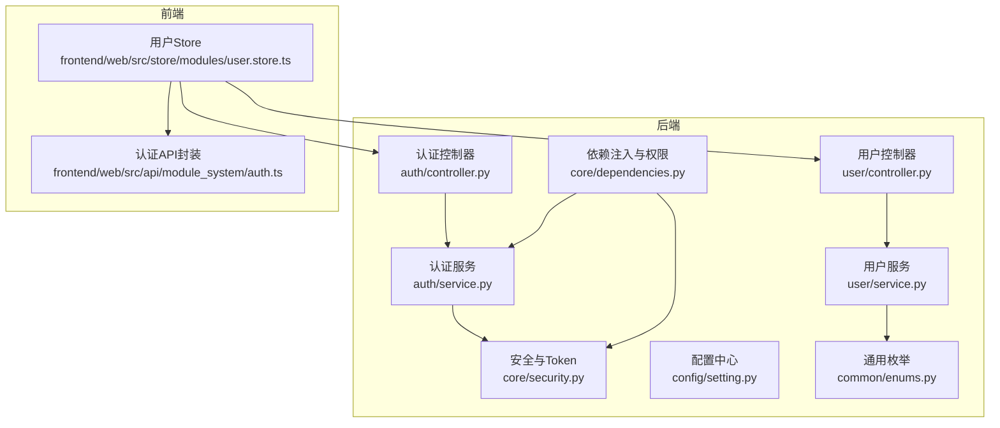
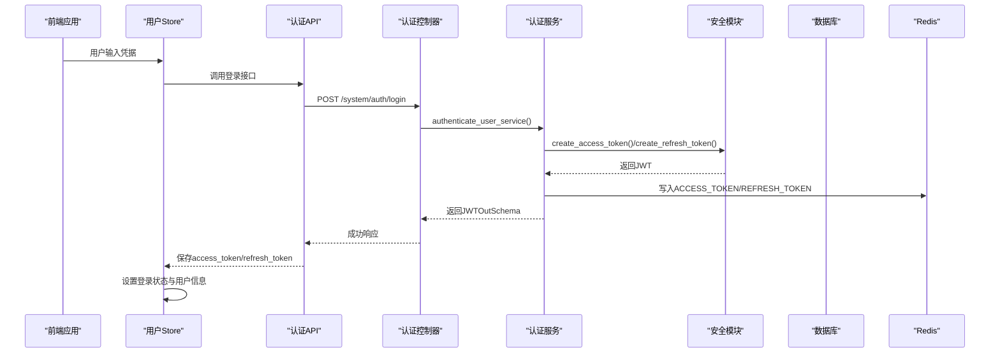
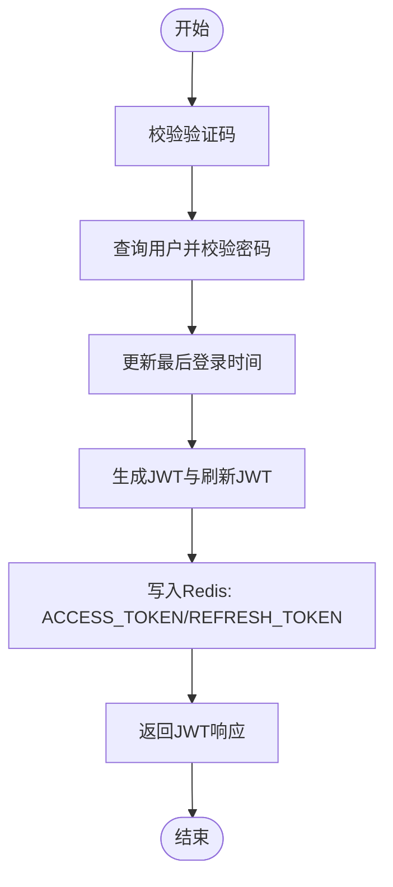
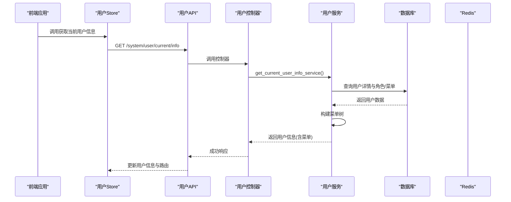
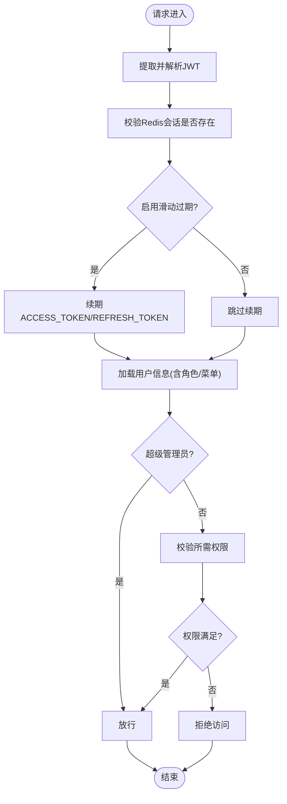
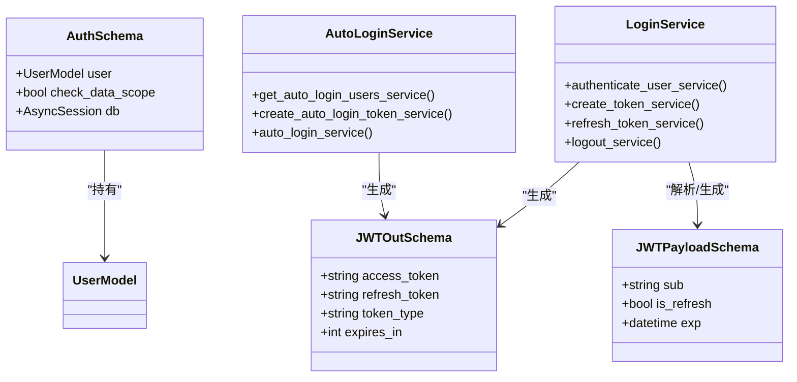
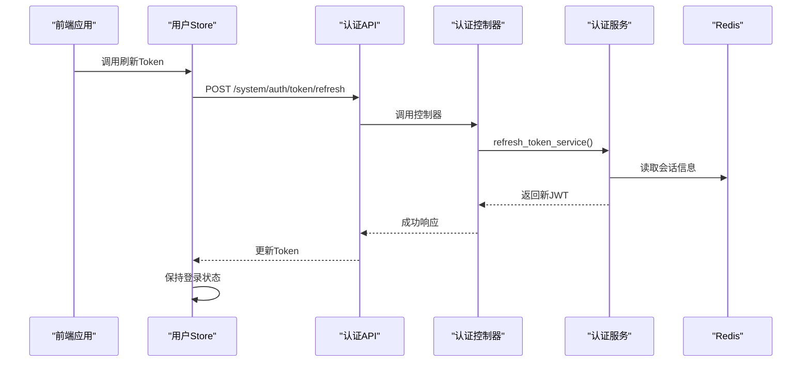
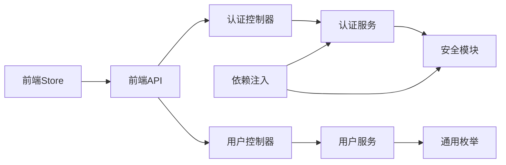

# 用户状态管理模块

<cite>
**本文档引用的文件**
- [backend/app/api/v1/module_system/auth/controller.py](file://backend/app/api/v1/module_system/auth/controller.py)
- [backend/app/api/v1/module_system/auth/service.py](file://backend/app/api/v1/module_system/auth/service.py)
- [backend/app/api/v1/module_system/auth/schema.py](file://backend/app/api/v1/module_system/auth/schema.py)
- [backend/app/api/v1/module_system/user/controller.py](file://backend/app/api/v1/module_system/user/controller.py)
- [backend/app/api/v1/module_system/user/service.py](file://backend/app/api/v1/module_system/user/service.py)
- [backend/app/api/v1/module_system/user/schema.py](file://backend/app/api/v1/module_system/user/schema.py)
- [backend/app/core/dependencies.py](file://backend/app/core/dependencies.py)
- [backend/app/core/security.py](file://backend/app/core/security.py)
- [backend/app/config/setting.py](file://backend/app/config/setting.py)
- [backend/app/common/enums.py](file://backend/app/common/enums.py)
- [frontend/web/src/store/modules/user.store.ts](file://frontend/web/src/store/modules/user.store.ts)
- [frontend/web/src/api/module_system/auth.ts](file://frontend/web/src/api/module_system/auth.ts)
</cite>

## 目录
1. [简介](#简介)
2. [项目结构](#项目结构)
3. [核心组件](#核心组件)
4. [架构概览](#架构概览)
5. [详细组件分析](#详细组件分析)
6. [依赖关系分析](#依赖关系分析)
7. [性能考量](#性能考量)
8. [故障排除指南](#故障排除指南)
9. [结论](#结论)
10. [附录](#附录)

## 简介
本文件面向FastapiAdmin项目中的用户状态管理模块，系统性阐述用户认证状态、个人信息管理、权限信息维护与会话管理等核心能力。文档重点解释以下方面：
- 用户登录状态的持久化机制与Token管理策略
- 权限验证流程与菜单权限的数据结构
- 用户信息的获取、更新与缓存策略
- 用户状态变更处理流程与安全考虑（登出清理、权限刷新机制）
- 实际开发中的使用示例与注意事项

该模块采用后端JWT + Redis的会话持久化方案，结合前端Pinia Store进行本地状态管理，形成前后端协同的用户状态管理体系。

## 项目结构
用户状态管理模块主要分布在后端的认证与用户管理子系统，以及前端的Pinia Store与API封装中。整体结构如下：

**图表来源**
- [backend/app/api/v1/module_system/auth/controller.py:38-349](file://backend/app/api/v1/module_system/auth/controller.py#L38-L349)
- [backend/app/api/v1/module_system/auth/service.py:45-576](file://backend/app/api/v1/module_system/auth/service.py#L45-L576)
- [backend/app/api/v1/module_system/user/controller.py:30-456](file://backend/app/api/v1/module_system/user/controller.py#L30-L456)
- [backend/app/api/v1/module_system/user/service.py:35-737](file://backend/app/api/v1/module_system/user/service.py#L35-L737)
- [backend/app/core/dependencies.py:44-296](file://backend/app/core/dependencies.py#L44-L296)
- [backend/app/core/security.py:11-149](file://backend/app/core/security.py#L11-L149)
- [backend/app/config/setting.py:67-74](file://backend/app/config/setting.py#L67-L74)
- [frontend/web/src/store/modules/user.store.ts:39-423](file://frontend/web/src/store/modules/user.store.ts#L39-L423)
- [frontend/web/src/api/module_system/auth.ts:8-75](file://frontend/web/src/api/module_system/auth.ts#L8-L75)

**章节来源**
- [backend/app/api/v1/module_system/auth/controller.py:38-349](file://backend/app/api/v1/module_system/auth/controller.py#L38-L349)
- [backend/app/api/v1/module_system/user/controller.py:30-456](file://backend/app/api/v1/module_system/user/controller.py#L30-L456)
- [frontend/web/src/store/modules/user.store.ts:39-423](file://frontend/web/src/store/modules/user.store.ts#L39-L423)

## 核心组件
本模块的核心组件包括：
- 认证控制器与服务：负责登录、Token刷新、验证码、登出、免登录等认证流程
- 用户控制器与服务：负责用户信息查询、更新、密码修改/重置、导入导出等用户管理
- 依赖注入与权限：提供当前用户解析、权限校验、数据权限过滤
- 安全与Token：JWT生成与解码、OAuth2自定义认证
- 配置中心：Token过期时间、滑动过期、验证码等全局配置
- 前端Store与API：用户状态持久化、路由与权限计算、Token刷新与登出

这些组件共同实现了用户状态的全生命周期管理，从前端登录到后端鉴权与权限校验，再到会话清理与权限刷新。

**章节来源**
- [backend/app/api/v1/module_system/auth/service.py:45-576](file://backend/app/api/v1/module_system/auth/service.py#L45-L576)
- [backend/app/api/v1/module_system/user/service.py:35-737](file://backend/app/api/v1/module_system/user/service.py#L35-L737)
- [backend/app/core/dependencies.py:44-296](file://backend/app/core/dependencies.py#L44-L296)
- [backend/app/core/security.py:98-149](file://backend/app/core/security.py#L98-L149)
- [backend/app/config/setting.py:67-74](file://backend/app/config/setting.py#L67-L74)
- [frontend/web/src/store/modules/user.store.ts:39-423](file://frontend/web/src/store/modules/user.store.ts#L39-L423)

## 架构概览
用户状态管理的整体架构围绕“前端状态 + 后端会话”双轨设计展开。前端通过Pinia Store管理用户信息、路由与权限，后端通过JWT与Redis实现会话持久化与权限校验。

**图表来源**
- [frontend/web/src/store/modules/user.store.ts:240-264](file://frontend/web/src/store/modules/user.store.ts#L240-L264)
- [frontend/web/src/api/module_system/auth.ts:14-23](file://frontend/web/src/api/module_system/auth.ts#L14-L23)
- [backend/app/api/v1/module_system/auth/controller.py:47-77](file://backend/app/api/v1/module_system/auth/controller.py#L47-L77)
- [backend/app/api/v1/module_system/auth/service.py:49-124](file://backend/app/api/v1/module_system/auth/service.py#L49-L124)
- [backend/app/core/security.py:98-149](file://backend/app/core/security.py#L98-L149)
- [backend/app/common/enums.py:42-53](file://backend/app/common/enums.py#L42-L53)

## 详细组件分析

### 认证与会话管理
- 登录流程：前端提交用户名、密码、验证码与登录类型，后端进行验证码校验、用户认证、密码校验、更新最后登录时间，随后生成JWT并写入Redis，返回访问令牌与刷新令牌
- Token刷新：前端使用刷新令牌向后端请求新的JWT，后端解码刷新令牌、校验用户有效性、生成新JWT并覆盖Redis中的令牌
- 登出：前端发送当前令牌至后端，后端解码令牌获取会话ID，删除Redis中的访问与刷新令牌，完成会话清理
- 免登录：后端生成一次性免登录Token并写入Redis，前端使用该Token换取JWT，实现快速登录

**图表来源**
- [backend/app/api/v1/module_system/auth/service.py:49-124](file://backend/app/api/v1/module_system/auth/service.py#L49-L124)
- [backend/app/common/enums.py:42-53](file://backend/app/common/enums.py#L42-L53)

**章节来源**
- [backend/app/api/v1/module_system/auth/controller.py:41-171](file://backend/app/api/v1/module_system/auth/controller.py#L41-L171)
- [backend/app/api/v1/module_system/auth/service.py:45-338](file://backend/app/api/v1/module_system/auth/service.py#L45-L338)
- [backend/app/core/security.py:98-149](file://backend/app/core/security.py#L98-L149)

### 用户信息管理
- 当前用户信息：后端根据认证上下文获取用户详情，同时收集菜单权限（PC端侧栏），构建树形菜单结构返回给前端
- 更新当前用户信息：前端提交基础信息更新，后端校验手机号/邮箱唯一性，排除不可修改字段，更新用户信息
- 头像上传：后端接收文件上传，生成文件名与URL，返回上传响应

**图表来源**
- [frontend/web/src/store/modules/user.store.ts:177-189](file://frontend/web/src/store/modules/user.store.ts#L177-L189)
- [frontend/web/src/api/module_system/auth.ts:14-23](file://frontend/web/src/api/module_system/auth.ts#L14-L23)
- [backend/app/api/v1/module_system/user/controller.py:33-53](file://backend/app/api/v1/module_system/user/controller.py#L33-L53)
- [backend/app/api/v1/module_system/user/service.py:279-332](file://backend/app/api/v1/module_system/user/service.py#L279-L332)

**章节来源**
- [backend/app/api/v1/module_system/user/controller.py:33-126](file://backend/app/api/v1/module_system/user/controller.py#L33-L126)
- [backend/app/api/v1/module_system/user/service.py:279-368](file://backend/app/api/v1/module_system/user/service.py#L279-L368)

### 权限验证与数据范围过滤
- 权限校验：后端通过依赖注入获取当前用户，解析JWT载荷，校验Redis中的会话有效性，若启用滑动过期则自动续期，然后根据用户角色与菜单权限进行校验
- 数据权限过滤：支持多种策略（数据范围、角色基础、部门基础、仅本人、当前用户绑定角色），用于控制用户可访问的数据范围

**图表来源**
- [backend/app/core/dependencies.py:44-129](file://backend/app/core/dependencies.py#L44-L129)
- [backend/app/common/enums.py:111-122](file://backend/app/common/enums.py#L111-L122)

**章节来源**
- [backend/app/core/dependencies.py:236-296](file://backend/app/core/dependencies.py#L236-L296)
- [backend/app/common/enums.py:111-122](file://backend/app/common/enums.py#L111-L122)

### Token管理策略与持久化
- Token类型与过期：支持访问令牌与刷新令牌，分别配置过期时间；支持滑动过期，用户活跃时自动续期
- Redis持久化：访问令牌与刷新令牌以会话ID为键前缀存储于Redis，便于登出与权限校验时快速定位
- 前端存储：前端Store持久化用户信息与Token，支持“记住我”选项，刷新Token时保持状态

**图表来源**
- [backend/app/api/v1/module_system/auth/schema.py:9-93](file://backend/app/api/v1/module_system/auth/schema.py#L9-L93)
- [backend/app/api/v1/module_system/auth/service.py:45-576](file://backend/app/api/v1/module_system/auth/service.py#L45-L576)
- [backend/app/config/setting.py:67-74](file://backend/app/config/setting.py#L67-L74)

**章节来源**
- [backend/app/api/v1/module_system/auth/schema.py:42-93](file://backend/app/api/v1/module_system/auth/schema.py#L42-L93)
- [backend/app/api/v1/module_system/auth/service.py:127-338](file://backend/app/api/v1/module_system/auth/service.py#L127-L338)
- [backend/app/config/setting.py:67-74](file://backend/app/config/setting.py#L67-L74)

### 前端用户状态管理
- 登录：调用认证API获取JWT，保存Token与用户信息，拉取当前用户信息并生成路由与权限
- 登出：调用登出API清理后端会话，重置前端Store状态，清理工作台标签
- Token刷新：当刷新令牌存在时，调用刷新接口获取新JWT并更新前端状态
- 路由与权限：根据用户角色与菜单生成权限集合，用于前端路由守卫与按钮级权限控制

**图表来源**
- [frontend/web/src/store/modules/user.store.ts:344-356](file://frontend/web/src/store/modules/user.store.ts#L344-L356)
- [frontend/web/src/api/module_system/auth.ts:25-31](file://frontend/web/src/api/module_system/auth.ts#L25-L31)
- [backend/app/api/v1/module_system/auth/controller.py:87-114](file://backend/app/api/v1/module_system/auth/controller.py#L87-L114)
- [backend/app/api/v1/module_system/auth/service.py:223-307](file://backend/app/api/v1/module_system/auth/service.py#L223-L307)

**章节来源**
- [frontend/web/src/store/modules/user.store.ts:240-356](file://frontend/web/src/store/modules/user.store.ts#L240-L356)
- [frontend/web/src/api/module_system/auth.ts:8-75](file://frontend/web/src/api/module_system/auth.ts#L8-L75)

## 依赖关系分析
用户状态管理模块的依赖关系如下：
- 控制器依赖服务层，服务层依赖安全模块与Redis CRUD
- 依赖注入模块负责解析JWT、校验会话、加载用户信息与权限
- 配置中心提供JWT密钥、算法、过期时间、滑动过期等全局配置
- 前端Store依赖认证API与用户API，形成前后端交互闭环

**图表来源**
- [backend/app/api/v1/module_system/auth/controller.py:38-349](file://backend/app/api/v1/module_system/auth/controller.py#L38-L349)
- [backend/app/api/v1/module_system/user/controller.py:30-456](file://backend/app/api/v1/module_system/user/controller.py#L30-L456)
- [backend/app/api/v1/module_system/auth/service.py:45-576](file://backend/app/api/v1/module_system/auth/service.py#L45-L576)
- [backend/app/api/v1/module_system/user/service.py:35-737](file://backend/app/api/v1/module_system/user/service.py#L35-L737)
- [backend/app/core/dependencies.py:44-296](file://backend/app/core/dependencies.py#L44-L296)
- [backend/app/core/security.py:98-149](file://backend/app/core/security.py#L98-L149)
- [backend/app/common/enums.py:42-53](file://backend/app/common/enums.py#L42-L53)
- [frontend/web/src/store/modules/user.store.ts:39-423](file://frontend/web/src/store/modules/user.store.ts#L39-L423)
- [frontend/web/src/api/module_system/auth.ts:8-75](file://frontend/web/src/api/module_system/auth.ts#L8-L75)

**章节来源**
- [backend/app/core/dependencies.py:44-129](file://backend/app/core/dependencies.py#L44-L129)
- [backend/app/config/setting.py:67-74](file://backend/app/config/setting.py#L67-L74)

## 性能考量
- 登录计时：后端在登录流程中对验证码校验、数据库查询、密码校验、更新登录时间、创建Token等步骤进行计时，便于性能优化与问题定位
- 滑动过期：启用滑动过期时，用户活跃会自动续期，减少频繁刷新带来的压力
- Redis键设计：以会话ID为前缀的键名设计，便于快速定位与清理，降低查找复杂度
- 前端状态持久化：前端Store持久化用户信息与Token，减少重复请求与重复加载

**章节来源**
- [backend/app/api/v1/module_system/auth/service.py:70-124](file://backend/app/api/v1/module_system/auth/service.py#L70-L124)
- [backend/app/config/setting.py:73-73](file://backend/app/config/setting.py#L73-L73)
- [backend/app/common/enums.py:42-53](file://backend/app/common/enums.py#L42-L53)

## 故障排除指南
- 认证失败：检查Token类型是否正确、是否包含Bearer前缀、是否过期或被登出
- 会话失效：确认Redis中是否存在对应会话键、是否启用滑动过期导致续期
- 权限不足：核对用户角色与菜单权限集合，确认所需权限是否满足
- 验证码问题：确认验证码服务是否启用、验证码是否过期或被重复使用
- 登出异常：确认后端是否成功删除Redis中的访问与刷新令牌

**章节来源**
- [backend/app/core/security.py:43-50](file://backend/app/core/security.py#L43-L50)
- [backend/app/core/dependencies.py:81-96](file://backend/app/core/dependencies.py#L81-L96)
- [backend/app/api/v1/module_system/auth/service.py:310-338](file://backend/app/api/v1/module_system/auth/service.py#L310-L338)

## 结论
用户状态管理模块通过后端JWT + Redis与前端Pinia Store的协同，实现了完整的用户认证、权限校验与会话管理能力。模块具备良好的扩展性与安全性，支持滑动过期、免登录、验证码等特性，能够满足企业级应用对用户状态管理的需求。建议在实际开发中遵循模块化设计，合理配置Token过期与滑动过期策略，并结合前端路由守卫与按钮级权限控制，确保系统的安全性与用户体验。

## 附录
- 使用示例与注意事项
  - 登录：前端调用认证API，成功后保存Token并拉取用户信息
  - 登出：前端调用登出API，后端清理Redis会话，前端重置Store状态
  - Token刷新：在刷新令牌存在时定期调用刷新接口，保持登录状态
  - 权限刷新：用户角色或菜单变更后，前端应重新拉取用户信息以更新权限集合

**章节来源**
- [frontend/web/src/store/modules/user.store.ts:240-356](file://frontend/web/src/store/modules/user.store.ts#L240-L356)
- [frontend/web/src/api/module_system/auth.ts:14-72](file://frontend/web/src/api/module_system/auth.ts#L14-L72)