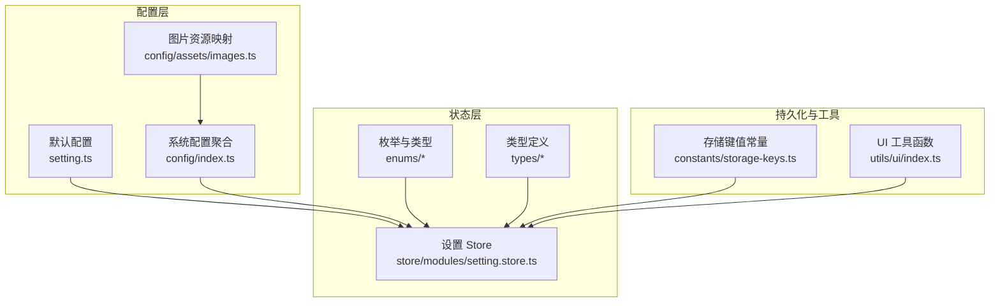
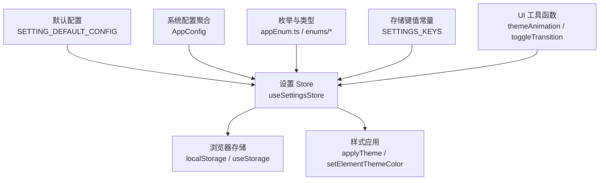
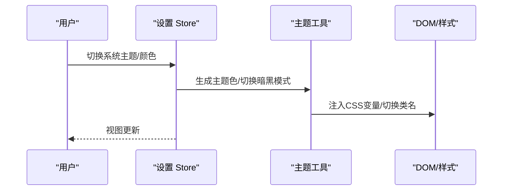
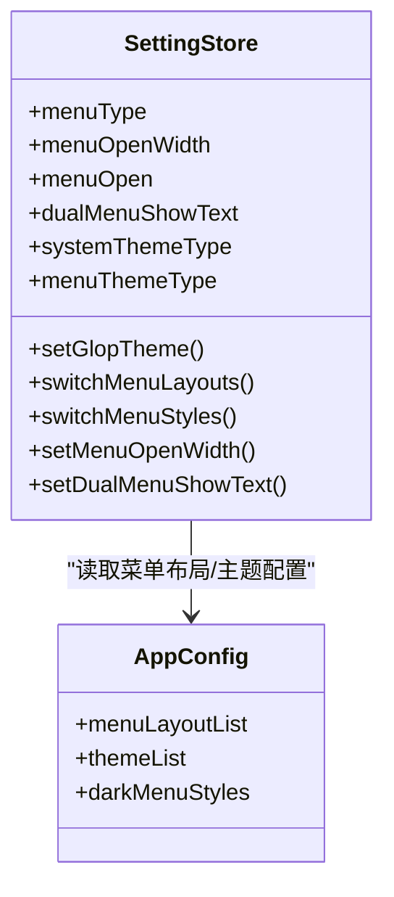
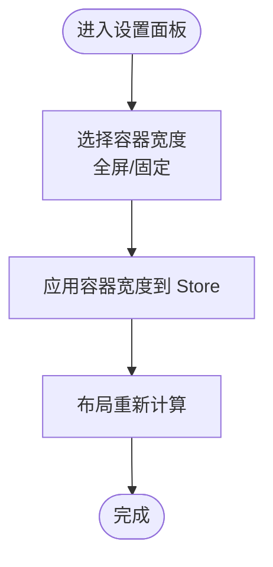
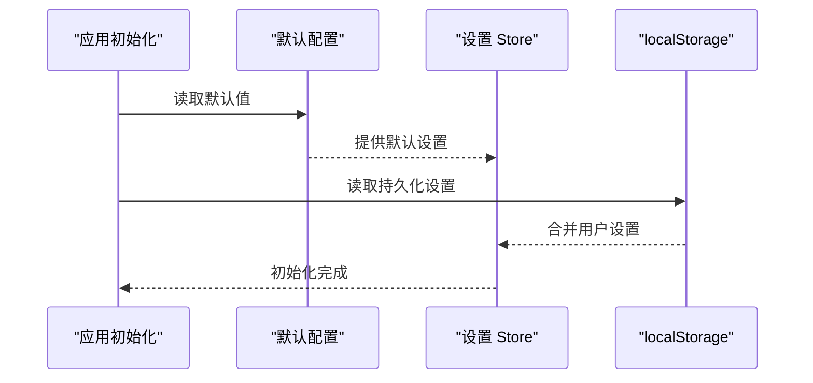
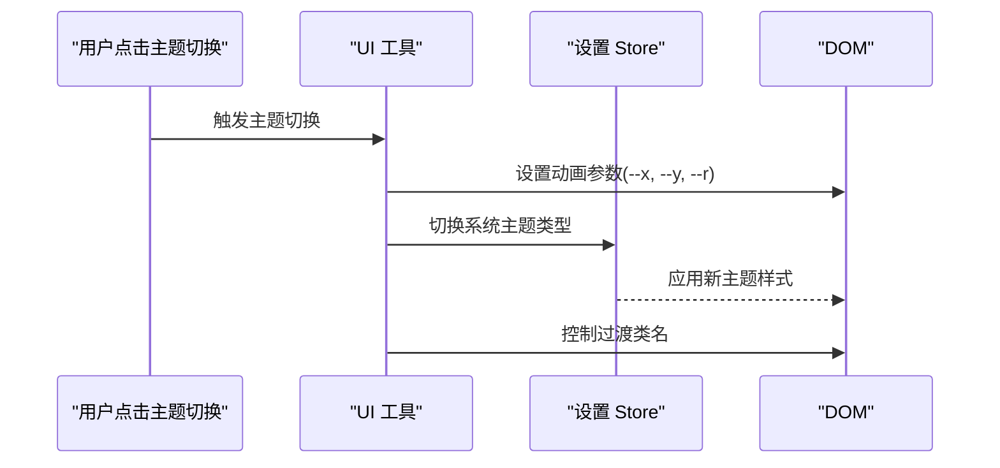
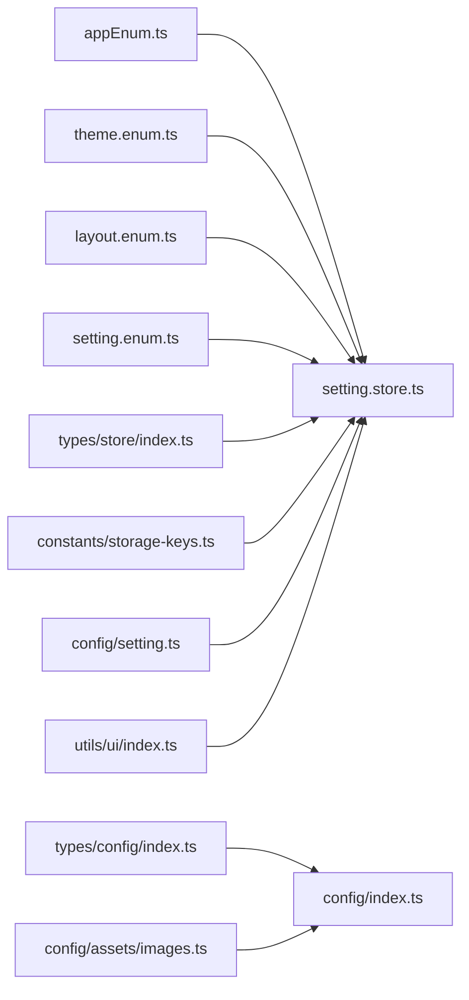

# 系统设置状态模块

<cite>
**本文档引用的文件**
- [setting.ts](file://frontend/web/src/config/setting.ts)
- [setting.store.ts](file://frontend/web/src/store/modules/setting.store.ts)
- [appEnum.ts](file://frontend/web/src/enums/appEnum.ts)
- [theme.enum.ts](file://frontend/web/src/enums/settings/theme.enum.ts)
- [layout.enum.ts](file://frontend/web/src/enums/settings/layout.enum.ts)
- [setting.enum.ts](file://frontend/web/src/enums/settings/setting.enum.ts)
- [storage-keys.ts](file://frontend/web/src/constants/storage-keys.ts)
- [index.ts](file://frontend/web/src/config/index.ts)
- [images.ts](file://frontend/web/src/config/assets/images.ts)
- [index.ts](file://frontend/web/src/types/config/index.ts)
- [index.ts](file://frontend/web/src/types/store/index.ts)
- [index.ts](file://frontend/web/src/utils/ui/index.ts)
</cite>

## 目录
1. [简介](#简介)
2. [项目结构](#项目结构)
3. [核心组件](#核心组件)
4. [架构总览](#架构总览)
5. [详细组件分析](#详细组件分析)
6. [依赖关系分析](#依赖关系分析)
7. [性能考虑](#性能考虑)
8. [故障排除指南](#故障排除指南)
9. [结论](#结论)
10. [附录](#附录)

## 简介
本文件系统化梳理前端系统设置状态模块，围绕主题配置管理、布局设置、菜单样式与容器配置等系统级设置能力进行深入解析。重点涵盖：
- 主题切换机制与颜色方案管理，以及暗黑模式支持
- 布局配置选项（顶部导航、侧边栏、混合布局）与响应式断点设置
- 菜单样式配置（线条样式、圆角样式、图标样式）
- 容器宽度设置与全局配置的继承与覆盖机制
- 设置项的持久化策略与默认值管理
- 提供配置示例与最佳实践建议

## 项目结构
系统设置状态模块由“默认配置”、“Pinia Store 状态”、“枚举与类型定义”、“配置聚合”、“持久化键值”、“UI 工具函数”等部分组成，形成清晰的分层与职责划分。

**图表来源**
- [setting.ts:1-224](file://frontend/web/src/config/setting.ts#L1-L224)
- [setting.store.ts:1-524](file://frontend/web/src/store/modules/setting.store.ts#L1-L524)
- [index.ts:1-140](file://frontend/web/src/config/index.ts#L1-L140)
- [images.ts:1-61](file://frontend/web/src/config/assets/images.ts#L1-L61)
- [storage-keys.ts:1-79](file://frontend/web/src/constants/storage-keys.ts#L1-L79)
- [appEnum.ts:1-82](file://frontend/web/src/enums/appEnum.ts#L1-L82)
- [index.ts:1-54](file://frontend/web/src/types/config/index.ts#L1-L56)
- [index.ts:1-54](file://frontend/web/src/types/store/index.ts#L1-L54)
- [index.ts:277-310](file://frontend/web/src/utils/ui/index.ts#L277-L310)

**章节来源**
- [setting.ts:1-224](file://frontend/web/src/config/setting.ts#L1-L224)
- [setting.store.ts:1-524](file://frontend/web/src/store/modules/setting.store.ts#L1-L524)
- [index.ts:1-140](file://frontend/web/src/config/index.ts#L1-L140)
- [images.ts:1-61](file://frontend/web/src/config/assets/images.ts#L1-L61)
- [storage-keys.ts:1-79](file://frontend/web/src/constants/storage-keys.ts#L1-L79)
- [appEnum.ts:1-82](file://frontend/web/src/enums/appEnum.ts#L1-L82)
- [index.ts:1-54](file://frontend/web/src/types/config/index.ts#L1-L56)
- [index.ts:1-54](file://frontend/web/src/types/store/index.ts#L1-L54)
- [index.ts:277-310](file://frontend/web/src/utils/ui/index.ts#L277-L310)

## 核心组件
- 默认配置与默认值管理：集中定义系统设置的默认值、重置逻辑与主题色预设，确保全局一致性与可恢复性。
- 设置 Store：封装菜单、主题、显示、功能、样式、节日等状态，提供持久化与计算属性，负责主题切换与样式应用。
- 枚举与类型：统一定义菜单类型、系统主题、布局模式、侧边栏配色、容器宽度等枚举，保证类型安全。
- 配置聚合：将系统主题样式、菜单布局、菜单主题、图片资源等整合为系统配置，便于设置面板展示与选择。
- 持久化键值：统一管理 localStorage 键名，确保设置项跨会话持久化。
- UI 工具函数：提供主题切换动画与过渡控制，增强用户体验。

**章节来源**
- [setting.ts:36-143](file://frontend/web/src/config/setting.ts#L36-L143)
- [setting.store.ts:27-524](file://frontend/web/src/store/modules/setting.store.ts#L27-L524)
- [appEnum.ts:17-82](file://frontend/web/src/enums/appEnum.ts#L17-L82)
- [index.ts:38-137](file://frontend/web/src/config/index.ts#L38-L137)
- [storage-keys.ts:17-71](file://frontend/web/src/constants/storage-keys.ts#L17-L71)
- [index.ts:277-310](file://frontend/web/src/utils/ui/index.ts#L277-L310)

## 架构总览
系统设置状态模块采用“配置-状态-持久化-工具”的分层架构，通过默认配置与系统配置聚合提供全局默认值与可选方案，Store 负责状态管理与持久化，枚举与类型保障一致性，UI 工具函数提供交互体验优化。

**图表来源**
- [setting.ts:36-143](file://frontend/web/src/config/setting.ts#L36-L143)
- [setting.store.ts:11-25](file://frontend/web/src/store/modules/setting.store.ts#L11-L25)
- [index.ts:38-137](file://frontend/web/src/config/index.ts#L38-L137)
- [storage-keys.ts:53-71](file://frontend/web/src/constants/storage-keys.ts#L53-L71)
- [index.ts:277-310](file://frontend/web/src/utils/ui/index.ts#L277-L310)

## 详细组件分析

### 主题配置管理
- 系统主题类型：支持亮色、暗色、自动跟随系统三种模式，通过系统主题类型与模式组合实现灵活的主题策略。
- 菜单主题类型：支持设计、亮色、暗色三类菜单风格，Store 在暗黑模式下优先使用暗色菜单样式。
- 主题颜色方案：提供系统主色列表与主题色预设，支持动态切换并应用到全局样式变量。
- 主题切换机制：通过 Store 监听主题与颜色变化，调用样式应用函数生成并注入主题色，同时处理侧边栏配色与灰度模式等附加效果。
- 暗黑模式支持：结合系统主题类型与计算属性，动态切换暗黑模式样式与菜单主题。

**图表来源**
- [setting.store.ts:180-208](file://frontend/web/src/store/modules/setting.store.ts#L180-L208)
- [index.ts:136-143](file://frontend/web/src/config/index.ts#L136-L143)
- [index.ts:277-310](file://frontend/web/src/utils/ui/index.ts#L277-L310)

**章节来源**
- [setting.store.ts:136-147](file://frontend/web/src/store/modules/setting.store.ts#L136-L147)
- [setting.store.ts:180-208](file://frontend/web/src/store/modules/setting.store.ts#L180-L208)
- [index.ts:114-122](file://frontend/web/src/config/index.ts#L114-L122)
- [index.ts:277-310](file://frontend/web/src/utils/ui/index.ts#L277-L310)

### 布局设置与菜单样式
- 菜单类型：支持左侧、顶部、顶部+左侧、双栏四种布局，用于构建不同的导航体验。
- 布局模式：左侧、顶部、混合三种布局模式，适配不同屏幕与使用场景。
- 菜单主题：设计、亮色、暗色三类菜单风格，配合系统主题自动切换。
- 菜单宽度：支持菜单展开宽度与收起宽度配置，双栏菜单可控制文本显示。
- 侧边栏配色方案：经典蓝与极简白两种方案，通过 Store 监听并切换侧边栏样式。

**图表来源**
- [setting.store.ts:30-67](file://frontend/web/src/store/modules/setting.store.ts#L30-L67)
- [index.ts:75-122](file://frontend/web/src/config/index.ts#L75-L122)
- [appEnum.ts:18-53](file://frontend/web/src/enums/appEnum.ts#L18-L53)

**章节来源**
- [setting.store.ts:210-329](file://frontend/web/src/store/modules/setting.store.ts#L210-L329)
- [index.ts:75-122](file://frontend/web/src/config/index.ts#L75-L122)
- [appEnum.ts:18-53](file://frontend/web/src/enums/appEnum.ts#L18-L53)

### 容器配置与响应式断点
- 容器宽度：支持全屏与固定宽度两种容器模式，通过 Store 管理容器宽度并影响页面布局。
- 圆角与过渡：支持自定义圆角半径与页面过渡效果，提升视觉一致性与交互体验。
- 响应式断点：通过容器宽度与布局模式组合，适配不同终端与屏幕尺寸。

**图表来源**
- [setting.store.ts:237-239](file://frontend/web/src/store/modules/setting.store.ts#L237-L239)
- [appEnum.ts:74-82](file://frontend/web/src/enums/appEnum.ts#L74-L82)

**章节来源**
- [setting.store.ts:237-239](file://frontend/web/src/store/modules/setting.store.ts#L237-L239)
- [appEnum.ts:74-82](file://frontend/web/src/enums/appEnum.ts#L74-L82)

### 设置项持久化与默认值管理
- 持久化策略：使用 useStorage 将关键设置项持久化至 localStorage，键名统一由常量模块管理，确保跨会话一致性。
- 默认值管理：默认配置集中于配置文件，提供重置为默认值的能力，便于恢复出厂设置或统一初始化。
- 继承与覆盖：系统配置聚合提供可选方案与默认值，Store 在初始化时读取默认值并在运行时允许用户覆盖。

**图表来源**
- [setting.ts:152-167](file://frontend/web/src/config/setting.ts#L152-L167)
- [setting.store.ts:76-134](file://frontend/web/src/store/modules/setting.store.ts#L76-L134)
- [storage-keys.ts:53-71](file://frontend/web/src/constants/storage-keys.ts#L53-L71)

**章节来源**
- [setting.ts:152-167](file://frontend/web/src/config/setting.ts#L152-L167)
- [setting.store.ts:76-134](file://frontend/web/src/store/modules/setting.store.ts#L76-L134)
- [storage-keys.ts:53-71](file://frontend/web/src/constants/storage-keys.ts#L53-L71)

### 主题切换动画与过渡控制
- 主题动画：提供基于视口转换的主题切换动画，增强主题切换的视觉连贯性。
- 过渡控制：通过工具函数控制主题切换过渡类名的添加与移除，避免动画残留。

**图表来源**
- [index.ts:277-310](file://frontend/web/src/utils/ui/index.ts#L277-L310)
- [setting.store.ts:218-222](file://frontend/web/src/store/modules/setting.store.ts#L218-L222)

**章节来源**
- [index.ts:277-310](file://frontend/web/src/utils/ui/index.ts#L277-L310)
- [setting.store.ts:218-222](file://frontend/web/src/store/modules/setting.store.ts#L218-L222)

## 依赖关系分析
系统设置状态模块的关键依赖关系如下：

**图表来源**
- [appEnum.ts:17-82](file://frontend/web/src/enums/appEnum.ts#L17-L82)
- [theme.enum.ts:4-18](file://frontend/web/src/enums/settings/theme.enum.ts#L4-L18)
- [layout.enum.ts:4-18](file://frontend/web/src/enums/settings/layout.enum.ts#L4-L18)
- [setting.enum.ts:4-47](file://frontend/web/src/enums/settings/setting.enum.ts#L4-L47)
- [index.ts:1-56](file://frontend/web/src/types/config/index.ts#L1-L56)
- [index.ts:1-54](file://frontend/web/src/types/store/index.ts#L1-L54)
- [images.ts:1-61](file://frontend/web/src/config/assets/images.ts#L1-L61)
- [storage-keys.ts:53-71](file://frontend/web/src/constants/storage-keys.ts#L53-L71)
- [setting.ts:36-143](file://frontend/web/src/config/setting.ts#L36-L143)
- [index.ts:277-310](file://frontend/web/src/utils/ui/index.ts#L277-L310)

**章节来源**
- [appEnum.ts:17-82](file://frontend/web/src/enums/appEnum.ts#L17-L82)
- [theme.enum.ts:4-18](file://frontend/web/src/enums/settings/theme.enum.ts#L4-L18)
- [layout.enum.ts:4-18](file://frontend/web/src/enums/settings/layout.enum.ts#L4-L18)
- [setting.enum.ts:4-47](file://frontend/web/src/enums/settings/setting.enum.ts#L4-L47)
- [index.ts:1-56](file://frontend/web/src/types/config/index.ts#L1-L56)
- [index.ts:1-54](file://frontend/web/src/types/store/index.ts#L1-L54)
- [images.ts:1-61](file://frontend/web/src/config/assets/images.ts#L1-L61)
- [storage-keys.ts:53-71](file://frontend/web/src/constants/storage-keys.ts#L53-L71)
- [setting.ts:36-143](file://frontend/web/src/config/setting.ts#L36-L143)
- [index.ts:277-310](file://frontend/web/src/utils/ui/index.ts#L277-L310)

## 性能考虑
- 状态粒度：Store 将设置项按功能域拆分（菜单、主题、显示、功能、样式），降低不必要的响应式更新。
- 持久化策略：仅对关键设置项使用持久化，减少存储压力与初始化开销。
- 主题应用：主题切换通过一次性注入 CSS 变量与类名，避免频繁重排与重绘。
- 动画控制：主题切换动画在支持视口转换的环境下启用，不支持时回退到直接切换，保证兼容性与性能。

## 故障排除指南
- 主题切换无效：检查系统主题类型与模式设置是否正确，确认 Store 监听与样式应用流程正常。
- 菜单样式未生效：确认菜单主题类型与系统主题模式的组合是否符合预期，检查暗黑模式下的菜单样式映射。
- 设置未持久化：核对存储键名是否正确，确认 useStorage 初始化与 localStorage 权限。
- 圆角或容器宽度异常：检查自定义圆角与容器宽度的计算属性是否正确应用到根节点样式变量。

**章节来源**
- [setting.store.ts:180-208](file://frontend/web/src/store/modules/setting.store.ts#L180-L208)
- [index.ts:136-143](file://frontend/web/src/config/index.ts#L136-L143)
- [storage-keys.ts:53-71](file://frontend/web/src/constants/storage-keys.ts#L53-L71)

## 结论
系统设置状态模块通过默认配置、Store 状态管理、枚举与类型定义、配置聚合与持久化策略，实现了主题、布局、菜单样式与容器配置的统一管理。其分层架构与明确的职责划分，既保证了系统的可维护性，也为用户提供了灵活且一致的定制化体验。建议在扩展新设置项时遵循现有模式，确保默认值、持久化与样式应用的一致性。

## 附录
- 配置示例与最佳实践
  - 主题切换：优先使用系统主题类型与模式组合，避免硬编码主题值；通过 Store 的主题监听与样式应用函数统一处理。
  - 菜单布局：根据业务场景选择合适的菜单类型与布局模式，必要时启用双栏菜单并控制文本显示。
  - 容器宽度：在桌面端使用固定宽度，在移动端使用全屏宽度，结合媒体查询优化响应式表现。
  - 持久化策略：仅对用户可感知的关键设置项进行持久化，避免过度占用存储空间。
  - 默认值管理：新增设置项时同步更新默认配置与设置面板逻辑，确保可恢复性与一致性。