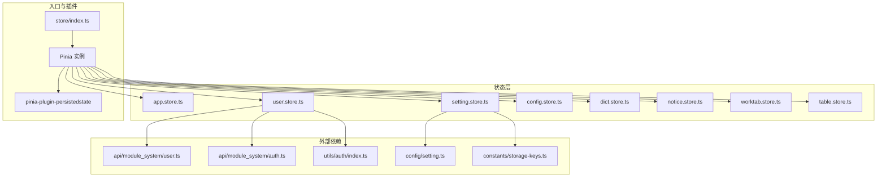
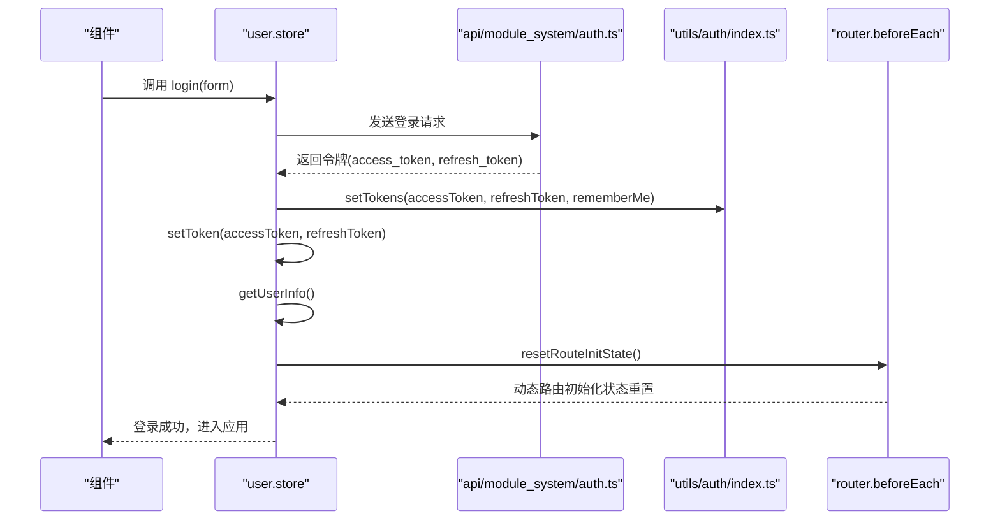
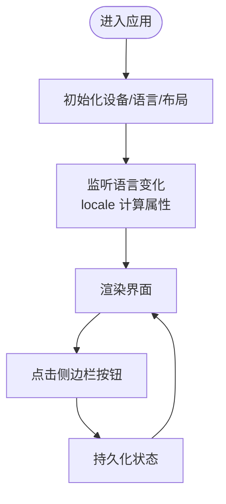
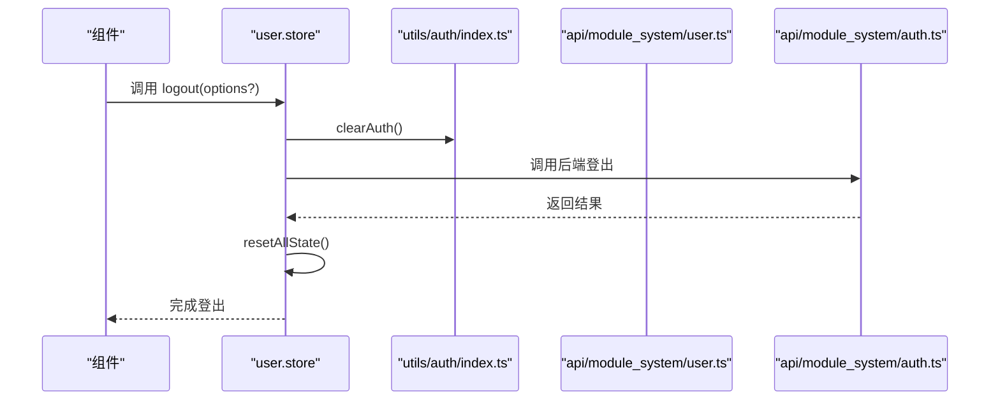
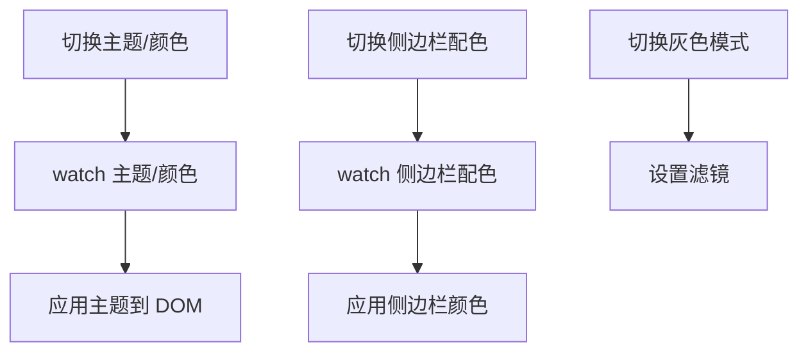
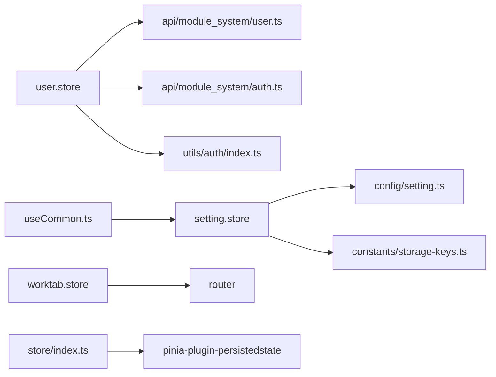

# 状态管理系统

<cite>
**本文档引用的文件**
- [frontend/web/src/store/index.ts](file://frontend/web/src/store/index.ts)
- [frontend/web/src/store/modules/app.store.ts](file://frontend/web/src/store/modules/app.store.ts)
- [frontend/web/src/store/modules/user.store.ts](file://frontend/web/src/store/modules/user.store.ts)
- [frontend/web/src/store/modules/setting.store.ts](file://frontend/web/src/store/modules/setting.store.ts)
- [frontend/web/src/store/modules/config.store.ts](file://frontend/web/src/store/modules/config.store.ts)
- [frontend/web/src/store/modules/dict.store.ts](file://frontend/web/src/store/modules/dict.store.ts)
- [frontend/web/src/store/modules/notice.store.ts](file://frontend/web/src/store/modules/notice.store.ts)
- [frontend/web/src/store/modules/worktab.store.ts](file://frontend/web/src/store/modules/worktab.store.ts)
- [frontend/web/src/store/modules/table.store.ts](file://frontend/web/src/store/modules/table.store.ts)
- [frontend/web/src/constants/storage-keys.ts](file://frontend/web/src/constants/storage-keys.ts)
- [frontend/web/src/api/module_system/user.ts](file://frontend/web/src/api/module_system/user.ts)
- [frontend/web/src/api/module_system/auth.ts](file://frontend/web/src/api/module_system/auth.ts)
- [frontend/web/src/config/setting.ts](file://frontend/web/src/config/setting.ts)
- [frontend/web/src/utils/auth/index.ts](file://frontend/web/src/utils/auth/index.ts)
- [frontend/web/src/hooks/core/useCommon.ts](file://frontend/web/src/hooks/core/useCommon.ts)
</cite>

## 目录
1. [简介](#简介)
2. [项目结构](#项目结构)
3. [核心组件](#核心组件)
4. [架构总览](#架构总览)
5. [详细组件分析](#详细组件分析)
6. [依赖关系分析](#依赖关系分析)
7. [性能考量](#性能考量)
8. [故障排查指南](#故障排查指南)
9. [结论](#结论)
10. [附录](#附录)

## 简介
本文件系统性阐述基于 Pinia 的前端状态管理架构，覆盖 Store 模块设计、状态定义与动作方法，重点解析应用状态（app.store）、用户状态（user.store）、设置状态（setting.store）等核心模块的功能与使用方式。同时说明状态持久化策略、状态同步机制与副作用处理，提供最佳实践、调试技巧、与组件通信的集成模式以及性能优化策略，并针对复杂业务场景给出状态管理解决方案与重构指导。

## 项目结构
前端状态管理位于 `frontend/web/src/store`，采用“按模块划分”的组织方式，每个模块独立定义自身状态与动作，并通过统一入口挂载到 Pinia 实例。持久化通过插件实现，部分模块采用 localStorage，部分模块采用 useStorage（VueUse）实现细粒度持久化。

图表来源
- [frontend/web/src/store/index.ts:1-89](file://frontend/web/src/store/index.ts#L1-L89)
- [frontend/web/src/store/modules/app.store.ts:1-123](file://frontend/web/src/store/modules/app.store.ts#L1-L123)
- [frontend/web/src/store/modules/user.store.ts:1-423](file://frontend/web/src/store/modules/user.store.ts#L1-L423)
- [frontend/web/src/store/modules/setting.store.ts:1-524](file://frontend/web/src/store/modules/setting.store.ts#L1-L524)
- [frontend/web/src/store/modules/config.store.ts:1-87](file://frontend/web/src/store/modules/config.store.ts#L1-L87)
- [frontend/web/src/store/modules/dict.store.ts:1-152](file://frontend/web/src/store/modules/dict.store.ts#L1-L152)
- [frontend/web/src/store/modules/notice.store.ts:1-125](file://frontend/web/src/store/modules/notice.store.ts#L1-L125)
- [frontend/web/src/store/modules/worktab.store.ts:1-635](file://frontend/web/src/store/modules/worktab.store.ts#L1-L635)
- [frontend/web/src/store/modules/table.store.ts:1-62](file://frontend/web/src/store/modules/table.store.ts#L1-L62)
- [frontend/web/src/api/module_system/user.ts:1-269](file://frontend/web/src/api/module_system/user.ts#L1-L269)
- [frontend/web/src/api/module_system/auth.ts:1-125](file://frontend/web/src/api/module_system/auth.ts#L1-L125)
- [frontend/web/src/config/setting.ts:1-224](file://frontend/web/src/config/setting.ts#L1-L224)
- [frontend/web/src/constants/storage-keys.ts:1-79](file://frontend/web/src/constants/storage-keys.ts#L1-L79)
- [frontend/web/src/utils/auth/index.ts:1-102](file://frontend/web/src/utils/auth/index.ts#L1-L102)

章节来源
- [frontend/web/src/store/index.ts:1-89](file://frontend/web/src/store/index.ts#L1-L89)

## 核心组件
- 应用状态（app.store）：设备类型、布局大小、语言、侧边栏状态、顶部菜单激活路径、引导可见性等，具备持久化。
- 用户状态（user.store）：登录状态、锁屏状态、用户信息、令牌、路由与权限、搜索历史等，具备持久化与令牌管理。
- 设置状态（setting.store）：菜单类型、主题、显示开关、功能开关、样式参数、布局与主题持久化，具备 watch 主题与侧边栏颜色联动。
- 系统配置（config.store）：系统初始化配置参数，支持强制刷新与缓存。
- 字典状态（dict.store）：数据字典缓存、批量获取、标签查找、清空。
- 通知状态（notice.store）：通知列表、未读标记、批量标记、持久化已读集合。
- 工作标签页（worktab.store）：多标签页打开/关闭/固定/批量关闭、KeepAlive 排除、路由校验、持久化。
- 表格偏好（table.store）：表格密度、斑马纹、边框、表头背景、全屏、行拖拽、高亮当前行等，持久化。

章节来源
- [frontend/web/src/store/modules/app.store.ts:1-123](file://frontend/web/src/store/modules/app.store.ts#L1-L123)
- [frontend/web/src/store/modules/user.store.ts:1-423](file://frontend/web/src/store/modules/user.store.ts#L1-L423)
- [frontend/web/src/store/modules/setting.store.ts:1-524](file://frontend/web/src/store/modules/setting.store.ts#L1-L524)
- [frontend/web/src/store/modules/config.store.ts:1-87](file://frontend/web/src/store/modules/config.store.ts#L1-L87)
- [frontend/web/src/store/modules/dict.store.ts:1-152](file://frontend/web/src/store/modules/dict.store.ts#L1-L152)
- [frontend/web/src/store/modules/notice.store.ts:1-125](file://frontend/web/src/store/modules/notice.store.ts#L1-L125)
- [frontend/web/src/store/modules/worktab.store.ts:1-635](file://frontend/web/src/store/modules/worktab.store.ts#L1-L635)
- [frontend/web/src/store/modules/table.store.ts:1-62](file://frontend/web/src/store/modules/table.store.ts#L1-L62)

## 架构总览
Pinia 作为状态容器，通过插件实现持久化；各模块围绕单一职责划分，模块间通过 API 与工具类解耦。用户状态与路由/权限紧密关联，设置状态影响主题与界面行为，工作标签页负责页面生命周期与缓存策略，字典与通知提供跨页面共享数据与消息。

图表来源
- [frontend/web/src/store/modules/user.store.ts:240-264](file://frontend/web/src/store/modules/user.store.ts#L240-L264)
- [frontend/web/src/api/module_system/auth.ts:8-73](file://frontend/web/src/api/module_system/auth.ts#L8-L73)
- [frontend/web/src/utils/auth/index.ts:38-50](file://frontend/web/src/utils/auth/index.ts#L38-L50)

## 详细组件分析

### 应用状态（app.store）
- 状态：设备类型、布局大小、语言、侧边栏、顶部菜单激活路径、引导可见性。
- 动作：切换侧边栏、切换设备、切换语言、切换布局大小、顶部菜单激活、引导显示/隐藏。
- 持久化：启用持久化，重启后恢复侧边栏、语言、布局等。

图表来源
- [frontend/web/src/store/modules/app.store.ts:32-122](file://frontend/web/src/store/modules/app.store.ts#L32-L122)

章节来源
- [frontend/web/src/store/modules/app.store.ts:1-123](file://frontend/web/src/store/modules/app.store.ts#L1-L123)

### 用户状态（user.store）
- 状态：登录状态、锁屏状态、用户信息、令牌、路由列表、权限集合、搜索历史、记住我。
- 动作：登录、登出、刷新令牌、设置用户信息、设置路由、设置权限、重置状态、完全重置。
- 依赖：Auth 工具类管理令牌存储与清理；与设置、工作标签页、菜单模块协作；延迟加载路由工具以避免循环依赖。
- 持久化：用户信息与令牌持久化；登出时清理并重置路由状态。

图表来源
- [frontend/web/src/store/modules/user.store.ts:269-312](file://frontend/web/src/store/modules/user.store.ts#L269-L312)
- [frontend/web/src/utils/auth/index.ts:52-57](file://frontend/web/src/utils/auth/index.ts#L52-L57)
- [frontend/web/src/api/module_system/auth.ts:40-46](file://frontend/web/src/api/module_system/auth.ts#L40-L46)

章节来源
- [frontend/web/src/store/modules/user.store.ts:1-423](file://frontend/web/src/store/modules/user.store.ts#L1-L423)
- [frontend/web/src/utils/auth/index.ts:1-102](file://frontend/web/src/utils/auth/index.ts#L1-L102)
- [frontend/web/src/api/module_system/user.ts:1-269](file://frontend/web/src/api/module_system/user.ts#L1-L269)
- [frontend/web/src/api/module_system/auth.ts:1-125](file://frontend/web/src/api/module_system/auth.ts#L1-L125)

### 设置状态（setting.store）
- 状态：菜单类型、主题、显示开关、功能开关、样式参数、布局与主题持久化。
- 动作：切换菜单布局、设置菜单宽度、设置全局主题、设置元素主题色、切换边框模式、容器宽度、唯一展开、按钮显隐、刷新、水印可见、圆角半径、节日烟花、双菜单文本、更新设置、重置设置。
- 副作用：watch 主题与侧边栏颜色，即时应用到 DOM；watch 灰色模式，动态设置滤镜；计算属性提供菜单主题、是否暗色、菜单展开宽度、自定义圆角等。

图表来源
- [frontend/web/src/store/modules/setting.store.ts:180-208](file://frontend/web/src/store/modules/setting.store.ts#L180-L208)
- [frontend/web/src/store/modules/setting.store.ts:210-329](file://frontend/web/src/store/modules/setting.store.ts#L210-L329)

章节来源
- [frontend/web/src/store/modules/setting.store.ts:1-524](file://frontend/web/src/store/modules/setting.store.ts#L1-L524)
- [frontend/web/src/config/setting.ts:1-224](file://frontend/web/src/config/setting.ts#L1-L224)
- [frontend/web/src/constants/storage-keys.ts:1-79](file://frontend/web/src/constants/storage-keys.ts#L1-L79)

### 系统配置（config.store）
- 状态：配置数据、是否已加载、是否正在加载。
- 动作：getConfig(force)，支持强制刷新与防抖。
- 持久化：启用持久化，避免重复请求。

章节来源
- [frontend/web/src/store/modules/config.store.ts:1-87](file://frontend/web/src/store/modules/config.store.ts#L1-L87)

### 字典状态（dict.store）
- 状态：字典数据、是否已加载。
- 动作：getDict(types) 批量获取、getDictArray(type) 获取数组、getDictLabel(type, value) 标签查找、clearDictData() 清空。
- 持久化：启用持久化，减少重复请求。

章节来源
- [frontend/web/src/store/modules/dict.store.ts:1-152](file://frontend/web/src/store/modules/dict.store.ts#L1-L152)

### 通知状态（notice.store）
- 状态：通知列表、总数、是否已加载、已读 ID 集合。
- 动作：getNotice()、markAsRead(id?)、markAllAsRead(ids?)、clearUserInfo()。
- 持久化：已读 ID 集合持久化，避免刷新后重复展示。

章节来源
- [frontend/web/src/store/modules/notice.store.ts:1-125](file://frontend/web/src/store/modules/notice.store.ts#L1-L125)

### 工作标签页（worktab.store）
- 状态：当前标签、已打开标签、KeepAlive 排除列表。
- 动作：openTab、removeTab、removeLeft、removeRight、removeOthers、removeAll、toggleFixedTab、validateWorktabs、clearAll、syncCurrentFromRoute。
- 路由校验：动态路由校验与登录页过滤，保证标签页与路由一致性。
- 持久化：使用 localStorage，键名包含版本号，刷新后保留标签状态。

章节来源
- [frontend/web/src/store/modules/worktab.store.ts:1-635](file://frontend/web/src/store/modules/worktab.store.ts#L1-L635)

### 表格偏好（table.store）
- 状态：表格尺寸、斑马纹、边框、表头背景、全屏、行拖拽、高亮当前行。
- 动作：对应 setter。
- 持久化：localStorage。

章节来源
- [frontend/web/src/store/modules/table.store.ts:1-62](file://frontend/web/src/store/modules/table.store.ts#L1-L62)

## 依赖关系分析
- 模块内聚：各模块围绕单一职责，状态与动作边界清晰。
- 模块耦合：用户状态依赖 API 与工具类；设置状态依赖配置与常量；工作标签页依赖路由与通用钩子。
- 持久化策略：统一通过插件与 useStorage 实现，键名集中管理于常量文件。
- 循环依赖规避：用户状态延迟加载路由工具，避免与 beforeEach 的循环依赖。

图表来源
- [frontend/web/src/store/modules/user.store.ts:19-24](file://frontend/web/src/store/modules/user.store.ts#L19-L24)
- [frontend/web/src/store/modules/setting.store.ts:8-25](file://frontend/web/src/store/modules/setting.store.ts#L8-L25)
- [frontend/web/src/hooks/core/useCommon.ts:1-58](file://frontend/web/src/hooks/core/useCommon.ts#L1-L58)
- [frontend/web/src/store/index.ts:13](file://frontend/web/src/store/index.ts#L13)

章节来源
- [frontend/web/src/store/index.ts:1-89](file://frontend/web/src/store/index.ts#L1-L89)
- [frontend/web/src/store/modules/user.store.ts:19-24](file://frontend/web/src/store/modules/user.store.ts#L19-L24)
- [frontend/web/src/store/modules/setting.store.ts:8-25](file://frontend/web/src/store/modules/setting.store.ts#L8-L25)
- [frontend/web/src/hooks/core/useCommon.ts:1-58](file://frontend/web/src/hooks/core/useCommon.ts#L1-L58)

## 性能考量
- 持久化策略
  - 用户、设置、工作标签页、字典、通知、表格偏好均采用持久化，减少重复请求与状态丢失。
  - 建议：对大体量数据（如通知列表）采用分页或增量加载，避免一次性持久化过多数据。
- 并发与批处理
  - 应用缓存刷新使用 Promise.allSettled 并发拉取多个模块数据，提高初始化效率。
- KeepAlive 与标签页
  - 通过 KeepAlive 排除列表精确控制缓存，避免不必要的组件实例缓存。
- 主题与样式
  - 主题切换通过 watch 即时应用，建议在高频切换场景下增加节流/防抖。
- API 请求
  - 配置与字典模块已内置加载状态与防抖，建议在组件层配合骨架屏与占位符优化体验。

章节来源
- [frontend/web/src/store/index.ts:41-88](file://frontend/web/src/store/index.ts#L41-L88)
- [frontend/web/src/store/modules/worktab.store.ts:382-423](file://frontend/web/src/store/modules/worktab.store.ts#L382-L423)
- [frontend/web/src/store/modules/setting.store.ts:180-208](file://frontend/web/src/store/modules/setting.store.ts#L180-L208)

## 故障排查指南
- 登录后路由异常
  - 确认登录流程中调用动态路由初始化状态重置；检查路由校验与登录页过滤逻辑。
  - 参考：[frontend/web/src/store/modules/user.store.ts:259](file://frontend/web/src/store/modules/user.store.ts#L259)
- 令牌失效或跨会话问题
  - 检查 rememberMe 状态与令牌存储位置；确认登出时清理本地存储。
  - 参考：[frontend/web/src/utils/auth/index.ts:38-61](file://frontend/web/src/utils/auth/index.ts#L38-L61)
- 主题切换不生效
  - 检查 watch 主题与颜色的回调是否执行；确认主题应用函数调用顺序。
  - 参考：[frontend/web/src/store/modules/setting.store.ts:180-208](file://frontend/web/src/store/modules/setting.store.ts#L180-L208)
- 标签页与路由不一致
  - 使用 validateWorktabs 校验路由有效性，过滤无效标签并同步 current。
  - 参考：[frontend/web/src/store/modules/worktab.store.ts:462-518](file://frontend/web/src/store/modules/worktab.store.ts#L462-L518)
- 通知重复展示
  - 检查已读 ID 集合是否持久化；确认过滤逻辑是否正确。
  - 参考：[frontend/web/src/store/modules/notice.store.ts:50-61](file://frontend/web/src/store/modules/notice.store.ts#L50-L61)

章节来源
- [frontend/web/src/store/modules/user.store.ts:259](file://frontend/web/src/store/modules/user.store.ts#L259)
- [frontend/web/src/utils/auth/index.ts:38-61](file://frontend/web/src/utils/auth/index.ts#L38-L61)
- [frontend/web/src/store/modules/setting.store.ts:180-208](file://frontend/web/src/store/modules/setting.store.ts#L180-L208)
- [frontend/web/src/store/modules/worktab.store.ts:462-518](file://frontend/web/src/store/modules/worktab.store.ts#L462-L518)
- [frontend/web/src/store/modules/notice.store.ts:50-61](file://frontend/web/src/store/modules/notice.store.ts#L50-L61)

## 结论
该状态管理架构以 Pinia 为核心，模块化设计清晰、职责明确，结合持久化与副作用处理，满足多场景需求。通过统一入口挂载、延迟加载与 watch 机制，实现高效、稳定且可维护的状态管理。建议在复杂业务中遵循单一状态源、最小化共享、明确动作边界与错误处理的原则，持续优化性能与用户体验。

## 附录

### 最佳实践清单
- 状态设计
  - 单一状态源：避免重复状态；必要时通过计算属性派生。
  - 明确边界：动作只做状态变更与副作用，不直接处理 UI。
- 异步操作
  - 统一错误处理：捕获并上报，必要时回滚状态。
  - 并发控制：使用 Promise.allSettled 或队列，避免竞态。
- 调试技巧
  - 使用浏览器开发工具查看 Pinia 状态；利用持久化键名定位问题。
  - 在 watch 回调中打印关键状态变化，辅助定位。
- 集成模式
  - 组件通过组合式 API 使用 Store；避免直接导入模块内部实现。
  - 通过通用钩子（如 useCommon）封装跨组件逻辑。
- 性能优化
  - 合理使用持久化；对大体量数据采用分页/懒加载。
  - 控制 KeepAlive 缓存范围，避免内存膨胀。
  - 主题与样式切换加节流/防抖。

### 复杂业务场景解决方案
- 多租户/多账号切换
  - 登录成功后清理工作标签页与字典缓存；登出时持久化当前用户 ID，避免下次登录误判。
  - 参考：[frontend/web/src/store/modules/user.store.ts:152-172](file://frontend/web/src/store/modules/user.store.ts#L152-L172)
- 动态路由与权限
  - 登录后设置路由与权限，动态路由初始化状态重置，确保菜单与权限一致。
  - 参考：[frontend/web/src/store/modules/user.store.ts:177-235](file://frontend/web/src/store/modules/user.store.ts#L177-L235)
- 多标签页与缓存
  - 关闭标签时精确加入 KeepAlive 排除列表；路由校验与登录页过滤，保证一致性。
  - 参考：[frontend/web/src/store/modules/worktab.store.ts:382-518](file://frontend/web/src/store/modules/worktab.store.ts#L382-L518)