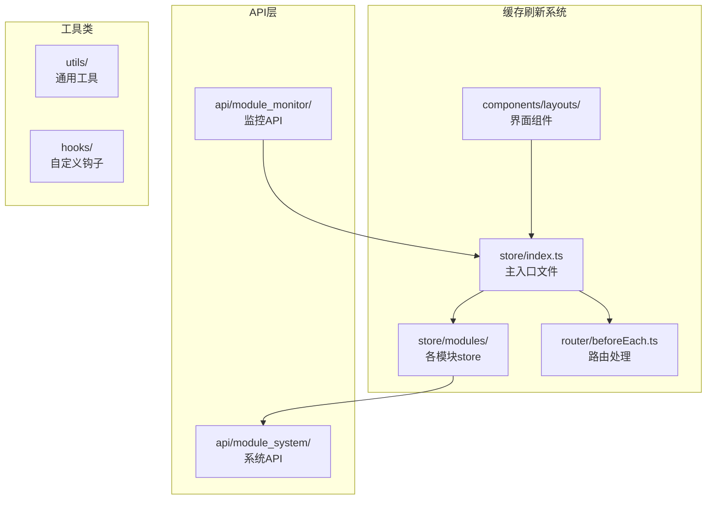
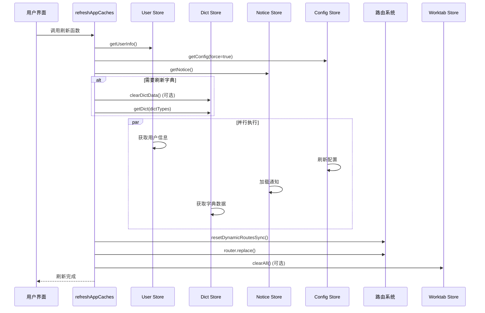
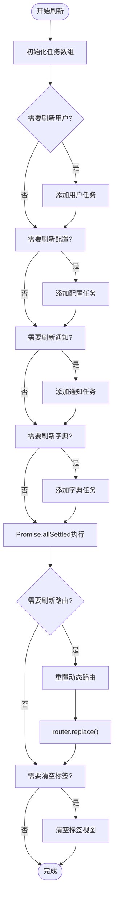
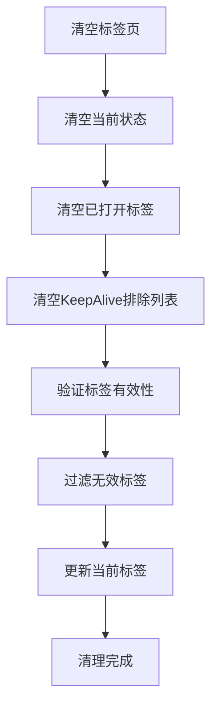
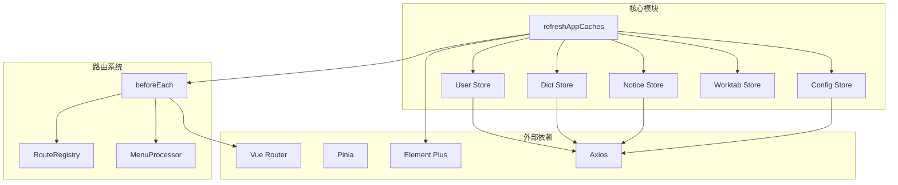

# 缓存刷新系统

<cite>
**本文档引用的文件**
- [store/index.ts](file://frontend/web/src/store/index.ts)
- [user.store.ts](file://frontend/web/src/store/modules/user.store.ts)
- [dict.store.ts](file://frontend/web/src/store/modules/dict.store.ts)
- [notice.store.ts](file://frontend/web/src/store/modules/notice.store.ts)
- [config.store.ts](file://frontend/web/src/store/modules/config.store.ts)
- [worktab.store.ts](file://frontend/web/src/store/modules/worktab.store.ts)
- [beforeEach.ts](file://frontend/web/src/router/beforeEach.ts)
- [router/index.ts](file://frontend/web/src/router/index.ts)
- [fa-work-tab/index.vue](file://frontend/web/src/components/layouts/fa-work-tab/index.vue)
- [cache.ts](file://frontend/web/src/api/module_monitor/cache.ts)
</cite>

## 目录
1. [简介](#简介)
2. [项目结构](#项目结构)
3. [核心组件](#核心组件)
4. [架构概览](#架构概览)
5. [详细组件分析](#详细组件分析)
6. [依赖关系分析](#依赖关系分析)
7. [性能考虑](#性能考虑)
8. [故障排除指南](#故障排除指南)
9. [结论](#结论)

## 简介

缓存刷新系统是FastapiAdmin前端应用中的关键功能模块，负责统一管理应用状态的刷新和同步。该系统通过`refreshAppCaches`函数提供了一键刷新机制，能够同时处理用户信息、字典数据、配置参数、通知公告等多个缓存源，并支持动态路由的重新生成和页面跳转。

该系统采用并行任务执行机制，使用`Promise.allSettled`确保即使部分任务失败也不会影响其他任务的执行，从而保证了系统的稳定性和可靠性。

## 项目结构

缓存刷新系统主要分布在以下目录和文件中：



**图表来源**
- [store/index.ts:1-89](file://frontend/web/src/store/index.ts#L1-L89)
- [router/index.ts:1-39](file://frontend/web/src/router/index.ts#L1-L39)

## 核心组件

### refreshAppCaches函数

`refreshAppCaches`是缓存刷新系统的核心入口函数，提供了灵活的配置选项来控制不同的刷新行为。

**函数签名和参数配置：**

```typescript
export async function refreshAppCaches(opts: RefreshCacheOptions = {})
```

**刷新选项配置：**

| 参数名 | 类型 | 默认值 | 描述 |
|--------|------|--------|------|
| dictTypes | string[] | - | 需要刷新的字典类型列表，为空时不刷新字典 |
| refreshUser | boolean | true | 是否刷新用户信息（含角色与权限） |
| refreshRoutes | boolean | true | 是否重置并重新生成动态路由 |
| refreshConfig | boolean | true | 是否刷新系统配置 |
| refreshNotice | boolean | true | 是否刷新通知公告 |
| clearTags | boolean | false | 是否清空标签视图（避免路由变化后出现不一致） |
| clearDictBefore | boolean | false | 刷新字典前是否先清空本地字典缓存 |

**Section sources**
- [store/index.ts:31-88](file://frontend/web/src/store/index.ts#L31-L88)

### Store模块

系统采用Pinia状态管理，包含以下核心store模块：

1. **User Store** - 用户信息和权限管理
2. **Dict Store** - 数据字典缓存
3. **Notice Store** - 系统通知管理
4. **Config Store** - 系统配置参数
5. **Worktab Store** - 多标签页状态管理

**Section sources**
- [user.store.ts:1-423](file://frontend/web/src/store/modules/user.store.ts#L1-L423)
- [dict.store.ts:1-152](file://frontend/web/src/store/modules/dict.store.ts#L1-L152)
- [notice.store.ts:1-125](file://frontend/web/src/store/modules/notice.store.ts#L1-L125)
- [config.store.ts:1-87](file://frontend/web/src/store/modules/config.store.ts#L1-L87)
- [worktab.store.ts:1-635](file://frontend/web/src/store/modules/worktab.store.ts#L1-L635)

## 架构概览

缓存刷新系统采用模块化的架构设计，通过统一的入口函数协调各个模块的刷新操作。



**图表来源**
- [store/index.ts:41-88](file://frontend/web/src/store/index.ts#L41-L88)
- [beforeEach.ts:380-389](file://frontend/web/src/router/beforeEach.ts#L380-L389)

## 详细组件分析

### 并行任务执行机制

系统使用`Promise.allSettled`实现并行任务执行，这种策略的优势在于：

1. **容错性强** - 即使部分任务失败，其他任务仍会继续执行
2. **性能优异** - 所有任务可以同时启动，充分利用网络带宽
3. **状态完整** - 确保至少部分数据得到更新



**图表来源**
- [store/index.ts:57-92](file://frontend/web/src/store/index.ts#L57-L92)

**Section sources**
- [store/index.ts:57-92](file://frontend/web/src/store/index.ts#L57-L92)

### 路由重置和页面跳转处理

路由刷新是缓存刷新系统的重要组成部分，涉及动态路由的重新生成和页面的无缝跳转。

```mermaid
sequenceDiagram
participant Cache as 缓存刷新
participant Router as 路由系统
participant Guard as 路由守卫
participant Menu as 菜单处理器
participant Registry as 路由注册器
Cache->>Router : resetDynamicRoutesSync()
Router->>Registry : unregister()
Router->>Menu : removeAllDynamicRoutes()
Cache->>Guard : resetRouterState(500)
Guard->>Guard : resetRouteInitState()
Note over Cache,Guard : 路由重置完成
Cache->>Router : router.replace({
path : current.path,
query : current.query,
hash : current.hash
})
Router->>Guard : 触发导航守卫
Guard->>Menu : 获取菜单数据
Guard->>Registry : register(menuList)
Guard->>Router : 重新导航到目标路由
```

**图表来源**
- [beforeEach.ts:380-389](file://frontend/web/src/router/beforeEach.ts#L380-L389)
- [router/index.ts:22-27](file://frontend/web/src/router/index.ts#L22-L27)

**Section sources**
- [beforeEach.ts:380-389](file://frontend/web/src/router/beforeEach.ts#L380-L389)
- [router/index.ts:22-27](file://frontend/web/src/router/index.ts#L22-L27)

### 标签页清理机制

工作标签页的清理是确保路由变化后界面一致性的重要步骤。



**图表来源**
- [worktab.store.ts:523-527](file://frontend/web/src/store/modules/worktab.store.ts#L523-L527)

**Section sources**
- [worktab.store.ts:523-527](file://frontend/web/src/store/modules/worktab.store.ts#L523-L527)

### 实际使用场景

#### 工作标签刷新功能

工作标签组件提供了便捷的缓存刷新入口：

```typescript
async function handleRefreshCache(): Promise<void> {
  try {
    await refreshAppCaches();
    useCommon().refresh();
    ElMessage.success(t("worktab.refreshCacheDone"));
  } catch (e) {
    console.error(e);
    ElMessage.error(t("worktab.refreshCacheFail"));
  }
}
```

**Section sources**
- [fa-work-tab/index.vue:659-668](file://frontend/web/src/components/layouts/fa-work-tab/index.vue#L659-L668)

#### 监控系统集成

监控模块提供了缓存相关的API接口：

```typescript
const CacheAPI = {
  getCacheInfo() { /* 获取缓存信息 */ },
  getCacheNames() { /* 获取缓存名称列表 */ },
  getCacheKeys(cacheName) { /* 获取指定缓存的键列表 */ },
  getCacheValue(cacheName, cacheKey) { /* 获取缓存值 */ },
  deleteCacheName(cacheName) { /* 删除指定缓存 */ },
  deleteCacheKey(cacheKey) { /* 删除指定键 */ },
  deleteCacheAll() { /* 删除所有缓存 */ }
};
```

**Section sources**
- [cache.ts:1-74](file://frontend/web/src/api/module_monitor/cache.ts#L1-L74)

## 依赖关系分析

缓存刷新系统各组件之间的依赖关系如下：



**图表来源**
- [store/index.ts:1-29](file://frontend/web/src/store/index.ts#L1-L29)
- [beforeEach.ts:25-40](file://frontend/web/src/router/beforeEach.ts#L25-L40)

**Section sources**
- [store/index.ts:1-29](file://frontend/web/src/store/index.ts#L1-L29)
- [beforeEach.ts:25-40](file://frontend/web/src/router/beforeEach.ts#L25-L40)

## 性能考虑

### 并行执行策略

系统采用并行执行策略来优化性能：

1. **网络请求优化** - 同时发起多个API请求，减少总等待时间
2. **内存使用优化** - 使用`Promise.allSettled`避免单点故障
3. **用户体验优化** - 快速响应用户操作，提供即时反馈

### 缓存策略

各store模块都实现了相应的缓存策略：

- **User Store** - 持久化用户信息到localStorage
- **Dict Store** - 缓存字典数据，避免重复请求
- **Notice Store** - 持久化已读状态
- **Config Store** - 缓存系统配置
- **Worktab Store** - 持久化标签页状态

### 最佳实践建议

1. **合理使用并行执行** - 对于相互独立的刷新任务使用并行
2. **错误处理** - 使用`Promise.allSettled`确保部分失败不影响整体
3. **性能监控** - 在开发环境中监控刷新耗时
4. **用户体验** - 提供刷新进度反馈和错误提示

## 故障排除指南

### 常见问题及解决方案

#### 路由刷新后页面空白

**问题描述**：刷新路由后页面显示空白或404

**可能原因**：
1. 动态路由注册失败
2. 菜单数据获取异常
3. 用户权限验证失败

**解决方案**：
1. 检查网络连接和API响应
2. 验证用户登录状态
3. 查看控制台错误日志

#### 字典数据刷新失败

**问题描述**：字典数据无法刷新或显示为空

**可能原因**：
1. 字典类型参数错误
2. API接口异常
3. 本地缓存损坏

**解决方案**：
1. 验证字典类型参数
2. 检查API接口状态
3. 清除本地字典缓存后重试

#### 标签页状态异常

**问题描述**：刷新后标签页状态不一致

**可能原因**：
1. 标签页清理逻辑异常
2. 路由跳转失败
3. KeepAlive缓存问题

**解决方案**：
1. 手动清空标签页
2. 检查路由配置
3. 重启应用

**Section sources**
- [beforeEach.ts:344-363](file://frontend/web/src/router/beforeEach.ts#L344-L363)
- [worktab.store.ts:462-518](file://frontend/web/src/store/modules/worktab.store.ts#L462-L518)

## 结论

缓存刷新系统通过`refreshAppCaches`函数提供了一套完整的应用状态管理解决方案。该系统具有以下特点：

1. **模块化设计** - 各功能模块职责清晰，易于维护和扩展
2. **并行执行** - 优化性能，提升用户体验
3. **容错机制** - 使用`Promise.allSettled`确保系统稳定性
4. **统一入口** - 通过单一函数协调多个刷新任务
5. **灵活配置** - 支持按需选择不同的刷新选项

该系统为FastapiAdmin应用提供了可靠的缓存管理能力，能够有效处理用户信息、字典数据、配置参数、通知公告等多种状态的刷新需求，确保应用状态的一致性和实时性。