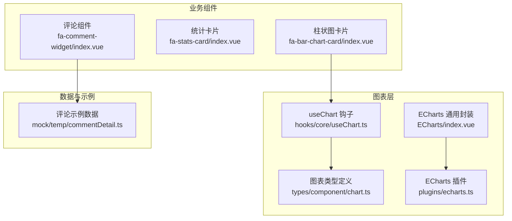
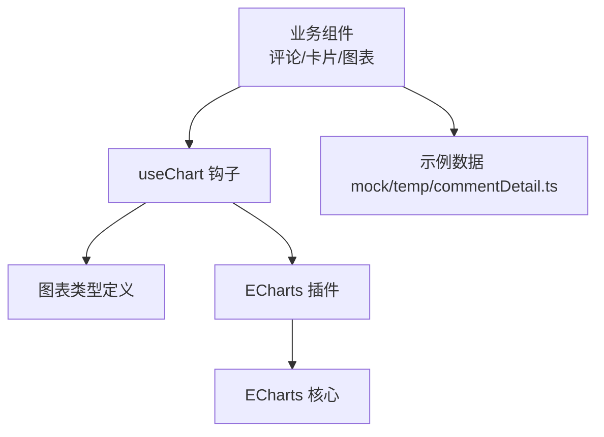
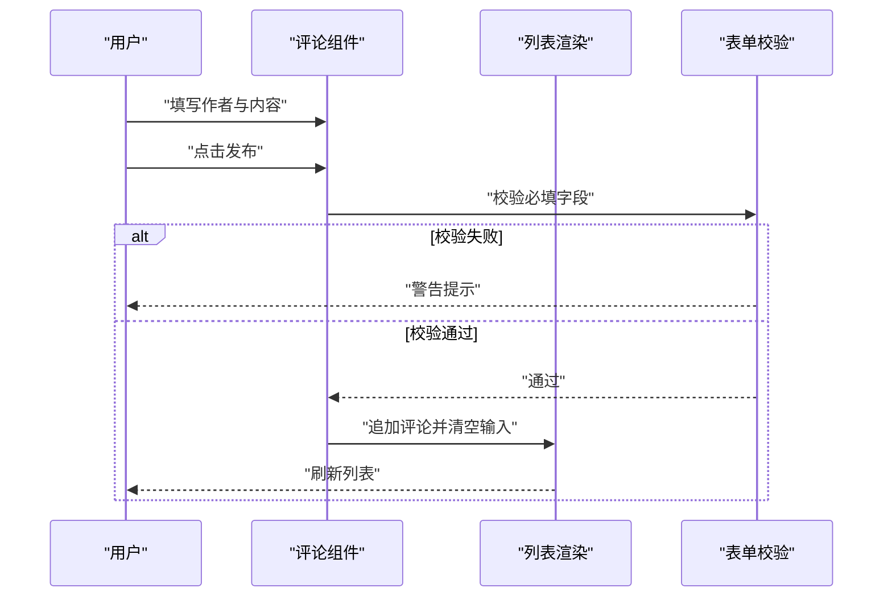
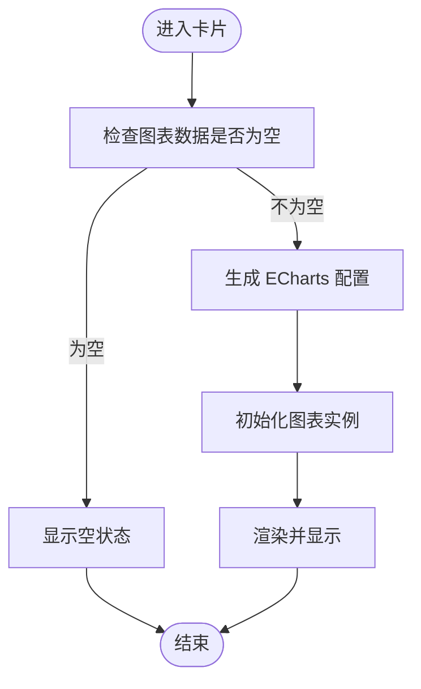
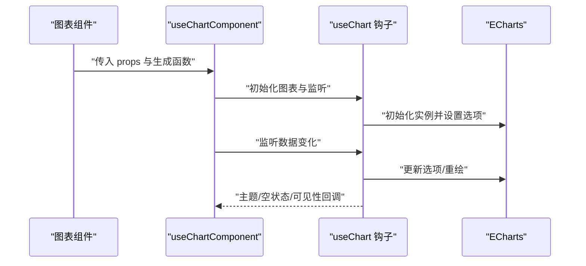
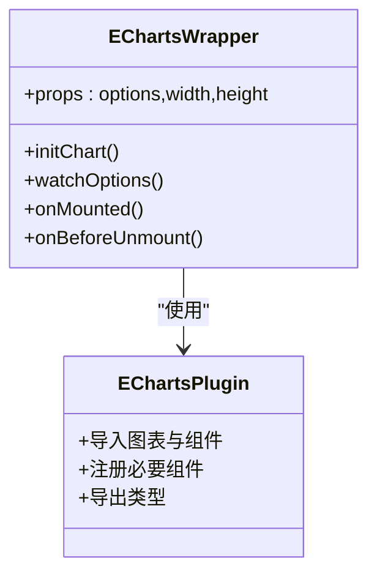
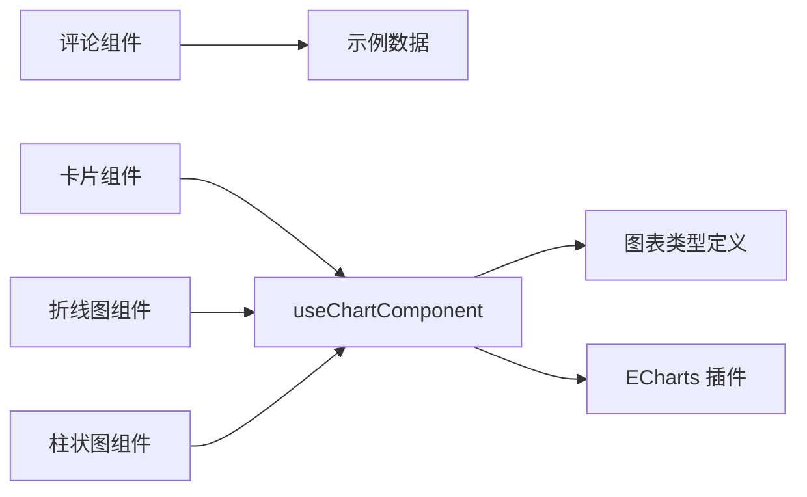

# 业务组件开发

<cite>
**本文引用的文件**
- [frontend/web/src/components/business/fa-comment-widget/index.vue](file://frontend/web/src/components/business/fa-comment-widget/index.vue)
- [frontend/web/src/mock/temp/commentDetail.ts](file://frontend/web/src/mock/temp/commentDetail.ts)
- [frontend/web/src/components/ECharts/index.vue](file://frontend/web/src/components/ECharts/index.vue)
- [frontend/web/src/components/cards/fa-stats-card/index.vue](file://frontend/web/src/components/cards/fa-stats-card/index.vue)
- [frontend/web/src/components/cards/fa-bar-chart-card/index.vue](file://frontend/web/src/components/cards/fa-bar-chart-card/index.vue)
- [frontend/web/src/components/charts/fa-line-chart/index.vue](file://frontend/web/src/components/charts/fa-line-chart/index.vue)
- [frontend/web/src/components/charts/fa-bar-chart/index.vue](file://frontend/web/src/components/charts/fa-bar-chart/index.vue)
- [frontend/web/src/hooks/core/useChart.ts](file://frontend/web/src/hooks/core/useChart.ts)
- [frontend/web/src/types/component/chart.ts](file://frontend/web/src/types/component/chart.ts)
- [frontend/web/src/plugins/echarts.ts](file://frontend/web/src/plugins/echarts.ts)
</cite>

## 目录
1. [引言](#引言)
2. [项目结构](#项目结构)
3. [核心组件](#核心组件)
4. [架构总览](#架构总览)
5. [详细组件分析](#详细组件分析)
6. [依赖关系分析](#依赖关系分析)
7. [性能考量](#性能考量)
8. [故障排查指南](#故障排查指南)
9. [结论](#结论)
10. [附录](#附录)

## 引言
本指南面向业务组件开发者，系统阐述评论组件、卡片组件集合、图表组件及特殊功能组件的开发规范。内容覆盖数据绑定、事件处理、状态管理、与业务服务的集成方式、API 调用与错误处理、可配置性设计、国际化与多主题适配、以及单元与集成测试策略与用户体验优化建议。目标是帮助团队在保持一致性的同时，提升开发效率与组件复用性。

## 项目结构
前端业务组件主要位于以下目录：
- 评论组件：business/fa-comment-widget
- 卡片组件集合：cards/*
- 图表组件集合：charts/*
- 图表通用封装：ECharts/index.vue
- 图表钩子与类型：hooks/core/useChart.ts、types/component/chart.ts
- 图表插件：plugins/echarts.ts
- 示例数据：mock/temp/commentDetail.ts

**图表来源**
- [frontend/web/src/components/business/fa-comment-widget/index.vue:1-113](file://frontend/web/src/components/business/fa-comment-widget/index.vue#L1-L113)
- [frontend/web/src/components/cards/fa-stats-card/index.vue:1-69](file://frontend/web/src/components/cards/fa-stats-card/index.vue#L1-L69)
- [frontend/web/src/components/cards/fa-bar-chart-card/index.vue:1-104](file://frontend/web/src/components/cards/fa-bar-chart-card/index.vue#L1-L104)
- [frontend/web/src/components/ECharts/index.vue:1-83](file://frontend/web/src/components/ECharts/index.vue#L1-L83)
- [frontend/web/src/hooks/core/useChart.ts:1-750](file://frontend/web/src/hooks/core/useChart.ts#L1-L750)
- [frontend/web/src/types/component/chart.ts:1-323](file://frontend/web/src/types/component/chart.ts#L1-L323)
- [frontend/web/src/plugins/echarts.ts:1-77](file://frontend/web/src/plugins/echarts.ts#L1-L77)
- [frontend/web/src/mock/temp/commentDetail.ts:1-80](file://frontend/web/src/mock/temp/commentDetail.ts#L1-L80)

**章节来源**
- [frontend/web/src/components/business/fa-comment-widget/index.vue:1-113](file://frontend/web/src/components/business/fa-comment-widget/index.vue#L1-L113)
- [frontend/web/src/components/cards/fa-stats-card/index.vue:1-69](file://frontend/web/src/components/cards/fa-stats-card/index.vue#L1-L69)
- [frontend/web/src/components/cards/fa-bar-chart-card/index.vue:1-104](file://frontend/web/src/components/cards/fa-bar-chart-card/index.vue#L1-L104)
- [frontend/web/src/components/ECharts/index.vue:1-83](file://frontend/web/src/components/ECharts/index.vue#L1-L83)
- [frontend/web/src/hooks/core/useChart.ts:1-750](file://frontend/web/src/hooks/core/useChart.ts#L1-L750)
- [frontend/web/src/types/component/chart.ts:1-323](file://frontend/web/src/types/component/chart.ts#L1-L323)
- [frontend/web/src/plugins/echarts.ts:1-77](file://frontend/web/src/plugins/echarts.ts#L1-L77)
- [frontend/web/src/mock/temp/commentDetail.ts:1-80](file://frontend/web/src/mock/temp/commentDetail.ts#L1-L80)

## 核心组件
- 评论组件：提供评论输入、列表展示、回复嵌套与交互提示。
- 卡片组件：如统计卡片、柱状图卡片等，强调可配置的外观与数据承载。
- 图表组件：折线图、柱状图等，基于 ECharts 并通过 useChart 钩子进行生命周期与主题管理。
- 图表通用封装：ECharts/index.vue 提供图表容器与按需注册能力。
- useChart 钩子：统一图表初始化、更新、销毁、主题与空状态处理。
- 图表类型定义：types/component/chart.ts 提供完整的 Props 与数据结构约束。
- 图表插件：plugins/echarts.ts 按需导入图表与组件，控制打包体积。

**章节来源**
- [frontend/web/src/components/business/fa-comment-widget/index.vue:1-113](file://frontend/web/src/components/business/fa-comment-widget/index.vue#L1-L113)
- [frontend/web/src/components/cards/fa-stats-card/index.vue:1-69](file://frontend/web/src/components/cards/fa-stats-card/index.vue#L1-L69)
- [frontend/web/src/components/cards/fa-bar-chart-card/index.vue:1-104](file://frontend/web/src/components/cards/fa-bar-chart-card/index.vue#L1-L104)
- [frontend/web/src/components/ECharts/index.vue:1-83](file://frontend/web/src/components/ECharts/index.vue#L1-L83)
- [frontend/web/src/hooks/core/useChart.ts:1-750](file://frontend/web/src/hooks/core/useChart.ts#L1-L750)
- [frontend/web/src/types/component/chart.ts:1-323](file://frontend/web/src/types/component/chart.ts#L1-L323)
- [frontend/web/src/plugins/echarts.ts:1-77](file://frontend/web/src/plugins/echarts.ts#L1-L77)

## 架构总览
业务组件开发遵循“组件-钩子-插件-类型”的分层架构：
- 组件层：负责视图与用户交互（评论、卡片、图表）。
- 钩子层：useChart 提供图表生命周期与主题管理抽象。
- 插件层：plugins/echarts.ts 按需注册 ECharts 图表与组件。
- 类型层：types/component/chart.ts 提供强类型约束与默认值。

**图表来源**
- [frontend/web/src/hooks/core/useChart.ts:1-750](file://frontend/web/src/hooks/core/useChart.ts#L1-L750)
- [frontend/web/src/types/component/chart.ts:1-323](file://frontend/web/src/types/component/chart.ts#L1-L323)
- [frontend/web/src/plugins/echarts.ts:1-77](file://frontend/web/src/plugins/echarts.ts#L1-L77)
- [frontend/web/src/components/business/fa-comment-widget/index.vue:1-113](file://frontend/web/src/components/business/fa-comment-widget/index.vue#L1-L113)
- [frontend/web/src/mock/temp/commentDetail.ts:1-80](file://frontend/web/src/mock/temp/commentDetail.ts#L1-L80)

## 详细组件分析

### 评论组件开发规范（fa-comment-widget）
- 数据绑定
  - 表单字段：作者与内容双向绑定至本地响应式对象。
  - 列表渲染：使用反转顺序展示，便于新评论在底部优先出现。
  - 嵌套回复：通过递归组件 FaCommentItem 渲染回复树。
- 事件处理
  - 发布评论：校验必填字段，成功后清空输入并提示。
  - 展开/收起回复：通过标识字段切换回复表单显示。
  - 新增回复：接收子组件事件，定位目标评论并追加回复。
- 状态管理
  - 本地状态：评论列表、新评论输入、回复表单开关。
  - 示例数据：使用 mock 数据作为初始态，便于演示与联调。
- 可配置性
  - 可扩展字段：如时间戳、头像占位等，建议通过 props 传入。
  - 国际化：占位符与提示文案建议抽取为 i18n 键。
- 错误处理
  - 输入校验：必填字段为空时提示。
  - 建议：未来接入后端 API 时，增加统一错误提示与重试机制。

**图表来源**
- [frontend/web/src/components/business/fa-comment-widget/index.vue:57-74](file://frontend/web/src/components/business/fa-comment-widget/index.vue#L57-L74)

**章节来源**
- [frontend/web/src/components/business/fa-comment-widget/index.vue:1-113](file://frontend/web/src/components/business/fa-comment-widget/index.vue#L1-L113)
- [frontend/web/src/mock/temp/commentDetail.ts:1-80](file://frontend/web/src/mock/temp/commentDetail.ts#L1-L80)

### 卡片组件开发规范（统计卡片与柱状图卡片）
- 统计卡片（fa-stats-card）
  - 外观：支持图标、标题、数值、描述、箭头与文本颜色配置。
  - 数值动画：集成数字滚动组件，支持小数位与分隔符。
  - 交互：悬停微动效，增强可用性。
- 柱状图卡片（fa-bar-chart-card）
  - 数据承载：顶部展示指标与百分比，右侧或绝对定位显示迷你柱状图。
  - 配置：高度、颜色、柱宽、是否迷你图等。
  - 图表生成：通过 useChartComponent 抽象生成 ECharts 配置，自动处理空数据与主题。

**图表来源**
- [frontend/web/src/components/cards/fa-bar-chart-card/index.vue:62-102](file://frontend/web/src/components/cards/fa-bar-chart-card/index.vue#L62-L102)
- [frontend/web/src/hooks/core/useChart.ts:645-749](file://frontend/web/src/hooks/core/useChart.ts#L645-L749)

**章节来源**
- [frontend/web/src/components/cards/fa-stats-card/index.vue:1-69](file://frontend/web/src/components/cards/fa-stats-card/index.vue#L1-L69)
- [frontend/web/src/components/cards/fa-bar-chart-card/index.vue:1-104](file://frontend/web/src/components/cards/fa-bar-chart-card/index.vue#L1-L104)
- [frontend/web/src/hooks/core/useChart.ts:645-749](file://frontend/web/src/hooks/core/useChart.ts#L645-L749)

### 图表组件开发规范（折线图与柱状图）
- 统一抽象：通过 useChartComponent 生成 ECharts 配置，自动处理空数据、主题与可见性。
- 折线图（fa-line-chart）
  - 多数据支持：支持多系列数据与区域填充，提供阶梯式动画。
  - 样式配置：统一坐标轴、分割线、提示框与图例样式生成器。
  - 性能优化：防抖 resize、定时器清理、动画阶段控制。
- 柱状图（fa-bar-chart）
  - 多数据支持：支持堆叠与不同颜色配置。
  - 渐变色：默认渐变色与圆角配置，提升视觉层次。
  - 空数据处理：自动显示“暂无数据”提示。

**图表来源**
- [frontend/web/src/components/charts/fa-line-chart/index.vue:327-350](file://frontend/web/src/components/charts/fa-line-chart/index.vue#L327-L350)
- [frontend/web/src/components/charts/fa-bar-chart/index.vue:113-202](file://frontend/web/src/components/charts/fa-bar-chart/index.vue#L113-L202)
- [frontend/web/src/hooks/core/useChart.ts:645-749](file://frontend/web/src/hooks/core/useChart.ts#L645-L749)

**章节来源**
- [frontend/web/src/components/charts/fa-line-chart/index.vue:1-371](file://frontend/web/src/components/charts/fa-line-chart/index.vue#L1-L371)
- [frontend/web/src/components/charts/fa-bar-chart/index.vue:1-204](file://frontend/web/src/components/charts/fa-bar-chart/index.vue#L1-L204)
- [frontend/web/src/hooks/core/useChart.ts:1-750](file://frontend/web/src/hooks/core/useChart.ts#L1-L750)

### 图表通用封装与插件
- ECharts 通用封装（ECharts/index.vue）
  - 按需注册：仅注册项目实际使用的图表与组件，降低打包体积。
  - 响应式：监听容器尺寸变化并自动 resize。
  - 选项更新：深度监听选项变化并更新图表。
- 图表插件（plugins/echarts.ts）
  - 按需导入：仅导入实际使用的图表与组件。
  - 类型导出：导出 EChartsOption 等类型，便于组件使用。

**图表来源**
- [frontend/web/src/components/ECharts/index.vue:1-83](file://frontend/web/src/components/ECharts/index.vue#L1-L83)
- [frontend/web/src/plugins/echarts.ts:1-77](file://frontend/web/src/plugins/echarts.ts#L1-L77)

**章节来源**
- [frontend/web/src/components/ECharts/index.vue:1-83](file://frontend/web/src/components/ECharts/index.vue#L1-L83)
- [frontend/web/src/plugins/echarts.ts:1-77](file://frontend/web/src/plugins/echarts.ts#L1-L77)

## 依赖关系分析
- 组件到钩子：卡片与图表组件均依赖 useChartComponent 进行图表生命周期管理。
- 钩子到类型：useChart 依赖 types/component/chart.ts 的 Props 与配置类型。
- 钩子到插件：useChart 通过 plugins/echarts.ts 注册 ECharts 组件。
- 评论组件到示例数据：评论组件使用 mock 数据作为初始态。

**图表来源**
- [frontend/web/src/components/business/fa-comment-widget/index.vue:1-113](file://frontend/web/src/components/business/fa-comment-widget/index.vue#L1-L113)
- [frontend/web/src/mock/temp/commentDetail.ts:1-80](file://frontend/web/src/mock/temp/commentDetail.ts#L1-L80)
- [frontend/web/src/components/cards/fa-bar-chart-card/index.vue:1-104](file://frontend/web/src/components/cards/fa-bar-chart-card/index.vue#L1-L104)
- [frontend/web/src/components/charts/fa-line-chart/index.vue:1-371](file://frontend/web/src/components/charts/fa-line-chart/index.vue#L1-L371)
- [frontend/web/src/components/charts/fa-bar-chart/index.vue:1-204](file://frontend/web/src/components/charts/fa-bar-chart/index.vue#L1-L204)
- [frontend/web/src/hooks/core/useChart.ts:1-750](file://frontend/web/src/hooks/core/useChart.ts#L1-L750)
- [frontend/web/src/types/component/chart.ts:1-323](file://frontend/web/src/types/component/chart.ts#L1-L323)
- [frontend/web/src/plugins/echarts.ts:1-77](file://frontend/web/src/plugins/echarts.ts#L1-L77)

**章节来源**
- [frontend/web/src/hooks/core/useChart.ts:1-750](file://frontend/web/src/hooks/core/useChart.ts#L1-L750)
- [frontend/web/src/types/component/chart.ts:1-323](file://frontend/web/src/types/component/chart.ts#L1-L323)
- [frontend/web/src/plugins/echarts.ts:1-77](file://frontend/web/src/plugins/echarts.ts#L1-L77)

## 性能考量
- 图表性能
  - 防抖与节流：窗口 resize 使用防抖，减少频繁重绘。
  - requestAnimationFrame：在主题切换与可见性变化时优化更新时机。
  - 空数据快速路径：直接显示空状态，避免初始化与渲染。
  - 深度监听优化：对复杂配置采用深拷贝与缓存策略。
- 组件性能
  - 列表渲染：使用反转渲染与局部更新，减少不必要的重排。
  - 动画控制：折线图的动画阶段与定时器管理，避免内存泄漏。
- 打包体积
  - 按需导入：仅注册实际使用的图表与组件，降低首屏体积。

**章节来源**
- [frontend/web/src/hooks/core/useChart.ts:100-143](file://frontend/web/src/hooks/core/useChart.ts#L100-L143)
- [frontend/web/src/hooks/core/useChart.ts:167-186](file://frontend/web/src/hooks/core/useChart.ts#L167-L186)
- [frontend/web/src/hooks/core/useChart.ts:213-218](file://frontend/web/src/hooks/core/useChart.ts#L213-L218)
- [frontend/web/src/components/charts/fa-line-chart/index.vue:264-305](file://frontend/web/src/components/charts/fa-line-chart/index.vue#L264-L305)
- [frontend/web/src/plugins/echarts.ts:1-77](file://frontend/web/src/plugins/echarts.ts#L1-L77)

## 故障排查指南
- 图表未显示
  - 检查容器可见性与尺寸：useChart 通过 IntersectionObserver 与 resize 监听处理。
  - 空数据：确认 isEmpty 与 checkEmpty 返回值，确保空状态正确显示。
- 主题切换异常
  - useChart 主题监听会触发更新，检查 isDark 状态与样式缓存。
- 动画问题
  - 折线图动画定时器需在卸载时清理，避免内存泄漏。
- 评论组件
  - 输入校验失败时需提示；发布后清空输入并刷新列表。

**章节来源**
- [frontend/web/src/hooks/core/useChart.ts:387-432](file://frontend/web/src/hooks/core/useChart.ts#L387-L432)
- [frontend/web/src/hooks/core/useChart.ts:502-536](file://frontend/web/src/hooks/core/useChart.ts#L502-L536)
- [frontend/web/src/hooks/core/useChart.ts:565-587](file://frontend/web/src/hooks/core/useChart.ts#L565-L587)
- [frontend/web/src/components/charts/fa-line-chart/index.vue:264-305](file://frontend/web/src/components/charts/fa-line-chart/index.vue#L264-L305)
- [frontend/web/src/components/business/fa-comment-widget/index.vue:57-74](file://frontend/web/src/components/business/fa-comment-widget/index.vue#L57-L74)

## 结论
本规范总结了评论、卡片与图表组件的开发模式与最佳实践，强调通过 useChart 钩子与类型定义实现一致的生命周期管理与配置约束，并通过按需导入与空状态处理保障性能与体验。建议在后续迭代中完善与业务服务的集成、国际化与多主题适配，以及补充单元与集成测试策略。

## 附录
- 可配置性设计要点
  - Props 默认值与类型约束：参考 types/component/chart.ts。
  - 主题与样式：通过 useChartOps 与样式生成器统一管理。
  - 外观与行为：卡片组件通过 props 控制图标、颜色、动画等。
- 国际化与多主题适配
  - 国际化：将文案抽取为 i18n 键，统一在组件内读取。
  - 多主题：useChart 主题监听自动适配深浅色。
- 测试策略
  - 单元测试：针对数据处理与配置生成函数（如动画、样式生成）编写断言。
  - 集成测试：验证组件在真实 DOM 中的渲染与交互（图表可见性、空状态、主题切换）。
  - 用户体验：关注首次渲染性能、动画流畅度与无障碍访问。