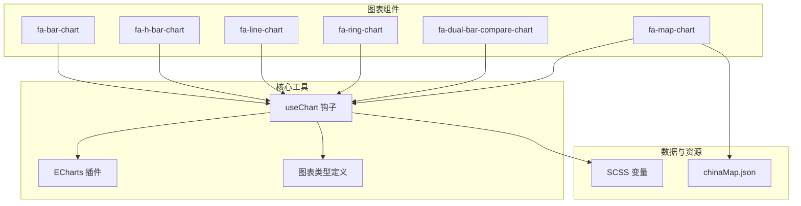
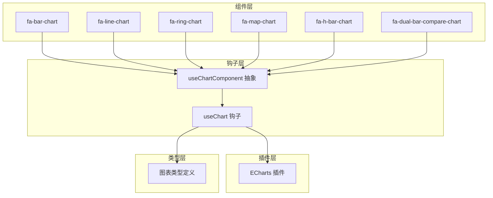
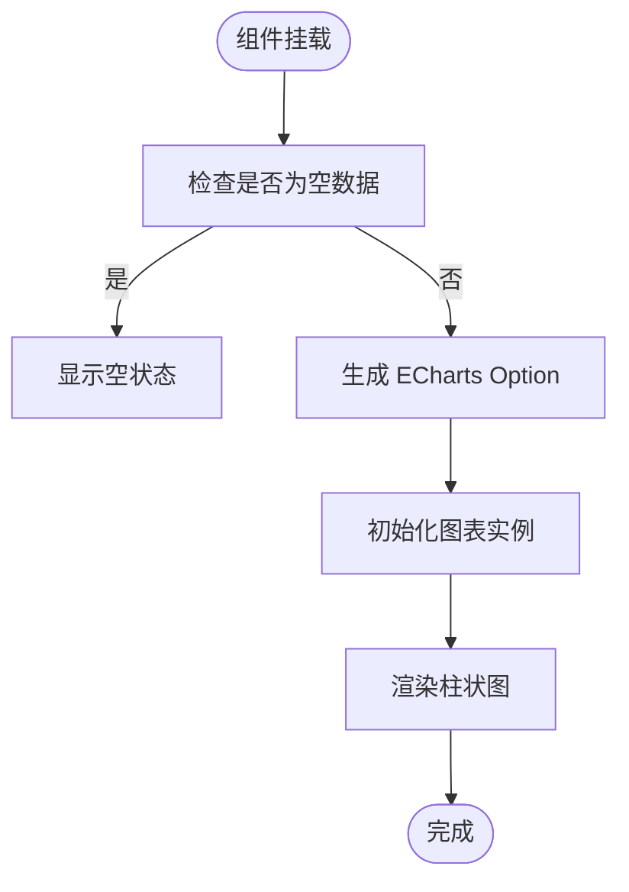
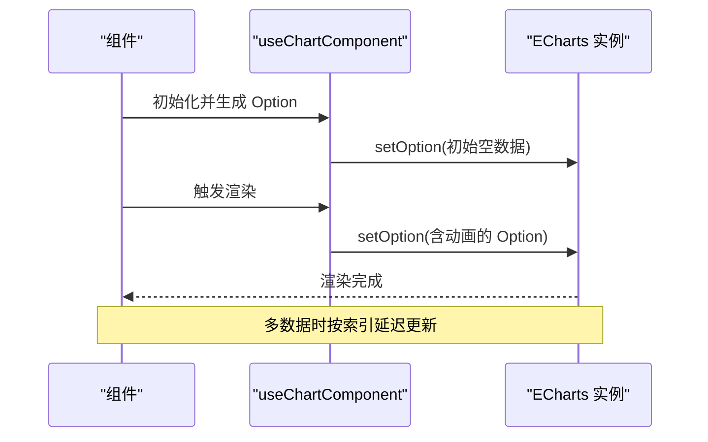
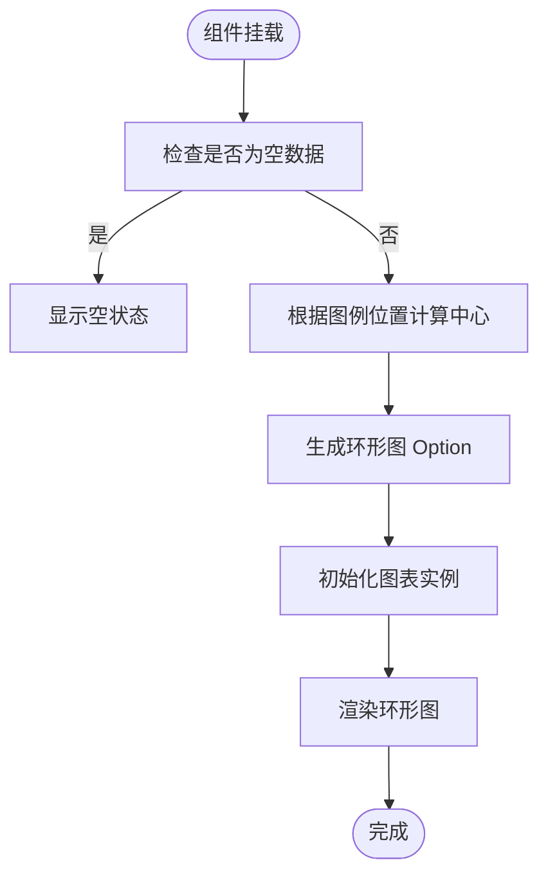
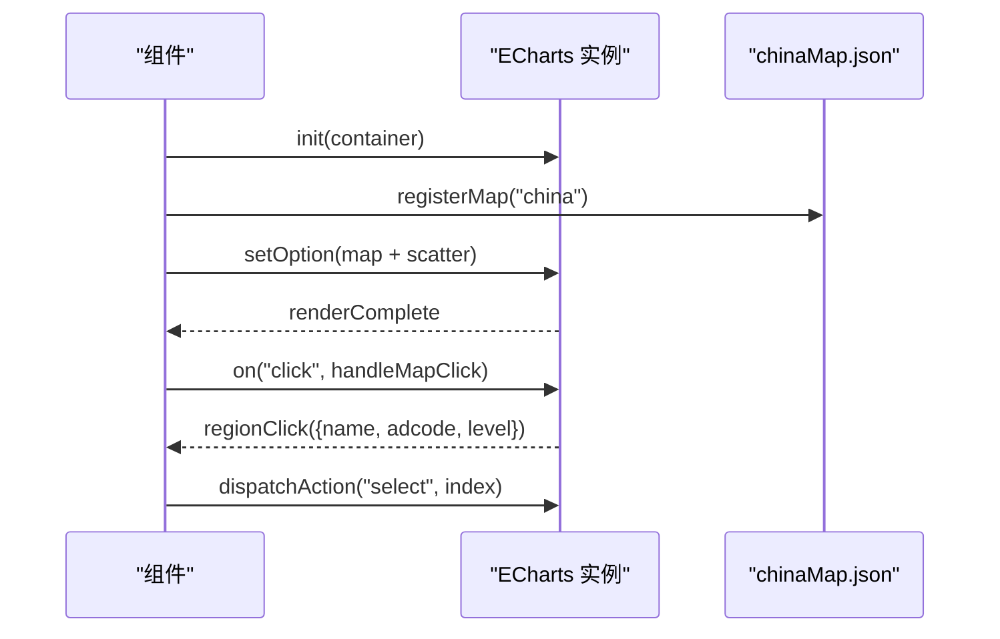
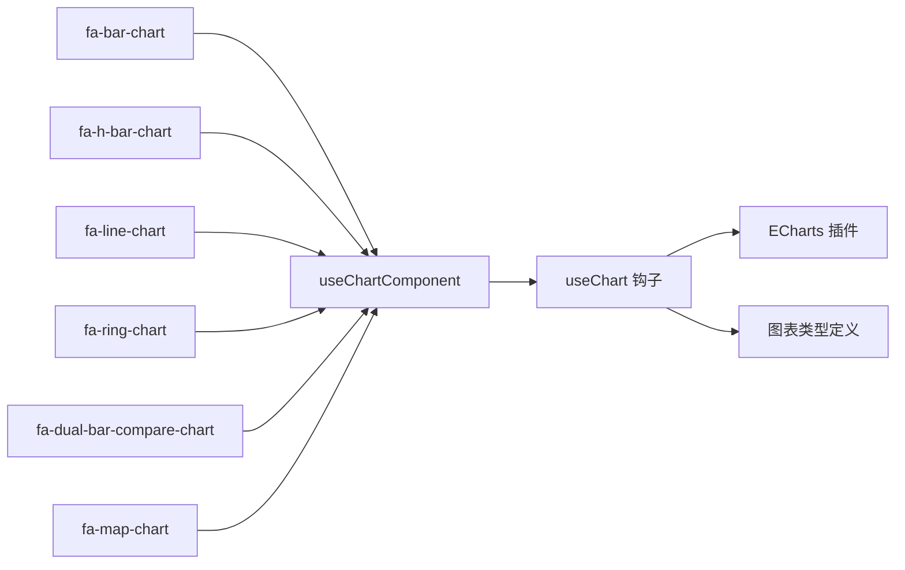

# 图表组件开发

<cite>
**本文档引用的文件**
- [frontend/web/src/components/charts/fa-bar-chart/index.vue](file://frontend/web/src/components/charts/fa-bar-chart/index.vue)
- [frontend/web/src/components/charts/fa-line-chart/index.vue](file://frontend/web/src/components/charts/fa-line-chart/index.vue)
- [frontend/web/src/components/charts/fa-ring-chart/index.vue](file://frontend/web/src/components/charts/fa-ring-chart/index.vue)
- [frontend/web/src/components/charts/fa-map-chart/index.vue](file://frontend/web/src/components/charts/fa-map-chart/index.vue)
- [frontend/web/src/components/charts/fa-h-bar-chart/index.vue](file://frontend/web/src/components/charts/fa-h-bar-chart/index.vue)
- [frontend/web/src/components/charts/fa-dual-bar-compare-chart/index.vue](file://frontend/web/src/components/charts/fa-dual-bar-compare-chart/index.vue)
- [frontend/web/src/hooks/core/useChart.ts](file://frontend/web/src/hooks/core/useChart.ts)
- [frontend/web/src/plugins/echarts.ts](file://frontend/web/src/plugins/echarts.ts)
- [frontend/web/src/types/component/chart.ts](file://frontend/web/src/types/component/chart.ts)
- [frontend/web/src/mock/json/chinaMap.json](file://frontend/web/src/mock/json/chinaMap.json)
- [frontend/web/src/styles/variables.scss](file://frontend/web/src/styles/variables.scss)
- [frontend/web/src/utils/index.ts](file://frontend/web/src/utils/index.ts)
</cite>

## 目录
1. [简介](#简介)
2. [项目结构](#项目结构)
3. [核心组件](#核心组件)
4. [架构总览](#架构总览)
5. [详细组件分析](#详细组件分析)
6. [依赖关系分析](#依赖关系分析)
7. [性能考虑](#性能考虑)
8. [故障排查指南](#故障排查指南)
9. [结论](#结论)
10. [附录](#附录)

## 简介
本指南面向前端开发者，系统阐述基于 ECharts 的图表组件开发规范，覆盖柱状图（fa-bar-chart）、折线图（fa-line-chart）、环形图（fa-ring-chart）、水平柱状图（fa-h-bar-chart）、双向堆叠柱状图（fa-dual-bar-compare-chart）以及地图图表（fa-map-chart）。内容涵盖数据格式、配置参数、渲染优化、交互与动画、响应式适配、主题定制、数据更新与事件处理，以及性能优化、内存管理与浏览器兼容性建议。

## 项目结构
图表组件位于前端工程的组件目录下，采用“按功能分组件”的组织方式；图表配置与工具集中在 hooks、plugins、types 等模块，形成清晰的职责边界。

**图表来源**
- [frontend/web/src/components/charts/fa-bar-chart/index.vue:1-204](file://frontend/web/src/components/charts/fa-bar-chart/index.vue#L1-L204)
- [frontend/web/src/components/charts/fa-h-bar-chart/index.vue:1-209](file://frontend/web/src/components/charts/fa-h-bar-chart/index.vue#L1-L209)
- [frontend/web/src/components/charts/fa-line-chart/index.vue:1-371](file://frontend/web/src/components/charts/fa-line-chart/index.vue#L1-L371)
- [frontend/web/src/components/charts/fa-ring-chart/index.vue:1-134](file://frontend/web/src/components/charts/fa-ring-chart/index.vue#L1-L134)
- [frontend/web/src/components/charts/fa-dual-bar-compare-chart/index.vue:1-194](file://frontend/web/src/components/charts/fa-dual-bar-compare-chart/index.vue#L1-L194)
- [frontend/web/src/components/charts/fa-map-chart/index.vue:1-298](file://frontend/web/src/components/charts/fa-map-chart/index.vue#L1-L298)
- [frontend/web/src/hooks/core/useChart.ts:1-750](file://frontend/web/src/hooks/core/useChart.ts#L1-L750)
- [frontend/web/src/plugins/echarts.ts:1-77](file://frontend/web/src/plugins/echarts.ts#L1-L77)
- [frontend/web/src/types/component/chart.ts:1-323](file://frontend/web/src/types/component/chart.ts#L1-L323)
- [frontend/web/src/mock/json/chinaMap.json](file://frontend/web/src/mock/json/chinaMap.json)
- [frontend/web/src/styles/variables.scss:1-9](file://frontend/web/src/styles/variables.scss#L1-L9)

**章节来源**
- [frontend/web/src/components/charts/fa-bar-chart/index.vue:1-204](file://frontend/web/src/components/charts/fa-bar-chart/index.vue#L1-L204)
- [frontend/web/src/components/charts/fa-line-chart/index.vue:1-371](file://frontend/web/src/components/charts/fa-line-chart/index.vue#L1-L371)
- [frontend/web/src/components/charts/fa-ring-chart/index.vue:1-134](file://frontend/web/src/components/charts/fa-ring-chart/index.vue#L1-L134)
- [frontend/web/src/components/charts/fa-map-chart/index.vue:1-298](file://frontend/web/src/components/charts/fa-map-chart/index.vue#L1-L298)
- [frontend/web/src/hooks/core/useChart.ts:1-750](file://frontend/web/src/hooks/core/useChart.ts#L1-L750)
- [frontend/web/src/plugins/echarts.ts:1-77](file://frontend/web/src/plugins/echarts.ts#L1-L77)
- [frontend/web/src/types/component/chart.ts:1-323](file://frontend/web/src/types/component/chart.ts#L1-L323)

## 核心组件
- useChart 钩子：提供图表生命周期管理、主题适配、响应式调整、空状态处理、样式配置统一、性能优化（防抖、缓存、rAF）等能力，并通过 useChartComponent 抽象出“组件级图表”封装。
- ECharts 插件：按需注册图表类型与组件，控制打包体积，保证运行时性能。
- 类型定义：统一图表 Props、数据项、交互配置、事件回调等类型，确保组件间一致性与可维护性。

关键特性
- 主题自动适配：监听暗黑/明亮主题变化，自动更新图表样式与配色。
- 响应式调整：窗口 resize、菜单展开/收起、布局变化时，使用 requestAnimationFrame 与防抖优化。
- 空状态处理：容器不可见或数据为空时，优雅显示“暂无数据”提示。
- 统一样式生成：坐标轴线、分割线、标签、提示框、图例、网格等样式统一生成与缓存。
- 动画配置：提供统一的动画延迟、时长与缓动配置，支持阶梯式动画（折线图）。

**章节来源**
- [frontend/web/src/hooks/core/useChart.ts:58-78](file://frontend/web/src/hooks/core/useChart.ts#L58-L78)
- [frontend/web/src/hooks/core/useChart.ts:193-385](file://frontend/web/src/hooks/core/useChart.ts#L193-L385)
- [frontend/web/src/hooks/core/useChart.ts:629-749](file://frontend/web/src/hooks/core/useChart.ts#L629-L749)
- [frontend/web/src/plugins/echarts.ts:11-77](file://frontend/web/src/plugins/echarts.ts#L11-L77)
- [frontend/web/src/types/component/chart.ts:45-100](file://frontend/web/src/types/component/chart.ts#L45-L100)

## 架构总览
图表组件开发遵循“组件层 + 钩子层 + 插件层 + 类型层”的分层架构。组件层负责具体图表的配置与渲染；钩子层提供跨组件的通用能力；插件层负责 ECharts 的按需注册；类型层提供强类型约束。

**图表来源**
- [frontend/web/src/components/charts/fa-bar-chart/index.vue:114-202](file://frontend/web/src/components/charts/fa-bar-chart/index.vue#L114-L202)
- [frontend/web/src/components/charts/fa-line-chart/index.vue:328-350](file://frontend/web/src/components/charts/fa-line-chart/index.vue#L328-L350)
- [frontend/web/src/components/charts/fa-ring-chart/index.vue:38-132](file://frontend/web/src/components/charts/fa-ring-chart/index.vue#L38-L132)
- [frontend/web/src/components/charts/fa-map-chart/index.vue:200-216](file://frontend/web/src/components/charts/fa-map-chart/index.vue#L200-L216)
- [frontend/web/src/hooks/core/useChart.ts:629-749](file://frontend/web/src/hooks/core/useChart.ts#L629-L749)
- [frontend/web/src/plugins/echarts.ts:11-77](file://frontend/web/src/plugins/echarts.ts#L11-L77)
- [frontend/web/src/types/component/chart.ts:1-323](file://frontend/web/src/types/component/chart.ts#L1-L323)

## 详细组件分析

### 柱状图（fa-bar-chart）
- 数据格式
  - 单组数据：数值数组。
  - 多组数据：数组项包含 name、data、barWidth、stack 等字段。
- 关键配置
  - 基础：height、loading、isEmpty、colors、borderRadius。
  - 数据：data、xAxisData、barWidth、stack。
  - 轴线：showAxisLabel、showAxisLine、showSplitLine。
  - 交互：showTooltip、showLegend、legendPosition。
- 渲染与动画
  - 使用 useChartComponent 抽象，统一生成 ECharts Option。
  - 支持渐变色柱子与圆角配置。
  - 通过 getAnimationConfig 应用统一动画。
- 交互与事件
  - 通过 getTooltipStyle、getLegendStyle 统一交互样式。
  - 支持图例位置动态计算与网格自适应。
- 主题与样式
  - 通过 getCssVar 从 CSS 变量获取主题色，实现明暗主题适配。
- 性能优化
  - 多数据时按组应用颜色与圆角，避免重复计算。
  - 空数据时直接显示空状态，不初始化图表实例。

**图表来源**
- [frontend/web/src/components/charts/fa-bar-chart/index.vue:114-202](file://frontend/web/src/components/charts/fa-bar-chart/index.vue#L114-L202)
- [frontend/web/src/hooks/core/useChart.ts:269-286](file://frontend/web/src/hooks/core/useChart.ts#L269-L286)
- [frontend/web/src/hooks/core/useChart.ts:342-385](file://frontend/web/src/hooks/core/useChart.ts#L342-L385)

**章节来源**
- [frontend/web/src/components/charts/fa-bar-chart/index.vue:14-47](file://frontend/web/src/components/charts/fa-bar-chart/index.vue#L14-L47)
- [frontend/web/src/components/charts/fa-bar-chart/index.vue:92-111](file://frontend/web/src/components/charts/fa-bar-chart/index.vue#L92-L111)
- [frontend/web/src/components/charts/fa-bar-chart/index.vue:144-201](file://frontend/web/src/components/charts/fa-bar-chart/index.vue#L144-L201)
- [frontend/web/src/types/component/chart.ts:102-126](file://frontend/web/src/types/component/chart.ts#L102-L126)

### 折线图（fa-line-chart）
- 数据格式
  - 单组数据：数值数组。
  - 多组数据：数组项包含 name、data、smooth、symbol、lineWidth、areaStyle 等。
- 关键配置
  - 基础：height、loading、isEmpty、colors。
  - 数据：data、xAxisData、lineWidth、showAreaColor、smooth、symbol、symbolSize、animationDelay。
  - 轴线：showAxisLabel、showAxisLine、showSplitLine。
  - 交互：showTooltip、showLegend、legendPosition。
- 渲染与动画
  - 支持阶梯式动画：多数据时按索引延迟更新，形成逐条序列出现的效果。
  - 单数据时使用 nextTick 完成平滑过渡。
  - 使用 getAnimationConfig 控制动画时序与缓动。
- 交互与事件
  - 通过 getTooltipStyle、getLegendStyle 统一交互样式。
  - 支持区域填充（areaStyle），可自定义渐变透明度。
- 主题与样式
  - 主题色通过 getCssVar 获取，支持明暗主题切换。
- 性能优化
  - 使用 computed 缓存最大值，避免重复计算。
  - 使用 watchDebounced 与防抖处理频繁更新。
  - 动画定时器集中管理，销毁时统一清理。

**图表来源**
- [frontend/web/src/components/charts/fa-line-chart/index.vue:328-350](file://frontend/web/src/components/charts/fa-line-chart/index.vue#L328-L350)
- [frontend/web/src/components/charts/fa-line-chart/index.vue:264-305](file://frontend/web/src/components/charts/fa-line-chart/index.vue#L264-L305)
- [frontend/web/src/hooks/core/useChart.ts:269-286](file://frontend/web/src/hooks/core/useChart.ts#L269-L286)

**章节来源**
- [frontend/web/src/components/charts/fa-line-chart/index.vue:19-66](file://frontend/web/src/components/charts/fa-line-chart/index.vue#L19-L66)
- [frontend/web/src/components/charts/fa-line-chart/index.vue:189-257](file://frontend/web/src/components/charts/fa-line-chart/index.vue#L189-L257)
- [frontend/web/src/components/charts/fa-line-chart/index.vue:352-370](file://frontend/web/src/components/charts/fa-line-chart/index.vue#L352-L370)
- [frontend/web/src/types/component/chart.ts:128-173](file://frontend/web/src/types/component/chart.ts#L128-L173)

### 环形图（fa-ring-chart）
- 数据格式
  - 数组项包含 value、name。
- 关键配置
  - 基础：height、loading、isEmpty、colors。
  - 数据：data、radius、borderRadius、centerText、showLabel。
  - 交互：showTooltip、showLegend、legendPosition。
- 渲染与动画
  - 使用 pie 系列，支持 expansion 动画类型。
  - 根据图例位置动态计算中心位置，避免遮挡。
- 交互与事件
  - 通过 getTooltipStyle、getLegendStyle 统一交互样式。
  - 支持中心标题（centerText）显示。
- 主题与样式
  - 根据 isDark 切换标签颜色与标题颜色。
- 性能优化
  - 空数据时直接显示空状态，不初始化图表实例。

**图表来源**
- [frontend/web/src/components/charts/fa-ring-chart/index.vue:38-132](file://frontend/web/src/components/charts/fa-ring-chart/index.vue#L38-L132)
- [frontend/web/src/hooks/core/useChart.ts:288-340](file://frontend/web/src/hooks/core/useChart.ts#L288-L340)

**章节来源**
- [frontend/web/src/components/charts/fa-ring-chart/index.vue:18-36](file://frontend/web/src/components/charts/fa-ring-chart/index.vue#L18-L36)
- [frontend/web/src/components/charts/fa-ring-chart/index.vue:46-130](file://frontend/web/src/components/charts/fa-ring-chart/index.vue#L46-L130)
- [frontend/web/src/types/component/chart.ts:191-211](file://frontend/web/src/types/component/chart.ts#L191-L211)

### 地图图表（fa-map-chart）
- 数据格式
  - mapData：地图数据数组，包含 name、adcode、level 等字段。
  - 若未提供数据，将从 chinaMap.json 生成默认数据。
- 关键配置
  - 基础：height（固定）、loading、isEmpty。
  - 交互：showLabels、showScatter。
- 渲染与动画
  - 关闭动画以减少高亮时掉帧。
  - 注册中国地图 geoJson，构造 map 与 scatter 两个 series。
- 交互与事件
  - 支持 click 事件，返回区域信息并高亮选中区域。
  - 提供 renderComplete、regionClick 事件。
- 主题与样式
  - 根据 isDark 切换边框、阴影、标签与背景色。
- 性能优化
  - resize 时使用 chart.resize 并延时触发，避免频繁重排。
  - 主题切换时销毁并重建实例，确保样式一致。
  - 监听数据变化，动态 setOption。

**图表来源**
- [frontend/web/src/components/charts/fa-map-chart/index.vue:200-216](file://frontend/web/src/components/charts/fa-map-chart/index.vue#L200-L216)
- [frontend/web/src/components/charts/fa-map-chart/index.vue:218-237](file://frontend/web/src/components/charts/fa-map-chart/index.vue#L218-L237)
- [frontend/web/src/components/charts/fa-map-chart/index.vue:239-258](file://frontend/web/src/components/charts/fa-map-chart/index.vue#L239-L258)

**章节来源**
- [frontend/web/src/components/charts/fa-map-chart/index.vue:28-45](file://frontend/web/src/components/charts/fa-map-chart/index.vue#L28-L45)
- [frontend/web/src/components/charts/fa-map-chart/index.vue:66-198](file://frontend/web/src/components/charts/fa-map-chart/index.vue#L66-L198)
- [frontend/web/src/components/charts/fa-map-chart/index.vue:260-296](file://frontend/web/src/components/charts/fa-map-chart/index.vue#L260-L296)
- [frontend/web/src/mock/json/chinaMap.json](file://frontend/web/src/mock/json/chinaMap.json)

### 水平柱状图（fa-h-bar-chart）
- 数据格式
  - 与柱状图相同，但 Y 轴为类别轴，X 轴为数值轴。
- 关键配置
  - 基础：height、loading、isEmpty、colors。
  - 数据：data、xAxisData、barWidth、stack。
  - 轴线：showAxisLabel、showAxisLine、showSplitLine。
  - 交互：showTooltip、showLegend、legendPosition。
- 渲染与动画
  - 使用 useChartComponent 抽象，统一生成 ECharts Option。
  - 支持渐变色柱子与圆角配置。
- 主题与样式
  - 通过 getCssVar 从 CSS 变量获取主题色，实现明暗主题适配。

**章节来源**
- [frontend/web/src/components/charts/fa-h-bar-chart/index.vue:19-51](file://frontend/web/src/components/charts/fa-h-bar-chart/index.vue#L19-L51)
- [frontend/web/src/components/charts/fa-h-bar-chart/index.vue:148-206](file://frontend/web/src/components/charts/fa-h-bar-chart/index.vue#L148-L206)

### 双向堆叠柱状图（fa-dual-bar-compare-chart）
- 数据格式
  - positiveData：正向数据数组。
  - negativeData：负向数据数组（内部会转为负值）。
  - xAxisData：X 轴标签。
- 关键配置
  - 基础：height、loading、isEmpty、colors。
  - 数据：positiveData、negativeData、xAxisData、positiveName、negativeName、barWidth。
  - 样式：showDataLabel、positiveBorderRadius、negativeBorderRadius。
  - 轴线：showAxisLabel、showAxisLine、showSplitLine。
  - 交互：showTooltip、showLegend、legendPosition。
- 渲染与动画
  - 使用堆叠与 barGap:"-100%" 实现正负数据对齐。
  - 通过 getAnimationConfig 应用统一动画。
- 主题与样式
  - 通过 useChartOps 获取字体颜色等基础样式。

**章节来源**
- [frontend/web/src/components/charts/fa-dual-bar-compare-chart/index.vue:13-44](file://frontend/web/src/components/charts/fa-dual-bar-compare-chart/index.vue#L13-L44)
- [frontend/web/src/components/charts/fa-dual-bar-compare-chart/index.vue:109-191](file://frontend/web/src/components/charts/fa-dual-bar-compare-chart/index.vue#L109-L191)

## 依赖关系分析
图表组件与工具层的耦合度低，通过 useChartComponent 抽象实现松耦合；ECharts 插件按需注册，避免全量引入导致的体积膨胀。

**图表来源**
- [frontend/web/src/components/charts/fa-bar-chart/index.vue:114-202](file://frontend/web/src/components/charts/fa-bar-chart/index.vue#L114-L202)
- [frontend/web/src/components/charts/fa-line-chart/index.vue:328-350](file://frontend/web/src/components/charts/fa-line-chart/index.vue#L328-L350)
- [frontend/web/src/components/charts/fa-ring-chart/index.vue:38-132](file://frontend/web/src/components/charts/fa-ring-chart/index.vue#L38-L132)
- [frontend/web/src/components/charts/fa-map-chart/index.vue:200-216](file://frontend/web/src/components/charts/fa-map-chart/index.vue#L200-L216)
- [frontend/web/src/components/charts/fa-h-bar-chart/index.vue:117-207](file://frontend/web/src/components/charts/fa-h-bar-chart/index.vue#L117-L207)
- [frontend/web/src/components/charts/fa-dual-bar-compare-chart/index.vue:82-192](file://frontend/web/src/components/charts/fa-dual-bar-compare-chart/index.vue#L82-L192)
- [frontend/web/src/hooks/core/useChart.ts:629-749](file://frontend/web/src/hooks/core/useChart.ts#L629-L749)
- [frontend/web/src/plugins/echarts.ts:11-77](file://frontend/web/src/plugins/echarts.ts#L11-L77)
- [frontend/web/src/types/component/chart.ts:1-323](file://frontend/web/src/types/component/chart.ts#L1-L323)

**章节来源**
- [frontend/web/src/hooks/core/useChart.ts:629-749](file://frontend/web/src/hooks/core/useChart.ts#L629-L749)
- [frontend/web/src/plugins/echarts.ts:11-77](file://frontend/web/src/plugins/echarts.ts#L11-L77)
- [frontend/web/src/types/component/chart.ts:1-323](file://frontend/web/src/types/component/chart.ts#L1-L323)

## 性能考虑
- 按需引入与注册
  - ECharts 按需导入图表类型与组件，减少打包体积与运行时开销。
- 响应式与防抖
  - resize 使用防抖与 requestAnimationFrame，菜单展开/收起采用多延迟策略，确保布局稳定。
- 样式缓存
  - 坐标轴线、分割线、标签样式进行缓存，主题切换时仅更新必要部分。
- 动画优化
  - 统一动画配置，折线图采用阶梯式动画，避免同时大量元素动画造成卡顿。
- 空状态与懒加载
  - 容器不可见时延迟初始化，空数据时显示空状态，避免无效渲染。
- 内存管理
  - 组件销毁时统一清理定时器、观察者、事件监听与图表实例，防止内存泄漏。
- 浏览器兼容性
  - 依赖现代浏览器 API（如 IntersectionObserver、requestAnimationFrame），在旧环境需提供 polyfill。

**章节来源**
- [frontend/web/src/plugins/echarts.ts:11-77](file://frontend/web/src/plugins/echarts.ts#L11-L77)
- [frontend/web/src/hooks/core/useChart.ts:123-143](file://frontend/web/src/hooks/core/useChart.ts#L123-L143)
- [frontend/web/src/hooks/core/useChart.ts:200-218](file://frontend/web/src/hooks/core/useChart.ts#L200-L218)
- [frontend/web/src/hooks/core/useChart.ts:565-587](file://frontend/web/src/hooks/core/useChart.ts#L565-L587)

## 故障排查指南
- 图表不显示或空白
  - 检查 isEmpty 与数据长度，确认未触发空状态。
  - 确认容器可见性，useChart 在容器不可见时会延迟初始化。
- 主题切换样式异常
  - 确认 isDark 响应正常，useChart 会在主题变化时重新 setOption。
- 地图点击无响应
  - 检查事件绑定与参数结构，确保 click 回调正确处理 componentType 与 dataIndex。
- 动画卡顿
  - 减少 series 数量与数据点数量，或关闭不必要的动画。
- 内存泄漏
  - 确保组件卸载时调用 destroyChart，清理定时器与观察者。

**章节来源**
- [frontend/web/src/hooks/core/useChart.ts:502-536](file://frontend/web/src/hooks/core/useChart.ts#L502-L536)
- [frontend/web/src/hooks/core/useChart.ts:565-587](file://frontend/web/src/hooks/core/useChart.ts#L565-L587)
- [frontend/web/src/components/charts/fa-map-chart/index.vue:218-237](file://frontend/web/src/components/charts/fa-map-chart/index.vue#L218-L237)

## 结论
本规范通过 useChart 钩子与 useChartComponent 抽象，实现了图表组件的标准化开发模式：统一的生命周期管理、主题适配、响应式调整、样式生成与动画配置。结合 ECharts 的按需注册与性能优化策略，可在保证开发效率的同时获得良好的用户体验与运行性能。建议在新图表组件开发中严格遵循本规范，确保一致性与可维护性。

## 附录

### 数据格式与配置参数速查
- 柱状图（BarChartProps）
  - data：数值数组或 BarDataItem[]
  - xAxisData：字符串数组
  - barWidth：字符串或数字
  - stack：布尔
  - borderRadius：数字或数组
- 折线图（LineChartProps）
  - data：数值数组或 LineDataItem[]
  - xAxisData：字符串数组
  - lineWidth：数字
  - showAreaColor：布尔
  - smooth：布尔
  - symbol：SymbolType
  - symbolSize：数字
  - animationDelay：数字
- 环形图（RingChartProps）
  - data：PieDataItem[]
  - radius：字符串数组
  - borderRadius：数字
  - centerText：字符串
  - showLabel：布尔
- 地图图表（MapChartProps）
  - mapData：任意数组
  - selectedRegion：字符串
  - showLabels：布尔
  - showScatter：布尔

**章节来源**
- [frontend/web/src/types/component/chart.ts:102-126](file://frontend/web/src/types/component/chart.ts#L102-L126)
- [frontend/web/src/types/component/chart.ts:128-173](file://frontend/web/src/types/component/chart.ts#L128-L173)
- [frontend/web/src/types/component/chart.ts:191-211](file://frontend/web/src/types/component/chart.ts#L191-L211)
- [frontend/web/src/types/component/chart.ts:269-279](file://frontend/web/src/types/component/chart.ts#L269-L279)