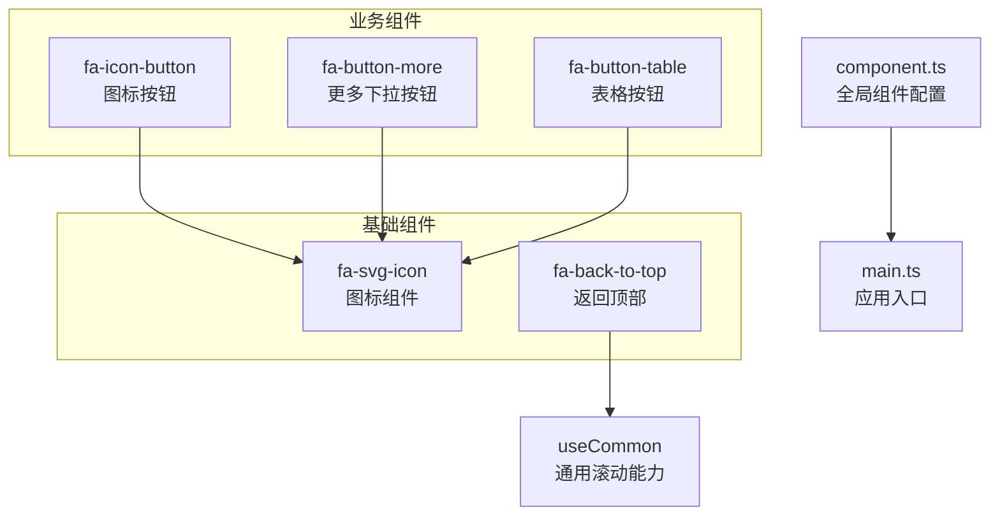
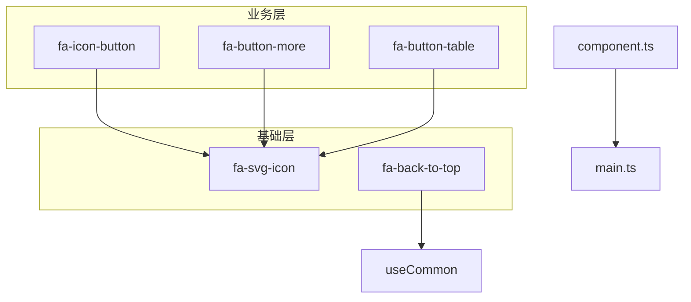
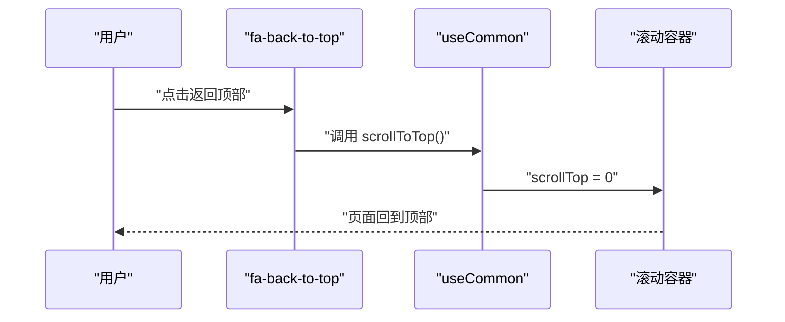
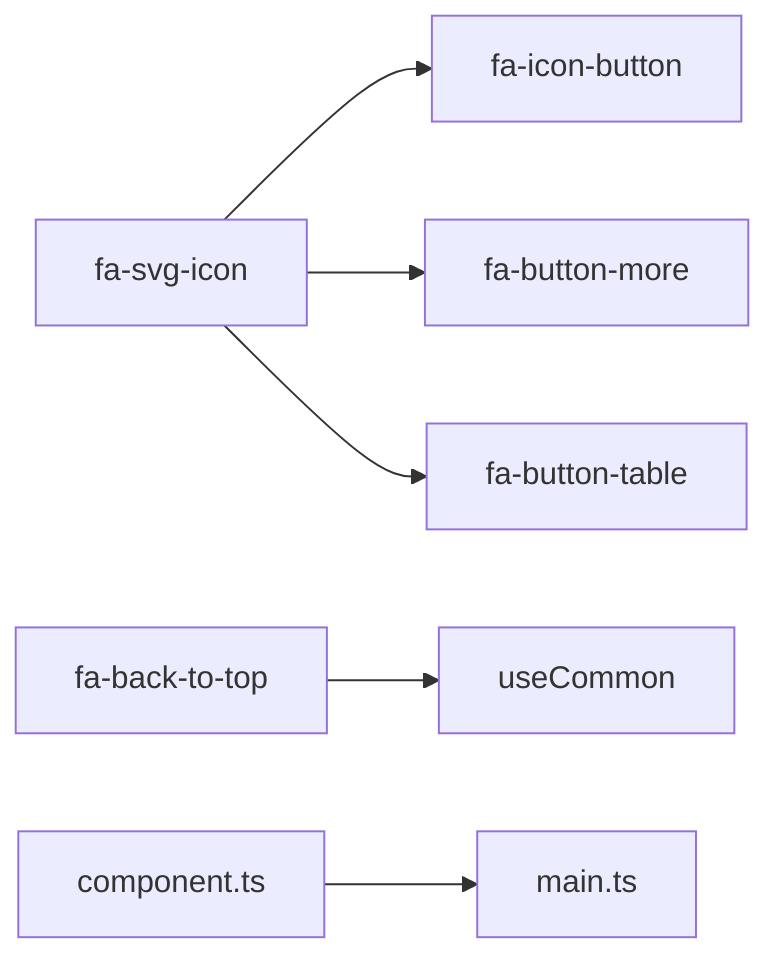

# 基础组件开发

<cite>
**本文引用的文件**
- [fa-svg-icon/index.vue](file://frontend/web/src/components/base/fa-svg-icon/index.vue)
- [fa-back-to-top/index.vue](file://frontend/web/src/components/base/fa-back-to-top/index.vue)
- [fa-icon-button/index.vue](file://frontend/web/src/components/widget/fa-icon-button/index.vue)
- [fa-button-more/index.vue](file://frontend/web/src/components/forms/fa-button-more/index.vue)
- [fa-button-more/types.ts](file://frontend/web/src/components/forms/fa-button-more/types.ts)
- [fa-button-table/index.vue](file://frontend/web/src/components/forms/fa-button-table/index.vue)
- [useCommon.ts](file://frontend/web/src/hooks/core/useCommon.ts)
- [component.ts](file://frontend/web/src/config/modules/component.ts)
- [main.ts](file://frontend/web/src/main.ts)
</cite>

## 目录
1. [简介](#简介)
2. [项目结构](#项目结构)
3. [核心组件](#核心组件)
4. [架构总览](#架构总览)
5. [详细组件分析](#详细组件分析)
6. [依赖分析](#依赖分析)
7. [性能考虑](#性能考虑)
8. [故障排查指南](#故障排查指南)
9. [结论](#结论)
10. [附录](#附录)

## 简介
本指南面向前端开发者，系统阐述基础组件的设计原则与开发模式，聚焦以下通用组件：
- 图标组件：fa-svg-icon
- 返回顶部组件：fa-back-to-top
- 按钮组件：fa-icon-button、fa-button-more、fa-button-table

文档覆盖命名约定、属性定义、样式封装、交互行为、可复用性设计、主题支持与无障碍访问、API 设计最佳实践（props 类型、默认值、校验）、组件测试方法、性能优化技巧以及文档编写要求。

## 项目结构
基础组件位于前端工程的组件目录中，采用“按功能域分层 + 组件文件夹内聚合”的组织方式。基础组件通常以 base 目录为根，配合 widget、forms 等子目录扩展出更具体的业务组件。

图表来源
- [fa-svg-icon/index.vue:1-139](file://frontend/web/src/components/base/fa-svg-icon/index.vue#L1-L139)
- [fa-back-to-top/index.vue:1-42](file://frontend/web/src/components/base/fa-back-to-top/index.vue#L1-L42)
- [fa-icon-button/index.vue:1-24](file://frontend/web/src/components/widget/fa-icon-button/index.vue#L1-L24)
- [fa-button-more/index.vue:1-56](file://frontend/web/src/components/forms/fa-button-more/index.vue#L1-L56)
- [fa-button-table/index.vue:1-60](file://frontend/web/src/components/forms/fa-button-table/index.vue#L1-L60)
- [useCommon.ts:1-58](file://frontend/web/src/hooks/core/useCommon.ts#L1-L58)
- [component.ts:1-100](file://frontend/web/src/config/modules/component.ts#L1-L100)
- [main.ts:1-35](file://frontend/web/src/main.ts#L1-L35)

章节来源
- [fa-svg-icon/index.vue:1-139](file://frontend/web/src/components/base/fa-svg-icon/index.vue#L1-L139)
- [fa-back-to-top/index.vue:1-42](file://frontend/web/src/components/base/fa-back-to-top/index.vue#L1-L42)
- [fa-icon-button/index.vue:1-24](file://frontend/web/src/components/widget/fa-icon-button/index.vue#L1-L24)
- [fa-button-more/index.vue:1-56](file://frontend/web/src/components/forms/fa-button-more/index.vue#L1-L56)
- [fa-button-table/index.vue:1-60](file://frontend/web/src/components/forms/fa-button-table/index.vue#L1-L60)
- [useCommon.ts:1-58](file://frontend/web/src/hooks/core/useCommon.ts#L1-L58)
- [component.ts:1-100](file://frontend/web/src/config/modules/component.ts#L1-L100)
- [main.ts:1-35](file://frontend/web/src/main.ts#L1-L35)

## 核心组件
本节对三个基础组件进行要点梳理，便于快速理解其职责与使用边界。

- fa-svg-icon
  - 职责：基于 Iconify 渲染 SVG 图标，统一样式与尺寸，支持透传类名与内联样式。
  - 关键点：组件名声明、禁用继承属性、透传 useAttrs 计算绑定、支持多种图标库。
- fa-back-to-top
  - 职责：在页面滚动超过阈值时显示“返回顶部”按钮，点击后平滑滚动至顶部。
  - 关键点：监听滚动容器、阈值控制、过渡动画、依赖 useCommon 的滚动能力。
- fa-icon-button / fa-button-more / fa-button-table
  - 职责：提供图标按钮、更多下拉按钮、表格操作按钮的统一外观与交互。
  - 关键点：图标渲染统一由 fa-svg-icon 承担；权限控制、默认样式映射、事件发射。

章节来源
- [fa-svg-icon/index.vue:6-24](file://frontend/web/src/components/base/fa-svg-icon/index.vue#L6-L24)
- [fa-back-to-top/index.vue:21-41](file://frontend/web/src/components/base/fa-back-to-top/index.vue#L21-L41)
- [fa-icon-button/index.vue:12-23](file://frontend/web/src/components/widget/fa-icon-button/index.vue#L12-L23)
- [fa-button-more/index.vue:26-55](file://frontend/web/src/components/forms/fa-button-more/index.vue#L26-L55)
- [fa-button-table/index.vue:15-59](file://frontend/web/src/components/forms/fa-button-table/index.vue#L15-L59)

## 架构总览
基础组件与业务组件之间形成“基础能力 → 业务封装”的层级关系。基础组件负责通用能力（图标、滚动），业务组件在此基础上组合出更丰富的交互与样式。

图表来源
- [fa-svg-icon/index.vue:1-139](file://frontend/web/src/components/base/fa-svg-icon/index.vue#L1-L139)
- [fa-back-to-top/index.vue:1-42](file://frontend/web/src/components/base/fa-back-to-top/index.vue#L1-L42)
- [fa-icon-button/index.vue:1-24](file://frontend/web/src/components/widget/fa-icon-button/index.vue#L1-L24)
- [fa-button-more/index.vue:1-56](file://frontend/web/src/components/forms/fa-button-more/index.vue#L1-L56)
- [fa-button-table/index.vue:1-60](file://frontend/web/src/components/forms/fa-button-table/index.vue#L1-L60)
- [useCommon.ts:1-58](file://frontend/web/src/hooks/core/useCommon.ts#L1-L58)
- [component.ts:1-100](file://frontend/web/src/config/modules/component.ts#L1-L100)
- [main.ts:1-35](file://frontend/web/src/main.ts#L1-L35)

## 详细组件分析

### fa-svg-icon 图标组件
- 设计原则
  - 单一职责：仅负责图标渲染与样式透传。
  - 可复用性：通过 Iconify 支持多图标库，统一命名空间与尺寸。
  - 主题适配：通过类名与内联样式实现明暗主题兼容。
- 属性与行为
  - icon：可选字符串，指定图标名称。
  - 透传：将父组件传入的 class/style 透传到内部容器，避免样式污染。
- 样式封装
  - 内部容器使用内联布局与统一尺寸，便于与其他组件对齐。
- 无障碍访问
  - 若图标承载语义，建议在上层包裹具备 aria-label 的语义元素；纯装饰图标可省略。
- 性能优化
  - 依赖 Iconify 按需加载，避免一次性引入过多图标资源。
- 测试建议
  - 快照测试：验证渲染后的 DOM 结构与类名。
  - 交互测试：验证透传 class/style 的正确性。

章节来源
- [fa-svg-icon/index.vue:6-24](file://frontend/web/src/components/base/fa-svg-icon/index.vue#L6-L24)

### fa-back-to-top 返回顶部组件
- 设计原则
  - 条件显示：滚动超过阈值才展示，减少视觉干扰。
  - 平滑滚动：提升用户体验，避免突兀跳转。
  - 可配置：阈值与滚动容器可按页面布局调整。
- 属性与行为
  - 无显式 props，通过内部状态控制显示隐藏。
  - 点击事件委托给 useCommon 的滚动能力。
- 依赖关系
  - 依赖 useCommon 提供的滚动容器与滚动方法。
- 性能优化
  - 监听容器选择器尽量精确，避免全局滚动监听。
  - 使用计算属性与轻量 watch，降低重绘频率。
- 测试建议
  - 滚动阈值与显示逻辑：模拟滚动到不同位置，断言按钮显隐。
  - 点击事件：断言滚动到顶部的行为。

图表来源
- [fa-back-to-top/index.vue:21-41](file://frontend/web/src/components/base/fa-back-to-top/index.vue#L21-L41)
- [useCommon.ts:20-28](file://frontend/web/src/hooks/core/useCommon.ts#L20-L28)

章节来源
- [fa-back-to-top/index.vue:21-41](file://frontend/web/src/components/base/fa-back-to-top/index.vue#L21-L41)
- [useCommon.ts:20-28](file://frontend/web/src/hooks/core/useCommon.ts#L20-L28)

### fa-icon-button 图标按钮
- 设计原则
  - 精简：仅承载图标与可选圆角样式。
  - 一致性：与 fa-svg-icon 协作，保证图标渲染一致。
- 属性与行为
  - icon：必填，图标名称。
  - circle：可选布尔，控制是否为圆形按钮。
- 样式封装
  - 使用统一的尺寸、圆角与悬停态，结合明暗主题变量。
- 测试建议
  - 圆形样式开关：断言圆角类名的动态添加/移除。
  - 图标渲染：断言内部 FaSvgIcon 的 icon 属性。

章节来源
- [fa-icon-button/index.vue:12-23](file://frontend/web/src/components/widget/fa-icon-button/index.vue#L12-L23)

### fa-button-more 更多下拉按钮
- 设计原则
  - 权限驱动：根据权限过滤可显示的下拉项。
  - 事件解耦：通过事件发射将点击项回传给父组件。
- 属性与行为
  - list：必填数组，包含下拉项配置。
  - auth：可选字符串，整体权限控制。
  - 下拉项类型：包含 key、label、disabled、auth、icon、color、iconColor 等字段。
- 样式与交互
  - 使用 Element Plus 的 ElDropdown/ElDropdownMenu/ElDropdownItem。
  - 通过 FaSvgIcon 渲染下拉项图标。
- 测试建议
  - 权限过滤：断言无权限项不显示。
  - 事件发射：断言点击事件携带正确的 item 数据。

章节来源
- [fa-button-more/index.vue:26-55](file://frontend/web/src/components/forms/fa-button-more/index.vue#L26-L55)
- [fa-button-more/types.ts:1-19](file://frontend/web/src/components/forms/fa-button-more/types.ts#L1-L19)

### fa-button-table 表格按钮
- 设计原则
  - 默认映射：内置常用操作类型的默认图标与颜色。
  - 自定义覆盖：允许外部传入图标、颜色与样式类。
- 属性与行为
  - type：枚举类型，支持 add/edit/delete/view/more。
  - icon/iconClass/iconColor/buttonBgColor：可选自定义覆盖。
- 样式封装
  - 通过计算属性合并默认样式与自定义样式，保持一致的尺寸与间距。
- 测试建议
  - 默认映射：断言不同 type 对应的图标与背景类名。
  - 自定义覆盖：断言传入的 icon 与颜色优先于默认值。

章节来源
- [fa-button-table/index.vue:15-59](file://frontend/web/src/components/forms/fa-button-table/index.vue#L15-L59)

## 依赖分析
- 组件间依赖
  - fa-back-to-top 依赖 useCommon 的滚动容器与滚动方法。
  - fa-icon-button/fa-button-more/fa-button-table 依赖 fa-svg-icon 渲染图标。
- 全局配置与入口
  - component.ts 提供全局组件配置与异步加载能力，main.ts 负责插件初始化与挂载。
- 外部依赖
  - Iconify：图标渲染与按需加载。
  - Element Plus：下拉菜单等 UI 组件。

图表来源
- [fa-svg-icon/index.vue:1-139](file://frontend/web/src/components/base/fa-svg-icon/index.vue#L1-L139)
- [fa-icon-button/index.vue:1-24](file://frontend/web/src/components/widget/fa-icon-button/index.vue#L1-L24)
- [fa-button-more/index.vue:1-56](file://frontend/web/src/components/forms/fa-button-more/index.vue#L1-L56)
- [fa-button-table/index.vue:1-60](file://frontend/web/src/components/forms/fa-button-table/index.vue#L1-L60)
- [fa-back-to-top/index.vue:1-42](file://frontend/web/src/components/base/fa-back-to-top/index.vue#L1-L42)
- [useCommon.ts:1-58](file://frontend/web/src/hooks/core/useCommon.ts#L1-L58)
- [component.ts:1-100](file://frontend/web/src/config/modules/component.ts#L1-L100)
- [main.ts:1-35](file://frontend/web/src/main.ts#L1-L35)

章节来源
- [fa-back-to-top/index.vue:21-26](file://frontend/web/src/components/base/fa-back-to-top/index.vue#L21-L26)
- [fa-icon-button/index.vue:7](file://frontend/web/src/components/widget/fa-icon-button/index.vue#L7)
- [fa-button-more/index.vue:14-15](file://frontend/web/src/components/forms/fa-button-more/index.vue#L14-L15)
- [fa-button-table/index.vue:10](file://frontend/web/src/components/forms/fa-button-table/index.vue#L10)
- [useCommon.ts:20-28](file://frontend/web/src/hooks/core/useCommon.ts#L20-L28)
- [component.ts:18](file://frontend/web/src/config/modules/component.ts#L18)
- [main.ts:15](file://frontend/web/src/main.ts#L15)

## 性能考虑
- 按需加载
  - 利用 defineAsyncComponent 对全局组件进行异步加载，减少首屏体积。
- 图标渲染
  - 通过 Iconify 按需引入图标，避免全量引入造成包体膨胀。
- 滚动监听
  - 精准定位滚动容器，避免全局滚动监听带来的性能损耗。
- 样式与动画
  - 使用原子化类名与过渡类，减少自定义样式的复杂度与重绘。
- 事件处理
  - 在高频滚动场景中，对回调进行节流或使用 requestAnimationFrame 优化。

## 故障排查指南
- 图标不显示
  - 检查 icon 名称是否符合 Iconify 命名规范，确认图标库可用。
  - 确认 fa-svg-icon 的 class/style 未被父容器覆盖导致不可见。
- 返回顶部无效
  - 检查滚动容器 ID 是否存在，确认 useCommon 的滚动容器选择逻辑。
  - 确认点击事件是否正确绑定到 scrollToTop。
- 下拉按钮无选项
  - 检查权限过滤逻辑，确认 hasAnyAuthItem 的判断结果。
  - 确认 list 数据结构与类型定义一致。
- 样式异常
  - 检查明暗主题变量是否生效，确认类名拼接逻辑。
  - 确认过渡类与动画库已正确引入。

章节来源
- [fa-svg-icon/index.vue:18-23](file://frontend/web/src/components/base/fa-svg-icon/index.vue#L18-L23)
- [fa-back-to-top/index.vue:31-40](file://frontend/web/src/components/base/fa-back-to-top/index.vue#L31-L40)
- [fa-button-more/index.vue:44-46](file://frontend/web/src/components/forms/fa-button-more/index.vue#L44-L46)
- [fa-button-table/index.vue:52-54](file://frontend/web/src/components/forms/fa-button-table/index.vue#L52-L54)

## 结论
基础组件应坚持“单一职责、可复用、可配置”的设计原则，通过统一的图标与滚动能力，向上支撑业务组件的多样性需求。遵循本文的命名约定、属性定义、样式封装与测试策略，可显著提升组件的稳定性与可维护性。

## 附录

### 命名约定
- 组件文件夹：base/*、widget/*、forms/* 等按功能域划分。
- 组件名：以 fa- 前缀开头，采用 PascalCase，如 FaSvgIcon、FaBackToTop。
- 文件名：index.vue 作为组件入口，类型定义文件使用 .ts。

### 属性定义与默认值
- 推荐使用 withDefaults 定义默认值，明确 props 的可选/必选与类型。
- 对于枚举型 props，使用字面量类型或联合类型约束取值范围。

### 样式封装与主题支持
- 使用原子化类名与明暗主题变量，避免硬编码颜色与尺寸。
- 通过透传 class/style 与计算属性合并，实现灵活的样式覆盖。

### 无障碍访问
- 语义化图标：承载语义的图标需提供 aria-label 或替代文本。
- 键盘可达：按钮需支持 Enter/Space 触发，必要时提供 tabindex。

### API 设计最佳实践
- 类型定义：为 props 与事件定义清晰的接口，便于 IDE 提示与 TS 校验。
- 事件命名：使用小驼峰，语义明确，如 click、change。
- 校验规则：对关键参数进行边界检查与类型校验，失败时抛出清晰错误。

### 组件测试方法
- 单元测试：针对 props、计算属性与事件发射进行断言。
- 截图测试：验证渲染结构与样式一致性。
- 用户交互测试：模拟滚动、点击、权限切换等场景。

### 文档编写要求
- 组件文档需包含：用途、属性说明、事件说明、使用示例、注意事项。
- 示例代码以最小可运行片段为主，避免冗余上下文。