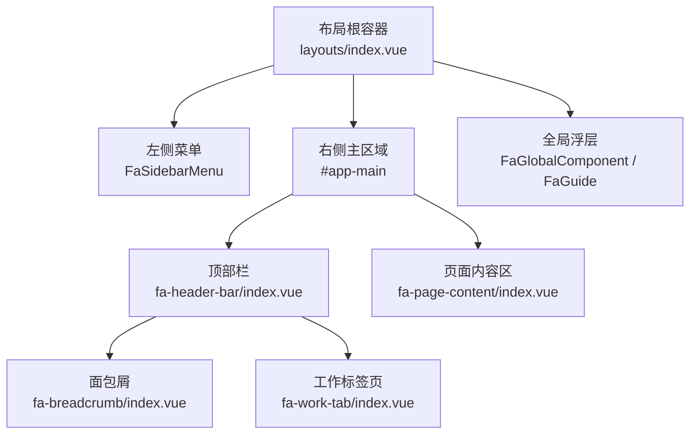
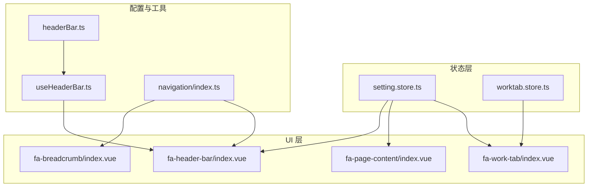
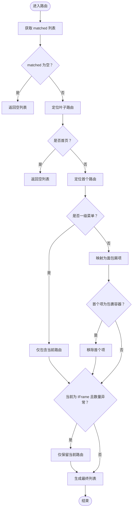
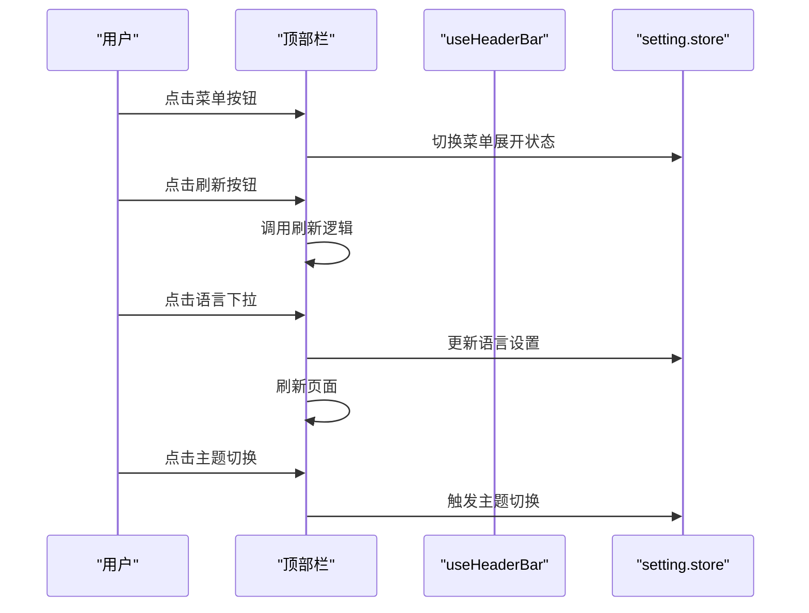
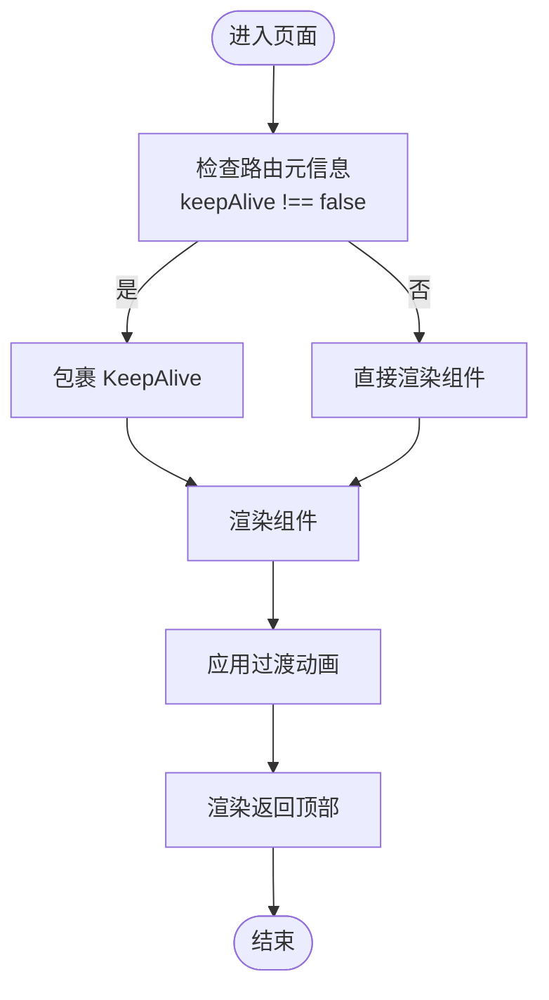
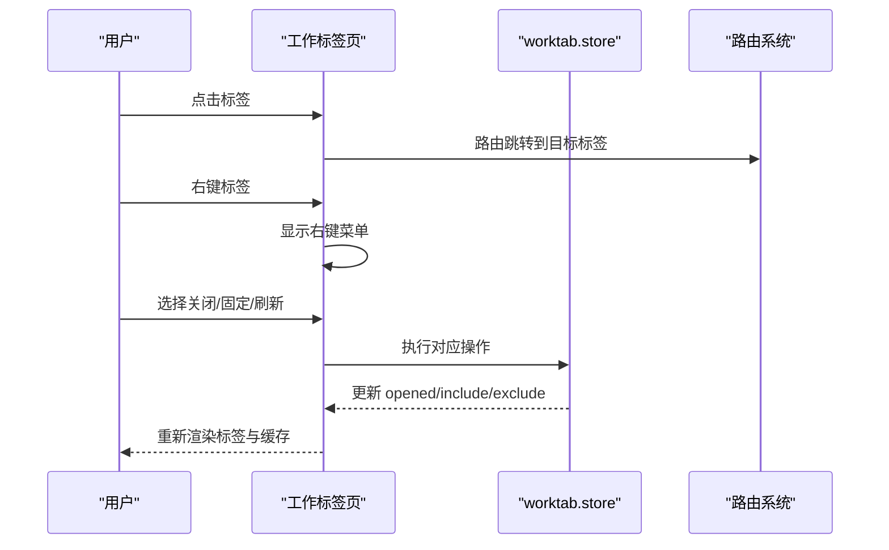
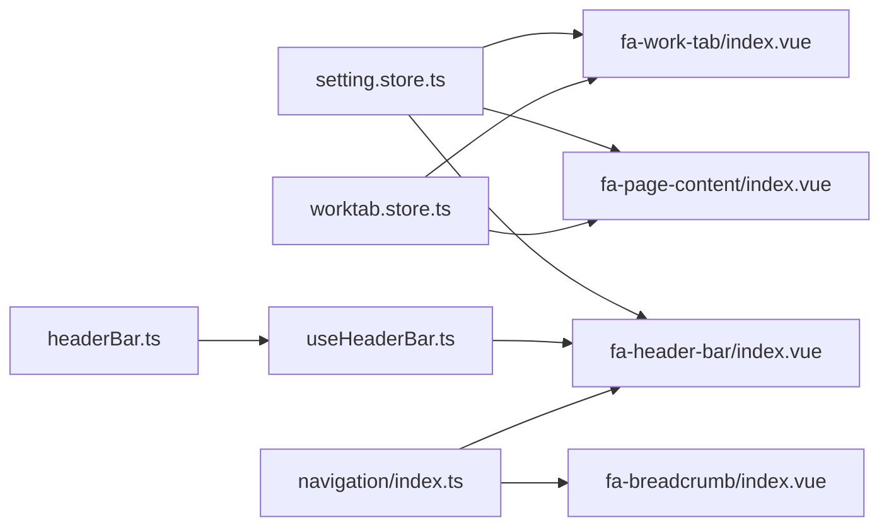

# 布局组件开发

<cite>
**本文档引用的文件**
- [layouts/index.vue](file://frontend/web/src/components/layouts/index.vue)
- [fa-breadcrumb/index.vue](file://frontend/web/src/components/layouts/fa-breadcrumb/index.vue)
- [fa-header-bar/index.vue](file://frontend/web/src/components/layouts/fa-header-bar/index.vue)
- [fa-page-content/index.vue](file://frontend/web/src/components/layouts/fa-page-content/index.vue)
- [fa-work-tab/index.vue](file://frontend/web/src/components/layouts/fa-work-tab/index.vue)
- [setting.store.ts](file://frontend/web/src/store/modules/setting.store.ts)
- [worktab.store.ts](file://frontend/web/src/store/modules/worktab.store.ts)
- [useHeaderBar.ts](file://frontend/web/src/hooks/core/useHeaderBar.ts)
- [headerBar.ts](file://frontend/web/src/config/modules/headerBar.ts)
- [layout.enum.ts](file://frontend/web/src/enums/settings/layout.enum.ts)
- [navigation/index.ts](file://frontend/web/src/utils/navigation/index.ts)
</cite>

## 目录
1. [简介](#简介)
2. [项目结构](#项目结构)
3. [核心组件](#核心组件)
4. [架构总览](#架构总览)
5. [详细组件分析](#详细组件分析)
6. [依赖分析](#依赖分析)
7. [性能考虑](#性能考虑)
8. [故障排查指南](#故障排查指南)
9. [结论](#结论)
10. [附录](#附录)

## 简介
本指南面向前端开发者，系统阐述 FastapiAdmin 页面布局系统的组件开发规范，重点覆盖以下布局组件：
- 面包屑导航（fa-breadcrumb）
- 顶部栏（fa-header-bar）
- 页面内容区（fa-page-content）
- 工作标签页（fa-work-tab）

内容涵盖组件层级关系、响应式设计与适配策略、插槽使用建议、主题切换与状态管理、性能优化、浏览器兼容性与可访问性要求，以及测试策略与调试技巧。

## 项目结构
布局系统采用“根容器 + 三区域”的结构组织：
- 根容器负责装配左侧菜单、右侧主区域（顶栏 + 页面内容）与全局浮层
- 顶栏承载面包屑、搜索、通知、用户菜单、主题切换等
- 页面内容区承载路由视图与返回顶部控件，并与设置联动实现刷新重建
- 工作标签页位于顶栏下方，提供多标签导航与缓存管理

图表来源
- [layouts/index.vue:9-32](file://frontend/web/src/components/layouts/index.vue#L9-L32)
- [fa-header-bar/index.vue:1-179](file://frontend/web/src/components/layouts/fa-header-bar/index.vue#L1-L179)
- [fa-page-content/index.vue:1-54](file://frontend/web/src/components/layouts/fa-page-content/index.vue#L1-L54)
- [fa-work-tab/index.vue:1-156](file://frontend/web/src/components/layouts/fa-work-tab/index.vue#L1-L156)

章节来源
- [layouts/index.vue:1-69](file://frontend/web/src/components/layouts/index.vue#L1-L69)

## 核心组件
- 布局根容器：组装侧栏、顶栏、内容区与全局浮层，控制新手指引显隐
- 顶部栏：集成菜单按钮、刷新、快速入口、面包屑、顶部菜单、全屏、语言、通知、聊天、设置、主题切换、用户菜单与工作标签页
- 面包屑：基于路由匹配生成路径，支持点击跳转与 IFrame 特殊处理
- 页面内容区：承载 RouterView，支持 KeepAlive 缓存与过渡动画，按断点切换滚动容器
- 工作标签页：多标签导航、右键菜单、滚动与触摸手势、固定标签、缓存排除、刷新缓存

章节来源
- [fa-header-bar/index.vue:1-179](file://frontend/web/src/components/layouts/fa-header-bar/index.vue#L1-L179)
- [fa-breadcrumb/index.vue:1-145](file://frontend/web/src/components/layouts/fa-breadcrumb/index.vue#L1-L145)
- [fa-page-content/index.vue:1-151](file://frontend/web/src/components/layouts/fa-page-content/index.vue#L1-L151)
- [fa-work-tab/index.vue:1-156](file://frontend/web/src/components/layouts/fa-work-tab/index.vue#L1-L156)

## 架构总览
布局组件围绕 Pinia 状态与路由系统协作：
- 设置状态（setting.store）控制布局模式、主题、页签样式、容器宽度、刷新标志等
- 工作标签状态（worktab.store）维护已打开标签、固定标签、KeepAlive 排除列表
- 顶部栏通过 useHeaderBar 钩子读取设置与配置，决定各功能按钮的显示
- 面包屑基于路由元信息与导航工具生成路径
- 页面内容区根据设置与路由元信息决定缓存策略与过渡动画

图表来源
- [setting.store.ts:27-524](file://frontend/web/src/store/modules/setting.store.ts#L27-L524)
- [worktab.store.ts:57-635](file://frontend/web/src/store/modules/worktab.store.ts#L57-L635)
- [fa-header-bar/index.vue:181-365](file://frontend/web/src/components/layouts/fa-header-bar/index.vue#L181-L365)
- [fa-breadcrumb/index.vue:36-144](file://frontend/web/src/components/layouts/fa-breadcrumb/index.vue#L36-L144)
- [fa-page-content/index.vue:55-151](file://frontend/web/src/components/layouts/fa-page-content/index.vue#L55-L151)
- [fa-work-tab/index.vue:158-717](file://frontend/web/src/components/layouts/fa-work-tab/index.vue#L158-L717)
- [useHeaderBar.ts:28-214](file://frontend/web/src/hooks/core/useHeaderBar.ts#L28-L214)
- [headerBar.ts:16-65](file://frontend/web/src/config/modules/headerBar.ts#L16-L65)
- [navigation/index.ts:1-76](file://frontend/web/src/utils/navigation/index.ts#L1-L76)

## 详细组件分析

### 面包屑导航（fa-breadcrumb）
- 数据来源：路由 matched 数组，结合元信息与导航工具生成
- 生成策略：
  - 首页判断：以叶子路由为准，若为首页则不显示
  - 一级菜单：仅显示当前路由
  - 普通路由：映射为面包屑项
  - 包裹容器过滤：若首个项为包裹容器则移除
  - IFrame 特例：若当前为 IFrame 且过滤后仅剩一项或均为包裹容器，仅展示当前页
- 交互行为：可点击项支持点击跳转，支持查找子路由并跳转至首个有效子路由
- 可访问性：使用语义化 nav 与 aria-label，分隔符使用 aria-hidden

图表来源
- [fa-breadcrumb/index.vue:52-88](file://frontend/web/src/components/layouts/fa-breadcrumb/index.vue#L52-L88)
- [navigation/index.ts:31-49](file://frontend/web/src/utils/navigation/index.ts#L31-L49)

章节来源
- [fa-breadcrumb/index.vue:1-145](file://frontend/web/src/components/layouts/fa-breadcrumb/index.vue#L1-L145)
- [navigation/index.ts:1-76](file://frontend/web/src/utils/navigation/index.ts#L1-L76)

### 顶部栏（fa-header-bar）
- 功能模块：菜单按钮、刷新、快速入口、面包屑、顶部菜单、混合菜单、全局搜索、全屏、尺寸选择、语言、通知、聊天、设置、主题切换、用户菜单
- 显示控制：通过 useHeaderBar 钩子与 headerBar.ts 配置共同决定各模块的显示与否
- 交互行为：菜单展开/收起、页面刷新、全屏切换、语言切换、打开设置面板、打开搜索对话框、打开通知面板、打开聊天窗口
- 响应式：根据窗口宽度与布局模式调整显示元素

图表来源
- [fa-header-bar/index.vue:273-325](file://frontend/web/src/components/layouts/fa-header-bar/index.vue#L273-L325)
- [useHeaderBar.ts:66-121](file://frontend/web/src/hooks/core/useHeaderBar.ts#L66-L121)
- [setting.store.ts:180-200](file://frontend/web/src/store/modules/setting.store.ts#L180-L200)

章节来源
- [fa-header-bar/index.vue:1-511](file://frontend/web/src/components/layouts/fa-header-bar/index.vue#L1-L511)
- [useHeaderBar.ts:1-215](file://frontend/web/src/hooks/core/useHeaderBar.ts#L1-L215)
- [headerBar.ts:1-68](file://frontend/web/src/config/modules/headerBar.ts#L1-L68)

### 页面内容区（fa-page-content）
- 容器与滚动：常规布局下由容器承担纵向滚动，路由视图填满剩余空间
- 路由视图：使用 RouterView 承载页面组件，支持过渡动画与 KeepAlive 缓存
- 缓存策略：依据路由元信息与工作标签状态决定是否包裹 KeepAlive，支持 include/exclude 精细化控制
- 刷新机制：通过设置 store 的 refresh 标志重建 RouterView，避免首屏闪烁
- 响应式：窄屏下滚动目标切换为文档，宽屏使用内容容器

图表来源
- [fa-page-content/index.vue:86-132](file://frontend/web/src/components/layouts/fa-page-content/index.vue#L86-L132)
- [setting.store.ts:302-304](file://frontend/web/src/store/modules/setting.store.ts#L302-L304)

章节来源
- [fa-page-content/index.vue:1-151](file://frontend/web/src/components/layouts/fa-page-content/index.vue#L1-L151)
- [setting.store.ts:27-524](file://frontend/web/src/store/modules/setting.store.ts#L27-L524)

### 工作标签页（fa-work-tab）
- 模式：默认、卡片、谷歌三种风格，通过设置 store 切换
- 标签管理：打开、关闭、固定/取消固定、批量关闭（左/右/其他/全部）
- 缓存管理：与 KeepAlive 排除列表联动，确保关闭标签时正确剔除缓存
- 交互：点击切换、中键关闭、右键菜单、滚动与触摸手势、固定区分隔线、刷新缓存
- 自适应：根据标签溢出动态显示滚动按钮，自动定位当前标签

图表来源
- [fa-work-tab/index.vue:494-570](file://frontend/web/src/components/layouts/fa-work-tab/index.vue#L494-L570)
- [worktab.store.ts:128-231](file://frontend/web/src/store/modules/worktab.store.ts#L128-L231)
- [worktab.store.ts:382-423](file://frontend/web/src/store/modules/worktab.store.ts#L382-L423)

章节来源
- [fa-work-tab/index.vue:1-1100](file://frontend/web/src/components/layouts/fa-work-tab/index.vue#L1-L1100)
- [worktab.store.ts:1-635](file://frontend/web/src/store/modules/worktab.store.ts#L1-L635)

## 依赖分析
- 组件耦合
  - 顶部栏依赖设置 store 与 useHeaderBar 配置，间接影响面包屑与工作标签页的显示
  - 页面内容区依赖设置 store 的刷新标志与容器宽度，依赖工作标签状态进行缓存控制
  - 工作标签页依赖工作标签状态与路由系统，同时影响页面内容区的缓存 include
- 状态管理
  - setting.store：布局模式、主题、页签样式、容器宽度、刷新标志、功能开关等
  - worktab.store：已打开标签、固定标签、KeepAlive 排除列表、当前标签同步
- 配置与工具
  - headerBar.ts：顶部栏功能开关配置
  - useHeaderBar.ts：顶部栏功能显示逻辑封装
  - navigation/index.ts：面包屑标题格式化、外链与 IFrame 判断、菜单跳转

图表来源
- [setting.store.ts:27-524](file://frontend/web/src/store/modules/setting.store.ts#L27-L524)
- [worktab.store.ts:57-635](file://frontend/web/src/store/modules/worktab.store.ts#L57-L635)
- [fa-header-bar/index.vue:181-365](file://frontend/web/src/components/layouts/fa-header-bar/index.vue#L181-L365)
- [fa-page-content/index.vue:55-151](file://frontend/web/src/components/layouts/fa-page-content/index.vue#L55-L151)
- [fa-work-tab/index.vue:158-717](file://frontend/web/src/components/layouts/fa-work-tab/index.vue#L158-L717)
- [useHeaderBar.ts:28-214](file://frontend/web/src/hooks/core/useHeaderBar.ts#L28-L214)
- [headerBar.ts:16-65](file://frontend/web/src/config/modules/headerBar.ts#L16-L65)
- [navigation/index.ts:1-76](file://frontend/web/src/utils/navigation/index.ts#L1-L76)

章节来源
- [setting.store.ts:1-524](file://frontend/web/src/store/modules/setting.store.ts#L1-L524)
- [worktab.store.ts:1-635](file://frontend/web/src/store/modules/worktab.store.ts#L1-L635)
- [fa-header-bar/index.vue:1-511](file://frontend/web/src/components/layouts/fa-header-bar/index.vue#L1-L511)
- [fa-page-content/index.vue:1-151](file://frontend/web/src/components/layouts/fa-page-content/index.vue#L1-L151)
- [fa-work-tab/index.vue:1-1100](file://frontend/web/src/components/layouts/fa-work-tab/index.vue#L1-L1100)
- [useHeaderBar.ts:1-215](file://frontend/web/src/hooks/core/useHeaderBar.ts#L1-L215)
- [headerBar.ts:1-68](file://frontend/web/src/config/modules/headerBar.ts#L1-L68)
- [navigation/index.ts:1-76](file://frontend/web/src/utils/navigation/index.ts#L1-L76)

## 性能考虑
- 面包屑
  - 使用 computed 替代 watch，减少重复计算
  - 路由查找使用 router.getRoutes() 缓存结果，避免重复遍历
- 顶部栏
  - 功能开关通过 useHeaderBar 与配置文件统一管理，避免条件分支散落
  - 图标动画采用 CSS 动画，减少 JavaScript 开销
- 页面内容区
  - 首次加载禁用过渡动画，避免首屏闪烁
  - KeepAlive include/exclude 基于工作标签状态动态计算，避免不必要的缓存
  - 窄屏下滚动目标切换为文档，减少容器滚动带来的重排
- 工作标签页
  - ResizeObserver 监听溢出状态，requestAnimationFrame 优化滚动定位
  - 滚动与触摸事件使用被动监听，提升滚动流畅度
  - 右键菜单选项根据当前标签状态动态启用/禁用，减少无效操作

章节来源
- [fa-breadcrumb/index.vue:52-88](file://frontend/web/src/components/layouts/fa-breadcrumb/index.vue#L52-L88)
- [fa-header-bar/index.vue:367-510](file://frontend/web/src/components/layouts/fa-header-bar/index.vue#L367-L510)
- [fa-page-content/index.vue:109-149](file://frontend/web/src/components/layouts/fa-page-content/index.vue#L109-L149)
- [fa-work-tab/index.vue:243-256](file://frontend/web/src/components/layouts/fa-work-tab/index.vue#L243-L256)
- [fa-work-tab/index.vue:428-490](file://frontend/web/src/components/layouts/fa-work-tab/index.vue#L428-L490)

## 故障排查指南
- 面包屑不显示或显示异常
  - 检查路由元信息是否正确设置，确认 isFirstLevel 与 isIframe 标记
  - 确认包裹容器路径与判断逻辑一致
- 顶部栏功能按钮不显示
  - 检查 headerBar.ts 配置与 useHeaderBar 返回的 shouldShow* 计算属性
  - 确认 setting.store 中对应功能开关状态
- 页面内容区不刷新或缓存异常
  - 检查 setting.store.refresh 标志是否被正确翻转
  - 确认路由元信息 keepAlive 与工作标签状态
- 工作标签页不响应或缓存未清理
  - 检查 worktab.store 的 opened、keepAliveExclude 与当前标签同步
  - 确认标签关闭后的路由跳转与当前标签回退逻辑

章节来源
- [fa-breadcrumb/index.vue:90-144](file://frontend/web/src/components/layouts/fa-breadcrumb/index.vue#L90-L144)
- [useHeaderBar.ts:66-121](file://frontend/web/src/hooks/core/useHeaderBar.ts#L66-L121)
- [setting.store.ts:302-304](file://frontend/web/src/store/modules/setting.store.ts#L302-L304)
- [worktab.store.ts:114-123](file://frontend/web/src/store/modules/worktab.store.ts#L114-L123)
- [worktab.store.ts:382-423](file://frontend/web/src/store/modules/worktab.store.ts#L382-L423)

## 结论
本指南提供了布局组件的开发规范与最佳实践，强调了组件间的职责分离、状态集中管理与响应式适配。通过统一的配置与钩子，顶部栏实现了灵活的功能开关；页面内容区与工作标签页协同保证了缓存与导航体验；面包屑与导航工具确保路径一致性与可访问性。遵循本文档的规范，可在保证性能与可维护性的前提下，快速扩展与定制布局组件。

## 附录
- 响应式断点与适配
  - 窄屏断点：页面内容区滚动目标切换为文档
  - 顶部栏宽度阈值：快速入口最小宽度由配置提供
- 主题与样式
  - setting.store 监听主题与颜色变化，动态应用到文档根元素
  - 工作标签页支持三种风格，通过设置切换
- 可访问性
  - 面包屑使用语义化 nav 与 aria-label
  - 通知与聊天按钮提供可见反馈与动画提示
- 测试策略
  - 单元测试：针对导航工具函数与状态计算属性
  - 集成测试：模拟路由切换、标签页操作与设置变更
  - 端到端测试：覆盖典型用户路径（打开标签、关闭标签、刷新、主题切换）