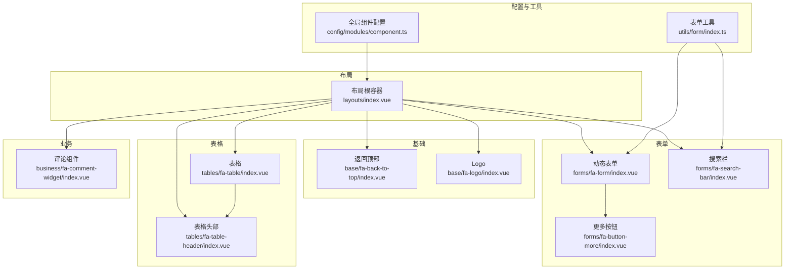
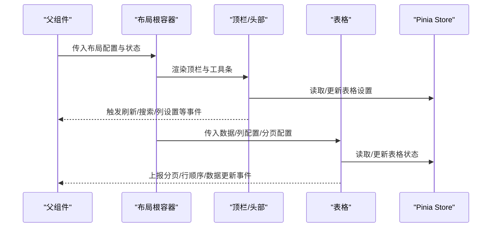
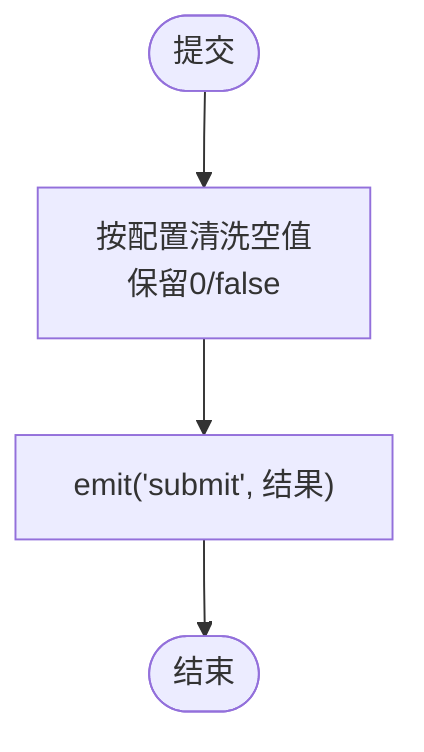
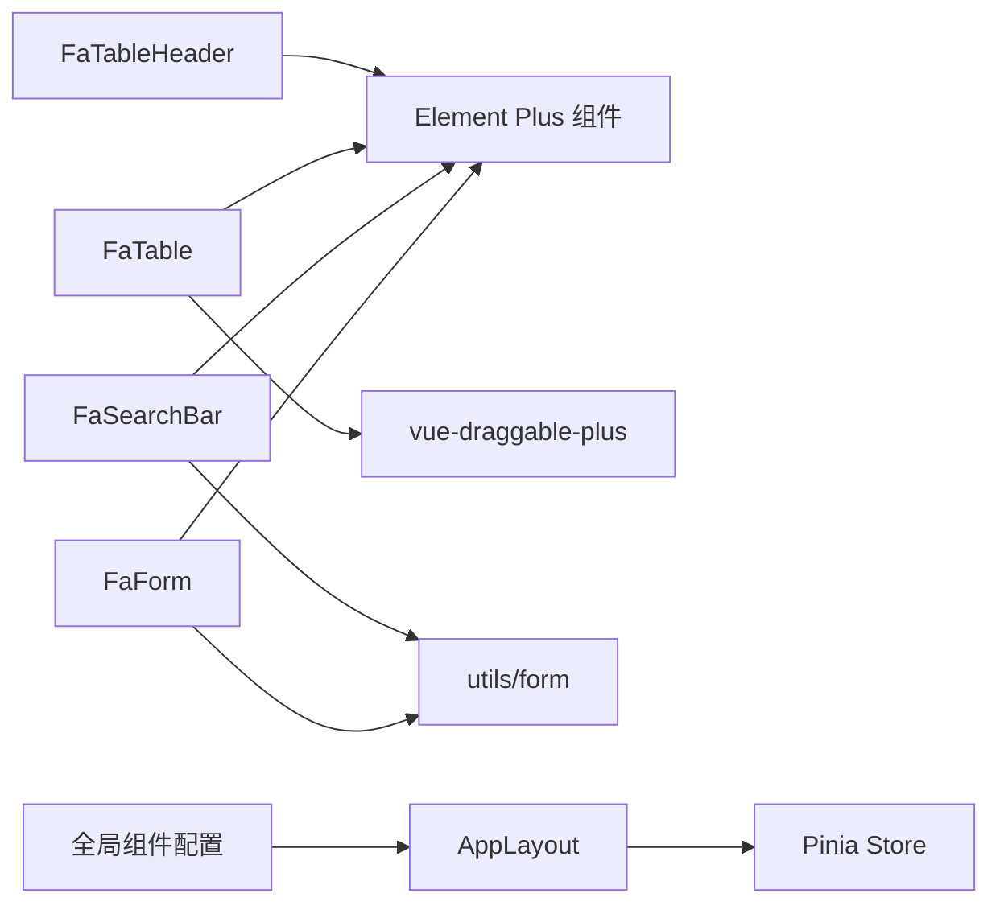

# 组件开发规范

<cite>
**本文引用的文件**
- [frontend/web/src/components/layouts/index.vue](file://frontend/web/src/components/layouts/index.vue)
- [frontend/web/src/components/forms/fa-form/index.vue](file://frontend/web/src/components/forms/fa-form/index.vue)
- [frontend/web/src/components/forms/fa-search-bar/index.vue](file://frontend/web/src/components/forms/fa-search-bar/index.vue)
- [frontend/web/src/components/tables/fa-table/index.vue](file://frontend/web/src/components/tables/fa-table/index.vue)
- [frontend/web/src/components/tables/fa-table-header/index.vue](file://frontend/web/src/components/tables/fa-table-header/index.vue)
- [frontend/web/src/components/business/fa-comment-widget/index.vue](file://frontend/web/src/components/business/fa-comment-widget/index.vue)
- [frontend/web/src/components/base/fa-back-to-top/index.vue](file://frontend/web/src/components/base/fa-back-to-top/index.vue)
- [frontend/web/src/components/base/fa-logo/index.vue](file://frontend/web/src/components/base/fa-logo/index.vue)
- [frontend/web/src/components/forms/fa-button-more/index.vue](file://frontend/web/src/components/forms/fa-button-more/index.vue)
- [frontend/web/src/config/modules/component.ts](file://frontend/web/src/config/modules/component.ts)
- [frontend/web/src/utils/form/index.ts](file://frontend/web/src/utils/form/index.ts)
- [frontend/web/package.json](file://frontend/web/package.json)
- [frontend/web/tsconfig.json](file://frontend/web/tsconfig.json)
</cite>

## 目录
1. [简介](#简介)
2. [项目结构](#项目结构)
3. [核心组件](#核心组件)
4. [架构总览](#架构总览)
5. [组件详解](#组件详解)
6. [依赖关系分析](#依赖关系分析)
7. [性能考量](#性能考量)
8. [故障排查指南](#故障排查指南)
9. [结论](#结论)
10. [附录](#附录)

## 简介
本指南面向基于 Vue3 的组件开发，聚焦于基础组件、布局组件、表单组件与业务组件的设计与实现规范。内容涵盖组件命名约定、属性定义、事件处理、插槽使用、组件通信模式、类型定义、测试策略、文档与版本管理，以及团队协作的代码审查要点。目标是统一团队开发标准，提升组件的单一职责、可复用性与可维护性。

## 项目结构
前端采用模块化组织，组件按功能域分类存放：
- 基础组件：通用能力封装，如返回顶部、Logo 等
- 布局组件：页面骨架与全局浮层，如布局根容器、顶栏、侧边菜单等
- 表单组件：动态表单、搜索栏、表格等
- 业务组件：评论区、图标按钮等具体业务场景
- 配置与工具：全局组件注册、表单工具函数、类型定义等

图表来源
- [frontend/web/src/components/layouts/index.vue:1-69](file://frontend/web/src/components/layouts/index.vue#L1-L69)
- [frontend/web/src/components/tables/fa-table/index.vue:1-499](file://frontend/web/src/components/tables/fa-table/index.vue#L1-L499)
- [frontend/web/src/components/tables/fa-table-header/index.vue:1-370](file://frontend/web/src/components/tables/fa-table-header/index.vue#L1-L370)
- [frontend/web/src/components/forms/fa-form/index.vue:1-620](file://frontend/web/src/components/forms/fa-form/index.vue#L1-L620)
- [frontend/web/src/components/forms/fa-search-bar/index.vue:1-588](file://frontend/web/src/components/forms/fa-search-bar/index.vue#L1-L588)
- [frontend/web/src/components/base/fa-back-to-top/index.vue:1-42](file://frontend/web/src/components/base/fa-back-to-top/index.vue#L1-L42)
- [frontend/web/src/components/base/fa-logo/index.vue:1-54](file://frontend/web/src/components/base/fa-logo/index.vue#L1-L54)
- [frontend/web/src/components/business/fa-comment-widget/index.vue:1-113](file://frontend/web/src/components/business/fa-comment-widget/index.vue#L1-L113)
- [frontend/web/src/components/forms/fa-button-more/index.vue:1-56](file://frontend/web/src/components/forms/fa-button-more/index.vue#L1-L56)
- [frontend/web/src/config/modules/component.ts:1-100](file://frontend/web/src/config/modules/component.ts#L1-L100)
- [frontend/web/src/utils/form/index.ts:1-187](file://frontend/web/src/utils/form/index.ts#L1-L187)

章节来源
- [frontend/web/src/components/layouts/index.vue:1-69](file://frontend/web/src/components/layouts/index.vue#L1-L69)
- [frontend/web/src/config/modules/component.ts:1-100](file://frontend/web/src/config/modules/component.ts#L1-L100)
- [frontend/web/src/utils/form/index.ts:1-187](file://frontend/web/src/utils/form/index.ts#L1-L187)

## 核心组件
- 布局根容器：负责装配侧栏、顶栏、页面内容与全局浮层，协调新手指引显隐与状态持久化。
- 动态表单：统一渲染策略，支持 Element Plus 组件类型映射、自定义渲染、插槽扩展与清洗输出。
- 搜索栏：与动态表单一致的渲染策略，支持展开/收起、清洗输出与暴露校验与重置能力。
- 表格：透传 Element Plus 表格属性，集成分页、列渲染约定、拖拽排序、空数据与高度适配。
- 表格头部：统一的表格工具条，包含刷新、大小切换、全屏、列设置、行拖拽、斑马纹等设置。
- 业务组件：示例评论组件，演示父子通信与事件处理。
- 基础组件：返回顶部、Logo 等，强调最小职责与可复用性。
- 全局组件配置：集中管理全局浮层组件的异步注册与开关控制。

章节来源
- [frontend/web/src/components/layouts/index.vue:1-69](file://frontend/web/src/components/layouts/index.vue#L1-L69)
- [frontend/web/src/components/forms/fa-form/index.vue:1-620](file://frontend/web/src/components/forms/fa-form/index.vue#L1-L620)
- [frontend/web/src/components/forms/fa-search-bar/index.vue:1-588](file://frontend/web/src/components/forms/fa-search-bar/index.vue#L1-L588)
- [frontend/web/src/components/tables/fa-table/index.vue:1-499](file://frontend/web/src/components/tables/fa-table/index.vue#L1-L499)
- [frontend/web/src/components/tables/fa-table-header/index.vue:1-370](file://frontend/web/src/components/tables/fa-table-header/index.vue#L1-L370)
- [frontend/web/src/components/business/fa-comment-widget/index.vue:1-113](file://frontend/web/src/components/business/fa-comment-widget/index.vue#L1-L113)
- [frontend/web/src/components/base/fa-back-to-top/index.vue:1-42](file://frontend/web/src/components/base/fa-back-to-top/index.vue#L1-L42)
- [frontend/web/src/components/base/fa-logo/index.vue:1-54](file://frontend/web/src/components/base/fa-logo/index.vue#L1-L54)
- [frontend/web/src/config/modules/component.ts:1-100](file://frontend/web/src/config/modules/component.ts#L1-L100)

## 架构总览
组件间通信遵循“单向数据流 + 明确事件契约”：
- 父组件通过 props 向子组件注入数据与行为配置
- 子组件通过 emits 向父组件上报状态变更与交互结果
- 子组件内部通过 defineModel 管理受控双向绑定
- 全局状态通过 Pinia store 管理跨组件共享

图表来源
- [frontend/web/src/components/layouts/index.vue:1-69](file://frontend/web/src/components/layouts/index.vue#L1-L69)
- [frontend/web/src/components/tables/fa-table/index.vue:1-499](file://frontend/web/src/components/tables/fa-table/index.vue#L1-L499)
- [frontend/web/src/components/tables/fa-table-header/index.vue:1-370](file://frontend/web/src/components/tables/fa-table-header/index.vue#L1-L370)

## 组件详解

### 布局根容器（AppLayout）
- 设计原则：单一职责，仅负责布局装配与状态协调
- 关键点：
  - 通过计算属性与 v-model 绑定 session 级新手指引状态
  - 通过设置 store 持久化“不再显示”标记
  - 依赖 FaSidebarMenu、FaHeaderBar、FaPageContent、FaGlobalComponent 等子组件
- 事件与状态：
  - onGuideFinished 持久化设置
  - guideVisible 双向绑定

章节来源
- [frontend/web/src/components/layouts/index.vue:1-69](file://frontend/web/src/components/layouts/index.vue#L1-L69)

### 动态表单（FaForm）
- 设计原则：统一渲染策略、可扩展、可清洗输出
- 关键点：
  - 通过 items 配置数组驱动渲染，componentMap 映射 Element Plus 组件类型
  - 支持 label 自定义渲染、插槽、选项数据、props 透传
  - 提供 resetFields、validate、clearValidate、validateField 等代理方法
  - sanitizeOutput 清洗空值策略可配置，默认保留 0 与 false
- 类型与事件：
  - FormItem 接口定义标签、类型、选项、插槽等
  - emits: reset、submit
  - defineModel: modelValue
- 响应式与布局：
  - 基于 useWindowSize 与 calculateResponsiveSpan 实现响应式栅格

图表来源
- [frontend/web/src/components/forms/fa-form/index.vue:469-601](file://frontend/web/src/components/forms/fa-form/index.vue#L469-L601)
- [frontend/web/src/utils/form/index.ts:22-37](file://frontend/web/src/utils/form/index.ts#L22-L37)

章节来源
- [frontend/web/src/components/forms/fa-form/index.vue:1-620](file://frontend/web/src/components/forms/fa-form/index.vue#L1-L620)
- [frontend/web/src/utils/form/index.ts:1-187](file://frontend/web/src/utils/form/index.ts#L1-L187)

### 搜索栏（FaSearchBar）
- 设计原则：与动态表单一致的渲染策略，支持展开/收起与清洗输出
- 关键点：
  - visibleFormItems 根据 isExpand 与 span 计算每行可见项数
  - shouldShowExpandToggle 动态决定是否显示展开按钮
  - sanitizeOutput 清洗策略默认更激进，避免携带空查询参数
- 类型与事件：
  - SearchFormItem 接口与 FaForm 类似
  - emits: reset、search
  - expose: validate、reset、getOutput

章节来源
- [frontend/web/src/components/forms/fa-search-bar/index.vue:1-588](file://frontend/web/src/components/forms/fa-search-bar/index.vue#L1-L588)
- [frontend/web/src/utils/form/index.ts:1-187](file://frontend/web/src/utils/form/index.ts#L1-L187)

### 表格（FaTable）
- 设计原则：透传 Element Plus 属性、统一列渲染约定、可拖拽排序、响应式分页
- 关键点：
  - columns 支持全局序号、展开列、插槽与 formatter
  - 合并默认与 props 的分页配置，根据设备宽度调整布局
  - useTableHeight 与 ResizeObserver 优化高度计算
  - expose: scrollToTop、elTableRef
- 事件：
  - pagination:size-change、pagination:current-change、update:data、row-order-change

章节来源
- [frontend/web/src/components/tables/fa-table/index.vue:1-499](file://frontend/web/src/components/tables/fa-table/index.vue#L1-L499)

### 表格头部（FaTableHeader）
- 设计原则：统一工具条布局，支持布局项开关与列设置
- 关键点：
  - layout 布局项解析，shouldShow 控制显示
  - 列设置支持拖拽排序与固定列保护
  - 全屏切换时保存/恢复 body overflow
- 事件：
  - refresh、search、update:showSearchBar

章节来源
- [frontend/web/src/components/tables/fa-table-header/index.vue:1-370](file://frontend/web/src/components/tables/fa-table-header/index.vue#L1-L370)

### 业务组件（评论组件）
- 设计原则：演示父子通信与事件处理
- 关键点：
  - 父组件持有评论列表，子组件通过事件上报新增/回复
  - 使用 ElMessage 进行提示反馈
  - toggleReply 控制回复表单显隐

章节来源
- [frontend/web/src/components/business/fa-comment-widget/index.vue:1-113](file://frontend/web/src/components/business/fa-comment-widget/index.vue#L1-L113)

### 基础组件
- 返回顶部（FaBackToTop）：监听滚动容器 y 坐标，超过阈值显示按钮，点击滚动到顶部
- Logo（FaLogo）：支持自定义 src 与回退默认资源，响应式尺寸

章节来源
- [frontend/web/src/components/base/fa-back-to-top/index.vue:1-42](file://frontend/web/src/components/base/fa-back-to-top/index.vue#L1-L42)
- [frontend/web/src/components/base/fa-logo/index.vue:1-54](file://frontend/web/src/components/base/fa-logo/index.vue#L1-L54)

### 更多按钮（FaButtonMore）
- 设计原则：权限控制与下拉菜单组合
- 关键点：
  - hasAnyAuthItem 过滤无权限项
  - emit click 事件，父组件处理具体动作

章节来源
- [frontend/web/src/components/forms/fa-button-more/index.vue:1-56](file://frontend/web/src/components/forms/fa-button-more/index.vue#L1-L56)

### 全局组件配置
- 设计原则：集中管理全局浮层组件，支持异步加载与开关控制
- 关键点：
  - getEnabledGlobalComponents 过滤启用项
  - getGlobalComponentByKey 按 key 查询

章节来源
- [frontend/web/src/config/modules/component.ts:1-100](file://frontend/web/src/config/modules/component.ts#L1-L100)

## 依赖关系分析
- 组件耦合：
  - 布局根容器依赖多个子组件，承担装配职责
  - 表格与表格头部通过 props/事件协同，形成稳定契约
  - 动态表单与搜索栏共享相同的渲染策略与工具函数
- 外部依赖：
  - Element Plus、VueUse、Pinia、vue-draggable-plus 等
- 类型与路径别名：
  - tsconfig.json 定义 @/* 等路径别名，便于导入

图表来源
- [frontend/web/src/components/forms/fa-form/index.vue:1-620](file://frontend/web/src/components/forms/fa-form/index.vue#L1-L620)
- [frontend/web/src/components/forms/fa-search-bar/index.vue:1-588](file://frontend/web/src/components/forms/fa-search-bar/index.vue#L1-L588)
- [frontend/web/src/components/tables/fa-table/index.vue:1-499](file://frontend/web/src/components/tables/fa-table/index.vue#L1-L499)
- [frontend/web/src/components/tables/fa-table-header/index.vue:1-370](file://frontend/web/src/components/tables/fa-table-header/index.vue#L1-L370)
- [frontend/web/src/components/layouts/index.vue:1-69](file://frontend/web/src/components/layouts/index.vue#L1-L69)
- [frontend/web/src/config/modules/component.ts:1-100](file://frontend/web/src/config/modules/component.ts#L1-L100)
- [frontend/web/src/utils/form/index.ts:1-187](file://frontend/web/src/utils/form/index.ts#L1-L187)

章节来源
- [frontend/web/src/components/forms/fa-form/index.vue:1-620](file://frontend/web/src/components/forms/fa-form/index.vue#L1-L620)
- [frontend/web/src/components/forms/fa-search-bar/index.vue:1-588](file://frontend/web/src/components/forms/fa-search-bar/index.vue#L1-L588)
- [frontend/web/src/components/tables/fa-table/index.vue:1-499](file://frontend/web/src/components/tables/fa-table/index.vue#L1-L499)
- [frontend/web/src/components/tables/fa-table-header/index.vue:1-370](file://frontend/web/src/components/tables/fa-table-header/index.vue#L1-L370)
- [frontend/web/src/components/layouts/index.vue:1-69](file://frontend/web/src/components/layouts/index.vue#L1-L69)
- [frontend/web/src/config/modules/component.ts:1-100](file://frontend/web/src/config/modules/component.ts#L1-L100)
- [frontend/web/src/utils/form/index.ts:1-187](file://frontend/web/src/utils/form/index.ts#L1-L187)

## 性能考量
- 渲染策略
  - 动态表单与搜索栏使用 v-for + :is 动态组件，配合 props 透传，减少重复代码
  - 表格通过 useResizeObserver 与 requestAnimationFrame 避免 ResizeObserver 循环警告
- 响应式布局
  - calculateResponsiveSpan 根据断点与默认 span 计算列宽，避免小屏拥挤
- 事件与状态
  - sanitizeOutput 在提交/搜索时清洗空值，减少无效请求参数
- 资源加载
  - 全局组件通过 defineAsyncComponent 异步加载，降低首屏体积

章节来源
- [frontend/web/src/components/tables/fa-table/index.vue:250-280](file://frontend/web/src/components/tables/fa-table/index.vue#L250-L280)
- [frontend/web/src/utils/form/index.ts:22-37](file://frontend/web/src/utils/form/index.ts#L22-L37)
- [frontend/web/src/config/modules/component.ts:1-100](file://frontend/web/src/config/modules/component.ts#L1-L100)

## 故障排查指南
- 表单/搜索栏
  - 清洗策略不符合预期：检查 sanitizeOutput 与 keepZero/keepFalse 配置
  - 插槽不生效：确认 ElTableColumn 与 formatter 的组合是否导致默认插槽被占用
- 表格
  - 高度异常：检查 useTableHeight 与空数据高度配置
  - 分页不显示：确认 pagination 配置与 hideOnSinglePage 条件
- 布局
  - 新手指引未持久化：检查 onGuideFinished 是否调用 settingStore.updateSetting
- 全局组件
  - 组件未注册：确认 getEnabledGlobalComponents 与 key 匹配

章节来源
- [frontend/web/src/components/forms/fa-form/index.vue:374-520](file://frontend/web/src/components/forms/fa-form/index.vue#L374-L520)
- [frontend/web/src/components/forms/fa-search-bar/index.vue:295-416](file://frontend/web/src/components/forms/fa-search-bar/index.vue#L295-L416)
- [frontend/web/src/components/tables/fa-table/index.vue:275-292](file://frontend/web/src/components/tables/fa-table/index.vue#L275-L292)
- [frontend/web/src/components/layouts/index.vue:61-63](file://frontend/web/src/components/layouts/index.vue#L61-L63)
- [frontend/web/src/config/modules/component.ts:88-99](file://frontend/web/src/config/modules/component.ts#L88-L99)

## 结论
本规范以“统一渲染策略 + 明确事件契约 + 可配置的清洗与响应式布局”为核心，结合 Pinia 状态管理与 Element Plus 生态，构建了可复用、可维护、可扩展的组件体系。建议团队在新增组件时遵循单一职责、类型安全、事件清晰与插槽可扩展的原则，并通过全局配置与工具函数提升一致性与开发效率。

## 附录

### 组件命名约定
- 基础组件：fa-基础语义
- 布局组件：fa-布局语义
- 表单组件：fa-表单语义
- 业务组件：fa-业务语义
- 文件夹与组件名保持一致，使用短横线分隔

章节来源
- [frontend/web/src/components/base/fa-back-to-top/index.vue:1-42](file://frontend/web/src/components/base/fa-back-to-top/index.vue#L1-L42)
- [frontend/web/src/components/base/fa-logo/index.vue:1-54](file://frontend/web/src/components/base/fa-logo/index.vue#L1-L54)
- [frontend/web/src/components/forms/fa-button-more/index.vue:1-56](file://frontend/web/src/components/forms/fa-button-more/index.vue#L1-L56)
- [frontend/web/src/components/business/fa-comment-widget/index.vue:1-113](file://frontend/web/src/components/business/fa-comment-widget/index.vue#L1-L113)

### 属性定义与事件规范
- props
  - 使用 withDefaults 提供合理默认值
  - 使用 defineModel 管理受控双向绑定
- emits
  - 明确事件签名，避免无意义的 payload
  - 事件命名使用动词短语，如 reset、search、submit
- 插槽
  - 优先使用具名插槽，明确插槽上下文参数
  - 插槽名称与字段名保持一致，便于父组件消费

章节来源
- [frontend/web/src/components/forms/fa-form/index.vue:322-342](file://frontend/web/src/components/forms/fa-form/index.vue#L322-L342)
- [frontend/web/src/components/forms/fa-search-bar/index.vue:237-258](file://frontend/web/src/components/forms/fa-search-bar/index.vue#L237-L258)
- [frontend/web/src/components/tables/fa-table/index.vue:317-322](file://frontend/web/src/components/tables/fa-table/index.vue#L317-L322)

### 组件设计原则
- 单一职责：每个组件只做一件事
- 可复用性：通过 props/插槽/事件实现高可配置性
- 可维护性：类型明确、事件清晰、注释完整

### 组件测试策略
- 单元测试
  - 使用 Vitest/Jest 验证 props 默认值与事件触发
  - 验证 sanitizeOutput 清洗逻辑
- 集成测试
  - 验证 FaForm/FaSearchBar 与 Element Plus 表单实例的交互
  - 验证 FaTable 与分页、列设置的联动
- 端到端测试
  - 验证布局根容器的状态持久化流程
  - 验证全局组件的异步加载与开关控制

章节来源
- [frontend/web/package.json:7-34](file://frontend/web/package.json#L7-L34)

### 文档编写与版本管理
- 文档
  - 组件 README：说明用途、属性、事件、插槽与使用示例
  - 变更日志：记录 breaking change 与重要修复
- 版本管理
  - 遵循语义化版本，重大破坏性变更升级主版本
  - 发布前运行 lint、type-check 与构建脚本

章节来源
- [frontend/web/package.json:1-205](file://frontend/web/package.json#L1-L205)
- [frontend/web/tsconfig.json:1-39](file://frontend/web/tsconfig.json#L1-L39)