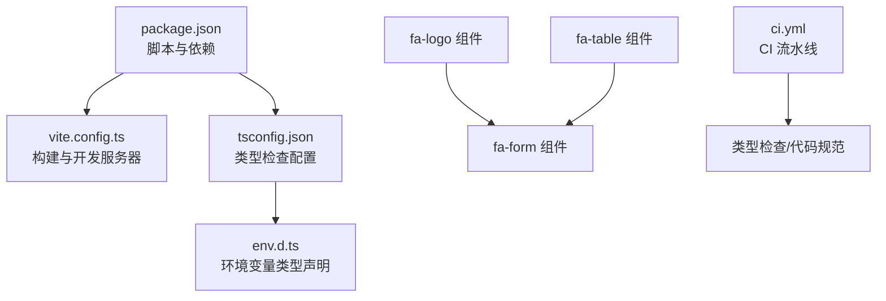
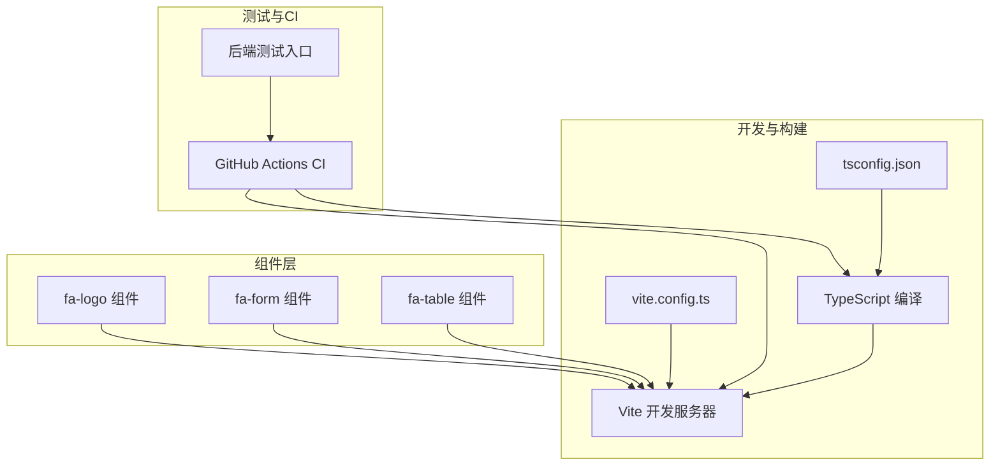
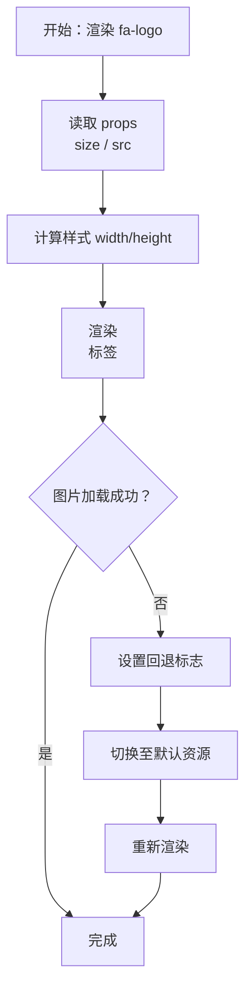
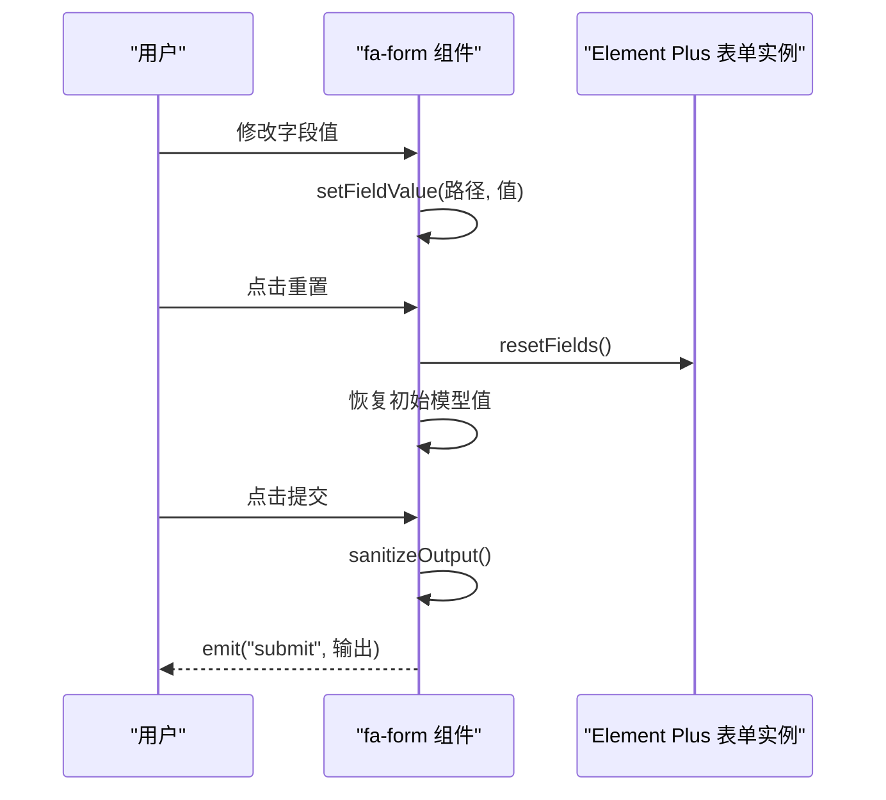
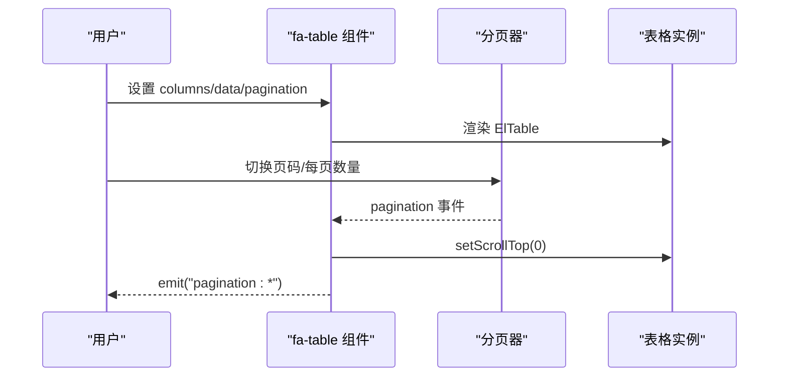
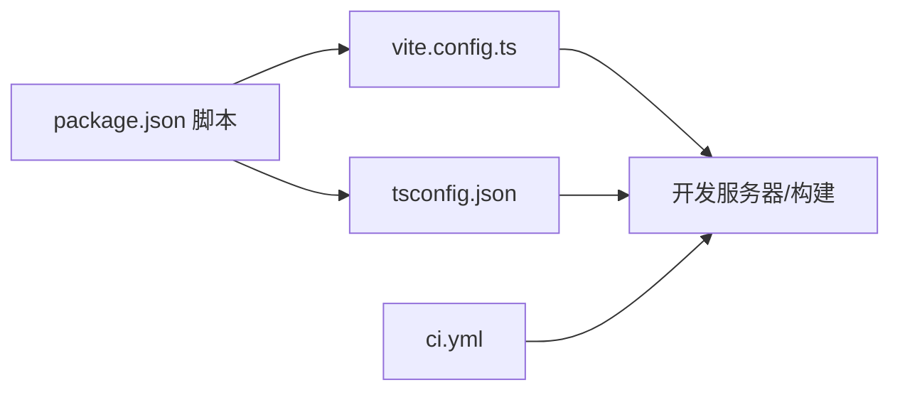

# 组件测试规范

<cite>
**本文引用的文件**
- [package.json](file://frontend/web/package.json)
- [vite.config.ts](file://frontend/web/vite.config.ts)
- [tsconfig.json](file://frontend/web/tsconfig.json)
- [env.d.ts](file://frontend/web/src/types/env.d.ts)
- [fa-logo 组件](file://frontend/web/src/components/base/fa-logo/index.vue)
- [fa-form 组件](file://frontend/web/src/components/forms/fa-form/index.vue)
- [fa-table 组件](file://frontend/web/src/components/tables/fa-table/index.vue)
- [ci.yml](file://frontend/web/.github/workflows/ci.yml)
- [test_main.py](file://backend/tests/test_main.py)
</cite>

## 目录
1. [简介](#简介)
2. [项目结构](#项目结构)
3. [核心组件](#核心组件)
4. [架构总览](#架构总览)
5. [详细组件分析](#详细组件分析)
6. [依赖分析](#依赖分析)
7. [性能考虑](#性能考虑)
8. [故障排查指南](#故障排查指南)
9. [结论](#结论)
10. [附录](#附录)

## 简介
本指南面向 Vue3 组件的测试规范，结合本仓库前端工程现状，系统阐述单元测试、集成测试与端到端测试的实施策略，涵盖环境配置、测试框架选择、断言编写、快照测试、交互测试与视觉回归测试的落地方法。同时给出 Mock 数据与异步测试处理、覆盖率要求、CI 集成与测试报告生成建议，以及组件测试最佳实践，帮助构建完善的组件质量保证体系。

## 项目结构
前端工程采用 Vite + Vue3 + TypeScript 架构，组件位于 src/components 下，遵循按功能域划分的模块化组织。测试相关能力当前主要体现在 CI 流水线中的类型检查与代码规范检查，尚未发现专门的前端组件测试脚本与配置文件。

**图表来源**
- [package.json:1-205](file://frontend/web/package.json#L1-L205)
- [vite.config.ts:1-292](file://frontend/web/vite.config.ts#L1-L292)
- [tsconfig.json:1-39](file://frontend/web/tsconfig.json#L1-L39)
- [env.d.ts:1-72](file://frontend/web/src/types/env.d.ts#L1-L72)
- [fa-logo 组件:1-54](file://frontend/web/src/components/base/fa-logo/index.vue#L1-L54)
- [fa-form 组件:1-620](file://frontend/web/src/components/forms/fa-form/index.vue#L1-L620)
- [fa-table 组件:1-499](file://frontend/web/src/components/tables/fa-table/index.vue#L1-L499)
- [ci.yml:1-60](file://frontend/web/.github/workflows/ci.yml#L1-L60)

**章节来源**
- [package.json:1-205](file://frontend/web/package.json#L1-L205)
- [vite.config.ts:1-292](file://frontend/web/vite.config.ts#L1-L292)
- [tsconfig.json:1-39](file://frontend/web/tsconfig.json#L1-L39)
- [env.d.ts:1-72](file://frontend/web/src/types/env.d.ts#L1-L72)
- [ci.yml:1-60](file://frontend/web/.github/workflows/ci.yml#L1-L60)

## 核心组件
- 基础组件：如系统 Logo 组件，具备默认资源回退与错误处理逻辑，适合进行快照与交互测试。
- 表单组件：动态表单，支持多种 Element Plus 组件类型、插槽与校验，适合单元测试与交互测试。
- 表格组件：封装 ElTable，支持分页、拖拽排序、列渲染与格式化，适合集成测试与视觉回归测试。

**章节来源**
- [fa-logo 组件:1-54](file://frontend/web/src/components/base/fa-logo/index.vue#L1-L54)
- [fa-form 组件:1-620](file://frontend/web/src/components/forms/fa-form/index.vue#L1-L620)
- [fa-table 组件:1-499](file://frontend/web/src/components/tables/fa-table/index.vue#L1-L499)

## 架构总览
下图展示了前端组件测试在当前工程中的位置与关系：Vite 提供开发与构建能力，TypeScript 提供类型保障，CI 流水线负责自动化检查；组件测试应在现有基础设施上扩展。

**图表来源**
- [vite.config.ts:1-292](file://frontend/web/vite.config.ts#L1-L292)
- [tsconfig.json:1-39](file://frontend/web/tsconfig.json#L1-L39)
- [fa-logo 组件:1-54](file://frontend/web/src/components/base/fa-logo/index.vue#L1-L54)
- [fa-form 组件:1-620](file://frontend/web/src/components/forms/fa-form/index.vue#L1-L620)
- [fa-table 组件:1-499](file://frontend/web/src/components/tables/fa-table/index.vue#L1-L499)
- [ci.yml:1-60](file://frontend/web/.github/workflows/ci.yml#L1-L60)
- [test_main.py:1-47](file://backend/tests/test_main.py#L1-L47)

## 详细组件分析

### 基础组件测试（以 fa-logo 为例）
- 测试目标
  - 快照测试：验证组件在不同 size 与 src 下的渲染一致性。
  - 交互测试：模拟图片加载失败，验证回退逻辑。
  - 环境配置：通过 Vite 与 TypeScript 提供的类型与别名支持，确保测试环境稳定。
- 关键点
  - Props 输入（size、src）与样式计算。
  - 图片错误回调与回退标志位。
  - 响应式依赖（watch）在 src 变更时重置回退标志。
- 建议断言
  - DOM 属性与类名匹配。
  - 回退触发后资源路径切换。
  - 快照与交互流程覆盖。

**图表来源**
- [fa-logo 组件:1-54](file://frontend/web/src/components/base/fa-logo/index.vue#L1-L54)

**章节来源**
- [fa-logo 组件:1-54](file://frontend/web/src/components/base/fa-logo/index.vue#L1-L54)
- [vite.config.ts:1-292](file://frontend/web/vite.config.ts#L1-L292)
- [tsconfig.json:1-39](file://frontend/web/tsconfig.json#L1-L39)

### 表单组件测试（以 fa-form 为例）
- 测试目标
  - 单元测试：校验字段解析、路径写入、空值清洗、按钮样式等纯逻辑。
  - 集成测试：与 Element Plus 表单实例交互，验证 reset 与 submit 事件。
  - 异步测试：表单提交时的异步清洗与事件抛出。
- 关键点
  - 字段路径解析与深层赋值。
  - 空值清洗策略（字符串、数组、对象、富文本）。
  - 按钮布局与响应式断点。
- 建议断言
  - 深拷贝初始值与 reset 行为。
  - 清洗后输出符合预期。
  - 事件发射顺序与参数正确。

**图表来源**
- [fa-form 组件:1-620](file://frontend/web/src/components/forms/fa-form/index.vue#L1-L620)

**章节来源**
- [fa-form 组件:1-620](file://frontend/web/src/components/forms/fa-form/index.vue#L1-L620)

### 表格组件测试（以 fa-table 为例）
- 测试目标
  - 集成测试：验证列渲染、分页联动、拖拽排序、空数据与加载态。
  - 视觉回归测试：在不同分辨率与分页布局下截图对比。
- 关键点
  - 列类型与插槽渲染策略。
  - 分页器布局随窗口宽度变化。
  - 行拖拽与排序事件。
- 建议断言
  - 列渲染与 formatter 输出。
  - 分页事件与滚动行为。
  - 空数据占位与加载指示。

**图表来源**
- [fa-table 组件:1-499](file://frontend/web/src/components/tables/fa-table/index.vue#L1-L499)

**章节来源**
- [fa-table 组件:1-499](file://frontend/web/src/components/tables/fa-table/index.vue#L1-L499)

## 依赖分析
- 构建与开发
  - Vite 提供开发服务器与构建打包，配合 TypeScript 与自动导入插件，降低测试环境搭建成本。
  - 路径别名与类型声明确保组件与测试代码的可维护性。
- 测试生态
  - 当前仓库未发现前端组件测试专用脚本与配置文件，建议在现有脚本基础上扩展。
- CI 集成
  - GitHub Actions 已包含类型检查与代码规范任务，可作为组件测试 CI 的参考模板。

**图表来源**
- [package.json:1-205](file://frontend/web/package.json#L1-L205)
- [vite.config.ts:1-292](file://frontend/web/vite.config.ts#L1-L292)
- [tsconfig.json:1-39](file://frontend/web/tsconfig.json#L1-L39)
- [ci.yml:1-60](file://frontend/web/.github/workflows/ci.yml#L1-L60)

**章节来源**
- [package.json:1-205](file://frontend/web/package.json#L1-L205)
- [vite.config.ts:1-292](file://frontend/web/vite.config.ts#L1-L292)
- [tsconfig.json:1-39](file://frontend/web/tsconfig.json#L1-L39)
- [ci.yml:1-60](file://frontend/web/.github/workflows/ci.yml#L1-L60)

## 性能考虑
- 测试执行性能
  - 使用 Vite 的快速冷启动与热更新特性，缩短测试反馈周期。
  - 将大型组件拆分为更小的单元，减少渲染与断言开销。
- 覆盖率与稳定性
  - 优先保证高风险路径（异步清洗、事件发射、回退逻辑）的覆盖率。
  - 对复杂交互（拖拽、分页）采用最小化断言，聚焦关键行为。

## 故障排查指南
- 常见问题
  - 组件渲染异常：检查 props 传入与响应式依赖是否正确。
  - 事件未触发：确认事件发射时机与参数构造。
  - 快照差异：关注环境变量与主题差异导致的像素级偏差。
- 排查步骤
  - 逐步缩小断言范围，定位具体分支。
  - 使用浏览器开发者工具观察 DOM 与事件流。
  - 在 CI 日志中核对类型检查与构建阶段的错误信息。

**章节来源**
- [fa-form 组件:1-620](file://frontend/web/src/components/forms/fa-form/index.vue#L1-L620)
- [fa-table 组件:1-499](file://frontend/web/src/components/tables/fa-table/index.vue#L1-L499)
- [ci.yml:1-60](file://frontend/web/.github/workflows/ci.yml#L1-L60)

## 结论
本仓库前端工程已具备良好的开发与构建基础，组件测试可在现有 Vite、TypeScript 与 CI 能力之上扩展。建议优先完善单元与集成测试，逐步引入视觉回归与端到端测试，形成从组件到应用的完整质量闭环。

## 附录

### 测试策略与规范清单
- 单元测试
  - 覆盖核心逻辑（字段解析、路径写入、空值清洗、样式计算）。
  - 使用 Mock 数据与纯函数断言，避免真实 DOM 依赖。
- 集成测试
  - 验证组件与 Element Plus 实例的交互（表单、表格）。
  - 断言事件发射顺序与参数正确性。
- 端到端测试
  - 基于真实浏览器环境，覆盖关键用户路径。
  - 与后端健康检查接口协同，确保端到端链路可用。
- 快照测试
  - 对静态组件与空态进行快照比对，识别非预期变更。
- 交互测试
  - 模拟用户操作（点击、输入、拖拽），断言状态与副作用。
- 视觉回归测试
  - 在多分辨率与主题下截图，对比差异阈值。
- 异步测试处理
  - 使用微任务/宏任务时机，等待状态稳定后再断言。
- Mock 数据
  - 为外部依赖（HTTP、存储）提供稳定 Mock，隔离环境因素。
- 覆盖率与报告
  - 设定阈值（如语句/分支/函数/行），生成 HTML 报告并在 CI 中呈现。
- CI 集成
  - 在现有流水线基础上增加测试与覆盖率上传步骤，确保每次提交均执行。

### CI 与后端测试参考
- 前端 CI
  - 类型检查与代码规范已在流水线中执行，可在此基础上增加组件测试任务。
- 后端测试
  - 后端提供统一的健康检查接口，可用于端到端测试前置条件校验。

**章节来源**
- [ci.yml:1-60](file://frontend/web/.github/workflows/ci.yml#L1-L60)
- [test_main.py:1-47](file://backend/tests/test_main.py#L1-L47)