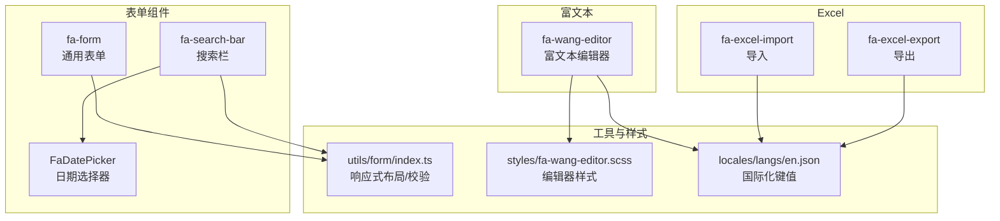
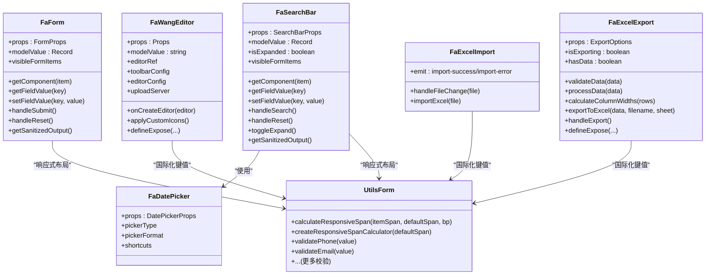
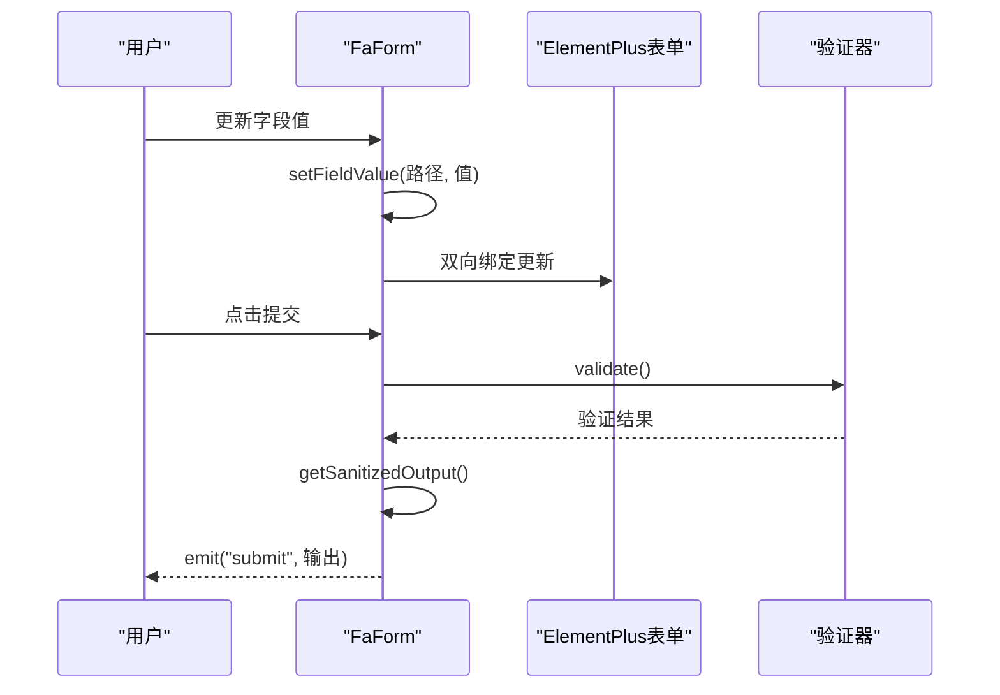
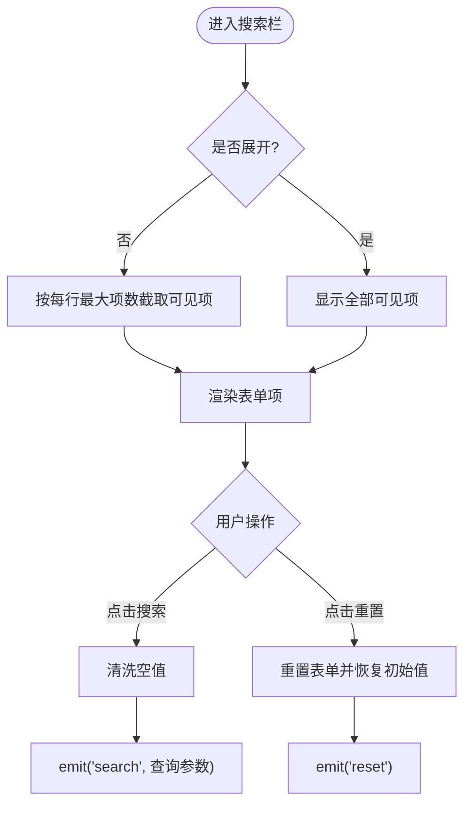
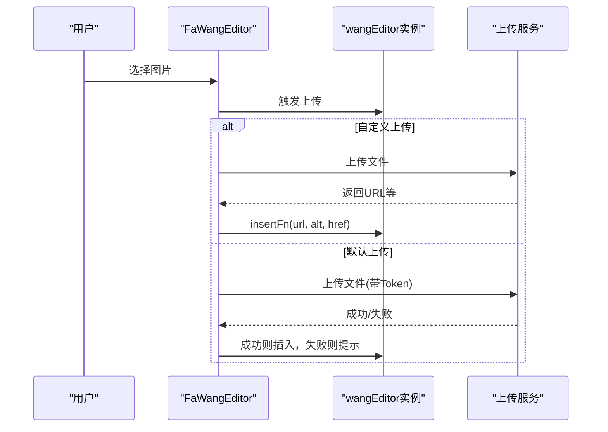
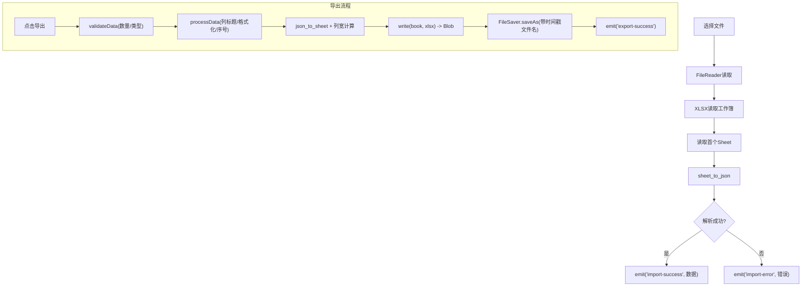
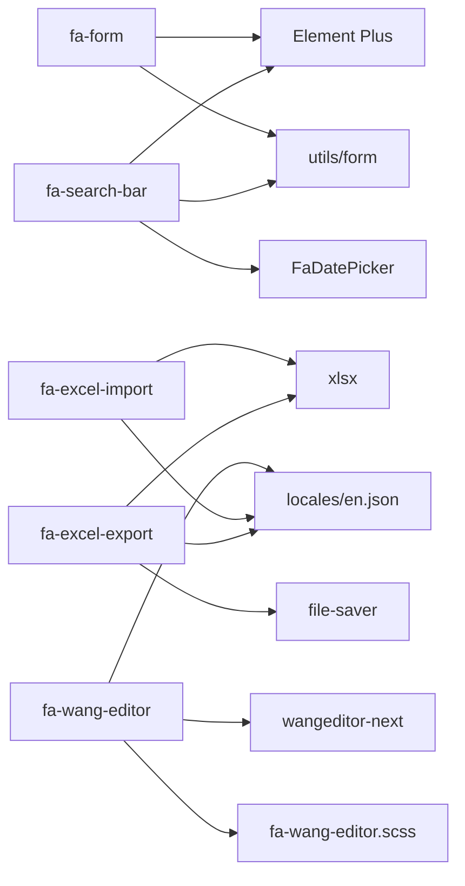

# 表单组件开发

<cite>
**本文档引用的文件**
- [frontend/web/src/components/forms/fa-form/index.vue](file://frontend/web/src/components/forms/fa-form/index.vue)
- [frontend/web/src/components/forms/fa-search-bar/index.vue](file://frontend/web/src/components/forms/fa-search-bar/index.vue)
- [frontend/web/src/components/forms/fa-wang-editor/index.vue](file://frontend/web/src/components/forms/fa-wang-editor/index.vue)
- [frontend/web/src/components/forms/fa-excel-import/index.vue](file://frontend/web/src/components/forms/fa-excel-import/index.vue)
- [frontend/web/src/components/forms/fa-excel-export/index.vue](file://frontend/web/src/components/forms/fa-excel-export/index.vue)
- [frontend/web/src/components/forms/fa-search-bar/FaDatePicker.vue](file://frontend/web/src/components/forms/fa-search-bar/FaDatePicker.vue)
- [frontend/web/src/utils/form/index.ts](file://frontend/web/src/utils/form/index.ts)
- [frontend/web/src/styles/fa-wang-editor.scss](file://frontend/web/src/styles/fa-wang-editor.scss)
- [frontend/web/src/locales/langs/en.json](file://frontend/web/src/locales/langs/en.json)
</cite>

## 目录
1. [简介](#简介)
2. [项目结构](#项目结构)
3. [核心组件](#核心组件)
4. [架构总览](#架构总览)
5. [详细组件分析](#详细组件分析)
6. [依赖关系分析](#依赖关系分析)
7. [性能考虑](#性能考虑)
8. [故障排除指南](#故障排除指南)
9. [结论](#结论)
10. [附录](#附录)

## 简介
本指南面向前端开发者，系统阐述 FastapiAdmin 前端工程中表单相关组件的开发规范与最佳实践，涵盖以下组件：
- 通用表单组件：fa-form
- 搜索栏组件：fa-search-bar
- 富文本编辑器：fa-wang-editor
- Excel 导入/导出组件：fa-excel-import / fa-excel-export

文档重点说明：
- 数据验证、字段映射与提交处理
- 响应式设计、错误提示与用户交互
- 可配置性设计、校验规则与国际化支持
- 测试方法、性能优化与可访问性要求

## 项目结构
表单相关组件集中位于前端工程的组件目录中，采用按功能分层组织：
- 通用表单与搜索栏：基于 Element Plus 表单组件封装，统一字段配置与渲染策略
- 富文本编辑器：基于 wangeditor-next，集成上传与主题样式
- Excel 导入导出：基于 xlsx 与 file-saver，提供事件驱动的导入导出流程

**图表来源**
- [frontend/web/src/components/forms/fa-form/index.vue:1-620](file://frontend/web/src/components/forms/fa-form/index.vue#L1-L620)
- [frontend/web/src/components/forms/fa-search-bar/index.vue:1-588](file://frontend/web/src/components/forms/fa-search-bar/index.vue#L1-L588)
- [frontend/web/src/components/forms/fa-wang-editor/index.vue:1-263](file://frontend/web/src/components/forms/fa-wang-editor/index.vue#L1-L263)
- [frontend/web/src/components/forms/fa-excel-import/index.vue:1-216](file://frontend/web/src/components/forms/fa-excel-import/index.vue#L1-L216)
- [frontend/web/src/components/forms/fa-excel-export/index.vue:1-543](file://frontend/web/src/components/forms/fa-excel-export/index.vue#L1-L543)
- [frontend/web/src/components/forms/fa-search-bar/FaDatePicker.vue:1-137](file://frontend/web/src/components/forms/fa-search-bar/FaDatePicker.vue#L1-L137)
- [frontend/web/src/utils/form/index.ts:1-187](file://frontend/web/src/utils/form/index.ts#L1-L187)
- [frontend/web/src/styles/fa-wang-editor.scss:1-274](file://frontend/web/src/styles/fa-wang-editor.scss#L1-L274)
- [frontend/web/src/locales/langs/en.json:600-634](file://frontend/web/src/locales/langs/en.json#L600-L634)

**章节来源**
- [frontend/web/src/components/forms/fa-form/index.vue:1-620](file://frontend/web/src/components/forms/fa-form/index.vue#L1-L620)
- [frontend/web/src/components/forms/fa-search-bar/index.vue:1-588](file://frontend/web/src/components/forms/fa-search-bar/index.vue#L1-L588)
- [frontend/web/src/components/forms/fa-wang-editor/index.vue:1-263](file://frontend/web/src/components/forms/fa-wang-editor/index.vue#L1-L263)
- [frontend/web/src/components/forms/fa-excel-import/index.vue:1-216](file://frontend/web/src/components/forms/fa-excel-import/index.vue#L1-L216)
- [frontend/web/src/components/forms/fa-excel-export/index.vue:1-543](file://frontend/web/src/components/forms/fa-excel-export/index.vue#L1-L543)
- [frontend/web/src/components/forms/fa-search-bar/FaDatePicker.vue:1-137](file://frontend/web/src/components/forms/fa-search-bar/FaDatePicker.vue#L1-L137)
- [frontend/web/src/utils/form/index.ts:1-187](file://frontend/web/src/utils/form/index.ts#L1-L187)
- [frontend/web/src/styles/fa-wang-editor.scss:1-274](file://frontend/web/src/styles/fa-wang-editor.scss#L1-L274)
- [frontend/web/src/locales/langs/en.json:600-634](file://frontend/web/src/locales/langs/en.json#L600-L634)

## 核心组件
本节概述四大表单组件的功能定位、关键特性与交互模式。

- fa-form（通用表单）
  - 支持 Element Plus 常用表单组件与自定义渲染
  - 动态组件映射与插槽扩展
  - 表单清洗策略与提交输出
  - 国际化按钮文案与响应式布局

- fa-search-bar（搜索栏）
  - 基于 fa-form 的搜索场景封装
  - 展开/收起控制与按钮对齐策略
  - 清洗空值的搜索参数输出
  - 国际化按钮文案与移动端适配

- fa-wang-editor（富文本编辑器）
  - 集成 wangeditor-next，支持工具栏自定义
  - 图片上传配置与自定义上传钩子
  - 主题样式与图标应用
  - 国际化提示与加载状态

- Excel 导入/导出
  - 导入：基于 xlsx，FileReader 读取与事件派发
  - 导出：基于 xlsx 与 file-saver，进度事件与错误处理
  - 可配置列宽、格式化与工作簿元数据

**章节来源**
- [frontend/web/src/components/forms/fa-form/index.vue:191-620](file://frontend/web/src/components/forms/fa-form/index.vue#L191-L620)
- [frontend/web/src/components/forms/fa-search-bar/index.vue:111-588](file://frontend/web/src/components/forms/fa-search-bar/index.vue#L111-L588)
- [frontend/web/src/components/forms/fa-wang-editor/index.vue:20-263](file://frontend/web/src/components/forms/fa-wang-editor/index.vue#L20-L263)
- [frontend/web/src/components/forms/fa-excel-import/index.vue:17-216](file://frontend/web/src/components/forms/fa-excel-import/index.vue#L17-L216)
- [frontend/web/src/components/forms/fa-excel-export/index.vue:21-543](file://frontend/web/src/components/forms/fa-excel-export/index.vue#L21-L543)

## 架构总览
下图展示四大组件的内部结构与相互依赖关系，以及与工具函数、国际化与样式的交互。

**图表来源**
- [frontend/web/src/components/forms/fa-form/index.vue:225-620](file://frontend/web/src/components/forms/fa-form/index.vue#L225-L620)
- [frontend/web/src/components/forms/fa-search-bar/index.vue:138-588](file://frontend/web/src/components/forms/fa-search-bar/index.vue#L138-L588)
- [frontend/web/src/components/forms/fa-wang-editor/index.vue:20-263](file://frontend/web/src/components/forms/fa-wang-editor/index.vue#L20-L263)
- [frontend/web/src/components/forms/fa-excel-import/index.vue:17-216](file://frontend/web/src/components/forms/fa-excel-import/index.vue#L17-L216)
- [frontend/web/src/components/forms/fa-excel-export/index.vue:21-543](file://frontend/web/src/components/forms/fa-excel-export/index.vue#L21-L543)
- [frontend/web/src/components/forms/fa-search-bar/FaDatePicker.vue:19-137](file://frontend/web/src/components/forms/fa-search-bar/FaDatePicker.vue#L19-L137)
- [frontend/web/src/utils/form/index.ts:22-187](file://frontend/web/src/utils/form/index.ts#L22-L187)

## 详细组件分析

### 通用表单组件 fa-form
- 设计要点
  - 通过 items 配置数组驱动渲染，支持 type 映射与 render 自定义
  - 动态插槽与 ElOption/ElCheckbox/ElRadio 等子节点渲染
  - 表单清洗策略：移除空串/空数组/空对象/富文本占位，保留 0/false
  - 国际化按钮文案与响应式布局（移动端按钮对齐策略）

- 关键流程
  - 字段值设置：setFieldValue 支持路径式赋值与自动补齐中间对象/数组
  - 输出清洗：getSanitizedOutput 基于 sanitizeOutputOptions 递归过滤
  - 提交处理：handleSubmit 发出清洗后的结果，reset 重置并恢复初始值

**图表来源**
- [frontend/web/src/components/forms/fa-form/index.vue:394-601](file://frontend/web/src/components/forms/fa-form/index.vue#L394-L601)

**章节来源**
- [frontend/web/src/components/forms/fa-form/index.vue:225-620](file://frontend/web/src/components/forms/fa-form/index.vue#L225-L620)

### 搜索栏组件 fa-search-bar
- 设计要点
  - 在 fa-form 基础上增加展开/收起逻辑与按钮对齐策略
  - 清洗空值的搜索参数输出，避免无效查询参数
  - 国际化按钮文案与移动端样式优化

- 关键流程
  - 展开/收起：toggleExpand 控制 isExpanded，visibleFormItems 仅渲染部分字段
  - 搜索参数清洗：sanitizeOutputValue 递归过滤空值，保留 0/false
  - 搜索触发：handleSearch 发出清洗后的查询参数

**图表来源**
- [frontend/web/src/components/forms/fa-search-bar/index.vue:432-500](file://frontend/web/src/components/forms/fa-search-bar/index.vue#L432-L500)

**章节来源**
- [frontend/web/src/components/forms/fa-search-bar/index.vue:138-588](file://frontend/web/src/components/forms/fa-search-bar/index.vue#L138-L588)

### 富文本编辑器 fa-wang-editor
- 设计要点
  - 工具栏完全可配置：toolbarKeys、insertKeys、excludeKeys
  - 图片上传：默认上传地址与自定义上传钩子
  - 主题样式：SCSS 覆盖编辑器 UI 样式
  - 国际化：加载成功/失败提示文案

- 关键流程
  - 编辑器创建：onCreateEditor 绑定事件与应用自定义图标
  - 上传处理：根据 isCustomUpload 选择默认或自定义上传
  - 实例暴露：getEditor/setHtml/getHtml/clear/focus

**图表来源**
- [frontend/web/src/components/forms/fa-wang-editor/index.vue:140-172](file://frontend/web/src/components/forms/fa-wang-editor/index.vue#L140-L172)

**章节来源**
- [frontend/web/src/components/forms/fa-wang-editor/index.vue:20-263](file://frontend/web/src/components/forms/fa-wang-editor/index.vue#L20-L263)
- [frontend/web/src/styles/fa-wang-editor.scss:1-274](file://frontend/web/src/styles/fa-wang-editor.scss#L1-L274)

### Excel 导入/导出组件
- 导入（fa-excel-import）
  - 使用 xlsx 读取文件，FileReader 异步解析
  - 成功/失败事件：import-success/import-error
  - 业务侧自行进行字段映射与格式化

- 导出（fa-excel-export）
  - 数据验证：类型、数量上限
  - 数据处理：自动序号列、列标题映射、格式化
  - 列宽计算：采样前100行，限制最小/最大宽度
  - 进度事件：before-export/export-success/export-error/export-progress
  - 错误类型：ExportError，包含 code 与 details

**图表来源**
- [frontend/web/src/components/forms/fa-excel-import/index.vue:24-61](file://frontend/web/src/components/forms/fa-excel-import/index.vue#L24-L61)
- [frontend/web/src/components/forms/fa-excel-export/index.vue:135-365](file://frontend/web/src/components/forms/fa-excel-export/index.vue#L135-L365)

**章节来源**
- [frontend/web/src/components/forms/fa-excel-import/index.vue:17-216](file://frontend/web/src/components/forms/fa-excel-import/index.vue#L17-L216)
- [frontend/web/src/components/forms/fa-excel-export/index.vue:21-543](file://frontend/web/src/components/forms/fa-excel-export/index.vue#L21-L543)

## 依赖关系分析
- 组件间耦合
  - fa-search-bar 依赖 FaDatePicker，实现统一的日期/日期范围选择体验
  - fa-form 与 fa-search-bar 共享响应式布局工具函数 calculateResponsiveSpan
- 外部依赖
  - Element Plus：表单组件与 UI 基础
  - xlsx：Excel 导入导出
  - file-saver：浏览器端文件下载
  - wangeditor-next：富文本编辑器
- 国际化与样式
  - 国际化键值集中在 en.json 的 table.form 与 table.searchBar
  - 富文本编辑器样式独立 SCSS 文件

**图表来源**
- [frontend/web/src/components/forms/fa-form/index.vue:200-221](file://frontend/web/src/components/forms/fa-form/index.vue#L200-L221)
- [frontend/web/src/components/forms/fa-search-bar/index.vue:112-134](file://frontend/web/src/components/forms/fa-search-bar/index.vue#L112-L134)
- [frontend/web/src/components/forms/fa-search-bar/FaDatePicker.vue:19-51](file://frontend/web/src/components/forms/fa-search-bar/FaDatePicker.vue#L19-L51)
- [frontend/web/src/components/forms/fa-excel-import/index.vue:18-44](file://frontend/web/src/components/forms/fa-excel-import/index.vue#L18-L44)
- [frontend/web/src/components/forms/fa-excel-export/index.vue:22-27](file://frontend/web/src/components/forms/fa-excel-export/index.vue#L22-L27)
- [frontend/web/src/components/forms/fa-wang-editor/index.vue:21-28](file://frontend/web/src/components/forms/fa-wang-editor/index.vue#L21-L28)
- [frontend/web/src/utils/form/index.ts:22-37](file://frontend/web/src/utils/form/index.ts#L22-L37)
- [frontend/web/src/locales/langs/en.json:600-634](file://frontend/web/src/locales/langs/en.json#L600-L634)
- [frontend/web/src/styles/fa-wang-editor.scss:1-274](file://frontend/web/src/styles/fa-wang-editor.scss#L1-L274)

**章节来源**
- [frontend/web/src/utils/form/index.ts:1-187](file://frontend/web/src/utils/form/index.ts#L1-L187)
- [frontend/web/src/locales/langs/en.json:600-634](file://frontend/web/src/locales/langs/en.json#L600-L634)

## 性能考虑
- 清洗策略
  - fa-form 与 fa-search-bar 在提交/导出前进行空值清洗，减少无效数据传输
  - 保留 0 与 false，避免误删有效值
- 导出优化
  - 列宽计算仅采样前 100 行，平衡准确性与性能
  - 压缩写入 xlsx，降低内存占用
- 事件节流
  - 导出按钮使用节流，防止重复点击导致的并发问题
- 响应式布局
  - 基于断点阈值与回退宽度，避免小屏过度压缩

[本节为通用指导，无需特定文件引用]

## 故障排除指南
- 富文本上传失败
  - 检查上传服务器地址与 Token 注入
  - 自定义上传需返回包含 url 的数据结构
  - 查看控制台错误信息与消息提示
- Excel 导出异常
  - 确认数据类型为数组且未超过 maxRows
  - 检查列配置与格式化函数
  - 监听 export-error 事件获取详细错误码与信息
- 表单字段为空仍提交
  - 确认 sanitizeOutput 配置与默认策略
  - 检查字段路径是否正确（支持嵌套与数组索引）
- 搜索参数未生效
  - 检查 isExpand 与按钮对齐策略
  - 确认 visibleFormItems 的截取逻辑

**章节来源**
- [frontend/web/src/components/forms/fa-wang-editor/index.vue:140-172](file://frontend/web/src/components/forms/fa-wang-editor/index.vue#L140-L172)
- [frontend/web/src/components/forms/fa-excel-export/index.vue:135-151](file://frontend/web/src/components/forms/fa-excel-export/index.vue#L135-L151)
- [frontend/web/src/components/forms/fa-form/index.vue:469-520](file://frontend/web/src/components/forms/fa-form/index.vue#L469-L520)
- [frontend/web/src/components/forms/fa-search-bar/index.vue:432-440](file://frontend/web/src/components/forms/fa-search-bar/index.vue#L432-L440)

## 结论
本指南总结了 FastapiAdmin 表单组件的开发规范与最佳实践，强调：
- 统一的字段配置与动态渲染策略
- 清洗与验证相结合的数据处理
- 响应式布局与国际化的一致性
- 富文本与 Excel 的可配置性与健壮性
- 通过事件与暴露方法实现松耦合的交互

建议在业务中遵循上述规范，结合具体场景进行扩展与定制。

[本节为总结性内容，无需特定文件引用]

## 附录

### 开发规范清单
- 字段配置
  - 使用统一的 FormItem/SearchFormItem 接口，明确 key、label、type/render、options、props、slots
- 清洗策略
  - 提交/搜索/导出前统一进行空值清洗，保留 0/false
  - 富文本占位内容识别与移除
- 响应式与交互
  - 使用 calculateResponsiveSpan 控制列宽，移动端按钮对齐策略
  - 搜索栏展开/收起与可见项截取
- 国际化
  - 按钮文案使用 t("table.form.submit"/"table.searchBar.search") 等键值
- 样式与主题
  - 富文本编辑器样式独立维护，避免全局污染
- 测试与可访问性
  - 表单：模拟字段更新、验证、提交与重置
  - 搜索：切换展开/收起、参数清洗与事件触发
  - 富文本：上传成功/失败、图标应用、全屏状态
  - Excel：导入/导出事件监听、错误处理、进度回调
  - 可访问性：为按钮与输入框提供清晰的标签与提示

**章节来源**
- [frontend/web/src/components/forms/fa-form/index.vue:253-320](file://frontend/web/src/components/forms/fa-form/index.vue#L253-L320)
- [frontend/web/src/components/forms/fa-search-bar/index.vue:166-220](file://frontend/web/src/components/forms/fa-search-bar/index.vue#L166-L220)
- [frontend/web/src/utils/form/index.ts:22-37](file://frontend/web/src/utils/form/index.ts#L22-L37)
- [frontend/web/src/locales/langs/en.json:600-634](file://frontend/web/src/locales/langs/en.json#L600-L634)
- [frontend/web/src/styles/fa-wang-editor.scss:1-274](file://frontend/web/src/styles/fa-wang-editor.scss#L1-L274)