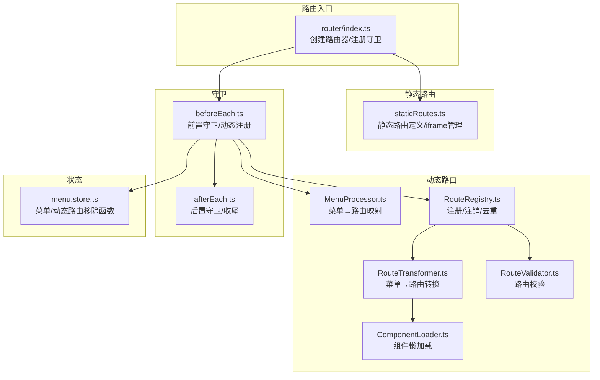
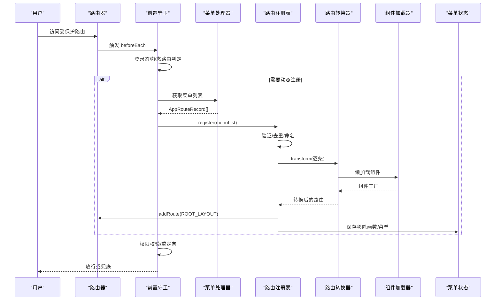
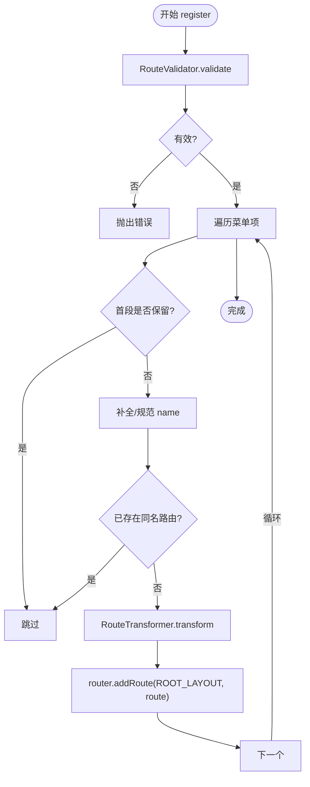
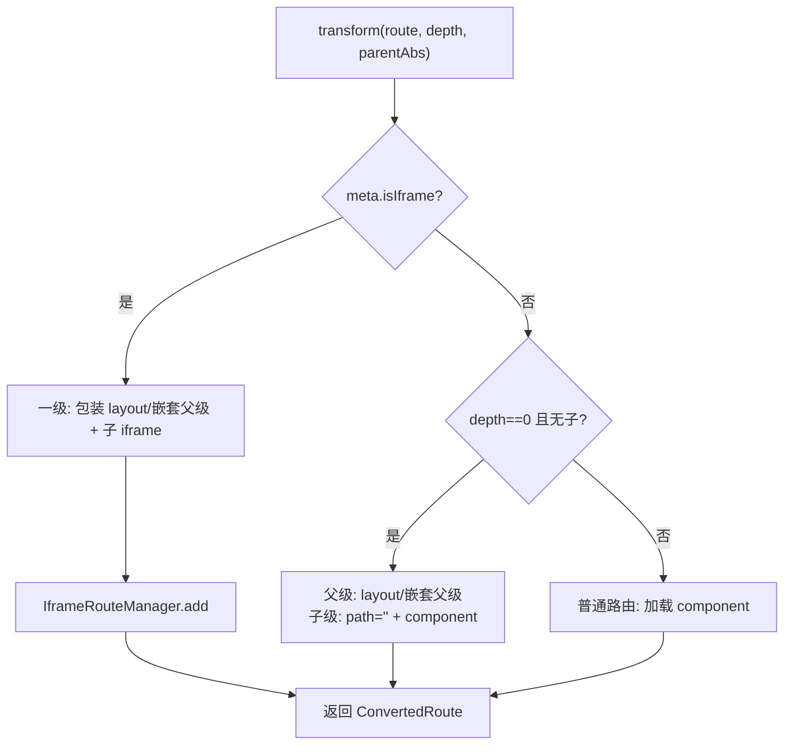
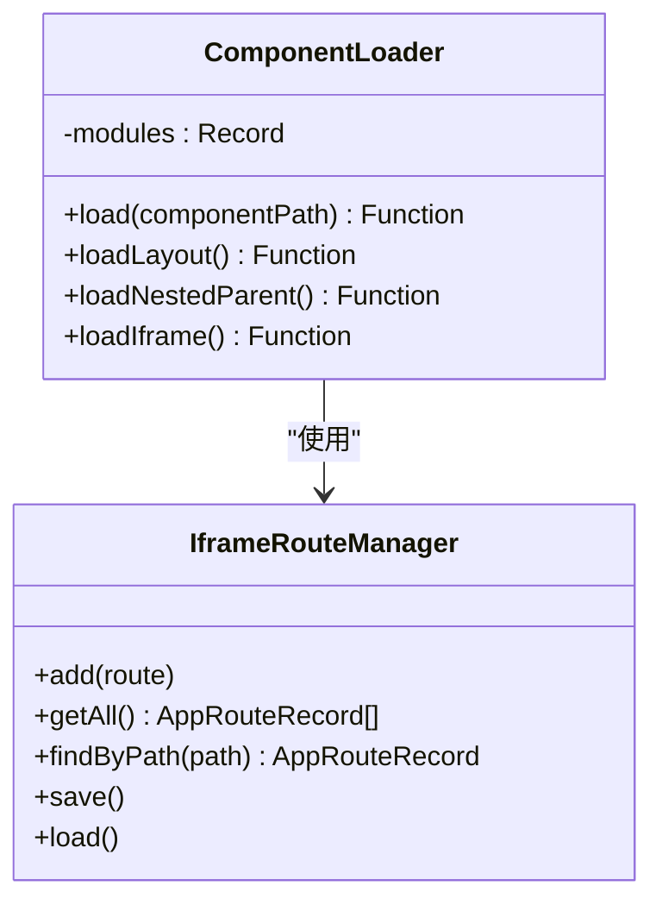
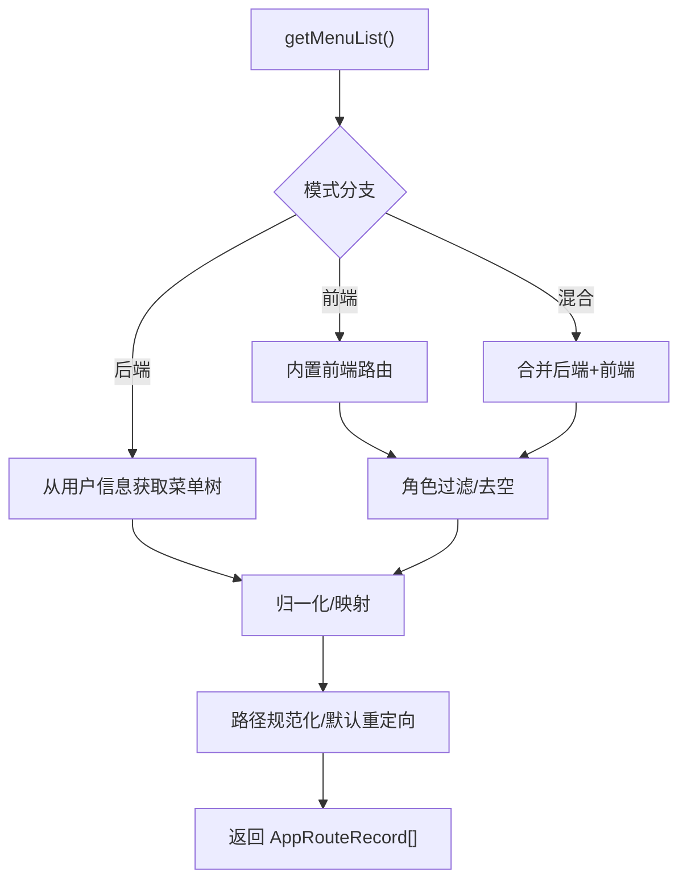
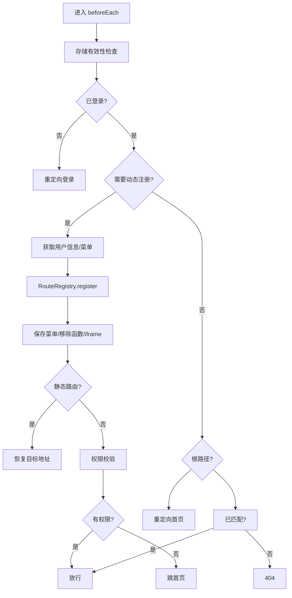
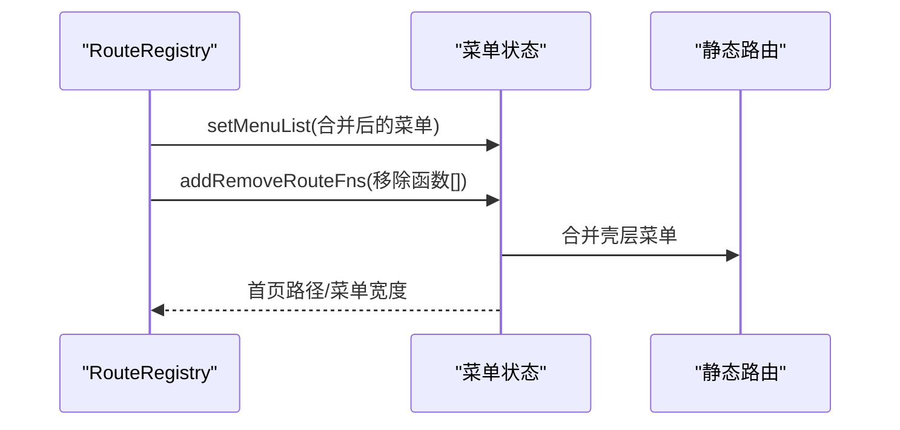
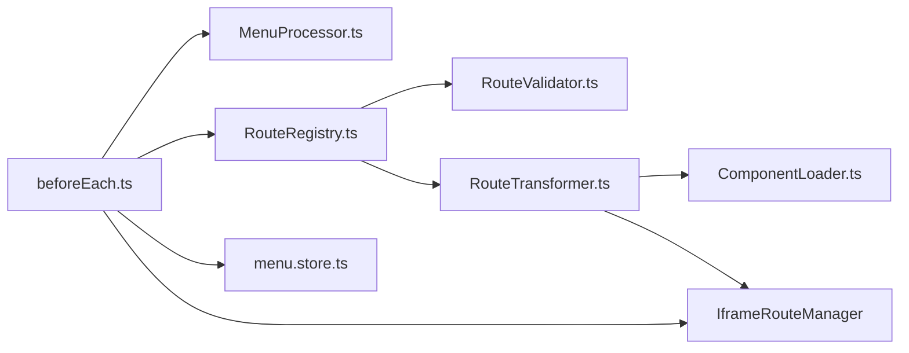

# 动态路由管理

<cite>
**本文档引用的文件**
- [frontend/web/src/router/index.ts](file://frontend/web/src/router/index.ts)
- [frontend/web/src/router/staticRoutes.ts](file://frontend/web/src/router/staticRoutes.ts)
- [frontend/web/src/router/dynamicRoutes.ts](file://frontend/web/src/router/dynamicRoutes.ts)
- [frontend/web/src/router/MenuProcessor.ts](file://frontend/web/src/router/MenuProcessor.ts)
- [frontend/web/src/router/beforeEach.ts](file://frontend/web/src/router/beforeEach.ts)
- [frontend/web/src/router/afterEach.ts](file://frontend/web/src/router/afterEach.ts)
- [frontend/web/src/store/modules/menu.store.ts](file://frontend/web/src/store/modules/menu.store.ts)
- [frontend/web/src/types/router/index.ts](file://frontend/web/src/types/router/index.ts)
- [backend/app/core/router_class.py](file://backend/app/core/router_class.py)
</cite>

## 目录
1. [简介](#简介)
2. [项目结构](#项目结构)
3. [核心组件](#核心组件)
4. [架构总览](#架构总览)
5. [详细组件分析](#详细组件分析)
6. [依赖分析](#依赖分析)
7. [性能考虑](#性能考虑)
8. [故障排查指南](#故障排查指南)
9. [结论](#结论)
10. [附录](#附录)

## 简介
本指南围绕前端动态路由管理展开，系统阐述动态路由的概念、运行时注册机制、RouteRegistry 的工作流程（含路由验证、组件加载、权限检查）、动态路由与菜单系统的联动更新、路由转换器（RouteTransformer）的菜单到路由映射规则、懒加载与性能优化、安全控制与权限验证，以及 iframe 路由与嵌套路由的处理方式。文档以实际代码为依据，辅以可视化图示帮助读者快速理解与落地。

## 项目结构
动态路由相关代码集中在前端路由模块，采用“静态路由 + 动态路由”的双轨设计：
- 静态路由：首屏即注册，无需登录即可访问，包含登录页、异常页、重定向、仪表盘等。
- 动态路由：登录后根据用户菜单权限按需注册，通过 RouteRegistry 统一编排，支持懒加载与 iframe 嵌套。

图表来源
- [frontend/web/src/router/index.ts:1-39](file://frontend/web/src/router/index.ts#L1-L39)
- [frontend/web/src/router/staticRoutes.ts:1-465](file://frontend/web/src/router/staticRoutes.ts#L1-L465)
- [frontend/web/src/router/dynamicRoutes.ts:1-471](file://frontend/web/src/router/dynamicRoutes.ts#L1-L471)
- [frontend/web/src/router/MenuProcessor.ts:1-390](file://frontend/web/src/router/MenuProcessor.ts#L1-L390)
- [frontend/web/src/router/beforeEach.ts:1-519](file://frontend/web/src/router/beforeEach.ts#L1-L519)
- [frontend/web/src/router/afterEach.ts:1-46](file://frontend/web/src/router/afterEach.ts#L1-L46)
- [frontend/web/src/store/modules/menu.store.ts:1-120](file://frontend/web/src/store/modules/menu.store.ts#L1-L120)

章节来源
- [frontend/web/src/router/index.ts:1-39](file://frontend/web/src/router/index.ts#L1-L39)
- [frontend/web/src/router/staticRoutes.ts:1-465](file://frontend/web/src/router/staticRoutes.ts#L1-L465)

## 核心组件
- 路由入口与守卫
  - 路由器创建与静态路由注册、前置/后置守卫初始化。
  - 前置守卫负责登录态校验、动态路由初始化、权限校验与页面标题设置。
- 菜单处理器（MenuProcessor）
  - 将后端菜单树（MenuTable）映射为前端路由记录（AppRouteRecord），并进行路径规范化、权限过滤与默认重定向解析。
- 路由转换器（RouteTransformer）
  - 将 AppRouteRecord 转换为 vue-router 的 RouteRecordRaw，处理 iframe、一级叶子、普通路由与嵌套路径。
- 组件加载器（ComponentLoader）
  - 基于 import.meta.glob 实现视图组件懒加载，并提供 layout、嵌套父级、iframe 等占位组件。
- 路由验证器（RouteValidator）
  - 校验重复路由名、缺失 component、layout 占位误用等问题，输出 errors/warnings。
- 路由注册表（RouteRegistry）
  - 统一注册/注销动态路由，避免与静态壳层冲突，维护移除函数列表。
- iframe 路由管理（IframeRouteManager）
  - 管理 iframe 路由注册、持久化与查找。
- 菜单状态（menu.store）
  - 存储菜单列表、首页路径、动态路由移除函数，支持登出时一键清理。

章节来源
- [frontend/web/src/router/dynamicRoutes.ts:27-156](file://frontend/web/src/router/dynamicRoutes.ts#L27-L156)
- [frontend/web/src/router/dynamicRoutes.ts:159-255](file://frontend/web/src/router/dynamicRoutes.ts#L159-L255)
- [frontend/web/src/router/dynamicRoutes.ts:264-376](file://frontend/web/src/router/dynamicRoutes.ts#L264-L376)
- [frontend/web/src/router/dynamicRoutes.ts:404-470](file://frontend/web/src/router/dynamicRoutes.ts#L404-L470)
- [frontend/web/src/router/staticRoutes.ts:31-79](file://frontend/web/src/router/staticRoutes.ts#L31-L79)
- [frontend/web/src/store/modules/menu.store.ts:42-112](file://frontend/web/src/store/modules/menu.store.ts#L42-L112)

## 架构总览
动态路由的运行时注册流程如下：

图表来源
- [frontend/web/src/router/beforeEach.ts:278-363](file://frontend/web/src/router/beforeEach.ts#L278-L363)
- [frontend/web/src/router/dynamicRoutes.ts:404-451](file://frontend/web/src/router/dynamicRoutes.ts#L404-L451)
- [frontend/web/src/router/MenuProcessor.ts:151-167](file://frontend/web/src/router/MenuProcessor.ts#L151-L167)

## 详细组件分析

### 路由注册表（RouteRegistry）工作流程
- 输入：后端菜单树经 MenuProcessor 转换后的 AppRouteRecord[]。
- 校验：使用 RouteValidator 进行重复名、缺失 component、layout 占位误用等检查。
- 去重：基于首段路径与保留集合（如 home、dashboard 等）避免覆盖静态壳层。
- 转换：使用 RouteTransformer 将菜单映射为路由记录，处理 iframe、一级叶子与普通路由。
- 注册：以 ROOT_LAYOUT 为父级调用 router.addRoute 批量挂载。
- 状态：维护 removeRouteFns 以便登出/切换用户时统一注销。

图表来源
- [frontend/web/src/router/dynamicRoutes.ts:404-451](file://frontend/web/src/router/dynamicRoutes.ts#L404-L451)
- [frontend/web/src/router/dynamicRoutes.ts:27-42](file://frontend/web/src/router/dynamicRoutes.ts#L27-L42)

章节来源
- [frontend/web/src/router/dynamicRoutes.ts:404-470](file://frontend/web/src/router/dynamicRoutes.ts#L404-L470)

### 路由转换器（RouteTransformer）映射规则
- 路径计算：根据深度与父路径决定最终路由 path，支持“壳子子路由”模式。
- iframe 路由：一级 iframe 路由包装为 layout/嵌套父级 + 子 iframe 路由；非一级直接加载 iframe 组件。
- 一级叶子：生成 children=[{path: '', component: 实际组件}]，父级使用 layout 或嵌套父级。
- 普通路由：根据 component 字符串懒加载对应视图组件；shellChild 模式下一级 layout 占位替换为嵌套父级。

图表来源
- [frontend/web/src/router/dynamicRoutes.ts:264-376](file://frontend/web/src/router/dynamicRoutes.ts#L264-L376)
- [frontend/web/src/router/staticRoutes.ts:31-79](file://frontend/web/src/router/staticRoutes.ts#L31-L79)

章节来源
- [frontend/web/src/router/dynamicRoutes.ts:264-376](file://frontend/web/src/router/dynamicRoutes.ts#L264-L376)

### 组件加载器（ComponentLoader）与懒加载策略
- import.meta.glob 预收集 ../views/**/*.vue，支持按需懒加载。
- 特殊占位：layout、嵌套父级、空组件、错误组件。
- iframe 组件：动态读取 IframeRouteManager 中的链接，按需渲染 iframe。
- 性能建议：避免在菜单中重复 component 路径；保持组件路径简洁；利用 keepAlive 控制缓存。

图表来源
- [frontend/web/src/router/dynamicRoutes.ts:159-255](file://frontend/web/src/router/dynamicRoutes.ts#L159-L255)
- [frontend/web/src/router/staticRoutes.ts:31-79](file://frontend/web/src/router/staticRoutes.ts#L31-L79)

章节来源
- [frontend/web/src/router/dynamicRoutes.ts:159-255](file://frontend/web/src/router/dynamicRoutes.ts#L159-L255)

### 菜单处理器（MenuProcessor）与菜单到路由映射
- 菜单树归一化：处理父子路径拼接、相对/绝对路径修正。
- 组件映射：目录/有子节点无 component 时使用占位；叶子节点映射为具体组件路径。
- 权限过滤：根据用户角色过滤不可见菜单。
- 路径校验：确保子级路径不以 / 开头，避免层级错配。
- 默认重定向：自动为父级菜单推导首个可导航子路由作为 redirect。

图表来源
- [frontend/web/src/router/MenuProcessor.ts:151-167](file://frontend/web/src/router/MenuProcessor.ts#L151-L167)
- [frontend/web/src/router/MenuProcessor.ts:169-222](file://frontend/web/src/router/MenuProcessor.ts#L169-L222)
- [frontend/web/src/router/MenuProcessor.ts:241-268](file://frontend/web/src/router/MenuProcessor.ts#L241-L268)
- [frontend/web/src/router/MenuProcessor.ts:274-291](file://frontend/web/src/router/MenuProcessor.ts#L274-L291)

章节来源
- [frontend/web/src/router/MenuProcessor.ts:101-142](file://frontend/web/src/router/MenuProcessor.ts#L101-L142)
- [frontend/web/src/router/MenuProcessor.ts:274-310](file://frontend/web/src/router/MenuProcessor.ts#L274-L310)

### 前置守卫（beforeEach）与权限校验
- 存储有效性检查：异常时登出并重定向登录。
- 登录态校验：未登录且非匿名路径重定向登录。
- 动态路由初始化：首次登录或菜单为空时拉取用户信息、菜单，注册动态路由，保存移除函数与 iframe 路由。
- 权限校验：使用 RoutePermissionValidator 校验目标路径是否在菜单树中或其前缀匹配。
- 静态路由放行：静态路由初始化后直接恢复目标地址。
- 兜底：初始化失败或未授权错误时跳转 500/401。

图表来源
- [frontend/web/src/router/beforeEach.ts:134-182](file://frontend/web/src/router/beforeEach.ts#L134-L182)
- [frontend/web/src/router/beforeEach.ts:278-363](file://frontend/web/src/router/beforeEach.ts#L278-L363)
- [frontend/web/src/router/beforeEach.ts:423-518](file://frontend/web/src/router/beforeEach.ts#L423-L518)

章节来源
- [frontend/web/src/router/beforeEach.ts:134-182](file://frontend/web/src/router/beforeEach.ts#L134-L182)
- [frontend/web/src/router/beforeEach.ts:423-518](file://frontend/web/src/router/beforeEach.ts#L423-L518)

### 后置守卫（afterEach）与收尾
- 滚动置顶、NProgress 结束、关闭 beforeEach 开启的全局 loading。
- 防重复注册，保证用户体验与性能。

章节来源
- [frontend/web/src/router/afterEach.ts:13-45](file://frontend/web/src/router/afterEach.ts#L13-L45)

### 菜单系统联动更新机制
- 菜单状态（menu.store）保存菜单列表与动态路由移除函数，支持登出时一键清理。
- 合并静态壳层：当后端未下发 /home、/dashboard 时，静态路由会补全侧栏菜单。
- 首页路径：根据菜单首项或默认值设置，保障根路径重定向正确。

图表来源
- [frontend/web/src/store/modules/menu.store.ts:58-62](file://frontend/web/src/store/modules/menu.store.ts#L58-L62)
- [frontend/web/src/router/staticRoutes.ts:266-294](file://frontend/web/src/router/staticRoutes.ts#L266-L294)

章节来源
- [frontend/web/src/store/modules/menu.store.ts:42-112](file://frontend/web/src/store/modules/menu.store.ts#L42-L112)
- [frontend/web/src/router/staticRoutes.ts:266-294](file://frontend/web/src/router/staticRoutes.ts#L266-L294)

### iframe 路由管理与嵌套路由处理
- iframe 路由注册：RouteTransformer 在遇到 meta.isIframe 时包装为 layout/嵌套父级 + 子 iframe 路由，并通过 IframeRouteManager 记录。
- 嵌套路由：通过嵌套父级组件（NestedRouterParent）实现多级目录的 RouterView 嵌套。
- 组件加载：ComponentLoader.loadIframe 动态读取链接并渲染 iframe。

章节来源
- [frontend/web/src/router/dynamicRoutes.ts:320-342](file://frontend/web/src/router/dynamicRoutes.ts#L320-L342)
- [frontend/web/src/router/staticRoutes.ts:31-79](file://frontend/web/src/router/staticRoutes.ts#L31-L79)
- [frontend/web/src/router/dynamicRoutes.ts:197-232](file://frontend/web/src/router/dynamicRoutes.ts#L197-L232)

### 安全控制与权限验证
- 前端权限：MenuProcessor 根据用户角色过滤菜单；beforeEach 中使用 RoutePermissionValidator 校验路径权限。
- 后端日志：后端通过自定义 OperationLogRoute 记录操作日志，包含请求路径、方法、参数、响应码、耗时等，便于审计与追踪。
- 存储异常：前置守卫检测存储异常时自动登出，防止状态污染。

章节来源
- [frontend/web/src/router/MenuProcessor.ts:224-239](file://frontend/web/src/router/MenuProcessor.ts#L224-L239)
- [frontend/web/src/router/beforeEach.ts:148-153](file://frontend/web/src/router/beforeEach.ts#L148-L153)
- [backend/app/core/router_class.py:24-165](file://backend/app/core/router_class.py#L24-L165)

## 依赖分析
- 模块耦合
  - beforeEach 依赖 MenuProcessor、RouteRegistry、IframeRouteManager、menu.store。
  - RouteRegistry 依赖 RouteValidator、RouteTransformer、ComponentLoader。
  - RouteTransformer 依赖 ComponentLoader 与 IframeRouteManager。
  - MenuProcessor 依赖静态路由常量与工具函数。
- 关键依赖链
  - 菜单数据 → MenuProcessor → RouteRegistry.register → RouteTransformer → ComponentLoader → router.addRoute。
- 循环依赖规避
  - beforeEach 按需异步导入守卫状态函数，避免静态循环依赖。

图表来源
- [frontend/web/src/router/beforeEach.ts:39-40](file://frontend/web/src/router/beforeEach.ts#L39-L40)
- [frontend/web/src/router/dynamicRoutes.ts:404-417](file://frontend/web/src/router/dynamicRoutes.ts#L404-L417)

章节来源
- [frontend/web/src/router/beforeEach.ts:90-110](file://frontend/web/src/router/beforeEach.ts#L90-L110)
- [frontend/web/src/router/dynamicRoutes.ts:404-417](file://frontend/web/src/router/dynamicRoutes.ts#L404-L417)

## 性能考虑
- 懒加载策略
  - 使用 import.meta.glob 预收集视图组件，按需加载，减少首屏体积。
  - 避免重复 component 路径，减少重复打包与加载。
- KeepAlive 与缓存
  - 通过 meta.keepAlive 控制页面缓存，结合 remountOnFullPath 精细控制重建时机。
- 路由去重与保留
  - 通过首段路径与保留集合避免覆盖静态壳层，减少无效注册。
- 初始化并发控制
  - routeInitInProgress 防止并发导航导致的重复拉取与注册。
- 后端日志开销
  - 通过 settings 控制日志记录开关与方法白名单，降低不必要的 IO。

章节来源
- [frontend/web/src/router/dynamicRoutes.ts:382-390](file://frontend/web/src/router/dynamicRoutes.ts#L382-L390)
- [frontend/web/src/router/beforeEach.ts:67](file://frontend/web/src/router/beforeEach.ts#L67)
- [backend/app/core/router_class.py:57-64](file://backend/app/core/router_class.py#L57-L64)

## 故障排查指南
- 路由验证错误
  - 重复路由名/组件路径：检查 RouteValidator 输出的 warnings/errors，修正重复项。
  - 缺少 component：确保目录/叶子节点配置正确的组件路径或占位。
  - layout 占位误用：二级及以上菜单不应使用 layout 占位，应指向具体组件或留空。
- iframe 路由异常
  - 确认 meta.isIframe 与 meta.link 正确设置；检查 IframeRouteManager 是否保存成功。
- 权限不足
  - 使用 RoutePermissionValidator.validatePath 核对目标路径是否在菜单树中；检查用户角色与菜单 meta.roles。
- 登录态与存储异常
  - 前置守卫会在存储异常时登出并重定向登录；检查本地存储状态。
- 静态路由冲突
  - 避免动态路由 path 与静态路由冲突；注意保留集合（如 home、dashboard）。

章节来源
- [frontend/web/src/router/dynamicRoutes.ts:27-42](file://frontend/web/src/router/dynamicRoutes.ts#L27-L42)
- [frontend/web/src/router/MenuProcessor.ts:351-368](file://frontend/web/src/router/MenuProcessor.ts#L351-L368)
- [frontend/web/src/router/beforeEach.ts:148-153](file://frontend/web/src/router/beforeEach.ts#L148-L153)
- [frontend/web/src/router/beforeEach.ts:344-362](file://frontend/web/src/router/beforeEach.ts#L344-L362)

## 结论
本项目通过“静态路由 + 动态路由”的双轨设计，结合 MenuProcessor、RouteTransformer、ComponentLoader、RouteValidator、RouteRegistry 与 IframeRouteManager，实现了灵活、可扩展、可审计的动态路由管理方案。配合前置/后置守卫与菜单状态管理，既能满足权限控制与用户体验，又能在性能与可维护性之间取得平衡。建议在实际使用中严格遵循映射规则与校验要求，合理使用懒加载与缓存策略，并持续完善权限与日志体系。

## 附录
- 类型定义
  - AppRouteRecord 与 RouteMeta 扩展了标题、图标、权限、缓存、iframe 等字段，支撑菜单与路由的双向映射。
- 枚举
  - 菜单类型（目录/菜单/按钮/外链）与终端类型（PC/APP）用于菜单过滤与渲染控制。

章节来源
- [frontend/web/src/types/router/index.ts:26-147](file://frontend/web/src/types/router/index.ts#L26-L147)
- [frontend/web/src/enums/system/menu.enum.ts:2-13](file://frontend/web/src/enums/system/menu.enum.ts#L2-L13)