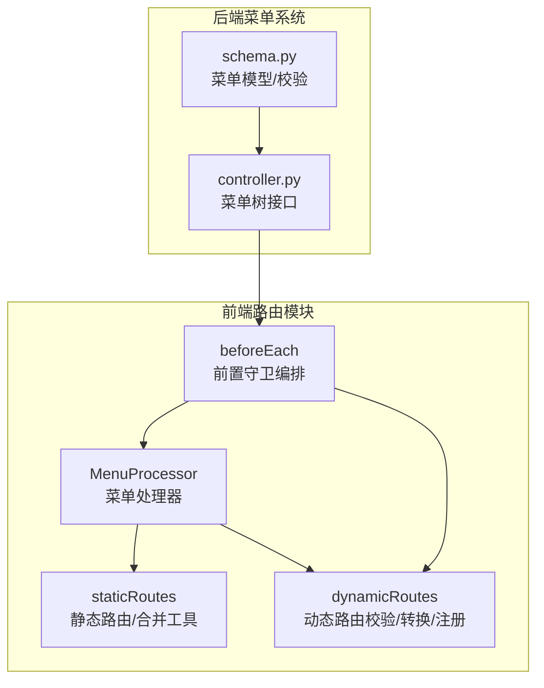
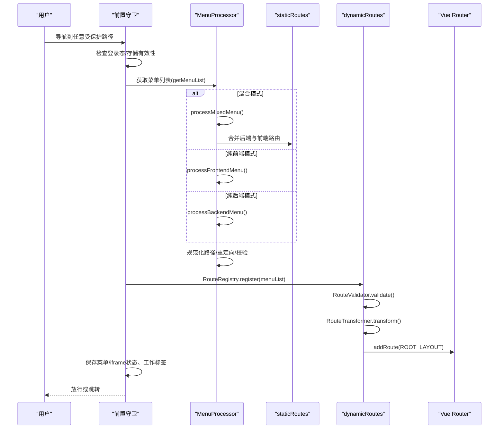
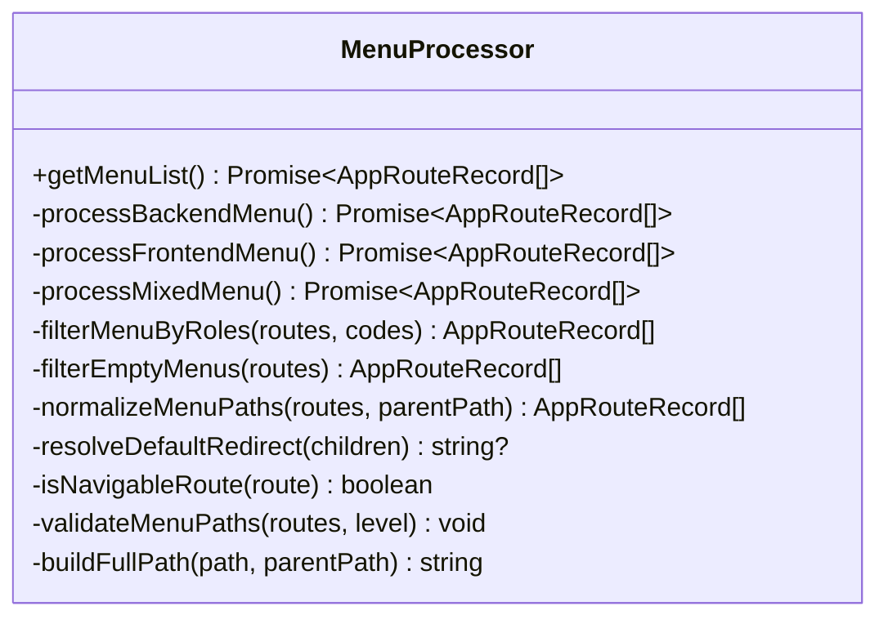
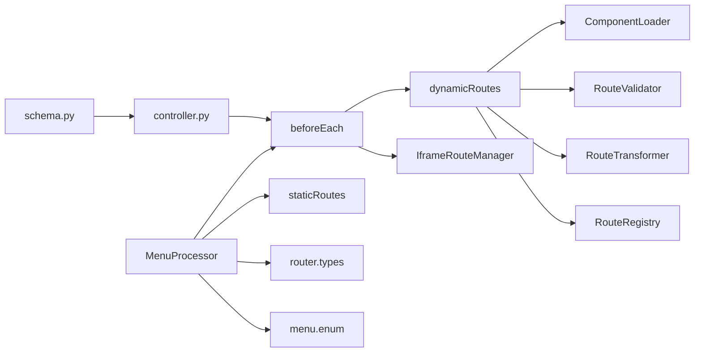

# 菜单处理器

<cite>
**本文档引用的文件**
- [MenuProcessor.ts](file://frontend/web/src/router/MenuProcessor.ts)
- [staticRoutes.ts](file://frontend/web/src/router/staticRoutes.ts)
- [dynamicRoutes.ts](file://frontend/web/src/router/dynamicRoutes.ts)
- [beforeEach.ts](file://frontend/web/src/router/beforeEach.ts)
- [menu.enum.ts](file://frontend/web/src/enums/system/menu.enum.ts)
- [router.types.ts](file://frontend/web/src/types/router/index.ts)
- [controller.py](file://backend/app/api/v1/module_system/menu/controller.py)
- [schema.py](file://backend/app/api/v1/module_system/menu/schema.py)
</cite>

## 目录
1. [简介](#简介)
2. [项目结构](#项目结构)
3. [核心组件](#核心组件)
4. [架构总览](#架构总览)
5. [详细组件分析](#详细组件分析)
6. [依赖分析](#依赖分析)
7. [性能考虑](#性能考虑)
8. [故障排查指南](#故障排查指南)
9. [结论](#结论)
10. [附录](#附录)

## 简介
本文件面向前端工程“菜单处理器”（MenuProcessor）的实现与使用，系统性阐述菜单数据的接收、解析与转换过程，菜单到路由的映射规则（层级、图标、权限），内置前端路由（builtinFrontendRoutes）的扩展机制，以及与后端菜单系统的数据同步与权限联动。同时给出缓存策略、更新机制、测试与调试建议，帮助开发者快速理解并高效维护菜单与路由体系。

## 项目结构
菜单处理器位于前端路由模块，与静态路由、动态路由注册、前置守卫紧密协作，形成“菜单数据 → 路由树 → 注册到路由器”的闭环。

**图表来源**
- [MenuProcessor.ts:151-390](file://frontend/web/src/router/MenuProcessor.ts#L151-L390)
- [staticRoutes.ts:199-465](file://frontend/web/src/router/staticRoutes.ts#L199-L465)
- [dynamicRoutes.ts:27-471](file://frontend/web/src/router/dynamicRoutes.ts#L27-L471)
- [beforeEach.ts:90-363](file://frontend/web/src/router/beforeEach.ts#L90-L363)
- [controller.py:19-44](file://backend/app/api/v1/module_system/menu/controller.py#L19-L44)
- [schema.py:108-168](file://backend/app/api/v1/module_system/menu/schema.py#L108-L168)

**章节来源**
- [MenuProcessor.ts:151-390](file://frontend/web/src/router/MenuProcessor.ts#L151-L390)
- [staticRoutes.ts:199-465](file://frontend/web/src/router/staticRoutes.ts#L199-L465)
- [dynamicRoutes.ts:27-471](file://frontend/web/src/router/dynamicRoutes.ts#L27-L471)
- [beforeEach.ts:90-363](file://frontend/web/src/router/beforeEach.ts#L90-L363)
- [controller.py:19-44](file://backend/app/api/v1/module_system/menu/controller.py#L19-L44)
- [schema.py:108-168](file://backend/app/api/v1/module_system/menu/schema.py#L108-L168)

## 核心组件
- MenuProcessor：负责根据应用模式（纯前端/后端/混合）拉取菜单数据，过滤按钮与空节点，规范化路径与重定向，输出可用于动态注册的路由树。
- staticRoutes：提供静态路由、壳层合并工具、iframe路由管理器、占位组件常量等。
- dynamicRoutes：提供路由校验（RouteValidator）、组件懒加载（ComponentLoader）、路由转换（RouteTransformer）、路由注册表（RouteRegistry）。
- beforeEach：全局前置守卫，编排登录态、动态路由初始化、权限校验与页面标题等工作。
- 后端菜单接口：提供菜单树接口与模型校验，确保后端下发的菜单数据符合前端预期。

**章节来源**
- [MenuProcessor.ts:151-390](file://frontend/web/src/router/MenuProcessor.ts#L151-L390)
- [staticRoutes.ts:199-465](file://frontend/web/src/router/staticRoutes.ts#L199-L465)
- [dynamicRoutes.ts:27-471](file://frontend/web/src/router/dynamicRoutes.ts#L27-L471)
- [beforeEach.ts:90-363](file://frontend/web/src/router/beforeEach.ts#L90-L363)
- [controller.py:19-44](file://backend/app/api/v1/module_system/menu/controller.py#L19-L44)
- [schema.py:108-168](file://backend/app/api/v1/module_system/menu/schema.py#L108-L168)

## 架构总览
菜单处理器在前置守卫中被调用，依据应用模式选择数据源，随后进入动态路由注册阶段，最终完成菜单到路由的映射与注册。

**图表来源**
- [beforeEach.ts:278-363](file://frontend/web/src/router/beforeEach.ts#L278-L363)
- [MenuProcessor.ts:151-390](file://frontend/web/src/router/MenuProcessor.ts#L151-L390)
- [staticRoutes.ts:199-294](file://frontend/web/src/router/staticRoutes.ts#L199-L294)
- [dynamicRoutes.ts:404-471](file://frontend/web/src/router/dynamicRoutes.ts#L404-L471)

## 详细组件分析

### MenuProcessor 类详解
- 数据来源与模式分支
  - 混合模式：优先拉取后端菜单，失败时仅挂载前端内置路由；随后与前端路由合并。
  - 纯前端模式：读取内置前端路由，按角色过滤后返回。
  - 纯后端模式：从用户信息中携带的路由列表直接转换。
- 菜单树处理
  - 过滤按钮类型节点，保留目录与菜单节点。
  - 规范化嵌套路径，确保父子路径一致性。
  - 将菜单节点映射为路由记录，填充 meta（标题、图标、keepAlive、hidden、affix、alwaysShow、client 等）。
  - 规范化子路由路径，避免以“/”开头的非根级路径。
- 权限与可见性
  - 角色过滤：提取用户角色编码，按路由 meta.roles 进行过滤。
  - 空节点过滤：仅保留具有有效组件或 iframe/外链的节点。
- 路径与重定向
  - 校验各级菜单 path 合法性，禁止非根级以“/”开头。
  - 自动推导默认重定向，优先选择可导航的子路由。
- 输出与校验
  - 返回可用于动态注册的 AppRouteRecord[]，并在返回前进行路径合法性检查。

**图表来源**
- [MenuProcessor.ts:151-390](file://frontend/web/src/router/MenuProcessor.ts#L151-L390)

**章节来源**
- [MenuProcessor.ts:151-390](file://frontend/web/src/router/MenuProcessor.ts#L151-L390)

### 菜单到路由映射规则
- 节点类型与组件映射
  - 目录节点或存在子节点且未指定组件时，使用占位组件（根用主布局，多级目录用嵌套父组件）。
  - 指定了组件路径时，使用该路径。
- meta 字段对齐
  - 标题、图标、隐藏、keepAlive、固定标签、始终显示、客户端类型等字段来自后端菜单。
- 路径与层级
  - 根路径保持原样；非根级路径去除“/”前缀，拼接到父路径之后。
  - 外链与 iframe 路由特殊处理，不参与常规路径拼接。
- 重定向策略
  - 若未显式设置 redirect，则自动选择首个可导航子路由作为默认 redirect。

**章节来源**
- [MenuProcessor.ts:101-149](file://frontend/web/src/router/MenuProcessor.ts#L101-L149)
- [MenuProcessor.ts:274-321](file://frontend/web/src/router/MenuProcessor.ts#L274-L321)
- [menu.enum.ts:2-7](file://frontend/web/src/enums/system/menu.enum.ts#L2-L7)
- [router.types.ts:29-147](file://frontend/web/src/types/router/index.ts#L29-L147)

### 内置前端路由（builtinFrontendRoutes）
- 作用
  - 作为“纯前端模式”的菜单数据源，允许在不依赖后端菜单的情况下构建菜单树。
  - 通过扩展该数组，可在前端自定义菜单项，适用于快速原型或独立功能模块。
- 配置方式
  - 在导入处声明并填充 AppRouteRecord[]，MenuProcessor 在纯前端模式下会读取该数组。
  - 支持角色过滤与空节点过滤，保证与后端模式一致的行为。

**章节来源**
- [MenuProcessor.ts:20-21](file://frontend/web/src/router/MenuProcessor.ts#L20-L21)
- [MenuProcessor.ts:169-187](file://frontend/web/src/router/MenuProcessor.ts#L169-L187)

### 扩展机制：自定义菜单项
- 在 builtinFrontendRoutes 中添加自定义菜单项，遵循 AppRouteRecord 结构，meta 字段与后端一致。
- 通过角色过滤逻辑，可按用户角色动态显示/隐藏自定义菜单。
- 与后端菜单合并时，注意 name 与 path 的唯一性，避免冲突。

**章节来源**
- [MenuProcessor.ts:224-239](file://frontend/web/src/router/MenuProcessor.ts#L224-L239)
- [staticRoutes.ts:199-229](file://frontend/web/src/router/staticRoutes.ts#L199-L229)

### 菜单数据的缓存策略与更新机制
- 前端缓存
  - 用户信息中携带 routeList（后端下发的路由树），MenuProcessor 优先使用该缓存，避免重复请求菜单树接口。
  - IframeRouteManager 将 iframe 路由持久化到 sessionStorage，页面刷新后可恢复 iframe 页面。
- 更新触发
  - 登录态变化、角色变更、菜单配置变更等场景，可通过重置动态路由状态与重新拉取菜单实现更新。
  - 前置守卫在检测到路由未注册或菜单为空时，会主动卸载动态路由并重新拉取。

**章节来源**
- [MenuProcessor.ts:214-222](file://frontend/web/src/router/MenuProcessor.ts#L214-L222)
- [beforeEach.ts:265-273](file://frontend/web/src/router/beforeEach.ts#L265-L273)
- [beforeEach.ts:380-398](file://frontend/web/src/router/beforeEach.ts#L380-L398)
- [staticRoutes.ts:31-79](file://frontend/web/src/router/staticRoutes.ts#L31-L79)

### 与后端菜单系统的数据同步与权限联动
- 接口与模型
  - 后端提供菜单树接口，返回树形结构的菜单数据，字段与前端 meta 对齐。
  - 请求模型对路由路径、组件路径等进行严格校验，确保前端可用。
- 前端对接
  - 前置守卫在登录后拉取用户信息与菜单树，交由 MenuProcessor 处理，再由 RouteRegistry 注册到路由器。
  - 权限校验基于菜单路径集合与动态路由匹配规则，支持前缀匹配与动态路由参数匹配。

**章节来源**
- [controller.py:19-44](file://backend/app/api/v1/module_system/menu/controller.py#L19-L44)
- [schema.py:108-168](file://backend/app/api/v1/module_system/menu/schema.py#L108-L168)
- [beforeEach.ts:288-306](file://frontend/web/src/router/beforeEach.ts#L288-L306)
- [dynamicRoutes.ts:420-518](file://frontend/web/src/router/dynamicRoutes.ts#L420-L518)

## 依赖分析
- 模块耦合
  - MenuProcessor 依赖应用模式钩子、用户信息存储、静态路由合并工具、菜单枚举与类型定义。
  - 前置守卫依赖 MenuProcessor、RouteRegistry、IframeRouteManager、权限校验器。
  - 动态路由模块提供校验、转换与注册能力，解耦菜单树与路由器。
- 外部依赖
  - 后端菜单树接口与模型校验，确保数据质量与一致性。

**图表来源**
- [MenuProcessor.ts:151-390](file://frontend/web/src/router/MenuProcessor.ts#L151-L390)
- [beforeEach.ts:90-363](file://frontend/web/src/router/beforeEach.ts#L90-L363)
- [staticRoutes.ts:199-465](file://frontend/web/src/router/staticRoutes.ts#L199-L465)
- [dynamicRoutes.ts:27-471](file://frontend/web/src/router/dynamicRoutes.ts#L27-L471)
- [controller.py:19-44](file://backend/app/api/v1/module_system/menu/controller.py#L19-L44)
- [schema.py:108-168](file://backend/app/api/v1/module_system/menu/schema.py#L108-L168)

**章节来源**
- [MenuProcessor.ts:151-390](file://frontend/web/src/router/MenuProcessor.ts#L151-L390)
- [beforeEach.ts:90-363](file://frontend/web/src/router/beforeEach.ts#L90-L363)
- [staticRoutes.ts:199-465](file://frontend/web/src/router/staticRoutes.ts#L199-L465)
- [dynamicRoutes.ts:27-471](file://frontend/web/src/router/dynamicRoutes.ts#L27-L471)
- [controller.py:19-44](file://backend/app/api/v1/module_system/menu/controller.py#L19-L44)
- [schema.py:108-168](file://backend/app/api/v1/module_system/menu/schema.py#L108-L168)

## 性能考虑
- 路由懒加载：ComponentLoader 通过 import.meta.glob 按需加载视图组件，减少首屏体积。
- 路由校验：RouteValidator 在注册前进行重复名、缺失组件、非法嵌套等校验，避免运行期错误与重复渲染。
- 路由复用：keepAlive 与 remountOnFullPath 等 meta 字段配合，优化页面缓存与参数变化时的刷新策略。
- 菜单缓存：优先使用用户信息中的 routeList，减少网络请求与重复计算。

[本节为通用指导，无需特定文件引用]

## 故障排查指南
- 路由路径错误
  - 现象：控制台输出“路径配置错误”，提示某级菜单 path 不能以“/”开头。
  - 处理：将子级路径改为相对路径，由处理器自动拼接父路径。
- 缺少组件
  - 现象：校验报错“一级菜单缺少 component，必须指向主布局”或“路由缺少 component 配置”。
  - 处理：为目录或叶子节点正确配置组件路径或使用占位组件。
- 嵌套布局误用
  - 现象：二级及以上菜单使用了主布局占位组件。
  - 处理：改为具体组件路径或目录占位组件。
- iframe/外链异常
  - 现象：iframe 无法加载或外链跳转异常。
  - 处理：确认 meta.link 与 isIframe 配置正确，检查 IframeRouteManager 的保存/加载逻辑。
- 权限不足
  - 现象：导航被重定向至首页或 404。
  - 处理：检查用户角色与路由 meta.roles，确认菜单权限配置。

**章节来源**
- [MenuProcessor.ts:323-368](file://frontend/web/src/router/MenuProcessor.ts#L323-L368)
- [dynamicRoutes.ts:27-156](file://frontend/web/src/router/dynamicRoutes.ts#L27-L156)
- [dynamicRoutes.ts:159-255](file://frontend/web/src/router/dynamicRoutes.ts#L159-L255)
- [staticRoutes.ts:31-79](file://frontend/web/src/router/staticRoutes.ts#L31-L79)
- [beforeEach.ts:422-518](file://frontend/web/src/router/beforeEach.ts#L422-L518)

## 结论
MenuProcessor 将后端菜单树与前端路由系统无缝衔接，通过清晰的映射规则、严格的校验与灵活的扩展点，实现了菜单到路由的高可靠转换。结合静态路由合并、动态路由注册与前置守卫编排，整体方案具备良好的可维护性与扩展性。建议在实际开发中：
- 严格遵循菜单类型与路径规范；
- 合理使用 keepAlive 与 meta 字段；
- 通过内置前端路由扩展自定义菜单；
- 借助校验器与日志定位问题，保障上线质量。

[本节为总结，无需特定文件引用]

## 附录

### 测试方法与调试技巧
- 单元测试
  - 对 MenuProcessor 的关键方法（如 normalizeMenuPaths、filterEmptyMenus、filterMenuByRoles）编写单元测试，覆盖边界条件与错误场景。
- 集成测试
  - 在 beforeEach 场景下模拟登录、菜单拉取、动态注册与权限校验，验证全流程。
- 调试技巧
  - 使用浏览器开发者工具断点于前置守卫与 MenuProcessor，观察菜单树结构与路由注册结果。
  - 打开控制台查看路径校验与组件加载错误信息，快速定位配置问题。

[本节为通用指导，无需特定文件引用]