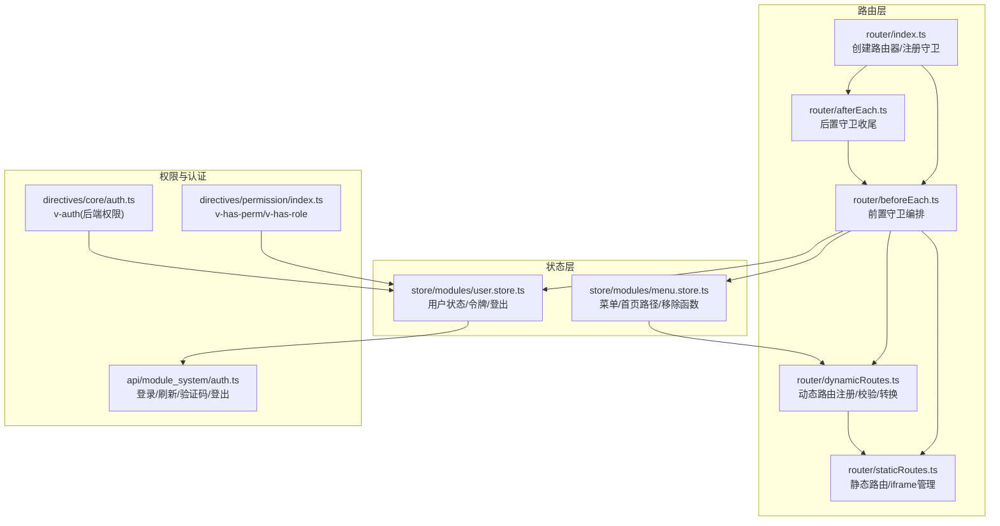
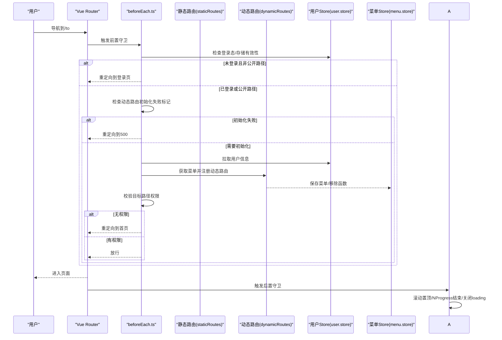
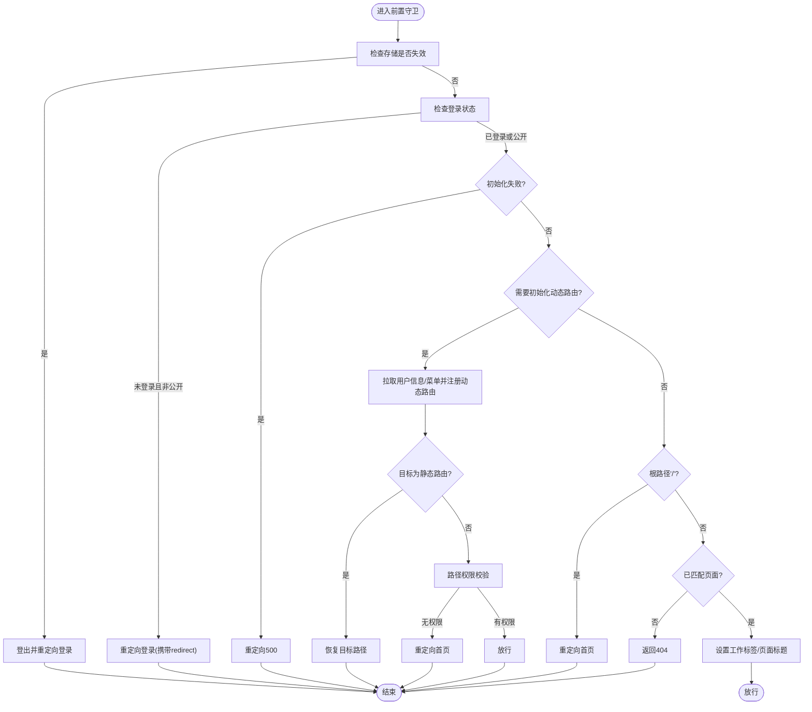
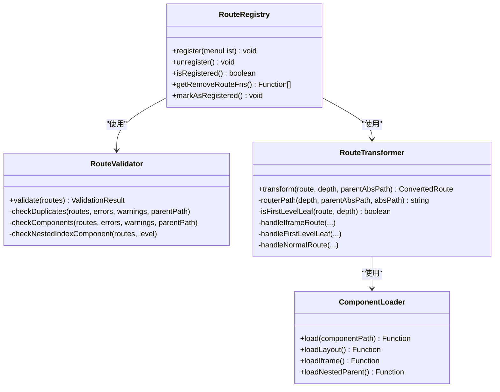
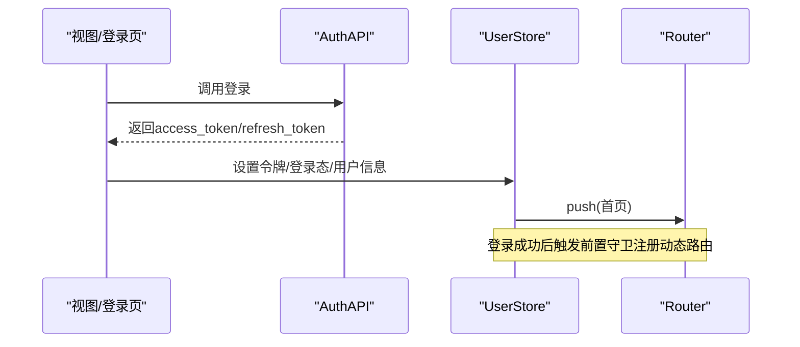
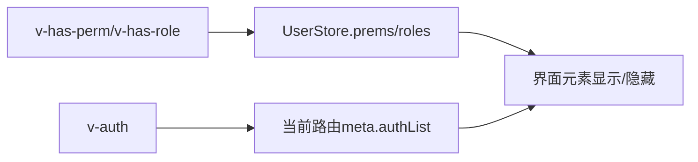
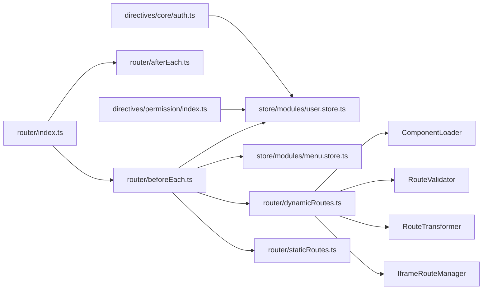

# 路由守卫机制

<cite>
**本文引用的文件**
- [router/beforeEach.ts](file://frontend/web/src/router/beforeEach.ts)
- [router/afterEach.ts](file://frontend/web/src/router/afterEach.ts)
- [router/index.ts](file://frontend/web/src/router/index.ts)
- [router/staticRoutes.ts](file://frontend/web/src/router/staticRoutes.ts)
- [router/dynamicRoutes.ts](file://frontend/web/src/router/dynamicRoutes.ts)
- [store/modules/user.store.ts](file://frontend/web/src/store/modules/user.store.ts)
- [store/modules/menu.store.ts](file://frontend/web/src/store/modules/menu.store.ts)
- [directives/permission/index.ts](file://frontend/web/src/directives/permission/index.ts)
- [directives/core/auth.ts](file://frontend/web/src/directives/core/auth.ts)
- [api/module_system/auth.ts](file://frontend/web/src/api/module_system/auth.ts)
- [utils/storage/index.ts](file://frontend/web/src/utils/storage/index.ts)
</cite>

## 目录
1. [简介](#简介)
2. [项目结构](#项目结构)
3. [核心组件](#核心组件)
4. [架构总览](#架构总览)
5. [详细组件分析](#详细组件分析)
6. [依赖关系分析](#依赖关系分析)
7. [性能考量](#性能考量)
8. [故障排查指南](#故障排查指南)
9. [结论](#结论)
10. [附录](#附录)

## 简介
本文件系统性阐述前端路由守卫机制，围绕 Vue Router 的前置守卫（beforeEach）与后置守卫（afterEach），详解登录验证、动态路由注册、权限校验（菜单/按钮/页面访问控制）、错误与异常处理、执行顺序与优先级、调试方法与性能优化策略，并给出与认证系统的集成最佳实践。

## 项目结构
路由守卫相关代码集中在前端 web/src/router 目录，配合 Pinia Store（用户、菜单）与指令（权限控制）共同完成完整的鉴权与导航编排。

图表来源
- [router/index.ts:1-39](file://frontend/web/src/router/index.ts#L1-L39)
- [router/beforeEach.ts:1-519](file://frontend/web/src/router/beforeEach.ts#L1-L519)
- [router/afterEach.ts:1-46](file://frontend/web/src/router/afterEach.ts#L1-L46)
- [router/staticRoutes.ts:1-465](file://frontend/web/src/router/staticRoutes.ts#L1-L465)
- [router/dynamicRoutes.ts:1-471](file://frontend/web/src/router/dynamicRoutes.ts#L1-L471)
- [store/modules/user.store.ts:1-423](file://frontend/web/src/store/modules/user.store.ts#L1-L423)
- [store/modules/menu.store.ts:1-120](file://frontend/web/src/store/modules/menu.store.ts#L1-L120)
- [directives/permission/index.ts:1-78](file://frontend/web/src/directives/permission/index.ts#L1-L78)
- [directives/core/auth.ts:1-67](file://frontend/web/src/directives/core/auth.ts#L1-L67)
- [api/module_system/auth.ts:1-125](file://frontend/web/src/api/module_system/auth.ts#L1-L125)

章节来源
- [router/index.ts:1-39](file://frontend/web/src/router/index.ts#L1-L39)
- [router/beforeEach.ts:1-519](file://frontend/web/src/router/beforeEach.ts#L1-L519)
- [router/afterEach.ts:1-46](file://frontend/web/src/router/afterEach.ts#L1-L46)
- [router/staticRoutes.ts:1-465](file://frontend/web/src/router/staticRoutes.ts#L1-L465)
- [router/dynamicRoutes.ts:1-471](file://frontend/web/src/router/dynamicRoutes.ts#L1-L471)
- [store/modules/user.store.ts:1-423](file://frontend/web/src/store/modules/user.store.ts#L1-L423)
- [store/modules/menu.store.ts:1-120](file://frontend/web/src/store/modules/menu.store.ts#L1-L120)
- [directives/permission/index.ts:1-78](file://frontend/web/src/directives/permission/index.ts#L1-L78)
- [directives/core/auth.ts:1-67](file://frontend/web/src/directives/core/auth.ts#L1-L67)
- [api/module_system/auth.ts:1-125](file://frontend/web/src/api/module_system/auth.ts#L1-L125)

## 核心组件
- 前置守卫（beforeEach）：统一编排登录态校验、动态路由初始化、根路径重定向、工作标签与页面标题设置、404/500兜底。
- 后置守卫（afterEach）：滚动置顶、NProgress 结束、关闭全局 loading。
- 动态路由注册：菜单拉取 → 校验 → 转换 → addRoute → 保存到菜单 Store 与移除函数列表。
- 权限控制：菜单路径权限校验（RoutePermissionValidator）、按钮/角色指令（v-has-perm/v-has-role/v-auth）。
- 认证集成：用户 Store 管理令牌、登录/登出、刷新 Token；AuthAPI 提供登录接口。

章节来源
- [router/beforeEach.ts:134-182](file://frontend/web/src/router/beforeEach.ts#L134-L182)
- [router/afterEach.ts:13-45](file://frontend/web/src/router/afterEach.ts#L13-L45)
- [router/dynamicRoutes.ts:404-471](file://frontend/web/src/router/dynamicRoutes.ts#L404-L471)
- [directives/permission/index.ts:9-77](file://frontend/web/src/directives/permission/index.ts#L9-L77)
- [store/modules/user.store.ts:237-312](file://frontend/web/src/store/modules/user.store.ts#L237-L312)
- [api/module_system/auth.ts:8-75](file://frontend/web/src/api/module_system/auth.ts#L8-L75)

## 架构总览
路由守卫在应用启动时注册，形成“导航生命周期”的核心编排中枢。前置守卫负责安全与资源准备，后置守卫负责用户体验收尾。

图表来源
- [router/beforeEach.ts:101-182](file://frontend/web/src/router/beforeEach.ts#L101-L182)
- [router/beforeEach.ts:278-363](file://frontend/web/src/router/beforeEach.ts#L278-L363)
- [router/afterEach.ts:27-44](file://frontend/web/src/router/afterEach.ts#L27-L44)
- [router/staticRoutes.ts:306-464](file://frontend/web/src/router/staticRoutes.ts#L306-L464)
- [router/dynamicRoutes.ts:404-471](file://frontend/web/src/router/dynamicRoutes.ts#L404-L471)
- [store/modules/user.store.ts:177-189](file://frontend/web/src/store/modules/user.store.ts#L177-L189)
- [store/modules/menu.store.ts:58-62](file://frontend/web/src/store/modules/menu.store.ts#L58-L62)

## 详细组件分析

### 前置守卫（beforeEach）执行流程
- 登录态与存储有效性检查：若存储异常则强制登出并重定向。
- 登录状态处理：已登录访问登录页则重定向首页；未登录访问非公开路径重定向登录页并携带 redirect。
- 动态路由初始化失败兜底：一旦初始化失败，后续导航直接走 500 页面，避免死循环。
- 动态路由注册：拉取用户信息 → 获取菜单 → 校验 → 注册 → 保存到菜单 Store → 保存 iframe 路由 → 校验工作标签 → 若目标为静态路由则直接恢复；否则进行路径权限校验，无权限则跳首页。
- 根路径重定向：将 “/” 重定向到首页（从菜单或默认值推断）。
- 已匹配页面：设置工作标签与页面标题；否则返回 404。

图表来源
- [router/beforeEach.ts:134-182](file://frontend/web/src/router/beforeEach.ts#L134-L182)
- [router/beforeEach.ts:184-202](file://frontend/web/src/router/beforeEach.ts#L184-L202)
- [router/beforeEach.ts:278-363](file://frontend/web/src/router/beforeEach.ts#L278-L363)
- [router/beforeEach.ts:404-413](file://frontend/web/src/router/beforeEach.ts#L404-L413)
- [router/beforeEach.ts:422-518](file://frontend/web/src/router/beforeEach.ts#L422-L518)

章节来源
- [router/beforeEach.ts:101-182](file://frontend/web/src/router/beforeEach.ts#L101-L182)
- [router/beforeEach.ts:184-202](file://frontend/web/src/router/beforeEach.ts#L184-L202)
- [router/beforeEach.ts:278-363](file://frontend/web/src/router/beforeEach.ts#L278-L363)
- [router/beforeEach.ts:404-413](file://frontend/web/src/router/beforeEach.ts#L404-L413)
- [router/beforeEach.ts:422-518](file://frontend/web/src/router/beforeEach.ts#L422-L518)

### 后置守卫（afterEach）执行流程
- 滚动置顶：确保每次导航后页面回到顶部。
- 进度条收尾：根据设置决定是否显示 NProgress，并在完成后移除。
- 关闭全局 loading：若前置守卫开启过 loading，则在此关闭。

章节来源
- [router/afterEach.ts:13-45](file://frontend/web/src/router/afterEach.ts#L13-L45)

### 动态路由注册与菜单权限校验
- 菜单拉取与校验：通过 MenuProcessor 获取菜单，RouteValidator 校验重复、缺失组件、深层误用 layout 占位等问题。
- 路由转换与注册：RouteTransformer 将 AppRouteRecord 转为 vue-router 记录，ComponentLoader 解析组件路径，最终通过 RouteRegistry 批量 addRoute。
- 菜单路径权限校验：RoutePermissionValidator 对目标路径与菜单路径集合进行匹配，支持动态路由参数匹配与前缀匹配，无权限则跳首页。

图表来源
- [router/dynamicRoutes.ts:27-156](file://frontend/web/src/router/dynamicRoutes.ts#L27-L156)
- [router/dynamicRoutes.ts:159-255](file://frontend/web/src/router/dynamicRoutes.ts#L159-L255)
- [router/dynamicRoutes.ts:264-376](file://frontend/web/src/router/dynamicRoutes.ts#L264-L376)
- [router/dynamicRoutes.ts:404-471](file://frontend/web/src/router/dynamicRoutes.ts#L404-L471)

章节来源
- [router/dynamicRoutes.ts:27-156](file://frontend/web/src/router/dynamicRoutes.ts#L27-L156)
- [router/dynamicRoutes.ts:159-255](file://frontend/web/src/router/dynamicRoutes.ts#L159-L255)
- [router/dynamicRoutes.ts:264-376](file://frontend/web/src/router/dynamicRoutes.ts#L264-L376)
- [router/dynamicRoutes.ts:404-471](file://frontend/web/src/router/dynamicRoutes.ts#L404-L471)

### 登录验证与令牌管理
- 登录：调用 AuthAPI.login，成功后设置令牌、刷新状态、拉取用户信息并标记登录态。
- 刷新 Token：支持刷新接口，更新本地令牌。
- 登出：可选调用后端登出接口，清理状态、移除动态路由、重置守卫状态并跳转登录页。
- 令牌持久化：通过 Auth 工具与用户 Store 管理 access_token/refresh_token。

图表来源
- [api/module_system/auth.ts:14-23](file://frontend/web/src/api/module_system/auth.ts#L14-L23)
- [store/modules/user.store.ts:237-264](file://frontend/web/src/store/modules/user.store.ts#L237-L264)
- [store/modules/user.store.ts:269-312](file://frontend/web/src/store/modules/user.store.ts#L269-L312)

章节来源
- [api/module_system/auth.ts:14-23](file://frontend/web/src/api/module_system/auth.ts#L14-L23)
- [store/modules/user.store.ts:237-264](file://frontend/web/src/store/modules/user.store.ts#L237-L264)
- [store/modules/user.store.ts:269-312](file://frontend/web/src/store/modules/user.store.ts#L269-L312)

### 权限检查机制
- 菜单权限（页面访问控制）：前置守卫中对目标路径进行菜单路径集合匹配，无权限则跳首页。
- 按钮权限（v-has-perm）：指令读取用户权限列表，支持字符串或数组，超级管理员与通配符可绕过。
- 角色权限（v-has-role）：指令读取用户角色列表，支持字符串或数组。
- 后端权限（v-auth）：基于路由 meta.authList 的权限标识进行比对，无权限则移除 DOM。

图表来源
- [directives/permission/index.ts:9-77](file://frontend/web/src/directives/permission/index.ts#L9-L77)
- [directives/core/auth.ts:40-51](file://frontend/web/src/directives/core/auth.ts#L40-L51)
- [store/modules/user.store.ts:210-235](file://frontend/web/src/store/modules/user.store.ts#L210-L235)

章节来源
- [directives/permission/index.ts:9-77](file://frontend/web/src/directives/permission/index.ts#L9-L77)
- [directives/core/auth.ts:40-51](file://frontend/web/src/directives/core/auth.ts#L40-L51)
- [store/modules/user.store.ts:210-235](file://frontend/web/src/store/modules/user.store.ts#L210-L235)

### 执行顺序与优先级管理
- 注册顺序：先注册 beforeEach，再注册 afterEach。
- 守卫内部优先级（前置）：存储有效性 → 登录态 → 初始化失败兜底 → 动态路由注册 → 根路径重定向 → 已匹配页面处理 → 404。
- 动态路由注册期间防止并发：通过“初始化进行中”标记避免重复拉取菜单。
- 初始化失败保护：一旦失败，后续导航直接走 500，避免反复请求。

章节来源
- [router/index.ts:22-27](file://frontend/web/src/router/index.ts#L22-L27)
- [router/beforeEach.ts:139-182](file://frontend/web/src/router/beforeEach.ts#L139-L182)
- [router/beforeEach.ts:163-169](file://frontend/web/src/router/beforeEach.ts#L163-L169)
- [router/beforeEach.ts:158-160](file://frontend/web/src/router/beforeEach.ts#L158-L160)

### 错误处理与异常情况
- 存储异常：检测到存储失效时强制登出并重定向登录。
- 未授权错误（401）：动态路由初始化过程中捕获 401，取消当前导航，等待 axios 拦截器处理登出。
- 初始化失败：捕获异常后置位“初始化失败”，后续导航直接 500。
- 组件缺失：ComponentLoader 未找到组件时输出错误日志并返回占位组件。
- 路由配置错误：RouteValidator 对重复名称、缺失组件、深层误用 layout 占位进行告警/阻断。

章节来源
- [utils/storage/index.ts](file://frontend/web/src/utils/storage/index.ts)
- [router/beforeEach.ts:148-153](file://frontend/web/src/router/beforeEach.ts#L148-L153)
- [router/beforeEach.ts:344-362](file://frontend/web/src/router/beforeEach.ts#L344-L362)
- [router/beforeEach.ts:418-420](file://frontend/web/src/router/beforeEach.ts#L418-L420)
- [router/dynamicRoutes.ts:184-190](file://frontend/web/src/router/dynamicRoutes.ts#L184-L190)
- [router/dynamicRoutes.ts:135-151](file://frontend/web/src/router/dynamicRoutes.ts#L135-L151)

### 与认证系统的集成与最佳实践
- 登录成功后立即清理“初始化失败”标记，避免重新登录后菜单不注册。
- 登出时延迟清理动态路由状态，避免与导航竞态。
- 令牌刷新失败时抛出错误，交由上层处理。
- 静态路由与动态路由分离，静态路由无需权限即可访问，动态路由按菜单注册。

章节来源
- [store/modules/user.store.ts:258-260](file://frontend/web/src/store/modules/user.store.ts#L258-L260)
- [store/modules/user.store.ts:298-299](file://frontend/web/src/store/modules/user.store.ts#L298-L299)
- [router/staticRoutes.ts:296-305](file://frontend/web/src/router/staticRoutes.ts#L296-L305)

## 依赖关系分析
- 路由入口依赖静态路由与守卫注册。
- 前置守卫依赖用户 Store、菜单 Store、动态路由注册器、静态路由白名单与工具集。
- 动态路由注册依赖校验器、转换器、组件加载器与 iframe 管理器。
- 权限指令依赖用户 Store 与当前路由元信息。

图表来源
- [router/index.ts:22-27](file://frontend/web/src/router/index.ts#L22-L27)
- [router/beforeEach.ts:25-40](file://frontend/web/src/router/beforeEach.ts#L25-L40)
- [router/dynamicRoutes.ts:159-255](file://frontend/web/src/router/dynamicRoutes.ts#L159-L255)
- [router/staticRoutes.ts:31-79](file://frontend/web/src/router/staticRoutes.ts#L31-L79)
- [directives/permission/index.ts:3-4](file://frontend/web/src/directives/permission/index.ts#L3-L4)
- [directives/core/auth.ts:35-42](file://frontend/web/src/directives/core/auth.ts#L35-L42)

章节来源
- [router/index.ts:22-27](file://frontend/web/src/router/index.ts#L22-L27)
- [router/beforeEach.ts:25-40](file://frontend/web/src/router/beforeEach.ts#L25-L40)
- [router/dynamicRoutes.ts:159-255](file://frontend/web/src/router/dynamicRoutes.ts#L159-L255)
- [router/staticRoutes.ts:31-79](file://frontend/web/src/router/staticRoutes.ts#L31-L79)
- [directives/permission/index.ts:3-4](file://frontend/web/src/directives/permission/index.ts#L3-L4)
- [directives/core/auth.ts:35-42](file://frontend/web/src/directives/core/auth.ts#L35-L42)

## 性能考量
- 避免重复注册：前置/后置守卫均内置“已注册”标记，开发模式下重复注册会输出警告。
- 并发控制：动态路由初始化期间设置“初始化进行中”标记，防止二次导航导致重复拉取。
- 懒加载组件：通过 import.meta.glob 按需加载视图组件，减少首屏体积。
- NProgress 与全局 loading：仅在必要时开启，后置守卫统一关闭，避免 UI 阻塞。
- 菜单合并与去重：静态壳层与后端菜单合并时去重，避免重复注册路由。

章节来源
- [router/afterEach.ts:13-20](file://frontend/web/src/router/afterEach.ts#L13-L20)
- [router/beforeEach.ts:87-97](file://frontend/web/src/router/beforeEach.ts#L87-L97)
- [router/beforeEach.ts:163-169](file://frontend/web/src/router/beforeEach.ts#L163-L169)
- [router/dynamicRoutes.ts:162-164](file://frontend/web/src/router/dynamicRoutes.ts#L162-L164)
- [router/staticRoutes.ts:199-229](file://frontend/web/src/router/staticRoutes.ts#L199-L229)

## 故障排查指南
- 登录后菜单为空：检查“动态路由初始化失败”标记与“菜单为空”修复逻辑，确认是否需要卸载动态路由并重新初始化。
- 404/500 频繁出现：查看“初始化失败”标记是否被置位；检查菜单校验器错误日志；确认组件路径是否存在。
- 未授权（401）导致卡死：确认 axios 拦截器正确处理 401；前置守卫对 401 导航取消，避免死循环。
- 权限按钮不显示：核对 v-has-perm/v-has-role 传参格式与用户权限/角色列表；确认 v-auth 的 authList 与路由 meta 一致。
- 存储异常：检查存储工具的异常检测逻辑，确认登出后重置标记。

章节来源
- [router/beforeEach.ts:265-273](file://frontend/web/src/router/beforeEach.ts#L265-L273)
- [router/beforeEach.ts:344-362](file://frontend/web/src/router/beforeEach.ts#L344-L362)
- [router/beforeEach.ts:418-420](file://frontend/web/src/router/beforeEach.ts#L418-L420)
- [directives/permission/index.ts:14-18](file://frontend/web/src/directives/permission/index.ts#L14-L18)
- [directives/core/auth.ts:40-51](file://frontend/web/src/directives/core/auth.ts#L40-L51)
- [utils/storage/index.ts](file://frontend/web/src/utils/storage/index.ts)

## 结论
该路由守卫体系以“前置守卫为核心编排器”，结合“后置守卫的用户体验收尾”，实现了登录态校验、动态路由注册、菜单权限校验与异常兜底的闭环。通过严格的路由校验、并发控制与权限指令，既保证了安全性，也兼顾了性能与可维护性。建议在实际项目中遵循“静态路由与动态路由分离、权限校验前置、错误快速兜底”的原则，并持续完善日志与监控。

## 附录
- 路由初始化入口与注册顺序参考：[router/index.ts:22-27](file://frontend/web/src/router/index.ts#L22-L27)
- 前置守卫主流程参考：[router/beforeEach.ts:134-182](file://frontend/web/src/router/beforeEach.ts#L134-L182)
- 动态路由注册器参考：[router/dynamicRoutes.ts:404-471](file://frontend/web/src/router/dynamicRoutes.ts#L404-L471)
- 用户状态与令牌管理参考：[store/modules/user.store.ts:237-312](file://frontend/web/src/store/modules/user.store.ts#L237-L312)
- 菜单权限校验参考：[router/beforeEach.ts:422-518](file://frontend/web/src/router/beforeEach.ts#L422-L518)
- 按钮/角色权限指令参考：[directives/permission/index.ts:9-77](file://frontend/web/src/directives/permission/index.ts#L9-L77)
- 后端权限指令参考：[directives/core/auth.ts:40-51](file://frontend/web/src/directives/core/auth.ts#L40-L51)
- 认证接口参考：[api/module_system/auth.ts:8-75](file://frontend/web/src/api/module_system/auth.ts#L8-L75)